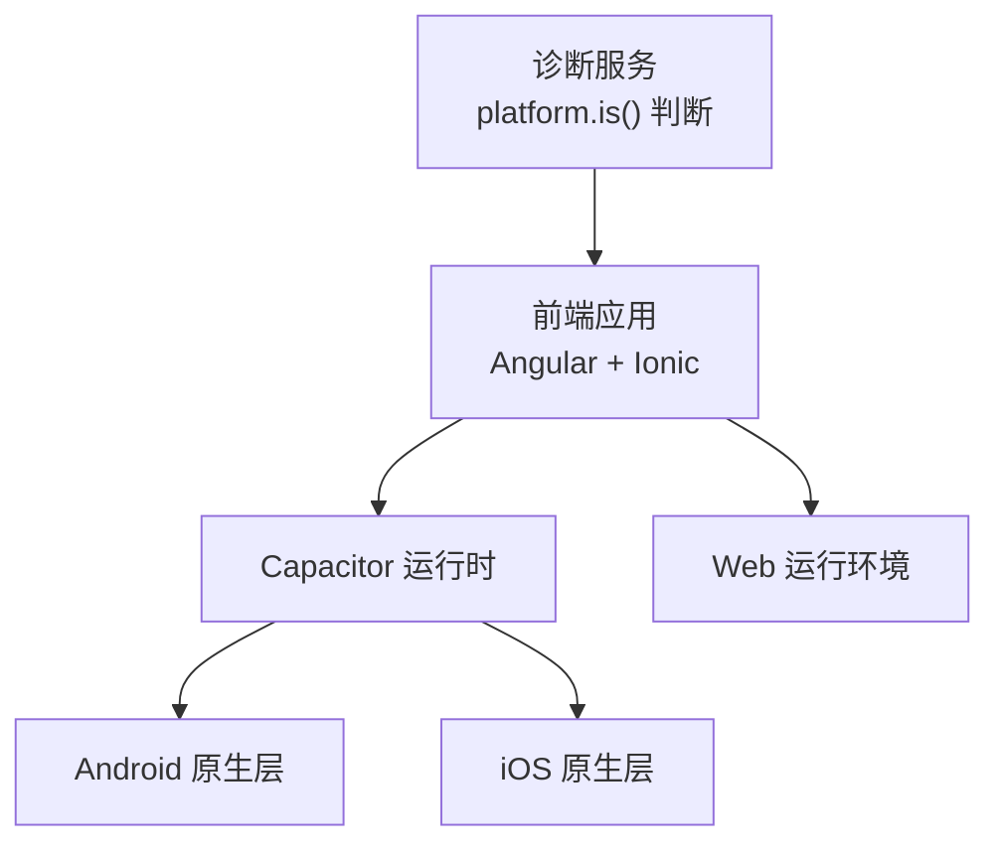
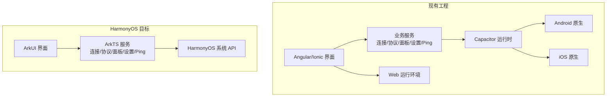
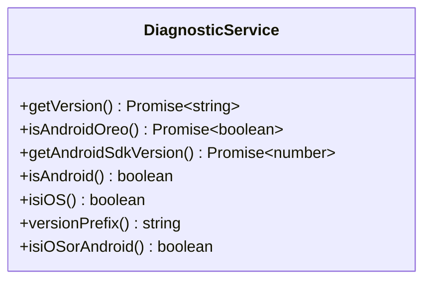
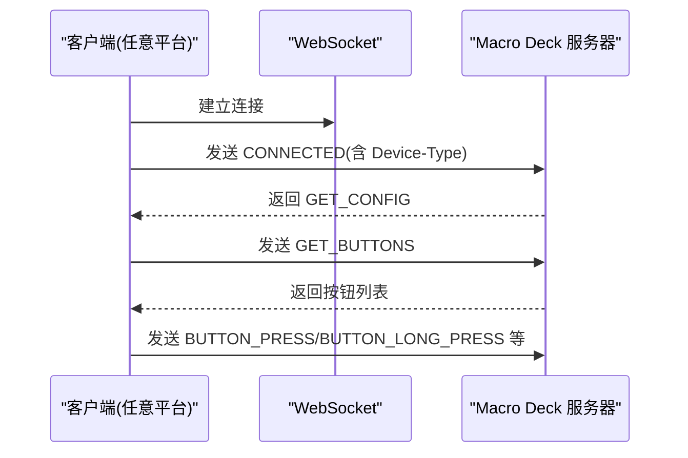
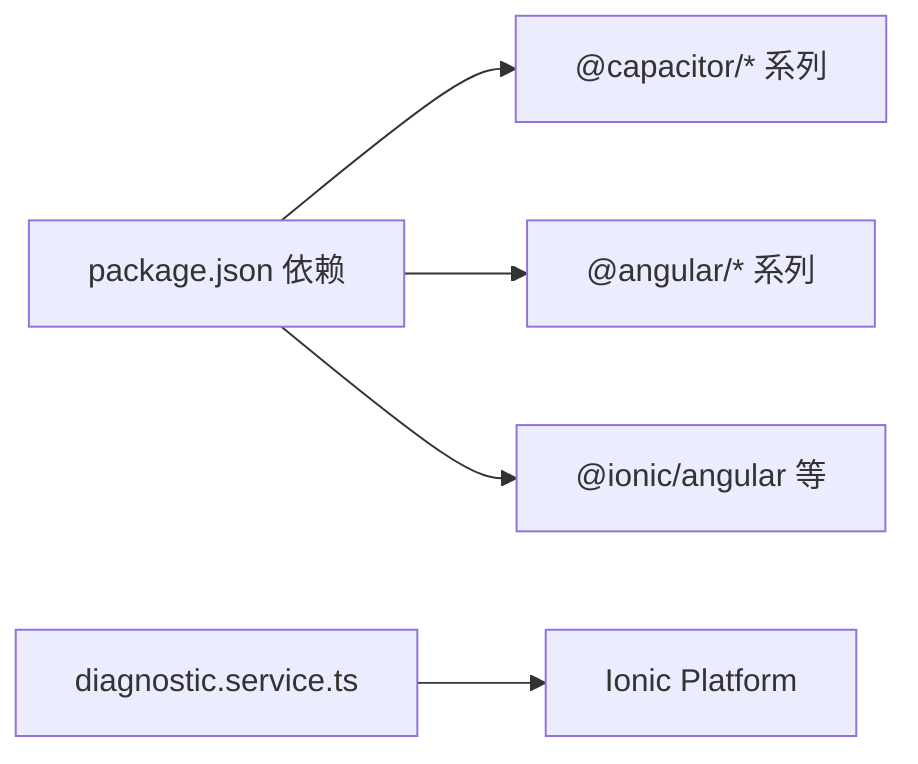

# HarmonyOS平台支持

<cite>
**本文引用的文件**   
- [README.md](file://README.md)
- [package.json](file://package.json)
- [capacitor.config.ts](file://capacitor.config.ts)
- [diagnostic.service.ts](file://src/app/services/diagnostic/diagnostic.service.ts)
- [需求与设计文档.md](file://docs/需求与设计文档.md)
</cite>

## 目录
1. [简介](#简介)
2. [项目结构](#项目结构)
3. [核心组件](#核心组件)
4. [架构总览](#架构总览)
5. [详细组件分析](#详细组件分析)
6. [依赖分析](#依赖分析)
7. [性能考虑](#性能考虑)
8. [故障排查指南](#故障排查指南)
9. [结论](#结论)
10. [附录](#附录)

## 简介
本仓库为 Macro Deck Client 的跨平台客户端实现，当前原生目标平台为 Android、iOS 与 Web。HarmonyOS 平台支持目前处于“设计与规划”阶段：仓库中未包含任何 HarmonyOS 工程或构建产物，但设计文档给出了完整的 HarmonyOS 适配方案、模块映射、权限清单、API 映射与分阶段实现步骤。本文围绕该现状，梳理现有代码中与平台检测相关的实现，并基于设计文档给出面向 HarmonyOS 的落地路径与注意事项。

## 项目结构
- 前端应用采用 Angular + Ionic 技术栈，通过 Capacitor 桥接原生能力（Android/iOS/Web）。
- 根级配置包括 Capacitor 配置、Ionic 配置、Angular 构建脚本等。
- 原生工程分别位于 android/ 与 ios/ 目录；Web 资源由 Angular 构建输出到 www 目录。
- 诊断服务用于获取应用版本、设备信息与平台判断，是未来扩展新平台的关键接入点之一。

图表来源
- [package.json:1-98](file://package.json#L1-L98)
- [capacitor.config.ts:1-18](file://capacitor.config.ts#L1-L18)
- [diagnostic.service.ts:1-92](file://src/app/services/diagnostic/diagnostic.service.ts#L1-L92)

章节来源
- [README.md:1-25](file://README.md#L1-L25)
- [package.json:1-98](file://package.json#L1-L98)
- [capacitor.config.ts:1-18](file://capacitor.config.ts#L1-L18)

## 核心组件
- 诊断服务：提供版本号获取、平台判断（Android/iOS）、Android SDK 版本读取等能力。该服务使用 Ionic Platform 的 platform.is() 进行平台分支判断，是后续新增平台（如 HarmonyOS）时最易扩展的切入点。
- 连接管理、WebSocket 通信、协议处理、面板渲染、设置、Ping 服务等业务服务在现有 Angular/Ionic 工程中实现，作为 HarmonyOS 移植时的功能基线。

章节来源
- [diagnostic.service.ts:1-92](file://src/app/services/diagnostic/diagnostic.service.ts#L1-L92)

## 架构总览
从现有工程看，HarmonyOS 尚未纳入构建与运行链路。根据设计文档，HarmonyOS 将采用 ArkTS + ArkUI 独立实现，并通过系统 API 替代 Capacitor 插件能力，同时复用既有协议与数据模型。

图表来源
- [需求与设计文档.md:800-889](file://docs/需求与设计文档.md#L800-L889)

## 详细组件分析

### 诊断服务（平台检测与版本信息）
诊断服务封装了平台判断与版本信息获取逻辑，使用 Ionic Platform 的 platform.is("android"/"ios") 进行分支处理，并在 Web 环境下回退到 environment 中的版本字段。若未来需要支持 HarmonyOS，可在该平台分支下增加对应判断与版本前缀策略。

图表来源
- [diagnostic.service.ts:1-92](file://src/app/services/diagnostic/diagnostic.service.ts#L1-L92)

章节来源
- [diagnostic.service.ts:1-92](file://src/app/services/diagnostic/diagnostic.service.ts#L1-L92)

### HarmonyOS 实现指南（来自设计文档）
设计文档提供了从技术选型、模块映射、权限、API 映射到分阶段实现步骤的完整指引，可作为 HarmonyOS 开发的权威参考。要点如下：
- 技术栈：ArkTS + ArkUI；网络使用 @ohos/axios 与 WebSocket；本地存储使用 Preferences；国际化使用 i18n。
- 模块映射：Angular 组件→ArkUI 组件；Angular 服务→ArkTS 单例；Ionic Storage→Preferences；Capacitor 插件→HarmonyOS 系统 API。
- 权限清单：网络、相机、网络信息、后台运行等。
- 关键 API 映射：WebSocket、HTTP、本地存储、国际化、屏幕方向、常亮、二维码扫描等。
- 实施步骤：基础框架→连接管理→网络通信→面板显示→辅助功能五阶段推进。

章节来源
- [需求与设计文档.md:800-889](file://docs/需求与设计文档.md#L800-L889)

### 协议与消息（与平台无关）
现有工程定义了 Protocol v2 的消息格式与交互流程，HarmonyOS 端需严格遵循同一协议，确保与服务器兼容。设计文档中包含了 CONNECTED、GET_CONFIG、GET_BUTTONS、UPDATE_BUTTON、BUTTON_PRESS 等消息示例，其中 CONNECTED 消息包含 Device-Type 字段，可用于标识客户端类型。

图表来源
- [需求与设计文档.md:535-632](file://docs/需求与设计文档.md#L535-L632)

章节来源
- [需求与设计文档.md:535-632](file://docs/需求与设计文档.md#L535-L632)

## 依赖分析
- 现有工程依赖 Capacitor 生态（@capacitor/android、@capacitor/ios、@capacitor/core 等），用于桥接 Android/iOS 原生能力。
- HarmonyOS 不在当前依赖列表中，亦无相关构建脚本或平台配置。
- 诊断服务依赖 Ionic Platform 进行平台判断，这是未来扩展平台分支的关键位置。

图表来源
- [package.json:1-98](file://package.json#L1-L98)
- [diagnostic.service.ts:1-92](file://src/app/services/diagnostic/diagnostic.service.ts#L1-L92)

章节来源
- [package.json:1-98](file://package.json#L1-L98)
- [diagnostic.service.ts:1-92](file://src/app/services/diagnostic/diagnostic.service.ts#L1-L92)

## 性能考虑
- 连接延迟与按钮响应：设计文档提出连接延迟 < 100ms、按钮响应 < 50ms 的目标，建议在 HarmonyOS 端优化网络栈与事件分发路径。
- 内存占用与功耗：建议控制常驻对象数量、避免不必要的图片解码与缓存膨胀，合理使用系统省电策略。
- 网络切换与重连：在网络切换场景下应快速感知并恢复连接，减少用户等待时间。

[本节为通用指导，不直接分析具体文件]

## 故障排查指南
- 平台识别问题：若出现平台判断异常，检查 platform.is() 分支是否覆盖所有目标平台，必要时在诊断服务中增加新平台分支。
- 证书与安全：跳过 SSL 验证需谨慎，仅在开发或内网环境启用；生产环境应正确配置证书链。
- 权限缺失：HarmonyOS 端需在应用清单中声明网络、相机、网络信息、后台运行等权限，否则扫码、网络访问等功能会失败。
- 协议不一致：确保 CONNECTED 消息携带正确的 Device-Type 与 Token，避免服务端拒绝连接。

章节来源
- [diagnostic.service.ts:1-92](file://src/app/services/diagnostic/diagnostic.service.ts#L1-L92)
- [需求与设计文档.md:824-860](file://docs/需求与设计文档.md#L824-L860)

## 结论
- 当前仓库未包含任何 HarmonyOS 工程或构建配置，HarmonyOS 支持仍处于设计阶段。
- 现有 Angular/Ionic/Capacitor 工程可作为功能基线与协议参照；诊断服务为平台扩展提供了良好切入点。
- 依据设计文档，HarmonyOS 端应采用 ArkTS + ArkUI 独立实现，并使用系统 API 替代 Capacitor 插件能力，严格遵循 Protocol v2 以保障互通性。
- 建议按“基础框架→连接管理→网络通信→面板显示→辅助功能”的分阶段路线推进，逐步完成端到端可用版本。

[本节为总结性内容，不直接分析具体文件]

## 附录
- 兼容性说明：现有 README 明确支持 Android 5.1+、iOS 13.0+；HarmonyOS 目标版本见设计文档（HarmonyOS 2.0+）。
- 参考资源：设计文档末尾列出了官方链接与开发文档入口，便于进一步查阅。

章节来源
- [README.md:22-25](file://README.md#L22-L25)
- [需求与设计文档.md:909-952](file://docs/需求与设计文档.md#L909-L952)