# 协议数据类型

<cite>
**本文档引用的文件**
- [protocol2-button.ts](file://src/app/datatypes/protocol2/protocol2-button.ts)
- [protocol2-messages.ts](file://src/app/datatypes/protocol2/protocol2-messages.ts)
- [ws-message.ts](file://src/app/datatypes/ws-message.ts)
- [protocol2.service.ts](file://src/app/services/protocol/protocol2.service.ts)
- [protocol-handler.service.ts](file://src/app/services/protocol/protocol-handler.service.ts)
- [websocket.service.ts](file://src/app/services/websocket/websocket.service.ts)
- [macro-deck.service.ts](file://src/app/services/macro-deck/macro-deck.service.ts)
- [button-widget.ts](file://src/app/datatypes/widgets/button-widget.ts)
- [widget.ts](file://src/app/datatypes/widgets/widget.ts)
- [widget-content.ts](file://src/app/datatypes/widgets/widget-content.ts)
- [widget-interaction.ts](file://src/app/datatypes/widgets/widget-interaction.ts)
- [widget-content-type.ts](file://src/app/enums/widget-content-type.ts)
- [widget-interaction-type.ts](file://src/app/enums/widget-interaction-type.ts)
- [send-text-modal.component.ts](file://src/app/pages/deck/modals/send-text-modal/send-text-modal.component.ts)
</cite>

## 更新摘要
**所做更改**
- 更新了Protocol2Messages类的消息构建器部分，新增文本发送相关方法
- 添加了新的文本发送消息类型说明（SEND_TEXT和SEND_TEXT_CLIPBOARD）
- 更新了消息处理流程图，包含文本发送功能的完整流程
- 新增了文本发送模态框组件的使用示例

## 目录
1. [简介](#简介)
2. [项目结构](#项目结构)
3. [核心组件](#核心组件)
4. [架构概览](#架构概览)
5. [详细组件分析](#详细组件分析)
6. [依赖关系分析](#依赖关系分析)
7. [性能考虑](#性能考虑)
8. [故障排除指南](#故障排除指南)
9. [结论](#结论)

## 简介

本文档详细介绍了Macro Deck客户端应用中的协议数据类型系统，重点涵盖Protocol2协议的数据结构设计、WebSocket消息模型以及协议版本兼容性策略。该系统采用模块化设计，通过清晰的数据接口定义和严格的类型约束，实现了与Macro Deck服务器的高效通信。

## 项目结构

协议数据类型系统主要分布在以下目录结构中：

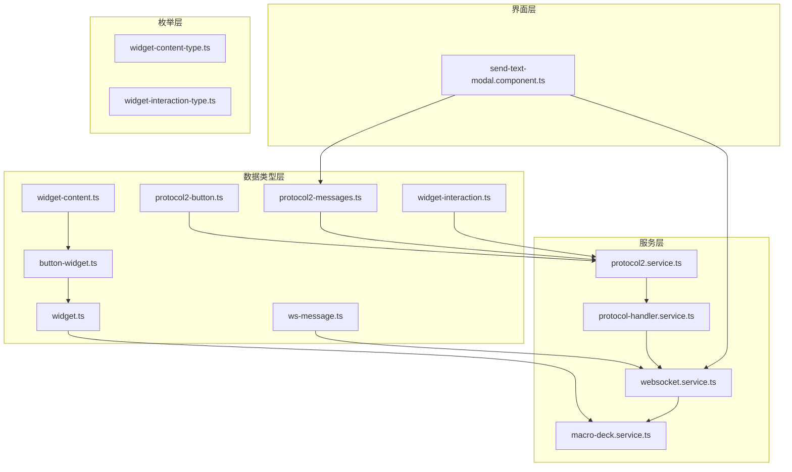

**图表来源**
- [protocol2-button.ts:1-21](file://src/app/datatypes/protocol2/protocol2-button.ts#L1-L21)
- [protocol2-messages.ts:1-49](file://src/app/datatypes/protocol2/protocol2-messages.ts#L1-L49)
- [protocol2.service.ts:1-162](file://src/app/services/protocol/protocol2.service.ts#L1-L162)
- [send-text-modal.component.ts:1-52](file://src/app/pages/deck/modals/send-text-modal/send-text-modal.component.ts#L1-L52)

**章节来源**
- [protocol2-button.ts:1-21](file://src/app/datatypes/protocol2/protocol2-button.ts#L1-L21)
- [protocol2-messages.ts:1-49](file://src/app/datatypes/protocol2/protocol2-messages.ts#L1-L49)
- [ws-message.ts:1-12](file://src/app/datatypes/ws-message.ts#L1-L12)

## 核心组件

### Protocol2Button协议2按钮数据结构

Protocol2Button接口定义了按钮在网格布局中的位置信息和显示属性：

| 属性名称 | 类型 | 描述 | 必需性 |
|---------|------|------|--------|
| IconBase64 | string \| undefined | 按钮图标的Base64编码数据 | 可选 |
| Position_X | number | 按钮在网格中的列位置 | 必需 |
| Position_Y | number | 按钮在网格中的行位置 | 必需 |
| LabelBase64 | string \| undefined | 按钮标签的Base64编码数据 | 可选 |
| BackgroundColorHex | string \| undefined | 按钮背景颜色（十六进制色值） | 可选 |

### Protocol2Messages协议消息构建器

Protocol2Messages类提供了标准化的消息构建功能，现已扩展支持文本发送功能：

**连接确认消息** (`getConnectedMessage`)
- Method: "CONNECTED"
- Client-Id: 客户端唯一标识符
- API: "20" (协议版本)
- Device-Type: "Web" (设备类型)
- Token: 认证令牌（可选）

**按钮列表请求** (`getGetButtonsMessage`)
- Method: "GET_BUTTONS"

**文本发送消息** (`getSendTextMessage`)
- Method: "SEND_TEXT"
- Message: 要发送的文本内容
- 用途：模拟键盘输入操作

**剪贴板粘贴消息** (`getSendTextClipboardMessage`)
- Method: "SEND_TEXT_CLIPBOARD"
- Message: 要粘贴到剪贴板的文本内容
- 用途：将文本写入系统剪贴板

**章节来源**
- [protocol2-button.ts:1-21](file://src/app/datatypes/protocol2/protocol2-button.ts#L1-L21)
- [protocol2-messages.ts:1-49](file://src/app/datatypes/protocol2/protocol2-messages.ts#L1-L49)
- [ws-message.ts:1-12](file://src/app/datatypes/ws-message.ts#L1-L12)

## 架构概览

整个协议数据类型系统采用分层架构设计，实现了清晰的关注点分离：

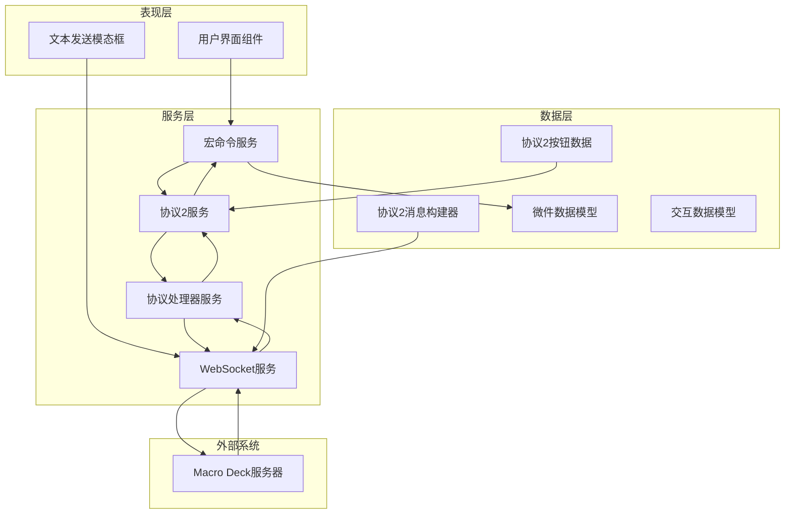

**图表来源**
- [protocol2.service.ts:15-35](file://src/app/services/protocol/protocol2.service.ts#L15-L35)
- [protocol-handler.service.ts:5-37](file://src/app/services/protocol/protocol-handler.service.ts#L5-L37)
- [websocket.service.ts:16-57](file://src/app/services/websocket/websocket.service.ts#L16-L57)
- [send-text-modal.component.ts:15-23](file://src/app/pages/deck/modals/send-text-modal/send-text-modal.component.ts#L15-L23)

## 详细组件分析

### 协议2按钮数据类型分析

Protocol2Button接口的设计体现了以下设计理念：

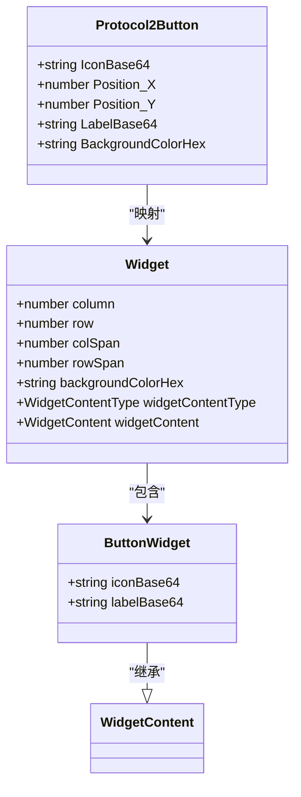

**图表来源**
- [protocol2-button.ts:2-13](file://src/app/datatypes/protocol2/protocol2-button.ts#L2-L13)
- [button-widget.ts:4-9](file://src/app/datatypes/widgets/button-widget.ts#L4-L9)
- [widget.ts:5-20](file://src/app/datatypes/widgets/widget.ts#L5-L20)

#### 数据映射流程

协议2按钮数据到微件模型的转换过程：

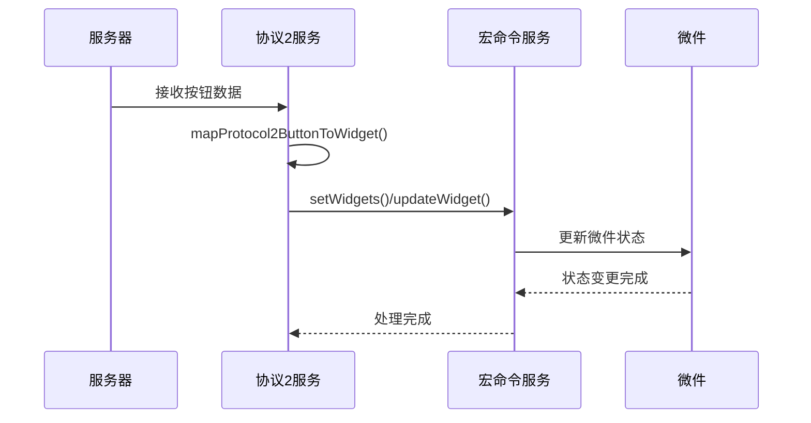

**图表来源**
- [protocol2.service.ts:111-125](file://src/app/services/protocol/protocol2.service.ts#L111-L125)
- [macro-deck.service.ts:49-65](file://src/app/services/macro-deck/macro-deck.service.ts#L49-L65)

**章节来源**
- [protocol2-button.ts:1-21](file://src/app/datatypes/protocol2/protocol2-button.ts#L1-L21)
- [button-widget.ts:1-16](file://src/app/datatypes/widgets/button-widget.ts#L1-L16)
- [widget.ts:1-33](file://src/app/datatypes/widgets/widget.ts#L1-L33)

### 协议消息处理机制

Protocol2Messages类提供了标准化的消息构建功能，现已支持完整的文本发送功能：

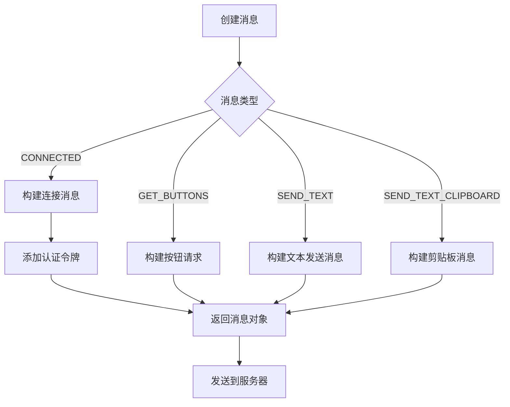

**图表来源**
- [protocol2-messages.ts:9-23](file://src/app/datatypes/protocol2/protocol2-messages.ts#L9-L23)
- [protocol2-messages.ts:29-33](file://src/app/datatypes/protocol2/protocol2-messages.ts#L29-L33)
- [protocol2-messages.ts:35-40](file://src/app/datatypes/protocol2/protocol2-messages.ts#L35-L40)
- [protocol2-messages.ts:42-47](file://src/app/datatypes/protocol2/protocol2-messages.ts#L42-L47)

#### 消息处理流程

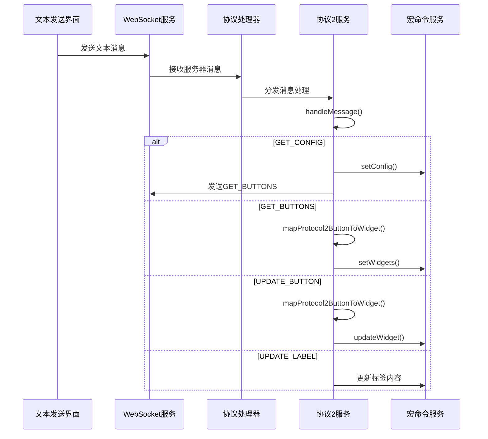

**图表来源**
- [protocol-handler.service.ts:22-28](file://src/app/services/protocol/protocol-handler.service.ts#L22-L28)
- [protocol2.service.ts:41-95](file://src/app/services/protocol/protocol2.service.ts#L41-L95)
- [send-text-modal.component.ts:42-50](file://src/app/pages/deck/modals/send-text-modal/send-text-modal.component.ts#L42-L50)

**章节来源**
- [protocol2-messages.ts:1-49](file://src/app/datatypes/protocol2/protocol2-messages.ts#L1-L49)
- [protocol-handler.service.ts:1-65](file://src/app/services/protocol/protocol-handler.service.ts#L1-L65)

### WebSocket消息模型

WsMessage接口提供了统一的WebSocket消息抽象：

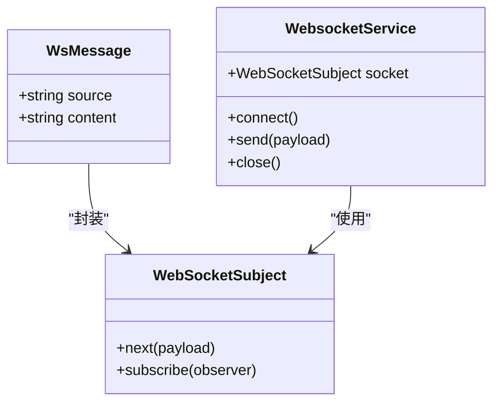

**图表来源**
- [ws-message.ts:2-7](file://src/app/datatypes/ws-message.ts#L2-L7)
- [websocket.service.ts:32-33](file://src/app/services/websocket/websocket.service.ts#L32-L33)

**章节来源**
- [ws-message.ts:1-12](file://src/app/datatypes/ws-message.ts#L1-L12)
- [websocket.service.ts:16-57](file://src/app/services/websocket/websocket.service.ts#L16-L57)

### 文本发送功能实现

新增的文本发送功能通过专门的模态框组件实现，支持两种发送模式：

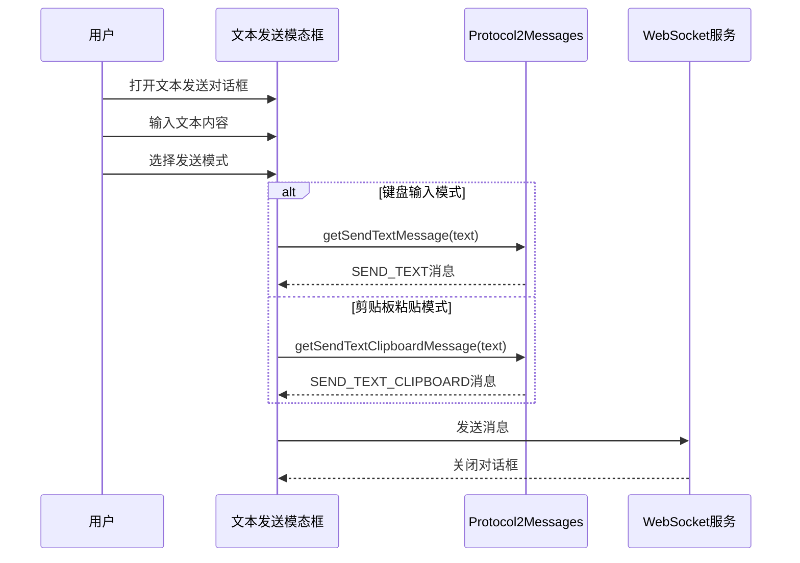

**图表来源**
- [send-text-modal.component.ts:34-50](file://src/app/pages/deck/modals/send-text-modal/send-text-modal.component.ts#L34-L50)
- [protocol2-messages.ts:35-47](file://src/app/datatypes/protocol2/protocol2-messages.ts#L35-L47)

#### 文本发送模态框特性

1. **本地存储**: 自动保存上次输入的文本内容
2. **双模式支持**: 键盘输入和剪贴板粘贴两种发送方式
3. **国际化支持**: 完整的中文和英文界面文本
4. **用户体验**: 自动聚焦输入框，支持取消操作

**章节来源**
- [send-text-modal.component.ts:1-52](file://src/app/pages/deck/modals/send-text-modal/send-text-modal.component.ts#L1-L52)
- [protocol2-messages.ts:35-47](file://src/app/datatypes/protocol2/protocol2-messages.ts#L35-L47)

### 协议版本兼容性策略

系统采用协议处理器模式实现版本兼容性：

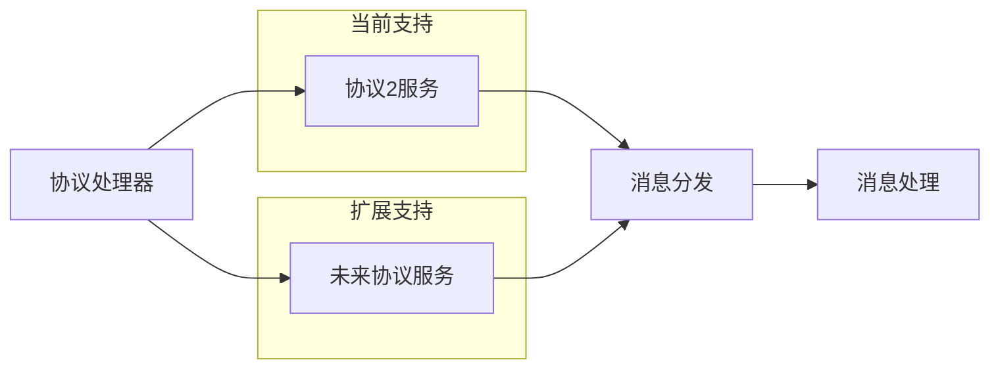

**图表来源**
- [protocol-handler.service.ts:11-28](file://src/app/services/protocol/protocol-handler.service.ts#L11-L28)

#### 兼容性设计原则

1. **单一职责**: 每个协议版本独立实现，便于维护和测试
2. **接口统一**: 所有协议服务遵循相同的接口约定
3. **渐进式升级**: 支持新旧版本共存和迁移

**章节来源**
- [protocol-handler.service.ts:1-65](file://src/app/services/protocol/protocol-handler.service.ts#L1-L65)

## 依赖关系分析

协议数据类型系统展现了良好的模块化设计：

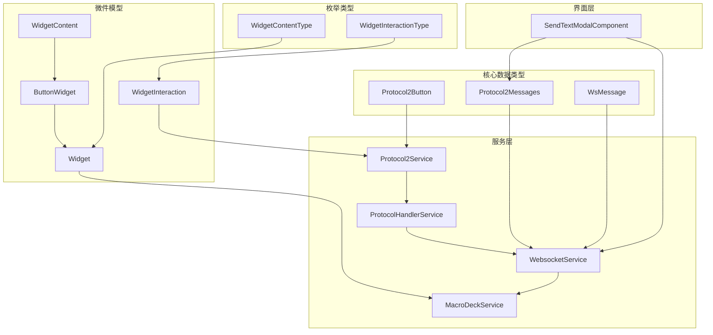

**图表来源**
- [protocol2.service.ts:1-15](file://src/app/services/protocol/protocol2.service.ts#L1-L15)
- [macro-deck.service.ts:1-10](file://src/app/services/macro-deck/macro-deck.service.ts#L1-L10)
- [send-text-modal.component.ts:5-6](file://src/app/pages/deck/modals/send-text-modal/send-text-modal.component.ts#L5-L6)

### 依赖注入关系

系统采用Angular依赖注入模式：

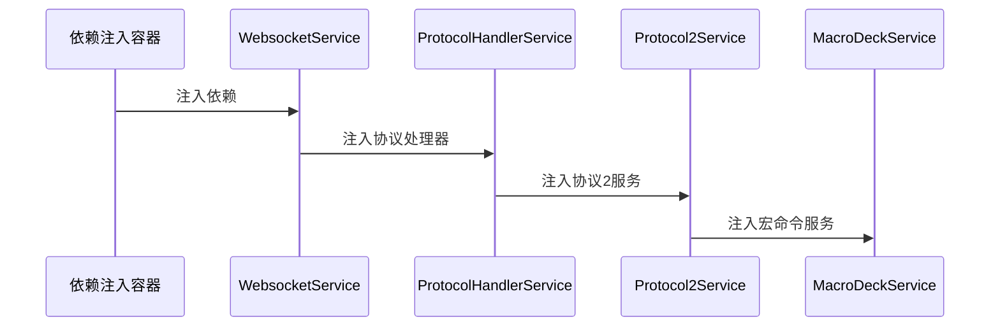

**图表来源**
- [protocol2.service.ts:27-29](file://src/app/services/protocol/protocol2.service.ts#L27-L29)
- [websocket.service.ts:51-55](file://src/app/services/websocket/websocket.service.ts#L51-L55)

**章节来源**
- [protocol2.service.ts:1-162](file://src/app/services/protocol/protocol2.service.ts#L1-L162)
- [websocket.service.ts:1-402](file://src/app/services/websocket/websocket.service.ts#L1-L402)

## 性能考虑

### 内存优化策略

1. **Base64数据处理**: 图标和标签数据采用Base64编码，减少额外的HTTP请求
2. **增量更新**: 支持单个按钮更新而非整页刷新
3. **事件驱动**: 使用RxJS主题实现响应式数据流

### 网络传输优化

1. **消息压缩**: 通过精简的消息结构减少网络带宽占用
2. **连接复用**: 单一WebSocket连接承载所有协议消息
3. **错误恢复**: 自动重连机制确保连接稳定性

### 文本发送优化

1. **本地缓存**: 文本内容本地存储，避免重复输入
2. **即时反馈**: 发送后立即关闭对话框，提升用户体验
3. **轻量级消息**: 文本消息结构简单，传输效率高

## 故障排除指南

### 常见问题诊断

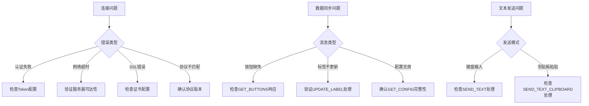

### 错误处理机制

系统实现了多层次的错误处理：

1. **连接级错误**: WebSocket连接异常处理
2. **协议级错误**: 消息格式和内容验证
3. **业务级错误**: 数据映射和状态同步错误
4. **文本发送错误**: 空文本验证和本地存储错误处理

**章节来源**
- [websocket.service.ts:120-133](file://src/app/services/websocket/websocket.service.ts#L120-L133)
- [protocol2.service.ts:42-44](file://src/app/services/protocol/protocol2.service.ts#L42-L44)
- [send-text-modal.component.ts:42-44](file://src/app/pages/deck/modals/send-text-modal/send-text-modal.component.ts#L42-L44)

## 结论

Macro Deck客户端应用的协议数据类型系统展现了优秀的软件工程实践：

1. **清晰的层次结构**: 从数据类型到服务层的明确分层
2. **强类型约束**: TypeScript接口确保编译时类型安全
3. **模块化设计**: 各组件职责明确，便于维护和扩展
4. **协议兼容性**: 支持多版本协议的平滑演进
5. **性能优化**: 通过增量更新和事件驱动实现高效的数据同步
6. **功能完善**: 新增的文本发送功能为用户提供了便捷的输入方式

Protocol2Messages类的新增方法（`getSendTextMessage()`和`getSendTextClipboardMessage()`）进一步增强了系统的功能完整性，使得客户端能够支持更丰富的交互场景。这些方法通过标准化的消息构建接口，确保了文本发送功能的稳定性和可维护性。

该系统为Macro Deck生态系统的客户端应用提供了稳定可靠的数据通信基础，为未来的功能扩展和技术演进奠定了坚实的技术基础。