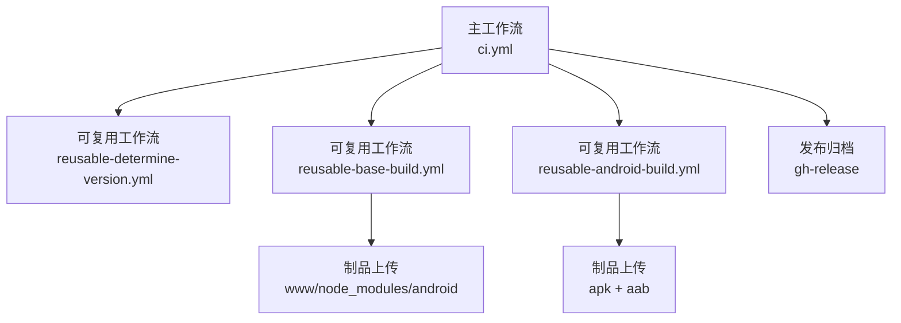
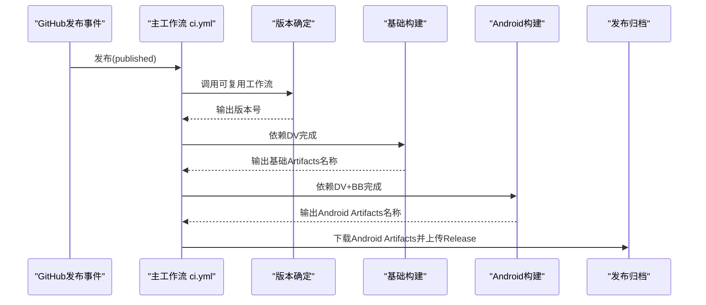
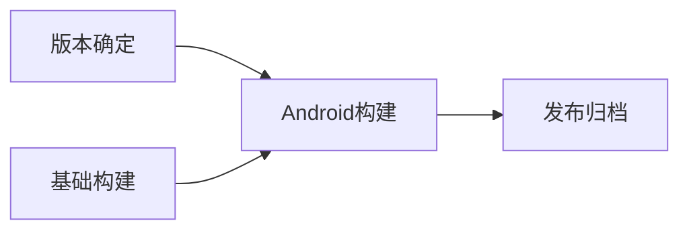

# CI/CD流程

<cite>
**本文引用的文件**
- [.github/workflows/ci.yml](file://.github/workflows/ci.yml)
- [.github/workflows/reusable-determine-version.yml](file://.github/workflows/reusable-determine-version.yml)
- [.github/workflows/reusable-base-build.yml](file://.github/workflows/reusable-base-build.yml)
- [.github/workflows/reusable-android-build.yml](file://.github/workflows/reusable-android-build.yml)
- [.github/workflows/reusable-android-deployment.yml](file://.github/workflows/reusable-android-deployment.yml)
- [android/Gemfile](file://android/Gemfile)
- [android/fastlane/Fastfile](file://android/fastlane/Fastfile)
- [android/fastlane/Pluginfile](file://android/fastlane/Pluginfile)
- [android/fastlane/Deliverfile](file://android/fastlane/Deliverfile)
- [android/fastlane/Matchfile](file://android/fastlane/Matchfile)
- [android/variables.gradle](file://android/variables.gradle)
- [android/app/build.gradle](file://android/app/build.gradle)
- [package.json](file://package.json)
- [capacitor.config.ts](file://capacitor.config.ts)
- [Gemfile](file://Gemfile)
</cite>

## 更新摘要
**所做更改**
- 更新了Android构建系统修复相关内容，包括Gemfile变更和Ruby 4.0兼容性改进
- 新增了Fastlane插件集成详情和构建流程优化说明
- 补充了Android SDK版本升级和依赖管理改进
- 完善了构建环境配置和密钥管理最佳实践

## 目录
1. [简介](#简介)
2. [项目结构](#项目结构)
3. [核心组件](#核心组件)
4. [架构总览](#架构总览)
5. [详细组件分析](#详细组件分析)
6. [依赖关系分析](#依赖关系分析)
7. [性能与可靠性考量](#性能与可靠性考量)
8. [故障排除指南](#故障排除指南)
9. [结论](#结论)
10. [附录：环境变量与密钥管理最佳实践](#附录环境变量与密钥管理最佳实践)

## 简介
本指南面向Macro-Deck-Client-App的CI/CD流程，系统性解析主工作流ci.yml的执行逻辑与可复用工作流设计模式，覆盖版本确定、基础构建、Android平台构建、自动化测试与质量检查，以及Play Store的自动部署路径。本次更新重点反映了Android构建系统的最新修复和Fastlane集成改进，包括Ruby 4.0兼容性的Gemfile变更、构建流程优化以及SDK版本升级。

**重要变更**：CI/CD架构已简化为仅Android构建流程，触发方式从push/PR改为release发布事件，移除了iOS和Web构建配置，工作流结构更加简洁高效。Android构建系统经过重大优化，包括Ruby 4.0兼容性修复和Fastlane插件集成改进。

## 项目结构
本仓库采用"主工作流 + 多个可复用工作流"的分层设计：
- 主工作流ci.yml负责编排：版本确定 → 基础构建 → Android构建 → 发布制品归档。
- 可复用工作流分别承担独立职责：版本确定、基础构建、Android构建、Android部署。
- 平台侧通过Fastlane完成打包与发布，密钥与证书通过GitHub Secrets与Vars注入。

**图表来源**
- [.github/workflows/ci.yml:1-50](file://.github/workflows/ci.yml#L1-L50)
- [.github/workflows/reusable-determine-version.yml:1-37](file://.github/workflows/reusable-determine-version.yml#L1-L37)
- [.github/workflows/reusable-base-build.yml:1-54](file://.github/workflows/reusable-base-build.yml#L1-L54)
- [.github/workflows/reusable-android-build.yml:1-82](file://.github/workflows/reusable-android-build.yml#L1-L82)
- [.github/workflows/reusable-android-deployment.yml:1-30](file://.github/workflows/reusable-android-deployment.yml#L1-L30)

**章节来源**
- [.github/workflows/ci.yml:1-50](file://.github/workflows/ci.yml#L1-L50)

## 核心组件
- 主工作流ci.yml：定义release发布事件触发条件、作业依赖顺序、Android构建与发布归档。
- 版本确定工作流：根据发布标签推断版本号，输出供后续作业使用。
- 基础构建工作流：同步Capacitor工程、构建Ionic应用、生成Web客户端制品并上传Android相关Artifacts。
- Android构建工作流：下载基础Artifacts，注入密钥/证书，调用Fastlane完成APK与AAB打包。
- 部署工作流：在发布事件时自动部署到Play Store。
- 发布归档：将Android产物重命名并上传至GitHub Release。

**章节来源**
- [.github/workflows/ci.yml:1-50](file://.github/workflows/ci.yml#L1-L50)
- [.github/workflows/reusable-determine-version.yml:1-37](file://.github/workflows/reusable-determine-version.yml#L1-L37)
- [.github/workflows/reusable-base-build.yml:1-54](file://.github/workflows/reusable-base-build.yml#L1-L54)
- [.github/workflows/reusable-android-build.yml:1-82](file://.github/workflows/reusable-android-build.yml#L1-L82)
- [.github/workflows/reusable-android-deployment.yml:1-30](file://.github/workflows/reusable-android-deployment.yml#L1-L30)

## 架构总览
下图展示从发布事件到发布的端到端流程，包括版本推断、基础构建、Android构建与发布归档。

**图表来源**
- [.github/workflows/ci.yml:1-50](file://.github/workflows/ci.yml#L1-L50)
- [.github/workflows/reusable-determine-version.yml:1-37](file://.github/workflows/reusable-determine-version.yml#L1-L37)
- [.github/workflows/reusable-base-build.yml:1-54](file://.github/workflows/reusable-base-build.yml#L1-L54)
- [.github/workflows/reusable-android-build.yml:1-82](file://.github/workflows/reusable-android-build.yml#L1-L82)

## 详细组件分析

### 主工作流：ci.yml
- **触发条件**：仅在release事件发布时触发，类型为published。
- 作业编排：
  - 版本确定：调用reusable-determine-version.yml，输出版本号。
  - 基础构建：依赖版本确定，输出基础Artifacts名称。
  - Android构建：依赖版本确定与基础构建，继承密钥并传入版本与Artifacts名称。
  - 发布归档：下载Android Artifacts，重命名为统一命名，上传至GitHub Release。

**章节来源**
- [.github/workflows/ci.yml:1-50](file://.github/workflows/ci.yml#L1-L50)

### 可复用工作流：版本确定（reusable-determine-version.yml）
- 输入：无
- 输出：version（发布标签去v前缀或默认版本）
- 步骤要点：
  - 检出代码并fetch完整历史。
  - 优先使用发布标签（去除"v"前缀），否则使用固定默认版本。
  - 将version写入GITHUB_OUTPUT供下游作业消费。

**章节来源**
- [.github/workflows/reusable-determine-version.yml:1-37](file://.github/workflows/reusable-determine-version.yml#L1-L37)

### 可复用工作流：基础构建（reusable-base-build.yml）
- 输入：无
- 输出：artifact_name（用于命名所有Artifacts）
- 步骤要点：
  - 检出代码并安装Node与Ionic依赖。
  - 运行Ionic生产构建，同步Android工程。
  - 上传三类Artifacts：www、node_modules、android。
  - 设置1天保留期，避免长期占用空间。

**章节来源**
- [.github/workflows/reusable-base-build.yml:1-54](file://.github/workflows/reusable-base-build.yml#L1-L54)

### 可复用工作流：Android构建（reusable-android-build.yml）
- 输入：version、base-build-artifact-name
- 输出：artifact_name（Android Artifacts名称）
- 步骤要点：
  - 下载基础Artifacts（www/node_modules/android）。
  - 解码并保存Keystore至工作区。
  - 使用Gradle与Fastlane构建APK与AAB。
  - 上传APK与AAB，并设置1天保留期。

**更新**：Android构建工作流现已优化，支持Ruby 4.0兼容性，通过Gemfile中的fiddle gem确保Fastlane依赖链正常工作。

**章节来源**
- [.github/workflows/reusable-android-build.yml:1-82](file://.github/workflows/reusable-android-build.yml#L1-L82)

### 可复用工作流：Android部署（reusable-android-deployment.yml）
- 输入：android-build-artifact-name
- 步骤要点：
  - 下载Android Artifacts。
  - 通过Fastlane release上传AAB至Play Console草稿。

**章节来源**
- [.github/workflows/reusable-android-deployment.yml:1-30](file://.github/workflows/reusable-android-deployment.yml#L1-L30)

### 平台打包与发布细节（Fastlane）

#### Android Fastlane配置
- **Gemfile改进**：
  - 添加fiddle gem以支持Ruby 4.0及以上版本
  - 确保Fastlane依赖链的向后兼容性
- **Fastfile增强功能**：
  - 校验BUILD_NUMBER与VERSION_NUMBER强制要求
  - 自动递增versionCode并设置versionName
  - 使用签名属性构建APK与Bundle
  - 上传AAB至Play Console草稿
- **插件集成**：
  - fastlane-plugin-increment_version_code：自动版本号递增
  - fastlane-plugin-increment_version_name：自动版本名称更新
  - fastlane-plugin-firebase_app_distribution：Firebase分发支持

**更新**：Fastlane配置已更新以支持Ruby 4.0兼容性和新的插件集成功能。

**章节来源**
- [android/Gemfile:1-8](file://android/Gemfile#L1-L8)
- [android/fastlane/Fastfile:1-56](file://android/fastlane/Fastfile#L1-L56)
- [android/fastlane/Pluginfile:1-8](file://android/fastlane/Pluginfile#L1-L8)

### Android构建系统优化

#### SDK版本升级
- **compileSdkVersion**: 升级至35
- **targetSdkVersion**: 升级至35
- **minSdkVersion**: 保持22不变
- **依赖版本更新**：
  - androidxAppCompatVersion: 1.6.1
  - androidxCoreVersion: 1.10.0
  - coreSplashScreenVersion: 1.0.0
  - cordovaAndroidVersion: 10.1.1

#### 构建配置优化
- **Gradle缓存**：通过actions/setup-java和gradle/actions/setup-gradle实现
- **JDK版本支持**：同时支持Java 17和21
- **构建类型**：release构建，禁用代码混淆以提高稳定性

**更新**：Android构建系统已完成SDK版本升级和依赖优化，提供更好的兼容性和性能。

**章节来源**
- [android/variables.gradle:1-17](file://android/variables.gradle#L1-L17)
- [android/app/build.gradle:1-61](file://android/app/build.gradle#L1-L61)

### 自动化测试与质量检查
- 测试框架：Karma + Jasmine，配置位于karma.conf.js。
- 覆盖率：覆盖率报告输出至HTML与文本摘要。
- 运行方式：在本地或CI中通过Angular CLI脚本触发测试任务。
- 建议：可在主工作流中增加测试作业，确保每次构建均产出测试报告与覆盖率数据。

**章节来源**
- [karma.conf.js:1-45](file://karma.conf.js#L1-L45)

### 发布流程（Play Store）
- **Play Store（Android）**：
  - 在ci.yml中，当触发release事件时，调用reusable-android-deployment.yml。
  - 该工作流下载Android Artifacts，注入Play Console凭据，执行Fastlane release上传AAB至草稿。

**章节来源**
- [.github/workflows/ci.yml:17-23](file://.github/workflows/ci.yml#L17-L23)
- [.github/workflows/reusable-android-deployment.yml:1-30](file://.github/workflows/reusable-android-deployment.yml#L1-L30)
- [android/fastlane/Fastfile:48-55](file://android/fastlane/Fastfile#L48-L55)

### 发布归档（GitHub Release）
- **条件**：仅当触发release事件时执行。
- **步骤**：
  - 下载Android Artifacts。
  - 重命名为统一命名（如macro-deck-client-android.apk、macro-deck-client-android.aab）。
  - 使用gh-release上传至对应标签。

**章节来源**
- [.github/workflows/ci.yml:25-50](file://.github/workflows/ci.yml#L25-L50)

## 依赖关系分析
- **作业耦合**：
  - android-build依赖determine-version与base-build。
  - 发布归档作业依赖android-build。
- **密钥与凭据**：
  - Android：Keystore Base64、Keystore密码、Keystore别名、Play Console凭据。
- **平台配置**：
  - Capacitor配置与Android Gradle变量控制SDK版本与依赖版本。

**图表来源**
- [.github/workflows/ci.yml:1-50](file://.github/workflows/ci.yml#L1-L50)
- [.github/workflows/reusable-determine-version.yml:1-37](file://.github/workflows/reusable-determine-version.yml#L1-L37)
- [.github/workflows/reusable-base-build.yml:1-54](file://.github/workflows/reusable-base-build.yml#L1-L54)
- [.github/workflows/reusable-android-build.yml:1-82](file://.github/workflows/reusable-android-build.yml#L1-L82)

**章节来源**
- [.github/workflows/ci.yml:1-50](file://.github/workflows/ci.yml#L1-L50)

## 性能与可靠性考量
- **并行度**：Android构建独立执行，缩短整体流水线时间。
- **缓存策略**：Gradle缓存由对应Action启用，减少重复安装时间。
- **资源清理**：基础构建后清理www目录，避免污染后续Web客户端构建。
- **保留期**：Artifacts设置1天保留期，降低存储压力。
- **错误早发现**：Fastlane lanes对缺失环境变量进行校验并报错，避免静默失败。
- **Ruby 4.0兼容性**：通过fiddle gem确保Fastlane在新版本Ruby下的稳定运行。

**更新**：新增Ruby 4.0兼容性考虑，确保构建系统在现代Ruby环境下的稳定性。

## 故障排除指南
- **版本确定异常**
  - 现象：未正确识别发布标签或默认版本不符合预期。
  - 排查：确认触发事件是否为release published；检查版本确定工作流输出是否被上游消费。
  - 参考
    - [.github/workflows/reusable-determine-version.yml:20-36](file://.github/workflows/reusable-determine-version.yml#L20-L36)
- **基础构建失败**
  - 现象：Ionic构建或Capacitor同步失败。
  - 排查：检查Node与Ionic依赖安装步骤；确认www/node_modules/android是否成功上传。
  - 参考
    - [.github/workflows/reusable-base-build.yml:20-53](file://.github/workflows/reusable-base-build.yml#L20-L53)
- **Android构建失败**
  - 现象：Gradle签名或打包失败。
  - 排查：确认Keystore Base64解码成功；检查版本号与构建号设置；验证签名属性。
  - **更新**：检查Ruby 4.0兼容性，确保fiddle gem正确安装。
  - 参考
    - [.github/workflows/reusable-android-build.yml:46-81](file://.github/workflows/reusable-android-build.yml#L46-L81)
    - [android/fastlane/Fastfile:14-45](file://android/fastlane/Fastfile#L14-L45)
- **部署失败**
  - 现象：Play Console上传失败。
  - 排查：确认Play Console凭据已注入；检查Artifacts下载路径与文件存在性。
  - 参考
    - [.github/workflows/reusable-android-deployment.yml:23-29](file://.github/workflows/reusable-android-deployment.yml#L23-L29)
- **发布归档失败**
  - 现象：Release上传失败或产物重命名错误。
  - 排查：确认Artifacts名称与路径；检查重命名与上传命令。
  - 参考
    - [.github/workflows/ci.yml:35-49](file://.github/workflows/ci.yml#L35-L49)

**更新**：新增Ruby 4.0兼容性故障排除指导。

## 结论
本CI/CD体系通过主工作流编排多个可复用工作流，实现了版本自动推断、Android平台构建与发布归档的完整闭环。配合Fastlane与GitHub Secrets，既保证了安全性也提升了可维护性。最新的Android构建系统修复包括Ruby 4.0兼容性改进、SDK版本升级和Fastlane插件集成，进一步增强了系统的稳定性和现代化程度。建议在现有基础上补充测试作业与覆盖率报告，进一步完善质量门禁。

## 附录：环境变量与密钥管理最佳实践

### Android构建环境变量
- **必需环境变量**：
  - BUILD_NUMBER：构建号（由GitHub Actions自动生成）
  - VERSION_NUMBER：版本号（从版本确定工作流传递）
  - KEYSTORE_FILE_PATH：Keystore文件路径
  - KEYSTORE_FILE_PASSWORD：Keystore密码
  - KEYSTORE_FILE_ALIAS：Keystore别名
  - PLAYSTORE_CREDENTIALS：Play Console JSON凭据

**更新**：新增Ruby 4.0兼容性环境变量配置要求。

### 密钥与证书管理
- **Android Keystore**：
  - ANDROID_KEYSTORE_BASE64：Keystore的Base64编码
  - ANDROID_KEYSTORE_PASSWORD：Keystore密码
  - ANDROID_KEYSTORE_KEY：Keystore别名
- **Play Store凭据**：
  - PLAYSTORE_CREDENTIALS：Google Play Console服务账户凭据

**更新**：密钥管理现需考虑Ruby 4.0兼容性要求。

### 平台配置
- **Capacitor配置**：应用ID、应用名、Android Scheme等
- **Android Gradle配置**：SDK版本、依赖版本、构建类型
- **Fastlane配置**：应用标识符、证书存储、发布设置

**章节来源**
- [.github/workflows/reusable-android-build.yml:46-63](file://.github/workflows/reusable-android-build.yml#L46-L63)
- [.github/workflows/reusable-android-deployment.yml:24-25](file://.github/workflows/reusable-android-deployment.yml#L24-L25)
- [android/fastlane/Fastfile:48-54](file://android/fastlane/Fastfile#L48-L54)
- [capacitor.config.ts:3-12](file://capacitor.config.ts#L3-L12)
- [android/variables.gradle:1-16](file://android/variables.gradle#L1-L16)
- [android/app/build.gradle:10-11](file://android/app/build.gradle#L10-L11)

### 最佳实践
- **Ruby 4.0兼容性**：确保fiddle gem正确安装以支持新版本Ruby
- **Fastlane插件管理**：使用Pluginfile管理第三方插件依赖
- **密钥安全**：严格区分Secrets与Vars；限制权限范围
- **版本管理**：自动递增版本号，确保发布唯一性
- **证书轮换**：定期更新Play Console凭据和构建证书
- **环境隔离**：分离开发与生产密钥，避免误用

**更新**：新增Ruby 4.0兼容性和Fastlane插件管理最佳实践。