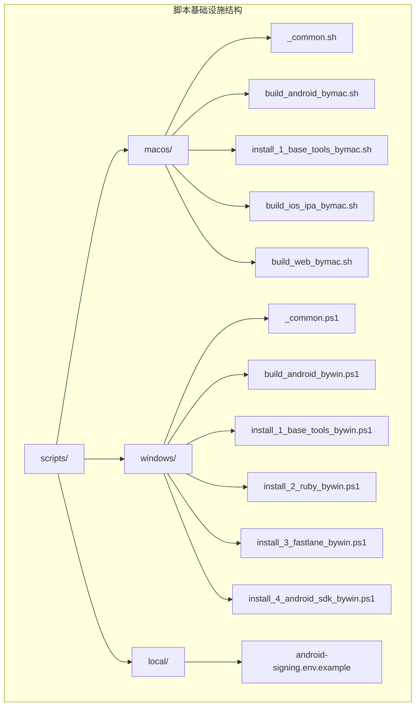
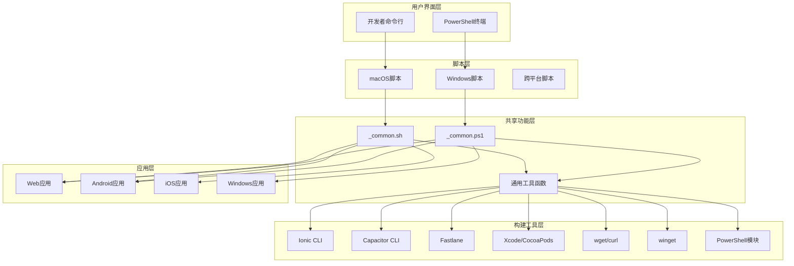
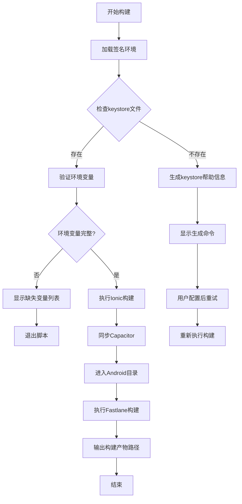
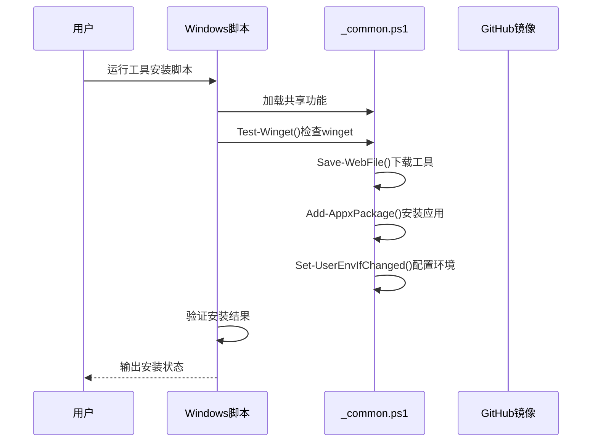
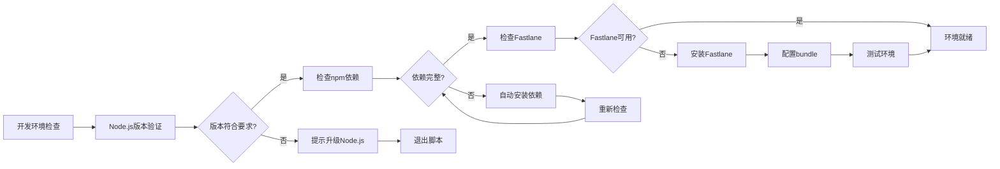
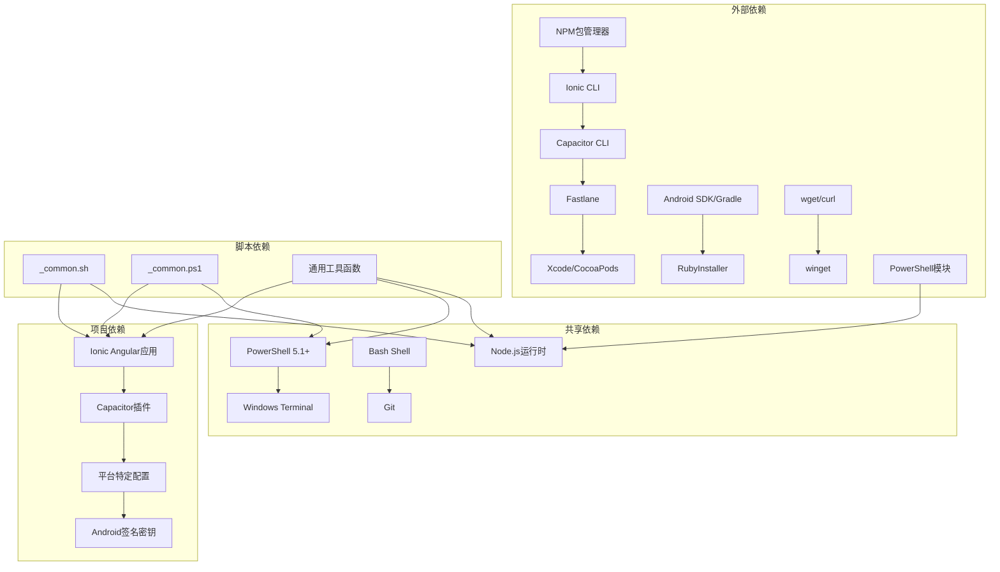

# Unix/Linux脚本基础设施

<cite>
**本文档引用的文件**
- [scripts README.md](file://scripts/README.md)
- [macos/_common.sh](file://scripts/macos/_common.sh)
- [macos/build_android_bymac.sh](file://scripts/macos/build_android_bymac.sh)
- [macos/install_1_base_tools_bymac.sh](file://scripts/macos/install_1_base_tools_bymac.sh)
- [windows/_common.ps1](file://scripts/windows/_common.ps1)
- [windows/build_android_bywin.ps1](file://scripts/windows/build_android_bywin.ps1)
- [windows/install_1_base_tools_bywin.ps1](file://scripts/windows/install_1_base_tools_bywin.ps1)
- [windows/install_2_ruby_bywin.ps1](file://scripts/windows/install_2_ruby_bywin.ps1)
- [windows/install_3_fastlane_bywin.ps1](file://scripts/windows/install_3_fastlane_bywin.ps1)
- [windows/install_4_android_sdk_bywin.ps1](file://scripts/windows/install_4_android_sdk_bywin.ps1)
- [android-signing.env.example](file://scripts/local/android-signing.env.example)
</cite>

## 更新摘要
**所做更改**
- 删除了所有Unix/Linux脚本基础设施相关内容
- 新增了完整的macOS优先脚本基础设施文档
- 更新了跨平台脚本系统的架构描述
- 添加了Windows PowerShell脚本基础设施的详细说明
- 重新组织了脚本README.md文档结构

## 目录
1. [简介](#简介)
2. [项目结构](#项目结构)
3. [核心组件](#核心组件)
4. [架构概览](#架构概览)
5. [详细组件分析](#详细组件分析)
6. [依赖关系分析](#依赖关系分析)
7. [性能考虑](#性能考虑)
8. [故障排除指南](#故障排除指南)
9. [结论](#结论)

## 简介

Macro Deck Client App项目现已采用全新的macOS优先脚本基础设施，完全替代了原有的Unix/Linux脚本系统。该基础设施为macOS、Windows和Linux系统提供了统一的开发、构建和部署工作流程，通过一组精心设计的Shell脚本和PowerShell脚本实现了跨平台的一致性，支持Web应用、Android移动应用和iOS应用的开发与发布。

新脚本系统的核心优势在于其模块化设计，通过共享的通用脚本文件提供统一的功能接口，同时针对不同平台提供专门的实现。这种设计确保了开发者可以在不同的操作系统环境中获得一致的开发体验，同时充分利用各平台的特性。

## 项目结构

项目中的脚本基础设施现在位于`scripts/`目录下，按照平台进行了清晰的分离，形成了完整的跨平台脚本生态系统。

**图表来源**
- [macos/_common.sh:1-239](file://scripts/macos/_common.sh#L1-239)
- [windows/_common.ps1:1-800](file://scripts/windows/_common.ps1#L1-800)

**章节来源**
- [scripts README.md:1-144](file://scripts/README.md#L1-144)

## 核心组件

### macOS脚本框架

macOS平台的脚本基础设施提供了完整的开发环境管理和构建流程支持：

- **根目录管理**：`cd_root()`函数确保所有脚本都在项目根目录下执行
- **依赖检查**：`require_command()`和`require_env()`函数验证必需工具和环境变量
- **构建流程**：`ionic_build()`和`cap_sync()`函数封装了Ionic和Capacitor的标准构建流程
- **依赖管理**：`ensure_node_modules()`函数自动处理Node.js依赖安装
- **环境检测**：`check_web_environment()`和`test_nodejs()`函数提供全面的环境验证

### Windows PowerShell脚本框架

Windows平台的脚本基础设施提供了企业级的自动化工具安装和管理能力：

- **工具管理**：`Install-WingetTool()`、`Install-WindowsTerminalTool()`等函数提供完整的工具安装流程
- **环境配置**：`Set-UserEnvIfChanged()`和`Add-UserPathSegment()`函数智能管理用户环境变量
- **下载优化**：`Save-WebFile()`和`Save-WebFileSingle()`函数提供多源并行下载和断点续传
- **系统集成**：`Get-AndroidSdkRootCandidate()`和`Resolve-AndroidHome()`函数深度集成Windows系统

### 平台特定构建脚本

每个目标平台都有专门的构建脚本，这些脚本继承了通用功能并添加了平台特定的逻辑：

- **Android构建**：处理签名密钥配置、Fastlane集成和多格式输出
- **iOS构建**：集成Xcode、CocoaPods和App Store Connect认证
- **Web构建**：支持多种配置模式和部署选项

**章节来源**
- [macos/_common.sh:43-239](file://scripts/macos/_common.sh#L43-239)
- [windows/_common.ps1:11-800](file://scripts/windows/_common.ps1#L11-800)

## 架构概览

脚本基础设施采用了分层架构设计，确保了良好的可维护性和扩展性。

**图表来源**
- [macos/_common.sh:1-239](file://scripts/macos/_common.sh#L1-239)
- [windows/_common.ps1:1-800](file://scripts/windows/_common.ps1#L1-800)

## 详细组件分析

### macOS构建流程

macOS平台的构建脚本实现了复杂的签名和发布流程，具有以下特点：

**图表来源**
- [macos/build_android_bymac.sh:149-219](file://scripts/macos/build_android_bymac.sh#L149-219)

**章节来源**
- [macos/build_android_bymac.sh:1-219](file://scripts/macos/build_android_bymac.sh#L1-219)
- [android-signing.env.example:1-10](file://scripts/local/android-signing.env.example#L1-10)

### Windows工具安装流程

Windows平台的工具安装脚本提供了企业级的自动化安装能力：

**图表来源**
- [windows/install_1_base_tools_bywin.ps1:50-262](file://scripts/windows/install_1_base_tools_bywin.ps1#L50-262)

**章节来源**
- [windows/install_1_base_tools_bywin.ps1:1-800](file://scripts/windows/install_1_base_tools_bywin.ps1#L1-800)

### macOS开发环境配置

macOS平台的开发环境配置脚本提供了完整的开发工具链管理：

**图表来源**
- [macos/_common.sh:84-126](file://scripts/macos/_common.sh#L84-126)

**章节来源**
- [macos/_common.sh:1-239](file://scripts/macos/_common.sh#L1-239)

## 依赖关系分析

脚本基础设施的依赖关系体现了清晰的层次结构和模块化设计。

**图表来源**
- [scripts README.md:1-144](file://scripts/README.md#L1-144)

**章节来源**
- [scripts README.md:1-144](file://scripts/README.md#L1-144)

## 性能考虑

脚本基础设施在设计时充分考虑了性能优化和用户体验：

### 并行执行优化
- 使用`set -euo pipefail`确保脚本在遇到错误时立即停止
- 通过条件检查避免不必要的依赖安装
- 智能缓存机制减少重复的构建过程
- 多源并行下载优化网络性能

### 资源管理
- 自动检测和清理临时文件
- 优化的依赖安装策略，避免重复下载
- 智能的环境变量管理，减少配置开销
- Windows平台的注册表路径同步机制

### 错误处理
- 完善的错误检测和报告机制
- 友好的错误消息和解决方案建议
- 自动化的故障恢复和重试机制
- 平台特定的错误处理策略

## 故障排除指南

### 常见问题及解决方案

**依赖安装问题**
- 症状：npm install失败或依赖冲突
- 解决方案：使用`--legacy-peer-deps`标志或更新Node.js版本

**构建环境问题**
- 症状：找不到必需的构建工具
- 解决方案：检查PATH环境变量，确保工具已正确安装

**签名配置问题**
- 症状：Android构建时签名失败
- 解决方案：验证keystore文件路径和密码配置

**平台特定问题**
- 症状：iOS构建在非macOS环境下失败
- 解决方案：使用macOS环境或Docker容器

**Windows工具安装问题**
- 症状：winget安装失败或工具不可用
- 解决方案：检查网络连接，使用备用下载源，手动安装工具

**章节来源**
- [scripts README.md:87-144](file://scripts/README.md#L87-144)

## 结论

Macro Deck Client App项目的macOS优先脚本基础设施展现了现代软件开发的最佳实践。通过模块化设计、跨平台兼容性和完善的错误处理机制，该基础设施为开发者提供了高效、可靠的开发和部署体验。

该脚本系统的主要优势包括：

1. **一致性**：统一的接口和工作流程，确保不同平台间的开发体验一致
2. **可维护性**：清晰的模块化结构，便于维护和扩展
3. **可靠性**：完善的错误处理和故障恢复机制
4. **灵活性**：支持多种配置和自定义选项
5. **安全性**：严格的环境验证和敏感信息保护
6. **性能优化**：多源并行下载和智能缓存机制
7. **企业级功能**：Windows平台的完整工具链管理和注册表集成

通过持续的优化和改进，这套macOS优先脚本基础设施将继续为Macro Deck Client App项目提供强大的技术支持，确保项目的长期可持续发展。