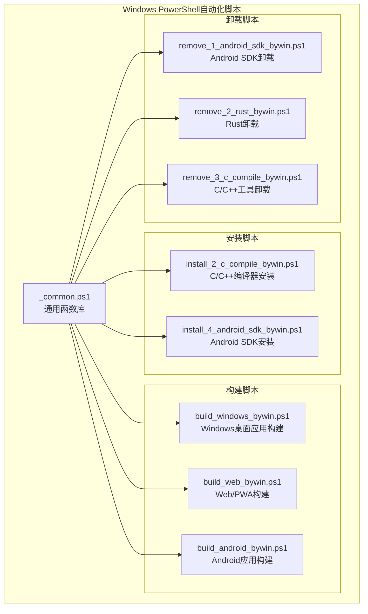
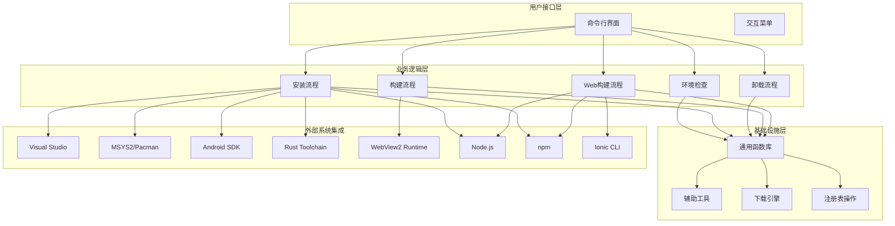
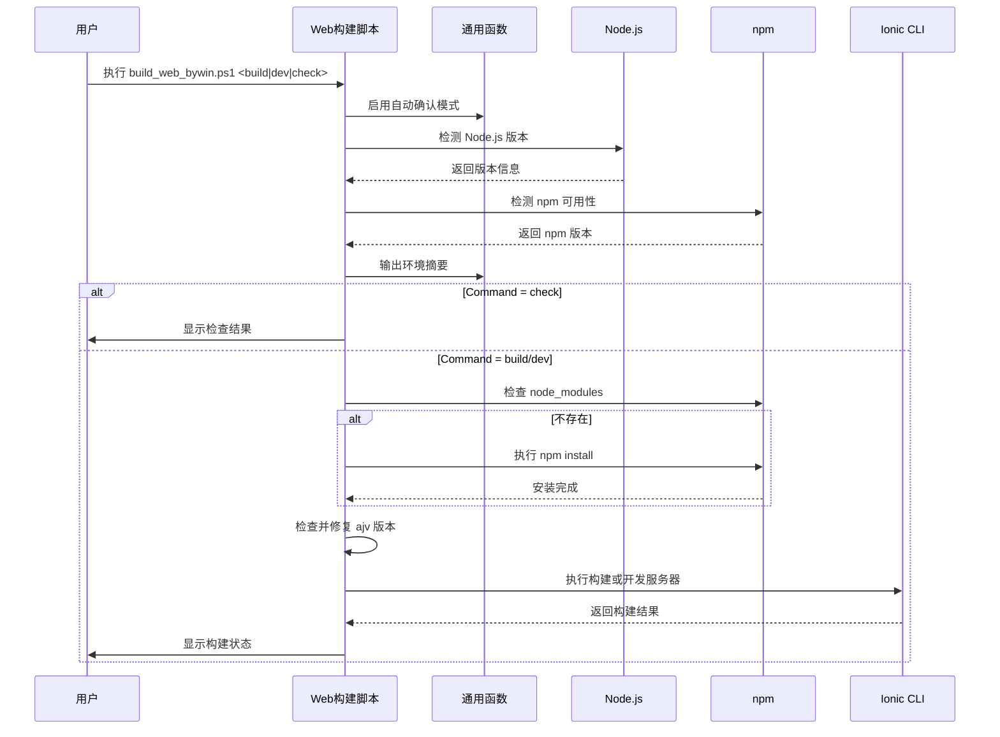
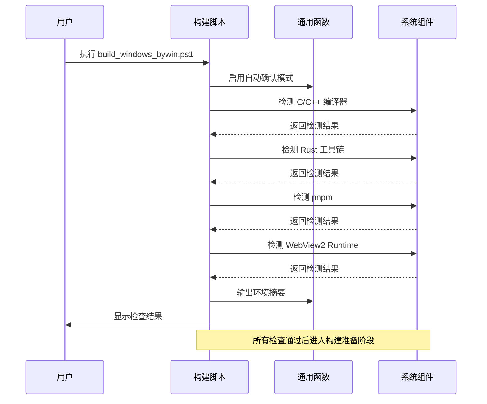
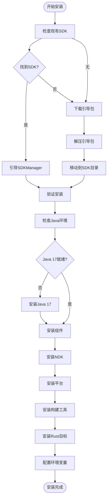
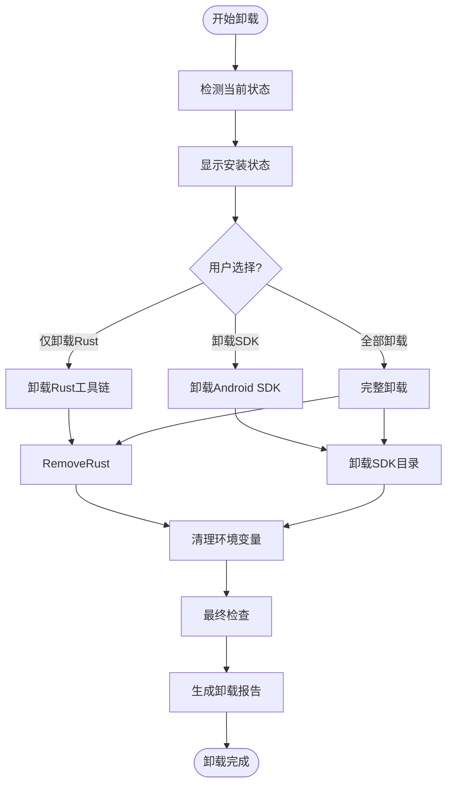
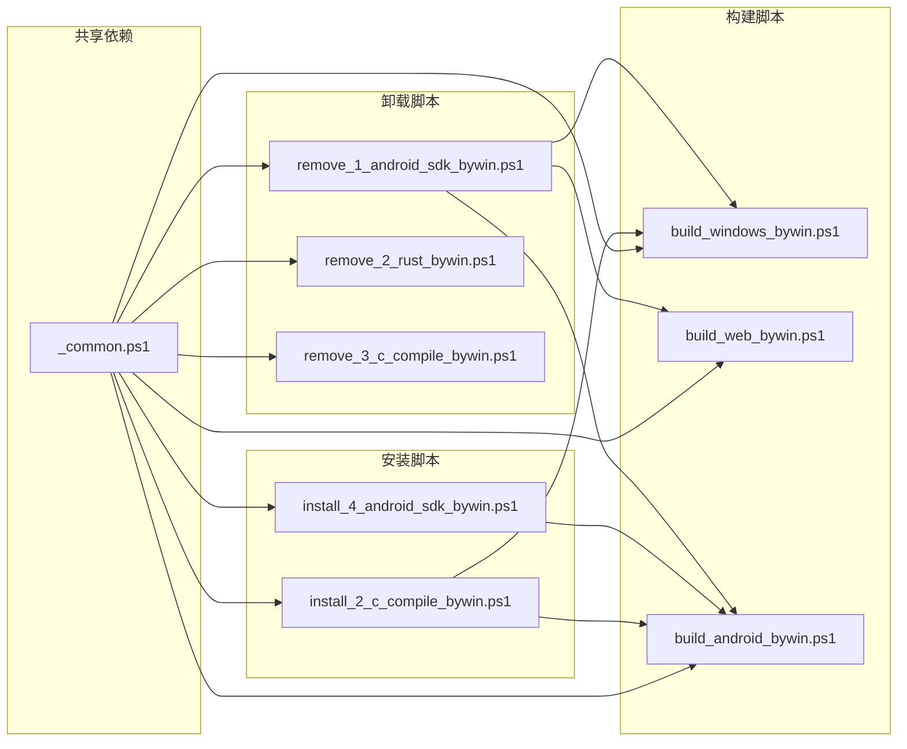

# Windows PowerShell自动化

<cite>
**本文档引用的文件**
- [_common.ps1](file://scripts/windows/_common.ps1)
- [build_web_bywin.ps1](file://scripts/windows/build_web_bywin.ps1)
- [build_windows_bywin.ps1](file://scripts/windows/build_windows_bywin.ps1)
- [build_android_bywin.ps1](file://scripts/windows/build_android_bywin.ps1)
- [install_2_c_compile_bywin.ps1](file://scripts/windows/install_2_c_compile_bywin.ps1)
- [install_4_android_sdk_bywin.ps1](file://scripts/windows/install_4_android_sdk_bywin.ps1)
- [remove_1_android_sdk_bywin.ps1](file://scripts/windows/remove_1_android_sdk_bywin.ps1)
- [remove_2_rust_bywin.ps1](file://scripts/windows/remove_2_rust_bywin.ps1)
- [remove_3_c_compile_bywin.ps1](file://scripts/windows/remove_3_c_compile_bywin.ps1)
- [scripts/README.md](file://scripts/README.md)
- [README.md](file://README.md)
</cite>

## 更新摘要
**变更内容**
- 新增 Windows PowerShell Web 构建脚本 `build_web_bywin.ps1` 的详细分析
- 更新项目结构图以包含新的 Web 构建脚本
- 增强核心组件分析，重点介绍 Web 构建脚本的功能特性
- 添加 Web 构建流程的详细架构图
- 更新依赖关系分析，反映新增的 Web 构建脚本

## 目录
1. [简介](#简介)
2. [项目结构](#项目结构)
3. [核心组件](#核心组件)
4. [架构概览](#架构概览)
5. [详细组件分析](#详细组件分析)
6. [依赖关系分析](#依赖关系分析)
7. [性能考虑](#性能考虑)
8. [故障排除指南](#故障排除指南)
9. [结论](#结论)

## 简介

Macro Deck Client App 是一个基于 Angular 和 Ionic 框架的跨平台应用程序，支持 iOS、Android 和 Web 平台。该项目包含了完整的 Windows PowerShell 自动化脚本系统，专门用于简化开发环境的搭建、维护和管理。

这些 PowerShell 脚本提供了从基础环境检查到复杂工具链安装的全方位自动化支持，特别针对 Windows 开发环境进行了深度优化。脚本系统采用模块化设计，通过共享的通用函数库实现代码复用，确保了一致的用户体验和可靠的执行流程。

**更新** 新增了专门的 Web 构建脚本 `build_web_bywin.ps1`，为 Windows 平台提供完整的 Web/PWA 构建支持，包括环境检查、Node.js 版本验证、npm 检查以及 ajv 版本冲突自动修复功能。

## 项目结构

项目中的 Windows PowerShell 自动化脚本主要位于 `scripts/windows/` 目录下，采用功能导向的命名约定：



**图表来源**
- [scripts/windows/_common.ps1:1-1114](file://scripts/windows/_common.ps1#L1-L1114)
- [scripts/windows/build_web_bywin.ps1:1-223](file://scripts/windows/build_web_bywin.ps1#L1-L223)
- [scripts/windows/build_windows_bywin.ps1:1-229](file://scripts/windows/build_windows_bywin.ps1#L1-L229)
- [scripts/windows/build_android_bywin.ps1:1-475](file://scripts/windows/build_android_bywin.ps1#L1-L475)

**章节来源**
- [scripts/windows/_common.ps1:1-1114](file://scripts/windows/_common.ps1#L1-L1114)
- [scripts/windows/build_web_bywin.ps1:1-223](file://scripts/windows/build_web_bywin.ps1#L1-L223)
- [scripts/windows/build_windows_bywin.ps1:1-229](file://scripts/windows/build_windows_bywin.ps1#L1-L229)
- [scripts/windows/build_android_bywin.ps1:1-475](file://scripts/windows/build_android_bywin.ps1#L1-L475)

## 核心组件

### 通用函数库 (_common.ps1)

这是整个 PowerShell 自动化系统的核心基础设施，提供了以下关键功能：

#### 日志记录系统
- **成功日志** (`Write-Ok`): 绿色显示成功信息
- **警告日志** (`Write-Warn`): 黄色显示警告信息  
- **失败日志** (`Write-Fail`): 红色显示错误信息
- **状态行** (`Write-StatusLine`): 统一的状态显示格式
- **横幅输出** (`Write-Banner`): 格式化的标题横幅

#### 交互确认机制
- **自动确认模式**: 支持 `-y` 静默模式
- **菜单选择系统**: 统一的编号菜单界面
- **确认对话框**: 支持默认值和自动确认标签

#### 系统集成工具
- **原生命令执行**: 处理 PowerShell 5.1 的特殊兼容性问题
- **路径管理**: 自动添加到 PATH 和用户环境变量
- **下载管理**: 多源并行下载和文件校验
- **编译器检测**: MSVC 和 GNU 工具链的智能检测

**章节来源**
- [scripts/windows/_common.ps1:11-117](file://scripts/windows/_common.ps1#L11-L117)
- [scripts/windows/_common.ps1:119-213](file://scripts/windows/_common.ps1#L119-L213)
- [scripts/windows/_common.ps1:242-341](file://scripts/windows/_common.ps1#L242-L341)

### Web 构建脚本 (build_web_bywin.ps1)

**新增** 这是专门为 Windows 平台设计的 Web/PWA 构建脚本，提供了完整的环境检查和构建支持。

#### 核心功能特性
- **三种操作模式**:
  - `build`: Web/PWA 生产构建（产物在 `www/`）
  - `dev`: 启动本地开发服务器（热重载）
  - `check`: 仅检查环境，不执行构建
- **Angular 19 兼容性**: 支持 Angular 19 的严格版本要求
- **自动环境修复**: ajv 版本冲突自动修复机制

#### 环境检查流程
1. **Node.js 版本验证**: 检测 Node.js 主版本 ≥ 18
2. **npm 检查**: 验证 npm 可用性和版本
3. **ajv 版本冲突检测**: 自动修复 v6 被提升到顶层的问题

#### 构建准备阶段
- **依赖安装**: 自动检测并安装 `node_modules`
- **版本修复**: 确保 ajv 版本为 8+
- **配置优化**: 支持多种 Angular 构建配置

**章节来源**
- [scripts/windows/build_web_bywin.ps1:17-26](file://scripts/windows/build_web_bywin.ps1#L17-L26)
- [scripts/windows/build_web_bywin.ps1:35-66](file://scripts/windows/build_web_bywin.ps1#L35-L66)
- [scripts/windows/build_web_bywin.ps1:74-84](file://scripts/windows/build_web_bywin.ps1#L74-L84)
- [scripts/windows/build_web_bywin.ps1:97-124](file://scripts/windows/build_web_bywin.ps1#L97-L124)

### C/C++ 编译器安装脚本

该脚本提供了两种主要的编译器安装路径：

#### MSVC (Visual Studio Build Tools)
- 通过官方安装器自动安装
- 支持国内镜像源加速下载
- 自动配置开发环境

#### GNU (MinGW-w64/MSYS2)
- 支持国内镜像源（清华、中科大）
- 自动处理 pacman 密钥环更新
- 智能锁文件处理机制

**章节来源**
- [scripts/windows/install_2_c_compile_bywin.ps1:191-232](file://scripts/windows/install_2_c_compile_bywin.ps1#L191-L232)
- [scripts/windows/install_2_c_compile_bywin.ps1:281-352](file://scripts/windows/install_2_c_compile_bywin.ps1#L281-L352)

### Android SDK 安装脚本

专为 Android 开发环境设计的完整安装解决方案：

#### 核心功能
- **SDKManager 引导安装**: 自动下载和安装命令行工具
- **Java 环境检查**: 确保 Java 17 正确配置
- **组件安装**: 平台工具、NDK、平台和构建工具
- **Rust 交叉编译支持**: 自动安装 Android 目标
- **环境变量配置**: 用户级和当前会话环境变量设置

#### 智能检测机制
- 多种 SDK 根目录定位策略
- 自动版本推导和验证
- 组件完整性检查

**章节来源**
- [scripts/windows/install_4_android_sdk_bywin.ps1:35-92](file://scripts/windows/install_4_android_sdk_bywin.ps1#L35-L92)
- [scripts/windows/install_4_android_sdk_bywin.ps1:127-150](file://scripts/windows/install_4_android_sdk_bywin.ps1#L127-L150)
- [scripts/windows/install_4_android_sdk_bywin.ps1:189-293](file://scripts/windows/install_4_android_sdk_bywin.ps1#L189-L293)

### Windows 桌面应用构建脚本

集成 Tauri 框架的 Windows 应用构建自动化：

#### 构建流程
1. **环境检查**: C/C++ 编译器、Rust 工具链、pnpm、WebView2 Runtime
2. **依赖准备**: pnpm install 和前端构建
3. **内存优化**: 针对 Windows OOM 问题的特殊配置
4. **应用构建**: 执行 `pnpm tauri dev/build`

#### 特殊优化
- **内存限制**: 8GB Node.js 内存限制
- **Rust 优化**: Release 构建的内存友好配置
- **环境变量**: 自动加载 .env 文件

**章节来源**
- [scripts/windows/build_windows_bywin.ps1:45-76](file://scripts/windows/build_windows_bywin.ps1#L45-L76)
- [scripts/windows/build_windows_bywin.ps1:141-229](file://scripts/windows/build_windows_bywin.ps1#L141-L229)

### Android 应用构建脚本

**更新** 该脚本提供了完整的 Android 应用构建支持，包括环境检查、项目重建和签名配置。

#### 核心功能
- **环境检查**: C/C++ 编译器、Rust 工具链、Java 17、Android SDK/NDK
- **项目重建**: 自动清理和重建 `gen/android` 工程
- **内存优化**: 针对 Windows OOM 问题的 Gradle 配置
- **签名管理**: 自动生成 keystore 文件

#### 特殊优化
- **进程管理**: 自动停止可能锁定目录的 Gradle/Kotlin Daemon
- **文件锁定处理**: 多次重试机制应对 Windows 文件锁定问题
- **镜像源配置**: 自动配置 Gradle 包装器镜像

**章节来源**
- [scripts/windows/build_android_bywin.ps1:45-58](file://scripts/windows/build_android_bywin.ps1#L45-L58)
- [scripts/windows/build_android_bywin.ps1:71-135](file://scripts/windows/build_android_bywin.ps1#L71-L135)
- [scripts/windows/build_android_bywin.ps1:149-177](file://scripts/windows/build_android_bywin.ps1#L149-L177)

## 架构概览

整个 PowerShell 自动化系统采用分层架构设计，确保了高内聚、低耦合的特性：



**图表来源**
- [scripts/windows/_common.ps1:1-1114](file://scripts/windows/_common.ps1#L1-L1114)
- [scripts/windows/build_web_bywin.ps1:1-223](file://scripts/windows/build_web_bywin.ps1#L1-L223)
- [scripts/windows/build_windows_bywin.ps1:1-229](file://scripts/windows/build_windows_bywin.ps1#L1-L229)
- [scripts/windows/build_android_bywin.ps1:1-475](file://scripts/windows/build_android_bywin.ps1#L1-L475)

## 详细组件分析

### Web 构建流程详细分析



**图表来源**
- [scripts/windows/build_web_bywin.ps1:127-137](file://scripts/windows/build_web_bywin.ps1#L127-L137)
- [scripts/windows/build_web_bywin.ps1:145-157](file://scripts/windows/build_web_bywin.ps1#L145-L157)
- [scripts/windows/build_web_bywin.ps1:169-184](file://scripts/windows/build_web_bywin.ps1#L169-L184)
- [scripts/windows/build_web_bywin.ps1:190-206](file://scripts/windows/build_web_bywin.ps1#L190-L206)

### 环境检查与验证流程



**图表来源**
- [scripts/windows/build_windows_bywin.ps1:45-133](file://scripts/windows/build_windows_bywin.ps1#L45-L133)
- [scripts/windows/_common.ps1:119-166](file://scripts/windows/_common.ps1#L119-L166)

### Android SDK 安装详细流程



**图表来源**
- [scripts/windows/install_4_android_sdk_bywin.ps1:35-293](file://scripts/windows/install_4_android_sdk_bywin.ps1#L35-L293)

### 卸载流程管理系统



**图表来源**
- [scripts/windows/remove_1_android_sdk_bywin.ps1:141-190](file://scripts/windows/remove_1_android_sdk_bywin.ps1#L141-L190)
- [scripts/windows/remove_2_rust_bywin.ps1:24-54](file://scripts/windows/remove_2_rust_bywin.ps1#L24-L54)
- [scripts/windows/remove_3_c_compile_bywin.ps1:24-95](file://scripts/windows/remove_3_c_compile_bywin.ps1#L24-L95)

**章节来源**
- [scripts/windows/build_web_bywin.ps1:1-223](file://scripts/windows/build_web_bywin.ps1#L1-L223)
- [scripts/windows/install_4_android_sdk_bywin.ps1:1-293](file://scripts/windows/install_4_android_sdk_bywin.ps1#L1-L293)
- [scripts/windows/remove_1_android_sdk_bywin.ps1:1-225](file://scripts/windows/remove_1_android_sdk_bywin.ps1#L1-L225)
- [scripts/windows/remove_2_rust_bywin.ps1:1-85](file://scripts/windows/remove_2_rust_bywin.ps1#L1-L85)
- [scripts/windows/remove_3_c_compile_bywin.ps1:1-118](file://scripts/windows/remove_3_c_compile_bywin.ps1#L1-L118)

## 依赖关系分析

### 脚本间依赖关系



**图表来源**
- [scripts/windows/_common.ps1:24-33](file://scripts/windows/_common.ps1#L24-L33)
- [scripts/windows/build_web_bywin.ps1:27-29](file://scripts/windows/build_web_bywin.ps1#L27-L29)
- [scripts/windows/build_windows_bywin.ps1:27-29](file://scripts/windows/build_windows_bywin.ps1#L27-L29)
- [scripts/windows/build_android_bywin.ps1:27-29](file://scripts/windows/build_android_bywin.ps1#L27-L29)

### 外部依赖分析

系统依赖的主要外部组件包括：

#### Microsoft 生态系统
- **Visual Studio Build Tools**: MSVC 编译器
- **Windows SDK**: 平台支持
- **WebView2 Runtime**: 应用运行时

#### 开源工具链
- **MSYS2/Pacman**: GNU 工具链包管理
- **Android Studio**: Android 开发环境
- **Rustup**: Rust 工具链管理

#### Web 开发工具
- **Node.js**: JavaScript 运行时环境
- **npm**: 包管理器
- **Ionic CLI**: Web 应用构建工具

#### 网络资源
- **国内镜像源**: 清华大学、中科大
- **GitHub**: 原始下载源
- **官方下载站**: 各组件官方源

**章节来源**
- [scripts/windows/build_web_bywin.ps1:35-66](file://scripts/windows/build_web_bywin.ps1#L35-L66)
- [scripts/windows/install_2_c_compile_bywin.ps1:43-83](file://scripts/windows/install_2_c_compile_bywin.ps1#L43-L83)
- [scripts/windows/install_4_android_sdk_bywin.ps1:39-43](file://scripts/windows/install_4_android_sdk_bywin.ps1#L39-L43)

## 性能考虑

### 内存优化策略

Windows 平台上的 Rust 构建经常遇到内存不足的问题，脚本系统采用了多项优化措施：

#### Node.js 内存限制
- **最大堆大小**: 8GB (`--max-old-space-size=8192`)
- **新生代大小**: 512MB (`--max-semi-space-size=512`)

#### Rust 编译优化
- **并行作业**: 单线程编译 (`CARGO_BUILD_JOBS=1`)
- **优化级别**: 降级到 1 级 (`CARGO_PROFILE_RELEASE_OPT_LEVEL=1`)
- **代码生成单元**: 增加到 256 (`CARGO_PROFILE_RELEASE_CODEGEN_UNITS=256`)
- **链接时优化**: 禁用 LTO (`CARGO_PROFILE_RELEASE_LTO=false`)

### Web 构建性能优化

**新增** Web 构建脚本特别针对 Angular 19 的性能要求进行了优化：

#### ajv 版本冲突自动修复
- **版本检测**: 自动检测 node_modules/ajv 的版本
- **智能修复**: 当检测到 v6 被提升到顶层时自动修复
- **命令执行**: 使用 `npm install ajv@^8.20.0 --legacy-peer-deps`

#### 下载性能优化
- **多源并行下载**: 并行测试多个下载源的速度
- **智能选择**: 自动选择最快的下载源
- **文件校验**: 下载完成后验证文件大小

#### 网络优化
- **超时控制**: 30 秒连接和读写超时
- **断点续传**: 支持长时间下载任务
- **进度显示**: 实时进度和速度反馈

**章节来源**
- [scripts/windows/build_web_bywin.ps1:97-124](file://scripts/windows/build_web_bywin.ps1#L97-L124)
- [scripts/windows/build_windows_bywin.ps1:188-196](file://scripts/windows/build_windows_bywin.ps1#L188-L196)
- [scripts/windows/_common.ps1:607-728](file://scripts/windows/_common.ps1#L607-L728)

## 故障排除指南

### 常见问题诊断

#### 环境检查失败
```powershell
# 检查 MSVC 安装
Test-Msvc

# 检查 GNU 工具链
Test-Gnu

# 检查 Rust 工具链
Test-RustToolchain
```

#### Web 构建问题
**新增** 针对 Web 构建的特定故障排除：

```powershell
# 检查 Node.js 版本
node --version

# 检查 npm 版本
npm --version

# 手动修复 ajv 版本冲突
npm install ajv@^8.20.0 --legacy-peer-deps

# 清理 node_modules 并重新安装
rm -rf node_modules
npm install --legacy-peer-deps
```

#### 下载问题
```powershell
# 检查网络连接
ping mirrors.ustc.edu.cn

# 手动下载测试
Save-WebFile -Urls @('https://mirrors.ustc.edu.cn/msys2/distrib/msys2-x86_64-latest.exe') -OutFile "test.exe"
```

#### 权限问题
```powershell
# 以管理员身份运行 PowerShell
# 检查执行策略
Get-ExecutionPolicy

# 临时允许脚本执行
Set-ExecutionPolicy -ExecutionPolicy RemoteSigned -Scope CurrentUser
```

### 卸载清理

#### 完整清理流程
```powershell
# 卸载 Android SDK
.\remove_1_android_sdk_bywin.ps1

# 卸载 Rust
.\remove_2_rust_bywin.ps1

# 卸载 C/C++ 编译器
.\remove_3_c_compile_bywin.ps1
```

#### 手动清理步骤
- 删除 `C:\msys64` 目录
- 清理用户环境变量中的 PATH 条目
- 删除 `~\.cargo` 和 `~\.rustup` 目录

**章节来源**
- [scripts/windows/build_web_bywin.ps1:127-137](file://scripts/windows/build_web_bywin.ps1#L127-L137)
- [scripts/windows/remove_1_android_sdk_bywin.ps1:26-37](file://scripts/windows/remove_1_android_sdk_bywin.ps1#L26-L37)
- [scripts/windows/remove_2_rust_bywin.ps1:40-54](file://scripts/windows/remove_2_rust_bywin.ps1#L40-L54)
- [scripts/windows/remove_3_c_compile_bywin.ps1:32-53](file://scripts/windows/remove_3_c_compile_bywin.ps1#L32-L53)

## 结论

Macro Deck Client App 的 Windows PowerShell 自动化系统展现了现代开发工具链的最佳实践。通过精心设计的模块化架构、完善的错误处理机制和智能化的用户交互体验，这套脚本系统为开发者提供了高效、可靠的开发环境管理解决方案。

**更新** 新增的 Web 构建脚本 `build_web_bywin.ps1` 进一步完善了整个自动化系统，为 Windows 平台提供了完整的 Web/PWA 构建支持。该脚本不仅具备了完整的环境检查和构建功能，还特别针对 Angular 19 的严格要求和常见的 ajv 版本冲突问题提供了智能解决方案。

### 主要优势

1. **高度自动化**: 减少了手动配置的复杂性和出错概率
2. **智能检测**: 自动识别现有环境并提供针对性的解决方案
3. **多源支持**: 国内镜像源加速下载，提高可靠性
4. **错误恢复**: 完善的错误处理和恢复机制
5. **用户友好**: 统一的交互界面和详细的进度反馈
6. **平台专优化**: 针对不同平台（Windows、Web、Android）的特定优化

### 技术特色

- **模块化设计**: 通过共享函数库实现代码复用
- **环境隔离**: 支持用户级和系统级环境变量配置
- **性能优化**: 针对 Windows 平台的特殊优化措施
- **安全考虑**: 完整的卸载和清理机制
- **版本兼容**: 智能处理不同框架版本的兼容性问题

这套 PowerShell 自动化系统不仅提高了开发效率，更为项目的长期维护奠定了坚实的基础，是现代跨平台开发项目的优秀范例。新增的 Web 构建脚本进一步增强了系统的完整性和实用性，为开发者提供了从桌面应用到 Web 应用的一站式自动化解决方案。