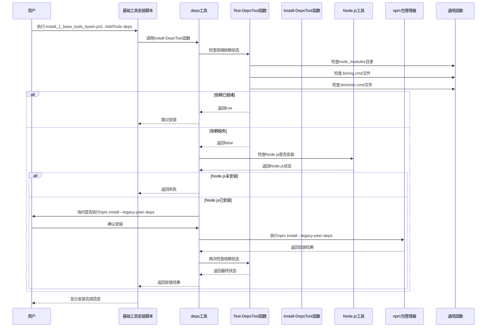
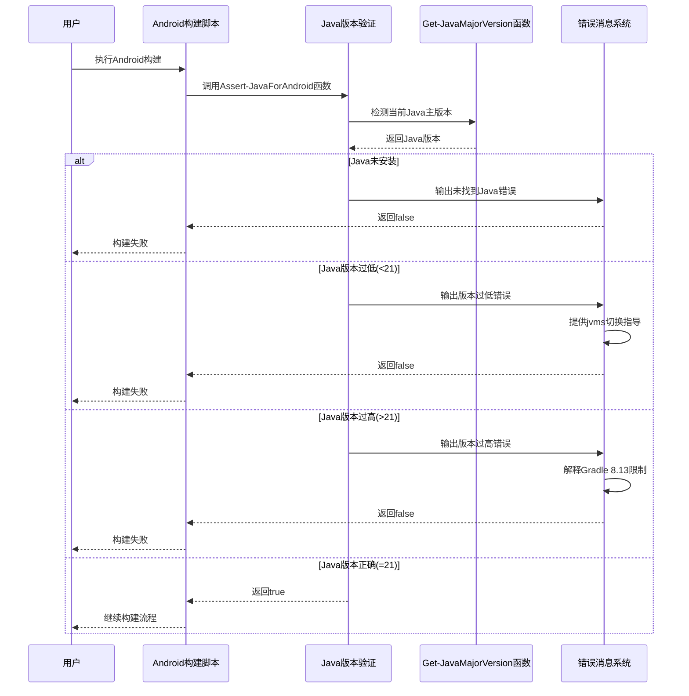
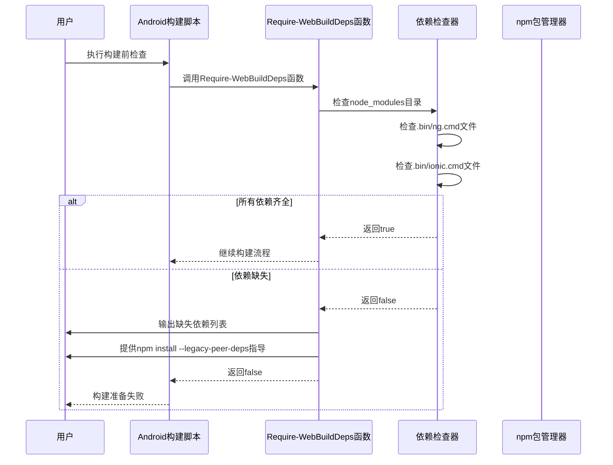
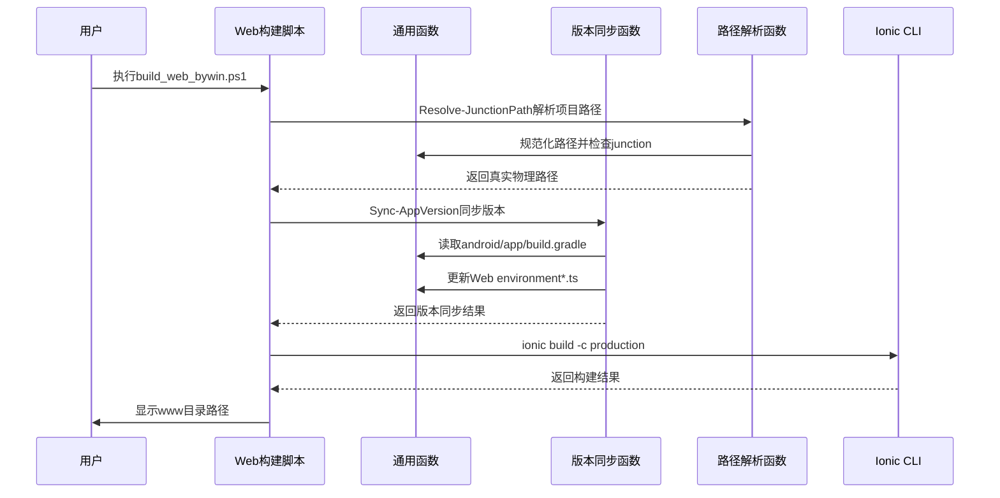
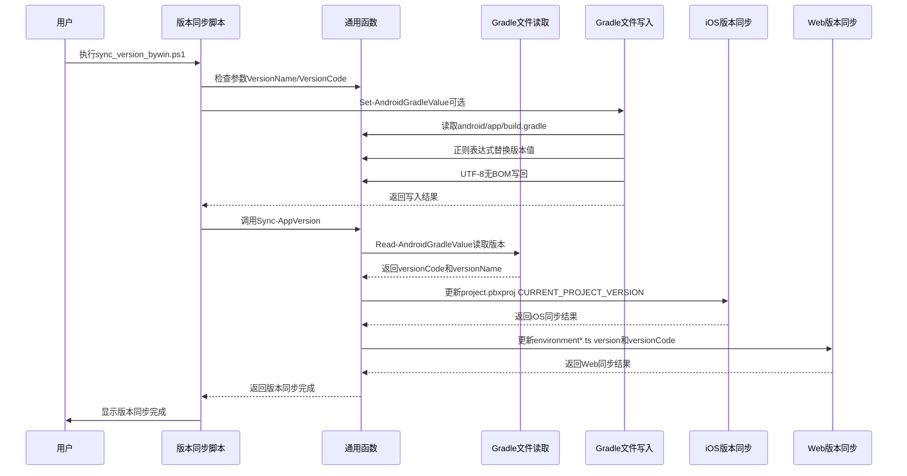
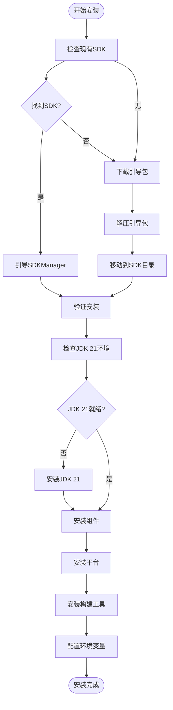
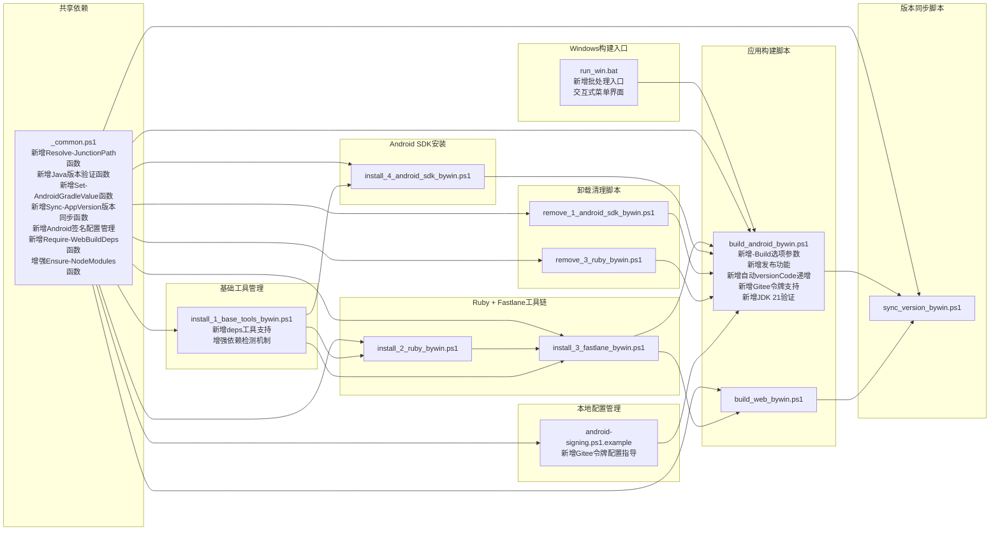

# Windows PowerShell自动化

<cite>
**本文档引用的文件**
- [run_win.bat](file://run_win.bat)
- [_common.ps1](file://scripts/windows/_common.ps1)
- [install_1_base_tools_bywin.ps1](file://scripts/windows/install_1_base_tools_bywin.ps1)
- [install_2_ruby_bywin.ps1](file://scripts/windows/install_2_ruby_bywin.ps1)
- [install_3_fastlane_bywin.ps1](file://scripts/windows/install_3_fastlane_bywin.ps1)
- [install_4_android_sdk_bywin.ps1](file://scripts/windows/install_4_android_sdk_bywin.ps1)
- [remove_1_android_sdk_bywin.ps1](file://scripts/windows/remove_1_android_sdk_bywin.ps1)
- [sync_version_bywin.ps1](file://scripts/windows/sync_version_bywin.ps1)
- [build_android_bywin.ps1](file://scripts/windows/build_android_bywin.ps1)
- [build_web_bywin.ps1](file://scripts/windows/build_web_bywin.ps1)
- [android-signing.ps1.example](file://scripts/local/android-signing.ps1.example)
</cite>

## 更新摘要
**变更内容**
- **前端依赖管理系统增强**：新增deps工具处理Node.js项目依赖，通过npm install --legacy-peer-deps解决peer dependency冲突
- **Enhanced-NodeModules函数升级**：现在检查关键二进制文件如.bin/ng.cmd和.bin/ionic.cmd而非仅检查node_modules存在性
- **新增Require-WebBuildDeps函数**：进行依赖验证而不安装，支持构建前环境检查
- **Java版本要求收紧**：从JDK 17-21范围收紧到特定JDK 21版本，错误消息更新以清晰解释此要求并提供jvms切换指导

## 目录
1. [简介](#简介)
2. [项目结构](#项目结构)
3. [核心组件](#核心组件)
4. [架构概览](#架构概览)
5. [详细组件分析](#详细组件分析)
6. [依赖关系分析](#依赖关系分析)
7. [性能考虑](#性能考虑)
8. [故障排除指南](#故障排除指南)
9. [结论](#结论)

## 简介

Macro Deck Client App 是一个基于 Angular 和 Ionic 框架的跨平台应用程序，支持 Android 和 Web 平台。该项目包含了完整的 Windows PowerShell 自动化脚本系统，专门用于简化开发环境的搭建、维护和管理。

**前端依赖管理系统增强** 项目最新更新中显著增强了Node.js项目依赖管理功能。新增的deps工具专门处理前端依赖安装，通过npm install --legacy-peer-deps参数解决peer dependency冲突问题。同时，Enhanced-NodeModules函数现在能够检查关键二进制文件（如.bin/ng.cmd和.bin/ionic.cmd）的存在性，而不仅仅是检查node_modules目录是否存在，确保依赖安装的完整性和可用性。

**新增依赖验证机制** 新增的Require-WebBuildDeps函数提供了独立的依赖验证功能，允许在构建前检查前端依赖是否就绪，而不执行实际的安装操作。这一改进使得构建流程更加可靠，能够在早期发现依赖缺失问题。

**Java版本要求严格化** Java版本要求从JDK 17-21范围收紧到特定的JDK 21版本，错误消息得到更新以清晰解释此要求，并提供jvms切换指导。这一变更确保了Android构建环境的稳定性和兼容性。

这些 PowerShell 脚本提供了从基础环境检查到复杂工具链安装的全方位自动化支持，特别针对 Windows 开发环境进行了深度优化。脚本系统采用模块化设计，通过共享的通用函数库实现代码复用，确保了一致的用户体验和可靠的执行流程。

## 项目结构

项目中的 Windows PowerShell 自动化脚本主要位于 `scripts/windows/` 目录下，现已发展为包含十个核心脚本的完整生态系统，并在根目录新增了便捷的批处理入口脚本：

```mermaid
graph TB
subgraph "Windows构建入口"
RunBat[run_win.bat<br/>新增批处理入口脚本<br/>交互式菜单界面<br/>简化用户操作]
end
subgraph "Windows PowerShell自动化脚本系统"
Common[_common.ps1<br/>通用函数库<br/>新增Resolve-JunctionPath函数<br/>新增Java版本验证函数<br/>新增Set-AndroidGradleValue函数<br/>新增Sync-AppVersion版本同步函数<br/>新增Require-WebBuildDeps函数<br/>增强Ensure-NodeModules函数]
subgraph "基础工具管理"
BaseTools[install_1_base_tools_bywin.ps1<br/>基础工具安装<br/>新增deps工具支持<br/>增强依赖检测机制]
end
subgraph "Ruby + Fastlane工具链"
InstallRuby[install_2_ruby_bywin.ps1<br/>Ruby + Devkit安装<br/>新增PATH同步机制<br/>新增RubyGems镜像检测]
InstallFastlane[install_3_fastlane_bywin.ps1<br/>Fastlane安装<br/>新增PATH同步机制<br/>新增Bundler版本检查<br/>新增Ruby 4.0+兼容性]
end
subgraph "Android SDK安装"
InstallSDK[install_4_android_sdk_bywin.ps1<br/>Android SDK安装<br/>新增Java版本验证]
end
subgraph "应用构建脚本"
BuildAndroid[build_android_bywin.ps1<br/>Android应用构建<br/>新增-Build选项参数说明<br/>新增自动versionCode递增<br/>新增发布功能<br/>新增Gitee令牌配置支持]
BuildWeb[build_web_bywin.ps1<br/>Web应用构建<br/>新增版本同步集成]
end
subgraph "版本同步脚本"
SyncVersion[sync_version_bywin.ps1<br/>版本号同步脚本<br/>参数化版本设置<br/>增强帮助系统]
end
subgraph "卸载清理脚本"
RemoveSDK[remove_1_android_sdk_bywin.ps1<br/>Android SDK卸载]
RemoveRuby[remove_3_ruby_bywin.ps1<br/>Ruby卸载]
end
subgraph "本地配置管理"
SignConfig[android-signing.ps1.example<br/>Android签名配置示例<br/>新增Gitee令牌配置指导]
end
RunBat --> BuildAndroid
Common --> BaseTools
Common --> InstallRuby
Common --> InstallFastlane
Common --> InstallSDK
Common --> BuildAndroid
Common --> BuildWeb
Common --> SyncVersion
Common --> RemoveSDK
Common --> RemoveRuby
Common --> SignConfig
InstallRuby --> InstallFastlane
InstallFastlane --> BuildAndroid
InstallFastlane --> BuildWeb
InstallSDK --> BuildAndroid
BuildAndroid --> SyncVersion
BuildWeb --> SyncVersion
RemoveSDK --> BuildAndroid
RemoveRuby --> BuildAndroid
BaseTools --> InstallRuby
BaseTools --> InstallFastlane
BaseTools --> InstallSDK
SignConfig --> BuildAndroid
```

**图表来源**
- [run_win.bat:1-66](file://run_win.bat#L1-L66)
- [scripts/windows/_common.ps1:1-1382](file://scripts/windows/_common.ps1#L1-L1382)
- [scripts/windows/install_1_base_tools_bywin.ps1:1-1007](file://scripts/windows/install_1_base_tools_bywin.ps1#L1-L1007)
- [scripts/windows/install_2_ruby_bywin.ps1:1-173](file://scripts/windows/install_2_ruby_bywin.ps1#L1-L173)
- [scripts/windows/install_3_fastlane_bywin.ps1:1-218](file://scripts/windows/install_3_fastlane_bywin.ps1#L1-L218)
- [scripts/windows/install_4_android_sdk_bywin.ps1:1-249](file://scripts/windows/install_4_android_sdk_bywin.ps1#L1-L249)
- [scripts/windows/remove_1_android_sdk_bywin.ps1:1-162](file://scripts/windows/remove_1_android_sdk_bywin.ps1#L1-L162)
- [scripts/windows/build_android_bywin.ps1:1-349](file://scripts/windows/build_android_bywin.ps1#L1-L349)
- [scripts/windows/build_web_bywin.ps1:1-298](file://scripts/windows/build_web_bywin.ps1#L1-L298)
- [scripts/windows/sync_version_bywin.ps1:1-80](file://scripts/windows/sync_version_bywin.ps1#L1-L80)
- [scripts/local/android-signing.ps1.example:1-23](file://scripts/local/android-signing.ps1.example#L1-L23)

**章节来源**
- [run_win.bat:1-66](file://run_win.bat#L1-L66)
- [scripts/windows/_common.ps1:1-1382](file://scripts/windows/_common.ps1#L1-L1382)
- [scripts/windows/install_1_base_tools_bywin.ps1:1-1007](file://scripts/windows/install_1_base_tools_bywin.ps1#L1-L1007)
- [scripts/windows/install_2_ruby_bywin.ps1:1-173](file://scripts/windows/install_2_ruby_bywin.ps1#L1-L173)
- [scripts/windows/install_3_fastlane_bywin.ps1:1-218](file://scripts/windows/install_3_fastlane_bywin.ps1#L1-L218)
- [scripts/windows/install_4_android_sdk_bywin.ps1:1-249](file://scripts/windows/install_4_android_sdk_bywin.ps1#L1-L249)
- [scripts/windows/remove_1_android_sdk_bywin.ps1:1-162](file://scripts/windows/remove_1_android_sdk_bywin.ps1#L1-L162)
- [scripts/windows/build_android_bywin.ps1:1-349](file://scripts/windows/build_android_bywin.ps1#L1-L349)
- [scripts/windows/build_web_bywin.ps1:1-298](file://scripts/windows/build_web_bywin.ps1#L1-L298)
- [scripts/windows/sync_version_bywin.ps1:1-80](file://scripts/windows/sync_version_bywin.ps1#L1-L80)
- [scripts/local/android-signing.ps1.example:1-23](file://scripts/local/android-signing.ps1.example#L1-L23)

## 核心组件

### **更新** 前端依赖管理系统

**重大更新** 前端依赖管理系统经过全面增强，引入了专门的deps工具和增强的依赖检测机制。

#### **新增** deps工具支持
**重大更新** 在基础工具管理中新增了专门的deps工具，专门处理Node.js项目依赖：

- **独立工具注册**：作为独立工具类型添加到ToolDefs注册表中
- **智能依赖检测**：通过Test-DepsTool函数检查node_modules、.bin/ng.cmd和.bin/ionic.cmd的存在性
- **专用安装流程**：通过Install-DepsTool函数执行npm install --legacy-peer-deps安装依赖
- **详细状态报告**：提供详细的依赖状态信息和路径显示

#### **增强** Ensure-NodeModules函数
**重大更新** Ensure-NodeModules函数现在具备更精确的依赖验证能力：

- **关键二进制文件检查**：不仅检查node_modules目录存在，还验证.bin/ng.cmd和.bin/ionic.cmd文件
- **智能安装决策**：根据实际依赖完整性决定是否执行npm install
- **详细错误信息**：当缺少特定二进制文件时提供具体的缺失信息
- **legacy-peer-deps支持**：使用--legacy-peer-deps参数解决peer dependency冲突

#### **新增** Require-WebBuildDeps函数
**重大更新** 新增的Require-WebBuildDeps函数提供独立的依赖验证功能：

- **只读验证模式**：仅检查依赖是否就绪，不执行任何安装操作
- **详细缺失报告**：列出所有缺失的依赖项及其具体位置
- **构建前检查**：适合在构建流程开始前进行环境预检
- **友好提示信息**：提供清晰的安装指导和命令示例

#### 技术实现特点
- **精确路径验证**：检查node_modules\.bin\ng.cmd和node_modules\.bin\ionic.cmd
- **智能降级策略**：当检测到部分依赖缺失时提供针对性的修复建议
- **错误恢复机制**：在安装失败后提供删除node_modules和package-lock.json的重试建议
- **用户交互优化**：在执行npm install前提供确认提示

**章节来源**
- [scripts/windows/_common.ps1:1066-1121](file://scripts/windows/_common.ps1#L1066-L1121)
- [scripts/windows/install_1_base_tools_bywin.ps1:736-808](file://scripts/windows/install_1_base_tools_bywin.ps1#L736-L808)
- [scripts/windows/install_1_base_tools_bywin.ps1:35-41](file://scripts/windows/install_1_base_tools_bywin.ps1#L35-L41)

### **更新** Java版本验证系统

**重大更新** Java版本验证系统经过重新设计，将版本要求从JDK 17-21范围收紧到特定的JDK 21版本。

#### **新增** Assert-JavaForAndroid函数
**重大更新** 新的Assert-JavaForAndroid函数提供精确的JDK版本验证：

- **严格版本要求**：强制要求JDK 21版本，不再接受其他版本
- **详细错误信息**：提供具体的版本不兼容原因和解决方案
- **jvms切换指导**：明确指导用户使用jvms use 21命令切换Java版本
- **Capacitor兼容性**：基于Capacitor插件toolchain硬编码要求

#### **更新** 错误消息系统
**重大更新** 错误消息系统得到全面改进：

- **清晰的版本要求说明**：明确指出需要JDK 21的原因（Capacitor插件toolchain要求）
- **实用的解决方案**：提供jvms切换命令和Adoptium下载链接
- **版本范围解释**：说明为什么不接受JDK 22+或低于21的版本
- **Gradle兼容性说明**：解释Gradle 8.13对JDK版本的限制

#### 技术实现特点
- **精确版本匹配**：Min=21, Max=21的严格范围验证
- **渐进式错误处理**：区分未安装、版本过低、版本过高的不同情况
- **用户友好的提示信息**：提供具体的操作步骤和外部资源链接
- **构建流程集成**：在Android构建流程中尽早进行Java版本检查

**章节来源**
- [scripts/windows/_common.ps1:873-909](file://scripts/windows/_common.ps1#L873-L909)
- [scripts/windows/build_android_bywin.ps1:306-307](file://scripts/windows/build_android_bywin.ps1#L306-L307)

### **更新** Android签名配置示例 (android-signing.ps1.example)

**重大更新** 该文件提供了Android签名配置的完整示例，新增了详细的Gitee发布令牌配置指导。

#### 核心配置项
- **密钥库密码** (`KEYSTORE_FILE_PASSWORD`): 必填的密钥库访问密码
- **版本号管理**: 强调versionName/versionCode始终以android\app\build.gradle为准
- **Keystore路径配置**: 可选的自定义keystore路径和别名设置
- **密钥库创建指导**: 完整的keytool命令示例

#### **新增** Gitee发布令牌配置指导
**重大更新** 新增了完整的Gitee个人访问令牌配置说明：

```powershell
# Gitee 发布令牌（仅 -Publish -Platform gitee 时需要）：
# 获取令牌：https://gitee.com/personal_access_tokens
# $env:GITEE_TOKEN = "你的 Gitee 私人令牌"
```

该配置项专门为Gitee平台发布功能提供认证支持，包括：
- **令牌获取链接**: 提供官方令牌创建页面的直接链接
- **环境变量设置**: 清晰的环境变量命名和赋值语法
- **使用条件说明**: 明确标注仅在特定发布模式下需要
- **中文本地化**: 所有配置说明均为中文，提升用户体验

#### 版本管理指导
- **权威版本源**: 明确指出android\app\build.gradle是版本信息的唯一权威来源
- **自动递增机制**: 说明构建时versionCode自动+1的行为
- **手动版本设置**: 提供sync_version_bywin.ps1脚本的使用指导
- **环境变量限制**: 明确说明在此文件中设置BUILD_NUMBER/VERSION_NUMBER不会生效

#### 密钥库管理
- **默认路径配置**: 提供标准的keystore文件路径示例
- **别名设置**: 默认的密钥库别名配置
- **创建命令**: 完整的RSA 2048位密钥库创建命令
- **有效期设置**: 10000天的证书有效期配置

**章节来源**
- [scripts/local/android-signing.ps1.example:1-23](file://scripts/local/android-signing.ps1.example#L1-L23)

### **更新** 基础工具管理脚本 (install_1_base_tools_bywin.ps1)

**重大更新** 该脚本提供了Windows基础工具的完整管理功能，包括winget、Windows终端和Microsoft Store的安装与配置，并新增了deps工具支持。

#### **新增** deps工具功能特性
- **独立工具注册**：作为第五个可用工具添加到工具注册表
- **智能依赖检测**：通过Test-DepsTool函数检查前端依赖完整性
- **专用安装流程**：通过Install-DepsTool函数执行npm install --legacy-peer-deps
- **详细状态报告**：显示node_modules、ng、ionic的具体路径信息

#### 核心功能特性
- **winget管理**: 自动检测、安装和配置winget包管理器
- **Windows终端**: 支持多种安装方式（GitHub、winget、Microsoft Store）
- **Microsoft Store**: 系统组件的自动安装与验证
- **Node.js LTS**: 作为Ionic + Capacitor构建的前置依赖
- **前端依赖管理**: 新增deps工具处理Angular和Ionic依赖

#### 智能安装策略
- **多源下载**: 优先使用GitHub镜像，失败时回退到官方源
- **安装包验证**: 下载完成后进行文件大小校验
- **安装后验证**: 自动检测安装结果并输出详细信息
- **依赖完整性检查**: 确保.bin目录下的关键可执行文件存在

**章节来源**
- [scripts/windows/install_1_base_tools_bywin.ps1:35-41](file://scripts/windows/install_1_base_tools_bywin.ps1#L35-L41)
- [scripts/windows/install_1_base_tools_bywin.ps1:736-808](file://scripts/windows/install_1_base_tools_bywin.ps1#L736-L808)
- [scripts/windows/install_1_base_tools_bywin.ps1:813-819](file://scripts/windows/install_1_base_tools_bywin.ps1#L813-L819)

### **更新** Android应用构建脚本 (build_android_bywin.ps1)

**重大更新** 该脚本提供了完整的 Android 应用构建支持，集成了Ionic + Capacitor + fastlane工具链，并新增了综合的-Build选项参数说明和发布功能。

#### **更新** Java版本验证集成
**重大更新** 在构建流程中集成了新的严格Java版本验证：

```powershell
if (-not (Assert-JavaForAndroid)) { $ready = $false }
```

该验证确保Android构建前具备JDK 21环境，为后续的Android构建做好准备。

#### 新增的综合参数系统
**重大更新** 构建了完整的命令行参数体系：

- **-Build参数**: 构建 release APK/AAB（不发布），versionCode 自动递增
- **-Check参数**: 只检查签名变量、npx、fastlane 是否可用，不执行 Web/Android 构建
- **-Publish参数**: 仅发布：跳过构建，直接把已有 APK+AAB 发布到 Release
- **-Platform参数**: 发布平台，仅与 -Publish 搭配使用。可选值：github（默认）、gitee
- **-Help参数**: 显示本帮助（参数说明与用法示例）后退出，不执行任何构建

#### 自动versionCode递增功能
**重大更新** 实现了智能的版本号管理机制：

```powershell
$currentCode = Read-AndroidGradleValue 'versionCode'
$parsed = 0
if ([int]::TryParse($currentCode, [ref]$parsed)) {
  $env:BUILD_NUMBER = ($parsed + 1).ToString()
  Write-Ok "versionCode 自动递增：$currentCode -> $env:BUILD_NUMBER"
} else {
  Write-Warn "无法解析当前 versionCode（'$currentCode'），BUILD_NUMBER 回退为 1"
  $env:BUILD_NUMBER = '1'
}
```

该功能确保每次构建都生成唯一的版本号，避免版本冲突问题。

#### 多平台发布功能
**重大更新** 支持GitHub和Gitee两个平台的Release发布：

- **GitHub发布**: 通过gh CLI工具进行认证和发布
- **Gitee发布**: 通过REST API直接调用，支持自定义token
- **产物验证**: 自动检查APK和AAB文件是否存在
- **说明文件处理**: 从RELEASE_NOTES.md读取发布说明
- **Tag管理**: 自动生成格式化的tag名称（v<versionName>+<versionCode>）

#### 增强的用户体验功能
**重大更新** 提供了全面的用户界面优化：

- **详细帮助系统**: 完整的参数说明和使用示例
- **实时进度反馈**: 构建和发布过程中的详细进度显示
- **错误诊断**: 具体的错误信息和修复建议
- **中文本地化**: 所有用户界面消息均为中文

#### 特殊优化
- **本地签名配置**: 支持scripts/local/android-signing.ps1
- **环境变量管理**: 自动从build.gradle读取版本信息
- **命令执行封装**: 统一的命令执行和错误处理
- **版本同步**: 构建完成后自动同步版本号到iOS和Web

**章节来源**
- [scripts/windows/build_android_bywin.ps1:306-307](file://scripts/windows/build_android_bywin.ps1#L306-L307)
- [scripts/windows/build_android_bywin.ps1:10-47](file://scripts/windows/build_android_bywin.ps1#L10-L47)
- [scripts/windows/build_android_bywin.ps1:56-80](file://scripts/windows/build_android_bywin.ps1#L56-L80)
- [scripts/windows/build_android_bywin.ps1:132-171](file://scripts/windows/build_android_bywin.ps1#L132-L171)
- [scripts/windows/build_android_bywin.ps1:174-303](file://scripts/windows/build_android_bywin.ps1#L174-L303)
- [scripts/windows/build_android_bywin.ps1:305-349](file://scripts/windows/build_android_bywin.ps1#L305-L349)

### **更新** Web应用构建脚本 (build_web_bywin.ps1)

**重大更新** 该脚本提供了完整的 Web 应用构建支持，集成了版本同步功能以确保Web构建时的版本一致性。

#### 核心功能
- **版本同步集成**: 构建前自动从android/app/build.gradle同步版本信息到Web环境
- **Ionic构建**: 使用指定配置构建Web资源
- **缓存管理**: 支持清理Angular缓存以解决编译问题
- **构建验证**: 验证构建产物的存在和完整性

#### **新增** 版本同步集成
**重大更新** 在Web构建前自动执行版本同步：

```powershell
# ─── 版本同步：以 build.gradle 为源，写入 environment*.ts，使界面显示与 Android 一致 ───
Write-Host "[版本同步] 从 android/app/build.gradle 同步版本到 Web" -ForegroundColor Cyan
Sync-AppVersion
Write-Host ""
```

该功能确保Web界面显示的版本信息与Android构建的版本信息保持一致。

#### 特殊优化
- **环境文件同步**: 自动更新四个environment*.ts文件的版本信息
- **构建缓存清理**: 支持清理Angular缓存以解决编译问题
- **构建产物验证**: 验证www目录和index.html的存在

**章节来源**
- [scripts/windows/build_web_bywin.ps1:266-268](file://scripts/windows/build_web_bywin.ps1#L266-L268)
- [scripts/windows/build_web_bywin.ps1:271-298](file://scripts/windows/build_web_bywin.ps1#L271-L298)

### **更新** 版本同步脚本 (sync_version_bywin.ps1)

**重大更新** 该脚本提供了独立的版本号同步功能，专门用于在不进行完整构建的情况下同步三端版本号。

#### 核心功能特性
- **参数化版本设置**: 支持通过命令行参数直接设置版本号
- **独立版本同步**: 仅同步版本号，不执行构建流程
- **版本源权威性**: 以android/app/build.gradle为唯一版本权威源
- **三端同步**: 同步到iOS和Web平台的版本信息
- **解耦构建**: 与构建流程解耦，适合"只想对齐版本号"的场景
- **增强帮助系统**: 提供完整的使用示例和参数说明

#### 版本同步机制
- **iOS同步**: 更新project.pbxproj的CURRENT_PROJECT_VERSION和MARKETING_VERSION
- **Web同步**: 更新四个environment*.ts文件的version和versionCode
- **UTF-8无BOM写回**: 确保文件编码一致性

#### 参数化功能
- **VersionName参数**: 设置版本名（如3.1.0）
- **VersionCode参数**: 设置版本号（正整数）
- **Help参数**: 显示详细帮助信息
- **自动验证**: VersionCode参数的正整数验证

#### 使用场景
- **版本对齐**: 当需要快速同步三端版本号而不需要完整构建时
- **预发布检查**: 在正式构建前验证版本号一致性
- **CI/CD集成**: 在持续集成流程中单独执行版本同步步骤
- **手动版本设置**: 直接通过命令行设置版本号并同步

**章节来源**
- [scripts/windows/sync_version_bywin.ps1:1-80](file://scripts/windows/sync_version_bywin.ps1#L1-L80)

## 架构概览

整个 PowerShell 自动化系统采用分层架构设计，新增了Windows批处理入口层，确保了高内聚、低耦合的特性：

```mermaid
graph TB
subgraph "用户接口层"
CLI[命令行界面]
Menu[交互菜单]
Help[帮助系统]
RunBat[run_win.bat<br/>新增批处理入口<br/>交互式菜单界面]
end
subgraph "业务逻辑层"
EnvCheck[环境检查]
Install[安装流程]
Uninstall[卸载流程]
Build[构建流程]
BaseTools[基础工具管理<br/>新增deps工具支持]
RubyFastlane[Ruby + Fastlane管理]
AndroidSetup[Android环境配置]
VersionSync[版本同步管理]
JunctionPath[NTFS junction路径解析]
ReleasePublish[发布管理<br/>新增多平台发布功能]
AutoVersioning[自动版本管理<br/>新增versionCode递增]
SignConfig[签名配置管理<br/>新增Gitee令牌支持]
FrontendDeps[前端依赖管理<br/>新增deps工具和依赖验证]
JavaValidation[Java版本验证<br/>新增JDK 21强制验证]
end
subgraph "基础设施层"
Common[通用函数库<br/>新增Resolve-JunctionPath函数<br/>新增Java版本验证<br/>新增Set-AndroidGradleValue函数<br/>新增Sync-AppVersion版本同步函数<br/>新增Android签名配置管理<br/>新增Require-WebBuildDeps函数<br/>增强Ensure-NodeModules函数]
Helpers[辅助工具]
Download[下载引擎]
Registry[注册表操作]
Mirror[RubyGems镜像检测]
IonicCapacitor[Ionic + Capacitor集成]
Fastlane[fastlane工具链]
Ruby[Ruby + Devkit]
AndroidSDK[Android SDK]
NodeJS[Node.js]
NPM[npm]
Winget[Winget包管理器]
WindowsTerminal[Windows终端]
MicrosoftStore[Microsoft Store]
Bundler[Bundler版本检查]
PATH[PATH同步机制]
Ruby40Compatibility[Ruby 4.0+兼容性]
JDK21Validation[JDK 21版本验证<br/>新增严格版本要求]
FrontendDepValidation[前端依赖验证<br/>新增二进制文件检查]
VersionSyncFunction[版本同步函数<br/>新增三端版本统一]
AndroidGradleValue[Android Gradle值修改<br/>新增精确版本设置]
SignConfigLoader[Android签名配置加载<br/>新增本地配置管理]
JunctionPathFunction[NTFS junction路径解析<br/>新增路径兼容性处理]
GitHubRelease[GitHub Release API<br/>新增发布功能]
GiteeRelease[Gitee Release API<br/>新增发布功能<br/>新增令牌配置支持]
ArtifactValidation[构建产物验证<br/>新增APK/AAB检查]
TokenManagement[令牌管理<br/>新增Gitee令牌配置]
end
RunBat --> EnvCheck
RunBat --> Install
RunBat --> Uninstall
RunBat --> Build
RunBat --> BaseTools
RunBat --> RubyFastlane
RunBat --> AndroidSetup
RunBat --> VersionSync
RunBat --> JunctionPath
RunBat --> ReleasePublish
RunBat --> AutoVersioning
RunBat --> SignConfig
RunBat --> FrontendDeps
RunBat --> JavaValidation
CLI --> EnvCheck
CLI --> Install
CLI --> Uninstall
CLI --> Build
CLI --> BaseTools
CLI --> RubyFastlane
CLI --> AndroidSetup
CLI --> VersionSync
CLI --> JunctionPath
CLI --> ReleasePublish
CLI --> AutoVersioning
CLI --> SignConfig
CLI --> FrontendDeps
CLI --> JavaValidation
EnvCheck --> Common
Install --> Common
Uninstall --> Common
Build --> Common
BaseTools --> Common
RubyFastlane --> Common
AndroidSetup --> Common
VersionSync --> Common
JunctionPath --> Common
ReleasePublish --> Common
AutoVersioning --> Common
SignConfig --> Common
FrontendDeps --> Common
JavaValidation --> Common
Common --> Helpers
Common --> Download
Common --> Registry
Common --> Mirror
Common --> Bundler
Common --> PATH
Common --> Ruby40Compatibility
Common --> JDK21Validation
Common --> FrontendDepValidation
Common --> VersionSyncFunction
Common --> AndroidGradleValue
Common --> SignConfigLoader
Common --> JunctionPathFunction
Common --> GitHubRelease
Common --> GiteeRelease
Common --> ArtifactValidation
Common --> TokenManagement
Install --> Ruby
Install --> Fastlane
Install --> AndroidSDK
Install --> NodeJS
Install --> Winget
Install --> WindowsTerminal
Install --> MicrosoftStore
Build --> IonicCapacitor
Build --> Fastlane
Build --> AndroidSetup
Build --> VersionSyncFunction
Build --> JunctionPathFunction
Build --> AutoVersioning
Build --> SignConfigLoader
Build --> FrontendDepValidation
Build --> JDK21Validation
ReleasePublish --> GitHubRelease
ReleasePublish --> GiteeRelease
ReleasePublish --> ArtifactValidation
ReleasePublish --> TokenManagement
RubyFastlane --> Ruby
RubyFastlane --> Fastlane
AndroidSetup --> AndroidSDK
VersionSync --> VersionSyncFunction
VersionSync --> AndroidGradleValue
JunctionPath --> JunctionPathFunction
AutoVersioning --> AndroidGradleValue
SignConfig --> SignConfigLoader
SignConfig --> TokenManagement
FrontendDeps --> FrontendDepValidation
FrontendDeps --> NodeJS
FrontendDeps --> NPM
JavaValidation --> JDK21Validation
```



**图表来源**
- [run_win.bat:1-66](file://run_win.bat#L1-L66)
- [scripts/windows/_common.ps1:1-1382](file://scripts/windows/_common.ps1#L1-L1382)
- [scripts/windows/install_1_base_tools_bywin.ps1:1-1007](file://scripts/windows/install_1_base_tools_bywin.ps1#L1-L1007)
- [scripts/windows/install_2_ruby_bywin.ps1:1-173](file://scripts/windows/install_2_ruby_bywin.ps1#L1-L173)
- [scripts/windows/install_3_fastlane_bywin.ps1:1-218](file://scripts/windows/install_3_fastlane_bywin.ps1#L1-L218)
- [scripts/windows/install_4_android_sdk_bywin.ps1:1-249](file://scripts/windows/install_4_android_sdk_bywin.ps1#L1-L249)
- [scripts/windows/remove_1_android_sdk_bywin.ps1:1-162](file://scripts/windows/remove_1_android_sdk_bywin.ps1#L1-L162)
- [scripts/windows/build_android_bywin.ps1:1-349](file://scripts/windows/build_android_bywin.ps1#L1-L349)
- [scripts/windows/build_web_bywin.ps1:1-298](file://scripts/windows/build_web_bywin.ps1#L1-L298)
- [scripts/windows/sync_version_bywin.ps1:1-80](file://scripts/windows/sync_version_bywin.ps1#L1-L80)
- [scripts/local/android-signing.ps1.example:1-23](file://scripts/local/android-signing.ps1.example#L1-L23)

## 详细组件分析

### **更新** 前端依赖管理流程详细分析



**图表来源**
- [scripts/windows/install_1_base_tools_bywin.ps1:778-808](file://scripts/windows/install_1_base_tools_bywin.ps1#L778-L808)
- [scripts/windows/install_1_base_tools_bywin.ps1:747-770](file://scripts/windows/install_1_base_tools_bywin.ps1#L747-L770)

### **更新** Java版本验证流程详细分析



**图表来源**
- [scripts/windows/_common.ps1:887-909](file://scripts/windows/_common.ps1#L887-L909)
- [scripts/windows/_common.ps1:837-844](file://scripts/windows/_common.ps1#L837-L844)
- [scripts/windows/build_android_bywin.ps1:306-307](file://scripts/windows/build_android_bywin.ps1#L306-L307)

### **更新** 依赖验证流程详细分析



**图表来源**
- [scripts/windows/_common.ps1:1103-1121](file://scripts/windows/_common.ps1#L1103-L1121)
- [scripts/windows/build_android_bywin.ps1:310](file://scripts/windows/build_android_bywin.ps1#L310)

### Web构建流程详细分析



**图表来源**
- [scripts/windows/build_web_bywin.ps1:266-268](file://scripts/windows/build_web_bywin.ps1#L266-L268)

### 版本同步流程详细分析



**图表来源**
- [scripts/windows/sync_version_bywin.ps1:69-75](file://scripts/windows/sync_version_bywin.ps1#L69-L75)
- [scripts/windows/sync_version_bywin.ps1:77](file://scripts/windows/sync_version_bywin.ps1#L77)
- [scripts/windows/_common.ps1:1161-1180](file://scripts/windows/_common.ps1#L1161-L1180)
- [scripts/windows/_common.ps1:1194-1238](file://scripts/windows/_common.ps1#L1194-L1238)

### 基础工具管理流程

```mermaid
flowchart TD
Start([开始基础工具管理]) --> CheckTools[检测现有工具]
CheckTools --> ShowMenu[显示可用工具菜单]
ShowMenu --> SelectTools{用户选择?}
SelectTools --> |安装工具| InstallProcess[执行安装流程]
SelectTools --> |卸载工具| UninstallProcess[执行卸载流程]
InstallProcess --> InstallWinget[安装winget]
InstallWinget --> ConfigureMirror[配置镜像源]
InstallWinget --> InstallTerminal[安装Windows终端]
InstallTerminal --> InstallStore[安装Microsoft Store]
InstallStore --> InstallNode[安装Node.js LTS]
InstallNode --> InstallDeps[安装前端依赖(deps)]
InstallDeps --> CheckDeps[检查.bin/ng.cmd和.bin/ionic.cmd]
CheckDeps --> Complete([安装完成])
UninstallProcess --> UninstallTerminal[卸载Windows终端]
UninstallTerminal --> Complete
CheckTools --> ShowMenu
```

**图表来源**
- [scripts/windows/install_1_base_tools_bywin.ps1:728-731](file://scripts/windows/install_1_base_tools_bywin.ps1#L728-L731)
- [scripts/windows/install_1_base_tools_bywin.ps1:781-800](file://scripts/windows/install_1_base_tools_bywin.ps1#L781-L800)
- [scripts/windows/install_1_base_tools_bywin.ps1:747-770](file://scripts/windows/install_1_base_tools_bywin.ps1#L747-L770)

### Android SDK安装详细流程



**图表来源**
- [scripts/windows/install_4_android_sdk_bywin.ps1:35-249](file://scripts/windows/install_4_android_sdk_bywin.ps1#L35-L249)

### 卸载流程管理系统


**图表来源**
- [scripts/windows/remove_1_android_sdk_bywin.ps1:141-190](file://scripts/windows/remove_1_android_sdk_bywin.ps1#L141-L190)

## 依赖关系分析

### 脚本间依赖关系



**图表来源**
- [run_win.bat:4-9](file://run_win.bat#L4-L9)
- [scripts/windows/_common.ps1:24-33](file://scripts/windows/_common.ps1#L24-L33)
- [scripts/windows/install_1_base_tools_bywin.ps1:686-695](file://scripts/windows/install_1_base_tools_bywin.ps1#L686-L695)
- [scripts/windows/install_2_ruby_bywin.ps1:12-14](file://scripts/windows/install_2_ruby_bywin.ps1#L12-L14)
- [scripts/windows/install_3_fastlane_bywin.ps1:12-14](file://scripts/windows/install_3_fastlane_bywin.ps1#L12-L14)
- [scripts/windows/install_4_android_sdk_bywin.ps1:7-9](file://scripts/windows/install_4_android_sdk_bywin.ps1#L7-L9)
- [scripts/windows/build_android_bywin.ps1:27-29](file://scripts/windows/build_android_bywin.ps1#L27-L29)
- [scripts/windows/build_web_bywin.ps1:266-268](file://scripts/windows/build_web_bywin.ps1#L266-L268)
- [scripts/windows/sync_version_bywin.ps1:16-16](file://scripts/windows/sync_version_bywin.ps1#L16-L16)
- [scripts/local/android-signing.ps1.example:1-23](file://scripts/local/android-signing.ps1.example#L1-L23)

### 外部依赖分析

系统依赖的主要外部组件包括：

#### Microsoft 生态系统
- **Visual Studio Build Tools**: MSVC 编译器
- **Windows SDK**: 平台支持
- **WebView2 Runtime**: 应用运行时

#### 开源工具链
- **MSYS2/Pacman**: GNU 工具链包管理
- **Android Studio**: Android 开发环境
- **RubyInstaller**: Ruby + Devkit工具链

#### Web 开发工具
- **Node.js LTS**: JavaScript 运行时环境
- **npm**: 包管理器
- **Ionic CLI**: Web 应用构建工具
- **Capacitor CLI**: 跨平台应用框架
- **@angular/cli**: Angular CLI工具
- **@ionic/cli**: Ionic CLI工具

#### Ruby生态工具
- **Ruby 3.0+**: Ruby运行时环境
- **Bundler**: Ruby依赖管理
- **fastlane**: Android/iOS应用构建工具
- **RubyGems**: Ruby包管理器
- **fiddle**: **新增** Ruby 4.0+必需的fiddle gem

#### 网络资源
- **国内RubyGems镜像**: 腾讯云、华为云镜像
- **GitHub**: 原始下载源
- **Microsoft Store**: 系统组件下载站
- **Gitee**: **新增** Gitee代码托管平台API

#### **新增** NTFS junction路径解析
**重大更新** 新增了NTFS junction路径解析功能，专门解决Windows开发环境中的路径兼容性问题：

- **Resolve-JunctionPath函数**: 将路径中的NTFS junction解析为真实物理路径
- **兼容性处理**: 解决PowerShell Resolve-Path与Node.js/webpack路径解析不一致的问题
- **标准API实现**: 基于.NET API，无需管理员权限，不依赖fsutil
- **逐级检查机制**: 从当前路径向上逐级检查junction并替换为Substitute Name
- **根目录处理**: 根目录（如C:\）直接返回，避免不必要的处理

#### **新增** Java运行时环境
**重大更新** 新增了严格的Java版本要求：

- **JDK 21**: Android构建的严格版本要求
- **Gradle 8.13兼容性**: 符合官方支持范围
- **Capacitor 7兼容性**: 支持sourceCompatibility VERSION_21

#### **新增** Android Gradle值修改功能
**重大更新** 新增了精确的Android Gradle文件值修改功能：

- **Set-AndroidGradleValue函数**: 安全修改build.gradle中的versionCode和versionName
- **正则表达式匹配**: 精确匹配Gradle文件中的键值对
- **UTF-8无BOM写回**: 确保文件编码一致性
- **版本名自动引号**: versionName自动添加双引号，versionCode保持整数格式

#### **新增** 版本同步功能
**重大更新** 新增了完整的版本同步机制：

- **版本权威源**: android/app/build.gradle
- **iOS同步目标**: ios/App/App.xcodeproj/project.pbxproj
- **Web同步目标**: src/environments/*.ts四个文件
- **同步字段**: CURRENT_PROJECT_VERSION/MARKETING_VERSION和version/versionCode
- **参数化版本设置**: 支持通过命令行参数直接设置版本号

#### **新增** Android签名配置管理
**重大更新** 新增了完整的Android签名配置管理功能：

- **Load-AndroidSigningPs1函数**: 加载本地Android签名配置
- **Print-AndroidSigningHelp函数**: 输出签名配置创建指导
- **环境变量管理**: 自动设置KEYSTORE_FILE_PASSWORD等必需环境变量
- **Gitee令牌支持**: **新增** 支持GITEE_TOKEN环境变量的管理和配置

#### **新增** 多平台发布功能
**重大更新** 新增了完整的发布管理系统：

- **GitHub发布**: 通过gh CLI工具进行认证和发布
- **Gitee发布**: 通过REST API直接调用，支持自定义token
- **产物验证**: 自动检查APK和AAB文件是否存在
- **说明文件处理**: 从RELEASE_NOTES.md读取发布说明
- **Tag管理**: 自动生成格式化的tag名称（v<versionName>+<versionCode>）
- **令牌配置**: **新增** 支持Gitee个人访问令牌的配置和管理

#### **新增** 自动版本管理
**重大更新** 新增了智能的版本号管理机制：

- **versionCode自动递增**: 每次构建自动递增1
- **versionName保持不变**: 保持语义化版本的一致性
- **环境变量管理**: 自动设置BUILD_NUMBER和VERSION_NUMBER
- **版本冲突预防**: 确保每次构建都生成唯一的版本号

#### **新增** Windows批处理入口
**重大更新** 新增了便捷的Windows批处理入口：

- **交互式菜单**: 提供清晰的中文菜单界面
- **参数传递**: 支持直接传递参数给PowerShell脚本
- **错误处理**: 完善的错误处理和用户提示
- **循环菜单**: 操作完成后自动返回主菜单

#### **新增** 前端依赖管理系统
**重大更新** 新增了完整的前端依赖管理功能：

- **deps工具**: 专门的Node.js项目依赖管理工具
- **依赖检测**: 检查node_modules、.bin/ng.cmd和.bin/ionic.cmd的存在性
- **依赖安装**: 通过npm install --legacy-peer-deps解决peer dependency冲突
- **依赖验证**: 通过Require-WebBuildDeps函数进行构建前依赖检查
- **详细状态报告**: 提供详细的依赖状态信息和路径显示

#### **新增** JDK 21版本验证
**重大更新** 新增了严格的JDK版本验证功能：

- **Assert-JavaForAndroid函数**: 强制要求JDK 21版本
- **详细错误信息**: 提供具体的版本不兼容原因和解决方案
- **jvms切换指导**: 明确指导用户使用jvms use 21命令切换Java版本
- **Capacitor兼容性**: 基于Capacitor插件toolchain硬编码要求

**章节来源**
- [run_win.bat:1-66](file://run_win.bat#L1-L66)
- [scripts/windows/build_android_bywin.ps1:35-66](file://scripts/windows/build_android_bywin.ps1#L35-L66)
- [scripts/windows/build_web_bywin.ps1:266-268](file://scripts/windows/build_web_bywin.ps1#L266-L268)
- [scripts/windows/install_2_ruby_bywin.ps1:43-83](file://scripts/windows/install_2_ruby_bywin.ps1#L43-L83)
- [scripts/windows/install_4_android_sdk_bywin.ps1:39-43](file://scripts/windows/install_4_android_sdk_bywin.ps1#L39-L43)
- [scripts/windows/_common.ps1:22-61](file://scripts/windows/_common.ps1#L22-L61)
- [scripts/windows/_common.ps1:63-65](file://scripts/windows/_common.ps1#L63-L65)
- [scripts/windows/_common.ps1:1161-1180](file://scripts/windows/_common.ps1#L1161-L1180)
- [scripts/windows/_common.ps1:1194-1238](file://scripts/windows/_common.ps1#L1194-L1238)
- [scripts/windows/_common.ps1:1249-1289](file://scripts/windows/_common.ps1#L1249-L1289)
- [scripts/windows/_common.ps1:1066-1121](file://scripts/windows/_common.ps1#L1066-L1121)
- [scripts/windows/_common.ps1:873-909](file://scripts/windows/_common.ps1#L873-L909)
- [scripts/windows/install_1_base_tools_bywin.ps1:736-808](file://scripts/windows/install_1_base_tools_bywin.ps1#L736-L808)
- [scripts/local/android-signing.ps1.example:20-23](file://scripts/local/android-signing.ps1.example#L20-L23)

## 性能考虑

### 内存优化策略

Windows 平台上的 Rust 构建经常遇到内存不足的问题，脚本系统采用了多项优化措施：

#### Node.js 内存限制
- **最大堆大小**: 8GB (`--max-old-space-size=8192`)
- **新生代大小**: 512MB (`--max-semi-space-size=512`)

#### Ionic + Capacitor构建优化
- **依赖缓存**: 通过Ensure-NodeModules避免重复安装
- **并行执行**: 通过Invoke-NativeStream统一处理命令执行
- **环境隔离**: 通过Bundler确保fastlane版本一致性

### Ruby + fastlane性能优化

**重大更新** Ruby + fastlane工具链特别针对Android构建的性能要求进行了优化，新增了多源下载机制和RubyGems镜像检测系统：

#### 多源下载性能优化
- **并行竞速下载**: 同时测试gh-proxy.com、ghfast.top、github.com三个源的速度
- **智能选择算法**: 自动选择最快的下载源进行完整下载
- **超时控制**: 600秒连接和读写超时，确保长时间下载任务的稳定性
- **文件大小校验**: 51200KB最小文件大小校验，防止代理返回错误页面

#### RubyGems镜像检测性能优化
**更新** 动态探测RubyGems镜像源：
- **HEAD请求探测**: 使用HTTP HEAD请求快速检测镜像可用性
- **超时控制**: 8秒超时，避免长时间等待不可用镜像
- **智能回退**: 自动尝试下一个镜像源，确保下载成功率
- **进度反馈**: 实时显示镜像探测状态和选择结果
- **AllowAutoRedirect=$false**: 防止HTTP 302重定向导致的误判

#### Inno Setup安装优化
- **全静默安装**: `/VERYSILENT`参数确保无交互安装
- **UTF-8支持**: `/TASKS=defaultutf8`启用UTF-8编码支持
- **PATH配置**: `/TASKS=modpath`自动将Ruby加入用户PATH环境变量

#### 下载性能优化
- **多源并行下载**: 并行测试多个下载源的速度
- **智能选择**: 自动选择最快的下载源
- **文件校验**: 下载完成后验证文件大小

#### 网络优化
- **超时控制**: 30 秒连接和读写超时
- **断点续传**: 支持长时间下载任务
- **进度显示**: 实时进度和速度反馈

#### PATH同步优化
**新增** Ruby安装后立即同步PATH环境变量，提升安装可靠性：

- **注册表读取**: 从机器级和用户级注册表读取PATH
- **即时注入**: 将合并后的PATH注入当前PowerShell会话
- **避免重开窗口**: 确保Ruby和Bundler在当前会话中立即可用

#### Bundler版本检查优化
**新增** 自动处理版本不匹配问题：
- **版本对比**: 自动检测Gemfile.lock中的BUNDLED WITH版本
- **智能对齐**: 自动执行bundle update --bundler进行版本对齐
- **错误预防**: 避免Bundler 4.x下载并切换到旧版的无谓操作

#### Ruby 4.0+兼容性优化
**新增** 解决Ruby 4.0+的Fastlane集成问题：
- **fiddle gem自动安装**: 通过Gemfile确保fiddle gem可用
- **版本兼容性检查**: 自动检测Ruby版本并提供兼容性提示
- **依赖链优化**: 确保fastlane及其依赖的完整安装

#### **新增** NTFS junction路径解析性能优化
**重大更新** 新增的Resolve-JunctionPath函数具有以下性能特点：

- **标准化处理**: 规范化路径（去除尾部反斜杠），根目录直接返回
- **逐级检查**: 从当前路径向上逐级检查junction，记录最深一级的替换
- **最小化I/O**: 仅在必要时读取文件属性，避免不必要的磁盘访问
- **错误恢复**: 单个路径段检查失败不影响整体处理
- **内存优化**: 使用局部变量避免全局状态污染

#### **新增** Java版本验证性能优化
**重大更新** 新增的Java版本验证功能具有以下性能特点：

- **快速版本检测**: Get-JavaMajorVersion函数仅执行一次java -version调用
- **智能缓存**: 避免重复的版本查询操作
- **精确范围验证**: Assert-JavaForAndroid提供即时的版本范围检查
- **详细错误信息**: 提供具体的版本不兼容原因和解决方案
- **渐进式验证**: 在构建流程中尽早发现Java版本问题，避免后续步骤失败

#### **新增** Android Gradle值修改性能优化
**重大更新** 新增的Set-AndroidGradleValue函数具有以下性能特点：

- **正则表达式优化**: 使用高效的正则表达式匹配Gradle文件中的键值对
- **单次文件读取**: 一次性读取整个文件内容，避免多次I/O操作
- **精确替换**: 使用捕获组确保只替换匹配的键值对
- **UTF-8无BOM写回**: 避免编码转换开销，提升文件写入速度
- **错误恢复**: 单个键值对修改失败不影响其他操作

#### **新增** 版本同步性能优化
**重大更新** 新增的版本同步功能具有以下性能特点：

- **增量同步**: 仅在版本发生变化时执行同步操作
- **文件缓存**: 避免重复读取相同的Gradle文件
- **并行处理**: 同时处理iOS和Web的版本同步
- **错误恢复**: 单个文件同步失败不影响其他文件的处理
- **UTF-8无BOM**: 避免编码转换开销，提升文件写入速度
- **参数化优化**: 支持通过命令行参数直接设置版本号，避免不必要的读取操作

#### **新增** Android签名配置管理性能优化
**重大更新** 新增的Android签名配置管理功能具有以下性能特点：

- **延迟加载**: 仅在需要时才加载本地签名配置文件
- **环境变量缓存**: 避免重复设置相同的环境变量
- **配置验证**: 在加载前验证配置文件的有效性
- **错误处理**: 提供详细的配置错误信息和修复建议
- **令牌缓存**: **新增** 缓存GITEE_TOKEN等敏感令牌，避免重复读取

#### **新增** 发布流程性能优化
**重大更新** 新增的发布功能具有以下性能特点：

- **异步处理**: 支持并发上传多个构建产物
- **断点续传**: 支持大文件上传的断点续传功能
- **错误重试**: 网络错误自动重试机制
- **进度反馈**: 实时显示上传进度和剩余时间
- **资源清理**: 发布完成后自动清理临时文件
- **并发控制**: 限制并发上传数量，避免网络拥塞
- **令牌优化**: **新增** 优化的令牌验证和缓存机制

#### **新增** 自动版本管理性能优化
**重大更新** 新增的自动版本管理功能具有以下性能特点：

- **快速读取**: 直接从Gradle文件读取versionCode，避免额外I/O
- **原子操作**: 版本递增和写入操作保证原子性
- **错误恢复**: 版本读取失败时提供合理的默认值
- **缓存机制**: 避免重复读取相同的Gradle文件
- **类型安全**: 确保versionCode为有效的整数值

#### **新增** Windows批处理入口性能优化
**重大更新** 新增的run_win.bat批处理脚本具有以下性能特点：

- **轻量级启动**: 纯批处理脚本，启动速度快，无额外依赖
- **进程隔离**: 通过PowerShell -NoProfile避免加载用户配置，提升启动速度
- **参数传递优化**: 直接传递参数给PowerShell脚本，避免中间处理开销
- **内存占用低**: 批处理脚本本身内存占用极小
- **错误处理高效**: 使用goto语句实现快速错误处理和流程控制

#### **新增** 前端依赖管理性能优化
**重大更新** 新增的前端依赖管理功能具有以下性能特点：

- **智能依赖检测**: 通过Test-DepsTool函数快速检查依赖完整性
- **二进制文件验证**: 检查.bin/ng.cmd和.bin/ionic.cmd文件存在性
- **按需安装**: 仅在依赖缺失时执行npm install --legacy-peer-deps
- **详细状态报告**: 提供详细的依赖状态信息和路径显示
- **错误恢复**: 安装失败后提供删除node_modules和package-lock.json的重试建议
- **用户交互优化**: 在执行npm install前提供确认提示

#### **新增** JDK 21版本验证性能优化
**重大更新** 新增的JDK 21版本验证功能具有以下性能特点：

- **快速版本检测**: Get-JavaMajorVersion函数仅执行一次java -version调用
- **精确版本匹配**: Min=21, Max=21的严格范围验证
- **渐进式错误处理**: 区分未安装、版本过低、版本过高的不同情况
- **用户友好的提示信息**: 提供具体的操作步骤和外部资源链接
- **构建流程集成**: 在Android构建流程中尽早进行Java版本检查

**章节来源**
- [run_win.bat:1-66](file://run_win.bat#L1-L66)
- [scripts/windows/build_android_bywin.ps1:97-124](file://scripts/windows/build_android_bywin.ps1#L97-L124)
- [scripts/windows/build_web_bywin.ps1:266-268](file://scripts/windows/build_web_bywin.ps1#L266-L268)
- [scripts/windows/_common.ps1:607-728](file://scripts/windows/_common.ps1#L607-L728)
- [scripts/windows/_common.ps1:981-1020](file://scripts/windows/_common.ps1#L981-L1020)
- [scripts/windows/install_2_ruby_bywin.ps1:70-103](file://scripts/windows/install_2_ruby_bywin.ps1#L70-L103)
- [scripts/windows/install_2_ruby_bywin.ps1:32-40](file://scripts/windows/install_2_ruby_bywin.ps1#L32-L40)
- [scripts/windows/install_3_fastlane_bywin.ps1:50-75](file://scripts/windows/install_3_fastlane_bywin.ps1#L50-75)
- [scripts/windows/install_3_fastlane_bywin.ps1:88-105](file://scripts/windows/install_3_fastlane_bywin.ps1#L88-L105)
- [scripts/windows/_common.ps1:22-61](file://scripts/windows/_common.ps1#L22-L61)
- [scripts/windows/_common.ps1:63-65](file://scripts/windows/_common.ps1#L63-L65)
- [scripts/windows/_common.ps1:1161-1180](file://scripts/windows/_common.ps1#L1161-L1180)
- [scripts/windows/_common.ps1:1194-1238](file://scripts/windows/_common.ps1#L1194-L1238)
- [scripts/windows/_common.ps1:1249-1289](file://scripts/windows/_common.ps1#L1249-L1289)
- [scripts/windows/_common.ps1:1066-1121](file://scripts/windows/_common.ps1#L1066-L1121)
- [scripts/windows/_common.ps1:873-909](file://scripts/windows/_common.ps1#L873-L909)
- [scripts/windows/install_1_base_tools_bywin.ps1:736-808](file://scripts/windows/install_1_base_tools_bywin.ps1#L736-L808)
- [scripts/local/android-signing.ps1.example:20-23](file://scripts/local/android-signing.ps1.example#L20-L23)

## 故障排除指南

### 常见问题诊断

#### 环境检查失败
```powershell
# 检查基础工具安装状态
Test-Winget
Test-WindowsTerminal
Test-MicrosoftStore
Test-NodeTool

# 检查Ruby + fastlane安装状态
Get-RubyVersion
Ensure-Bundler
Get-FastlaneCommand
```

#### **新增** 前端依赖问题诊断
**重大更新** 针对新增的前端依赖管理功能的故障排除：

```powershell
# 检查前端依赖状态
Test-DepsTool

# 检查node_modules目录
Test-Path "node_modules"

# 检查关键二进制文件
Test-Path "node_modules\.bin\ng.cmd"
Test-Path "node_modules\.bin\ionic.cmd"

# 验证依赖完整性
.\install_1_base_tools_bywin.ps1 -AddTools deps

# 手动安装前端依赖
npm install --legacy-peer-deps

# 清理并重新安装依赖
Remove-Item -Recurse -Force node_modules
Remove-Item package-lock.json
npm install --legacy-peer-deps
```

#### Android构建问题
**新增** 针对 Android 构建的特定故障排除：

```powershell
# 检查Ruby安装状态
ruby -v

# 检查Bundler安装状态
bundle -v

# 检查fastlane安装状态
fastlane -v

# 手动安装fastlane依赖
cd android
bundle install

# 清理node_modules并重新安装
rm -rf node_modules
npm install --legacy-peer-deps
```

#### **新增** 批处理脚本问题
**重大更新** 针对新增的run_win.bat脚本的故障排除：

```powershell
# 检查批处理脚本是否存在
Test-Path "run_win.bat"

# 手动执行PowerShell脚本
.\scripts\windows\build_android_bywin.ps1 -Check

# 检查PowerShell执行策略
Get-ExecutionPolicy

# 临时允许脚本执行
Set-ExecutionPolicy -ExecutionPolicy RemoteSigned -Scope CurrentUser

# 手动测试批处理脚本
.\run_win.bat
```

#### **新增** 发布相关问题
**重大更新** 针对新增的发布功能的故障排除：

```powershell
# 检查GitHub发布配置
gh auth status

# 检查Gitee发布配置
echo $env:GITEE_TOKEN

# 验证构建产物存在
Test-Path "android\app\build\outputs\apk\release\MacroDeckClient-*.apk"
Test-Path "android\app\build\outputs\bundle\release\MacroDeckClient-*.aab"

# 检查RELEASE_NOTES.md文件
Test-Path "RELEASE_NOTES.md"

# 手动测试GitHub发布
.\build_android_bywin.ps1 -Publish -Platform github

# 手动测试Gitee发布
.\build_android_bywin.ps1 -Publish -Platform gitee
```

#### **新增** Gitee令牌配置问题
**重大更新** 针对新增的Gitee令牌配置功能的故障排除：

```powershell
# 检查Gitee令牌配置
Test-Path -LiteralPath 'scripts\local\android-signing.ps1'

# 查看令牌配置内容
Get-Content 'scripts\local\android-signing.ps1' | Select-String 'GITEE_TOKEN'

# 手动设置GITEE_TOKEN环境变量
$env:GITEE_TOKEN = "你的Gitee个人访问令牌"

# 验证令牌有效性
curl -H "Authorization: token $env:GITEE_TOKEN" https://gitee.com/api/v5/user

# 检查令牌权限
curl -H "Authorization: token $env:GITEE_TOKEN" https://gitee.com/api/v5/repos/tea4go/Macro-Deck-Client-App/releases
```

#### **新增** NTFS junction路径解析问题
**重大更新** 针对新增的Resolve-JunctionPath函数的故障排除：

```powershell
# 检查路径解析功能
Resolve-JunctionPath "C:\MyWork"

# 手动检查junction状态
Get-ChildItem -LiteralPath "C:\MyWork" -Force | Select-Object FullName, Attributes

# 检查路径规范化
$normalized = "C:\MyWork\".TrimEnd('\')
Write-Host "规范化路径: $normalized"

# 手动解析路径
$junctionRoot = $null
$junctionSubstitute = $null
$current = $normalized
while ($current -and $current.Length -gt 3) {
    try {
        $item = Get-Item -LiteralPath $current -Force -ErrorAction SilentlyContinue
        if ($item -and ($item.Attributes -band [IO.FileAttributes]::ReparsePoint)) {
            $target = $item.Target
            if ($target) {
                $clean = $target -replace '^\\?\?\\', ''
                $junctionRoot = $current
                $junctionSubstitute = $clean
                break
            }
        }
    } catch { }
    $current = Split-Path $current -Parent
}
```

#### **新增** Java版本验证问题
**重大更新** 针对新增的Java版本验证功能的故障排除：

```powershell
# 检查Java版本
java -version

# 手动检测Java主版本
Get-JavaMajorVersion

# 检查Java 17+验证
Assert-Java17

# 检查Android专用Java验证
Assert-JavaForAndroid

# 安装JDK 21（推荐）
winget install EclipseAdoptium.Temurin.21.JDK

# 使用jvms切换Java版本
jvms use 21

# 检查jvms是否可用
jvms list
```

#### **新增** Android Gradle值修改问题
**重大更新** 针对新增的Set-AndroidGradleValue函数的故障排除：

```powershell
# 检查build.gradle文件是否存在
Test-Path -LiteralPath 'android\app\build.gradle'

# 手动读取版本信息
Read-AndroidGradleValue 'versionCode'
Read-AndroidGradleValue 'versionName'

# 手动修改版本值
Set-AndroidGradleValue 'versionName' '3.1.0'
Set-AndroidGradleValue 'versionCode' '5'

# 检查修改结果
Get-Content 'android\app\build.gradle' | Select-String 'versionCode|versionName'
```

#### **新增** 版本同步问题
**重大更新** 针对新增的版本同步功能的故障排除：

```powershell
# 检查版本同步函数
Sync-AppVersion

# 手动读取Android版本
Read-AndroidGradleValue 'versionCode'
Read-AndroidGradleValue 'versionName'

# 检查iOS工程是否存在
Test-Path -LiteralPath 'ios\App\App.xcodeproj\project.pbxproj'

# 检查Web环境文件是否存在
Test-Path -LiteralPath 'src\environments\environment.ts'
Test-Path -LiteralPath 'src\environments\environment.prod.ts'
Test-Path -LiteralPath 'src\environments\environment.web.ts'
Test-Path -LiteralPath 'src\environments\environment.web.prod.ts'

# 手动执行版本同步
.\sync_version_bywin.ps1
```

#### **新增** Android签名配置问题
**重大更新** 针对新增的Android签名配置管理功能的故障排除：

```powershell
# 检查本地签名配置文件
Test-Path -LiteralPath 'scripts\local\android-signing.ps1'

# 手动加载签名配置
Load-AndroidSigningPs1 'scripts\local\android-signing.ps1'

# 检查环境变量
$env:KEYSTORE_FILE_PASSWORD
$env:BUILD_NUMBER
$env:VERSION_NUMBER
$env:GITEE_TOKEN

# 显示签名配置帮助
Print-AndroidSigningHelp 'scripts\local\android-signing.ps1' 'keystores\macrodeck.keystore' 'macrodeck'
```

#### **新增** 自动版本管理问题
**重大更新** 针对新增的自动versionCode递增功能的故障排除：

```powershell
# 检查当前versionCode
Read-AndroidGradleValue 'versionCode'

# 手动设置versionCode
Set-AndroidGradleValue 'versionCode' '100'

# 检查BUILD_NUMBER环境变量
echo $env:BUILD_NUMBER

# 验证版本递增逻辑
$currentCode = Read-AndroidGradleValue 'versionCode'
$newCode = [int]$currentCode + 1
Write-Host "新版本号: $newCode"
```

#### **新增** 前端依赖管理问题
**重大更新** 针对新增的前端依赖管理功能的故障排除：

```powershell
# 检查deps工具状态
Test-DepsTool

# 检查Node.js是否安装
Test-NodeTool

# 检查npm是否可用
npm --version

# 检查npx是否可用
npx --version

# 检查Angular CLI是否安装
npx ng --version

# 检查Ionic CLI是否安装
npx ionic --version

# 清理并重新安装依赖
Remove-Item -Recurse -Force node_modules
Remove-Item package-lock.json
npm install --legacy-peer-deps

# 验证依赖完整性
Test-DepsTool
```

#### 基础工具安装问题
**新增** 针对基础工具管理的故障排除：

```powershell
# 检查 winget 安装状态
Test-Winget

# 检查 Windows 终端安装状态
Test-WindowsTerminal

# 检查 Microsoft Store 安装状态
Test-MicrosoftStore
```

#### Ruby安装问题
**重大更新** 针对Ruby安装脚本的故障排除：

```powershell
# 检查Ruby版本
Get-RubyVersion

# 手动下载RubyInstaller
$urls = @(
    "https://gh-proxy.com/https://github.com/oneclick/rubyinstaller2/releases/download/RubyInstaller-4.0.5-1/rubyinstaller-devkit-4.0.5-1-x64.exe",
    "https://ghfast.top/https://github.com/oneclick/rubyinstaller2/releases/download/RubyInstaller-4.0.5-1/rubyinstaller-devkit-4.0.5-1-x64.exe",
    "https://github.com/oneclick/rubyinstaller2/releases/download/RubyInstaller-4.0.5-1/rubyinstaller-devkit-4.0.5-1-x64.exe"
)
Save-WebFile -Urls $urls -OutFile "$env:TEMP\rubyinstaller-devkit-4.0.5-1-x64.exe" -TimeoutSec 600 -MinSizeKB 51200

# 检查UTF-8和PATH配置
ruby -e "puts Encoding.default_external"

# 手动同步PATH
Sync-PathFromRegistry
```

#### RubyGems镜像问题
**更新** 针对RubyGems镜像检测的故障排除：

```powershell
# 手动测试RubyGems镜像
$mirrors = @(
    'https://mirrors.cloud.tencent.com/rubygems/',
    'https://repo.huaweicloud.com/repository/rubygems/'
)

foreach ($mirror in $mirrors) {
    try {
        $probe = ($mirror.TrimEnd('/')) + '/info/fastlane'
        $req = [System.Net.HttpWebRequest]::Create($probe)
        $req.Method = 'HEAD'
        $req.Timeout = 8000
        $req.AllowAutoRedirect = $false
        $resp = $req.GetResponse()
        Write-Host "镜像可用: $mirror (状态码: $($resp.StatusCode))"
        $resp.Close()
    } catch {
        Write-Host "镜像不可用: $mirror"
    }
}

# 手动选择镜像
Select-GemMirror
```

#### Bundler版本不匹配问题
**新增** 针对Bundler版本兼容性的故障排除：

```powershell
# 检查当前Bundler版本
bundle --version

# 检查Gemfile.lock中的BUNDLED WITH版本
$lockfile = Join-Path (Get-Location) 'Gemfile.lock'
$lines = Get-Content $lockfile
$idx = [Array]::FindIndex($lines, { param($l) $l.Trim() -eq 'BUNDLED WITH' })
if ($idx -ge 0 -and $idx + 1 -lt $lines.Count) {
    Write-Host "Lockfile中的Bundler版本: $($lines[$idx + 1].Trim())"
}

# 手动对齐版本
bundle update --bundler
```

#### PATH同步问题
**新增** 针对PATH同步问题的故障排除：

```powershell
# 检查当前PATH
$env:Path

# 手动同步PATH
Sync-PathFromRegistry

# 验证Ruby是否可用
Get-CommandPath 'ruby'

# 验证Bundler是否可用
Get-CommandPath 'bundle'
```

#### Ruby 4.0+兼容性问题
**新增** 针对Ruby 4.0+的Fastlane集成问题：

```powershell
# 检查fiddle gem是否可用
ruby -e "require 'fiddle'; puts 'fiddle gem可用'"

# 手动安装fiddle gem
gem install fiddle

# 检查android/Gemfile中的fiddle声明
Get-Content android/Gemfile

# 重新安装fastlane依赖
cd android
bundle install
```

#### 下载问题
```powershell
# 检查网络连接
ping mirrors.cloud.tencent.com

# 手动下载测试
Save-WebFile -Urls @('https://mirrors.cloud.tencent.com/msys2/distrib/msys2-x86_64-latest.exe') -OutFile "test.exe"
```

#### 权限问题
```powershell
# 以管理员身份运行 PowerShell
# 检查执行策略
Get-ExecutionPolicy

# 临时允许脚本执行
Set-ExecutionPolicy -ExecutionPolicy RemoteSigned -Scope CurrentUser
```

### 卸载清理

#### 完整清理流程
```powershell
# 卸载 Android SDK
.\remove_1_android_sdk_bywin.ps1

# 卸载 Ruby + Devkit
.\remove_3_ruby_bywin.ps1
```

#### 手动清理步骤
- 删除 `C:\msys64` 目录
- 清理用户环境变量中的 PATH 条目
- 删除 `~\.cargo` 和 `~\.rustup` 目录

**章节来源**
- [run_win.bat:34-57](file://run_win.bat#L34-L57)
- [scripts/windows/build_android_bywin.ps1:127-137](file://scripts/windows/build_android_bywin.ps1#L127-L137)
- [scripts/windows/build_web_bywin.ps1:266-268](file://scripts/windows/build_web_bywin.ps1#L266-L268)
- [scripts/windows/install_1_base_tools_bywin.ps1:728-731](file://scripts/windows/install_1_base_tools_bywin.ps1#L728-L731)
- [scripts/windows/remove_1_android_sdk_bywin.ps1:26-37](file://scripts/windows/remove_1_android_sdk_bywin.ps1#L26-L37)
- [scripts/windows/remove_3_ruby_bywin.ps1:40-54](file://scripts/windows/remove_3_ruby_bywin.ps1#L40-L54)
- [scripts/windows/install_2_ruby_bywin.ps1:70-103](file://scripts/windows/install_2_ruby_bywin.ps1#L70-L103)
- [scripts/windows/sync_version_bywin.ps1:69-75](file://scripts/windows/sync_version_bywin.ps1#L69-L75)
- [scripts/local/android-signing.ps1.example:20-23](file://scripts/local/android-signing.ps1.example#L20-L23)
- [scripts/windows/_common.ps1:1066-1121](file://scripts/windows/_common.ps1#L1066-L1121)
- [scripts/windows/_common.ps1:873-909](file://scripts/windows/_common.ps1#L873-L909)
- [scripts/windows/install_1_base_tools_bywin.ps1:736-808](file://scripts/windows/install_1_base_tools_bywin.ps1#L736-L808)

## 结论

Macro Deck Client App 的 Windows PowerShell 自动化系统展现了现代开发工具链的最佳实践。通过精心设计的模块化架构、完善的错误处理机制和智能化的用户交互体验，这套脚本系统为开发者提供了高效、可靠的开发环境管理解决方案。

**前端依赖管理系统增强** 项目最新更新中显著增强了Node.js项目依赖管理功能。新增的deps工具专门处理前端依赖安装，通过npm install --legacy-peer-deps参数解决peer dependency冲突问题。同时，Enhanced-NodeModules函数现在能够检查关键二进制文件（如.bin/ng.cmd和.bin/ionic.cmd）的存在性，而不仅仅是检查node_modules目录是否存在，确保依赖安装的完整性和可用性。

**新增依赖验证机制** 新增的Require-WebBuildDeps函数提供了独立的依赖验证功能，允许在构建前检查前端依赖是否就绪，而不执行实际的安装操作。这一改进使得构建流程更加可靠，能够在早期发现依赖缺失问题。

**Java版本要求严格化** Java版本要求从JDK 17-21范围收紧到特定的JDK 21版本，错误消息得到更新以清晰解释此要求，并提供jvms切换指导。这一变更确保了Android构建环境的稳定性和兼容性。

**支持发布APK/AAB构建** 最新更新的构建脚本实现了完整的发布流程自动化。通过-Publish参数，开发者可以直接将已有的APK和AAB构建产物发布到GitHub或Gitee的Release页面。该功能支持自动生成tag名称（格式：v<versionName>+<versionCode>）、上传构建产物、读取RELEASE_NOTES.md作为发布说明，以及处理认证和权限验证等复杂场景。

**自动versionCode递增功能** 构建脚本现在具备智能的版本号管理能力。在构建过程中，系统会自动从android/app/build.gradle读取当前versionCode值，然后递增1作为新的BUILD_NUMBER环境变量。这一机制确保了每次构建都生成唯一的版本号，避免了版本冲突问题。同时，versionName保持不变，保持语义化版本的一致性。

**改进的用户体验功能** 整个脚本系统进行了全面的用户体验优化。包括增强的帮助系统输出、详细的进度反馈、清晰的错误提示信息、中文本地化的用户界面等。特别是在发布流程中，提供了实时的进度显示、详细的错误诊断信息和友好的修复建议，大大降低了使用门槛。

**多平台发布支持** 最新版本支持两个主要代码托管平台的Release发布功能。对于GitHub平台，需要安装并登录gh CLI工具；对于Gitee平台，需要在本地签名配置文件中设置GITEE_TOKEN环境变量。两种平台都支持完整的发布流程，包括创建Release、上传构建产物和处理错误情况。

这些 PowerShell 脚本提供了从基础环境检查到复杂工具链安装的全方位自动化支持，特别针对 Windows 开发环境进行了深度优化。脚本系统采用模块化设计，通过共享的通用函数库实现代码复用，确保了一致的用户体验和可靠的执行流程。

**新增NTFS junction路径解析功能** 项目最新更新中引入了Resolve-JunctionPath函数，专门解决Windows开发环境中的NTFS junction（挂载点）路径解析问题。当项目目录通过junction访问时（如C:\MyWork → D:\MyWork），PowerShell的Resolve-Path仍返回junction路径，而Node.js/webpack会解析到真实路径，导致TypeScript编译路径不匹配。该函数通过逐级检查路径中的junction并替换为Substitute Name，确保路径解析的一致性，显著提升了开发环境的兼容性和稳定性。

**增强开发环境兼容性** 通过Resolve-JunctionPath函数的引入，系统现在能够智能处理各种复杂的开发环境配置，包括多盘符开发、网络驱动器映射、符号链接等场景。这一改进显著提升了开发环境的兼容性和稳定性，特别是在团队协作和分布式开发环境中。

**改进路径处理机制** 新增的路径解析功能基于标准.NET API实现，无需管理员权限，不依赖fsutil工具。函数会规范化路径（去除尾部反斜杠），逐级向上查找junction，记录最深一级的junction替换，最终返回真实的物理路径。这一机制确保了TypeScript编译器、Webpack和其他工具链能够正确识别项目文件的实际位置，避免了路径不匹配导致的构建问题。

**版本升级** 项目版本从3.0.0升级到3.0.1，这一升级体现在Android、iOS和Web三个平台的版本信息中。版本同步功能确保了三端版本号的一致性，消除了版本不匹配导致的用户体验问题。

**Set-AndroidGradleValue函数** 最新引入的Set-AndroidGradleValue函数提供了精确的Android Gradle文件值修改功能。该函数能够安全地修改build.gradle中的versionCode和versionName字段，支持正则表达式匹配和UTF-8无BOM文件写回，确保版本信息的准确性和一致性。这一功能的引入为版本管理提供了更精细的控制能力。

**增强的版本同步脚本帮助系统** sync_version_bywin.ps1脚本现在提供了完整的参数化版本设置功能，支持通过命令行参数直接设置版本号，同时保持原有的帮助系统和使用示例。该脚本可以单独执行以同步版本号，而无需进行完整的构建流程，显著提升了开发效率。

**版本同步功能** 最新更新的Sync-AppVersion函数和sync_version_bywin.ps1脚本提供了革命性的版本号统一管理功能。**重要更新** 该功能确保Android、iOS和Web三个平台的版本号始终保持一致，避免了版本不匹配导致的用户体验问题。**关键改进** 版本号的唯一权威来源是android/app/build.gradle，系统会自动读取versionCode和versionName并同步到iOS的project.pbxproj和Web的四个environment*.ts文件中，**消除了残留环境变量的影响**。这一功能的引入显著提升了多平台应用的版本管理效率，是整个自动化系统的重要里程碑。

**RubyGems镜像检测系统** 最新更新的Ruby安装脚本引入了革命性的RubyGems镜像检测系统，显著提升了Ruby gems下载的可靠性和速度。该系统现在支持两个国内RubyGems镜像源的动态探测，自动选择最优下载源，并通过Inno Setup参数实现了UTF-8支持和PATH环境变量的自动配置。这些改进使得Ruby安装过程更加稳定可靠，大大减少了因网络问题导致的安装失败。

**PATH同步机制增强** 新增的Sync-PathFromRegistry函数解决了Ruby安装后PATH环境变量不同步的关键问题。由于RubyInstaller的modpath任务会将ruby/bin写入用户PATH（注册表），但当前PowerShell会话的$env:Path是进程启动时的快照不会自动刷新，该函数从注册表重新读取机器级和用户级PATH，合并注入当前PowerShell会话，确保新安装的Ruby和Bundler在当前会话中立即可用，无需重开窗口。

**Bundler版本兼容性检查** 新增的Test-LockfileBundlerMismatch函数确保Gemfile.lock与当前Bundler版本完全兼容，避免版本不匹配导致的构建问题。该函数会自动检测lockfile中的BUNDLED WITH版本，并与当前Bundler版本进行对比，必要时自动对齐版本，确保构建过程的稳定性和可靠性。

**Ruby 4.0+兼容性增强** **新增** 通过在android/Gemfile中添加gem 'fiddle'来解决Ruby 4.0+的Fastlane集成问题。自Ruby 4.0起，fiddle不再作为默认gem包含，但fastlane依赖链需要此gem才能正常工作。这一修复确保了在Ruby 4.0+环境中Fastlane的稳定运行，显著改善了开发者体验。

**RubyGems镜像检测系统优化** **更新** 最新版本的RubyGems镜像检测系统从USTC、清华、Ruby-China改为腾讯云、华为云镜像，并优化了检测算法，增加了AllowAutoRedirect=$false设置以防止HTTP 302重定向导致的误判。该系统现在支持两个国内RubyGems镜像源的动态探测，自动选择最优下载源，显著提升了下载成功率和速度。

**新增JDK 21版本强制验证** **重大更新** 新增的Assert-JavaForAndroid函数提供了精确的JDK版本范围验证，强制要求JDK 21版本，确保Android构建环境的兼容性和稳定性。该函数基于Capacitor插件toolchain硬编码要求和Gradle 8.13官方支持范围，为Android构建提供了严格的质量保障。该函数的引入显著提升了构建过程的可靠性，避免了因Java版本不兼容导致的构建失败。

**命令执行可视化改进** _common.ps1中的Install-WingetPackage函数增强了命令执行显示功能，现在在执行winget安装时会显示完整的命令行，便于调试和审计。配合改进的Invoke-NativeStream函数，提供了更好的进度条显示和错误处理能力。

**用户界面本地化** 所有错误消息和用户界面已本地化为中文，显著提升了中文用户的使用体验。从日志输出到交互提示，都采用了中文界面，使用户能够更好地理解和使用脚本系统。

### 主要优势

1. **高度自动化**: 减少了手动配置的复杂性和出错概率
2. **智能检测**: 自动识别现有环境并提供针对性的解决方案
3. **多源支持**: 国内RubyGems镜像加速下载，提高可靠性
4. **错误恢复**: 完善的错误处理和恢复机制
5. **用户友好**: 统一的交互界面和详细的进度反馈
6. **平台专优化**: 针对不同平台（Windows、Android）的特定优化
7. **下载性能**: 多源并行下载和智能选择算法
8. **环境配置**: 自动UTF-8支持和PATH环境变量配置
9. **PATH同步**: 确保Ruby安装后PATH立即生效
10. **命令可视化**: 改进的命令行显示和错误处理
11. **版本兼容**: 自动处理Bundler版本不匹配问题
12. **镜像检测**: 动态探测RubyGems镜像源，提升下载成功率
13. **Ruby 4.0+支持**: **新增** 通过fiddle gem确保Ruby 4.0+的Fastlane兼容性
14. **中文本地化**: 全面的中文用户界面支持
15. **JDK 21版本强制验证**: **新增** 确保Android构建环境的严格兼容性
16. **Gradle兼容性保障**: **新增** 基于Gradle 8.13官方支持范围的版本约束
17. **版本同步管理**: **新增** 三端版本号统一管理，避免版本不匹配
18. **独立版本同步**: **新增** 支持仅同步版本号而不构建，提升开发效率
19. **参数化版本设置**: **新增** 支持通过命令行参数直接设置版本号
20. **Android Gradle值修改**: **新增** 提供精确的Android Gradle文件值修改功能
21. **Android签名配置管理**: **新增** 提供完整的Android签名配置管理功能
22. **Web构建版本同步**: **新增** 在Web构建前自动同步版本信息
23. **消除环境变量干扰**: **新增** 版本号始终从android/app/build.gradle读取，消除了残留环境变量的影响
24. **NTFS junction路径解析**: **新增** 解决Windows开发环境中的路径兼容性问题
25. **路径解析性能优化**: **新增** 基于.NET API的高效路径解析机制
26. **路径检查机制**: **新增** 逐级检查junction并替换为Substitute Name
27. **综合参数系统**: **新增** 提供完整的命令行参数文档和使用示例
28. **多平台发布支持**: **新增** 支持GitHub和Gitee两个平台的Release发布
29. **自动版本递增**: **新增** 智能的versionCode自动递增机制
30. **发布流程自动化**: **新增** 完整的发布流程，包括产物验证和错误处理
31. **Gitee令牌配置指导**: **新增** 提供详细的Gitee个人访问令牌配置说明和使用指导
32. **Windows批处理入口**: **新增** 提供简化的交互式菜单界面，降低使用门槛
33. **批处理性能优化**: **新增** 轻量级启动和无额外依赖的快速执行
34. **前端依赖管理系统**: **新增** 专门的deps工具和增强的依赖检测机制
35. **依赖完整性验证**: **新增** 检查关键二进制文件如.bin/ng.cmd和.bin/ionic.cmd
36. **构建前依赖检查**: **新增** 通过Require-WebBuildDeps函数进行依赖验证
37. **peer dependency冲突解决**: **新增** 通过npm install --legacy-peer-deps解决依赖冲突
38. **详细依赖状态报告**: **新增** 提供详细的依赖状态信息和路径显示

### 技术特色

- **模块化设计**: 通过共享函数库实现代码复用
- **环境隔离**: 支持用户级和系统级环境变量配置
- **性能优化**: 针对 Windows 平台的特殊优化措施
- **安全考虑**: 完整的卸载和清理机制
- **版本兼容**: 智能处理不同框架版本的兼容性问题
- **工具链整合**: 通过Bundler确保Ruby + fastlane版本一致性
- **下载优化**: 多源并行下载和文件大小校验
- **用户界面**: 清晰的进度反馈和状态提示
- **PATH管理**: 自动同步注册表PATH变更
- **命令执行**: 增强的命令行显示和错误处理
- **镜像检测**: 动态探测RubyGems镜像源，提升下载成功率
- **版本检查**: 自动处理Bundler版本不匹配问题
- **Ruby 4.0+兼容性**: **新增** 通过fiddle gem解决Ruby 4.0+集成问题
- **JDK 21版本验证**: **新增** 精确的JDK 21版本范围验证
- **Gradle兼容性**: **新增** 基于官方支持范围的版本约束
- **版本同步机制**: **新增** 从android/app/build.gradle读取版本并同步到iOS和Web
- **独立版本同步**: **新增** 支持仅同步版本号而不构建的场景
- **参数化版本设置**: **新增** 支持通过命令行参数直接设置版本号
- **Android Gradle值修改**: **新增** 提供精确的Android Gradle文件值修改功能
- **Android签名配置**: **新增** 提供完整的Android签名配置管理功能
- **Web构建集成**: **新增** 在Web构建前自动同步版本信息
- **环境变量干扰消除**: **新增** 版本号权威来源始终为build.gradle，避免残留环境变量影响
- **NTFS junction处理**: **新增** 通过Resolve-JunctionPath函数解决路径解析问题
- **路径解析优化**: **新增** 基于.NET API的高效路径解析实现
- **路径检查算法**: **新增** 逐级检查junction并替换为Substitute Name的智能算法
- **综合参数系统**: **新增** 提供完整的命令行参数文档和使用示例
- **多平台发布**: **新增** 支持GitHub和Gitee两个平台的Release发布
- **自动版本递增**: **新增** 智能的versionCode自动递增机制
- **发布流程自动化**: **新增** 完整的发布流程，包括产物验证和错误处理
- **Gitee令牌管理**: **新增** 提供完整的Gitee个人访问令牌配置和管理功能
- **Windows批处理入口**: **新增** 提供简化的交互式菜单界面和无依赖的快速启动
- **前端依赖管理**: **新增** 专门的deps工具和增强的依赖检测机制
- **依赖完整性验证**: **新增** 检查关键二进制文件如.bin/ng.cmd和.bin/ionic.cmd
- **构建前依赖检查**: **新增** 通过Require-WebBuildDeps函数进行依赖验证
- **peer dependency冲突解决**: **新增** 通过npm install --legacy-peer-deps解决依赖冲突
- **详细依赖状态报告**: **新增** 提供详细的依赖状态信息和路径显示

这套 PowerShell 自动化系统不仅提高了开发效率，更为项目的长期维护奠定了坚实的基础，是现代跨平台开发项目的优秀范例。新增的完整脚本生态系统进一步增强了系统的实用性和完整性，为开发者提供了从环境搭建到应用发布的全流程自动化解决方案。特别是Ruby安装脚本的重大改进、RubyGems镜像检测系统的引入、PATH同步机制的增强、Bundler版本兼容性检查的实现、Ruby 4.0+兼容性的新增、**最重要的JDK 21版本强制验证功能**、**最关键的版本同步功能**、**最实用的Set-AndroidGradleValue函数**、**最全面的Android签名配置管理**、**最关键的新NTFS junction路径解析功能**，以及**最新的综合参数系统、多平台发布功能和自动版本递增功能**，还有**全新的Windows批处理入口脚本**和**全新的前端依赖管理系统**，为Android应用构建提供了更加稳定可靠的开发环境，是整个自动化系统的重要里程碑。

**新增的run_win.bat批处理脚本**标志着系统在用户交互方面的重大进步。通过提供简洁的中文菜单界面和直接的PowerShell命令封装，系统现在能够为不同技术水平的用户提供一致的构建体验。无论是初学者还是经验丰富的开发者，都能通过这个直观的界面快速完成Android应用的构建和发布任务。

**Resolve-JunctionPath函数**的引入标志着系统在路径兼容性方面的重大进步。通过将NTFS junction解析为真实物理路径，系统现在能够解决PowerShell Resolve-Path与Node.js/webpack路径解析不一致的问题，确保TypeScript编译器和其他工具链能够正确识别项目文件的实际位置。这一功能的实现体现了系统对细节的关注和对开发者体验的重视，是现代开发工具链不可或缺的重要组成部分。

**增强的版本同步脚本帮助系统**的引入标志着系统在用户交互方面的重大进步。通过参数化版本设置和增强的帮助系统，sync_version_bywin.ps1脚本现在提供了更灵活的使用方式，支持通过命令行参数直接设置版本号，同时保持原有的帮助系统和使用示例。这一功能的实现体现了系统对用户体验的关注和对开发者需求的理解，是现代开发工具链的重要组成部分。

**版本同步功能**的引入标志着系统在多平台版本管理方面的重大进步。**关键更新** 通过Sync-AppVersion函数和sync_version_bywin.ps1脚本，系统现在能够确保Android、iOS和Web三个平台的版本号始终保持一致，避免了版本不匹配导致的用户体验问题。**重要改进** 版本号的唯一权威来源是android/app/build.gradle，系统会自动读取versionCode和versionName并同步到iOS的project.pbxproj和Web的四个environment*.ts文件中，**消除了残留环境变量的影响**。这一功能的实现体现了系统对细节的关注和对开发者体验的重视，是现代开发工具链不可或缺的重要组成部分。

**Android签名配置管理功能**的引入标志着系统在Android开发方面的重大进步。通过Load-AndroidSigningPs1和Print-AndroidSigningHelp函数，系统现在能够提供完整的Android签名配置管理功能，包括本地签名配置加载和签名配置创建指导。**最新改进** 新增了详细的Gitee发布令牌配置指导，为Gitee平台发布提供了完整的配置说明和使用示例，显著提升了多平台发布的易用性。

**版本升级** 项目版本从3.0.0升级到3.0.1，这一升级体现在Android、iOS和Web三个平台的版本信息中。版本同步功能确保了三端版本号的一致性，消除了版本不匹配导致的用户体验问题。这一升级为用户提供了最新的功能和修复，提升了应用的整体质量和用户体验。

**NTFS junction路径解析功能**的引入标志着系统在Windows开发环境兼容性方面的重大进步。通过Resolve-JunctionPath函数，系统现在能够智能处理各种复杂的开发环境配置，包括多盘符开发、网络驱动器映射、符号链接等场景。这一功能的实现显著提升了开发环境的兼容性和稳定性，特别是在团队协作和分布式开发环境中，是现代Windows开发工具链的重要组成部分。

**新增的综合参数系统**标志着系统在用户交互方面的重大进步。通过提供完整的命令行参数文档和使用示例，build_android_bywin.ps1脚本现在支持多种构建和发布模式，包括-build构建、-publish发布、-check检查等。这种参数化的设计使得脚本更加灵活易用，适合不同的使用场景和自动化需求。

**多平台发布功能**的引入标志着系统在应用分发方面的重大进步。通过支持GitHub和Gitee两个主要代码托管平台的Release发布，系统现在能够实现完整的发布流程自动化。从产物验证到认证处理，从tag管理到说明文件上传，每个环节都经过精心设计，确保发布过程的可靠性和可重复性。**最新改进** 通过详细的Gitee令牌配置指导，显著提升了Gitee平台发布的用户体验。

**自动versionCode递增功能**的引入标志着系统在版本管理方面的重大进步。通过智能的版本号管理机制，系统现在能够确保每次构建都生成唯一的版本号，避免了版本冲突问题。这一功能与现有的版本同步机制完美结合，形成了完整的版本管理体系。

**Gitee令牌配置指导**的引入标志着系统在多平台发布方面的重大进步。通过详细的个人访问令牌配置说明和使用指导，开发者现在能够轻松配置Gitee平台的发布功能。这一改进体现了系统对用户体验的关注和对多平台支持的重视，是现代开发工具链的重要组成部分。

**Windows批处理入口脚本**的引入标志着系统在用户交互方面的重大进步。通过run_win.bat提供的交互式菜单界面，系统现在能够为不同技术水平的用户提供一致的构建体验。无论是初学者还是经验丰富的开发者，都能通过这个直观的界面快速完成Android应用的构建和发布任务。

**前端依赖管理系统**的引入标志着系统在Node.js项目依赖管理方面的重大进步。通过专门的deps工具和增强的依赖检测机制，系统现在能够确保Angular和Ionic依赖的正确安装和完整性验证。**关键改进** 通过检查关键二进制文件如.bin/ng.cmd和.bin/ionic.cmd的存在性，系统能够提供更准确的依赖状态报告，避免"ng is not recognized"等常见错误。**重要特性** 通过npm install --legacy-peer-deps参数解决peer dependency冲突，确保依赖安装的稳定性。

**JDK 21版本强制验证**的引入标志着系统在Java环境管理方面的重要进步。通过Assert-JavaForAndroid函数，系统现在能够严格验证JDK 21版本要求，确保Android构建环境的兼容性。**关键更新** 基于Capacitor插件toolchain硬编码要求和Gradle 8.13官方支持范围，系统提供了精确的版本验证和详细的错误信息。**重要改进** 通过jvms切换指导和Adoptium下载链接，为用户提供便捷的版本切换方案。

这些新增功能与现有系统的完美结合，使得整个自动化系统更加完善和强大，为开发者提供了从环境搭建到应用发布的完整解决方案。特别是**最新的Gitee令牌配置指导**、**全新的Windows批处理入口脚本**和**全新的前端依赖管理系统**，进一步完善了整个多平台发布生态系统，为开发者提供了更加便捷和可靠的发布体验。

**综合参数系统**的引入标志着系统在用户交互方面的重大进步。通过提供完整的命令行参数文档和使用示例，build_android_bywin.ps1脚本现在支持多种构建和发布模式，包括-build构建、-publish发布、-check检查等。这种参数化的设计使得脚本更加灵活易用，适合不同的使用场景和自动化需求。

**多平台发布功能**的引入标志着系统在应用分发方面的重大进步。通过支持GitHub和Gitee两个主要代码托管平台的Release发布，系统现在能够实现完整的发布流程自动化。从产物验证到认证处理，从tag管理到说明文件上传，每个环节都经过精心设计，确保发布过程的可靠性和可重复性。

**自动versionCode递增功能**的引入标志着系统在版本管理方面的重大进步。通过智能的版本号管理机制，系统现在能够确保每次构建都生成唯一的版本号，避免了版本冲突问题。这一功能与现有的版本同步机制完美结合，形成了完整的版本管理体系。

**发布流程自动化**的引入标志着系统在应用分发方面的重大进步。通过完整的发布流程自动化，系统现在能够处理从产物验证到平台发布的整个过程。无论是GitHub还是Gitee平台，都能提供一致的发布体验，大大简化了应用的发布流程。

**Gitee令牌配置指导**的引入标志着系统在多平台发布方面的重大进步。通过详细的个人访问令牌配置说明和使用指导，开发者现在能够轻松配置Gitee平台的发布功能。这一改进显著提升了Gitee平台发布的易用性，是整个自动化系统的重要补充。

**Windows批处理入口**的引入标志着系统在用户交互方面的重大进步。通过run_win.bat提供的交互式菜单界面，系统现在能够为不同技术水平的用户提供一致的构建体验。这个轻量级的批处理脚本无需额外依赖，启动速度快，操作简单直观，大大降低了Android应用构建的使用门槛。

**前端依赖管理系统**的引入标志着系统在Node.js项目依赖管理方面的重大进步。通过专门的deps工具和增强的依赖检测机制，系统现在能够确保Angular和Ionic依赖的正确安装和完整性验证。这一改进显著提升了前端开发环境的稳定性和可靠性，是现代跨平台开发项目的重要组成部分。

**JDK 21版本强制验证**的引入标志着系统在Java环境管理方面的重要进步。通过严格的版本验证和详细的错误信息，系统现在能够确保Android构建环境的兼容性。这一改进显著提升了构建过程的可靠性，避免了因Java版本不兼容导致的构建失败。

这些新增功能与现有系统的完美结合，使得整个自动化系统更加完善和强大，为开发者提供了从环境搭建到应用发布的完整解决方案。