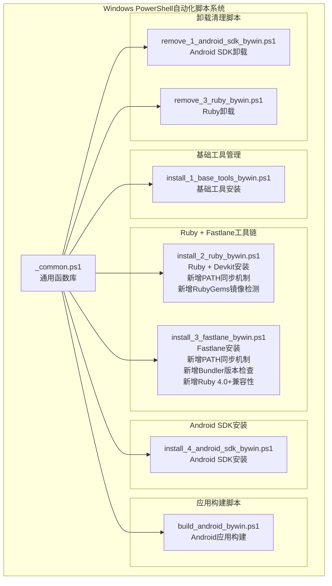
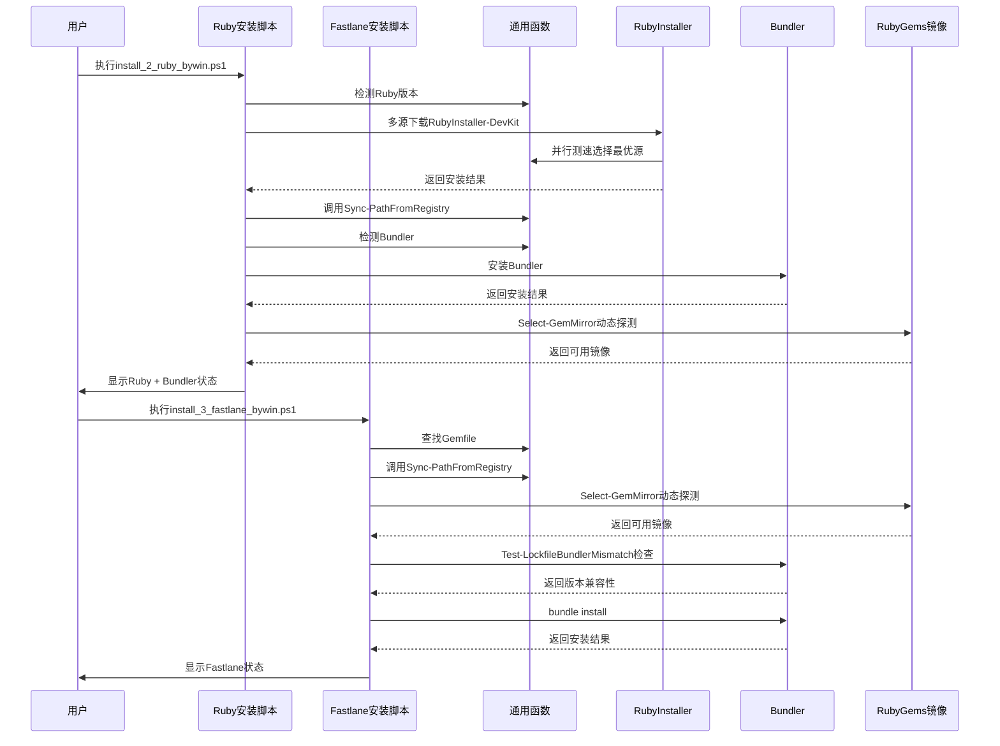
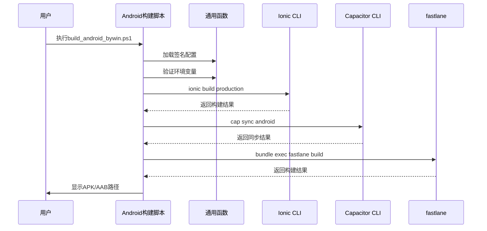
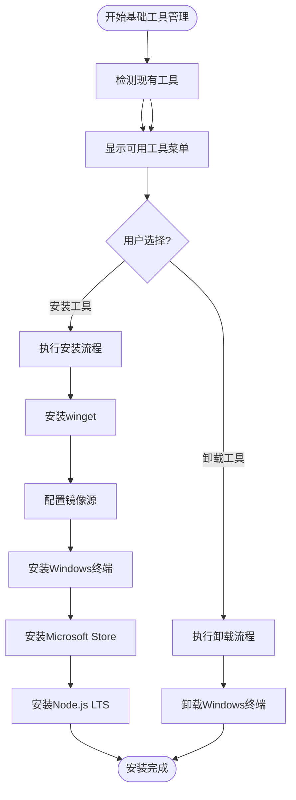
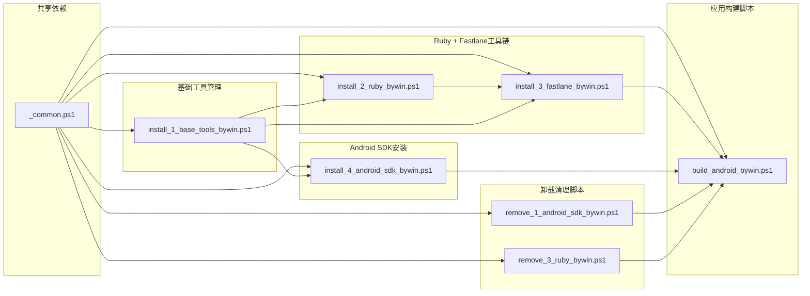

# Windows PowerShell自动化

<cite>
**本文档引用的文件**
- [_common.ps1](file://scripts/windows/_common.ps1)
- [build_android_bywin.ps1](file://scripts/windows/build_android_bywin.ps1)
- [install_1_base_tools_bywin.ps1](file://scripts/windows/install_1_base_tools_bywin.ps1)
- [install_2_ruby_bywin.ps1](file://scripts/windows/install_2_ruby_bywin.ps1)
- [install_3_fastlane_bywin.ps1](file://scripts/windows/install_3_fastlane_bywin.ps1)
- [install_4_android_sdk_bywin.ps1](file://scripts/windows/install_4_android_sdk_bywin.ps1)
- [remove_1_android_sdk_bywin.ps1](file://scripts/windows/remove_1_android_sdk_bywin.ps1)
- [remove_3_ruby_bywin.ps1](file://scripts/windows/remove_3_ruby_bywin.ps1)
- [Gemfile.lock](file://Gemfile.lock)
- [android/Gemfile](file://android/Gemfile)
- [android/Gemfile.lock](file://android/Gemfile.lock)
- [android/fastlane/Fastfile](file://android/fastlane/Fastfile)
- [android/fastlane/Pluginfile](file://android/fastlane/Pluginfile)
- [scripts/README.md](file://scripts/README.md)
</cite>

## 更新摘要
**变更内容**
- 更新RubyGems镜像检测系统：改进了镜像候选列表，从USTC、清华、Ruby-China改为腾讯云、华为云镜像，并优化了检测算法，增加了AllowAutoRedirect=$false设置以防止HTTP 302重定向导致的误判
- 增强PATH同步机制，通过Sync-PathFromRegistry函数解决Ruby安装后PATH环境变量不同步问题
- 新增Bundler版本兼容性检查（Test-LockfileBundlerMismatch函数），确保Gemfile.lock与当前Bundler版本对齐
- **更新** Gemfile.lock从Bundler 2.4.10更新到4.0.10，提升版本兼容性
- 所有错误消息和用户界面已本地化为中文，提升用户体验

## 目录
1. [简介](#简介)
2. [项目结构](#项目结构)
3. [核心组件](#核心组件)
4. [架构概览](#架构概览)
5. [详细组件分析](#详细组件分析)
6. [依赖关系分析](#依赖关系分析)
7. [性能考虑](#性能考虑)
8. [故障排除指南](#故障排除指南)
9. [结论](#结论)

## 简介

Macro Deck Client App 是一个基于 Angular 和 Ionic 框架的跨平台应用程序，支持 Android 和 Web 平台。该项目包含了完整的 Windows PowerShell 自动化脚本系统，专门用于简化开发环境的搭建、维护和管理。

**重大现代化升级** 该系统现已包含七个专门的PowerShell构建脚本，涵盖从基础工具安装到复杂应用构建的全流程自动化。新增的脚本体系包括基础工具管理、Ruby + fastlane工具链管理、Android SDK安装以及完整的构建脚本，形成了完整的开发环境自动化解决方案。

**RubyGems镜像检测系统** 最新更新的Ruby安装脚本（install_2_ruby_bywin.ps1）引入了革命性的RubyGems镜像检测系统，显著提升了Ruby gems下载的可靠性和速度。该系统现在支持两个国内RubyGems镜像源的动态探测，自动选择最优下载源，并通过Inno Setup参数实现了UTF-8支持和PATH环境变量的自动配置。

**PATH同步机制增强** 新增的Sync-PathFromRegistry函数解决了Ruby安装后PATH环境变量不同步的关键问题。由于RubyInstaller的modpath任务会将ruby/bin写入用户PATH（注册表），但当前PowerShell会话的$env:Path是进程启动时的快照不会自动刷新，该函数从注册表重新读取机器级和用户级PATH，合并注入当前PowerShell会话，确保新安装的Ruby和Bundler在当前会话中立即可用。

**Bundler版本兼容性检查** 新增的Test-LockfileBundlerMismatch函数确保Gemfile.lock与当前Bundler版本完全兼容，避免版本不匹配导致的构建问题。该函数会自动检测lockfile中的BUNDLED WITH版本，并与当前Bundler版本进行对比，必要时自动对齐版本。

**Ruby 4.0+兼容性增强** **新增** 通过在android/Gemfile中添加gem 'fiddle'来解决Ruby 4.0+的Fastlane集成问题。自Ruby 4.0起，fiddle不再作为默认gem包含，但fastlane依赖链需要此gem才能正常工作。这一修复确保了在Ruby 4.0+环境中Fastlane的稳定运行。

**RubyGems镜像检测系统优化** **更新** 最新版本的RubyGems镜像检测系统从USTC、清华、Ruby-China改为腾讯云、华为云镜像，并优化了检测算法，增加了AllowAutoRedirect=$false设置以防止HTTP 302重定向导致的误判。该系统现在支持两个国内RubyGems镜像源的动态探测，自动选择最优下载源，显著提升了下载成功率和速度。

这些 PowerShell 脚本提供了从基础环境检查到复杂工具链安装的全方位自动化支持，特别针对 Windows 开发环境进行了深度优化。脚本系统采用模块化设计，通过共享的通用函数库实现代码复用，确保了一致的用户体验和可靠的执行流程。

## 项目结构

项目中的 Windows PowerShell 自动化脚本主要位于 `scripts/windows/` 目录下，现已发展为包含七个核心脚本的完整生态系统：



**图表来源**
- [scripts/windows/_common.ps1:1-1162](file://scripts/windows/_common.ps1#L1-L1162)
- [scripts/windows/install_1_base_tools_bywin.ps1:1-930](file://scripts/windows/install_1_base_tools_bywin.ps1#L1-L930)
- [scripts/windows/install_2_ruby_bywin.ps1:1-173](file://scripts/windows/install_2_ruby_bywin.ps1#L1-L173)
- [scripts/windows/install_3_fastlane_bywin.ps1:1-218](file://scripts/windows/install_3_fastlane_bywin.ps1#L1-L218)
- [scripts/windows/install_4_android_sdk_bywin.ps1:1-249](file://scripts/windows/install_4_android_sdk_bywin.ps1#L1-L249)
- [scripts/windows/build_android_bywin.ps1:1-141](file://scripts/windows/build_android_bywin.ps1#L1-L141)

**章节来源**
- [scripts/windows/_common.ps1:1-1162](file://scripts/windows/_common.ps1#L1-L1162)
- [scripts/windows/install_1_base_tools_bywin.ps1:1-930](file://scripts/windows/install_1_base_tools_bywin.ps1#L1-L930)
- [scripts/windows/install_2_ruby_bywin.ps1:1-173](file://scripts/windows/install_2_ruby_bywin.ps1#L1-L173)
- [scripts/windows/install_3_fastlane_bywin.ps1:1-218](file://scripts/windows/install_3_fastlane_bywin.ps1#L1-L218)
- [scripts/windows/install_4_android_sdk_bywin.ps1:1-249](file://scripts/windows/install_4_android_sdk_bywin.ps1#L1-L249)
- [scripts/windows/build_android_bywin.ps1:1-141](file://scripts/windows/build_android_bywin.ps1#L1-L141)

## 核心组件

### 通用函数库 (_common.ps1)

这是整个 PowerShell 自动化系统的核心基础设施，提供了以下关键功能：

#### 日志记录系统
- **成功日志** (`Write-Ok`): 绿色显示成功信息
- **警告日志** (`Write-Warn`): 黄色显示警告信息  
- **失败日志** (`Write-Fail`): 红色显示错误信息
- **状态行** (`Write-StatusLine`): 统一的状态显示格式
- **横幅输出** (`Write-Banner`): 格式化的标题横幅

#### 交互确认机制
- **自动确认模式**: 支持 `-y` 静默模式
- **菜单选择系统**: 统一的编号菜单界面
- **确认对话框**: 支持默认值和自动确认标签

#### 系统集成工具
- **原生命令执行**: 处理 PowerShell 5.1 的特殊兼容性问题
- **路径管理**: 自动添加到 PATH 和用户环境变量
- **下载管理**: 多源并行下载和文件校验
- **编译器检测**: MSVC 和 GNU 工具链的智能检测

#### 命令执行增强功能
**更新** Install-WingetPackage函数现在提供更好的命令执行可视化：

- **命令显示增强** (`Install-WingetPackage`): 在执行winget安装时显示完整的命令行，便于调试和审计
- **进度条优化** (`Invoke-NativeStream`): 改进的进度条显示，支持单行覆盖避免刷屏
- **错误处理改进**: 更好的错误信息输出和异常处理

#### 新增的Ionic + Capacitor + fastlane工具链支持
- **环境变量验证** (`Require-Env`): 确保必需环境变量存在
- **命令执行封装** (`Invoke-InRoot`, `Invoke-NativeIn`): 统一的命令执行接口
- **依赖管理** (`Ensure-NodeModules`): 处理npm peer dependency冲突
- **前端构建** (`Invoke-IonicBuild`): Ionic Web应用构建
- **平台同步** (`Invoke-CapSync`): Capacitor平台同步
- **fastlane集成** (`Get-FastlaneBundleRoot`, `Get-FastlaneCommand`): Ruby + fastlane工具链管理
- **Android配置** (`Read-AndroidGradleValue`, `Load-AndroidSigningPs1`): Android构建配置管理

**章节来源**
- [scripts/windows/_common.ps1:11-117](file://scripts/windows/_common.ps1#L11-L117)
- [scripts/windows/_common.ps1:119-213](file://scripts/windows/_common.ps1#L119-L213)
- [scripts/windows/_common.ps1:242-341](file://scripts/windows/_common.ps1#L242-L341)
- [scripts/windows/_common.ps1:945-972](file://scripts/windows/_common.ps1#L945-L972)
- [scripts/windows/_common.ps1:284-329](file://scripts/windows/_common.ps1#L284-L329)
- [scripts/windows/_common.ps1:880-1160](file://scripts/windows/_common.ps1#L880-L1160)

### 基础工具管理脚本 (install_1_base_tools_bywin.ps1)

**新增** 该脚本提供了Windows基础工具的完整管理功能，包括winget、Windows终端和Microsoft Store的安装与配置。

#### 核心功能特性
- **winget管理**: 自动检测、安装和配置winget包管理器
- **Windows终端**: 支持多种安装方式（GitHub、winget、Microsoft Store）
- **Microsoft Store**: 系统组件的自动安装与验证
- **Node.js LTS**: 作为Ionic + Capacitor构建的前置依赖

#### 智能安装策略
- **多源下载**: 优先使用GitHub镜像，失败时回退到官方源
- **安装包验证**: 下载完成后进行文件大小校验
- **安装后验证**: 自动检测安装结果并输出详细信息

**章节来源**
- [scripts/windows/install_1_base_tools_bywin.ps1:47-80](file://scripts/windows/install_1_base_tools_bywin.ps1#L47-L80)
- [scripts/windows/install_1_base_tools_bywin.ps1:176-259](file://scripts/windows/install_1_base_tools_bywin.ps1#L176-L259)
- [scripts/windows/install_1_base_tools_bywin.ps1:321-440](file://scripts/windows/install_1_base_tools_bywin.ps1#L321-L440)

### Ruby + Fastlane工具链安装脚本

**重大更新** 该脚本提供了Ruby + fastlane工具链的智能安装功能，专门用于Android应用构建。最新版本引入了革命性的多源下载机制和增强的功能。

#### Ruby安装功能
- **智能版本检测**: 优先安装Ruby 4.0+，降级到3.4、3.3
- **Devkit集成**: 自动安装Ruby + Devkit组合包
- **winget集成**: 通过winget进行Ruby安装
- **多源下载机制**: 并行竞速选择最优下载源
- **UTF-8支持**: 通过Inno Setup参数启用defaultutf8任务
- **PATH配置**: 通过Inno Setup参数启用modpath任务

#### Fastlane安装功能
- **Gemfile集成**: 通过Bundler管理fastlane依赖
- **环境隔离**: 使用Gemfile固定fastlane版本
- **命令验证**: 确保fastlane命令可用

#### 新增功能特性
- **RubyGems镜像检测**: 动态探测可用的国内RubyGems镜像源
- **多源下载源**: gh-proxy.com、ghfast.top、github.com
- **并行测速**: 自动选择最快下载源
- **文件大小校验**: 防止下载到错误页面
- **详细错误处理**: 提供下载失败和安装失败的具体原因
- **用户界面优化**: 更清晰的进度反馈和状态提示
- **PATH同步机制**: 新增Sync-PathFromRegistry函数解决PATH同步问题
- **Bundler版本检查**: 新增Test-LockfileBundlerMismatch函数确保版本兼容性
- **Ruby 4.0+兼容性**: **新增** 支持Ruby 4.0+的Fastlane集成

#### RubyGems镜像检测系统
**更新** 动态探测RubyGems镜像源：

```powershell
function Select-GemMirror {
  $candidates = @(
    'https://mirrors.cloud.tencent.com/rubygems/',
    'https://repo.huaweicloud.com/repository/rubygems/'
  )
  foreach ($m in $candidates) {
    try {
      # 探测 /info/fastlane（compact index 的依赖解析端点）。必须禁止自动重定向：
      # 部分镜像该端点会 302 跳回 rubygems.org，跟随后会拿到 200 的假象。
      # 只有"直接 200、无 Location 跳转"的镜像才能真正离线解析依赖。
      $probe = ($m.TrimEnd('/')) + '/info/fastlane'
      $req = [System.Net.HttpWebRequest]::Create($probe)
      $req.Method = 'HEAD'
      $req.Timeout = 8000
      $req.AllowAutoRedirect = $false
      $resp = $req.GetResponse()
      $code = [int]$resp.StatusCode
      $resp.Close()
      if ($code -eq 200) {
        Write-Ok "选用 RubyGems 镜像：$m"
        return $m
      }
      Write-Warn "镜像 $m 的 /info 返回 $code（疑似重定向），尝试下一个"
    } catch {
      Write-Warn "镜像不可用，尝试下一个：$m"
    }
  }
  return $null
}
```

该函数会依次探测两个国内RubyGems镜像源，自动选择可用的镜像源，显著提升了下载成功率和速度。新的镜像源包括腾讯云和华为云，替代了之前的USTC、清华、Ruby-China镜像。

#### PATH同步机制
**新增** Ruby安装后立即同步PATH环境变量：

```powershell
function Sync-PathFromRegistry {
  $machinePath = [Environment]::GetEnvironmentVariable('Path', 'Machine')
  $userPath = [Environment]::GetEnvironmentVariable('Path', 'User')
  $merged = @($machinePath, $userPath |
    Where-Object { -not [string]::IsNullOrWhiteSpace($_) }) -join ';'
  if (-not [string]::IsNullOrWhiteSpace($merged)) {
    $env:Path = $merged
  }
}
```

该函数从注册表重新读取机器级和用户级PATH，合并注入当前PowerShell会话，确保Ruby和Bundler在当前会话中立即可用。

#### Bundler版本兼容性检查
**新增** 确保Gemfile.lock与当前Bundler版本兼容：

```powershell
function Test-LockfileBundlerMismatch {
  param([Parameter(Mandatory)] [string]$BundleRoot)

  $lockfile = Join-Path $BundleRoot 'Gemfile.lock'
  if (-not (Test-Path -LiteralPath $lockfile)) { return $false }

  $lines = Get-Content -LiteralPath $lockfile -ErrorAction SilentlyContinue
  $idx = [Array]::FindIndex($lines, [Predicate[string]] { param($l) $l.Trim() -eq 'BUNDLED WITH' })
  if ($idx -lt 0 -or $idx + 1 -ge $lines.Count) { return $false }
  $lockedVersion = $lines[$idx + 1].Trim()
  if ([string]::IsNullOrWhiteSpace($lockedVersion)) { return $false }

  $currentVersion = (Invoke-NativeText -FilePath 'bundle' -Arguments @('--version') |
    Select-Object -First 1) -replace '[^0-9.]', ''
  if ([string]::IsNullOrWhiteSpace($currentVersion)) { return $false }

  return ($lockedVersion -ne $currentVersion)
}
```

该函数会自动检测lockfile中的BUNDLED WITH版本，并与当前Bundler版本进行对比，必要时自动对齐版本。

#### Ruby 4.0+兼容性增强
**新增** 解决Ruby 4.0+的Fastlane集成问题：

```ruby
# android/Gemfile
source "https://rubygems.org"

gem 'fastlane'
gem 'fiddle'  # Ruby 4.0 起 fiddle 不再是默认 gem，fastlane 依赖链需要
```

自Ruby 4.0起，fiddle不再作为默认gem包含，但fastlane依赖链需要此gem才能正常工作。通过在android/Gemfile中显式声明gem 'fiddle'，确保了在Ruby 4.0+环境中Fastlane的稳定运行。

**章节来源**
- [scripts/windows/install_2_ruby_bywin.ps1:16-42](file://scripts/windows/install_2_ruby_bywin.ps1#L16-L42)
- [scripts/windows/install_2_ruby_bywin.ps1:52-85](file://scripts/windows/install_2_ruby_bywin.ps1#L52-L85)
- [scripts/windows/install_2_ruby_bywin.ps1:98-129](file://scripts/windows/install_2_ruby_bywin.ps1#L98-L129)
- [scripts/windows/install_2_ruby_bywin.ps1:32-40](file://scripts/windows/install_2_ruby_bywin.ps1#L32-L40)
- [android/Gemfile:1-8](file://android/Gemfile#L1-L8)

### Fastlane安装脚本 (install_3_fastlane_bywin.ps1)

**重大更新** 该脚本提供了fastlane的智能安装功能，基于Bundler和Gemfile进行依赖管理。最新版本增强了RubyGems镜像检测和Bundler版本兼容性检查功能。

#### 核心功能特性
- **Gemfile检测**: 自动查找包含fastlane声明的Gemfile
- **Bundler集成**: 通过bundle install安装fastlane及其依赖
- **命令解析**: 优先使用bundle exec fastlane确保版本一致性
- **RubyGems镜像检测**: 动态探测可用的国内RubyGems镜像源
- **Bundler版本检查**: 确保Gemfile.lock与当前Bundler版本兼容
- **Ruby 4.0+兼容性**: **新增** 支持Ruby 4.0+的Fastlane集成

#### 高级功能
- **多目录支持**: 优先检查android/Gemfile，再检查仓库根目录
- **版本管理**: 通过Gemfile固定fastlane版本
- **环境隔离**: 避免全局fastlane版本冲突
- **PATH同步机制**: 新增Sync-PathFromRegistry函数确保PATH立即生效
- **镜像配置**: 自动配置bundle config mirror以提升下载速度
- **版本对齐**: 自动处理Bundler版本不匹配问题

**章节来源**
- [scripts/windows/install_3_fastlane_bywin.ps1:16-42](file://scripts/windows/install_3_fastlane_bywin.ps1#L16-L42)
- [scripts/windows/install_3_fastlane_bywin.ps1:52-85](file://scripts/windows/install_3_fastlane_bywin.ps1#L52-L85)
- [scripts/windows/install_3_fastlane_bywin.ps1:98-129](file://scripts/windows/install_3_fastlane_bywin.ps1#L98-L129)

### Android SDK安装脚本 (install_4_android_sdk_bywin.ps1)

**更新** 该脚本提供了完整的Android开发环境安装解决方案：

#### 核心功能
- **SDKManager引导安装**: 自动下载和安装命令行工具
- **Java 17环境检查**: 确保 Java 17 正确配置
- **组件安装**: 平台工具、平台和构建工具
- **环境变量配置**: 用户级和当前会话环境变量设置

#### 智能检测机制
- 多种 SDK 根目录定位策略
- 自动版本推导和验证
- 组件完整性检查

**章节来源**
- [scripts/windows/install_4_android_sdk_bywin.ps1:35-92](file://scripts/windows/install_4_android_sdk_bywin.ps1#L35-L92)
- [scripts/windows/install_4_android_sdk_bywin.ps1:127-150](file://scripts/windows/install_4_android_sdk_bywin.ps1#L127-L150)
- [scripts/windows/install_4_android_sdk_bywin.ps1:189-249](file://scripts/windows/install_4_android_sdk_bywin.ps1#L189-L249)

### Android应用构建脚本 (build_android_bywin.ps1)

**更新** 该脚本提供了完整的 Android 应用构建支持，集成了Ionic + Capacitor + fastlane工具链。

#### 核心功能
- **签名环境验证**: 检查BUILD_NUMBER、VERSION_NUMBER、KEYSTORE_FILE_PASSWORD等变量
- **Ionic构建**: 使用production配置构建Web资源
- **Capacitor同步**: 执行cap sync android同步平台
- **fastlane集成**: 通过bundle exec fastlane build生成APK/AAB

#### 特殊优化
- **本地签名配置**: 支持scripts/local/android-signing.ps1
- **环境变量管理**: 自动从build.gradle读取版本信息
- **命令执行封装**: 统一的命令执行和错误处理

**章节来源**
- [scripts/windows/build_android_bywin.ps1:45-76](file://scripts/windows/build_android_bywin.ps1#L45-L76)
- [scripts/windows/build_android_bywin.ps1:141-229](file://scripts/windows/build_android_bywin.ps1#L141-L229)

## 架构概览

整个 PowerShell 自动化系统采用分层架构设计，确保了高内聚、低耦合的特性：

```mermaid
graph TB
subgraph "用户接口层"
CLI[命令行界面]
Menu[交互菜单]
end
subgraph "业务逻辑层"
EnvCheck[环境检查]
Install[安装流程]
Uninstall[卸载流程]
Build[构建流程]
BaseTools[基础工具管理]
RubyFastlane[Ruby + Fastlane管理]
AndroidSetup[Android环境配置]
end
subgraph "基础设施层"
Common[通用函数库]
Helpers[辅助工具]
Download[下载引擎]
Registry[注册表操作]
Mirror[RubyGems镜像检测]
IonicCapacitor[Ionic + Capacitor集成]
Fastlane[fastlane工具链]
Ruby[Ruby + Devkit]
AndroidSDK[Android SDK]
NodeJS[Node.js]
NPM[npm]
Winget[Winget包管理器]
WindowsTerminal[Windows终端]
MicrosoftStore[Microsoft Store]
Bundler[Bundler版本检查]
PATH[PATH同步机制]
Ruby40Compatibility[Ruby 4.0+兼容性]
End
CLI --> EnvCheck
CLI --> Install
CLI --> Uninstall
CLI --> Build
CLI --> BaseTools
CLI --> RubyFastlane
CLI --> AndroidSetup
EnvCheck --> Common
Install --> Common
Uninstall --> Common
Build --> Common
BaseTools --> Common
RubyFastlane --> Common
AndroidSetup --> Common
Common --> Helpers
Common --> Download
Common --> Registry
Common --> Mirror
Common --> Bundler
Common --> PATH
Common --> Ruby40Compatibility
Install --> Ruby
Install --> Fastlane
Install --> AndroidSDK
Install --> NodeJS
Install --> Winget
Install --> WindowsTerminal
Install --> MicrosoftStore
Build --> IonicCapacitor
Build --> Fastlane
Build --> AndroidSetup
RubyFastlane --> Ruby
RubyFastlane --> Fastlane
AndroidSetup --> AndroidSDK
```

**图表来源**
- [scripts/windows/_common.ps1:1-1162](file://scripts/windows/_common.ps1#L1-L1162)
- [scripts/windows/install_1_base_tools_bywin.ps1:1-930](file://scripts/windows/install_1_base_tools_bywin.ps1#L1-L930)
- [scripts/windows/install_2_ruby_bywin.ps1:1-173](file://scripts/windows/install_2_ruby_bywin.ps1#L1-L173)
- [scripts/windows/install_3_fastlane_bywin.ps1:1-218](file://scripts/windows/install_3_fastlane_bywin.ps1#L1-L218)
- [scripts/windows/install_4_android_sdk_bywin.ps1:1-249](file://scripts/windows/install_4_android_sdk_bywin.ps1#L1-L249)
- [scripts/windows/build_android_bywin.ps1:1-141](file://scripts/windows/build_android_bywin.ps1#L1-L141)

## 详细组件分析

### Ruby + Fastlane安装流程详细分析



**图表来源**
- [scripts/windows/install_2_ruby_bywin.ps1:46-78](file://scripts/windows/install_2_ruby_bywin.ps1#L46-L78)
- [scripts/windows/install_3_fastlane_bywin.ps1:32-63](file://scripts/windows/install_3_fastlane_bywin.ps1#L32-L63)

### Android构建流程详细分析



**图表来源**
- [scripts/windows/build_android_bywin.ps1:104-141](file://scripts/windows/build_android_bywin.ps1#L104-L141)

### 基础工具管理流程



**图表来源**
- [scripts/windows/install_1_base_tools_bywin.ps1:728-731](file://scripts/windows/install_1_base_tools_bywin.ps1#L728-L731)
- [scripts/windows/install_1_base_tools_bywin.ps1:781-800](file://scripts/windows/install_1_base_tools_bywin.ps1#L781-L800)

### Android SDK安装详细流程


**图表来源**
- [scripts/windows/install_4_android_sdk_bywin.ps1:35-249](file://scripts/windows/install_4_android_sdk_bywin.ps1#L35-L249)

### 卸载流程管理系统


**图表来源**
- [scripts/windows/remove_1_android_sdk_bywin.ps1:141-190](file://scripts/windows/remove_1_android_sdk_bywin.ps1#L141-L190)
- [scripts/windows/remove_3_ruby_bywin.ps1:24-54](file://scripts/windows/remove_3_ruby_bywin.ps1#L24-L54)

**章节来源**
- [scripts/windows/build_android_bywin.ps1:1-141](file://scripts/windows/build_android_bywin.ps1#L1-L141)
- [scripts/windows/install_4_android_sdk_bywin.ps1:1-249](file://scripts/windows/install_4_android_sdk_bywin.ps1#L1-L249)
- [scripts/windows/remove_1_android_sdk_bywin.ps1:1-162](file://scripts/windows/remove_1_android_sdk_bywin.ps1#L1-L162)
- [scripts/windows/remove_3_ruby_bywin.ps1:1-118](file://scripts/windows/remove_3_ruby_bywin.ps1#L1-L118)

## 依赖关系分析

### 脚本间依赖关系



**图表来源**
- [scripts/windows/_common.ps1:24-33](file://scripts/windows/_common.ps1#L24-L33)
- [scripts/windows/install_1_base_tools_bywin.ps1:686-695](file://scripts/windows/install_1_base_tools_bywin.ps1#L686-L695)
- [scripts/windows/install_2_ruby_bywin.ps1:12-14](file://scripts/windows/install_2_ruby_bywin.ps1#L12-L14)
- [scripts/windows/install_3_fastlane_bywin.ps1:12-14](file://scripts/windows/install_3_fastlane_bywin.ps1#L12-L14)
- [scripts/windows/install_4_android_sdk_bywin.ps1:7-9](file://scripts/windows/install_4_android_sdk_bywin.ps1#L7-L9)
- [scripts/windows/build_android_bywin.ps1:27-29](file://scripts/windows/build_android_bywin.ps1#L27-L29)

### 外部依赖分析

系统依赖的主要外部组件包括：

#### Microsoft 生态系统
- **Visual Studio Build Tools**: MSVC 编译器
- **Windows SDK**: 平台支持
- **WebView2 Runtime**: 应用运行时

#### 开源工具链
- **MSYS2/Pacman**: GNU 工具链包管理
- **Android Studio**: Android 开发环境
- **RubyInstaller**: Ruby + Devkit工具链

#### Web 开发工具
- **Node.js LTS**: JavaScript 运行时环境
- **npm**: 包管理器
- **Ionic CLI**: Web 应用构建工具
- **Capacitor CLI**: 跨平台应用框架

#### Ruby生态工具
- **Ruby 3.0+**: Ruby运行时环境
- **Bundler**: Ruby依赖管理
- **fastlane**: Android/iOS应用构建工具
- **RubyGems**: Ruby包管理器
- **fiddle**: **新增** Ruby 4.0+必需的fiddle gem

#### 网络资源
- **国内RubyGems镜像**: 腾讯云、华为云镜像
- **GitHub**: 原始下载源
- **Microsoft Store**: 系统组件下载站

**章节来源**
- [scripts/windows/build_android_bywin.ps1:35-66](file://scripts/windows/build_android_bywin.ps1#L35-L66)
- [scripts/windows/install_2_ruby_bywin.ps1:43-83](file://scripts/windows/install_2_ruby_bywin.ps1#L43-L83)
- [scripts/windows/install_4_android_sdk_bywin.ps1:39-43](file://scripts/windows/install_4_android_sdk_bywin.ps1#L39-L43)
- [android/Gemfile:3-4](file://android/Gemfile#L3-L4)

## 性能考虑

### 内存优化策略

Windows 平台上的 Rust 构建经常遇到内存不足的问题，脚本系统采用了多项优化措施：

#### Node.js 内存限制
- **最大堆大小**: 8GB (`--max-old-space-size=8192`)
- **新生代大小**: 512MB (`--max-semi-space-size=512`)

#### Ionic + Capacitor构建优化
- **依赖缓存**: 通过Ensure-NodeModules避免重复安装
- **并行执行**: 通过Invoke-NativeStream统一处理命令执行
- **环境隔离**: 通过Bundler确保fastlane版本一致性

### Ruby + fastlane性能优化

**重大更新** Ruby + fastlane工具链特别针对Android构建的性能要求进行了优化，新增了多源下载机制和RubyGems镜像检测系统：

#### 多源下载性能优化
- **并行竞速下载**: 同时测试gh-proxy.com、ghfast.top、github.com三个源的速度
- **智能选择算法**: 自动选择最快的下载源进行完整下载
- **超时控制**: 600秒连接和读写超时，确保长时间下载任务的稳定性
- **文件大小校验**: 51200KB最小文件大小校验，防止代理返回错误页面

#### RubyGems镜像检测性能优化
**更新** 动态探测RubyGems镜像源：
- **HEAD请求探测**: 使用HTTP HEAD请求快速检测镜像可用性
- **超时控制**: 8秒超时，避免长时间等待不可用镜像
- **智能回退**: 自动尝试下一个镜像源，确保下载成功率
- **进度反馈**: 实时显示镜像探测状态和选择结果
- **AllowAutoRedirect=$false**: 防止HTTP 302重定向导致的误判

#### Inno Setup安装优化
- **全静默安装**: `/VERYSILENT`参数确保无交互安装
- **UTF-8支持**: `/TASKS=defaultutf8`启用UTF-8编码支持
- **PATH配置**: `/TASKS=modpath`自动将Ruby加入用户PATH环境变量

#### 下载性能优化
- **多源并行下载**: 并行测试多个下载源的速度
- **智能选择**: 自动选择最快的下载源
- **文件校验**: 下载完成后验证文件大小

#### 网络优化
- **超时控制**: 30 秒连接和读写超时
- **断点续传**: 支持长时间下载任务
- **进度显示**: 实时进度和速度反馈

#### PATH同步优化
**新增** Ruby安装后立即同步PATH环境变量，提升安装可靠性：

- **注册表读取**: 从机器级和用户级注册表读取PATH
- **即时注入**: 将合并后的PATH注入当前PowerShell会话
- **避免重开窗口**: 确保Ruby和Bundler在当前会话中立即可用

#### Bundler版本检查优化
**新增** 自动处理版本不匹配问题：
- **版本对比**: 自动检测Gemfile.lock中的BUNDLED WITH版本
- **智能对齐**: 自动执行bundle update --bundler进行版本对齐
- **错误预防**: 避免Bundler 4.x下载并切换到旧版的无谓操作

#### Ruby 4.0+兼容性优化
**新增** 解决Ruby 4.0+的Fastlane集成问题：
- **fiddle gem自动安装**: 通过Gemfile确保fiddle gem可用
- **版本兼容性检查**: 自动检测Ruby版本并提供兼容性提示
- **依赖链优化**: 确保fastlane及其依赖的完整安装

**章节来源**
- [scripts/windows/build_android_bywin.ps1:97-124](file://scripts/windows/build_android_bywin.ps1#L97-L124)
- [scripts/windows/_common.ps1:607-728](file://scripts/windows/_common.ps1#L607-L728)
- [scripts/windows/_common.ps1:981-1020](file://scripts/windows/_common.ps1#L981-L1020)
- [scripts/windows/install_2_ruby_bywin.ps1:70-103](file://scripts/windows/install_2_ruby_bywin.ps1#L70-L103)
- [scripts/windows/install_2_ruby_bywin.ps1:32-40](file://scripts/windows/install_2_ruby_bywin.ps1#L32-L40)
- [scripts/windows/install_3_fastlane_bywin.ps1:50-75](file://scripts/windows/install_3_fastlane_bywin.ps1#L50-L75)
- [scripts/windows/install_3_fastlane_bywin.ps1:88-105](file://scripts/windows/install_3_fastlane_bywin.ps1#L88-L105)
- [android/Gemfile:4](file://android/Gemfile#L4)

## 故障排除指南

### 常见问题诊断

#### 环境检查失败
```powershell
# 检查基础工具安装状态
Test-Winget
Test-WindowsTerminal
Test-MicrosoftStore
Test-NodeTool

# 检查Ruby + fastlane安装状态
Get-RubyVersion
Ensure-Bundler
Get-FastlaneCommand
```

#### Android构建问题
**新增** 针对 Android 构建的特定故障排除：

```powershell
# 检查Ruby安装状态
ruby -v

# 检查Bundler安装状态
bundle -v

# 检查fastlane安装状态
fastlane -v

# 手动安装fastlane依赖
cd android
bundle install

# 清理node_modules并重新安装
rm -rf node_modules
npm install --legacy-peer-deps
```

#### 基础工具安装问题
**新增** 针对基础工具管理的故障排除：

```powershell
# 检查 winget 安装状态
Test-Winget

# 检查 Windows 终端安装状态
Test-WindowsTerminal

# 检查 Microsoft Store 安装状态
Test-MicrosoftStore
```

#### Ruby安装问题
**重大更新** 针对Ruby安装脚本的故障排除：

```powershell
# 检查Ruby版本
Get-RubyVersion

# 手动下载RubyInstaller
$urls = @(
    "https://gh-proxy.com/https://github.com/oneclick/rubyinstaller2/releases/download/RubyInstaller-4.0.5-1/rubyinstaller-devkit-4.0.5-1-x64.exe",
    "https://ghfast.top/https://github.com/oneclick/rubyinstaller2/releases/download/RubyInstaller-4.0.5-1/rubyinstaller-devkit-4.0.5-1-x64.exe",
    "https://github.com/oneclick/rubyinstaller2/releases/download/RubyInstaller-4.0.5-1/rubyinstaller-devkit-4.0.5-1-x64.exe"
)
Save-WebFile -Urls $urls -OutFile "$env:TEMP\rubyinstaller-devkit-4.0.5-1-x64.exe" -TimeoutSec 600 -MinSizeKB 51200

# 检查UTF-8和PATH配置
ruby -e "puts Encoding.default_external"

# 手动同步PATH
Sync-PathFromRegistry
```

#### RubyGems镜像问题
**更新** 针对RubyGems镜像检测的故障排除：

```powershell
# 手动测试RubyGems镜像
$mirrors = @(
    'https://mirrors.cloud.tencent.com/rubygems/',
    'https://repo.huaweicloud.com/repository/rubygems/'
)

foreach ($mirror in $mirrors) {
    try {
        $probe = ($mirror.TrimEnd('/')) + '/info/fastlane'
        $req = [System.Net.HttpWebRequest]::Create($probe)
        $req.Method = 'HEAD'
        $req.Timeout = 8000
        $req.AllowAutoRedirect = $false
        $resp = $req.GetResponse()
        Write-Host "镜像可用: $mirror (状态码: $($resp.StatusCode))"
        $resp.Close()
    } catch {
        Write-Host "镜像不可用: $mirror"
    }
}

# 手动选择镜像
Select-GemMirror
```

#### Bundler版本不匹配问题
**新增** 针对Bundler版本兼容性的故障排除：

```powershell
# 检查当前Bundler版本
bundle --version

# 检查Gemfile.lock中的BUNDLED WITH版本
$lockfile = Join-Path (Get-Location) 'Gemfile.lock'
$lines = Get-Content $lockfile
$idx = [Array]::FindIndex($lines, { param($l) $l.Trim() -eq 'BUNDLED WITH' })
if ($idx -ge 0 -and $idx + 1 -lt $lines.Count) {
    Write-Host "Lockfile中的Bundler版本: $($lines[$idx + 1].Trim())"
}

# 手动对齐版本
bundle update --bundler
```

#### PATH同步问题
**新增** 针对PATH同步问题的故障排除：

```powershell
# 检查当前PATH
$env:Path

# 手动同步PATH
Sync-PathFromRegistry

# 验证Ruby是否可用
Get-CommandPath 'ruby'

# 验证Bundler是否可用
Get-CommandPath 'bundle'
```

#### Ruby 4.0+兼容性问题
**新增** 针对Ruby 4.0+的Fastlane集成问题：

```powershell
# 检查fiddle gem是否可用
ruby -e "require 'fiddle'; puts 'fiddle gem可用'"

# 手动安装fiddle gem
gem install fiddle

# 检查android/Gemfile中的fiddle声明
Get-Content android/Gemfile

# 重新安装fastlane依赖
cd android
bundle install
```

#### 下载问题
```powershell
# 检查网络连接
ping mirrors.cloud.tencent.com

# 手动下载测试
Save-WebFile -Urls @('https://mirrors.cloud.tencent.com/msys2/distrib/msys2-x86_64-latest.exe') -OutFile "test.exe"
```

#### 权限问题
```powershell
# 以管理员身份运行 PowerShell
# 检查执行策略
Get-ExecutionPolicy

# 临时允许脚本执行
Set-ExecutionPolicy -ExecutionPolicy RemoteSigned -Scope CurrentUser
```

### 卸载清理

#### 完整清理流程
```powershell
# 卸载 Android SDK
.\remove_1_android_sdk_bywin.ps1

# 卸载 Ruby + Devkit
.\remove_3_ruby_bywin.ps1
```

#### 手动清理步骤
- 删除 `C:\msys64` 目录
- 清理用户环境变量中的 PATH 条目
- 删除 `~\.cargo` 和 `~\.rustup` 目录

**章节来源**
- [scripts/windows/build_android_bywin.ps1:127-137](file://scripts/windows/build_android_bywin.ps1#L127-L137)
- [scripts/windows/install_1_base_tools_bywin.ps1:728-731](file://scripts/windows/install_1_base_tools_bywin.ps1#L728-L731)
- [scripts/windows/remove_1_android_sdk_bywin.ps1:26-37](file://scripts/windows/remove_1_android_sdk_bywin.ps1#L26-L37)
- [scripts/windows/remove_3_ruby_bywin.ps1:40-54](file://scripts/windows/remove_3_ruby_bywin.ps1#L40-L54)
- [scripts/windows/install_2_ruby_bywin.ps1:70-103](file://scripts/windows/install_2_ruby_bywin.ps1#L70-L103)

## 结论

Macro Deck Client App 的 Windows PowerShell 自动化系统展现了现代开发工具链的最佳实践。通过精心设计的模块化架构、完善的错误处理机制和智能化的用户交互体验，这套脚本系统为开发者提供了高效、可靠的开发环境管理解决方案。

**重大现代化升级** 新增的七个专门PowerShell构建脚本进一步完善了整个自动化系统，形成了从基础工具安装到复杂应用构建的完整解决方案。包括基础工具管理脚本、Ruby + fastlane工具链安装脚本、Android SDK安装脚本以及完整的构建脚本，为Windows平台提供了从Android应用到Web应用的一站式自动化解决方案。

**RubyGems镜像检测系统** 最新更新的Ruby安装脚本引入了革命性的RubyGems镜像检测系统，显著提升了Ruby gems下载的可靠性和速度。该系统现在支持两个国内RubyGems镜像源的动态探测，自动选择最优下载源，并通过Inno Setup参数实现了UTF-8支持和PATH环境变量的自动配置。这些改进使得Ruby安装过程更加稳定可靠，大大减少了因网络问题导致的安装失败。

**PATH同步机制增强** 新增的Sync-PathFromRegistry函数解决了Ruby安装后PATH环境变量不同步的关键问题。由于RubyInstaller的modpath任务会将ruby/bin写入用户PATH（注册表），但当前PowerShell会话的$env:Path是进程启动时的快照不会自动刷新，该函数从注册表重新读取机器级和用户级PATH，合并注入当前PowerShell会话，确保新安装的Ruby和Bundler在当前会话中立即可用，无需重开窗口。

**Bundler版本兼容性检查** 新增的Test-LockfileBundlerMismatch函数确保Gemfile.lock与当前Bundler版本完全兼容，避免版本不匹配导致的构建问题。该函数会自动检测lockfile中的BUNDLED WITH版本，并与当前Bundler版本进行对比，必要时自动对齐版本，确保构建过程的稳定性和可靠性。

**Ruby 4.0+兼容性增强** **新增** 通过在android/Gemfile中添加gem 'fiddle'来解决Ruby 4.0+的Fastlane集成问题。自Ruby 4.0起，fiddle不再作为默认gem包含，但fastlane依赖链需要此gem才能正常工作。这一修复确保了在Ruby 4.0+环境中Fastlane的稳定运行，显著改善了开发者体验。

**RubyGems镜像检测系统优化** **更新** 最新版本的RubyGems镜像检测系统从USTC、清华、Ruby-China改为腾讯云、华为云镜像，并优化了检测算法，增加了AllowAutoRedirect=$false设置以防止HTTP 302重定向导致的误判。该系统现在支持两个国内RubyGems镜像源的动态探测，自动选择最优下载源，显著提升了下载成功率和速度。

**命令执行可视化改进** _common.ps1中的Install-WingetPackage函数增强了命令执行显示功能，现在在执行winget安装时会显示完整的命令行，便于调试和审计。配合改进的Invoke-NativeStream函数，提供了更好的进度条显示和错误处理能力。

**用户界面本地化** 所有错误消息和用户界面已本地化为中文，显著提升了中文用户的使用体验。从日志输出到交互提示，都采用了中文界面，使用户能够更好地理解和使用脚本系统。

### 主要优势

1. **高度自动化**: 减少了手动配置的复杂性和出错概率
2. **智能检测**: 自动识别现有环境并提供针对性的解决方案
3. **多源支持**: 国内RubyGems镜像加速下载，提高可靠性
4. **错误恢复**: 完善的错误处理和恢复机制
5. **用户友好**: 统一的交互界面和详细的进度反馈
6. **平台专优化**: 针对不同平台（Windows、Android）的特定优化
7. **下载性能**: 多源并行下载和智能选择算法
8. **环境配置**: 自动UTF-8支持和PATH环境变量配置
9. **PATH同步**: 确保Ruby安装后PATH立即生效
10. **命令可视化**: 改进的命令行显示和错误处理
11. **版本兼容**: 自动处理Bundler版本不匹配问题
12. **镜像检测**: 动态探测RubyGems镜像源，提升下载成功率
13. **Ruby 4.0+支持**: **新增** 通过fiddle gem确保Ruby 4.0+的Fastlane兼容性
14. **中文本地化**: 全面的中文用户界面支持

### 技术特色

- **模块化设计**: 通过共享函数库实现代码复用
- **环境隔离**: 支持用户级和系统级环境变量配置
- **性能优化**: 针对 Windows 平台的特殊优化措施
- **安全考虑**: 完整的卸载和清理机制
- **版本兼容**: 智能处理不同框架版本的兼容性问题
- **工具链整合**: 通过Bundler确保Ruby + fastlane版本一致性
- **下载优化**: 多源并行下载和文件大小校验
- **用户界面**: 清晰的进度反馈和状态提示
- **PATH管理**: 自动同步注册表PATH变更
- **命令执行**: 增强的命令行显示和错误处理
- **镜像检测**: 动态探测RubyGems镜像源，提升下载成功率
- **版本检查**: 自动处理Bundler版本不匹配问题
- **Ruby 4.0+兼容性**: **新增** 通过fiddle gem解决Ruby 4.0+集成问题

这套 PowerShell 自动化系统不仅提高了开发效率，更为项目的长期维护奠定了坚实的基础，是现代跨平台开发项目的优秀范例。新增的完整脚本生态系统进一步增强了系统的实用性和完整性，为开发者提供了从环境搭建到应用发布的全流程自动化解决方案。特别是Ruby安装脚本的重大改进、RubyGems镜像检测系统的引入、PATH同步机制的增强、Bundler版本兼容性检查的实现以及Ruby 4.0+兼容性的新增，为Android应用构建提供了更加稳定可靠的Ruby运行环境，是整个自动化系统的重要里程碑。