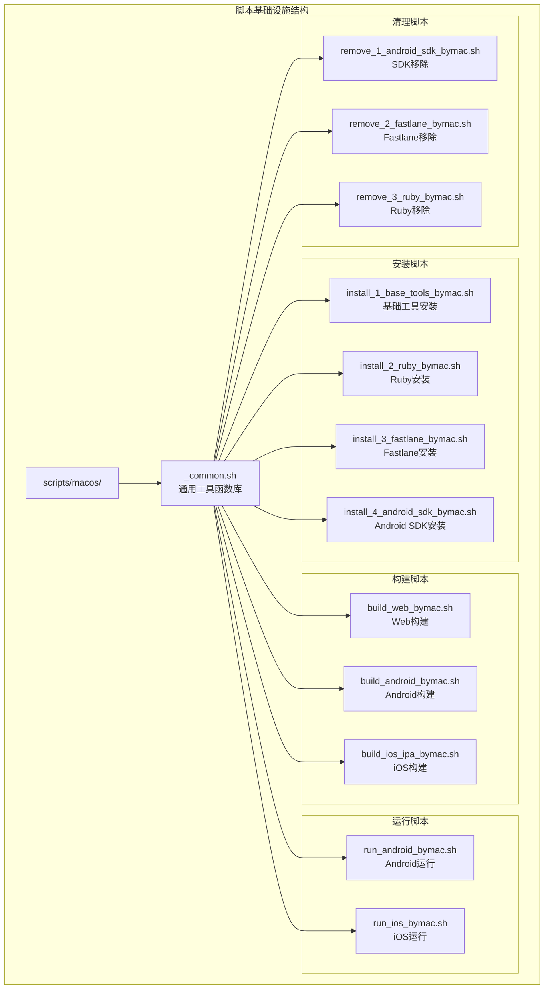
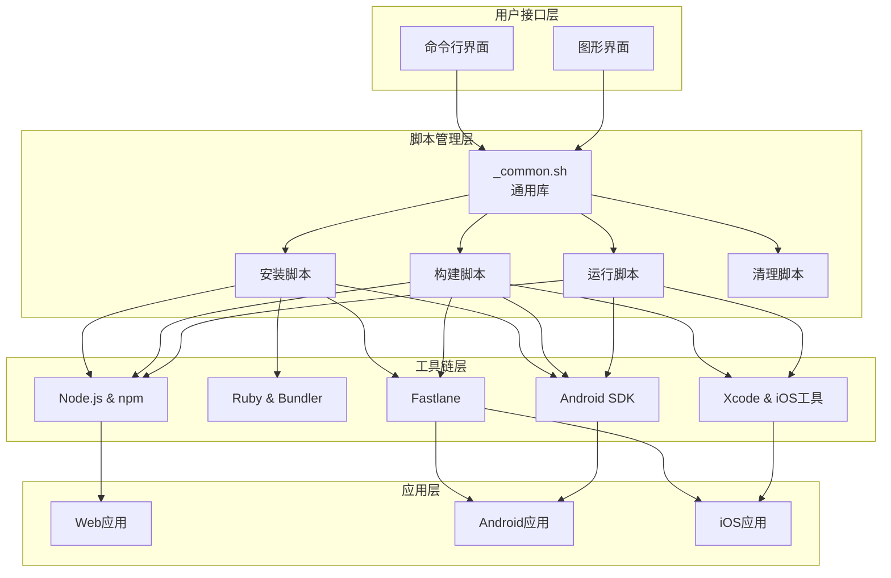
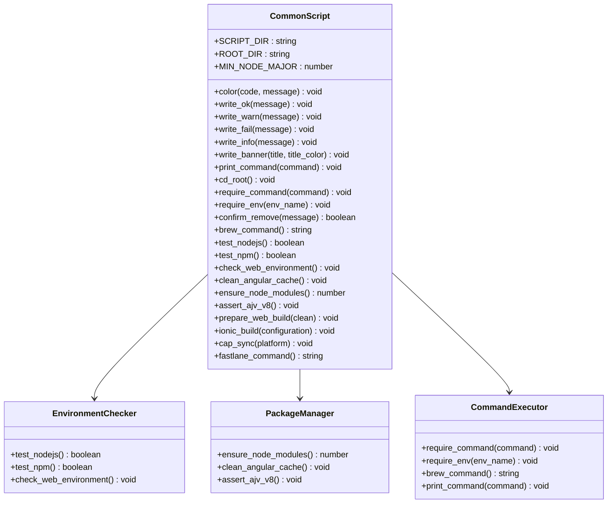
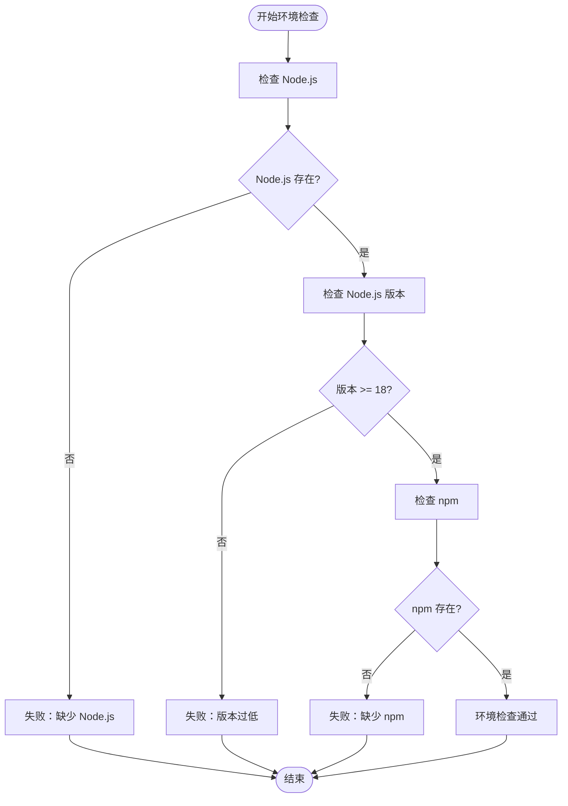
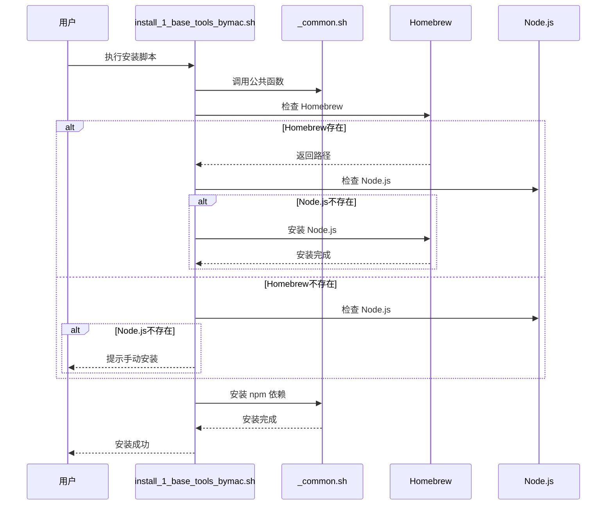
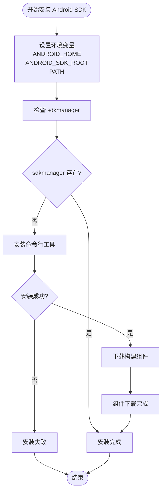
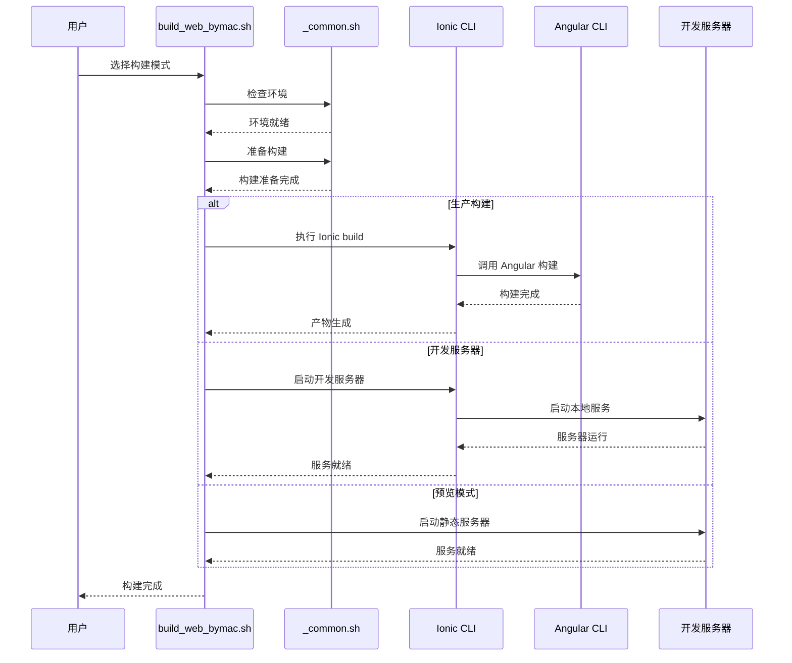
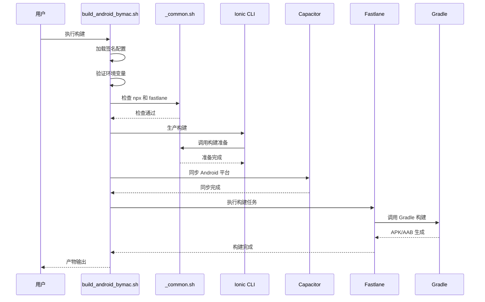
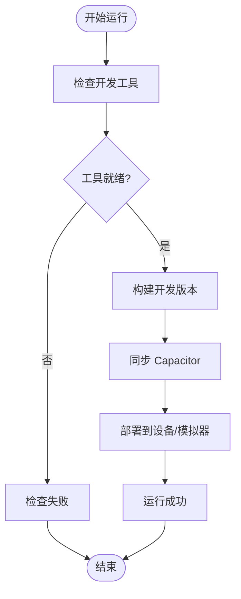

# macOS脚本基础设施

<cite>
**本文档引用的文件**
- [scripts/macos/_common.sh](file://scripts/macos/_common.sh)
- [scripts/macos/install_1_base_tools_bymac.sh](file://scripts/macos/install_1_base_tools_bymac.sh)
- [scripts/macos/install_2_ruby_bymac.sh](file://scripts/macos/install_2_ruby_bymac.sh)
- [scripts/macos/install_3_fastlane_bymac.sh](file://scripts/macos/install_3_fastlane_bymac.sh)
- [scripts/macos/install_4_android_sdk_bymac.sh](file://scripts/macos/install_4_android_sdk_bymac.sh)
- [scripts/macos/build_web_bymac.sh](file://scripts/macos/build_web_bymac.sh)
- [scripts/macos/build_android_bymac.sh](file://scripts/macos/build_android_bymac.sh)
- [scripts/macos/build_ios_ipa_bymac.sh](file://scripts/macos/build_ios_ipa_bymac.sh)
- [scripts/macos/run_android_bymac.sh](file://scripts/macos/run_android_bymac.sh)
- [scripts/macos/run_ios_bymac.sh](file://scripts/macos/run_ios_bymac.sh)
- [scripts/macos/remove_1_android_sdk_bymac.sh](file://scripts/macos/remove_1_android_sdk_bymac.sh)
- [scripts/macos/remove_2_fastlane_bymac.sh](file://scripts/macos/remove_2_fastlane_bymac.sh)
- [scripts/macos/remove_3_ruby_bymac.sh](file://scripts/macos/remove_3_ruby_bymac.sh)
- [scripts/README.md](file://scripts/README.md)
- [package.json](file://package.json)
- [Gemfile](file://Gemfile)
- [android/app/build.gradle](file://android/app/build.gradle)
</cite>

## 更新摘要
**所做更改**
- 新增完整的macOS脚本基础设施文档结构
- 添加所有安装脚本的详细分析（install_1-4）
- 完善构建脚本的架构说明（build_web_bymac.sh等）
- 新增运行脚本和清理脚本的完整文档
- 更新架构图以反映模块化设计
- 增强依赖关系分析和故障排除指南

## 目录
1. [简介](#简介)
2. [项目结构](#项目结构)
3. [核心组件](#核心组件)
4. [架构概览](#架构概览)
5. [详细组件分析](#详细组件分析)
6. [依赖关系分析](#依赖关系分析)
7. [性能考虑](#性能考虑)
8. [故障排除指南](#故障排除指南)
9. [结论](#结论)

## 简介

这是一个专为macOS设计的自动化脚本基础设施，用于管理Macro Deck客户端应用的开发、构建和部署流程。该基础设施提供了完整的工具链安装、环境配置、构建执行和清理功能，支持Web/PWA、Android和iOS平台的开发工作流。

该系统采用模块化设计，通过共享的通用脚本库提供统一的工具函数和错误处理机制，确保各个平台构建脚本的一致性和可靠性。每个脚本都经过精心设计，支持检查模式（--check-only）和交互式确认，提高了使用的安全性和灵活性。

## 项目结构

脚本基础设施位于项目的`scripts/macos/`目录下，采用层次化的组织结构，实现了完全的模块化设计：



**图表来源**
- [scripts/macos/_common.sh:1-239](file://scripts/macos/_common.sh#L1-L239)
- [scripts/macos/install_1_base_tools_bymac.sh:1-78](file://scripts/macos/install_1_base_tools_bymac.sh#L1-L78)
- [scripts/macos/install_2_ruby_bymac.sh:1-80](file://scripts/macos/install_2_ruby_bymac.sh#L1-L80)
- [scripts/macos/install_3_fastlane_bymac.sh:1-66](file://scripts/macos/install_3_fastlane_bymac.sh#L1-L66)
- [scripts/macos/install_4_android_sdk_bymac.sh:1-86](file://scripts/macos/install_4_android_sdk_bymac.sh#L1-L86)

**章节来源**
- [scripts/README.md:1-144](file://scripts/README.md#L1-L144)
- [scripts/macos/_common.sh:1-239](file://scripts/macos/_common.sh#L1-L239)

## 核心组件

### 通用工具库

`_common.sh`提供了所有脚本共享的核心功能，是整个基础设施的基石：

- **颜色输出系统**：提供彩色文本输出，便于区分不同类型的日志信息（绿色成功、黄色警告、红色错误、青色命令）
- **环境检查工具**：验证必需的命令和环境变量，支持Node.js版本检查（要求18+）
- **依赖管理**：处理npm依赖安装和版本兼容性，使用`--legacy-peer-deps`绕过peer dependency冲突
- **构建辅助**：提供Ionic和Capacitor集成的通用功能，包括Angular缓存清理和AJV版本检查
- **命令执行**：封装常用命令执行逻辑，提供统一的错误处理机制

### 安装管理器

系统包含四个阶段的安装脚本，按依赖顺序执行，每个脚本都支持检查模式：

1. **基础工具安装**：Homebrew、Node.js、npm的检测和安装
2. **Ruby环境**：Ruby 3.0+和Bundler的安装，支持版本检查
3. **Fastlane框架**：基于Gemfile的版本固定，支持bundle install
4. **Android SDK**：命令行工具和构建组件的完整安装流程

### 构建执行器

提供针对不同平台的构建脚本，每个都经过专门优化：

- **Web构建**：支持开发服务器、生产构建和产物预览，智能缓存管理
- **Android构建**：完整的发布包构建流程，包含签名环境验证
- **iOS构建**：IPA文件生成和分发准备，支持App Store Connect集成

### 运行和清理工具

- **设备部署**：一键部署到Android设备/模拟器和iOS模拟器/设备
- **环境清理**：完整的逆向操作，支持批量卸载和清理

**章节来源**
- [scripts/macos/_common.sh:8-239](file://scripts/macos/_common.sh#L8-L239)
- [scripts/macos/install_1_base_tools_bymac.sh:4-78](file://scripts/macos/install_1_base_tools_bymac.sh#L4-L78)
- [scripts/macos/install_2_ruby_bymac.sh:4-80](file://scripts/macos/install_2_ruby_bymac.sh#L4-L80)
- [scripts/macos/install_3_fastlane_bymac.sh:4-66](file://scripts/macos/install_3_fastlane_bymac.sh#L4-L66)
- [scripts/macos/install_4_android_sdk_bymac.sh:4-86](file://scripts/macos/install_4_android_sdk_bymac.sh#L4-L86)

## 架构概览

该脚本基础设施采用分层架构设计，确保各组件间的松耦合和高内聚：



**图表来源**
- [scripts/macos/_common.sh:1-239](file://scripts/macos/_common.sh#L1-L239)
- [scripts/macos/install_1_base_tools_bymac.sh:1-78](file://scripts/macos/install_1_base_tools_bymac.sh#L1-L78)
- [scripts/macos/build_android_bymac.sh:1-219](file://scripts/macos/build_android_bymac.sh#L1-L219)
- [scripts/macos/build_ios_ipa_bymac.sh:1-83](file://scripts/macos/build_ios_ipa_bymac.sh#L1-L83)

## 详细组件分析

### 通用工具库分析

#### 核心功能模块



**图表来源**
- [scripts/macos/_common.sh:8-239](file://scripts/macos/_common.sh#L8-L239)

#### 环境检查流程



**图表来源**
- [scripts/macos/_common.sh:84-126](file://scripts/macos/_common.sh#L84-L126)

**章节来源**
- [scripts/macos/_common.sh:8-239](file://scripts/macos/_common.sh#L8-L239)

### 安装脚本分析

#### 基础工具安装流程



**图表来源**
- [scripts/macos/install_1_base_tools_bymac.sh:44-77](file://scripts/macos/install_1_base_tools_bymac.sh#L44-L77)
- [scripts/macos/_common.sh:47-63](file://scripts/macos/_common.sh#L47-L63)

#### Android SDK安装流程



**图表来源**
- [scripts/macos/install_4_android_sdk_bymac.sh:52-86](file://scripts/macos/install_4_android_sdk_bymac.sh#L52-L86)

**章节来源**
- [scripts/macos/install_1_base_tools_bymac.sh:1-78](file://scripts/macos/install_1_base_tools_bymac.sh#L1-L78)
- [scripts/macos/install_4_android_sdk_bymac.sh:1-86](file://scripts/macos/install_4_android_sdk_bymac.sh#L1-L86)

### 构建脚本分析

#### Web构建流程



**图表来源**
- [scripts/macos/build_web_bymac.sh:92-155](file://scripts/macos/build_web_bymac.sh#L92-L155)
- [scripts/macos/_common.sh:178-226](file://scripts/macos/_common.sh#L178-L226)

#### Android发布构建流程



**图表来源**
- [scripts/macos/build_android_bymac.sh:186-219](file://scripts/macos/build_android_bymac.sh#L186-L219)

**章节来源**
- [scripts/macos/build_web_bymac.sh:1-155](file://scripts/macos/build_web_bymac.sh#L1-L155)
- [scripts/macos/build_android_bymac.sh:1-219](file://scripts/macos/build_android_bymac.sh#L1-L219)
- [scripts/macos/build_ios_ipa_bymac.sh:1-83](file://scripts/macos/build_ios_ipa_bymac.sh#L1-L83)

### 运行脚本分析

#### 设备部署流程



**图表来源**
- [scripts/macos/run_android_bymac.sh:11-23](file://scripts/macos/run_android_bymac.sh#L11-L23)
- [scripts/macos/run_ios_bymac.sh:11-22](file://scripts/macos/run_ios_bymac.sh#L11-L22)

**章节来源**
- [scripts/macos/run_android_bymac.sh:1-23](file://scripts/macos/run_android_bymac.sh#L1-L23)
- [scripts/macos/run_ios_bymac.sh:1-22](file://scripts/macos/run_ios_bymac.sh#L1-L22)

## 依赖关系分析

### 外部依赖管理

系统通过多种机制管理外部依赖：

```mermaid
graph LR
subgraph "依赖管理策略"
PackageJSON[package.json<br/>npm依赖] --> LegacyPeer[--legacy-peer-deps]
Gemfile[Gemfile<br/>Ruby依赖] --> Fastlane[Fastlane固定版本]
AndroidGradle[android/app/build.gradle<br/>Android配置] --> GradlePlugins[Gradle插件]
end
subgraph "版本控制"
AJV[ajv@^8.20.0<br/>自动修复] --> AngularCache[Angular缓存清理]
NodeVersion[Node.js 18+/20+/22+<br/>版本检查] --> BuildSuccess[构建成功]
end
LegacyPeer --> PackageInstall[npm install]
Fastlane --> BundleInstall[bundle install]
AngularCache --> BuildSuccess
```

**图表来源**
- [package.json:79-79](file://package.json#L79-L79)
- [scripts/macos/_common.sh:153-176](file://scripts/macos/_common.sh#L153-L176)
- [scripts/macos/_common.sh:84-102](file://scripts/macos/_common.sh#L84-L102)

### 环境变量依赖

系统依赖的关键环境变量：

| 环境变量 | 用途 | 默认值 | 必需性 |
|---------|------|--------|--------|
| ANDROID_HOME | Android SDK根目录 | `$HOME/Library/Android/sdk` | 可选 |
| ANDROID_SDK_ROOT | Android SDK根目录 | `$ANDROID_HOME` | 可选 |
| PATH | 包含platform-tools和cmdline-tools | 自动添加 | 可选 |
| BUILD_NUMBER | Android版本代码 | 从build.gradle读取 | 必需(发布) |
| VERSION_NUMBER | Android版本名称 | 从build.gradle读取 | 必需(发布) |
| KEYSTORE_FILE_PATH | 签名密钥库路径 | `~/keystore/macro-deck-client-keystore.jks` | 必需(发布) |
| KEYSTORE_FILE_ALIAS | 密钥别名 | `macro-deck-client` | 可选 |
| KEYSTORE_FILE_PASSWORD | 密钥库密码 | 无 | 必需(发布) |
| KEY_ID | App Store Connect密钥ID | 无 | 必需(iOS发布) |
| ISSUER_ID | App Store Connect发行者ID | 无 | 必需(iOS发布) |
| KEY_CONTENT | 私钥内容 | 无 | 必需(iOS发布) |
| MATCH_PASSWORD | Fastlane Match密码 | 无 | 必需(iOS发布) |

**章节来源**
- [scripts/macos/build_android_bymac.sh:149-184](file://scripts/macos/build_android_bymac.sh#L149-L184)
- [android/app/build.gradle:10-11](file://android/app/build.gradle#L10-L11)

## 性能考虑

### 构建优化策略

1. **缓存管理**：自动清理Angular构建缓存以避免磁盘空间占用
2. **依赖复用**：避免重复安装npm依赖，提高后续构建速度
3. **增量构建**：支持开发服务器的热重载功能
4. **并行执行**：多个脚本可以并行执行以提高整体效率

### 内存使用优化

- 使用`set -euo pipefail`确保脚本在遇到错误时立即停止
- 合理的临时文件管理和清理机制
- 避免不必要的全局状态修改

## 故障排除指南

### 常见问题及解决方案

#### Node.js相关问题

**问题**：Node.js版本过低
**解决方法**：安装Node.js 18 LTS、20 LTS或22 LTS版本

**问题**：npm安装失败
**解决方法**：使用`--legacy-peer-deps`标志绕过peer dependency冲突

#### Android SDK问题

**问题**：sdkmanager命令不可用
**解决方法**：安装`android-commandlinetools`包或手动配置PATH

**问题**：构建失败提示缺少组件
**解决方法**：运行`sdkmanager`安装缺失的平台工具和构建工具

#### Fastlane问题

**问题**：fastlane命令不可用
**解决方法**：安装Ruby和Bundler，然后执行`bundle install`

#### 权限问题

**问题**：keystore文件权限不足
**解决方法**：确保keystore文件具有适当的读取权限

**章节来源**
- [scripts/macos/_common.sh:84-102](file://scripts/macos/_common.sh#L84-L102)
- [scripts/macos/install_4_android_sdk_bymac.sh:62-68](file://scripts/macos/install_4_android_sdk_bymac.sh#L62-L68)
- [scripts/macos/build_android_bymac.sh:64-88](file://scripts/macos/build_android_bymac.sh#L64-L88)

## 结论

该macOS脚本基础设施提供了完整的移动应用开发和部署解决方案。通过模块化的设计和清晰的依赖管理，系统能够：

1. **简化环境配置**：自动化安装和配置所有必要的开发工具
2. **标准化构建流程**：提供一致的构建和部署体验
3. **增强可维护性**：通过共享的通用库减少代码重复
4. **提高开发效率**：支持快速迭代和多平台同时开发

该基础设施特别适合需要同时支持Web、Android和iOS平台的现代移动应用开发团队，为开发者提供了高效、可靠的自动化工具链。每个脚本都经过精心设计，支持检查模式和交互式确认，确保使用的安全性和灵活性。通过模块化架构，系统能够轻松扩展新的平台支持和功能特性。