# Android平台部署

<cite>
**本文引用的文件**
- [android/app/build.gradle](file://android/app/build.gradle)
- [android/build.gradle](file://android/build.gradle)
- [android/gradle.properties](file://android/gradle.properties)
- [android/settings.gradle](file://android/settings.gradle)
- [android/variables.gradle](file://android/variables.gradle)
- [android/app/proguard-rules.pro](file://android/app/proguard-rules.pro)
- [android/app/src/main/AndroidManifest.xml](file://android/app/src/main/AndroidManifest.xml)
- [android/app/src/main/res/values/strings.xml](file://android/app/src/main/res/values/strings.xml)
- [android/app/src/main/res/values/styles.xml](file://android/app/src/main/res/values/styles.xml)
- [android/app/capacitor.build.gradle](file://android/app/capacitor.build.gradle)
- [android/capacitor.settings.gradle](file://android/capacitor.settings.gradle)
- [android/gradle/wrapper/gradle-wrapper.properties](file://android/gradle/wrapper/gradle-wrapper.properties)
- [android/fastlane/Fastfile](file://android/fastlane/Fastfile)
- [android/fastlane/Deliverfile](file://android/fastlane/Deliverfile)
- [.github/workflows/ci.yml](file://.github/workflows/ci.yml)
- [.github/workflows/reusable-android-deployment.yml](file://.github/workflows/reusable-android-deployment.yml)
- [config.xml](file://config.xml)
- [Gemfile.lock](file://Gemfile.lock)
- [android/Gemfile.lock](file://android/Gemfile.lock)
- [src/environments/environment.ts](file://src/environments/environment.ts)
- [src/environments/environment.prod.ts](file://src/environments/environment.prod.ts)
</cite>

## 更新摘要
**变更内容**
- 更新了应用版本信息至3.0.1 (versionCode: 29)
- 更新了Gemfile.lock中的Ruby依赖和镜像源配置
- 同步了环境配置文件中的版本号信息

## 目录
1. [简介](#简介)
2. [项目结构](#项目结构)
3. [核心组件](#核心组件)
4. [架构总览](#架构总览)
5. [详细组件分析](#详细组件分析)
6. [依赖关系分析](#依赖关系分析)
7. [性能考虑](#性能考虑)
8. [故障排查指南](#故障排查指南)
9. [结论](#结论)
10. [附录](#附录)

## 简介
本指南面向在Android平台上部署Macro Deck客户端应用的工程与运维人员，围绕构建配置（compileSdkVersion、minSdkVersion、targetSdkVersion）、release构建类型（代码混淆与资源压缩）、Android Manifest配置（权限、应用ID、启动Activity）、Google Services与Firebase集成、APK签名与发布准备、以及Google Play Store发布流程进行系统化说明。同时提供常见构建问题的解决方案与性能优化建议，帮助团队高效、稳定地完成版本迭代与发布。

## 项目结构
Android子工程采用Capacitor架构，顶层Gradle脚本统一管理插件与仓库源；模块级build.gradle定义编译参数、构建类型与依赖；Manifest集中声明权限与启动入口；Fastlane用于自动化构建与上传；GitHub Actions工作流串联CI/CD流水线。

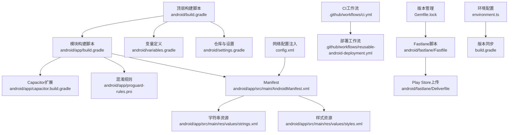

**图示来源**
- [android/build.gradle:1-30](file://android/build.gradle#L1-L30)
- [android/app/build.gradle:1-71](file://android/app/build.gradle#L1-L71)
- [android/variables.gradle:1-17](file://android/variables.gradle#L1-L17)
- [android/settings.gradle:1-5](file://android/settings.gradle#L1-L5)
- [android/app/capacitor.build.gradle:1-27](file://android/app/capacitor.build.gradle#L1-L27)
- [android/app/proguard-rules.pro:1-22](file://android/app/proguard-rules.pro#L1-L22)
- [android/app/src/main/AndroidManifest.xml:1-61](file://android/app/src/main/AndroidManifest.xml#L1-L61)
- [android/app/src/main/res/values/strings.xml:1-8](file://android/app/src/main/res/values/strings.xml#L1-L8)
- [android/app/src/main/res/values/styles.xml:1-16](file://android/app/src/main/res/values/styles.xml#L1-L16)
- [android/fastlane/Fastfile:1-81](file://android/fastlane/Fastfile#L1-L81)
- [android/fastlane/Deliverfile:1-10](file://android/fastlane/Deliverfile#L1-L10)
- [config.xml:20-22](file://config.xml#L20-L22)
- [Gemfile.lock:1-244](file://Gemfile.lock#L1-L244)
- [src/environments/environment.ts:1-23](file://src/environments/environment.ts#L1-L23)

章节来源
- [android/build.gradle:1-30](file://android/build.gradle#L1-L30)
- [android/app/build.gradle:1-71](file://android/app/build.gradle#L1-L71)
- [android/variables.gradle:1-17](file://android/variables.gradle#L1-L17)
- [android/settings.gradle:1-5](file://android/settings.gradle#L1-L5)
- [android/app/src/main/AndroidManifest.xml:1-61](file://android/app/src/main/AndroidManifest.xml#L1-L61)

## 核心组件
- 构建脚本与工具链
  - 顶层构建脚本：定义Android Gradle插件与Google Services插件classpath，统一仓库源与清理任务。
  - 模块构建脚本：设置命名空间、compileSdk/minSdk/targetSdk、应用ID、版本号与名称、构建类型（release启用混淆）、数据绑定开关、仓库flatDir与依赖。
  - Gradle Wrapper：固定Gradle版本以确保可复现性。
  - Gradle属性：开启AndroidX、JVM内存与并行构建策略提示。
- 配置与资源
  - 变量文件：集中定义SDK版本与第三方库版本。
  - Manifest：权限声明、应用图标与主题、启动Activity、FileProvider、Deep Link与自动验证、明文流量等。
  - 字符串与样式：应用名、包名、自定义URL Scheme、主题定制。
  - Capacitor设置与扩展：生成式include列表与Java兼容性配置。
- 自动化与发布
  - Fastlane：构建与打包（bundle/assemble），读取环境变量进行签名，上传至Play Store草稿。
  - GitHub Actions：CI触发与Android构建、部署工作流调用。
- 版本管理与依赖
  - Gemfile.lock：锁定Ruby依赖版本，确保构建环境一致性。
  - 环境配置：多环境版本同步机制，保持Android、iOS、Web版本一致。

**章节来源**
- [android/build.gradle:1-30](file://android/build.gradle#L1-L30)
- [android/app/build.gradle:1-71](file://android/app/build.gradle#L1-L71)
- [android/gradle/wrapper/gradle-wrapper.properties:1-7](file://android/gradle/wrapper/gradle-wrapper.properties#L1-L7)
- [android/gradle.properties:1-23](file://android/gradle.properties#L1-L23)
- [android/variables.gradle:1-17](file://android/variables.gradle#L1-L17)
- [android/app/src/main/AndroidManifest.xml:1-61](file://android/app/src/main/AndroidManifest.xml#L1-L61)
- [android/app/src/main/res/values/strings.xml:1-8](file://android/app/src/main/res/values/strings.xml#L1-L8)
- [android/app/src/main/res/values/styles.xml:1-16](file://android/app/src/main/res/values/styles.xml#L1-L16)
- [android/app/capacitor.build.gradle:1-27](file://android/app/capacitor.build.gradle#L1-L27)
- [android/capacitor.settings.gradle:1-28](file://android/capacitor.settings.gradle#L1-L28)
- [android/fastlane/Fastfile:1-81](file://android/fastlane/Fastfile#L1-L81)
- [android/fastlane/Deliverfile:1-10](file://android/fastlane/Deliverfile#L1-L10)
- [.github/workflows/ci.yml:1-49](file://.github/workflows/ci.yml#L1-L49)
- [.github/workflows/reusable-android-deployment.yml:1-29](file://.github/workflows/reusable-android-deployment.yml#L1-L29)
- [Gemfile.lock:1-244](file://Gemfile.lock#L1-L244)
- [src/environments/environment.ts:1-23](file://src/environments/environment.ts#L1-L23)

## 架构总览
下图展示从CI触发到Play Store发布的端到端流程，涵盖版本号注入、签名、打包与上传。

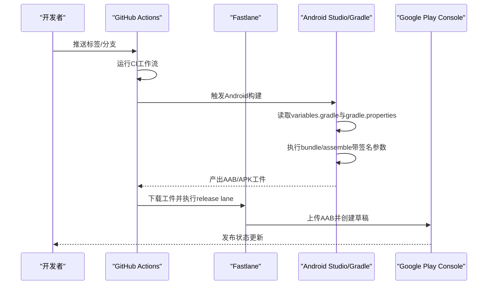

**图示来源**
- [.github/workflows/ci.yml:1-49](file://.github/workflows/ci.yml#L1-L49)
- [.github/workflows/reusable-android-deployment.yml:1-29](file://.github/workflows/reusable-android-deployment.yml#L1-L29)
- [android/fastlane/Fastfile:1-81](file://android/fastlane/Fastfile#L1-L81)
- [android/app/build.gradle:19-31](file://android/app/build.gradle#L19-L31)

## 详细组件分析

### 构建配置与SDK版本
- compileSdkVersion：使用变量定义为较高版本，确保使用最新API与构建工具能力。
- minSdkVersion：目标覆盖主流设备，兼顾兼容性与新特性支持。
- targetSdkVersion：与compileSdk保持一致，便于测试与行为一致性。
- 版本号管理：模块内定义versionCode与versionName，Fastlane在CI中通过环境变量动态更新。

**已更新** 应用版本已更新至3.0.1，versionCode为29，确保与前端环境配置保持一致。

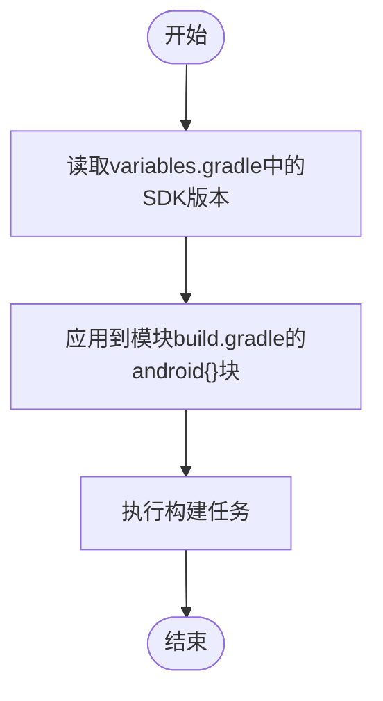

**图示来源**
- [android/variables.gradle:1-17](file://android/variables.gradle#L1-L17)
- [android/app/build.gradle:3-12](file://android/app/build.gradle#L3-L12)

**章节来源**
- [android/variables.gradle:1-17](file://android/variables.gradle#L1-L17)
- [android/app/build.gradle:3-12](file://android/app/build.gradle#L3-L12)

### Release构建类型与代码混淆
- release构建类型已启用混淆与ProGuard规则文件，但未启用代码压缩（minifyEnabled为false）。如需进一步减小体积与提升安全性，可按需开启压缩并完善混淆规则。
- proguard-rules.pro提供注释模板，可用于保留WebView接口或调试信息。

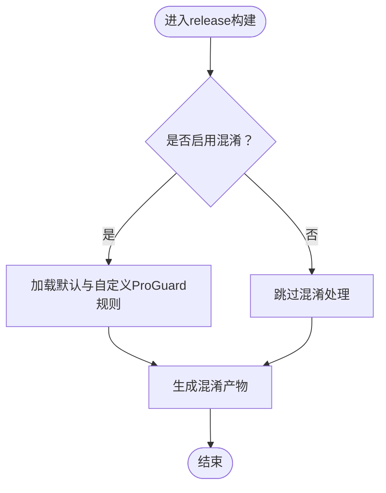

**图示来源**
- [android/app/build.gradle:19-24](file://android/app/build.gradle#L19-L24)
- [android/app/proguard-rules.pro:1-22](file://android/app/proguard-rules.pro#L1-L22)

**章节来源**
- [android/app/build.gradle:19-24](file://android/app/build.gradle#L19-L24)
- [android/app/proguard-rules.pro:1-22](file://android/app/proguard-rules.pro#L1-L22)

### Android Manifest配置
- 权限声明：INTERNET、ACCESS_NETWORK_STATE、WAKE_LOCK、ACCESS_WIFI_STATE、CAMERA、FLASHLIGHT。
- 应用ID与包名：与模块配置一致，字符串资源中提供包名与自定义URL Scheme。
- 启动Activity：MainActivity，支持多配置变更；声明主入口与Deep Link自动验证（https与特定host）。
- Provider与文件访问：FileProvider配合资源路径映射，供外部分享或安装使用。
- 明文流量：允许明文HTTP流量，结合网络安全配置文件使用。
- 其他元数据：禁用自动屏幕上报、声明MLKit依赖项。

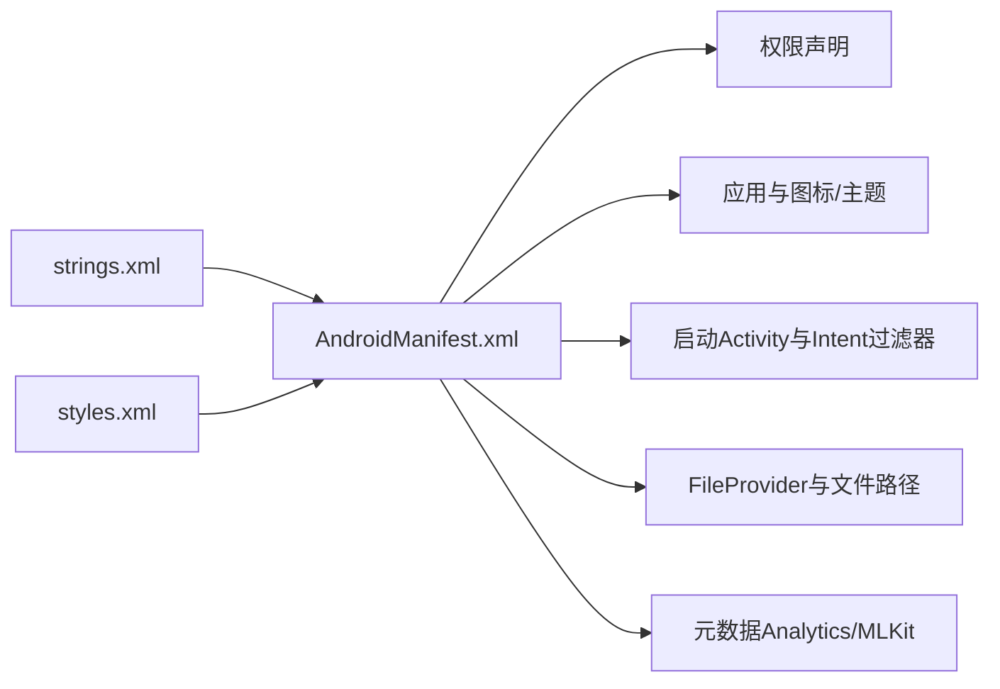

**图示来源**
- [android/app/src/main/AndroidManifest.xml:1-61](file://android/app/src/main/AndroidManifest.xml#L1-L61)
- [android/app/src/main/res/values/strings.xml:1-8](file://android/app/src/main/res/values/strings.xml#L1-L8)
- [android/app/src/main/res/values/styles.xml:1-16](file://android/app/src/main/res/values/styles.xml#L1-L16)

**章节来源**
- [android/app/src/main/AndroidManifest.xml:1-61](file://android/app/src/main/AndroidManifest.xml#L1-L61)
- [android/app/src/main/res/values/strings.xml:1-8](file://android/app/src/main/res/values/strings.xml#L1-L8)
- [android/app/src/main/res/values/styles.xml:1-16](file://android/app/src/main/res/values/styles.xml#L1-L16)

### Google Services与Firebase集成
- 检测google-services.json存在后动态应用Google Services插件，用于推送通知等功能。
- 若缺失该文件，构建日志会记录提示信息，不影响常规打包，但推送相关功能不可用。

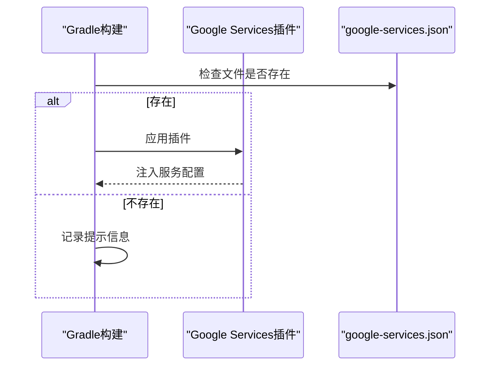

**图示来源**
- [android/app/build.gradle:63-70](file://android/app/build.gradle#L63-L70)

**章节来源**
- [android/app/build.gradle:63-70](file://android/app/build.gradle#L63-L70)

### Capacitor与第三方插件生态
- 自动生成的Capacitor设置文件包含多个官方与社区插件的include，确保运行时能力（如扫码、屏幕方向、键盘、设备信息等）可用。
- Java兼容性在Capacitor扩展脚本中统一设置为21，需与本地JDK版本匹配。

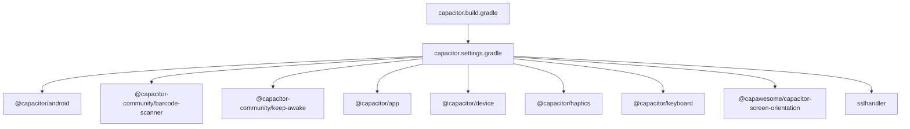

**图示来源**
- [android/capacitor.settings.gradle:1-28](file://android/capacitor.settings.gradle#L1-L28)
- [android/app/capacitor.build.gradle:1-27](file://android/app/capacitor.build.gradle#L1-L27)

**章节来源**
- [android/capacitor.settings.gradle:1-28](file://android/capacitor.settings.gradle#L1-L28)
- [android/app/capacitor.build.gradle:1-27](file://android/app/capacitor.build.gradle#L1-L27)

### 网络与安全配置
- 通过config.xml向Manifest注入network_security_config，结合resources/android/xml/network_security_config.xml实现更细粒度的网络安全策略（例如允许明文、自定义证书信任等）。

**章节来源**
- [config.xml:20-22](file://config.xml#L20-L22)

### Fastlane与Play Store发布
- Fastfile提供build与release两个lane：
  - build：校验环境变量，更新versionCode/versionName，执行bundle与assemble并传入签名参数。
  - release：将AAB上传至Play Store并创建草稿。
- Deliverfile指定应用标识符，与Manifest与模块配置保持一致。

**已更新** AAB文件名规范化逻辑已增强，确保输出文件名为"MacroDeckClient-<版本名>-<版本号>.aab"格式。

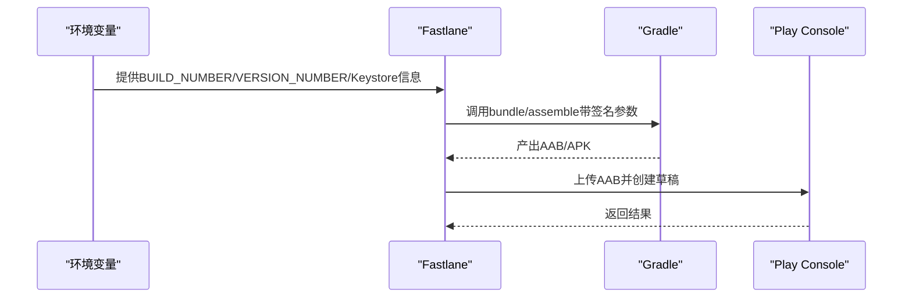

**图示来源**
- [android/fastlane/Fastfile:1-81](file://android/fastlane/Fastfile#L1-L81)
- [android/fastlane/Deliverfile:1-10](file://android/fastlane/Deliverfile#L1-L10)

**章节来源**
- [android/fastlane/Fastfile:1-81](file://android/fastlane/Fastfile#L1-L81)
- [android/fastlane/Deliverfile:1-10](file://android/fastlane/Deliverfile#L1-L10)

### GitHub Actions与CI/CD
- ci.yml：触发确定版本、基础构建、iOS与Android构建，并在打标签时触发Android部署工作流。
- reusable-android-deployment.yml：下载Android构建工件，安装bundle并执行Fastlane release。

**章节来源**
- [.github/workflows/ci.yml:1-49](file://.github/workflows/ci.yml#L1-L49)
- [.github/workflows/reusable-android-deployment.yml:1-29](file://.github/workflows/reusable-android-deployment.yml#L1-L29)

### Ruby依赖与镜像源配置
- Gemfile.lock：锁定Ruby依赖版本，确保跨平台构建一致性。
- 镜像源配置：支持腾讯云和华为云RubyGems镜像，提升国内构建速度。
- Bundler版本管理：自动检测并切换至锁定的Bundler版本，避免版本冲突。

**已更新** Ruby依赖已更新至最新版本，包括fastlane 2.236.1和相关Google API客户端库。

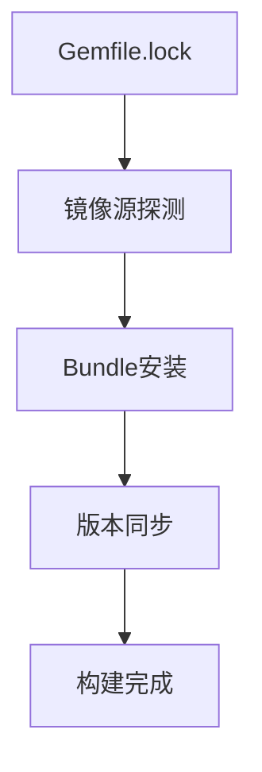

**图示来源**
- [Gemfile.lock:1-244](file://Gemfile.lock#L1-L244)
- [android/Gemfile.lock:1-359](file://android/Gemfile.lock#L1-L359)

**章节来源**
- [Gemfile.lock:1-244](file://Gemfile.lock#L1-L244)
- [android/Gemfile.lock:1-359](file://android/Gemfile.lock#L1-L359)

### 版本同步机制
- 多环境版本同步：Android、iOS、Web三端版本保持一致。
- 权威源：以android/app/build.gradle为唯一版本源。
- 同步脚本：Windows平台提供sync_version_bywin.ps1脚本进行版本同步。

**已更新** 所有环境配置文件已同步至版本3.0.1，versionCode为29。

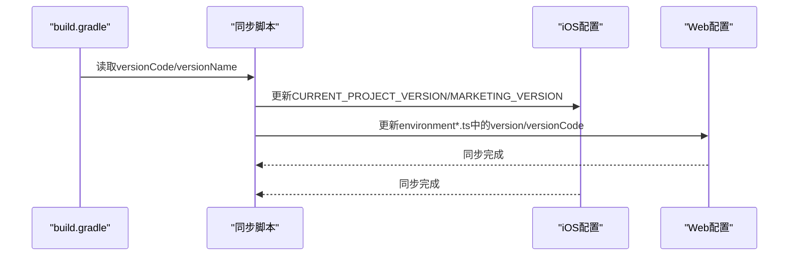

**图示来源**
- [src/environments/environment.ts:1-23](file://src/environments/environment.ts#L1-L23)
- [src/environments/environment.prod.ts:1-12](file://src/environments/environment.prod.ts#L1-12)
- [scripts/windows/sync_version_bywin.ps1:1-79](file://scripts/windows/sync_version_bywin.ps1#L1-79)

**章节来源**
- [src/environments/environment.ts:1-23](file://src/environments/environment.ts#L1-23)
- [src/environments/environment.prod.ts:1-12](file://src/environments/environment.prod.ts#L1-12)

## 依赖关系分析
- 顶层构建脚本依赖variables.gradle提供SDK版本与第三方库版本；模块构建脚本依赖顶层仓库源与Capacitor扩展脚本。
- Manifest与字符串/样式资源共同决定UI与行为；Fastlane与GitHub Actions形成端到端自动化闭环。
- Ruby依赖通过Gemfile.lock锁定，确保构建环境一致性。

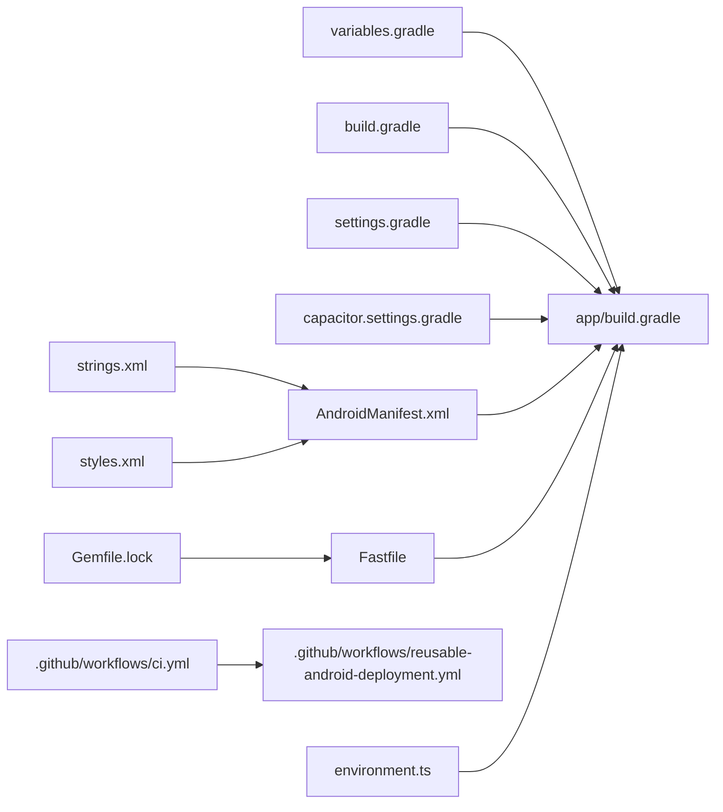

**图示来源**
- [android/variables.gradle:1-17](file://android/variables.gradle#L1-L17)
- [android/app/build.gradle:1-71](file://android/app/build.gradle#L1-L71)
- [android/settings.gradle:1-5](file://android/settings.gradle#L1-L5)
- [android/capacitor.settings.gradle:1-28](file://android/capacitor.settings.gradle#L1-L28)
- [android/app/src/main/AndroidManifest.xml:1-61](file://android/app/src/main/AndroidManifest.xml#L1-L61)
- [android/app/src/main/res/values/strings.xml:1-8](file://android/app/src/main/res/values/strings.xml#L1-L8)
- [android/app/src/main/res/values/styles.xml:1-16](file://android/app/src/main/res/values/styles.xml#L1-L16)
- [android/fastlane/Fastfile:1-81](file://android/fastlane/Fastfile#L1-L81)
- [.github/workflows/ci.yml:1-49](file://.github/workflows/ci.yml#L1-L49)
- [.github/workflows/reusable-android-deployment.yml:1-29](file://.github/workflows/reusable-android-deployment.yml#L1-L29)
- [Gemfile.lock:1-244](file://Gemfile.lock#L1-L244)
- [src/environments/environment.ts:1-23](file://src/environments/environment.ts#L1-L23)

**章节来源**
- [android/app/build.gradle:1-71](file://android/app/build.gradle#L1-L71)
- [android/variables.gradle:1-17](file://android/variables.gradle#L1-L17)
- [android/app/src/main/AndroidManifest.xml:1-61](file://android/app/src/main/AndroidManifest.xml#L1-L61)

## 性能考虑
- SDK版本选择：compileSdk与targetSdk保持一致有助于减少兼容性差异带来的开销与测试成本。
- 数据绑定：已在模块中启用，合理使用可降低样板代码，但需注意布局复杂度对渲染的影响。
- 混淆与压缩：当前仅启用混淆，未启用代码压缩。若追求更小包体与更强防护，可在release构建中逐步引入压缩并完善规则。
- Gradle缓存与并行：利用Gradle属性中的并行选项与JVM内存参数，结合CI缓存策略提升构建速度。
- 网络安全：通过网络配置文件控制明文与证书策略，避免不必要的HTTPS降级导致的安全与性能风险。
- Ruby依赖优化：使用国内镜像源加速依赖安装，提升CI构建效率。

## 故障排查指南
- 缺少google-services.json
  - 现象：构建日志提示插件未应用，推送相关功能不可用。
  - 处理：在项目根目录放置正确的google-services.json，或在CI中提供相应密钥。
  - 参考：[android/app/build.gradle:63-70](file://android/app/build.gradle#L63-L70)
- 签名参数缺失
  - 现象：Fastlane构建失败，提示缺少keystore相关信息。
  - 处理：在CI环境中设置KEYSTORE_FILE_PATH、KEYSTORE_FILE_PASSWORD、KEYSTORE_FILE_ALIAS。
  - 参考：[android/fastlane/Fastfile:25-58](file://android/fastlane/Fastfile#L25-L58)
- 版本号未更新
  - 现象：版本号未按预期递增。
  - 处理：确保BUILD_NUMBER与VERSION_NUMBER环境变量正确传递给Fastlane。
  - 参考：[android/fastlane/Fastfile:5-23](file://android/fastlane/Fastfile#L5-L23)
- Java版本不匹配
  - 现象：构建报错或字节码版本不兼容。
  - 处理：确保本地JDK版本与capacitor.build.gradle中设置的Java兼容性一致。
  - 参考：[android/app/capacitor.build.gradle:4-7](file://android/app/capacitor.build.gradle#L4-L7)
- Gradle版本不一致
  - 现象：不同机器构建结果不一致。
  - 处理：使用gradle-wrapper.properties中指定的固定版本。
  - 参考：[android/gradle/wrapper/gradle-wrapper.properties:1-7](file://android/gradle/wrapper/gradle-wrapper.properties#L1-L7)
- AndroidX迁移
  - 现象：部分库仍使用Support Library导致冲突。
  - 处理：确认gradle.properties已开启android.useAndroidX，避免混用。
  - 参考：[android/gradle.properties:22](file://android/gradle.properties#L22)
- Ruby依赖安装失败
  - 现象：bundle install超时或依赖解析失败。
  - 处理：检查网络连接，使用配置的国内镜像源，确保Bundler版本与lockfile一致。
  - 参考：[Gemfile.lock:1-244](file://Gemfile.lock#L1-L244)
- 版本不同步
  - 现象：Android、iOS、Web版本不一致。
  - 处理：使用sync_version_bywin.ps1脚本重新同步版本。
  - 参考：[scripts/windows/sync_version_bywin.ps1:1-79](file://scripts/windows/sync_version_bywin.ps1#L1-79)

**章节来源**
- [android/app/build.gradle:63-70](file://android/app/build.gradle#L63-L70)
- [android/fastlane/Fastfile:5-58](file://android/fastlane/Fastfile#L5-L58)
- [android/app/capacitor.build.gradle:4-7](file://android/app/capacitor.build.gradle#L4-L7)
- [android/gradle/wrapper/gradle-wrapper.properties:1-7](file://android/gradle/wrapper/gradle-wrapper.properties#L1-L7)
- [android/gradle.properties:22](file://android/gradle.properties#L22)
- [Gemfile.lock:1-244](file://Gemfile.lock#L1-L244)
- [scripts/windows/sync_version_bywin.ps1:1-79](file://scripts/windows/sync_version_bywin.ps1#L1-79)

## 结论
本项目在Android平台的部署配置清晰、自动化程度高，具备稳定的CI/CD与发布流程。建议在现有基础上逐步引入代码压缩与更完善的混淆规则，持续优化构建性能与产物安全性；同时确保密钥与配置文件在CI中的安全分发，保障发布流程的可靠性。版本管理已实现三端同步，Ruby依赖配置优化提升了构建效率。

## 附录
- 关键配置一览
  - SDK版本：见[android/variables.gradle:1-17](file://android/variables.gradle#L1-L17)
  - 构建类型与混淆：见[android/app/build.gradle:19-24](file://android/app/build.gradle#L19-L24)
  - Manifest权限与入口：见[android/app/src/main/AndroidManifest.xml:1-61](file://android/app/src/main/AndroidManifest.xml#L1-L61)
  - 字符串与样式：见[android/app/src/main/res/values/strings.xml:1-8](file://android/app/src/main/res/values/strings.xml#L1-L8)、[android/app/src/main/res/values/styles.xml:1-16](file://android/app/src/main/res/values/styles.xml#L1-L16)
  - Google Services：见[android/app/build.gradle:63-70](file://android/app/build.gradle#L63-L70)
  - Fastlane与Play Store：见[android/fastlane/Fastfile:1-81](file://android/fastlane/Fastfile#L1-L81)、[android/fastlane/Deliverfile:1-10](file://android/fastlane/Deliverfile#L1-L10)
  - CI/CD：见[.github/workflows/ci.yml:1-49](file://.github/workflows/ci.yml#L1-L49)、[.github/workflows/reusable-android-deployment.yml:1-29](file://.github/workflows/reusable-android-deployment.yml#L1-L29)
  - Ruby依赖：见[Gemfile.lock:1-244](file://Gemfile.lock#L1-L244)、[android/Gemfile.lock:1-359](file://android/Gemfile.lock#L1-359)
  - 版本配置：见[android/app/build.gradle:10-11](file://android/app/build.gradle#L10-L11)、[src/environments/environment.ts:10-12](file://src/environments/environment.ts#L10-L12)