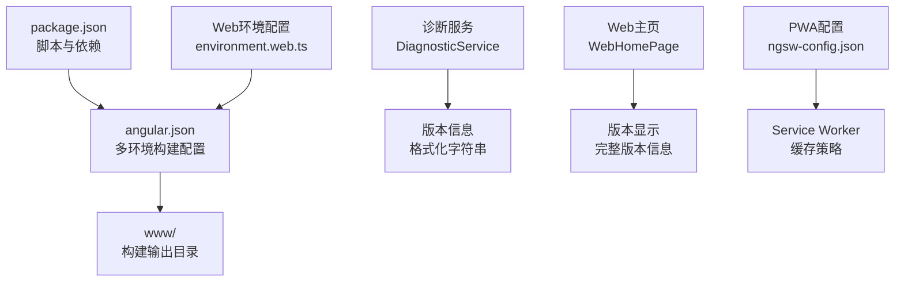
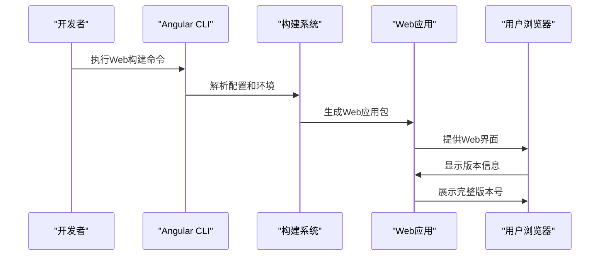
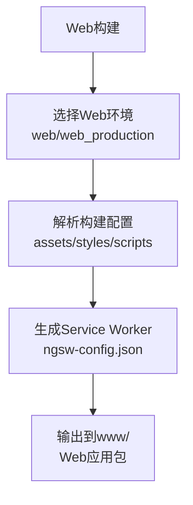
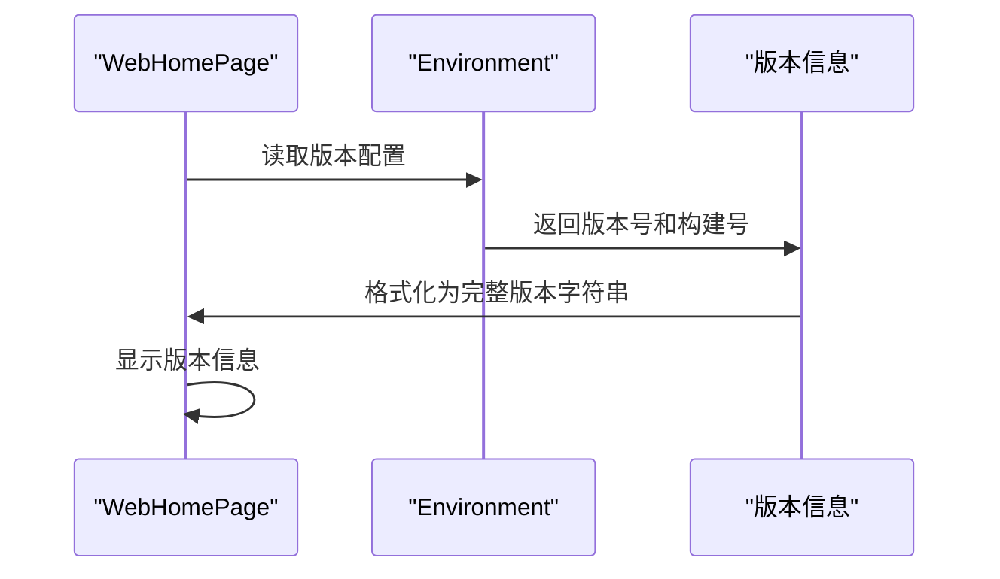
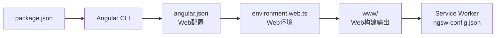

# Web/PWA部署

<cite>
**本文档引用的文件**
- [angular.json](file://angular.json)
- [package.json](file://package.json)
- [ngsw-config.json](file://ngsw-config.json)
- [Dockerfile](file://Dockerfile)
- [capacitor.config.ts](file://capacitor.config.ts)
- [ionic.config.json](file://ionic.config.json)
- [src/environments/environment.web.prod.ts](file://src/environments/environment.web.prod.ts)
- [src/environments/environment.web.ts](file://src/environments/environment.web.ts)
- [src/environments/environment.prod.ts](file://src/environments/environment.prod.ts)
- [src/environments/environment.ts](file://src/environments/environment.ts)
- [src/app/services/diagnostic/diagnostic.service.ts](file://src/app/services/diagnostic/diagnostic.service.ts)
- [src/app/pages/web-home/web-home.page.ts](file://src/app/pages/web-home/web-home.page.ts)
- [src/app/pages/web-home/web-home.page.html](file://src/app/pages/web-home/web-home.page.html)
- [src/app/pages/web-home/web-home.page.scss](file://src/app/pages/web-home/web-home.page.scss)
- [src/assets/i18n/en.json](file://src/assets/i18n/en.json)
- [src/assets/i18n/zh.json](file://src/assets/i18n/zh.json)
</cite>

## 更新摘要
**所做更改**
- 新增Web界面版本信息显示功能：诊断服务返回格式化的版本字符串
- 更新Web主页组件：显示完整的版本信息和客户端ID
- 新增Web环境配置：支持独立的Web版本构建配置
- 更新版本号显示格式：统一为"版本号（构建号）"格式
- 新增Web特定的构建配置和部署选项

## 目录
1. [简介](#简介)
2. [项目结构](#项目结构)
3. [核心组件](#核心组件)
4. [架构概览](#架构概览)
5. [详细组件分析](#详细组件分析)
6. [Web版本信息显示](#web版本信息显示)
7. [依赖关系分析](#依赖关系分析)
8. [性能考虑](#性能考虑)
9. [故障排除指南](#故障排除指南)
10. [结论](#结论)
11. [附录](#附录)

## 简介
本指南详细介绍Web和PWA平台部署的完整解决方案。项目现已支持Web版本部署，通过Angular CLI实现生产级构建，配合PWA配置和Service Worker实现离线功能。诊断服务提供统一的版本信息获取，Web主页显示完整的版本号和客户端ID，确保用户能够清楚识别应用版本。

本项目采用Angular + Capacitor架构，支持多平台部署，包括Web、Android和iOS平台。Web版本通过独立的构建配置实现，与原生应用共享核心功能。

## 项目结构
项目结构现已扩展以支持Web版本部署，主要包括以下关键组件：

- **构建配置**：angular.json定义多环境构建配置，包括Web和原生应用
- **环境配置**：environment.web.ts和environment.web.prod.ts专为Web版本设计
- **Web组件**：WebHomePage提供浏览器端连接功能
- **诊断服务**：统一版本信息获取和平台检测
- **PWA配置**：ngsw-config.json实现Service Worker和缓存策略
- **容器化**：Dockerfile支持Web应用的Docker部署

**图表来源**
- [angular.json:13-120](file://angular.json#L13-L120)
- [src/environments/environment.web.ts:1-12](file://src/environments/environment.web.ts#L1-12)
- [src/app/services/diagnostic/diagnostic.service.ts:20-28](file://src/app/services/diagnostic/diagnostic.service.ts#L20-L28)
- [src/app/pages/web-home/web-home.page.ts:42-50](file://src/app/pages/web-home/web-home.page.ts#L42-L50)

**章节来源**
- [angular.json:1-204](file://angular.json#L1-L204)
- [package.json:1-93](file://package.json#L1-L93)
- [src/environments/environment.web.ts:1-12](file://src/environments/environment.web.ts#L1-L12)
- [src/environments/environment.web.prod.ts:1-12](file://src/environments/environment.web.prod.ts#L1-L12)

## 核心组件
项目的核心组件现已扩展以支持Web版本部署：

- **Angular CLI构建配置**：定义Web和原生应用的构建目标，支持多环境配置
- **Web环境配置**：environment.web.ts和environment.web.prod.ts提供Web版本专用配置
- **诊断服务**：DiagnosticService统一处理版本信息获取和平台检测
- **Web主页组件**：WebHomePage提供浏览器端连接和版本信息显示
- **PWA配置**：ngsw-config.json实现Service Worker和缓存策略
- **Docker容器化**：支持Web应用的Docker部署和容器化部署

**章节来源**
- [angular.json:47-120](file://angular.json#L47-L120)
- [src/app/services/diagnostic/diagnostic.service.ts:1-92](file://src/app/services/diagnostic/diagnostic.service.ts#L1-L92)
- [src/app/pages/web-home/web-home.page.ts:1-120](file://src/app/pages/web-home/web-home.page.ts#L1-L120)

## 架构概览
下图展示Web版本部署的关键流程：构建、配置、部署和运行时交互。

**图表来源**
- [angular.json:122-139](file://angular.json#L122-L139)
- [src/app/pages/web-home/web-home.page.ts:42-50](file://src/app/pages/web-home/web-home.page.ts#L42-L50)

## 详细组件分析

### Web构建配置
Web构建配置现已支持独立的Web版本构建：

- **输出目录**：www目录作为Web应用的构建输出
- **环境配置**：web和web_production两个专用配置
- **资源处理**：支持SVG图标、样式文件和manifest.webmanifest
- **Service Worker**：启用PWA功能，支持离线访问
- **代码分割**：默认生产配置启用outputHashing=all

**图表来源**
- [angular.json:47-86](file://angular.json#L47-L86)

**章节来源**
- [angular.json:13-120](file://angular.json#L13-L120)
- [package.json:7-14](file://package.json#L7-L14)

### Web环境配置
Web环境配置提供独立的Web版本设置：

- **开发环境**：environment.web.ts配置webVersion=true
- **生产环境**：environment.web.prod.ts配置webVersion=true
- **版本信息**：同步Android版本号和构建号
- **基础配置**：继承基础环境配置，添加web特有设置

**章节来源**
- [src/environments/environment.web.ts:1-12](file://src/environments/environment.web.ts#L1-L12)
- [src/environments/environment.web.prod.ts:1-12](file://src/environments/environment.web.prod.ts#L1-L12)

### 诊断服务增强
诊断服务现已支持Web版本的版本信息获取：

- **版本格式化**：Web平台返回"v版本号（构建号）"格式
- **平台检测**：区分iOS、Android和Web平台
- **版本前缀**：iOS=i，Android=a，Web=pwa
- **同步机制**：与Android build.gradle版本同步

**章节来源**
- [src/app/services/diagnostic/diagnostic.service.ts:20-28](file://src/app/services/diagnostic/diagnostic.service.ts#L20-L28)

### Web主页组件
Web主页组件提供完整的版本信息显示：

- **版本显示**：在页面底部显示完整版本信息
- **客户端ID**：同时显示客户端唯一标识符
- **连接状态**：处理连接丢失和重连逻辑
- **WebSocket连接**：支持同源和跨源服务器连接

**章节来源**
- [src/app/pages/web-home/web-home.page.ts:19-50](file://src/app/pages/web-home/web-home.page.ts#L19-L50)
- [src/app/pages/web-home/web-home.page.html:14-18](file://src/app/pages/web-home/web-home.page.html#L14-L18)

## Web版本信息显示
Web版本信息显示功能是本次更新的核心改进：

### 版本信息格式
Web版本现在显示完整的版本信息格式：
- **格式**：`v版本号（构建号）`
- **示例**：`v3.0.0（1）`
- **来源**：environment.version和environment.versionCode

### 版本获取机制
版本信息通过以下方式获取和显示：

1. **初始化获取**：组件初始化时获取版本信息
2. **环境变量**：从environment.web.ts获取版本配置
3. **格式化显示**：统一格式化为完整版本字符串
4. **实时更新**：支持版本号同步更新

**图表来源**
- [src/app/pages/web-home/web-home.page.ts:42-50](file://src/app/pages/web-home/web-home.page.ts#L42-L50)
- [src/environments/environment.web.ts:8-12](file://src/environments/environment.web.ts#L8-L12)

**章节来源**
- [src/app/pages/web-home/web-home.page.ts:21-25](file://src/app/pages/web-home/web-home.page.ts#L21-L25)
- [src/app/pages/web-home/web-home.page.html:16](file://src/app/pages/web-home/web-home.page.html#L16)

## 依赖关系分析
Web版本部署的依赖关系现已扩展：

- **构建链路**：package.json scripts驱动Angular CLI构建
- **配置链路**：angular.json定义Web和原生应用配置
- **环境链路**：environment.web.ts替换基础环境配置
- **运行时链路**：Web主页组件使用诊断服务获取版本信息

**图表来源**
- [package.json:7-14](file://package.json#L7-L14)
- [angular.json:47-86](file://angular.json#L47-L86)

**章节来源**
- [package.json:1-93](file://package.json#L1-L93)
- [angular.json:1-204](file://angular.json#L1-L204)

## 性能考虑
Web版本部署的性能优化策略：

- **代码分割**：启用路由级懒加载和按需模块加载
- **资源优化**：使用outputHashing=all实现缓存优化
- **PWA缓存**：Service Worker实现离线访问和缓存策略
- **构建预算**：angular.json中的budgets配置控制包大小
- **CDN支持**：支持CDN分发和静态资源优化

## 故障排除指南
Web版本部署的常见问题和解决方案：

- **版本信息不显示**
  - 检查environment.web.ts中的版本配置
  - 确认Web环境配置正确加载
  - 验证版本号格式是否符合预期

- **Service Worker问题**
  - 清除浏览器缓存和Service Worker注册
  - 检查ngsw-config.json配置
  - 验证manifest.webmanifest文件

- **构建失败**
  - 确认Web环境配置文件存在
  - 检查angular.json中的Web配置
  - 验证Node.js和npm版本兼容性

**章节来源**
- [src/app/pages/web-home/web-home.page.ts:42-50](file://src/app/pages/web-home/web-home.page.ts#L42-L50)
- [angular.json:47-86](file://angular.json#L47-L86)

## 结论
Web/PWA部署指南现已完善，支持完整的Web版本部署流程。通过诊断服务的版本信息获取、Web主页的版本显示功能，以及完善的PWA配置，项目实现了跨平台的一致用户体验。Web版本不仅提供了与原生应用相同的功能，还具备了现代Web应用的特性，如离线访问、推送通知等。

## 附录
Web部署关键配置速览：

- **构建配置**：angular.json（多环境配置、Service Worker）
- **Web环境**：environment.web.ts（Web版本配置）
- **诊断服务**：DiagnosticService（版本信息获取）
- **Web组件**：WebHomePage（版本显示和连接功能）
- **PWA配置**：ngsw-config.json（Service Worker和缓存策略）
- **容器化**：Dockerfile（Web应用部署）
- **项目配置**：ionic.config.json（项目类型和集成）