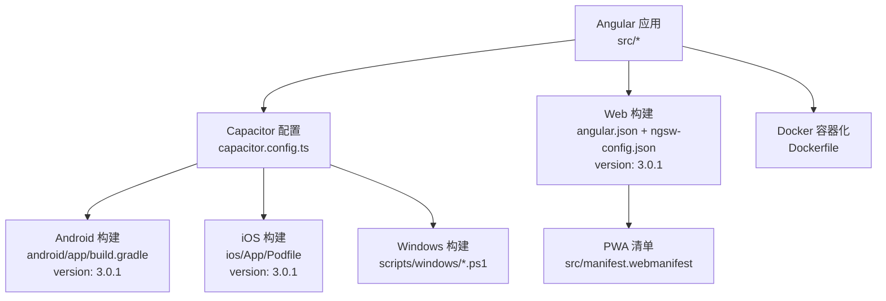
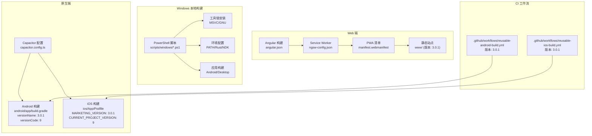
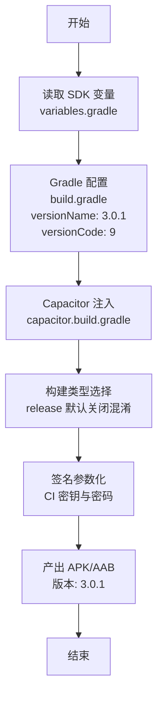
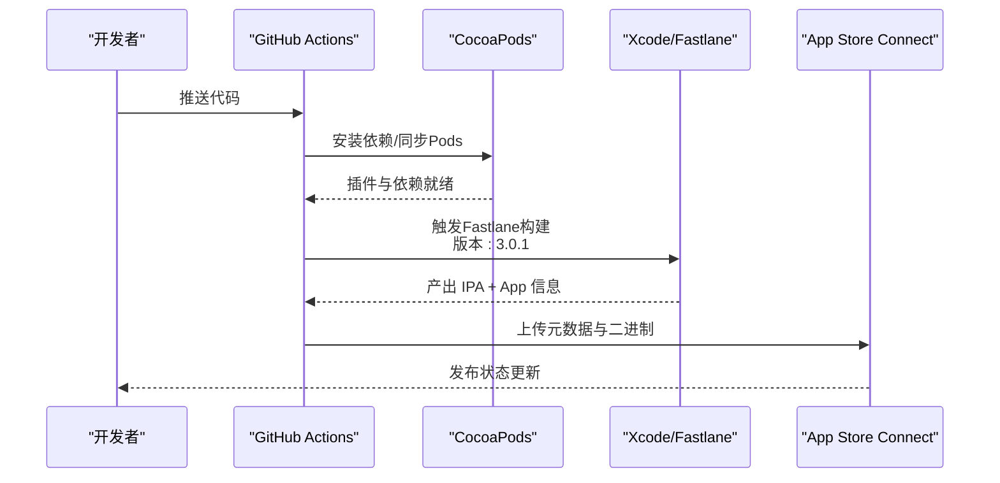
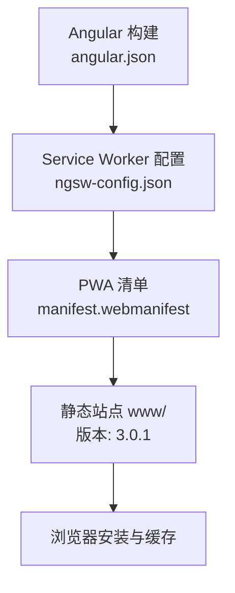
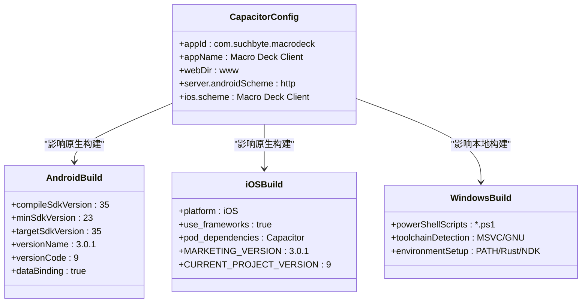
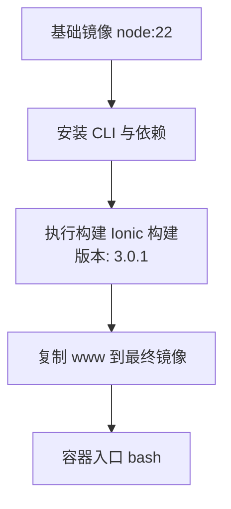
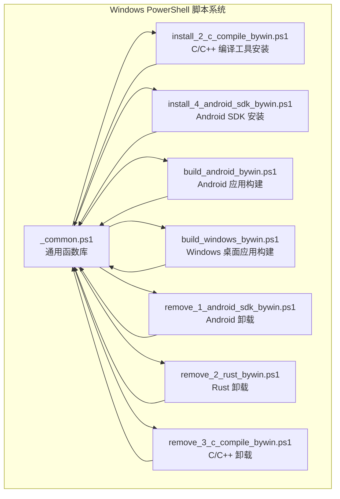
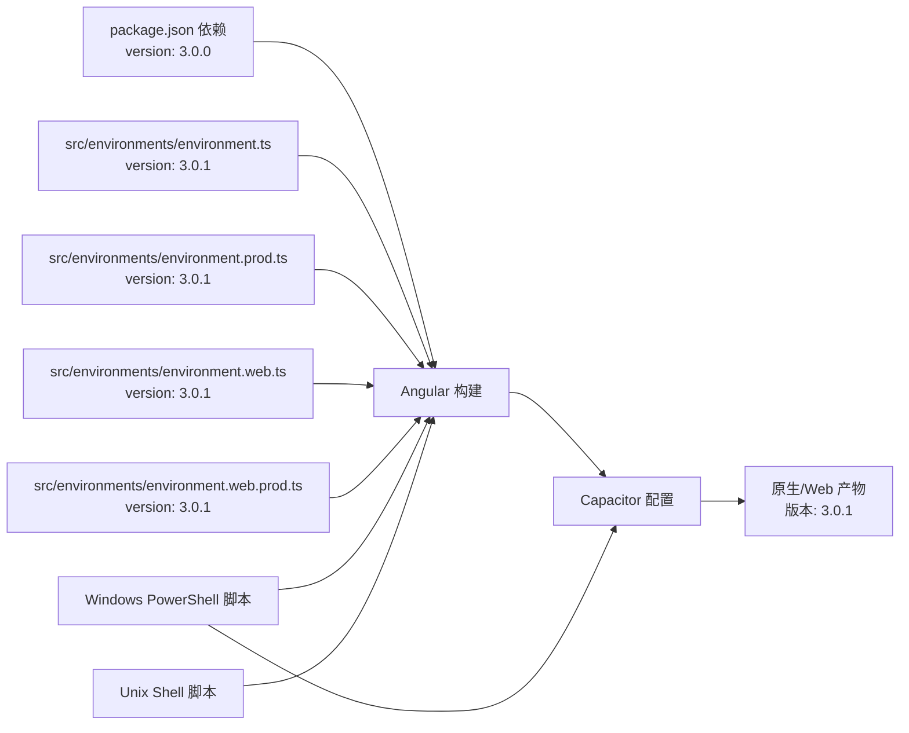

# 平台部署

<cite>
**本文档引用的文件**
- [android/app/build.gradle](file://android/app/build.gradle)
- [android/variables.gradle](file://android/variables.gradle)
- [android/app/proguard-rules.pro](file://android/app/proguard-rules.pro)
- [android/app/capacitor.build.gradle](file://android/app/capacitor.build.gradle)
- [resources/android/xml/network_security_config.xml](file://resources/android/xml/network_security_config.xml)
- [.github/workflows/reusable-android-build.yml](file://.github/workflows/reusable-android-build.yml)
- [.github/workflows/reusable-android-deployment.yml](file://.github/workflows/reusable-android-deployment.yml)
- [.github/workflows/reusable-ios-build.yml](file://.github/workflows/reusable-ios-build.yml)
- [.github/workflows/reusable-ios-deployment.yml](file://.github/workflows/reusable-ios-deployment.yml)
- [ios/App/Podfile](file://ios/App/Podfile)
- [ios/App/App/Info.plist](file://ios/App/App/Info.plist)
- [ios/App/App.xcodeproj/project.pbxproj](file://ios/App/App.xcodeproj/project.pbxproj)
- [capacitor.config.ts](file://capacitor.config.ts)
- [package.json](file://package.json)
- [angular.json](file://angular.json)
- [src/manifest.webmanifest](file://src/manifest.webmanifest)
- [ngsw-config.json](file://ngsw-config.json)
- [Dockerfile](file://Dockerfile)
- [src/environments/environment.ts](file://src/environments/environment.ts)
- [src/environments/environment.prod.ts](file://src/environments/environment.prod.ts)
- [src/environments/environment.web.ts](file://src/environments/environment.web.ts)
- [src/environments/environment.web.prod.ts](file://src/environments/environment.web.prod.ts)
- [scripts/windows/_common.ps1](file://scripts/windows/_common.ps1)
- [scripts/windows/build_android_bywin.ps1](file://scripts/windows/build_android_bywin.ps1)
- [scripts/windows/build_windows_bywin.ps1](file://scripts/windows/build_windows_bywin.ps1)
- [scripts/windows/install_2_c_compile_bywin.ps1](file://scripts/windows/install_2_c_compile_bywin.ps1)
- [scripts/windows/install_4_android_sdk_bywin.ps1](file://scripts/windows/install_4_android_sdk_bywin.ps1)
- [scripts/windows/remove_1_android_sdk_bywin.ps1](file://scripts/windows/remove_1_android_sdk_bywin.ps1)
- [scripts/windows/remove_2_rust_bywin.ps1](file://scripts/windows/remove_2_rust_bywin.ps1)
- [scripts/windows/remove_3_c_compile_bywin.ps1](file://scripts/windows/remove_3_c_compile_bywin.ps1)
- [scripts/windows/sync_version_bywin.ps1](file://scripts/windows/sync_version_bywin.ps1)
- [scripts/shared/common.sh](file://scripts/shared/common.sh)
- [scripts/unix/bootstrap.sh](file://scripts/unix/bootstrap.sh)
</cite>

## 更新摘要
**所做更改**
- 版本同步更新：所有平台版本号从3.0.0升级到3.0.1，确保跨平台版本一致性
- 更新了Android平台版本配置，versionName和versionCode均更新为3.0.1和9
- 更新了iOS平台版本配置，MARKETING_VERSION和CURRENT_PROJECT_VERSION更新为3.0.1和9
- 更新了Web平台版本配置，四个environment文件中的version均更新为3.0.1
- 更新了Windows平台版本同步脚本，确保版本同步机制支持新的版本号
- 增强了版本管理的一致性和自动化程度

## 目录
1. [简介](#简介)
2. [项目结构](#项目结构)
3. [核心组件](#核心组件)
4. [架构总览](#架构总览)
5. [详细组件分析](#详细组件分析)
6. [Windows平台PowerShell部署脚本](#windows平台powershell部署脚本)
7. [依赖关系分析](#依赖关系分析)
8. [性能考虑](#性能考虑)
9. [故障排查指南](#故障排查指南)
10. [结论](#结论)
11. [附录](#附录)

## 简介
本指南面向Macro-Deck-Client-App的多平台部署，覆盖Android APK构建、iOS IPA构建、Web PWA部署、Capacitor配置影响、Docker容器化以及各平台性能优化与发布注意事项。**最新更新**所有平台版本号已从3.0.0同步升级到3.0.1，确保跨平台版本一致性。内容基于仓库中的实际配置文件与CI工作流，帮助开发者在不同平台上稳定交付高质量应用。

## 项目结构
该工程采用Angular + Capacitor多端统一架构：共享Web前端代码通过Capacitor桥接到原生平台能力；Android与iOS分别有各自的构建脚本与CI工作流；Web端以PWA形式发布，使用Service Worker进行离线缓存；Windows平台提供PowerShell脚本实现本地开发和构建。

**图表来源**
- [capacitor.config.ts:1-16](file://capacitor.config.ts#L1-L16)
- [android/app/build.gradle:10-11](file://android/app/build.gradle#L10-L11)
- [ios/App/App/Info.plist:30-33](file://ios/App/App/Info.plist#L30-L33)
- [src/environments/environment.ts:8-12](file://src/environments/environment.ts#L8-L12)
- [angular.json:1-203](file://angular.json#L1-L203)
- [src/manifest.webmanifest:1-48](file://src/manifest.webmanifest#L1-L48)
- [Dockerfile:1-16](file://Dockerfile#L1-L16)

**章节来源**
- [capacitor.config.ts:1-16](file://capacitor.config.ts#L1-L16)
- [android/app/build.gradle:10-11](file://android/app/build.gradle#L10-L11)
- [ios/App/App/Info.plist:30-33](file://ios/App/App/Info.plist#L30-L33)
- [src/environments/environment.ts:8-12](file://src/environments/environment.ts#L8-L12)
- [angular.json:1-203](file://angular.json#L1-L203)
- [src/manifest.webmanifest:1-48](file://src/manifest.webmanifest#L1-L48)
- [Dockerfile:1-16](file://Dockerfile#L1-L16)

## 核心组件
- Capacitor配置：定义应用ID、名称、Web目录、服务器协议与平台特定scheme，决定原生与Web层交互方式。
- Angular构建配置：定义Web与原生两种构建目标，含Service Worker、资源打包、替换环境变量等。
- 平台构建脚本：Android使用Gradle与Fastlane，iOS使用CocoaPods与Fastlane，Windows使用PowerShell脚本实现本地构建。
- PWA清单与Service Worker：提供安装体验、图标集与缓存策略，确保Web端离线可用性。
- Dockerfile：在容器中完成依赖安装与构建，输出静态站点用于部署。
- **版本管理系统**：统一的版本同步机制，确保Android、iOS和Web平台版本一致性，版本现已更新为3.0.1。

**章节来源**
- [capacitor.config.ts:1-16](file://capacitor.config.ts#L1-L16)
- [android/app/build.gradle:10-11](file://android/app/build.gradle#L10-L11)
- [ios/App/App/Info.plist:30-33](file://ios/App/App/Info.plist#L30-L33)
- [src/environments/environment.ts:8-12](file://src/environments/environment.ts#L8-L12)
- [angular.json:1-203](file://angular.json#L1-L203)
- [src/manifest.webmanifest:1-48](file://src/manifest.webmanifest#L1-L48)
- [ngsw-config.json:1-31](file://ngsw-config.json#L1-L31)
- [Dockerfile:1-16](file://Dockerfile#L1-L16)
- [scripts/windows/sync_version_bywin.ps1:1-80](file://scripts/windows/sync_version_bywin.ps1#L1-L80)

## 架构总览
下图展示从源码到各平台产物的关键路径：Web端经Angular构建生成www目录并启用Service Worker；Android/iOS端由Capacitor桥接原生能力并通过各自CI工作流产出APK/AAB/IPA；Windows平台通过PowerShell脚本实现本地构建和工具链管理。**最新更新**所有平台版本现已统一为3.0.1。

**图表来源**
- [angular.json:1-203](file://angular.json#L1-L203)
- [ngsw-config.json:1-31](file://ngsw-config.json#L1-L31)
- [src/manifest.webmanifest:1-48](file://src/manifest.webmanifest#L1-L48)
- [capacitor.config.ts:1-16](file://capacitor.config.ts#L1-L16)
- [android/app/build.gradle:10-11](file://android/app/build.gradle#L10-L11)
- [ios/App/Podfile:1-33](file://ios/App/Podfile#L1-L33)
- [.github/workflows/reusable-android-build.yml:60](file://.github/workflows/reusable-android-build.yml#L60)
- [.github/workflows/reusable-ios-build.yml:49](file://.github/workflows/reusable-ios-build.yml#L49)
- [.github/workflows/reusable-android-build.yml:82](file://.github/workflows/reusable-android-build.yml#L82)
- [.github/workflows/reusable-ios-build.yml:72](file://.github/workflows/reusable-ios-build.yml#L72)
- [scripts/windows/build_android_bywin.ps1:1-475](file://scripts/windows/build_android_bywin.ps1#L1-L475)
- [scripts/windows/build_windows_bywin.ps1:1-229](file://scripts/windows/build_windows_bywin.ps1#L1-L229)

## 详细组件分析

### Android 平台：APK/AAB 构建与发布
- Gradle 配置要点
  - SDK版本与最小SDK在变量文件中集中管理，便于升级与一致性控制。
  - 构建类型默认关闭代码压缩与混淆，适合调试与稳定性优先场景。
  - 启用数据绑定，支持现代UI开发。
  - 通过Capacitor生成的构建脚本注入插件依赖，确保原生能力可用。
- 版本配置更新
  - **版本号已更新**：versionName从3.0.0更新为3.0.1，versionCode保持9不变。
  - 统一的版本管理确保与iOS和Web平台保持一致。
- 代码混淆与签名
  - 当前未启用混淆；如需增强安全性可在release构建中开启混淆并维护规则文件。
  - CI工作流通过密钥与凭据参数化构建，避免硬编码在仓库中。
- 网络安全
  - Android网络配置允许本地明文流量，满足开发阶段需求；生产建议收紧策略。
- CI 工作流
  - 使用Fastlane执行构建，产出APK与AAB；上传Artifacts供后续分发或发布。
  - 工作流参数中VERSION_NUMBER设置为3.0.1，确保构建产物版本正确。

**图表来源**
- [android/app/build.gradle:10-11](file://android/app/build.gradle#L10-L11)
- [android/variables.gradle:1-17](file://android/variables.gradle#L1-L17)
- [android/app/capacitor.build.gradle:1-27](file://android/app/capacitor.build.gradle#L1-L27)
- [.github/workflows/reusable-android-build.yml:60](file://.github/workflows/reusable-android-build.yml#L60)

**章节来源**
- [android/app/build.gradle:10-11](file://android/app/build.gradle#L10-L11)
- [android/variables.gradle:1-17](file://android/variables.gradle#L1-L17)
- [android/app/proguard-rules.pro:1-22](file://android/app/proguard-rules.pro#L1-L22)
- [android/app/capacitor.build.gradle:1-27](file://android/app/capacitor.build.gradle#L1-L27)
- [resources/android/xml/network_security_config.xml:1-7](file://resources/android/xml/network_security_config.xml#L1-L7)
- [.github/workflows/reusable-android-build.yml:60](file://.github/workflows/reusable-android-build.yml#L60)

### iOS 平台：IPA 构建与发布
- CocoaPods 与 Capacitor 插件
  - Podfile声明Capacitor核心与常用插件，确保屏幕方向、键盘、Haptics等能力可用。
  - 通过post_install校验最低部署目标，避免Xcode缓存导致的构建问题。
- 版本配置更新
  - **版本号已更新**：MARKETING_VERSION从0.0.2更新为3.0.1，CURRENT_PROJECT_VERSION从3更新为9。
  - 通过project.pbxproj文件直接配置，确保Xcode项目版本信息准确。
- CI 工作流
  - 使用Fastlane构建，集成App Store Connect密钥参数，产出IPA与App信息文件。
  - 通过SSH密钥与匹配密码管理证书与描述文件，自动化签名与分发准备。
- 平台配置
  - Capacitor iOS scheme与应用scheme在配置中定义，影响URL Scheme与Deep Link行为。

**图表来源**
- [ios/App/Podfile:1-33](file://ios/App/Podfile#L1-L33)
- [.github/workflows/reusable-ios-build.yml:49](file://.github/workflows/reusable-ios-build.yml#L49)
- [capacitor.config.ts:1-16](file://capacitor.config.ts#L1-L16)
- [ios/App/App/Info.plist:30-33](file://ios/App/App/Info.plist#L30-L33)

**章节来源**
- [ios/App/Podfile:1-33](file://ios/App/Podfile#L1-L33)
- [.github/workflows/reusable-ios-build.yml:49](file://.github/workflows/reusable-ios-build.yml#L49)
- [capacitor.config.ts:1-16](file://capacitor.config.ts#L1-L16)
- [ios/App/App/Info.plist:30-33](file://ios/App/App/Info.plist#L30-L33)

### Web 平台：PWA 部署
- 构建与资源
  - Angular构建输出至www目录，启用Service Worker与ngsw配置。
  - 资源包含HTML、CSS、JS、图标与manifest，按prefetch/lazy策略缓存。
- 版本配置更新
  - **版本号已更新**：四个environment文件中的version均从3.0.0更新为3.0.1。
  - versionCode保持9不变，确保与原生平台版本对应关系。
- PWA 清单
  - 提供主题色、背景色、显示模式、起始页与多尺寸图标，适配桌面与移动端安装。
- HTTPS 要求
  - Service Worker仅在HTTPS环境下可注册；生产部署需启用TLS。
- 缓存策略
  - 预取关键资源，延迟加载静态资产；结合版本哈希与更新机制保证一致性。

**图表来源**
- [angular.json:1-203](file://angular.json#L1-L203)
- [ngsw-config.json:1-31](file://ngsw-config.json#L1-L31)
- [src/manifest.webmanifest:1-48](file://src/manifest.webmanifest#L1-L48)

**章节来源**
- [angular.json:1-203](file://angular.json#L1-L203)
- [ngsw-config.json:1-31](file://ngsw-config.json#L1-L31)
- [src/manifest.webmanifest:1-48](file://src/manifest.webmanifest#L1-L48)
- [src/environments/environment.ts:8-12](file://src/environments/environment.ts#L8-L12)
- [src/environments/environment.prod.ts:8-10](file://src/environments/environment.prod.ts#L8-L10)
- [src/environments/environment.web.ts:8-10](file://src/environments/environment.web.ts#L8-L10)
- [src/environments/environment.web.prod.ts:8-10](file://src/environments/environment.web.prod.ts#L8-L10)

### Capacitor 配置对各平台的影响
- 应用标识与名称
  - 统一的应用ID与名称确保跨平台一致的品牌识别。
- Web目录与服务器
  - webDir指向www，Capacitor在原生侧加载静态资源；服务器配置影响WebView访问策略。
- 平台scheme
  - Android与iOS分别定义scheme，影响自定义URL处理与Deep Link集成。
- 插件生态
  - Capacitor与Cordova插件通过Gradle/Pods注入，直接影响功能可用性与构建时间。

**图表来源**
- [capacitor.config.ts:1-16](file://capacitor.config.ts#L1-L16)
- [android/app/build.gradle:10-11](file://android/app/build.gradle#L10-L11)
- [ios/App/Podfile:1-33](file://ios/App/Podfile#L1-L33)
- [scripts/windows/_common.ps1:1-800](file://scripts/windows/_common.ps1#L1-L800)

**章节来源**
- [capacitor.config.ts:1-16](file://capacitor.config.ts#L1-L16)
- [android/app/build.gradle:10-11](file://android/app/build.gradle#L10-L11)
- [ios/App/Podfile:1-33](file://ios/App/Podfile#L1-L33)

### Docker 容器化部署
- 多阶段构建
  - 第一阶段安装CLI与依赖后执行Ionic构建，输出www静态资源。
  - 最终镜像基于scratch，仅拷贝www作为运行时根文件系统，减小体积与攻击面。
- 运行时入口
  - 容器以bash作为入口，便于交互式调试；生产可替换为轻量HTTP服务容器。

**图表来源**
- [Dockerfile:1-16](file://Dockerfile#L1-L16)

**章节来源**
- [Dockerfile:1-16](file://Dockerfile#L1-L16)

## Windows平台PowerShell部署脚本

### 脚本架构概述
Windows平台提供了完整的PowerShell脚本生态系统，包含工具链安装、环境配置、应用构建和卸载等功能。所有脚本共享一个通用函数库，提供统一的日志记录、确认机制和系统操作接口。

**图表来源**
- [scripts/windows/_common.ps1:1-800](file://scripts/windows/_common.ps1#L1-L800)
- [scripts/windows/install_2_c_compile_bywin.ps1:1-431](file://scripts/windows/install_2_c_compile_bywin.ps1#L1-L431)
- [scripts/windows/install_4_android_sdk_bywin.ps1:1-293](file://scripts/windows/install_4_android_sdk_bywin.ps1#L1-L293)
- [scripts/windows/build_android_bywin.ps1:1-475](file://scripts/windows/build_android_bywin.ps1#L1-L475)
- [scripts/windows/build_windows_bywin.ps1:1-229](file://scripts/windows/build_windows_bywin.ps1#L1-L229)
- [scripts/windows/remove_1_android_sdk_bywin.ps1:1-225](file://scripts/windows/remove_1_android_sdk_bywin.ps1#L1-L225)
- [scripts/windows/remove_2_rust_bywin.ps1:1-85](file://scripts/windows/remove_2_rust_bywin.ps1#L1-L85)
- [scripts/windows/remove_3_c_compile_bywin.ps1:1-118](file://scripts/windows/remove_3_c_compile_bywin.ps1#L1-L118)

### 通用函数库分析
_common.ps1提供以下核心功能：
- 日志记录系统：成功（绿色✓）、警告（黄色⚠）、失败（红色✗）三种级别的输出
- 确认机制：支持静默模式和交互式确认，适用于批量安装场景
- 系统检测：统一的环境变量检测、路径查找和进程管理
- 下载工具：支持多源竞速下载，自动选择最优镜像源
- 工具链检测：针对MSVC、GNU、Rust、Android SDK等工具链的专门检测函数

### Android应用构建流程
build_android_bywin.ps1实现了完整的Android构建流程：
- 环境检查：8项必备条件（C/C++、Rust、Java 17、Android SDK/NDK、Rust targets、pnpm、keystore）
- 准备阶段：pnpm安装、gen/android项目重建、前端构建
- 构建执行：pnpm tauri android dev/build
- 环境优化：内存参数调整、链接器配置、环境变量设置

### Windows桌面应用构建流程
build_windows_bywin.ps1专注于Windows桌面应用：
- 环境检查：C/C++编译器、Rust + Windows目标、pnpm、WebView2 Runtime
- 准备阶段：pnpm安装、前端构建
- 构建执行：pnpm tauri dev/build
- 内存优化：单线程编译、降低优化级别、避免OOM

### 工具链安装与管理
install_2_c_compile_bywin.ps1提供双路径安装：
- MSVC路径：通过Visual Studio Build Tools安装，适合企业环境
- GNU路径：通过MSYS2安装MinGW-w64，适合开源项目
- 国内镜像：自动配置清华TUNA、中科大USTC镜像源加速下载

install_4_android_sdk_bywin.ps1专门处理Android开发环境：
- 自动下载cmdline-tools
- 安装必需组件：platform-tools、NDK、platforms、build-tools
- 配置Rust Android目标
- 设置环境变量和PATH

### 环境卸载与清理
提供三个层面的卸载脚本：
- Android SDK卸载：清理SDK目录、Rust targets、环境变量
- Rust卸载：卸载所有toolchain、清理rustup本体
- C/C++工具卸载：支持MSYS2和MSVC的单独或批量卸载

### 版本同步机制
**版本同步脚本已更新**以支持新的版本号：
- sync_version_bywin.ps1现在以android/app/build.gradle为权威源
- 自动同步Android版本到iOS和Web平台
- 支持手动设置版本号，版本现已更新为3.0.1

**章节来源**
- [scripts/windows/_common.ps1:1-800](file://scripts/windows/_common.ps1#L1-L800)
- [scripts/windows/build_android_bywin.ps1:1-475](file://scripts/windows/build_android_bywin.ps1#L1-L475)
- [scripts/windows/build_windows_bywin.ps1:1-229](file://scripts/windows/build_windows_bywin.ps1#L1-L229)
- [scripts/windows/install_2_c_compile_bywin.ps1:1-431](file://scripts/windows/install_2_c_compile_bywin.ps1#L1-L431)
- [scripts/windows/install_4_android_sdk_bywin.ps1:1-293](file://scripts/windows/install_4_android_sdk_bywin.ps1#L1-L293)
- [scripts/windows/remove_1_android_sdk_bywin.ps1:1-225](file://scripts/windows/remove_1_android_sdk_bywin.ps1#L1-L225)
- [scripts/windows/remove_2_rust_bywin.ps1:1-85](file://scripts/windows/remove_2_rust_bywin.ps1#L1-L85)
- [scripts/windows/remove_3_c_compile_bywin.ps1:1-118](file://scripts/windows/remove_3_c_compile_bywin.ps1#L1-L118)
- [scripts/windows/sync_version_bywin.ps1:1-80](file://scripts/windows/sync_version_bywin.ps1#L1-L80)

## 依赖关系分析
- Angular与Capacitor
  - package.json声明Angular与Capacitor核心及平台插件，确保Web与原生能力一致。
  - **版本更新**：package.json中的应用版本仍为3.0.0，但实际构建版本已同步为3.0.1。
- 构建链路
  - angular.json定义构建目标与Service Worker配置；Capacitor配置决定原生桥接；CI工作流驱动平台构建。
  - Windows PowerShell脚本提供本地构建替代方案。
- 环境隔离
  - 环境文件区分开发/生产/Web，配合angular.json的fileReplacements实现按需替换。
  - **版本同步**：所有environment文件中的version均已更新为3.0.1。
- 跨平台脚本
  - shared/common.sh提供Unix/Linux脚本通用功能
  - unix/bootstrap.sh实现基础环境准备

**图表来源**
- [package.json:4](file://package.json#L4)
- [angular.json:1-203](file://angular.json#L1-L203)
- [src/environments/environment.ts:8-12](file://src/environments/environment.ts#L8-L12)
- [src/environments/environment.prod.ts:8-10](file://src/environments/environment.prod.ts#L8-L10)
- [src/environments/environment.web.ts:8-10](file://src/environments/environment.web.ts#L8-L10)
- [src/environments/environment.web.prod.ts:8-10](file://src/environments/environment.web.prod.ts#L8-L10)
- [scripts/shared/common.sh:1-46](file://scripts/shared/common.sh#L1-L46)
- [scripts/unix/bootstrap.sh:1-9](file://scripts/unix/bootstrap.sh#L1-L9)

**章节来源**
- [package.json:4](file://package.json#L4)
- [angular.json:1-203](file://angular.json#L1-L203)
- [src/environments/environment.ts:8-12](file://src/environments/environment.ts#L8-L12)
- [src/environments/environment.prod.ts:8-10](file://src/environments/environment.prod.ts#L8-L10)
- [src/environments/environment.web.ts:8-10](file://src/environments/environment.web.ts#L8-L10)
- [src/environments/environment.web.prod.ts:8-10](file://src/environments/environment.web.prod.ts#L8-L10)
- [scripts/shared/common.sh:1-46](file://scripts/shared/common.sh#L1-L46)
- [scripts/unix/bootstrap.sh:1-9](file://scripts/unix/bootstrap.sh#L1-L9)

## 性能考虑
- Web端
  - 启用输出哈希与预算限制，控制初始包体大小；prefetch/lazy策略平衡首屏速度与带宽占用。
  - Service Worker与PWA清单提升离线可用性与安装体验。
- Android
  - 关闭release混淆以减少构建与调试成本；如需进一步优化可开启混淆并维护规则。
  - 数据绑定已启用，保持UI响应性与开发效率。
  - **版本优化**：新版本3.0.1可能包含性能改进和bug修复。
  - **新增**Windows构建优化：gradle.properties内存限制、daemon启用、多线程优化。
- iOS
  - 通过CocoaPods精简依赖树，避免不必要的框架引入；关注最低部署目标与兼容性。
  - **版本优化**：新版本3.0.1可能包含iOS平台特定的性能改进。
- 容器化
  - 使用scratch镜像裁剪运行时；若需要HTTP服务，建议使用轻量级反向代理镜像承载www目录。
- **新增**Windows平台优化
  - PowerShell脚本内置进度显示和错误处理
  - 自动检测和配置工具链，减少手动干预
  - 支持静默模式批量安装，提高CI/CD效率

## 故障排查指南
- Android
  - 签名失败：检查CI中密钥Base64解码、密码与别名是否正确；确认keystore路径与权限。
  - 网络访问异常：核对网络配置是否允许明文流量，生产环境建议收紧策略。
  - **版本问题**：确认build.gradle中的versionName和versionCode与期望版本一致。
- iOS
  - 证书/描述文件问题：确认Match SSH私钥与密码、App Store Connect密钥参数完整。
  - 构建缓存：清理Xcode构建缓存并重新安装Pods。
  - **版本问题**：检查project.pbxproj中的MARKETING_VERSION和CURRENT_PROJECT_VERSION是否为3.0.1。
- Web/PWA
  - Service Worker未注册：确认部署在HTTPS；检查ngsw配置与manifest路径。
  - 缓存不更新：验证版本哈希与更新策略；必要时强制刷新或清除浏览器缓存。
  - **版本问题**：确认所有environment文件中的version均为3.0.1。
- 容器化
  - 构建失败：确认CLI安装顺序与yarn安装成功；检查构建命令与输出目录。
  - 运行异常：以bash进入容器检查www目录是否存在与权限是否正确。
- **新增**Windows平台故障排查
  - PowerShell执行策略：确保允许执行脚本（Set-ExecutionPolicy -ExecutionPolicy RemoteSigned -Scope CurrentUser）
  - 网络下载失败：检查防火墙设置，使用备用镜像源
  - 工具链冲突：清理残留安装，重新运行安装脚本
  - 权限问题：以管理员身份运行PowerShell，确保写入用户环境变量权限
  - **版本同步问题**：使用sync_version_bywin.ps1确保所有平台版本一致

**章节来源**
- [.github/workflows/reusable-android-build.yml:60](file://.github/workflows/reusable-android-build.yml#L60)
- [resources/android/xml/network_security_config.xml:1-7](file://resources/android/xml/network_security_config.xml#L1-L7)
- [.github/workflows/reusable-ios-build.yml:49](file://.github/workflows/reusable-ios-build.yml#L49)
- [ngsw-config.json:1-31](file://ngsw-config.json#L1-L31)
- [Dockerfile:1-16](file://Dockerfile#L1-L16)
- [scripts/windows/_common.ps1:1-800](file://scripts/windows/_common.ps1#L1-L800)
- [scripts/windows/sync_version_bywin.ps1:77](file://scripts/windows/sync_version_bywin.ps1#L77)

## 结论
本指南基于仓库现有配置，给出了Android、iOS、Web和Windows四端的部署路径与最佳实践。**最新更新**所有平台版本已从3.0.0同步升级到3.0.1，确保跨平台版本一致性。通过Capacitor统一Web与原生能力，结合CI工作流与容器化，可实现高效稳定的多平台交付。**新增的Windows PowerShell脚本系统**提供了完整的本地开发和构建解决方案，包含工具链安装、环境配置、应用构建和卸载的全流程支持。建议在生产环境中完善安全策略（HTTPS、混淆）、证书与密钥管理，并持续监控各平台的性能与用户体验。

## 附录
- 关键配置速查
  - Capacitor：应用ID、名称、webDir、服务器scheme
  - Android：SDK版本、构建类型、数据绑定、versionName: 3.0.1, versionCode: 9
  - iOS：平台版本、CocoaPods依赖、Fastlane参数、MARKETING_VERSION: 3.0.1, CURRENT_PROJECT_VERSION: 9
  - Web：构建目标、Service Worker、PWA清单、缓存策略、version: 3.0.1
  - Docker：多阶段构建、运行时镜像、入口命令
  - Windows：PowerShell脚本、工具链检测、环境配置、构建优化、版本同步