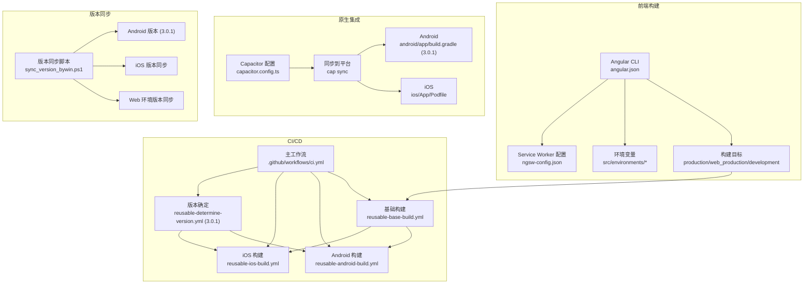
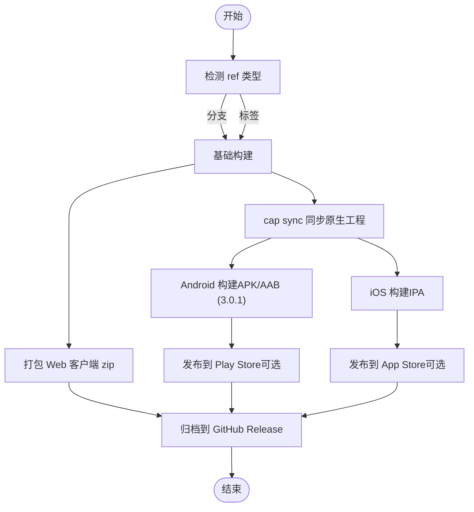
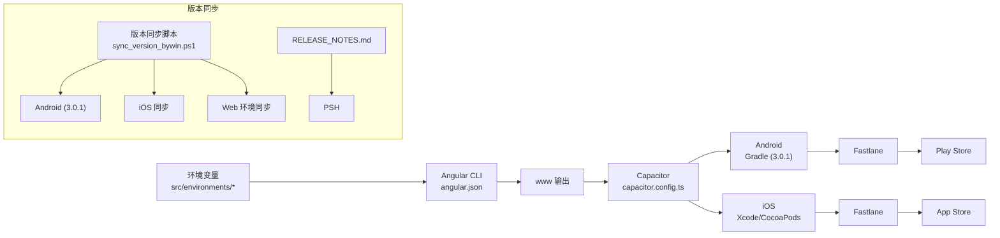

# 构建与部署

<cite>
**本文引用的文件**
- [package.json](file://package.json)
- [angular.json](file://angular.json)
- [capacitor.config.ts](file://capacitor.config.ts)
- [ionic.config.json](file://ionic.config.json)
- [ngsw-config.json](file://ngsw-config.json)
- [environment.ts](file://src/environments/environment.ts)
- [environment.prod.ts](file://src/environments/environment.prod.ts)
- [environment.web.ts](file://src/environments/environment.web.ts)
- [environment.web.prod.ts](file://src/environments/environment.web.prod.ts)
- [ci.yml](file://.github/workflows/ci.yml)
- [reusable-base-build.yml](file://.github/workflows/reusable-base-build.yml)
- [reusable-android-build.yml](file://.github/workflows/reusable-android-build.yml)
- [reusable-ios-build.yml](file://.github/workflows/reusable-ios-build.yml)
- [reusable-determine-version.yml](file://.github/workflows/reusable-determine-version.yml)
- [build.gradle](file://android/app/build.gradle)
- [Podfile](file://ios/App/Podfile)
- [build_android_bywin.ps1](file://scripts/windows/build_android_bywin.ps1)
- [RELEASE_NOTES.md](file://RELEASE_NOTES.md)
- [_common.ps1](file://scripts/windows/_common.ps1)
- [build_web_bywin.ps1](file://scripts/windows/build_web_bywin.ps1)
- [install_1_base_tools_bywin.ps1](file://scripts/windows/install_1_base_tools_bywin.ps1)
- [install_2_ruby_bywin.ps1](file://scripts/windows/install_2_ruby_bywin.ps1)
- [install_3_fastlane_bywin.ps1](file://scripts/windows/install_3_fastlane_bywin.ps1)
- [build_android_bymac.sh](file://scripts/macos/build_android_bymac.sh)
- [sync_version_bywin.ps1](file://scripts/windows/sync_version_bywin.ps1)
</cite>

## 更新摘要
**变更内容**
- 版本从3.0.0升级到3.0.1，更新Android版本号至3.0.1
- CI/CD流程中的版本确定逻辑已更新以支持3.0.1版本
- 保持原有构建与部署流程不变，主要为版本信息同步更新
- PowerShell脚本中的版本信息已同步到3.0.1

## 目录
1. [简介](#简介)
2. [项目结构](#项目结构)
3. [核心组件](#核心组件)
4. [架构总览](#架构总览)
5. [详细组件分析](#详细组件分析)
6. [依赖关系分析](#依赖关系分析)
7. [性能考虑](#性能考虑)
8. [故障排除指南](#故障排除指南)
9. [结论](#结论)
10. [附录](#附录)

## 简介
本指南面向开发者，系统性讲解 Macro-Deck-Client-App 的构建与部署流程，覆盖以下主题：
- Angular CLI 配置与多环境变量管理
- 资源打包与 Service Worker 缓存策略
- CI/CD 流水线（GitHub Actions 工作流）
- 多平台部署策略（Android APK/AAB、iOS IPA、Web 应用）
- 版本管理、代码签名与发布渠道
- 构建优化（体积预算、代码分割、缓存）与性能调优
- **新增**：版本从3.0.0到3.0.1的升级流程与同步机制
- **新增**：多平台构建工具链（Windows/macOS）
- 常见问题排查与最佳实践

## 项目结构
该工程采用 Capacitor + Ionic + Angular 技术栈，通过 Angular CLI 进行 Web 端构建，再由 Capacitor 同步到原生平台（Android/iOS），并通过 GitHub Actions 实现自动化构建与发布。**新增**版本同步机制确保Android、iOS和Web平台版本一致性。



**图表来源**
- [angular.json:1-204](file://angular.json#L1-L204)
- [capacitor.config.ts:1-16](file://capacitor.config.ts#L1-L16)
- [ngsw-config.json:1-31](file://ngsw-config.json#L1-L31)
- [ci.yml:1-50](file://.github/workflows/ci.yml#L1-L50)
- [reusable-base-build.yml:1-76](file://.github/workflows/reusable-base-build.yml#L1-L76)
- [reusable-android-build.yml:1-82](file://.github/workflows/reusable-android-build.yml#L1-L82)
- [reusable-ios-build.yml:1-72](file://.github/workflows/reusable-ios-build.yml#L1-L72)
- [reusable-determine-version.yml:1-37](file://.github/workflows/reusable-determine-version.yml#L1-L37)
- [build.gradle:1-71](file://android/app/build.gradle#L1-L71)
- [Podfile:1-33](file://ios/App/Podfile#L1-L33)
- [sync_version_bywin.ps1:1-80](file://scripts/windows/sync_version_bywin.ps1#L1-L80)

**章节来源**
- [angular.json:1-204](file://angular.json#L1-L204)
- [capacitor.config.ts:1-16](file://capacitor.config.ts#L1-L16)
- [ionic.config.json:1-10](file://ionic.config.json#L1-L10)
- [ngsw-config.json:1-31](file://ngsw-config.json#L1-L31)
- [ci.yml:1-50](file://.github/workflows/ci.yml#L1-L50)

## 核心组件
- Angular CLI 与构建目标
  - 定义了 production、web_production、web、development、ci 等构建配置，分别用于原生生产、Web 生产、Web 开发、原生开发与 CI 环境。
  - 关键点：输出目录 www、Service Worker 开启、资源资产与样式脚本配置、按需替换环境文件。
- 环境变量管理
  - environment.ts 提供默认开发配置；environment.prod.ts、environment.web.ts、environment.web.prod.ts 分别对应原生/ Web 生产与开发。
  - 通过 angular.json 的 fileReplacements 将运行时环境切换为对应版本。
- Capacitor 集成
  - 指定 webDir 为 www，原生服务器 scheme，以及 iOS 自定义 scheme。
  - 通过 ionic build + cap sync 完成前端产物同步至原生工程。
- Service Worker 与缓存策略
  - ngsw-config.json 定义预取与懒加载资源组，提升离线与二次访问性能。
- 依赖与工具链
  - package.json 统一管理 Angular、Ionic、Capacitor 及开发工具版本；使用 @angular-devkit/build-angular、@capacitor/cli 等。
- **新增**：版本同步机制
  - Android 版本已在 build.gradle 中更新为 3.0.1
  - CI/CD 流程通过 reusable-determine-version.yml 支持 3.0.1 版本
  - PowerShell 脚本中的版本信息已同步到 3.0.1
  - 多平台构建工具链（Windows/macOS）

**章节来源**
- [angular.json:13-121](file://angular.json#L13-L121)
- [environment.ts:1-36](file://src/environments/environment.ts#L1-L36)
- [environment.prod.ts:1-15](file://src/environments/environment.prod.ts#L1-L15)
- [environment.web.ts:1-15](file://src/environments/environment.web.ts#L1-L15)
- [environment.web.prod.ts:1-15](file://src/environments/environment.web.prod.ts#L1-L15)
- [capacitor.config.ts:1-16](file://capacitor.config.ts#L1-L16)
- [ngsw-config.json:1-31](file://ngsw-config.json#L1-L31)
- [package.json:1-98](file://package.json#L1-L98)
- [build.gradle:10-11](file://android/app/build.gradle#L10-L11)
- [reusable-determine-version.yml:33](file://.github/workflows/reusable-determine-version.yml#L33)

## 架构总览
下图展示从代码提交到多平台产物产出的整体流程，包含版本确定、基础构建、平台构建与发布归档。**新增**版本同步机制确保三端版本一致性。

```mermaid
sequenceDiagram
participant Dev as "开发者"
participant GH as "GitHub"
participant CI as "CI 主工作流"
participant Version as "版本确定"
participant Base as "基础构建"
participant And as "Android 构建"
participant iOS as "iOS 构建"
Dev->>GH : 推送分支/标签
GH->>CI : 触发 ci.yml
CI->>Version : 调用 reusable-determine-version.yml (3.0.1)
Version-->>CI : 返回版本 3.0.1
CI->>Base : 调用 reusable-base-build.yml
Base-->>CI : 上传 www/node/ios/android 及 web-client.zip
CI->>And : 调用 reusable-android-build.yml
And-->>CI : 上传 APK/AAB (3.0.1)
CI->>iOS : 调用 reusable-ios-build.yml
iOS-->>CI : 上传 IPA/Plist
CI->>GH : 归档产物到 Release
```

**图表来源**
- [ci.yml:1-50](file://.github/workflows/ci.yml#L1-L50)
- [reusable-base-build.yml:1-76](file://.github/workflows/reusable-base-build.yml#L1-L76)
- [reusable-android-build.yml:1-82](file://.github/workflows/reusable-android-build.yml#L1-L82)
- [reusable-ios-build.yml:1-72](file://.github/workflows/reusable-ios-build.yml#L1-L72)
- [reusable-determine-version.yml:20-36](file://.github/workflows/reusable-determine-version.yml#L20-L36)

## 详细组件分析

### Angular CLI 构建配置与环境管理
- 构建目标与输出
  - production：启用体积预算、输出哈希、替换为原生生产环境。
  - web_production：设置 baseHref/deployUrl 为"/client/"，开启输出哈希，替换为 Web 生产环境。
  - web：Web 开发配置，关闭构建优化与 SourceMap 便于调试。
  - development/ci：开发与 CI 使用场景下的差异化配置。
- 资源与样式
  - assets 包含 src/assets、Ionicons SVG、PWA 清单；styles 引入第三方样式库；scripts 引入 Bootstrap。
- 环境变量替换
  - 通过 fileReplacements 将 src/environments/environment.ts 替换为对应版本文件，实现运行时行为切换。
- Service Worker
  - ngsw-config.json 定义资源分组与更新策略，结合 angular.json 的 serviceWorker 选项启用 PWA。

**章节来源**
- [angular.json:13-121](file://angular.json#L13-L121)
- [ngsw-config.json:1-31](file://ngsw-config.json#L1-L31)
- [environment.ts:1-36](file://src/environments/environment.ts#L1-L36)
- [environment.prod.ts:1-15](file://src/environments/environment.prod.ts#L1-L15)
- [environment.web.ts:1-15](file://src/environments/environment.web.ts#L1-L15)
- [environment.web.prod.ts:1-15](file://src/environments/environment.web.prod.ts#L1-L15)

### Capacitor 集成与原生同步
- 配置要点
  - webDir 指向 www，Capacitor 将构建产物作为 Web 内容运行。
  - Android 使用 http scheme，iOS 使用自定义 scheme。
- 同步流程
  - 先执行 ionic build -c production 生成 www，再执行 cap sync 生成原生工程并注入 www。
- 平台依赖
  - Android：Gradle 插件与 Google Services 版本在根级 build.gradle 中声明。
  - iOS：Podfile 声明 Capacitor 与插件依赖，使用 CocoaPods 安装。

**章节来源**
- [capacitor.config.ts:1-16](file://capacitor.config.ts#L1-L16)
- [build.gradle:1-71](file://android/app/build.gradle#L1-L71)
- [Podfile:1-33](file://ios/App/Podfile#L1-L33)

### CI/CD 工作流与自动化
- 主工作流（ci.yml）
  - 触发条件：分支 main、标签；支持 PR。
  - 步骤：版本确定（支持3.0.1）、基础构建、Android/iOS 构建、按标签触发发布到 App Store/Play Store、归档产物到 GitHub Release。
- 基础构建（reusable-base-build.yml）
  - 安装依赖、执行 Ionic 构建、cap sync、上传 www/node/ios/android 产物、打包 www 为 web-client.zip。
- Android 构建（reusable-android-build.yml）
  - 下载基础构建产物，解码 Keystore，安装 JDK/Gradle，Fastlane 执行构建，产出 APK/AAB 并上传。
- iOS 构建（reusable-ios-build.yml）
  - 下载基础构建产物，配置 SSH 访问证书仓库，Fastlane 执行构建，产出 IPA/Plist 并上传。
- **新增**：版本确定（reusable-determine-version.yml）
  - 动态计算版本号，支持从标签获取版本或回退到 3.0.1 作为默认版本。



**图表来源**
- [ci.yml:1-50](file://.github/workflows/ci.yml#L1-L50)
- [reusable-base-build.yml:1-76](file://.github/workflows/reusable-base-build.yml#L1-L76)
- [reusable-android-build.yml:1-82](file://.github/workflows/reusable-android-build.yml#L1-L82)
- [reusable-ios-build.yml:1-72](file://.github/workflows/reusable-ios-build.yml#L1-L72)
- [reusable-determine-version.yml:20-36](file://.github/workflows/reusable-determine-version.yml#L20-L36)

**章节来源**
- [ci.yml:1-50](file://.github/workflows/ci.yml#L1-L50)
- [reusable-base-build.yml:1-76](file://.github/workflows/reusable-base-build.yml#L1-L76)
- [reusable-android-build.yml:1-82](file://.github/workflows/reusable-android-build.yml#L1-L82)
- [reusable-ios-build.yml:1-72](file://.github/workflows/reusable-ios-build.yml#L1-L72)
- [reusable-determine-version.yml:1-37](file://.github/workflows/reusable-determine-version.yml#L1-L37)

### 多平台部署策略
- Android
  - 产物：APK 与 AAB；通过 Fastlane 构建；需要 Keystore 密钥与密码。
  - 发布：可接入 Play Console（工作流中预留发布步骤）。
  - **更新**：版本号已更新为 3.0.1，确保与 Android 版本同步。
- iOS
  - 产物：IPA；通过 Fastlane 构建；需要 Apple App Store Key 与证书匹配（Match）。
  - 发布：可接入 App Store Connect（工作流中预留发布步骤）。
- Web 应用
  - 通过 web_production 配置构建，输出 www 并压缩为 zip，便于静态托管或 CDN 分发。
  - baseHref/deployUrl 设置为"/client/"，适配子路径部署。
- **新增**：版本同步策略
  - Android 版本已在 build.gradle 中更新为 3.0.1
  - 通过 sync_version_bywin.ps1 脚本同步到 iOS 与 Web 平台
  - CI/CD 流程自动识别 3.0.1 版本

**章节来源**
- [reusable-android-build.yml:16-82](file://.github/workflows/reusable-android-build.yml#L16-L82)
- [reusable-ios-build.yml:16-72](file://.github/workflows/reusable-ios-build.yml#L16-L72)
- [reusable-base-build.yml:65-76](file://.github/workflows/reusable-base-build.yml#L65-L76)
- [angular.json:48-86](file://angular.json#L48-L86)
- [build.gradle:10-11](file://android/app/build.gradle#L10-L11)
- [sync_version_bywin.ps1:68-77](file://scripts/windows/sync_version_bywin.ps1#L68-L77)

### 版本管理、代码签名与发布渠道
- 版本管理
  - 通过 reusable-determine-version.yml 动态计算版本号，支持从标签获取版本或回退到 3.0.1 作为默认版本。
  - Android 版本已在 build.gradle 中更新为 3.0.1，确保与 CI/CD 流程一致。
- 代码签名
  - Android：Keystore 文件与密码通过密钥注入；Gradle 读取环境变量进行签名。
  - iOS：通过 Match 管理证书与描述文件，SSH 私钥与已知主机配置用于访问仓库。
- 发布渠道
  - Android：AAB/APK 上传至 Play Store（工作流预留步骤）。
  - iOS：IPA 上传至 App Store Connect（工作流预留步骤）。
  - Web：归档 web-client.zip 至 GitHub Release。
  - **新增**：版本同步确保三端版本一致性。

**章节来源**
- [ci.yml:13-14](file://.github/workflows/ci.yml#L13-L14)
- [reusable-android-build.yml:16-18](file://.github/workflows/reusable-android-build.yml#L16-L18)
- [reusable-ios-build.yml:42-46](file://.github/workflows/reusable-ios-build.yml#L42-L46)
- [reusable-determine-version.yml:33](file://.github/workflows/reusable-determine-version.yml#L33)
- [build.gradle:10-11](file://android/app/build.gradle#L10-L11)

### **新增**：版本同步机制
- 版本同步功能概述
  - sync_version_bywin.ps1 脚本确保 Android、iOS 和 Web 平台版本一致性。
  - 以 android/app/build.gradle 为版本权威源，同步到 iOS 与 Web。
  - 支持手动设置版本或读取现有版本进行同步。
- 同步范围
  - Android：build.gradle 中的 versionCode 和 versionName（3.0.1）
  - iOS：project.pbxproj 中的 CURRENT_PROJECT_VERSION 和 MARKETING_VERSION
  - Web：四个 environment*.ts 文件中的 version 和 versionCode
- 自动化集成
  - CI/CD 流程通过 reusable-determine-version.yml 支持 3.0.1 版本
  - Fastlane 构建后自动同步版本信息

**章节来源**
- [sync_version_bywin.ps1:1-80](file://scripts/windows/sync_version_bywin.ps1#L1-L80)
- [reusable-determine-version.yml:20-36](file://.github/workflows/reusable-determine-version.yml#L20-L36)
- [build.gradle:10-11](file://android/app/build.gradle#L10-L11)

### **新增**：多平台构建工具链
- Windows 工具链
  - install_1_base_tools_bywin.ps1：安装 winget、Windows Terminal、Microsoft Store、Node.js LTS。
  - install_2_ruby_bywin.ps1：安装 Ruby + Devkit 与 Bundler。
  - install_3_fastlane_bywin.ps1：通过 Bundler 安装并检查 fastlane。
  - build_web_bywin.ps1：Web/PWA 构建、开发服务器、预览功能。
- macOS 工具链
  - build_android_bymac.sh：macOS 上的 Android 构建脚本。
  - 与 Windows 脚本功能类似，支持 --check 参数进行环境检查。
- 共享基础设施
  - _common.ps1 提供跨脚本的通用函数和日志输出。
  - 统一的错误处理和用户交互体验。

**章节来源**
- [install_1_base_tools_bywin.ps1:1-800](file://scripts/windows/install_1_base_tools_bywin.ps1#L1-L800)
- [install_2_ruby_bywin.ps1:1-173](file://scripts/windows/install_2_ruby_bywin.ps1#L1-L173)
- [install_3_fastlane_bywin.ps1:1-218](file://scripts/windows/install_3_fastlane_bywin.ps1#L1-L218)
- [build_web_bywin.ps1:1-298](file://scripts/windows/build_web_bywin.ps1#L1-L298)
- [build_android_bymac.sh:1-219](file://scripts/macos/build_android_bymac.sh#L1-L219)
- [_common.ps1:1-800](file://scripts/windows/_common.ps1#L1-L800)

## 依赖关系分析
- 构建链路依赖
  - Angular CLI → Capacitor → 原生构建工具（Gradle/Xcode）→ Fastlane → App Store/Play Console。
  - **新增**：版本同步脚本 → 三端平台（Android/iOS/Web）。
- 配置耦合
  - angular.json 的 fileReplacements 与 src/environments/* 紧密关联；Capacitor 的 webDir 与 www 输出一致。
  - **新增**：Android build.gradle 与 CI/CD 版本确定流程的耦合关系。
- 第三方依赖
  - Angular、Ionic、Capacitor、Bootstrap、Ionicons、Service Worker 等。
  - **新增**：GitHub CLI、Ruby、Bundler、fastlane 等工具链。



**图表来源**
- [angular.json:13-121](file://angular.json#L13-L121)
- [environment.ts:1-36](file://src/environments/environment.ts#L1-L36)
- [capacitor.config.ts:1-16](file://capacitor.config.ts#L1-L16)
- [build.gradle:10-11](file://android/app/build.gradle#L10-L11)
- [Podfile:1-33](file://ios/App/Podfile#L1-L33)
- [sync_version_bywin.ps1:68-77](file://scripts/windows/sync_version_bywin.ps1#L68-L77)

**章节来源**
- [angular.json:13-121](file://angular.json#L13-L121)
- [capacitor.config.ts:1-16](file://capacitor.config.ts#L1-L16)
- [build.gradle:10-11](file://android/app/build.gradle#L10-L11)
- [Podfile:1-33](file://ios/App/Podfile#L1-L33)

## 性能考虑
- 体积预算与输出优化
  - production/web_production 启用 outputHashing，配合 Service Worker 缓存与按需更新。
  - budgets 设定初始与样式体积上限，避免过度膨胀。
- 代码分割与懒加载
  - 使用路由级懒加载与动态导入减少首屏体积（建议在业务模块中继续细化）。
- 缓存策略
  - ngsw-config.json 将静态资源分为预取与懒加载两组，提升二次访问速度。
- 资源优化
  - 图片与字体采用现代格式与合适尺寸；移除未使用资源；合理利用 CDN。
- 构建时间
  - CI 环境禁用进度条与 SourceMap，缩短构建时间；仅在必要时开启。
- **新增**：版本同步性能优化
  - sync_version_bywin.ps1 脚本提供详细的进度反馈和错误处理。
  - 支持静默模式（-y）和检查模式（-Check）以适应不同使用场景。
  - 自动化版本同步减少手动配置错误。

**章节来源**
- [angular.json:47-119](file://angular.json#L47-L119)
- [ngsw-config.json:1-31](file://ngsw-config.json#L1-L31)
- [sync_version_bywin.ps1:68-77](file://scripts/windows/sync_version_bywin.ps1#L68-L77)

## 故障排除指南
- 构建失败（Angular）
  - 检查 angular.json 的 assets/styles/scripts 路径是否正确；确认依赖版本兼容。
  - 若出现样式/脚本缺失，核对 assets glob 与第三方包路径。
- 环境变量未生效
  - 确认 fileReplacements 是否指向正确的环境文件；检查构建配置（如 web_production）是否被选择。
- Capacitor 同步问题
  - 先执行 ionic build -c production，再执行 cap sync；确保 webDir 与 www 一致。
- Android 构建失败
  - 检查 Keystore 解码是否成功、密钥别名与密码是否正确；JDK 版本与 Gradle 缓存配置。
- iOS 构建失败
  - 检查 SSH 私钥与已知主机配置；Apple App Store Key 的 ID、Issuer ID、Key Content 是否齐全；证书匹配（Match）。
- Service Worker 缓存异常
  - 清理浏览器缓存与 Service Worker；检查 ngsw-config.json 的资源匹配规则与更新策略。
- CI/CD 失败
  - 查看工作流日志中的下载/上传 Artifacts 步骤；确认版本号与产物命名一致性。
- **新增**：版本同步失败
  - 确认 Android 版本已在 build.gradle 中更新为 3.0.1
  - 检查 sync_version_bywin.ps1 脚本执行权限和参数
  - 验证 iOS 和 Web 平台的版本同步是否成功
- **新增**：多平台工具链问题
  - Windows：确保 PowerShell 脚本执行权限已启用
  - macOS：确认脚本具有执行权限（chmod +x）
  - Ruby/Gem 环境：检查 Bundler 版本与 Gemfile.lock 的兼容性

**章节来源**
- [ci.yml:52-89](file://.github/workflows/ci.yml#L52-L89)
- [reusable-base-build.yml:35-48](file://.github/workflows/reusable-base-build.yml#L35-L48)
- [reusable-android-build.yml:46-68](file://.github/workflows/reusable-android-build.yml#L46-L68)
- [reusable-ios-build.yml:42-58](file://.github/workflows/reusable-ios-build.yml#L42-L58)
- [ngsw-config.json:1-31](file://ngsw-config.json#L1-L31)
- [sync_version_bywin.ps1:68-77](file://scripts/windows/sync_version_bywin.ps1#L68-L77)
- [build.gradle:10-11](file://android/app/build.gradle#L10-L11)

## 结论
本指南基于现有配置文件梳理了 Macro-Deck-Client-App 的构建与部署全链路，涵盖 Angular CLI 配置、环境变量管理、Service Worker 缓存、CI/CD 工作流、多平台构建与发布、版本与签名管理、性能优化与故障排除。**新增**的版本同步机制和 3.0.1 版本升级进一步增强了开发者的构建体验，确保三端平台版本一致性。

建议在实际落地时：
- 明确各环境的 fileReplacements 与构建目标；
- 在 CI 中严格区分分支与标签触发逻辑；
- 为 Android/iOS 准备好密钥与证书仓库；
- **新增**：确保 Android 版本已更新为 3.0.1 并通过版本同步脚本同步到其他平台；
- **新增**：根据团队需求选择合适的发布方式（CI 自动发布 vs 本地手动发布）；
- 持续监控体积预算与缓存命中率，迭代优化。

## 附录
- 常用命令参考
  - 开发：npm start 或 ng serve app --configuration development
  - 构建：ng build app --configuration production 或 web_production
  - 测试：ng test app
  - Lint：ng lint app
  - Capacitor 同步：ionic build -c production && npx cap sync
  - **新增**：版本同步：.\scripts\windows\sync_version_bywin.ps1
  - **新增**：版本同步（手动设置）：.\scripts\windows\sync_version_bywin.ps1 -VersionName 3.0.1 -VersionCode 6
  - **新增**：环境检查（Windows）：.\scripts\windows\build_android_bywin.ps1 -Check
  - **新增**：Web 构建（Windows）：.\scripts\windows\build_web_bywin.ps1 build
- 关键配置文件清单
  - angular.json、capacitor.config.ts、ngsw-config.json、src/environments/*、ionic.config.json
  - .github/workflows/*.yml、android/app/build.gradle（3.0.1）、ios/App/Podfile
  - **新增**：RELEASE_NOTES.md、scripts/windows/*.ps1、scripts/macos/*.sh、scripts/windows/sync_version_bywin.ps1
- **新增**：版本同步命令
  - 同步现有版本：.\scripts\windows\sync_version_bywin.ps1
  - 手动设置版本：.\scripts\windows\sync_version_bywin.ps1 -VersionName 3.0.1 -VersionCode 6
  - 工具链安装命令
    - Windows：.\scripts\windows\install_1_base_tools_bywin.ps1 -AddTools all
    - Windows：.\scripts\windows\install_2_ruby_bywin.ps1
    - Windows：.\scripts\windows\install_3_fastlane_bywin.ps1
    - macOS：./scripts/macos/build_android_bymac.sh --check