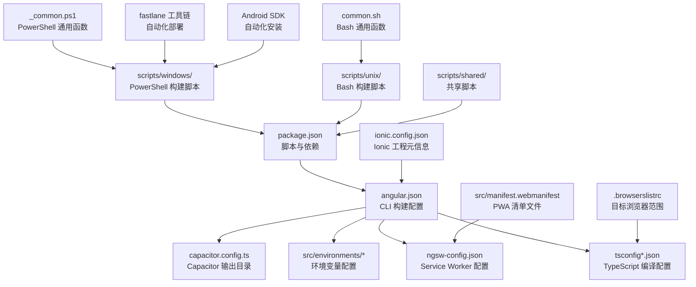
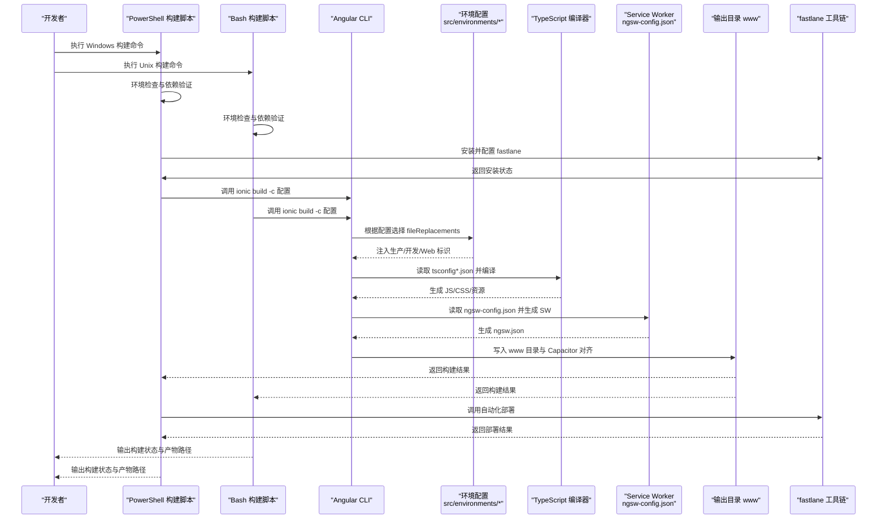
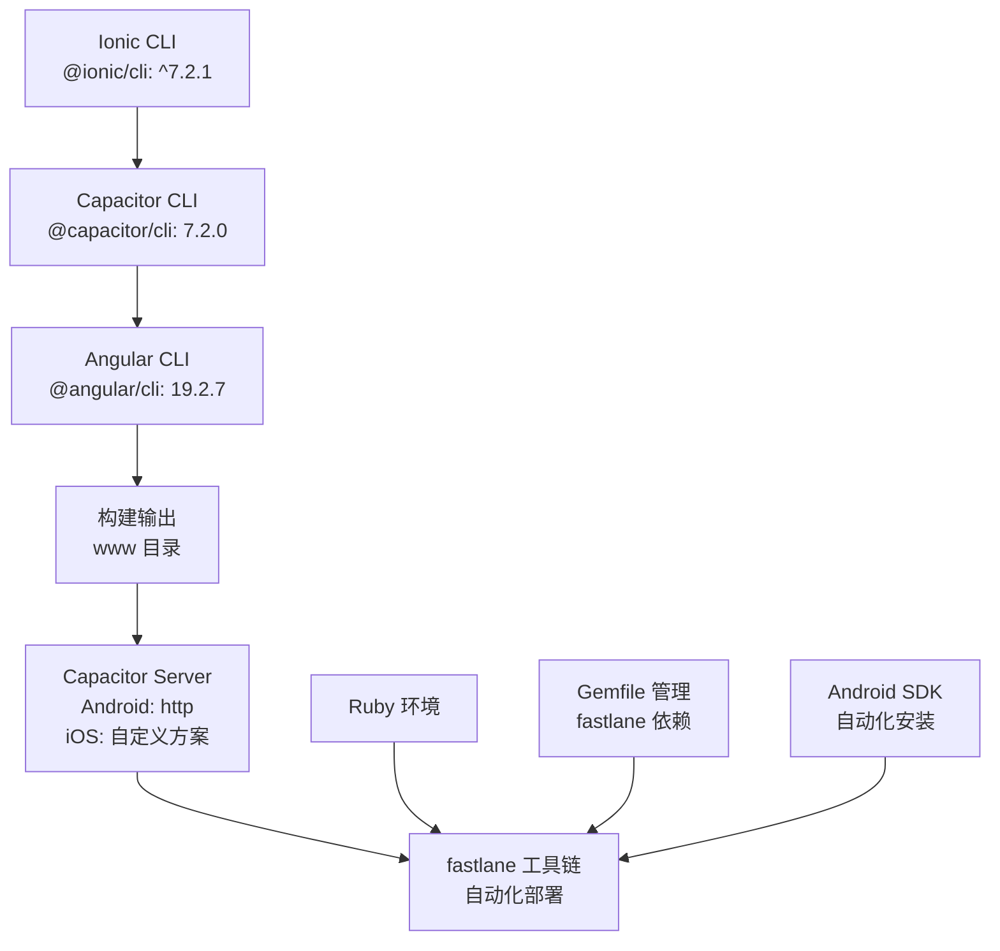
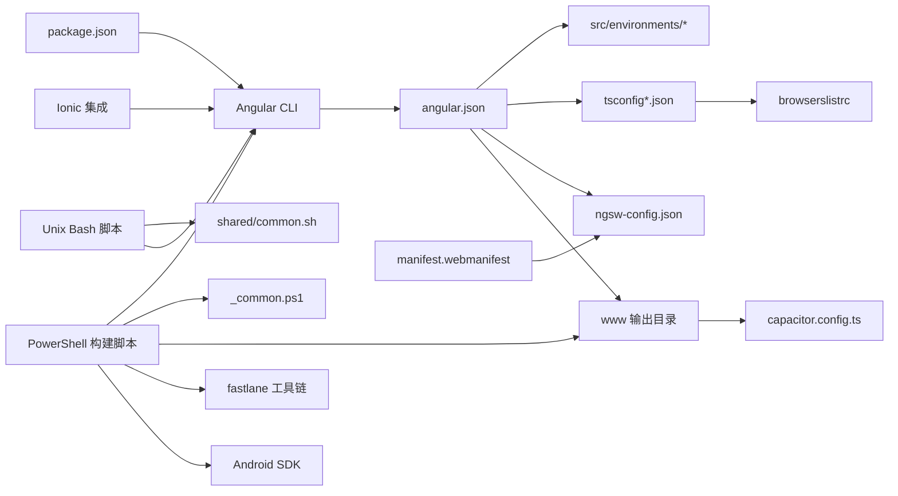

# 构建配置

<cite>
**本文档引用的文件**
- [angular.json](file://angular.json)
- [package.json](file://package.json)
- [tsconfig.json](file://tsconfig.json)
- [tsconfig.app.json](file://tsconfig.app.json)
- [ngsw-config.json](file://ngsw-config.json)
- [src/environments/environment.ts](file://src/environments/environment.ts)
- [src/environments/environment.prod.ts](file://src/environments/environment.prod.ts)
- [src/environments/environment.web.ts](file://src/environments/environment.web.ts)
- [src/environments/environment.web.prod.ts](file://src/environments/environment.web.prod.ts)
- [.browserslistrc](file://.browserslistrc)
- [capacitor.config.ts](file://capacitor.config.ts)
- [ionic.config.json](file://ionic.config.json)
- [src/manifest.webmanifest](file://src/manifest.webmanifest)
- [scripts/windows/_common.ps1](file://scripts/windows/_common.ps1)
- [scripts/windows/install_3_fastlane_bywin.ps1](file://scripts/windows/install_3_fastlane_bywin.ps1)
- [scripts/windows/install_4_android_sdk_bywin.ps1](file://scripts/windows/install_4_android_sdk_bywin.ps1)
</cite>

## 更新摘要
**变更内容**
- 新增Ionic + Capacitor + fastlane工具链架构支持
- 移除Rust相关配置和依赖
- 新增Angular 19兼容性配置
- 完善Windows PowerShell构建脚本体系
- 增强Android SDK和fastlane自动化安装

## 目录
1. [简介](#简介)
2. [项目结构](#项目结构)
3. [核心组件](#核心组件)
4. [架构总览](#架构总览)
5. [详细组件分析](#详细组件分析)
6. [Ionic + Capacitor + fastlane工具链](#ionic--capacitor--fastlane工具链)
7. [Angular 19兼容性配置](#angular-19兼容性配置)
8. [Windows PowerShell构建脚本体系](#windows-powershell构建脚本体系)
9. [构建优化策略](#构建优化策略)
10. [依赖关系分析](#依赖关系分析)
11. [性能考虑](#性能考虑)
12. [故障排查指南](#故障排查指南)
13. [结论](#结论)
14. [附录](#附录)

## 简介
本文件系统性梳理 Macro-Deck-Client-App 的构建配置，覆盖 Angular CLI 配置、TypeScript 编译配置、环境变量、Service Worker 配置与构建优化策略。本次重大更新反映了Ionic + Capacitor + fastlane工具链架构的引入，移除了Rust相关配置，新增了Angular 19兼容性配置，并建立了完整的Windows PowerShell构建脚本体系。文档结合实际源码进行可视化说明，帮助开发者快速理解与高效维护构建流程。

## 项目结构
该工程采用 Angular + Capacitor + Ionic 的混合架构，现已建立完整的跨平台构建脚本体系：
- 使用 Angular CLI 进行浏览器端与原生打包
- 使用 Capacitor 将 Web 资源桥接到原生平台
- 使用 Ionic 提供 UI 组件与主题样式
- 通过 Service Worker 实现 PWA 缓存策略
- 通过 PowerShell 脚本实现 Windows 平台自动化构建流程
- 通过 Bash 脚本实现 Unix/Linux 平台自动化构建流程
- 集成 fastlane 工具链进行自动化部署

**图表来源**
- [angular.json:1-204](file://angular.json#L1-L204)
- [tsconfig.json:1-34](file://tsconfig.json#L1-L34)
- [tsconfig.app.json:1-16](file://tsconfig.app.json#L1-L16)
- [ngsw-config.json:1-31](file://ngsw-config.json#L1-L31)
- [capacitor.config.ts:1-16](file://capacitor.config.ts#L1-L16)
- [package.json:1-96](file://package.json#L1-L96)
- [.browserslistrc:1-17](file://.browserslistrc#L1-L17)
- [ionic.config.json:1-10](file://ionic.config.json#L1-L10)
- [src/manifest.webmanifest:1-48](file://src/manifest.webmanifest#L1-L48)
- [scripts/windows/_common.ps1:1-200](file://scripts/windows/_common.ps1#L1-L200)
- [scripts/windows/install_3_fastlane_bywin.ps1:1-69](file://scripts/windows/install_3_fastlane_bywin.ps1#L1-L69)
- [scripts/windows/install_4_android_sdk_bywin.ps1:1-249](file://scripts/windows/install_4_android_sdk_bywin.ps1#L1-L249)

## 核心组件
- **Angular CLI 构建目标与配置**：定义构建目标、输出目录、资源处理、样式与脚本注入、Service Worker 启用与配置路径等。
- **TypeScript 编译配置**：基础编译选项、严格模式、模块解析策略、目标语言级别与库支持等。
- **环境变量配置**：区分开发/生产与原生/Web 版本，通过 fileReplacements 动态替换。
- **Service Worker 配置**：定义缓存组、预取与懒加载策略、更新模式与资源匹配规则。
- **浏览器兼容性**：通过 browserslist 指定目标浏览器集合，影响转译与 polyfill。
- **Capacitor 输出目录**：与构建输出目录保持一致，确保原生应用正确加载静态资源。
- **Ionic 工程元信息**：定义工程类型与集成配置，支持 Capacitor 与 Cordova。
- **PowerShell 构建脚本体系**：提供完整的 Web/PWA、Android、Windows 桌面多平台构建自动化流程。
- **Bash 构建脚本体系**：提供 Unix/Linux 平台的构建自动化支持。
- **共享脚本库**：提供跨平台通用的构建函数与工具函数。
- **fastlane 工具链**：集成 Ruby Gemfile 管理的 fastlane 自动化部署工具。
- **Android SDK 自动化**：提供完整的 Android 开发环境安装与配置流程。

**章节来源**
- [angular.json:13-121](file://angular.json#L13-L121)
- [tsconfig.json:4-32](file://tsconfig.json#L4-L32)
- [tsconfig.app.json:3-15](file://tsconfig.app.json#L3-L15)
- [ngsw-config.json:1-31](file://ngsw-config.json#L1-L31)
- [.browserslistrc:11-17](file://.browserslistrc#L11-L17)
- [capacitor.config.ts:6](file://capacitor.config.ts#L6)
- [ionic.config.json:1-10](file://ionic.config.json#L1-L10)
- [scripts/windows/_common.ps1:1-200](file://scripts/windows/_common.ps1#L1-L200)
- [scripts/windows/install_3_fastlane_bywin.ps1:1-69](file://scripts/windows/install_3_fastlane_bywin.ps1#L1-L69)
- [scripts/windows/install_4_android_sdk_bywin.ps1:1-249](file://scripts/windows/install_4_android_sdk_bywin.ps1#L1-L249)

## 架构总览
下图展示从 CLI 到最终产物的关键路径与决策点，包括环境替换、Service Worker 生成与输出目录对齐，以及 PowerShell 和 Bash 脚本的集成。

**图表来源**
- [angular.json:13-121](file://angular.json#L13-L121)
- [src/environments/environment.ts:1-21](file://src/environments/environment.ts#L1-L21)
- [src/environments/environment.prod.ts:1-10](file://src/environments/environment.prod.ts#L1-L10)
- [src/environments/environment.web.ts:1-10](file://src/environments/environment.web.ts#L1-L10)
- [src/environments/environment.web.prod.ts:1-10](file://src/environments/environment.web.prod.ts#L1-L10)
- [ngsw-config.json:1-31](file://ngsw-config.json#L1-L31)
- [capacitor.config.ts:6](file://capacitor.config.ts#L6)
- [scripts/windows/_common.ps1:1-200](file://scripts/windows/_common.ps1#L1-L200)
- [scripts/windows/install_3_fastlane_bywin.ps1:32-63](file://scripts/windows/install_3_fastlane_bywin.ps1#L32-L63)
- [scripts/windows/install_4_android_sdk_bywin.ps1:155-181](file://scripts/windows/install_4_android_sdk_bywin.ps1#L155-L181)

## 详细组件分析

### Angular CLI 构建配置（angular.json）
- **构建目标与输出**
  - 输出目录：www（与 Capacitor 配置一致）
  - 入口：index.html、main.ts、polyfills.ts
  - TypeScript 配置：tsconfig.app.json
  - 样式与脚本：SCSS 主题、全局样式、第三方样式与脚本
  - 资源处理：assets 目录、Ionicons SVG、Web Manifest
  - Service Worker：启用并指定配置文件路径
- **配置集**
  - **web_production**：设置 baseHref/deployUrl、预算限制、文件替换为 Web 生产环境、开启输出哈希
  - **web**：同 web_production，但关闭构建优化与 SourceMap，便于调试
  - **production**：预算限制、文件替换为原生生产环境、开启输出哈希
  - **development**：关闭构建优化与 SourceMap，保留命名块与许可证提取开关
  - **ci**：禁用进度条
- **服务端开发（serve）**
  - 支持多配置映射到对应构建目标
- **测试与 Lint**
  - 测试使用 Karma，配置与构建类似但更精简
  - Lint 使用 @angular-eslint/builder，检查 TS 与 HTML
- **Ionic 集成**
  - CLI 配置中包含 @ionic/angular-toolkit 作为 schematic 集合
  - 支持组件和页面的 Ionic 工具链

**章节来源**
- [angular.json:13-121](file://angular.json#L13-L121)
- [angular.json:122-185](file://angular.json#L122-L185)
- [angular.json:189-202](file://angular.json#L189-L202)

### TypeScript 编译配置（tsconfig*.json）
- **基础配置（tsconfig.json）**
  - 严格模式：开启多项严格检查
  - 目标与模块：ES2022 与 ES2020
  - 模块解析：Node 解析策略
  - 库支持：ES2018 + DOM
  - SourceMap：开启
  - Angular 编译器选项：启用 I18n Legacy Message Id 格式
- **应用配置（tsconfig.app.json）**
  - 继承基础配置
  - 显式声明入口文件 main.ts 与 polyfills.ts
  - 类型声明包含 src/**/*.d.ts

**章节来源**
- [tsconfig.json:4-32](file://tsconfig.json#L4-L32)
- [tsconfig.app.json:3-15](file://tsconfig.app.json#L3-L15)

### 环境变量配置（src/environments）
- **默认开发环境**：production=false，webVersion=false，version="3.0.0"
- **原生生产环境**：production=true，webVersion=false
- **Web 开发环境**：production=false，webVersion=true
- **Web 生产环境**：production=true，webVersion=true
- **文件替换机制**：通过 angular.json 的 fileReplacements 将 src/environments/environment.ts 替换为上述任一文件，实现按环境注入

**章节来源**
- [src/environments/environment.ts:1-21](file://src/environments/environment.ts#L1-L21)
- [src/environments/environment.prod.ts:1-10](file://src/environments/environment.prod.ts#L1-L10)
- [src/environments/environment.web.ts:1-10](file://src/environments/environment.web.ts#L1-L10)
- [src/environments/environment.web.prod.ts:1-10](file://src/environments/environment.web.prod.ts#L1-L10)
- [angular.json:63-68](file://angular.json#L63-L68)
- [angular.json:100-105](file://angular.json#L100-L105)

### Service Worker 配置（ngsw-config.json）
- **缓存组**
  - **应用组**：预取首页、清单与所有 JS/CSS
  - **资源组**：懒加载 assets 与多种媒体格式
- **更新策略**
  - 应用组：prefetch 安装模式
  - 资源组：lazy 安装 + prefetch 更新模式
- **资源匹配**
  - 通配符匹配与扩展名过滤，确保静态资源被缓存与更新

**章节来源**
- [ngsw-config.json:1-31](file://ngsw-config.json#L1-L31)

### 浏览器兼容性（.browserslistrc）
- **目标浏览器**：Chrome/ChromeAndroid/Firefox/Edge/Safari/iOS
- **影响**：决定 polyfill 与转译策略，配合 TypeScript lib 与 Angular 支持矩阵

**章节来源**
- [.browserslistrc:11-17](file://.browserslistrc#L11-L17)

### Capacitor 输出目录（capacitor.config.ts）
- **webDir**: "www"，与 Angular 构建输出目录一致，保证原生应用加载静态资源
- **服务器配置**：Android 使用 http 方案，iOS 使用自定义方案

**章节来源**
- [capacitor.config.ts:6](file://capacitor.config.ts#L6)

### Ionic 工程元信息（ionic.config.json）
- **工程类型**：angular
- **集成**：Capacitor 与 Cordova
- **用途**：工具链识别与默认行为

**章节来源**
- [ionic.config.json:1-10](file://ionic.config.json#L1-L10)

### PWA 清单文件（src/manifest.webmanifest）
- **应用信息**：名称、短名称、主题色、背景色
- **显示模式**：fullscreen 全屏显示
- **图标配置**：多尺寸 PNG 图标，支持 maskable 用途
- **作用域与起始路径**：./ 作用域，./ 起始路径

**章节来源**
- [src/manifest.webmanifest:1-48](file://src/manifest.webmanifest#L1-L48)

## Ionic + Capacitor + fastlane工具链

### 工具链架构
项目现已完整集成 Ionic + Capacitor + fastlane 工具链，提供现代化的跨平台应用开发与部署能力：

**图表来源**
- [package.json:72-73](file://package.json#L72-L73)
- [capacitor.config.ts:7-12](file://capacitor.config.ts#L7-L12)
- [scripts/windows/install_3_fastlane_bywin.ps1:32-63](file://scripts/windows/install_3_fastlane_bywin.ps1#L32-L63)
- [scripts/windows/install_4_android_sdk_bywin.ps1:155-181](file://scripts/windows/install_4_android_sdk_bywin.ps1#L155-L181)

### fastlane 工具链集成
- **Gemfile 管理**：通过 Ruby Gemfile 声明和管理 fastlane 依赖
- **Bundler 集成**：使用 Bundler 进行依赖安装和版本管理
- **自动化部署**：支持 Android 应用的自动化构建与发布流程
- **命令解析**：自动检测和配置 fastlane 命令路径

**章节来源**
- [scripts/windows/install_3_fastlane_bywin.ps1:1-69](file://scripts/windows/install_3_fastlane_bywin.ps1#L1-L69)

### Android SDK 自动化安装
- **多镜像源支持**：华为云、腾讯云、Google 官方镜像源
- **组件管理**：自动安装 platform-tools、platforms、build-tools
- **环境变量配置**：自动设置 ANDROID_HOME 和 PATH
- **Java 环境检查**：强制要求 Java 17 环境

**章节来源**
- [scripts/windows/install_4_android_sdk_bywin.ps1:1-249](file://scripts/windows/install_4_android_sdk_bywin.ps1#L1-L249)

## Angular 19兼容性配置

### 版本升级
项目已升级至 Angular 19.2.6，配套依赖版本同步更新：
- **核心框架**：@angular/core@19.2.6, @angular/common@19.2.6, @angular/compiler@19.2.6
- **构建工具**：@angular-devkit/build-angular@19.2.7, @angular/cli@19.2.7
- **Service Worker**：@angular/service-worker@19.2.6
- **TypeScript**：typescript@5.8.3

### 兼容性改进
- **TypeScript 配置**：target 设置为 es2022，module 为 es2020
- **编译器选项**：启用 Angular 19 的严格模式选项
- **模块解析**：保持 Node 解析策略
- **库支持**：ES2018 + DOM 库支持

**章节来源**
- [package.json:17-60](file://package.json#L17-L60)
- [package.json:62-94](file://package.json#L62-L94)
- [tsconfig.json:19-25](file://tsconfig.json#L19-L25)

## Windows PowerShell构建脚本体系

### 脚本组织结构
项目现已建立完整的跨平台构建脚本体系，包含四个主要目录：

#### Windows PowerShell 脚本（scripts/windows/）
- **_common.ps1**：PowerShell 通用函数库，提供日志、确认、环境检测等功能
- **install_1_base_tools_bywin.ps1**：基础工具安装脚本
- **install_2_ruby_bywin.ps1**：Ruby 环境安装脚本
- **install_3_fastlane_bywin.ps1**：fastlane 工具链安装脚本
- **install_4_android_sdk_bywin.ps1**：Android SDK 自动安装脚本
- **build_web_bywin.ps1**：Web/PWA 构建脚本
- **build_android_bywin.ps1**：Android 构建脚本
- **build_windows_bywin.ps1**：Windows 桌面构建脚本
- **remove_1_android_sdk_bywin.ps1**：Android SDK 卸载脚本
- **remove_2_fastlane_bywin.ps1**：fastlane 卸载脚本
- **remove_3_ruby_bywin.ps1**：Ruby 卸载脚本

#### Unix Bash 脚本（scripts/unix/）
- **build-web.sh**：Web 构建脚本
- **build-android.sh**：Android 构建脚本
- **build-ios-ipa.sh**：iOS 构建脚本
- **bootstrap.sh**：项目引导脚本

#### 共享脚本（scripts/shared/）
- **common.sh**：跨平台通用函数库

### 脚本功能对比

| 脚本名称 | 平台 | 主要功能 | 环境要求 |
|---------|------|----------|----------|
| install_3_fastlane_bywin.ps1 | Windows | fastlane 工具链安装 | Ruby + Bundler |
| install_4_android_sdk_bywin.ps1 | Windows | Android SDK 自动安装 | Java 17 |
| build_web_bywin.ps1 | Windows | Web/PWA 构建、环境检查 | Node.js 18+/20+/22+ |
| build_android_bywin.ps1 | Windows | Android 构建、环境检查 | Android SDK/NDK |
| build_windows_bywin.ps1 | Windows | Windows 桌面构建 | MSVC/GCC |
| build-web.sh | Unix | Web 构建 | Node.js/npm |
| build-android.sh | Unix | Android 构建 | Android SDK/NDK |
| build-ios-ipa.sh | Unix | iOS 构建 | Xcode/Fastlane |
| bootstrap.sh | Unix | 项目引导 | 任意 Unix 系统 |

### PowerShell 脚本特性
- **统一的日志系统**：支持成功（绿色 ✓）、警告（黄色 ⚠）、失败（红色 ✗）三种日志级别
- **自动确认机制**：支持 -y 静默模式和交互式确认
- **环境检测**：自动检测和配置开发环境
- **错误处理**：完善的错误捕获与用户友好的错误信息
- **进度反馈**：详细的构建进度和状态输出

**章节来源**
- [scripts/windows/_common.ps1:1-200](file://scripts/windows/_common.ps1#L1-L200)
- [scripts/windows/install_3_fastlane_bywin.ps1:1-69](file://scripts/windows/install_3_fastlane_bywin.ps1#L1-L69)
- [scripts/windows/install_4_android_sdk_bywin.ps1:1-249](file://scripts/windows/install_4_android_sdk_bywin.ps1#L1-L249)

## 构建优化策略

### 代码分割与懒加载
- **路由级懒加载**：通过 Angular 路由配置实现按需加载
- **组件级懒加载**：大型组件按需加载，减少初始包大小
- **第三方库分离**：将常用第三方库单独打包，提升缓存效率

### Tree Shaking 优化
- **ES6 模块**：使用 ES6 模块语法，便于 Tree Shaking
- **无副作用模块**：标记无副作用的模块，允许完全移除
- **最小化导入**：避免导入整个库，仅导入需要的功能

### 资源优化
- **图片优化**：支持多种格式（SVG、PNG、JPEG、WebP）
- **字体优化**：Material Design Icons 和 Bootstrap 字体
- **CSS 优化**：SCSS 编译与压缩
- **JavaScript 优化**：TypeScript 编译与压缩

### 缓存策略
- **Service Worker**：实现智能缓存与离线访问
- **HTTP 缓存**：合理的 HTTP 缓存头设置
- **版本控制**：输出哈希确保缓存失效

### 性能监控
- **构建时间监控**：记录各阶段构建时间
- **包体分析**：定期分析包体组成，识别优化机会
- **运行时性能**：监控应用运行时性能指标

**章节来源**
- [angular.json:47-118](file://angular.json#L47-L118)
- [ngsw-config.json:4-29](file://ngsw-config.json#L4-L29)
- [scripts/windows/_common.ps1:20-45](file://scripts/windows/_common.ps1#L20-L45)

## 依赖关系分析
- **CLI 与配置**
  - angular.json 决定构建目标、资源、Service Worker 与配置集
  - package.json 的 scripts 与 devDependencies 提供 CLI 与构建工具链
- **编译链路**
  - tsconfig*.json 为 TypeScript 编译提供严格与目标设定
  - .browserslistrc 影响 polyfill 与转译范围
- **运行时集成**
  - Capacitor 读取 www 目录作为 Web 资源根目录
  - Service Worker 由 ngsw-config.json 驱动生成
- **PowerShell 脚本集成**
  - _common.ps1 提供通用函数库
  - install_3_fastlane_bywin.ps1 实现 fastlane 工具链安装
  - install_4_android_sdk_bywin.ps1 实现 Android SDK 自动安装
- **跨平台脚本集成**
  - shared/common.sh 提供跨平台通用函数
  - unix 脚本通过 common.sh 与 Windows 脚本保持一致性

**图表来源**
- [package.json:1-96](file://package.json#L1-L96)
- [angular.json:13-121](file://angular.json#L13-L121)
- [tsconfig.json:1-34](file://tsconfig.json#L1-L34)
- [.browserslistrc:1-17](file://.browserslistrc#L1-L17)
- [ngsw-config.json:1-31](file://ngsw-config.json#L1-L31)
- [capacitor.config.ts:6](file://capacitor.config.ts#L6)
- [scripts/windows/_common.ps1:1-200](file://scripts/windows/_common.ps1#L1-L200)
- [scripts/windows/install_3_fastlane_bywin.ps1:32-63](file://scripts/windows/install_3_fastlane_bywin.ps1#L32-L63)
- [scripts/windows/install_4_android_sdk_bywin.ps1:155-181](file://scripts/windows/install_4_android_sdk_bywin.ps1#L155-L181)
- [scripts/unix/build-web.sh:1-12](file://scripts/unix/build-web.sh#L1-L12)
- [scripts/shared/common.sh:1-46](file://scripts/shared/common.sh#L1-L46)
- [src/manifest.webmanifest:1-48](file://src/manifest.webmanifest#L1-L48)

**章节来源**
- [package.json:1-96](file://package.json#L1-L96)
- [angular.json:13-121](file://angular.json#L13-L121)
- [scripts/windows/_common.ps1:1-200](file://scripts/windows/_common.ps1#L1-L200)
- [scripts/windows/install_3_fastlane_bywin.ps1:1-69](file://scripts/windows/install_3_fastlane_bywin.ps1#L1-L69)
- [scripts/windows/install_4_android_sdk_bywin.ps1:1-249](file://scripts/windows/install_4_android_sdk_bywin.ps1#L1-L249)
- [scripts/unix/build-web.sh:1-12](file://scripts/unix/build-web.sh#L1-L12)
- [scripts/shared/common.sh:1-46](file://scripts/shared/common.sh#L1-L46)

## 性能考虑
- **输出哈希与缓存**
  - production/web_production 配置开启 outputHashing，提升缓存命中率与版本控制能力
- **体积预算**
  - initial 与 anyComponentStyle 预算限制，避免包体过大导致加载缓慢或样式膨胀
- **构建优化开关**
  - development 配置关闭构建优化与 SourceMap，便于调试；生产配置开启优化与哈希
- **Service Worker 缓存策略**
  - 应用组预取，资源组懒加载+预取更新，平衡首屏速度与后续资源可用性
- **浏览器兼容性**
  - 通过 browserslistrc 控制 polyfill 与转译范围，减少不必要的运行时开销
- **PowerShell 构建优化**
  - 自动依赖管理，避免重复安装
  - 智能错误处理，减少构建失败
  - 进度反馈，提升开发体验
- **跨平台性能优化**
  - Windows PowerShell 脚本针对 Windows 平台进行优化
  - Unix Bash 脚本针对类 Unix 系统进行优化
  - 共享脚本确保跨平台一致性
- **Angular 19 性能改进**
  - 更高效的编译器和构建工具
  - 改进的 Tree Shaking 和代码分割
  - 优化的模块解析和依赖管理

**章节来源**
- [angular.json:47-118](file://angular.json#L47-L118)
- [ngsw-config.json:4-29](file://ngsw-config.json#L4-L29)
- [.browserslistrc:11-17](file://.browserslistrc#L11-L17)
- [scripts/windows/_common.ps1:20-45](file://scripts/windows/_common.ps1#L20-L45)

## 故障排查指南
- **构建后原生应用无法加载资源**
  - 检查 Capacitor 配置的 webDir 是否指向 www
  - 确认 angular.json 的 outputPath 与 Capacitor 的 webDir 一致
- **Service Worker 缓存未生效**
  - 检查 ngsw-config.json 的资源匹配是否覆盖所需文件
  - 确认构建时启用了 serviceWorker 并指定了 ngswConfigPath
- **环境变量未按预期替换**
  - 确认 angular.json 的 fileReplacements 正确映射到目标环境文件
  - 检查环境文件中的标识字段（如 production、webVersion）是否符合业务逻辑
- **包体超限或样式体积异常**
  - 查看 budgets 配置，定位初始包或组件样式阈值
  - 分析第三方库引入情况，必要时拆分或按需加载
- **调试困难或构建过慢**
  - development 配置适合调试；生产配置适合发布
  - 如需更快迭代，可在本地使用 development 配置并禁用 SourceMap 以外的优化
- **PowerShell 构建失败**
  - 检查 Node.js 版本是否满足要求（v18.19.1+ / v20.11.1+ / v22+）
  - 确认 npm 可用且网络连接正常
  - 检查 ajv 版本冲突问题，脚本会自动处理但可能需要手动干预
  - 查看详细的错误日志和建议的解决方案
- **Web 构建路径问题**
  - 确认 baseHref 和 deployUrl 设置正确（/client/）
  - 检查 Web 服务器配置是否支持 SPA 路由
- **跨平台脚本问题**
  - 确认使用的脚本与目标平台匹配
  - 检查脚本权限和执行环境
  - 验证共享函数库的正确加载
- **fastlane 工具链问题**
  - 检查 Ruby 环境是否正确安装
  - 确认 Gemfile 中的 fastlane 依赖已通过 Bundler 安装
  - 验证 fastlane 命令是否可解析
- **Android SDK 安装问题**
  - 检查 Java 17 环境是否满足要求
  - 确认 ANDROID_HOME 环境变量设置正确
  - 验证 Android SDK 组件安装完整性
- **Ionic CLI 集成问题**
  - 检查 @ionic/angular-toolkit 是否正确安装
  - 确认 Ionic 工程配置与 Angular CLI 兼容

**章节来源**
- [capacitor.config.ts:6](file://capacitor.config.ts#L6)
- [angular.json:16](file://angular.json#L16)
- [angular.json:44-45](file://angular.json#L44-L45)
- [angular.json:63-68](file://angular.json#L63-L68)
- [angular.json:100-105](file://angular.json#L100-L105)
- [angular.json:47-118](file://angular.json#L47-L118)
- [scripts/windows/_common.ps1:42-45](file://scripts/windows/_common.ps1#L42-L45)
- [scripts/windows/install_3_fastlane_bywin.ps1:32-63](file://scripts/windows/install_3_fastlane_bywin.ps1#L32-L63)
- [scripts/windows/install_4_android_sdk_bywin.ps1:188-189](file://scripts/windows/install_4_android_sdk_bywin.ps1#L188-L189)

## 结论
本项目通过 Angular CLI、TypeScript、Service Worker 与 Capacitor 的协同，实现了跨平台的构建与部署能力。本次重大更新反映了 Ionic + Capacitor + fastlane 工具链架构的完整引入，移除了不再需要的 Rust 相关配置，新增了 Angular 19 兼容性配置，并建立了完整的 Windows PowerShell 构建脚本体系。新增的 fastlane 工具链、Android SDK 自动化安装脚本以及增强的 PowerShell 脚本库，进一步增强了项目的可维护性和开发效率。合理利用配置集、预算限制与缓存策略，可以在保证开发体验的同时，获得高效的生产构建结果。建议在团队协作中统一构建脚本与配置，持续监控包体与缓存命中率，以维持良好的用户体验。

## 附录

### 常用构建命令
- **Windows PowerShell 构建**：
  - Web 生产构建：`.\scripts\windows\build_web_bywin.ps1 build -Configuration web_production`
  - Web 开发构建：`.\scripts\windows\build_web_bywin.ps1 build -Configuration web`
  - 启动开发服务器：`.\scripts\windows\build_web_bywin.ps1 dev`
  - 预览构建产物：`.\scripts\windows\build_web_bywin.ps1 serve`
  - 环境检查：`.\scripts\windows\build_web_bywin.ps1 check`
  - 安装 fastlane：`.\scripts\windows\install_3_fastlane_bywin.ps1`
  - 安装 Android SDK：`.\scripts\windows\install_4_android_sdk_bywin.ps1`
- **Unix Bash 构建**：
  - Web 构建：`./scripts/unix/build-web.sh`
  - Android 构建：`./scripts/unix/build-android.sh`
  - iOS 构建：`./scripts/unix/build-ios-ipa.sh`
- **开发启动**：使用 package.json 中的 start 脚本，对应 development 配置
- **构建**：使用 build 脚本，对应 development 配置
- **测试**：使用 test 脚本，基于 Karma 与 Jasmine
- **Lint**：使用 lint 脚本，基于 ESLint 与 Angular 规则

### 关键配置要点速览
- **输出目录**：www（与 Capacitor 对齐）
- **环境替换**：通过 fileReplacements 动态切换
- **Service Worker**：启用并配置缓存组与更新策略
- **预算与哈希**：生产配置开启输出哈希与体积预算
- **浏览器兼容**：通过 browserslistrc 限定目标
- **PowerShell 集成**：完整的 Windows 平台构建自动化流程
- **Bash 集成**：完整的 Unix/Linux 平台构建自动化流程
- **共享脚本**：提供跨平台通用的构建函数与工具函数
- **Web 配置**：专门的 Web/PWA 构建配置集
- **Ionic 集成**：支持 @ionic/angular-toolkit 工具链
- **fastlane 工具链**：Ruby Gemfile 管理的自动化部署工具
- **Android SDK 自动化**：完整的 Android 开发环境安装与配置
- **Angular 19 兼容性**：升级至 Angular 19.2.6，配套依赖同步更新

**章节来源**
- [package.json:7-14](file://package.json#L7-L14)
- [angular.json:13-121](file://angular.json#L13-L121)
- [ngsw-config.json:1-31](file://ngsw-config.json#L1-L31)
- [.browserslistrc:11-17](file://.browserslistrc#L11-L17)
- [scripts/windows/_common.ps1:106-120](file://scripts/windows/_common.ps1#L106-L120)
- [scripts/windows/install_3_fastlane_bywin.ps1:65-69](file://scripts/windows/install_3_fastlane_bywin.ps1#L65-L69)
- [scripts/windows/install_4_android_sdk_bywin.ps1:245-249](file://scripts/windows/install_4_android_sdk_bywin.ps1#L245-L249)
- [scripts/unix/build-web.sh:7-9](file://scripts/unix/build-web.sh#L7-L9)
- [scripts/shared/common.sh:34-45](file://scripts/shared/common.sh#L34-L45)