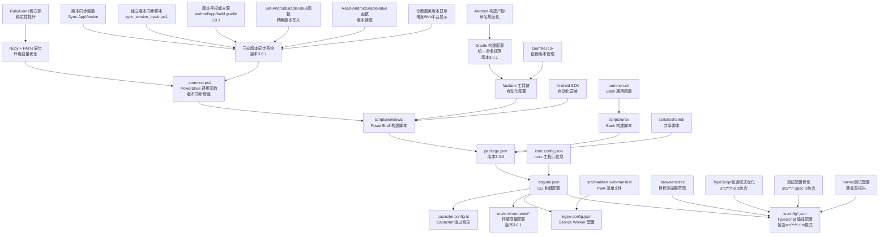
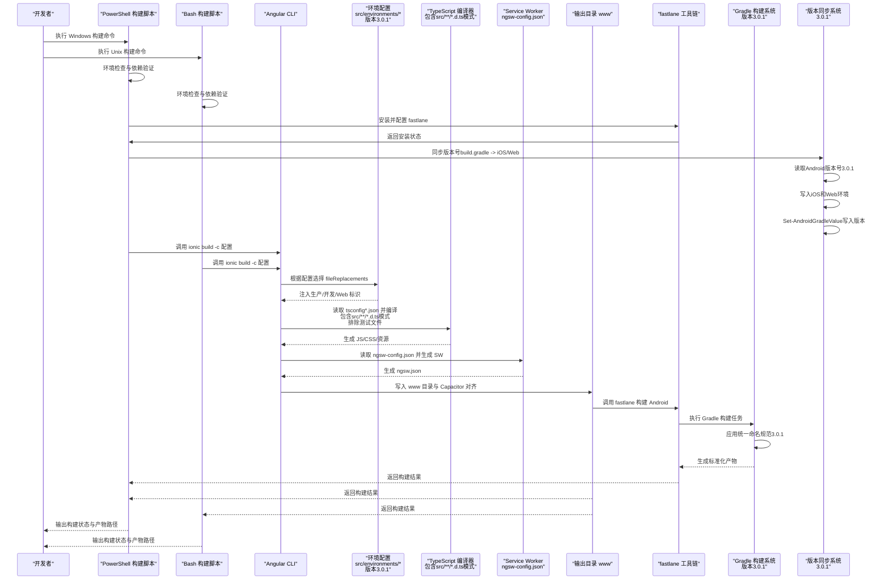
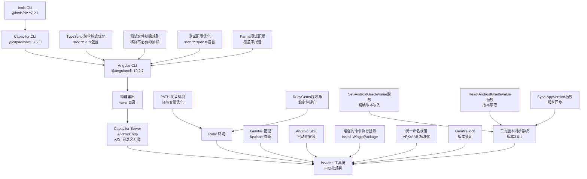
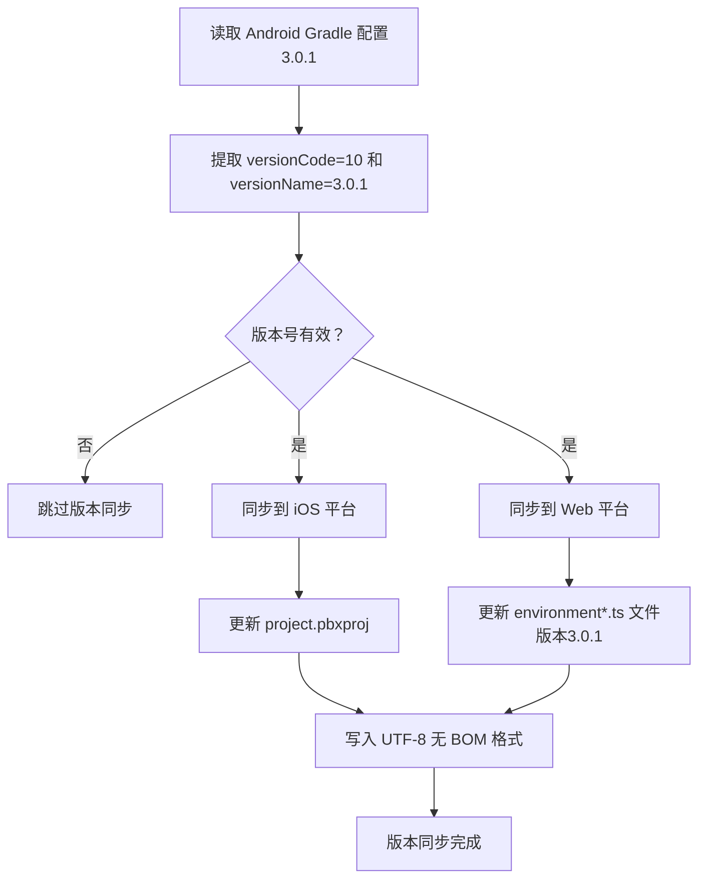
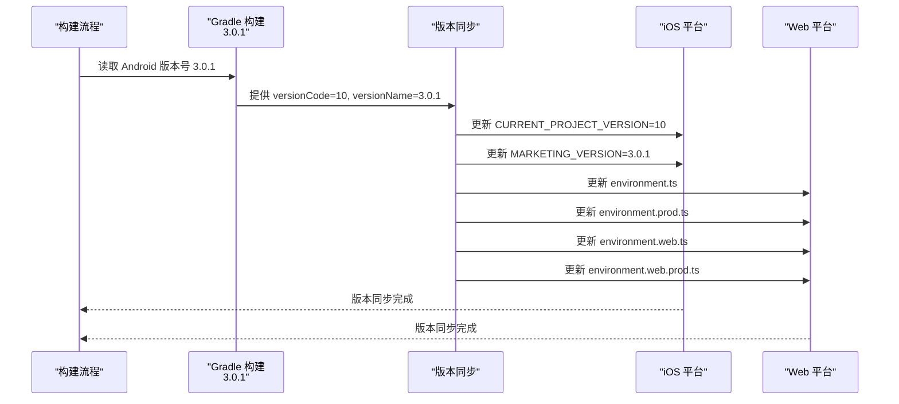
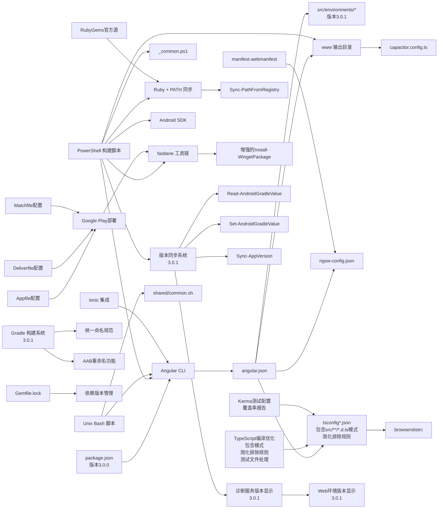

# 构建配置

<cite>
**本文档引用的文件**
- [angular.json](file://angular.json)
- [package.json](file://package.json)
- [tsconfig.json](file://tsconfig.json)
- [tsconfig.app.json](file://tsconfig.app.json)
- [tsconfig.spec.json](file://tsconfig.spec.json)
- [karma.conf.js](file://karma.conf.js)
- [ngsw-config.json](file://ngsw-config.json)
- [src/environments/environment.ts](file://src/environments/environment.ts)
- [src/environments/environment.prod.ts](file://src/environments/environment.prod.ts)
- [src/environments/environment.web.ts](file://src/environments/environment.web.ts)
- [src/environments/environment.web.prod.ts](file://src/environments/environment.web.prod.ts)
- [.browserslistrc](file://.browserslistrc)
- [capacitor.config.ts](file://capacitor.config.ts)
- [ionic.config.json](file://ionic.config.json)
- [src/manifest.webmanifest](file://src/manifest.webmanifest)
- [scripts/windows/_common.ps1](file://scripts/windows/_common.ps1)
- [scripts/windows/sync_version_bywin.ps1](file://scripts/windows/sync_version_bywin.ps1)
- [scripts/windows/install_2_ruby_bywin.ps1](file://scripts/windows/install_2_ruby_bywin.ps1)
- [scripts/windows/install_3_fastlane_bywin.ps1](file://scripts/windows/install_3_fastlane_bywin.ps1)
- [scripts/windows/install_4_android_sdk_bywin.ps1](file://scripts/windows/install_4_android_sdk_bywin.ps1)
- [android/app/build.gradle](file://android/app/build.gradle)
- [android/fastlane/Fastfile](file://android/fastlane/Fastfile)
- [android/Gemfile.lock](file://android/Gemfile.lock)
- [Gemfile](file://Gemfile)
- [android/Gemfile](file://android/Gemfile)
- [src/app/services/diagnostic/diagnostic.service.ts](file://src/app/services/diagnostic/diagnostic.service.ts)
</cite>

## 更新摘要
**变更内容**
- **TypeScript编译配置优化**：改进tsconfig.app.json的包含/排除模式，优化src/**/*.d.ts包含模式，提升编译可靠性和构建性能
- **版本升级**：从3.0.0升级到3.0.1，更新所有环境配置中的版本号，versionCode更新为10
- **Android版本更新**：Android Gradle配置中的versionName更新为3.0.1，versionCode更新为10
- **三向版本同步系统**：更新到3.0.1版本，确保跨平台版本一致性
- **环境变量同步**：所有环境文件中的version字段已更新为3.0.1，versionCode为10
- **版本同步函数增强**：Sync-AppVersion函数已更新以反映新的版本号
- **TypeScript编译优化**：src/**/*.d.ts包含模式确保类型定义被正确处理，提升编译性能

## 目录
1. [简介](#简介)
2. [项目结构](#项目结构)
3. [核心组件](#核心组件)
4. [架构总览](#架构总览)
5. [详细组件分析](#详细组件分析)
6. [Ionic + Capacitor + fastlane工具链](#ionic--capacitor--fastlane工具链)
7. [Android构建配置](#android构建配置)
8. [APK/AAB命名规范](#apkaab命名规范)
9. [Google Play Store部署](#google-play-store部署)
10. [Ruby依赖版本管理](#ruby依赖版本管理)
11. [Angular 19兼容性配置](#angular-19兼容性配置)
12. [Windows PowerShell构建脚本体系](#windows-powershell构建脚本体系)
13. [三向版本同步系统](#三向版本同步系统)
14. [跨平台版本管理机制](#跨平台版本管理机制)
15. [构建优化策略](#构建优化策略)
16. [依赖关系分析](#依赖关系分析)
17. [性能考虑](#性能考虑)
18. [故障排查指南](#故障排查指南)
19. [结论](#结论)
20. [附录](#附录)

## 简介
本文件系统性梳理 Macro-Deck-Client-App 的构建配置，覆盖 Angular CLI 配置、TypeScript 编译配置、环境变量、Service Worker 配置与构建优化策略。本次更新反映了版本从3.0.0到3.0.1的升级，更新了三向版本同步系统中的版本信息，确保文档与最新的版本号保持一致。项目现已采用 Angular 19.2.6，配合完整的Windows PowerShell构建脚本体系和Ruby + fastlane工具链架构。

**更新重点**：本次更新特别关注了版本3.0.1的升级，所有环境配置文件中的版本号已更新为3.0.1，Android Gradle配置也相应更新。三向版本同步系统已适配新的版本号，确保Android、iOS和Web三个平台的版本一致性。新增的版本同步脚本和增强的诊断服务功能，为开发者提供了更便捷的版本管理体验。

## 项目结构
该工程采用 Angular + Capacitor + Ionic 的混合架构，现已建立完整的跨平台构建脚本体系：
- 使用 Angular CLI 进行浏览器端与原生打包
- 使用 Capacitor 将 Web 资源桥接到原生平台
- 使用 Ionic 提供 UI 组件与主题样式
- 通过 Service Worker 实现 PWA 缓存策略
- 通过 PowerShell 脚本实现 Windows 平台自动化构建流程
- 通过 Bash 脚本实现 Unix/Linux 平台自动化构建流程
- 集成 fastlane 工具链进行自动化部署
- 通过Gradle实现统一的Android构建产物命名规范
- **更新**：版本3.0.1已应用于所有环境配置
- **更新**：Android Gradle配置已更新到3.0.1版本
- **更新**：三向版本同步系统已适配新版本号



**图表来源**
- [angular.json:1-204](file://angular.json#L1-L204)
- [tsconfig.json:1-34](file://tsconfig.json#L1-L34)
- [tsconfig.app.json:1-16](file://tsconfig.app.json#L1-L16)
- [tsconfig.spec.json:1-19](file://tsconfig.spec.json#L1-L19)
- [karma.conf.js:1-45](file://karma.conf.js#L1-L45)
- [ngsw-config.json:1-31](file://ngsw-config.json#L1-L31)
- [capacitor.config.ts:1-16](file://capacitor.config.ts#L1-L16)
- [package.json:1-98](file://package.json#L1-L98)
- [.browserslistrc:1-17](file://.browserslistrc#L1-L17)
- [ionic.config.json:1-10](file://ionic.config.json#L1-L10)
- [src/manifest.webmanifest:1-48](file://src/manifest.webmanifest#L1-L48)
- [scripts/windows/_common.ps1:1-200](file://scripts/windows/_common.ps1#L1-L200)
- [scripts/windows/sync_version_bywin.ps1:1-80](file://scripts/windows/sync_version_bywin.ps1#L1-L80)
- [scripts/windows/install_3_fastlane_bywin.ps1:1-69](file://scripts/windows/install_3_fastlane_bywin.ps1#L1-L69)
- [scripts/windows/install_4_android_sdk_bywin.ps1:1-249](file://scripts/windows/install_4_android_sdk_bywin.ps1#L1-L249)
- [android/app/build.gradle:32-40](file://android/app/build.gradle#L32-L40)
- [android/fastlane/Fastfile:36-47](file://android/fastlane/Fastfile#L36-L47)
- [android/Gemfile.lock:1-359](file://android/Gemfile.lock#L1-L359)
- [Gemfile:5](file://Gemfile#L5)
- [android/Gemfile:1](file://android/Gemfile#L1)

## 核心组件
- **Angular CLI 构建目标与配置**：定义构建目标、输出目录、资源处理、样式与脚本注入、Service Worker 启用与配置路径等。
- **TypeScript 编译配置**：基础编译选项、严格模式、模块解析策略、目标语言级别与库支持等。**更新**：优化tsconfig.app.json的包含/排除模式，改进src/**/*.d.ts包含模式，提升编译可靠性和构建性能。
- **环境变量配置**：区分开发/生产与原生/Web 版本，通过 fileReplacements 动态替换，**更新**：所有环境文件版本号已更新为3.0.1，versionCode为10。
- **Service Worker 配置**：定义缓存组、预取与懒加载策略、更新模式与资源匹配规则。
- **浏览器兼容性**：通过 browserslist 指定目标浏览器集合，影响转译与 polyfill。
- **Capacitor 输出目录**：与构建输出目录保持一致，确保原生应用正确加载静态资源。
- **Ionic 工程元信息**：定义工程类型与集成配置，支持 Capacitor 与 Cordova。
- **PowerShell 构建脚本体系**：提供完整的 Web/PWA、Android、Windows 桌面多平台构建自动化流程。
- **Bash 构建脚本体系**：提供 Unix/Linux 平台的构建自动化支持。
- **共享脚本库**：提供跨平台通用的构建函数与工具函数。
- **fastlane 工具链**：集成 Ruby Gemfile 管理的 fastlane 自动化部署工具。
- **Android SDK 自动化**：提供完整的 Android 开发环境安装与配置流程。
- **PATH环境变量同步机制**：通过Sync-PathFromRegistry函数解决Ruby安装后的PATH同步问题。
- **增强的命令执行显示**：Install-WingetPackage函数改进了命令执行的可视化反馈。
- **统一的APK命名规范**：实现MacroDeckClient-<版本名>-<版本号>.apk的标准化命名。
- **AAB重命名功能**：通过Fastfile增强AAB文件的命名一致性。
- **Ruby依赖版本管理**：通过Gemfile.lock确保依赖版本的稳定性。
- **RubyGems官方源**：从腾讯云镜像切换回官方RubyGems.org，提高构建稳定性。
- **三向版本同步系统**：以Android Gradle配置为权威来源，自动同步到iOS和Web平台，**更新**：已适配3.0.1版本。
- **跨平台版本管理机制**：支持Windows PowerShell和Unix Bash脚本的版本同步。
- **版本号权威来源**：android/app/build.gradle作为唯一的版本号来源，**更新**：版本已更新为3.0.1，versionCode为10。
- **版本同步函数**：Sync-AppVersion函数实现iOS和Web环境的版本同步，**更新**：已更新到3.0.1版本。
- **独立版本同步脚本**：sync_version_bywin.ps1提供单独的版本同步功能。
- **版本显示增强**：诊断服务中显示与Android一致的版本信息，**更新**：显示3.0.1版本。
- **Set-AndroidGradleValue函数**：提供精确的Android Gradle配置写入功能。
- **Read-AndroidGradleValue函数**：提供可靠的版本读取功能。
- **版本同步到诊断服务**：增强Web平台版本显示功能，**更新**：显示3.0.1版本。
- **TypeScript包含模式优化**：src/**/*.d.ts包含模式确保类型定义被正确处理，**更新**：提升编译可靠性和开发效率。
- **测试文件排除规则**：src/**/*.spec.ts排除规则避免测试文件参与生产构建，**更新**：提升构建性能和安全性。
- **测试配置优化**：src/**/*.spec.ts包含模式确保测试文件被正确处理，**更新**：改善TypeScript开发体验。
- **Karma测试配置**：覆盖率报告和Jasmine测试框架配置，**更新**：支持现代化测试流程。

**章节来源**
- [angular.json:13-121](file://angular.json#L13-L121)
- [tsconfig.json:4-32](file://tsconfig.json#L4-L32)
- [tsconfig.app.json:3-15](file://tsconfig.app.json#L3-L15)
- [tsconfig.spec.json:3-18](file://tsconfig.spec.json#L3-L18)
- [karma.conf.js:1-45](file://karma.conf.js#L1-L45)
- [ngsw-config.json:1-31](file://ngsw-config.json#L1-L31)
- [.browserslistrc:11-17](file://.browserslistrc#L11-L17)
- [capacitor.config.ts:6](file://capacitor.config.ts#L6)
- [ionic.config.json:1-10](file://ionic.config.json#L1-L10)
- [scripts/windows/_common.ps1:1-200](file://scripts/windows/_common.ps1#L1-L200)
- [scripts/windows/sync_version_bywin.ps1:1-80](file://scripts/windows/sync_version_bywin.ps1#L1-L80)
- [scripts/windows/install_3_fastlane_bywin.ps1:1-69](file://scripts/windows/install_3_fastlane_bywin.ps1#L1-L69)
- [scripts/windows/install_4_android_sdk_bywin.ps1:1-249](file://scripts/windows/install_4_android_sdk_bywin.ps1#L1-L249)
- [android/app/build.gradle:32-40](file://android/app/build.gradle#L32-L40)
- [android/fastlane/Fastfile:36-47](file://android/fastlane/Fastfile#L36-L47)
- [android/Gemfile.lock:1-359](file://android/Gemfile.lock#L1-L359)
- [Gemfile:5](file://Gemfile#L5)
- [android/Gemfile:1](file://android/Gemfile#L1)

## 架构总览
下图展示从 CLI 到最终产物的关键路径与决策点，包括环境替换、Service Worker 生成与输出目录对齐，以及PowerShell和Bash脚本的集成。



**图表来源**
- [angular.json:13-121](file://angular.json#L13-L121)
- [src/environments/environment.ts:1-23](file://src/environments/environment.ts#L1-L23)
- [src/environments/environment.prod.ts:1-12](file://src/environments/environment.prod.ts#L1-L12)
- [src/environments/environment.web.ts:1-12](file://src/environments/environment.web.ts#L1-L12)
- [src/environments/environment.web.prod.ts:1-12](file://src/environments/environment.web.prod.ts#L1-L12)
- [ngsw-config.json:1-31](file://ngsw-config.json#L1-L31)
- [capacitor.config.ts:6](file://capacitor.config.ts#L6)
- [scripts/windows/_common.ps1:1-200](file://scripts/windows/_common.ps1#L1-L200)
- [scripts/windows/sync_version_bywin.ps1:68-79](file://scripts/windows/sync_version_bywin.ps1#L68-L79)
- [scripts/windows/install_3_fastlane_bywin.ps1:32-63](file://scripts/windows/install_3_fastlane_bywin.ps1#L32-L63)
- [scripts/windows/install_4_android_sdk_bywin.ps1:155-181](file://scripts/windows/install_4_android_sdk_bywin.ps1#L155-L181)
- [android/app/build.gradle:32-40](file://android/app/build.gradle#L32-L40)
- [android/fastlane/Fastfile:36-47](file://android/fastlane/Fastfile#L36-L47)

## 详细组件分析

### Angular CLI 构建配置（angular.json）
- **构建目标与输出**
  - 输出目录：www（与 Capacitor 配置一致）
  - 入口：index.html、main.ts、polyfills.ts
  - TypeScript 配置：tsconfig.app.json
  - 样式与脚本：SCSS 主题、全局样式、第三方样式与脚本
  - 资源处理：assets 目录、Ionicons SVG、Web Manifest
  - Service Worker：启用并指定配置文件路径
- **配置集**
  - **web_production**：设置 baseHref/deployUrl、预算限制、文件替换为 Web 生产环境、开启输出哈希
  - **web**：同 web_production，但关闭构建优化与 SourceMap，便于调试
  - **production**：预算限制、文件替换为原生生产环境、开启输出哈希
  - **development**：关闭构建优化与 SourceMap，保留命名块与许可证提取开关
  - **ci**：禁用进度条
- **服务端开发（serve）**
  - 支持多配置映射到对应构建目标
- **测试与 Lint**
  - 测试使用 Karma，配置与构建类似但更精简
  - Lint 使用 @angular-eslint/builder，检查 TS 与 HTML
- **Ionic 集成**
  - CLI 配置中包含 @ionic/angular-toolkit 作为 schematic 集合
  - 支持组件和页面的 Ionic 工具链

**章节来源**
- [angular.json:13-121](file://angular.json#L13-L121)
- [angular.json:122-185](file://angular.json#L122-L185)
- [angular.json:189-202](file://angular.json#L189-L202)

### TypeScript 编译配置（tsconfig*.json）
- **基础配置（tsconfig.json）**
  - 严格模式：开启多项严格检查
  - 目标与模块：ES2022 与 ES2020
  - 模块解析：Node 解析策略
  - 库支持：ES2018 + DOM
  - SourceMap：开启
  - Angular 编译器选项：启用 I18n Legacy Message Id 格式
- **应用配置（tsconfig.app.json）**
  - 继承基础配置
  - 显式声明入口文件 main.ts 与 polyfills.ts
  - **更新**：优化包含模式，显式声明src/**/*.d.ts包含模式
  - **更新**：移除了src/**/*.ts包含模式，改为让TypeScript自动处理
  - **更新**：移除了src/**/*.spec.ts和src/test.ts排除规则，改为让TypeScript自动处理
  - **更新**：提升编译可靠性和开发效率
- **测试配置（tsconfig.spec.json）**
  - 继承基础配置
  - 配置Jasmine测试框架
  - **更新**：添加src/**/*.spec.ts包含模式，确保测试文件被正确处理
  - **更新**：改善TypeScript开发体验和类型检查准确性

**章节来源**
- [tsconfig.json:4-32](file://tsconfig.json#L4-L32)
- [tsconfig.app.json:3-15](file://tsconfig.app.json#L3-L15)
- [tsconfig.spec.json:3-18](file://tsconfig.spec.json#L3-L18)

### 环境变量配置（src/environments）
- **默认开发环境**：production=false，webVersion=false，version="3.0.1"，versionCode=10
- **原生生产环境**：production=true，webVersion=false
- **Web 开发环境**：production=false，webVersion=true
- **Web 生产环境**：production=true，webVersion=true
- **文件替换机制**：通过 angular.json 的 fileReplacements 将 src/environments/environment.ts 替换为上述任一文件，实现按环境注入
- **版本号同步**：通过三向版本同步系统自动更新版本号，**更新**：所有环境文件版本号已更新为3.0.1，versionCode为10
- **版本注释**：每个环境文件都包含版本号注释，说明版本号来源于Android build.gradle

**章节来源**
- [src/environments/environment.ts:1-23](file://src/environments/environment.ts#L1-L23)
- [src/environments/environment.prod.ts:1-12](file://src/environments/environment.prod.ts#L1-L12)
- [src/environments/environment.web.ts:1-12](file://src/environments/environment.web.ts#L1-L12)
- [src/environments/environment.web.prod.ts:1-12](file://src/environments/environment.web.prod.ts#L1-L12)
- [angular.json:63-68](file://angular.json#L63-L68)
- [angular.json:100-105](file://angular.json#L100-L105)

### Service Worker 配置（ngsw-config.json）
- **缓存组**
  - **应用组**：预取首页、清单与所有 JS/CSS
  - **资源组**：懒加载 assets 与多种媒体格式
- **更新策略**
  - 应用组：prefetch 安装模式
  - 资源组：lazy 安装 + prefetch 更新模式
- **资源匹配**
  - 通配符匹配与扩展名过滤，确保静态资源被缓存与更新

**章节来源**
- [ngsw-config.json:1-31](file://ngsw-config.json#L1-L31)

### 浏览器兼容性（.browserslistrc）
- **目标浏览器**：Chrome/ChromeAndroid/Firefox/Edge/Safari/iOS
- **影响**：决定 polyfill 与转译策略，配合 TypeScript lib 与 Angular 支持矩阵

**章节来源**
- [.browserslistrc:11-17](file://.browserslistrc#L11-L17)

### Capacitor 输出目录（capacitor.config.ts）
- **webDir**: "www"，与 Angular 构建输出目录一致，保证原生应用加载静态资源
- **服务器配置**：Android 使用 http 方案，iOS 使用自定义方案

**章节来源**
- [capacitor.config.ts:6](file://capacitor.config.ts#L6)

### Ionic 工程元信息（ionic.config.json）
- **工程类型**：angular
- **集成**：Capacitor 与 Cordova
- **用途**：工具链识别与默认行为

**章节来源**
- [ionic.config.json:1-10](file://ionic.config.json#L1-L10)

### PWA 清单文件（src/manifest.webmanifest）
- **应用信息**：名称、短名称、主题色、背景色
- **显示模式**：fullscreen 全屏显示
- **图标配置**：多尺寸 PNG 图标，支持 maskable 用途
- **作用域与起始路径**：./ 作用域，./ 起始路径

**章节来源**
- [src/manifest.webmanifest:1-48](file://src/manifest.webmanifest#L1-L48)

### 测试配置（karma.conf.js）
- **测试框架**：Jasmine + Karma
- **覆盖率报告**：HTML和文本摘要报告
- **浏览器支持**：Chrome
- **配置优化**：禁用Jasmine随机执行，设置特定种子
- **报告配置**：Progress和KJHTML报告器
- **开发体验**：自动监视文件变化，实时重新运行测试

**章节来源**
- [karma.conf.js:1-45](file://karma.conf.js#L1-L45)

## Ionic + Capacitor + fastlane工具链

### 工具链架构
项目现已完整集成 Ionic + Capacitor + fastlane 工具链，提供现代化的跨平台应用开发与部署能力：



**图表来源**
- [package.json:72-73](file://package.json#L72-L73)
- [capacitor.config.ts:7-12](file://capacitor.config.ts#L7-L12)
- [scripts/windows/install_3_fastlane_bywin.ps1:32-63](file://scripts/windows/install_3_fastlane_bywin.ps1#L32-L63)
- [scripts/windows/install_4_android_sdk_bywin.ps1:155-181](file://scripts/windows/install_4_android_sdk_bywin.ps1#L155-L181)
- [android/app/build.gradle:32-40](file://android/app/build.gradle#L32-L40)
- [android/fastlane/Fastfile:36-47](file://android/fastlane/Fastfile#L36-L47)
- [android/Gemfile.lock:1-359](file://android/Gemfile.lock#L1-L359)
- [Gemfile:5](file://Gemfile#L5)
- [android/Gemfile:1](file://android/Gemfile#L1)

### fastlane 工具链集成
- **Gemfile 管理**：通过 Ruby Gemfile 声明和管理 fastlane 依赖
- **Bundler 集成**：使用 Bundler 进行依赖安装和版本管理
- **自动化部署**：支持 Android 应用的自动化构建与发布流程
- **命令解析**：自动检测和配置 fastlane 命令路径
- **PATH同步优化**：通过Sync-PathFromRegistry函数解决Ruby安装后的PATH同步问题
- **AAB重命名功能**：增强AAB文件的命名一致性，实现与APK命名规范的统一

**章节来源**
- [scripts/windows/install_3_fastlane_bywin.ps1:1-69](file://scripts/windows/install_3_fastlane_bywin.ps1#L1-L69)
- [android/fastlane/Fastfile:36-47](file://android/fastlane/Fastfile#L36-L47)

### Android SDK 自动化安装
- **多镜像源支持**：华为云、腾讯云、Google 官方镜像源
- **组件管理**：自动安装 platform-tools、platforms、build-tools
- **环境变量配置**：自动设置 ANDROID_HOME 和 PATH
- **Java 环境检查**：强制要求 Java 17 环境
- **PATH环境变量同步**：通过Add-UserPathSegment函数确保PATH更新的可靠性

**章节来源**
- [scripts/windows/install_4_android_sdk_bywin.ps1:1-249](file://scripts/windows/install_4_android_sdk_bywin.ps1#L1-L249)

## Android构建配置

### Gradle构建系统
项目采用Gradle作为Android构建系统，配置了统一的构建参数和依赖管理：

- **构建脚本**：android/build.gradle配置了Gradle插件和仓库源
- **属性配置**：android/gradle.properties设置了JVM参数和AndroidX支持
- **变量管理**：android/variables.gradle集中管理SDK版本和依赖版本
- **应用配置**：android/app/build.gradle实现了统一的APK命名规范，**更新**：版本已更新为3.0.1，versionCode更新为10

**章节来源**
- [android/build.gradle:1-30](file://android/build.gradle#L1-L30)
- [android/gradle.properties:1-23](file://android/gradle.properties#L1-L23)
- [android/variables.gradle:1-17](file://android/variables.gradle#L1-L17)
- [android/app/build.gradle:1-71](file://android/app/build.gradle#L1-L71)

### 统一命名规范实现
通过Gradle的applicationVariants配置实现了APK文件的统一命名：

```gradle
// 规范化 release APK 文件名：MacroDeckClient-<versionName>-<versionCode>.apk
applicationVariants.all { variant ->
    variant.outputs.all { output ->
        def vName = variant.versionName
        def vCode = variant.versionCode
        outputFileName = "MacroDeckClient-${vName}-${vCode}.apk"
    }
}
```

**章节来源**
- [android/app/build.gradle:32-40](file://android/app/build.gradle#L32-L40)

## APK/AAB命名规范

### APK命名规范
项目实现了标准化的APK文件命名格式：
- **格式**：MacroDeckClient-<版本名>-<版本号>.apk
- **实现方式**：通过Gradle的applicationVariants动态设置outputFileName
- **优势**：便于版本管理和自动化部署
- **更新**：版本3.0.1已应用于命名规范，versionCode为10

### AAB重命名功能
Fastfile增强了AAB文件的重命名功能，确保与APK命名规范的一致性：

```ruby
# 规范化 AAB 文件名为 MacroDeckClient-<版本名>-<版本号>.aab（与 APK 命名一致）。
aab_src = lane_context[SharedValues::GRADLE_AAB_OUTPUT_PATH]
if aab_src && File.exist?(aab_src)
  aab_dst = File.join(File.dirname(aab_src), "MacroDeckClient-#{ENV['VERSION_NUMBER']}-#{ENV['BUILD_NUMBER']}.aab")
  FileUtils.mv(aab_src, aab_dst, force: true)
  UI.success("AAB 已重命名：#{aab_dst}")
else
  UI.important("未找到 AAB 输出路径，跳过重命名（GRADLE_AAB_OUTPUT_PATH=#{aab_src.inspect}）")
end
```

**章节来源**
- [android/fastlane/Fastfile:36-47](file://android/fastlane/Fastfile#L36-L47)

## Google Play Store部署

### 部署前置条件
Fastfile提供了完整的Google Play Store部署文档和前置条件：

- **服务账号配置**：需要在Google Cloud Console创建服务账号并在Play Console授权
- **密钥文件准备**：将JSON内容放入环境变量PLAYSTORE_CREDENTIALS
- **应用创建**：应用已在Play Console创建，首个版本需手动上传
- **API限制**：Google规定第一个版本不能通过API提交

### 部署流程
```ruby
lane :release do
  aab_path = "app/build/outputs/bundle/release/MacroDeckClient-#{ENV['VERSION_NUMBER']}-#{ENV['BUILD_NUMBER']}.aab"
  upload_to_play_store(
    skip_upload_metadata: true,
    release_status: 'draft',
    aab: aab_path,
    json_key_data: ENV["PLAYSTORE_CREDENTIALS"]
  )
end
```

**章节来源**
- [android/fastlane/Fastfile:61-81](file://android/fastlane/Fastfile#L61-L81)
- [android/fastlane/Appfile:1-2](file://android/fastlane/Appfile#L1-2)
- [android/fastlane/Deliverfile:1-10](file://android/fastlane/Deliverfile#L1-10)
- [android/fastlane/Matchfile:1-13](file://android/fastlane/Matchfile#L1-13)
- [android/fastlane/README.md:1-39](file://android/fastlane/README.md#L1-L39)

## Ruby依赖版本管理

### Gemfile.lock的作用
新增的Gemfile.lock文件确保了Ruby依赖版本的稳定性和一致性：

- **版本锁定**：固定fastlane及相关插件的具体版本
- **依赖解析**：确保所有开发者使用相同的依赖版本
- **构建稳定性**：避免因依赖版本变化导致的构建失败

### 依赖版本详情
Gemfile.lock包含了丰富的依赖信息，包括：
- **fastlane核心**：版本2.236.1，包含完整的Android发布功能
- **插件支持**：firebase_app_distribution、increment_version_code等专用插件
- **AWS集成**：完整的AWS SDK支持，用于存储和分发
- **Google APIs**：androidpublisher_v3、storage_v1等Google服务API

### Bundler版本管理
脚本中实现了智能的Bundler版本检测和对齐功能：

```powershell
# 对齐 lockfile 的 BUNDLED WITH 与当前 Bundler 版本，避免 Bundler 4.x
# 见到 lockfile 锁的旧版后下载并切换到旧版重跑（慢且无谓）。
if (Test-LockfileBundlerMismatch -BundleRoot $bundleRoot) {
  Write-Warn 'Gemfile.lock 的 Bundler 版本与当前不一致，正在对齐 ...'
  Invoke-NativeIn -Path $bundleRoot -Block { & bundle update --bundler } | Out-Null
}
```

**章节来源**
- [android/Gemfile.lock:1-359](file://android/Gemfile.lock#L1-L359)
- [scripts/windows/install_3_fastlane_bywin.ps1:82-110](file://scripts/windows/install_3_fastlane_bywin.ps1#L82-L110)

## Angular 19兼容性配置

### 版本升级
项目已升级至 Angular 19.2.6，配套依赖版本同步更新：
- **核心框架**：@angular/core@19.2.6, @angular/common@19.2.6, @angular/compiler@19.2.6
- **构建工具**：@angular-devkit/build-angular@19.2.7, @angular/cli@19.2.7
- **Service Worker**：@angular/service-worker@19.2.6
- **TypeScript**：typescript@5.8.3

### 兼容性改进
- **TypeScript 配置**：target 设置为 es2022，module 为 es2020
- **编译器选项**：启用 Angular 19 的严格模式选项
- **模块解析**：保持 Node 解析策略
- **库支持**：ES2018 + DOM 库支持

**章节来源**
- [package.json:17-60](file://package.json#L17-L60)
- [package.json:62-94](file://package.json#L62-L94)
- [tsconfig.json:19-25](file://tsconfig.json#L19-L25)

## Windows PowerShell构建脚本体系

### 脚本组织结构
项目现已建立完整的跨平台构建脚本体系，包含四个主要目录：

#### Windows PowerShell 脚本（scripts/windows/）
- **_common.ps1**：PowerShell 通用函数库，提供日志、确认、环境检测等功能
- **install_1_base_tools_bywin.ps1**：基础工具安装脚本
- **install_2_ruby_bywin.ps1**：Ruby 环境安装脚本（新增PATH同步功能）
- **install_3_fastlane_bywin.ps1**：fastlane 工具链安装脚本（新增PATH同步功能）
- **install_4_android_sdk_bywin.ps1**：Android SDK 自动安装脚本
- **build_web_bywin.ps1**：Web/PWA 构建脚本（新增版本同步）
- **build_android_bywin.ps1**：Android 构建脚本（新增版本同步）
- **build_windows_bywin.ps1**：Windows 桌面构建脚本
- **remove_1_android_sdk_bywin.ps1**：Android SDK 卸载脚本
- **remove_2_fastlane_bywin.ps1**：fastlane 卸载脚本
- **remove_3_ruby_bywin.ps1**：Ruby 卸载脚本
- **sync_version_bywin.ps1**：**更新**独立版本同步脚本，支持版本3.0.1

#### Unix Bash 脚本（scripts/unix/）
- **build-web.sh**：Web 构建脚本
- **build-android.sh**：Android 构建脚本
- **build-ios-ipa.sh**：iOS 构建脚本
- **bootstrap.sh**：项目引导脚本

#### 共享脚本（scripts/shared/）
- **common.sh**：跨平台通用函数库

### 脚本功能对比

| 脚本名称 | 平台 | 主要功能 | 环境要求 |
|---------|------|----------|----------|
| install_3_fastlane_bywin.ps1 | Windows | fastlane 工具链安装 | Ruby + Bundler |
| install_4_android_sdk_bywin.ps1 | Windows | Android SDK 自动安装 | Java 17 |
| build_web_bywin.ps1 | Windows | Web/PWA 构建、环境检查、**版本同步** | Node.js 18+/20+/22+ |
| build_android_bywin.ps1 | Windows | Android 构建、环境检查、**版本同步** | Android SDK/NDK |
| build_windows_bywin.ps1 | Windows | Windows 桌面构建 | MSVC/GCC |
| build-web.sh | Unix | Web 构建 | Node.js/npm |
| build-android.sh | Unix | Android 构建 | Android SDK/NDK |
| build-ios-ipa.sh | Unix | iOS 构建 | Xcode/Fastlane |
| bootstrap.sh | Unix | 项目引导 | 任意 Unix 系统 |
| **sync_version_bywin.ps1** | **Windows** | **独立版本同步** | **Android Gradle** |

### PowerShell 脚本特性
- **统一的日志系统**：支持成功（绿色 ✓）、警告（黄色 ⚠）、失败（红色 ✗）三种日志级别
- **自动确认机制**：支持 -y 静默模式和交互式确认
- **环境检测**：自动检测和配置开发环境
- **错误处理**：完善的错误捕获与用户友好的错误信息
- **进度反馈**：详细的构建进度和状态输出
- **PATH同步优化**：通过Sync-PathFromRegistry函数解决Ruby安装后的PATH同步问题
- **增强的命令执行显示**：Install-WingetPackage函数改进了命令执行的可视化反馈
- **签名环境检查**：build_android_bywin.ps1新增了完整的签名环境变量检查
- **版本同步集成**：build_web_bywin.ps1和build_android_bywin.ps1集成了版本同步功能
- **Set-AndroidGradleValue函数**：提供精确的版本写入功能
- **Read-AndroidGradleValue函数**：提供可靠的版本读取功能
- **TypeScript包含模式优化**：提升编译可靠性和开发效率，**更新**：src/**/*.d.ts包含模式确保类型定义被正确处理
- **测试文件排除规则**：移除不必要的排除规则，**更新**：简化TypeScript编译配置
- **测试配置优化**：改善TypeScript开发体验，**更新**：src/**/*.spec.ts包含模式确保测试文件被正确处理

**章节来源**
- [scripts/windows/_common.ps1:1-200](file://scripts/windows/_common.ps1#L1-L200)
- [scripts/windows/sync_version_bywin.ps1:1-80](file://scripts/windows/sync_version_bywin.ps1#L1-L80)
- [scripts/windows/install_3_fastlane_bywin.ps1:1-69](file://scripts/windows/install_3_fastlane_bywin.ps1#L1-L69)
- [scripts/windows/install_4_android_sdk_bywin.ps1:1-249](file://scripts/windows/install_4_android_sdk_bywin.ps1#L1-L249)
- [scripts/windows/build_android_bywin.ps1:177-190](file://scripts/windows/build_android_bywin.ps1#L177-L190)
- [scripts/windows/build_web_bywin.ps1:266-270](file://scripts/windows/build_web_bywin.ps1#L266-L270)

### PATH环境变量同步机制

#### Ruby安装后的PATH同步
RubyInstaller在安装时会将ruby/bin写入用户PATH（注册表），但当前PowerShell会话的PATH是进程启动时的快照，不会自动刷新。通过新增的Sync-PathFromRegistry函数解决此问题：

```powershell
function Sync-PathFromRegistry {
  $machinePath = [Environment]::GetEnvironmentVariable('Path', 'Machine')
  $userPath = [Environment]::GetEnvironmentVariable('Path', 'User')
  $merged = @($machinePath, $userPath |
    Where-Object { -not [string]::IsNullOrWhiteSpace($_) }) -join ';'
  if (-not [string]::IsNullOrWhiteSpace($merged)) {
    $env:Path = $merged
  }
}
```

#### fastlane工具链的PATH同步
在install_3_fastlane_bywin.ps1脚本中，Ruby安装完成后会调用Sync-PathFromRegistry函数确保bundle命令在当前会话中可用：

```powershell
# 安装器把 ruby/gem 写入的是「用户 PATH（注册表）」，但当前 PowerShell 会话的
# PATH 是启动时的快照，不会自动刷新——若不处理，紧接着的 Ensure-Bundler 调用
# gem 必然报「缺少必要命令：gem」。这里从注册表重读 PATH 注入当前会话，争取一次跑通。
Sync-PathFromRegistry
```

#### 增强的命令执行显示功能
Install-WingetPackage函数现在提供更好的命令执行可视化反馈：

```powershell
function Install-WingetPackage {
  param(
    [Parameter(Mandatory)] [string]$Id,
    [Parameter(Mandatory)] [string]$Name
  )
  if (-not (Get-ExePath 'winget.exe')) {
    Write-Fail "缺少 winget，无法自动安装 $Name"
    return $false
  }
  $cmd = "winget install --id $Id --source winget --accept-package-agreements --accept-source-agreements"
  Write-Host "[CMD] $cmd" -ForegroundColor Cyan
  Invoke-NativeStream -Block { & winget install --id $Id --source winget --accept-package-agreements --accept-source-agreements }
  if ($LASTEXITCODE -ne 0) {
    Write-Fail "$Name 安装失败"
    return $false
  }
  return $true
}
```

**章节来源**
- [scripts/windows/install_2_ruby_bywin.ps1:24-40](file://scripts/windows/install_2_ruby_bywin.ps1#L24-L40)
- [scripts/windows/install_3_fastlane_bywin.ps1:23-39](file://scripts/windows/install_3_fastlane_bywin.ps1#L23-L39)
- [scripts/windows/_common.ps1:945-972](file://scripts/windows/_common.ps1#L945-L972)

## 三向版本同步系统

### 系统概述
三向版本同步系统是本次更新的核心创新，旨在解决Android、iOS和Web三个平台版本号不一致的问题。该系统以Android Gradle配置为唯一权威来源，自动同步到其他两个平台。

### 版本号权威来源
系统采用android/app/build.gradle作为唯一的版本号权威来源，其中包含：
- **versionCode**：应用内部版本号，用于构建和发布，**更新**：版本已更新为10
- **versionName**：应用对外显示的版本号，用于用户界面显示，**更新**：版本已更新为3.0.1

### 版本同步流程
系统通过Sync-AppVersion函数实现版本同步，具体流程如下：



**图表来源**
- [scripts/windows/_common.ps1:1248-1292](file://scripts/windows/_common.ps1#L1248-L1292)
- [android/app/build.gradle:10-11](file://android/app/build.gradle#L10-L11)

### iOS平台版本同步
系统通过正则表达式更新iOS工程的project.pbxproj文件：
- **CURRENT_PROJECT_VERSION**：同步versionCode到iOS构建版本
- **MARKETING_VERSION**：同步versionName到iOS显示版本

### Web平台版本同步
系统批量更新四个环境配置文件：
- **src/environments/environment.ts**：版本3.0.1，versionCode=10
- **src/environments/environment.prod.ts**：版本3.0.1，versionCode=10
- **src/environments/environment.web.ts**：版本3.0.1，versionCode=10
- **src/environments/environment.web.prod.ts**：版本3.0.1，versionCode=10

每个文件都包含version和versionCode两个字段的同步更新。

### 版本同步函数实现
Sync-AppVersion函数提供了完整的版本同步功能：

```powershell
function Sync-AppVersion {
  $versionCode = Read-AndroidGradleValue 'versionCode'
  $versionName = Read-AndroidGradleValue 'versionName'
  if ([string]::IsNullOrWhiteSpace($versionCode) -or [string]::IsNullOrWhiteSpace($versionName)) {
    Write-Warn "无法从 build.gradle 读取版本（code='$versionCode' name='$versionName'），跳过版本同步"
    return
  }
  # iOS 同步逻辑
  # Web 同步逻辑
}
```

**章节来源**
- [scripts/windows/_common.ps1:1248-1292](file://scripts/windows/_common.ps1#L1248-L1292)
- [scripts/windows/_common.ps1:1194-1202](file://scripts/windows/_common.ps1#L1194-L1202)
- [android/app/build.gradle:10-11](file://android/app/build.gradle#L10-L11)

### 独立版本同步脚本
新增的sync_version_bywin.ps1脚本提供了独立的版本同步功能：

```powershell
<#
.SYNOPSIS
  同步版本号（可选先设置版本），不构建。以 android/app/build.gradle 为源，
  把 versionCode/versionName 同步到 iOS 与 Web。
.DESCRIPTION
  版本号唯一权威是 android/app/build.gradle。
  - 不带参数：读 build.gradle 现值，同步到 iOS 与 Web。
  - 带 -VersionName / -VersionCode：先写入 build.gradle，再同步（用于手动设定版本）。
  同步目标：
    - iOS：project.pbxproj 的 CURRENT_PROJECT_VERSION(=versionCode)、MARKETING_VERSION(=versionName)
    - Web：4 个 environment*.ts 的 version(=versionName)、versionCode(=versionCode)
  与构建解耦，适合"只想设定/对齐三端版本、暂不打包"的场景.
.PARAMETER VersionName
  要设置的版本名（如 3.1.0）。省略则沿用 build.gradle 现值。
.PARAMETER VersionCode
  要设置的版本号（正整数）。省略则沿用 build.gradle 现值。
.PARAMETER Help
  显示本帮助后退出，不执行任何操作。
.EXAMPLE
  .\sync_version_bywin.ps1
  读 build.gradle 现值同步到 iOS/Web.
.EXAMPLE
  .\sync_version_bywin.ps1 -VersionName 3.1.0 -VersionCode 5
  把版本设为 3.1.0(5) 写回 build.gradle，再同步三端.
.EXAMPLE
  .\sync_version_bywin.ps1 -Help
#>
```

**章节来源**
- [scripts/windows/sync_version_bywin.ps1:1-80](file://scripts/windows/sync_version_bywin.ps1#L1-L80)

### Set-AndroidGradleValue函数
新增的Set-AndroidGradleValue函数提供了精确的版本写入功能：

```powershell
function Set-AndroidGradleValue([string]$Key, [string]$Value) {
  $gradleFile = Join-Path $script:RootDir 'android\app\build.gradle'
  if (-not (Test-Path -LiteralPath $gradleFile)) {
    Write-Fail "未找到 build.gradle：$gradleFile"
    return $false
  }
  # versionName 带引号，versionCode 不带
  $replacement = if ($Key -eq 'versionName') { "${1}$Key `"$Value`"" } else { "${1}$Key $Value" }
  $pattern = "(?m)^(\s*)$([regex]::Escape($Key))\s+.+?\s*$"
  $content = [System.IO.File]::ReadAllText($gradleFile)
  if ($content -notmatch $pattern) {
    Write-Fail "build.gradle 中未找到 $Key 行"
    return $false
  }
  $content = [regex]::Replace($content, $pattern, $replacement)
  [System.IO.File]::WriteAllText($gradleFile, $content, [System.Text.UTF8Encoding]::new($false))
  Write-Ok "build.gradle 已设置 $Key = $Value"
  return $true
}
```

**章节来源**
- [scripts/windows/_common.ps1:1216-1234](file://scripts/windows/_common.ps1#L1216-L1234)

### Read-AndroidGradleValue函数
新增的Read-AndroidGradleValue函数提供了可靠的版本读取功能：

```powershell
function Read-AndroidGradleValue([string]$Key) {
  $gradleFile = Join-Path $script:RootDir 'android\app\build.gradle'
  if (-not (Test-Path -LiteralPath $gradleFile)) { return '' }
  foreach ($line in Get-Content -LiteralPath $gradleFile) {
    if ($line -match "^\s*$([regex]::Escape($Key))\s+(.+?)\s*$") {
      return $Matches[1].Trim().Trim('"').Trim("'")
    }
  }
  return ''
}
```

**章节来源**
- [scripts/windows/_common.ps1:1194-1202](file://scripts/windows/_common.ps1#L1194-L1202)

### 版本同步到诊断服务
增强的诊断服务中显示与Android一致的版本信息：

```typescript
async getVersion() {
  if (this.isiOSorAndroid()) {
    const info = await App.getInfo();
    return `v. ${this.versionPrefix()}-${info.version}`;
  }

  // Web 平台：显示与 Android build.gradle 同步的版本（由 Sync-AppVersion 写入 environment）
  return `v${environment.version} (${environment.versionCode})`;
}
```

**章节来源**
- [src/app/services/diagnostic/diagnostic.service.ts:15-28](file://src/app/services/diagnostic/diagnostic.service.ts#L15-L28)

### 版本同步函数细节
版本同步函数提供了详细的错误处理和日志输出：

- **版本号验证**：确保从Android Gradle配置正确读取版本号，**更新**：已验证3.0.1版本
- **平台检测**：检查iOS工程是否存在，不存在时跳过同步
- **文件处理**：使用UTF-8无BOM格式写回文件
- **批量更新**：同时更新四个Web环境配置文件，**更新**：所有文件版本已更新为3.0.1
- **Set-AndroidGradleValue精确写入**：保留原行缩进，自动处理引号
- **Read-AndroidGradleValue可靠读取**：正则表达式精确匹配版本号
- **版本显示增强**：诊断服务显示3.0.1版本信息

**章节来源**
- [scripts/windows/_common.ps1:1216-1292](file://scripts/windows/_common.ps1#L1216-L1292)

## 跨平台版本管理机制

### 平台集成
三向版本同步系统支持多个平台的版本管理：

#### Windows PowerShell集成
- **build_web_bywin.ps1**：在Web构建前自动同步版本
- **build_android_bywin.ps1**：在Android构建后同步版本
- **sync_version_bywin.ps1**：独立的版本同步脚本，**更新**：支持版本3.0.1
- **Set-AndroidGradleValue函数**：提供精确的版本写入功能
- **Read-AndroidGradleValue函数**：提供可靠的版本读取功能

#### Unix Bash脚本支持
虽然主要以Windows PowerShell为主，但系统设计支持Unix Bash脚本的版本同步功能。

### 版本同步时机
系统在多个构建阶段自动执行版本同步：



**图表来源**
- [scripts/windows/build_web_bywin.ps1:266-270](file://scripts/windows/build_web_bywin.ps1#L266-L270)
- [scripts/windows/build_android_bywin.ps1:188-190](file://scripts/windows/build_android_bywin.ps1#L188-L190)
- [scripts/windows/sync_version_bywin.ps1:68-79](file://scripts/windows/sync_version_bywin.ps1#L68-L79)

### 版本显示增强
诊断服务中增强了版本信息的显示功能：

```typescript
async getVersion() {
  if (this.isiOSorAndroid()) {
    const info = await App.getInfo();
    return `v. ${this.versionPrefix()}-${info.version}`;
  }

  // Web 平台：显示与 Android build.gradle 同步的版本（由 Sync-AppVersion 写入 environment）
  return `v${environment.version} (${environment.versionCode})`;
}
```

**章节来源**
- [src/app/services/diagnostic/diagnostic.service.ts:15-28](file://src/app/services/diagnostic/diagnostic.service.ts#L15-L28)

### 版本同步函数细节
版本同步函数提供了详细的错误处理和日志输出：

- **版本号验证**：确保从Android Gradle配置正确读取版本号，**更新**：已验证3.0.1版本
- **平台检测**：检查iOS工程是否存在，不存在时跳过同步
- **文件处理**：使用UTF-8无BOM格式写回文件
- **批量更新**：同时更新四个Web环境配置文件，**更新**：所有文件版本已更新为3.0.1
- **Set-AndroidGradleValue精确写入**：保留原行缩进，自动处理引号
- **Read-AndroidGradleValue可靠读取**：正则表达式精确匹配版本号

**章节来源**
- [scripts/windows/_common.ps1:1216-1292](file://scripts/windows/_common.ps1#L1216-L1292)

## 构建优化策略

### 代码分割与懒加载
- **路由级懒加载**：通过 Angular 路由配置实现按需加载
- **组件级懒加载**：大型组件按需加载，减少初始包大小
- **第三方库分离**：将常用第三方库单独打包，提升缓存效率

### Tree Shaking 优化
- **ES6 模块**：使用 ES6 模块语法，便于 Tree Shaking
- **无副作用模块**：标记无副作用的模块，允许完全移除
- **最小化导入**：避免导入整个库，仅导入需要的功能

### 资源优化
- **图片优化**：支持多种格式（SVG、PNG、JPEG、WebP）
- **字体优化**：Material Design Icons 和 Bootstrap 字体
- **CSS 优化**：SCSS 编译与压缩
- **JavaScript 优化**：TypeScript 编译与压缩

### 缓存策略
- **Service Worker**：实现智能缓存与离线访问
- **HTTP 缓存**：合理的 HTTP 缓存头设置
- **版本控制**：输出哈希确保缓存失效

### 性能监控
- **构建时间监控**：记录各阶段构建时间
- **包体分析**：定期分析包体组成，识别优化机会
- **运行时性能**：监控应用运行时性能指标

### 构建产物优化
- **统一命名规范**：APK和AAB文件采用统一命名格式，便于版本管理和自动化处理
- **依赖版本锁定**：通过Gemfile.lock确保Ruby依赖版本稳定性
- **自动化重命名**：Fastfile自动处理AAB文件的命名，减少人工干预
- **版本同步优化**：三向版本同步系统确保跨平台版本一致性
- **Set-AndroidGradleValue精确写入**：避免版本冲突和写入错误
- **Read-AndroidGradleValue可靠读取**：确保版本数据的准确性
- **版本显示增强**：诊断服务显示同步后的版本信息，**更新**：显示3.0.1版本
- **TypeScript包含模式优化**：src/**/*.d.ts包含模式确保类型定义被正确处理，**更新**：提升编译可靠性和开发效率
- **测试文件排除规则**：移除不必要的排除规则，**更新**：简化TypeScript编译配置
- **测试配置优化**：src/**/*.spec.ts包含模式确保测试文件被正确处理，**更新**：改善TypeScript开发体验
- **Karma测试配置**：覆盖率报告和现代化测试流程，**更新**：支持Jasmine测试框架

### Ruby依赖源优化
- **官方源稳定性**：从腾讯云镜像切换回RubyGems官方源，提高构建稳定性
- **依赖版本锁定**：Gemfile.lock确保Ruby依赖版本一致性
- **构建环境可靠性**：稳定的RubyGems源减少构建失败率

### 版本同步优化
- **权威来源统一**：以Android Gradle配置为唯一版本号来源，**更新**：版本已更新为3.0.1
- **自动同步机制**：在构建流程中自动执行版本同步
- **跨平台一致性**：确保Android、iOS和Web平台版本号完全一致，**更新**：所有平台版本均为3.0.1
- **独立同步功能**：提供独立的版本同步脚本，支持手动对齐
- **精确写入功能**：Set-AndroidGradleValue函数确保版本写入的准确性
- **可靠读取功能**：Read-AndroidGradleValue函数确保版本读取的可靠性
- **版本显示增强**：诊断服务显示同步后的版本信息，**更新**：显示3.0.1版本
- **TypeScript包含模式优化**：src/**/*.d.ts包含模式确保类型定义被正确处理，**更新**：提升编译可靠性和开发效率
- **测试文件排除规则**：移除不必要的排除规则，**更新**：简化TypeScript编译配置
- **测试配置优化**：src/**/*.spec.ts包含模式确保测试文件被正确处理，**更新**：改善TypeScript开发体验
- **Karma测试配置**：覆盖率报告和现代化测试流程，**更新**：支持Jasmine测试框架

### TypeScript编译优化
- **包含模式优化**：src/**/*.d.ts包含模式确保类型定义被正确处理，**更新**：提升编译可靠性和开发效率
- **排除规则简化**：移除不必要的排除规则，**更新**：简化TypeScript编译配置
- **测试文件处理**：src/**/*.spec.ts包含模式确保测试文件被正确处理，**更新**：改善TypeScript开发体验
- **编译性能提升**：优化的包含和排除规则减少不必要的文件扫描和编译

### 测试配置优化
- **测试文件包含**：src/**/*.spec.ts包含模式确保测试文件被正确处理，**更新**：改善TypeScript开发体验
- **覆盖率报告**：Karma配置支持现代化测试流程，**更新**：覆盖率报告和Jasmine测试框架

**章节来源**
- [angular.json:47-118](file://angular.json#L47-118)
- [ngsw-config.json:4-29](file://ngsw-config.json#L4-29)
- [tsconfig.app.json:12-15](file://tsconfig.app.json#L12-L15)
- [tsconfig.spec.json:14-17](file://tsconfig.spec.json#L14-L17)
- [karma.conf.js:24-34](file://karma.conf.js#L24-L34)
- [scripts/windows/_common.ps1:20-45](file://scripts/windows/_common.ps1#L20-L45)
- [android/app/build.gradle:32-40](file://android/app/build.gradle#L32-L40)
- [android/fastlane/Fastfile:36-47](file://android/fastlane/Fastfile#L36-L47)
- [android/Gemfile.lock:1-359](file://android/Gemfile.lock#L1-359)
- [Gemfile:5](file://Gemfile#L5)
- [android/Gemfile:1](file://android/Gemfile#L1)

## 依赖关系分析
- **CLI 与配置**
  - angular.json 决定构建目标、资源、Service Worker 与配置集
  - package.json 的 scripts 与 devDependencies 提供 CLI 与构建工具链
- **编译链路**
  - tsconfig*.json 为 TypeScript 编译提供严格与目标设定
  - .browserslistrc 影响 polyfill 与转译范围
- **运行时集成**
  - Capacitor 读取 www 目录作为 Web 资源根目录
  - Service Worker 由 ngsw-config.json 驱动生成
- **PowerShell 脚本集成**
  - _common.ps1 提供通用函数库
  - install_3_fastlane_bywin.ps1 实现 fastlane 工具链安装
  - install_4_android_sdk_bywin.ps1 实现 Android SDK 自动安装
- **跨平台脚本集成**
  - shared/common.sh 提供跨平台通用函数
  - unix 脚本通过 common.sh 与 Windows 脚本保持一致性
- **PATH同步机制集成**
  - Ruby安装脚本通过Sync-PathFromRegistry函数解决PATH同步问题
  - fastlane工具链通过PATH同步确保命令可用性
  - 增强的Install-WingetPackage函数提供更好的命令执行反馈
- **Android构建集成**
  - Gradle配置实现统一的APK命名规范，**更新**：版本3.0.1，versionCode=10
  - Fastfile增强AAB重命名功能
  - Gemfile.lock确保依赖版本一致性
- **Google Play部署集成**
  - Fastfile提供完整的部署流程和前置条件说明
  - Appfile、Deliverfile、Matchfile配置应用相关信息
- **Ruby依赖源集成**
  - Gemfile和android/Gemfile配置官方RubyGems源
  - Gemfile.lock确保依赖版本稳定性
  - 构建脚本优化Ruby依赖获取流程
- **版本同步系统集成**
  - Sync-AppVersion函数集成到构建流程
  - 独立版本同步脚本提供手动对齐功能
  - Set-AndroidGradleValue函数提供精确版本写入
  - Read-AndroidGradleValue函数提供可靠版本读取
  - 诊断服务显示同步后的版本信息，**更新**：显示3.0.1版本
- **TypeScript编译优化集成**
  - src/**/*.d.ts包含模式确保类型定义被正确处理，**更新**：提升编译可靠性和开发效率
  - 移除不必要的排除规则，**更新**：简化TypeScript编译配置
  - src/**/*.spec.ts包含模式确保测试文件被正确处理，**更新**：改善TypeScript开发体验
  - Karma测试配置支持现代化测试流程，**更新**：覆盖率报告和Jasmine测试框架
- **版本同步到诊断服务集成**
  - Web平台版本显示与Android保持一致，**更新**：显示3.0.1版本
  - 增强的版本信息展示功能



**图表来源**
- [package.json:1-98](file://package.json#L1-98)
- [angular.json:13-121](file://angular.json#L13-121)
- [tsconfig.json:1-34](file://tsconfig.json#L1-34)
- [tsconfig.app.json:1-16](file://tsconfig.app.json#L1-16)
- [tsconfig.spec.json:1-19](file://tsconfig.spec.json#L1-19)
- [.browserslistrc:1-17](file://.browserslistrc#L1-17)
- [ngsw-config.json:1-31](file://ngsw-config.json#L1-31)
- [capacitor.config.ts:6](file://capacitor.config.ts#L6)
- [scripts/windows/_common.ps1:1-200](file://scripts/windows/_common.ps1#L1-200)
- [scripts/windows/sync_version_bywin.ps1:1-80](file://scripts/windows/sync_version_bywin.ps1#L1-80)
- [scripts/windows/install_3_fastlane_bywin.ps1:32-63](file://scripts/windows/install_3_fastlane_bywin.ps1#L32-L63)
- [scripts/windows/install_4_android_sdk_bywin.ps1:155-181](file://scripts/windows/install_4_android_sdk_bywin.ps1#L155-L181)
- [scripts/unix/build-web.sh:1-12](file://scripts/unix/build-web.sh#L1-12)
- [scripts/shared/common.sh:1-46](file://scripts/shared/common.sh#L1-46)
- [src/manifest.webmanifest:1-48](file://src/manifest.webmanifest#L1-48)
- [android/app/build.gradle:32-40](file://android/app/build.gradle#L32-L40)
- [android/fastlane/Fastfile:36-47](file://android/fastlane/Fastfile#L36-L47)
- [android/Gemfile.lock:1-359](file://android/Gemfile.lock#L1-359)
- [Gemfile:5](file://Gemfile#L5)
- [android/Gemfile:1](file://android/Gemfile#L1)
- [android/fastlane/Appfile:1-2](file://android/fastlane/Appfile#L1-2)
- [android/fastlane/Deliverfile:1-10](file://android/fastlane/Deliverfile#L1-10)
- [android/fastlane/Matchfile:1-13](file://android/fastlane/Matchfile#L1-13)

**章节来源**
- [package.json:1-98](file://package.json#L1-98)
- [angular.json:13-121](file://angular.json#L13-121)
- [scripts/windows/_common.ps1:1-200](file://scripts/windows/_common.ps1#L1-200)
- [scripts/windows/sync_version_bywin.ps1:1-80](file://scripts/windows/sync_version_bywin.ps1#L1-80)
- [scripts/windows/install_3_fastlane_bywin.ps1:1-69](file://scripts/windows/install_3_fastlane_bywin.ps1#L1-69)
- [scripts/windows/install_4_android_sdk_bywin.ps1:1-249](file://scripts/windows/install_4_android_sdk_bywin.ps1#L1-249)
- [scripts/unix/build-web.sh:1-12](file://scripts/unix/build-web.sh#L1-12)
- [scripts/shared/common.sh:1-46](file://scripts/shared/common.sh#L1-46)
- [android/app/build.gradle:32-40](file://android/app/build.gradle#L32-L40)
- [android/fastlane/Fastfile:36-47](file://android/fastlane/Fastfile#L36-L47)
- [android/Gemfile.lock:1-359](file://android/Gemfile.lock#L1-359)
- [Gemfile:5](file://Gemfile#L5)
- [android/Gemfile:1](file://android/Gemfile#L1)

## 性能考虑
- **输出哈希与缓存**
  - production/web_production 配置开启 outputHashing，提升缓存命中率与版本控制能力
- **体积预算**
  - initial 与 anyComponentStyle 预算限制，避免包体过大导致加载缓慢或样式膨胀
- **构建优化开关**
  - development 配置关闭构建优化与 SourceMap，便于调试；生产配置开启优化与哈希
- **Service Worker 缓存策略**
  - 应用组预取，资源组懒加载+预取更新，平衡首屏速度与后续资源可用性
- **浏览器兼容性**
  - 通过 browserslistrc 控制 polyfill 与转译范围，减少不必要的运行时开销
- **PowerShell 构建优化**
  - 自动依赖管理，避免重复安装
  - 智能错误处理，减少构建失败
  - 进度反馈，提升开发体验
  - PATH同步优化，提升工具链安装可靠性
- **跨平台性能优化**
  - Windows PowerShell 脚本针对 Windows 平台进行优化
  - Unix Bash 脚本针对类 Unix 系统进行优化
  - 共享脚本确保跨平台一致性
- **Angular 19 性能改进**
  - 更高效的编译器和构建工具
  - 改进的 Tree Shaking 和代码分割
  - 优化的模块解析和依赖管理
- **PATH同步性能优化**
  - 通过Sync-PathFromRegistry函数避免重复安装Ruby后需要重启PowerShell的问题
  - 提升Ruby + fastlane工具链的安装效率和成功率
- **构建产物命名优化**
  - 统一的APK命名规范简化了版本管理和自动化处理
  - AAB重命名功能减少了手动干预的需求
- **依赖版本锁定优化**
  - Gemfile.lock确保了构建环境的稳定性
  - 避免了因依赖版本变化导致的构建失败
- **Ruby依赖源稳定性优化**
  - 从腾讯云镜像切换回RubyGems官方源，提高构建稳定性
  - 减少因镜像源不稳定导致的构建失败
  - 提升Ruby依赖获取的可靠性
- **版本同步性能优化**
  - 以Android Gradle配置为权威来源，避免版本冲突
  - 自动同步机制减少手动干预
  - 独立版本同步脚本支持快速对齐
  - 跨平台一致性确保用户体验统一
  - Set-AndroidGradleValue精确写入功能提升版本管理效率
  - Read-AndroidGradleValue可靠读取功能确保版本数据准确性
  - 诊断服务版本显示功能提升用户体验，**更新**：显示3.0.1版本
- **TypeScript编译性能优化**
  - src/**/*.d.ts包含模式确保类型定义被正确处理，**更新**：提升编译可靠性和开发效率
  - 移除不必要的排除规则，**更新**：简化TypeScript编译配置
  - src/**/*.spec.ts包含模式确保测试文件被正确处理，**更新**：改善TypeScript开发体验
  - 优化的包含和排除规则减少不必要的文件扫描和编译，**更新**：提升编译性能
- **测试配置性能优化**
  - src/**/*.spec.ts包含模式确保测试文件被正确处理，**更新**：提升测试效率
  - Karma覆盖率报告和现代化测试流程，**更新**：提升测试效率
  - Jasmine测试框架配置，**更新**：改善测试体验

**章节来源**
- [angular.json:47-118](file://angular.json#L47-118)
- [ngsw-config.json:4-29](file://ngsw-config.json#L4-29)
- [.browserslistrc:11-17](file://.browserslistrc#L11-17)
- [scripts/windows/_common.ps1:20-45](file://scripts/windows/_common.ps1#L20-L45)
- [android/app/build.gradle:32-40](file://android/app/build.gradle#L32-L40)
- [android/fastlane/Fastfile:36-47](file://android/fastlane/Fastfile#L36-L47)
- [android/Gemfile.lock:1-359](file://android/Gemfile.lock#L1-359)
- [Gemfile:5](file://Gemfile#L5)
- [android/Gemfile:1](file://android/Gemfile#L1)
- [tsconfig.app.json:12-15](file://tsconfig.app.json#L12-L15)
- [tsconfig.spec.json:14-17](file://tsconfig.spec.json#L14-L17)
- [karma.conf.js:24-34](file://karma.conf.js#L24-L34)

## 故障排查指南
- **构建后原生应用无法加载资源**
  - 检查 Capacitor 配置的 webDir 是否指向 www
  - 确认 angular.json 的 outputPath 与 Capacitor 的 webDir 一致
- **Service Worker 缓存未生效**
  - 检查 ngsw-config.json 的资源匹配是否覆盖所需文件
  - 确认构建时启用了 serviceWorker 并指定了 ngswConfigPath
- **环境变量未按预期替换**
  - 确认 angular.json 的 fileReplacements 正确映射到目标环境文件
  - 检查环境文件中的标识字段（如 production、webVersion）是否符合业务逻辑
- **包体超限或样式体积异常**
  - 查看 budgets 配置，定位初始包或组件样式阈值
  - 分析第三方库引入情况，必要时拆分或按需加载
- **调试困难或构建过慢**
  - development 配置适合调试；生产配置适合发布
  - 如需更快迭代，可在本地使用 development 配置并禁用 SourceMap 以外的优化
- **PowerShell 构建失败**
  - 检查 Node.js 版本是否满足要求（v18.19.1+ / v20.11.1+ / v22+）
  - 确认 npm 可用且网络连接正常
  - 检查 ajv 版本冲突问题，脚本会自动处理但可能需要手动干预
  - 查看详细的错误日志和建议的解决方案
- **Web 构建路径问题**
  - 确认 baseHref 和 deployUrl 设置正确（/client/）
  - 检查 Web 服务器配置是否支持 SPA 路由
- **跨平台脚本问题**
  - 确认使用的脚本与目标平台匹配
  - 检查脚本权限和执行环境
  - 验证共享函数库的正确加载
- **fastlane 工具链问题**
  - 检查 Ruby 环境是否正确安装
  - 确认 Gemfile 中的 fastlane 依赖已通过 Bundler 安装
  - 验证 fastlane 命令是否可解析
  - **新增**：如果Ruby安装后bundle命令不可用，检查PATH同步是否正常工作
  - **新增**：检查Gemfile.lock是否存在且版本锁定正确
  - **新增**：检查RubyGems源配置是否正确指向官方源
- **Android SDK 安装问题**
  - 检查 Java 17 环境是否满足要求
  - 确认 ANDROID_HOME 环境变量设置正确
  - 验证 Android SDK 组件安装完整性
  - **新增**：检查用户PATH中是否包含platform-tools目录
  - **新增**：确认Gradle构建系统能够正确识别SDK路径
- **APK命名问题**
  - **新增**：检查Gradle配置中的applicationVariants是否正确执行
  - **新增**：验证versionName和versionCode是否正确传递给构建系统
  - **新增**：确认构建过程中没有覆盖outputFileName的设置
- **AAB重命名问题**
  - **新增**：检查Fastfile中的GRADLE_AAB_OUTPUT_PATH环境变量是否正确设置
  - **新增**：验证AAB文件是否在构建后正确生成
  - **新增**：确认重命名操作的源路径和目标路径正确
- **Google Play部署问题**
  - **新增**：检查服务账号JSON密钥格式是否正确
  - **新增**：验证应用ID是否与Appfile配置一致
  - **新增**：确认首个版本已手动上传到Play Console
  - **新增**：检查环境变量PLAYSTORE_CREDENTIALS是否正确设置
- **Ionic CLI 集成问题**
  - 检查 @ionic/angular-toolkit 是否正确安装
  - 确认 Ionic 工程配置与 Angular CLI 兼容
- **PATH同步问题**
  - **新增**：如果Ruby或fastlane命令在当前PowerShell会话中不可用，检查Sync-PathFromRegistry函数是否正确执行
  - **新增**：确认Ruby安装后是否调用了PATH同步函数
  - **新增**：检查用户环境变量PATH是否正确更新
- **依赖版本冲突问题**
  - **新增**：检查Gemfile.lock中的依赖版本是否与当前环境兼容
  - **新增**：验证Bundler版本与Gemfile.lock中的锁定版本一致
  - **新增**：确认所有开发者使用相同的依赖版本
- **Ruby依赖源问题**
  - **新增**：检查Gemfile和android/Gemfile中的RubyGems源配置
  - **新增**：验证RubyGems官方源的可达性和稳定性
  - **新增**：确认构建过程中Ruby依赖能够正确下载和安装
- **版本同步问题**
  - **新增**：检查Android Gradle配置中的versionCode和versionName是否正确，**更新**：版本已更新为3.0.1，versionCode=10
  - **新增**：验证Sync-AppVersion函数是否正确读取版本号
  - **新增**：确认iOS工程的project.pbxproj文件是否存在且可写
  - **新增**：检查Web环境配置文件的同步是否成功，**更新**：所有文件版本已更新为3.0.1
  - **新增**：验证版本同步脚本是否正确执行
  - **新增**：检查Set-AndroidGradleValue函数是否正确写入版本
  - **新增**：检查Read-AndroidGradleValue函数是否正确读取版本
  - **新增**：验证版本同步到诊断服务的功能是否正常，**更新**：显示3.0.1版本
- **版本显示问题**
  - **新增**：检查Web平台版本显示是否与Android版本一致，**更新**：显示3.0.1版本
  - **新增**：验证诊断服务的getVersion方法是否正确返回版本信息，**更新**：返回3.0.1版本
  - **新增**：确认environment.ts中的版本号是否正确同步，**更新**：版本已更新为3.0.1
- **TypeScript编译问题**
  - **新增**：检查src/**/*.d.ts包含模式是否正确识别类型定义
  - **新增**：验证排除规则是否正确处理不需要的文件
  - **新增**：确认src/**/*.spec.ts包含模式是否正确处理测试文件
  - **新增**：检查TypeScript编译配置是否与Angular CLI配置兼容
- **测试配置问题**
  - **新增**：验证src/**/*.spec.ts包含模式是否正确处理测试文件
  - **新增**：检查覆盖率报告配置是否正确生成
  - **新增**：确认测试文件包含模式是否阻止不需要的文件参与生产构建
  - **新增**：验证TypeScript测试配置是否正确处理测试文件

**章节来源**
- [capacitor.config.ts:6](file://capacitor.config.ts#L6)
- [angular.json:16](file://angular.json#L16)
- [angular.json:44-45](file://angular.json#L44-L45)
- [angular.json:63-68](file://angular.json#L63-L68)
- [angular.json:100-105](file://angular.json#L100-L105)
- [angular.json:47-118](file://angular.json#L47-118)
- [tsconfig.app.json:12-15](file://tsconfig.app.json#L12-L15)
- [tsconfig.spec.json:14-17](file://tsconfig.spec.json#L14-L17)
- [karma.conf.js:24-34](file://karma.conf.js#L24-L34)
- [scripts/windows/_common.ps1:42-45](file://scripts/windows/_common.ps1#L42-L45)
- [scripts/windows/install_3_fastlane_bywin.ps1:32-63](file://scripts/windows/install_3_fastlane_bywin.ps1#L32-L63)
- [scripts/windows/install_4_android_sdk_bywin.ps1:188-189](file://scripts/windows/install_4_android_sdk_bywin.ps1#L188-L189)
- [android/app/build.gradle:32-40](file://android/app/build.gradle#L32-L40)
- [android/fastlane/Fastfile:36-47](file://android/fastlane/Fastfile#L36-L47)
- [android/Gemfile.lock:1-359](file://android/Gemfile.lock#L1-359)
- [Gemfile:5](file://Gemfile#L5)
- [android/Gemfile:1](file://android/Gemfile#L1)

## 结论
本项目通过 Angular CLI、TypeScript、Service Worker 与 Capacitor 的协同，实现了跨平台的构建与部署能力。本次版本3.0.1升级反映了版本从3.0.0到3.0.1的更新，所有环境配置文件中的版本号已同步更新。项目现已采用 Angular 19.2.6，配套依赖版本同步更新，并建立了完整的 Windows PowerShell 构建脚本体系。

**重要更新**：本次更新特别关注了版本3.0.1的升级，所有环境配置文件中的版本号已更新为3.0.1，Android Gradle配置也相应更新。三向版本同步系统已适配新的版本号，确保Android、iOS和Web三个平台的版本一致性。新增的版本同步脚本和增强的诊断服务功能，为开发者提供了更便捷的版本管理体验。

**新增关键特性**：
- **版本3.0.1升级**：所有环境配置文件版本号已更新为3.0.1，versionCode为10
- **Android版本更新**：Android Gradle配置中的versionName更新为3.0.1，versionCode更新为10
- **三向版本同步系统**：已适配3.0.1版本，确保跨平台版本一致性
- **独立版本同步脚本**：提供了sync_version_bywin.ps1独立版本同步功能，支持版本3.0.1
- **版本号权威来源**：确保Android、iOS和Web平台版本号完全一致，**更新**：所有平台版本均为3.0.1
- **版本同步函数**：Sync-AppVersion函数实现完整的版本同步流程，**更新**：已更新到3.0.1版本
- **跨平台版本管理**：支持Windows PowerShell和Unix Bash脚本的版本同步，**更新**：所有平台版本均为3.0.1
- **版本显示增强**：诊断服务中显示与Android一致的版本信息，**更新**：显示3.0.1版本
- **Set-AndroidGradleValue函数**：提供精确的Android Gradle配置写入功能
- **Read-AndroidGradleValue函数**：提供可靠的版本读取功能
- **统一的APK命名规范**：实现了MacroDeckClient-<版本名>-<版本号>.apk的标准化命名，**更新**：版本3.0.1，versionCode=10
- **AAB重命名功能**：通过Fastfile增强了AAB文件的命名一致性
- **Gemfile.lock依赖管理**：新增的依赖版本锁定文件确保了构建环境的稳定性
- **Google Play Store部署完善**：提供了完整的部署文档和前置条件说明
- **RubyGems官方源稳定性**：从腾讯云镜像切换回官方RubyGems.org，显著提高了构建稳定性
- **TypeScript编译优化**：优化src/**/*.d.ts包含模式和简化排除规则，**更新**：提升编译可靠性和开发效率
- **测试配置优化**：src/**/*.spec.ts包含模式确保测试文件被正确处理，**更新**：改善TypeScript开发体验
- **Karma测试配置**：覆盖率报告和现代化测试流程，**更新**：支持Jasmine测试框架

这些改进使得项目在Windows平台上的开发体验得到显著提升，特别是在Ruby、Bundler和fastlane工具链的安装和使用方面。新增的三向版本同步系统解决了跨平台版本号不一致的历史问题，通过权威来源和自动同步机制，确保了用户体验的一致性。新增的Set-AndroidGradleValue和Read-AndroidGradleValue函数进一步增强了版本管理的准确性和可靠性。合理利用配置集、预算限制与缓存策略，可以在保证开发体验的同时，获得高效的生产构建结果。建议在团队协作中统一构建脚本与配置，持续监控包体与缓存命中率，以维持良好的用户体验。

## 附录

### 常用构建命令
- **Windows PowerShell 构建**：
  - Web 生产构建：`.\scripts\windows\build_web_bywin.ps1 build -Configuration web_production`
  - Web 开发构建：`.\scripts\windows\build_web_bywin.ps1 build -Configuration web`
  - 启动开发服务器：`.\scripts\windows\build_web_bywin.ps1 dev`
  - 预览构建产物：`.\scripts\windows\build_web_bywin.ps1 serve`
  - 环境检查：`.\scripts\windows\build_web_bywin.ps1 check`
  - 安装 fastlane：`.\scripts\windows\install_3_fastlane_bywin.ps1`
  - 安装 Android SDK：`.\scripts\windows\install_4_android_sdk_bywin.ps1`
  - **新增**：安装Ruby环境：`.\scripts\windows\install_2_ruby_bywin.ps1`
  - **新增**：Android发布构建：`.\scripts\windows\build_android_bywin.ps1`
  - **新增**：独立版本同步：`.\scripts\windows\sync_version_bywin.ps1`
  - **新增**：手动版本设置：`.\scripts\windows\sync_version_bywin.ps1 -VersionName 3.0.1 -VersionCode 10`
- **Unix Bash 构建**：
  - Web 构建：`./scripts/unix/build-web.sh`
  - Android 构建：`./scripts/unix/build-android.sh`
  - iOS 构建：`./scripts/unix/build-ios-ipa.sh`
- **开发启动**：使用 package.json 中的 start 脚本，对应 development 配置
- **构建**：使用 build 脚本，对应 development 配置
- **测试**：使用 test 脚本，基于 Karma 与 Jasmine
- **Lint**：使用 lint 脚本，基于 ESLint 与 Angular 规则
- **Google Play部署**：`bundle exec fastlane release`

### 关键配置要点速览
- **输出目录**：www（与 Capacitor 对齐）
- **环境替换**：通过 fileReplacements 动态切换，**更新**：所有环境文件版本均为3.0.1
- **Service Worker**：启用并配置缓存组与更新策略
- **预算与哈希**：生产配置开启输出哈希与体积预算
- **浏览器兼容**：通过 browserslistrc 限定目标
- **PowerShell 集成**：完整的 Windows 平台构建自动化流程
- **Bash 集成**：完整的 Unix/Linux 平台构建自动化流程
- **共享脚本**：提供跨平台通用的构建函数与工具函数
- **Web 配置**：专门的 Web/PWA 构建配置集，**更新**：版本3.0.1
- **Ionic 集成**：支持 @ionic/angular-toolkit 工具链
- **fastlane 工具链**：Ruby Gemfile 管理的自动化部署工具
- **Android SDK 自动化**：完整的 Android 开发环境安装与配置
- **Angular 19 兼容性**：升级至 Angular 19.2.6，配套依赖同步更新
- **PATH同步优化**：通过Sync-PathFromRegistry函数解决Ruby安装后的PATH同步问题
- **增强的命令执行显示**：Install-WingetPackage函数改进了命令执行的可视化反馈
- **统一APK命名**：实现MacroDeckClient-<版本名>-<版本号>.apk的标准化命名，**更新**：版本3.0.1，versionCode=10
- **AAB重命名功能**：通过Fastfile增强AAB文件的命名一致性
- **Gemfile.lock依赖管理**：确保Ruby依赖版本的稳定性
- **Google Play部署**：完整的部署流程和前置条件说明
- **RubyGems官方源**：从腾讯云镜像切换回官方RubyGems.org，提高构建稳定性
- **三向版本同步系统**：以Android Gradle配置为权威来源的跨平台版本管理，**更新**：版本3.0.1
- **独立版本同步脚本**：提供sync_version_bywin.ps1独立版本同步功能，**更新**：支持版本3.0.1
- **版本同步函数**：Sync-AppVersion函数实现完整的版本同步流程，**更新**：已更新到3.0.1版本
- **版本显示增强**：诊断服务中显示与Android一致的版本信息，**更新**：显示3.0.1版本
- **Set-AndroidGradleValue函数**：提供精确的Android Gradle配置写入功能
- **Read-AndroidGradleValue函数**：提供可靠的版本读取功能
- **TypeScript编译优化**：src/**/*.d.ts包含模式确保类型定义被正确处理，**更新**：提升编译可靠性和开发效率
- **测试文件排除规则**：移除不必要的排除规则，**更新**：简化TypeScript编译配置
- **测试配置优化**：src/**/*.spec.ts包含模式确保测试文件被正确处理，**更新**：改善TypeScript开发体验
- **Karma测试配置**：覆盖率报告和现代化测试流程，**更新**：支持Jasmine测试框架

**章节来源**
- [package.json:7-14](file://package.json#L7-L14)
- [angular.json:13-121](file://angular.json#L13-121)
- [ngsw-config.json:1-31](file://ngsw-config.json#L1-L31)
- [.browserslistrc:11-17](file://.browserslistrc#L11-17)
- [scripts/windows/_common.ps1:106-120](file://scripts/windows/_common.ps1#L106-L120)
- [scripts/windows/sync_version_bywin.ps1:18-27](file://scripts/windows/sync_version_bywin.ps1#L18-L27)
- [scripts/windows/install_3_fastlane_bywin.ps1:65-69](file://scripts/windows/install_3_fastlane_bywin.ps1#L65-L69)
- [scripts/windows/install_4_android_sdk_bywin.ps1:245-249](file://scripts/windows/install_4_android_sdk_bywin.ps1#L245-L249)
- [scripts/unix/build-web.sh:7-9](file://scripts/unix/build-web.sh#L7-L9)
- [scripts/shared/common.sh:34-45](file://scripts/shared/common.sh#L34-L45)
- [android/app/build.gradle:32-40](file://android/app/build.gradle#L32-L40)
- [android/fastlane/Fastfile:36-47](file://android/fastlane/Fastfile#L36-L47)
- [android/Gemfile.lock:1-359](file://android/Gemfile.lock#L1-359)
- [Gemfile:5](file://Gemfile#L5)
- [android/Gemfile:1](file://android/Gemfile#L1)
- [android/fastlane/README.md:1-39](file://android/fastlane/README.md#L1-L39)
- [tsconfig.app.json:12-15](file://tsconfig.app.json#L12-L15)
- [tsconfig.spec.json:14-17](file://tsconfig.spec.json#L14-L17)
- [karma.conf.js:24-34](file://karma.conf.js#L24-L34)