# Web首页模块

<cite>
**本文档引用的文件**
- [web-home.module.ts](file://src/app/pages/web-home/web-home.module.ts)
- [web-home.page.ts](file://src/app/pages/web-home/web-home.page.ts)
- [web-home.page.html](file://src/app/pages/web-home/web-home.page.html)
- [web-home.page.scss](file://src/app/pages/web-home/web-home.page.scss)
- [home.module.ts](file://src/app/pages/home/home.module.ts)
- [home.page.ts](file://src/app/pages/home/home.page.ts)
- [websocket.service.ts](file://src/app/services/websocket/websocket.service.ts)
- [settings.service.ts](file://src/app/services/settings/settings.service.ts)
- [i18n.service.ts](file://src/app/services/i18n/i18n.service.ts)
- [language-type.ts](file://src/app/enums/language-type.ts)
- [environment.web.ts](file://src/environments/environment.web.ts)
- [environment.web.prod.ts](file://src/environments/environment.web.prod.ts)
- [en.json](file://src/assets/i18n/en.json)
- [zh.json](file://src/assets/i18n/zh.json)
- [qr-code-scanner.component.ts](file://src/app/pages/home/modals/add-connection/qr-code-scanner/qr-code-scanner.component.ts)
- [qr-code-scanner-ui.component.ts](file://src/app/pages/home/modals/add-connection/qr-code-scanner/qr-code-scanner-ui/qr-code-scanner-ui.component.ts)
- [manifest.webmanifest](file://src/manifest.webmanifest)
- [ngsw-config.json](file://src/ngsw-config.json)
- [package.json](file://src/package.json)
</cite>

## 更新摘要
**变更内容**
- 集成国际化服务，支持多语言界面显示
- 新增URL参数服务器连接功能，支持通过?server=查询参数手动指定WebSocket服务器地址
- 增强连接URL解析算法，支持多种URL格式转换
- 优化Web版本的部署灵活性和连接管理策略

## 目录
1. [简介](#简介)
2. [项目结构](#项目结构)
3. [核心组件](#核心组件)
4. [架构概览](#架构概览)
5. [详细组件分析](#详细组件分析)
6. [国际化服务集成](#国际化服务集成)
7. [URL参数服务器连接功能](#url参数服务器连接功能)
8. [依赖关系分析](#依赖关系分析)
9. [性能考虑](#性能考虑)
10. [故障排除指南](#故障排除指南)
11. [结论](#结论)
12. [附录](#附录)

## 简介

Web首页模块是Macro-Deck-Client-App专门为Web平台设计的首页实现，与原生移动端首页模块相比具有显著的功能差异和适配策略。该模块专注于浏览器环境下的直接连接能力，提供了简化的用户界面和特定的连接管理机制。

**更新** 新增了国际化服务集成，支持多语言界面显示；同时新增了URL参数服务器连接功能，显著改善了Web客户端的部署灵活性，允许通过查询参数手动指定WebSocket服务器地址。

Web首页模块的主要特点包括：
- 浏览器同源连接支持
- 简化的连接管理界面
- 自动重连机制
- PWA特性集成
- Service Worker缓存支持
- **国际化多语言支持**（新增）
- **URL参数服务器连接支持**（新增）

## 项目结构

Web首页模块在项目中的组织结构如下：

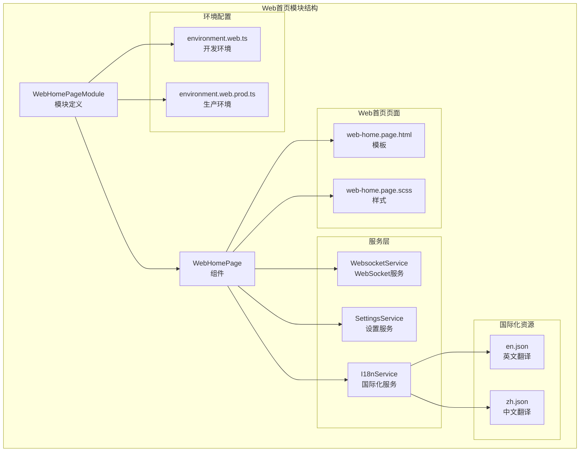

**图表来源**
- [web-home.module.ts:1-22](file://src/app/pages/web-home/web-home.module.ts#L1-L22)
- [web-home.page.ts:1-119](file://src/app/pages/web-home/web-home.page.ts#L1-L119)
- [i18n.service.ts:1-78](file://src/app/services/i18n/i18n.service.ts#L1-L78)

**章节来源**
- [web-home.module.ts:1-22](file://src/app/pages/web-home/web-home.module.ts#L1-L22)
- [web-home.page.ts:1-119](file://src/app/pages/web-home/web-home.page.ts#L1-L119)

## 核心组件

Web首页模块包含以下核心组件和服务：

### WebHomePage组件
WebHomePage是Web平台专用的首页组件，继承了基础的连接管理功能，但针对浏览器环境进行了简化：

- **客户端ID管理**：从SettingsService获取唯一的客户端标识符
- **版本信息显示**：显示"Web Version"标识
- **自动连接**：启动时自动尝试连接
- **连接丢失处理**：实现10秒倒计时自动重连
- **手动重连**：提供重试按钮
- **国际化支持**：使用TranslatePipe实现多语言界面
- ****URL参数解析**：支持?server=查询参数指定服务器地址**（新增）

### WebHomePageModule模块
模块定义了Web首页的依赖注入和组件导出：

- **导入模块**：CommonModule、FormsModule、IonicModule
- **组件导出**：WebHomePage组件
- **路由集成**：与主应用模块集成

### I18nService国际化服务
新增的国际化服务负责管理应用的语言设置和翻译：

- **语言初始化**：设置可用语言和回退语言
- **语言切换**：支持System、English、Chinese三种语言模式
- **语言持久化**：通过SettingsService存储用户语言偏好
- **系统语言探测**：根据浏览器语言自动选择中文或英文

**章节来源**
- [web-home.page.ts:17-82](file://src/app/pages/web-home/web-home.page.ts#L17-L82)
- [web-home.module.ts:10-21](file://src/app/pages/web-home/web-home.module.ts#L10-L21)
- [i18n.service.ts:10-78](file://src/app/services/i18n/i18n.service.ts#L10-L78)

## 架构概览

Web首页模块采用分层架构设计，与原生首页模块形成互补关系：

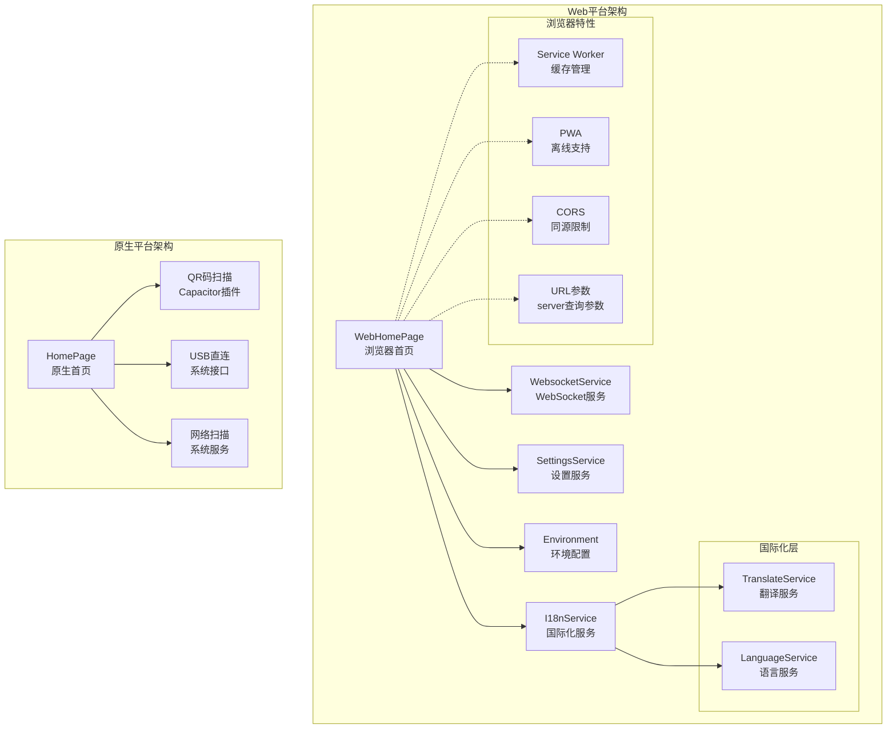

**图表来源**
- [web-home.page.ts:32-47](file://src/app/pages/web-home/web-home.page.ts#L32-L47)
- [home.page.ts:39-139](file://src/app/pages/home/home.page.ts#L39-L139)
- [i18n.service.ts:16-17](file://src/app/services/i18n/i18n.service.ts#L16-L17)

## 详细组件分析

### WebHomePage组件详细分析

WebHomePage组件实现了浏览器环境下的连接管理逻辑：

#### 连接管理流程

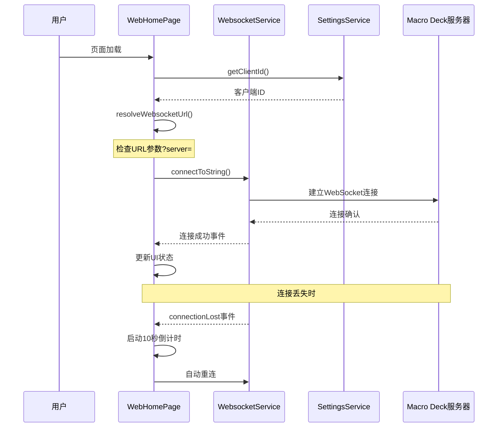

**图表来源**
- [web-home.page.ts:40-79](file://src/app/pages/web-home/web-home.page.ts#L40-L79)
- [websocket.service.ts:141-172](file://src/app/services/websocket/websocket.service.ts#L141-L172)

#### 连接URL构建算法

WebHomePage实现了智能的连接URL构建逻辑，支持URL参数覆盖：

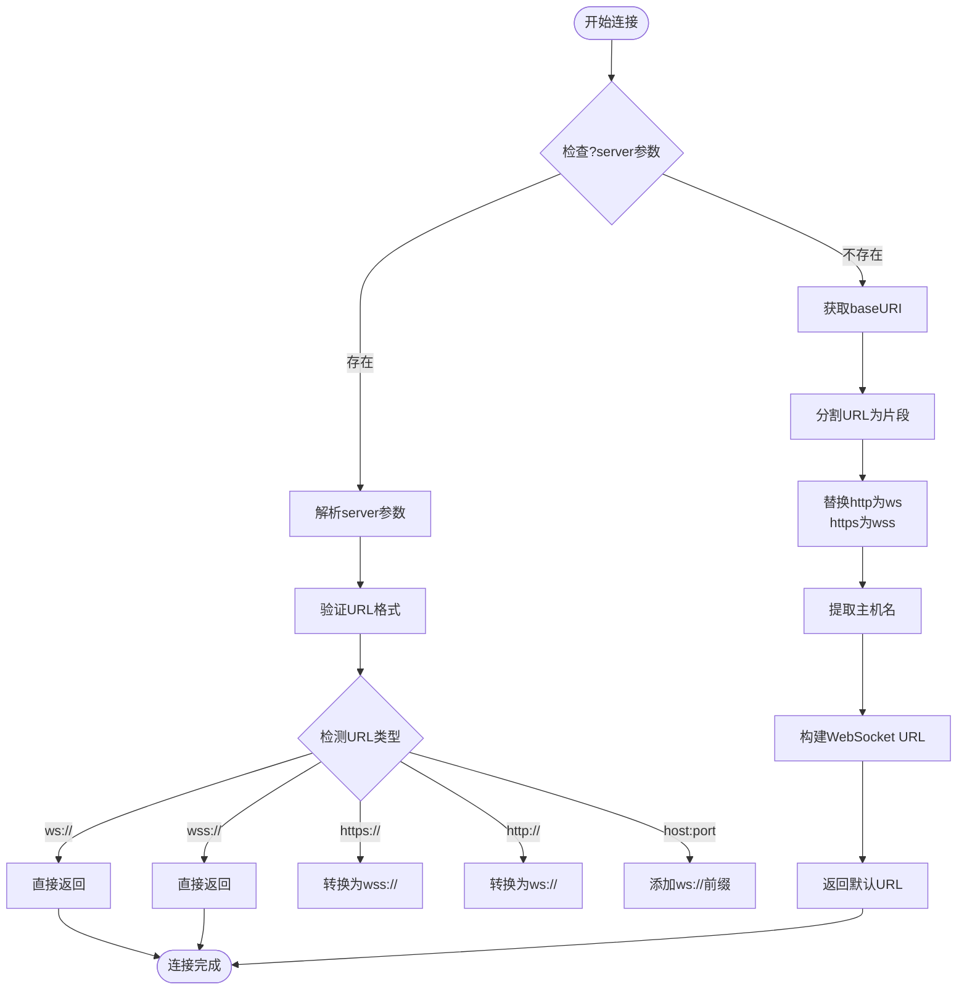

**图表来源**
- [web-home.page.ts:81-92](file://src/app/pages/web-home/web-home.page.ts#L81-L92)
- [web-home.page.ts:100-113](file://src/app/pages/web-home/web-home.page.ts#L100-L113)

#### 连接丢失处理机制

WebHomePage实现了完整的连接丢失恢复机制：

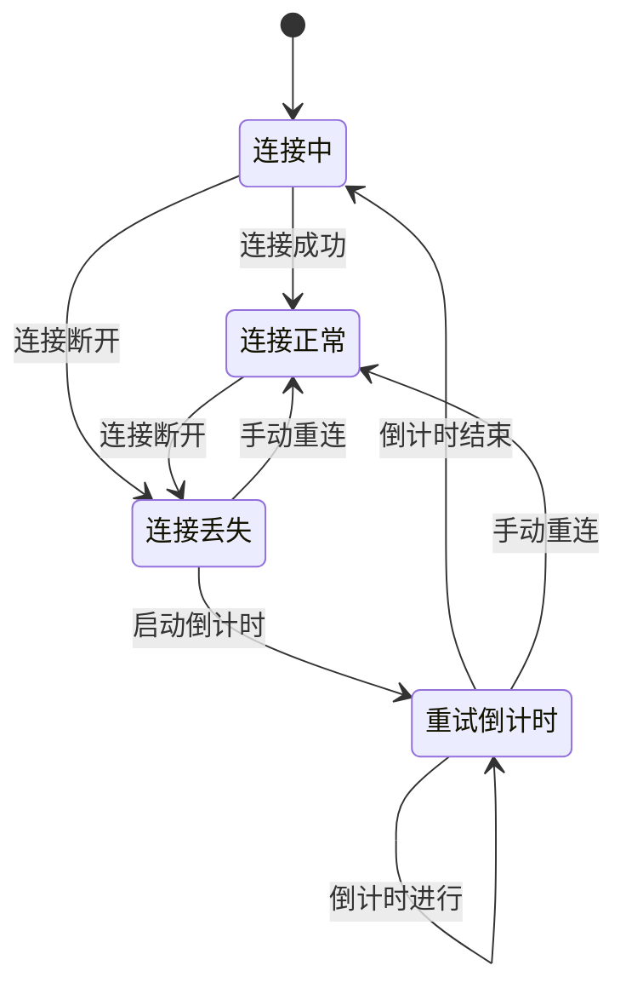

**图表来源**
- [web-home.page.ts:53-62](file://src/app/pages/web-home/web-home.page.ts#L53-L62)
- [web-home.page.ts:121-130](file://src/app/pages/web-home/web-home.page.ts#L121-L130)

**章节来源**
- [web-home.page.ts:68-79](file://src/app/pages/web-home/web-home.page.ts#L68-L79)
- [web-home.page.ts:81-113](file://src/app/pages/web-home/web-home.page.ts#L81-L113)

### I18nService国际化服务分析

I18nService是新增的核心服务，负责管理应用的国际化功能：

#### 语言初始化流程

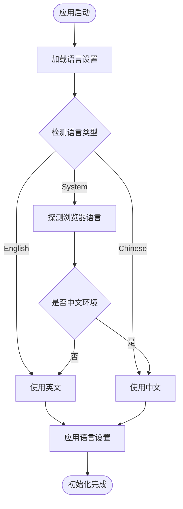

**图表来源**
- [i18n.service.ts:23-28](file://src/app/services/i18n/i18n.service.ts#L23-L28)
- [i18n.service.ts:52-67](file://src/app/services/i18n/i18n.service.ts#L52-L67)

#### 语言切换机制

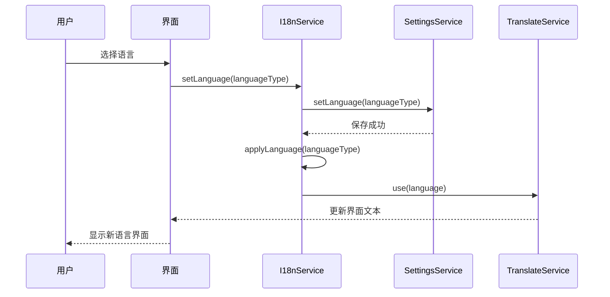

**图表来源**
- [i18n.service.ts:34-37](file://src/app/services/i18n/i18n.service.ts#L34-L37)
- [i18n.service.ts:52-67](file://src/app/services/i18n/i18n.service.ts#L52-L67)

**章节来源**
- [i18n.service.ts:19-45](file://src/app/services/i18n/i18n.service.ts#L19-L45)
- [i18n.service.ts:73-76](file://src/app/services/i18n/i18n.service.ts#L73-L76)

### WebsocketService集成分析

WebsocketService在Web首页模块中的特殊处理：

#### Web版本专用错误处理

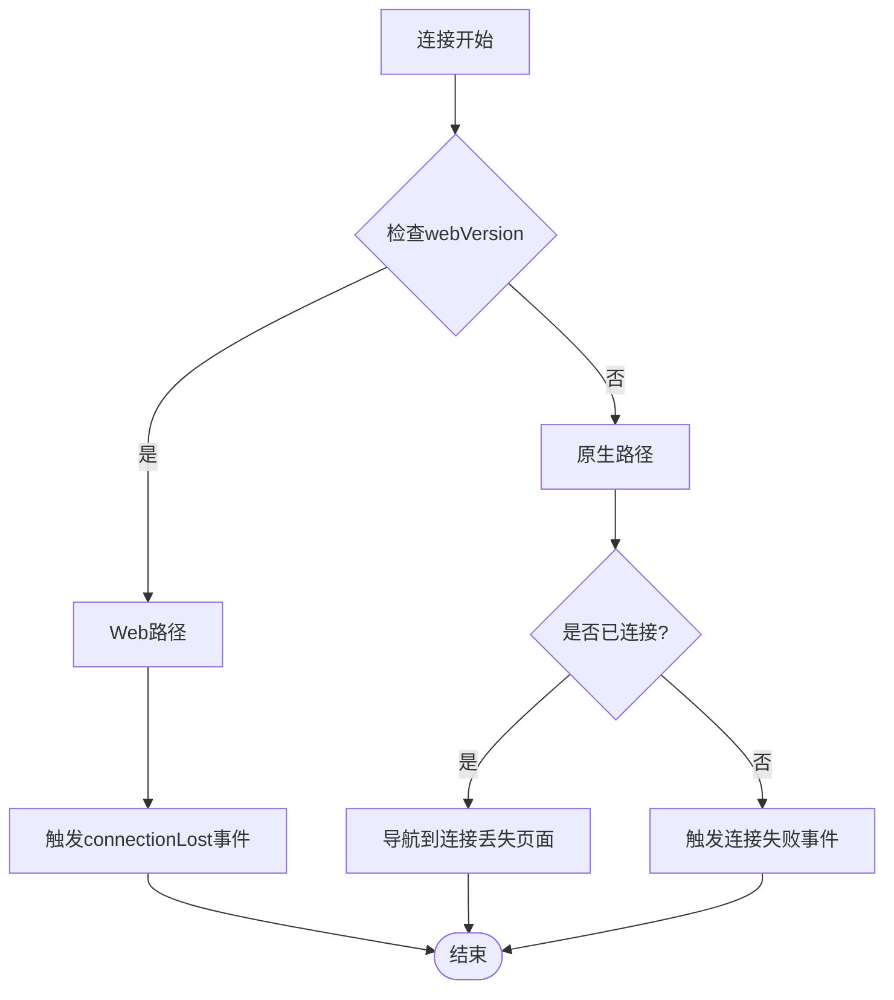

**图表来源**
- [websocket.service.ts:204-219](file://src/app/services/websocket/websocket.service.ts#L204-L219)

**章节来源**
- [websocket.service.ts:204-219](file://src/app/services/websocket/websocket.service.ts#L204-L219)

### 环境配置分析

Web首页模块使用专门的环境配置：

#### 环境变量对比

| 配置项 | Web开发环境 | Web生产环境 | 原生环境 |
|--------|-------------|-------------|----------|
| production | false | true | false/true |
| webVersion | true | true | false |
| version | "3.0.0" | "3.0.0" | 动态获取 |

**章节来源**
- [environment.web.ts:2-9](file://src/environments/environment.web.ts#L2-L9)

### PWA和Service Worker集成

Web首页模块充分利用了现代浏览器的PWA特性：

#### Service Worker缓存策略

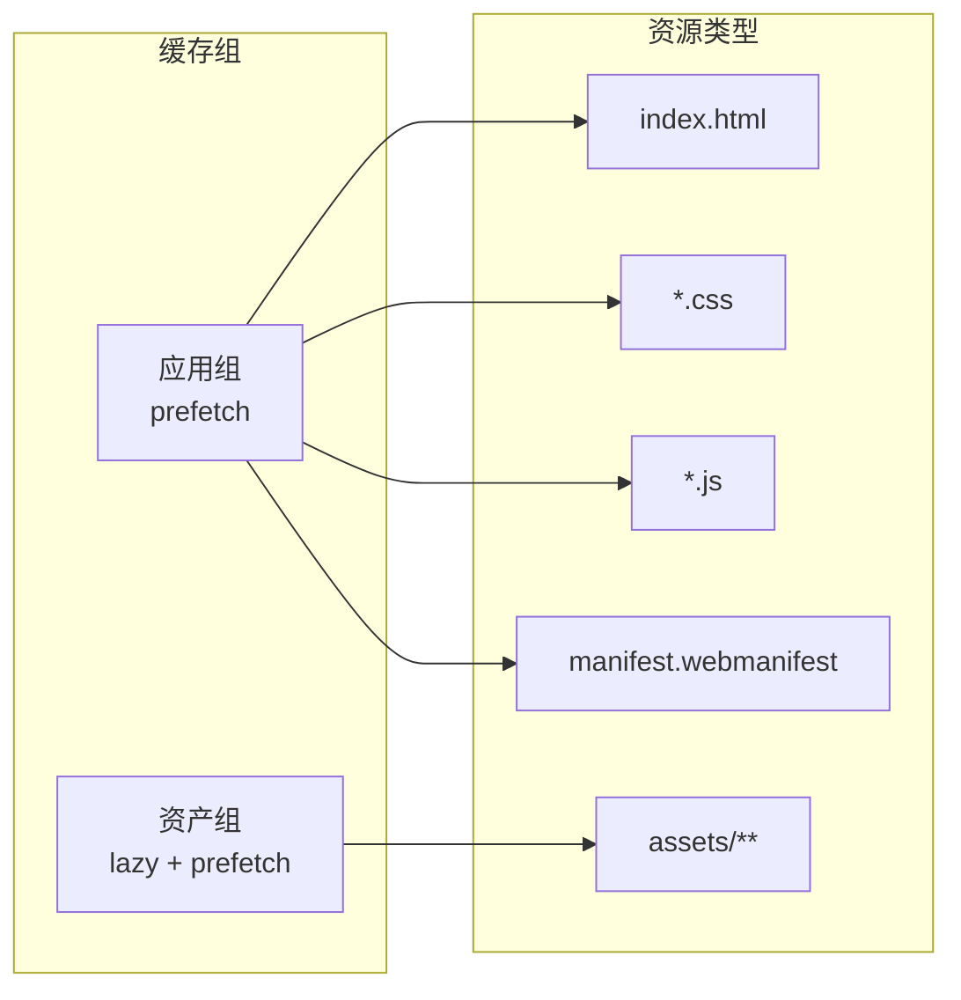

**图表来源**
- [ngsw-config.json:4-29](file://src/ngsw-config.json#L4-L29)

**章节来源**
- [ngsw-config.json:1-31](file://src/ngsw-config.json#L1-L31)
- [manifest.webmanifest:1-48](file://src/manifest.webmanifest#L1-L48)

## 国际化服务集成

**新增功能** Web首页模块集成了完整的国际化服务，支持多语言界面显示，为用户提供本地化的用户体验。

### 国际化架构设计

Web首页模块的国际化架构基于Angular的@ngx-translate库，实现了以下核心功能：

#### 多语言支持范围

| 语言 | 文件名 | 支持程度 | 翻译完整性 |
|------|--------|----------|------------|
| 英语 | en.json | 完整支持 | 100% |
| 中文 | zh.json | 完整支持 | 100% |
| 日语 | ja.json | 待添加 | 0% |
| 韩语 | ko.json | 待添加 | 0% |

#### 翻译键值结构

Web首页模块使用了专门的翻译键值结构：

```mermaid
graph TB
subgraph "翻译键值结构"
WEBHOME[webHome<br/>Web首页专用]
COMMON[common<br/>通用词汇]
SETTINGS[settings<br/>设置相关]
HOME[home<br/>首页功能]
ADD_CONN[addConnection<br/>添加连接]
END
```

**图表来源**
- [en.json:104-109](file://src/assets/i18n/en.json#L104-L109)
- [zh.json:104-109](file://src/assets/i18n/zh.json#L104-L109)

### 翻译文件结构分析

#### Web首页专用翻译

Web首页模块包含了专门的翻译键值，用于Web版本特有的界面元素：

| 键值 | 英文原文 | 中文翻译 | 用途 |
|------|----------|----------|------|
| webHome.connectionLost | I lost the connection to the server | 与服务器的连接已断开 | 连接丢失提示 |
| webHome.retryIn | I'll try to reconnect in {{seconds}}... | 将在 {{seconds}} 秒后重试连接... | 重试倒计时显示 |
| webHome.retryNow | Retry now | 立即重试 | 重试按钮文本 |
| webHome.clientId | Client Id | 客户端 ID | 客户端ID显示 |

#### 通用翻译键值

除了Web首页专用翻译外，还复用了其他模块的翻译键值：

| 键值 | 英文原文 | 中文翻译 | 用途 |
|------|----------|----------|------|
| common.loading | Loading... | 加载中... | 加载状态显示 |
| common.ok | OK | 确定 | 确认按钮 |
| common.cancel | Cancel | 取消 | 取消按钮 |
| common.close | Close | 关闭 | 关闭按钮 |

**章节来源**
- [en.json:104-133](file://src/assets/i18n/en.json#L104-L133)
- [zh.json:104-133](file://src/assets/i18n/zh.json#L104-L133)

### 国际化实现细节

#### 翻译管道使用

Web首页页面使用了Angular的TranslatePipe来实现动态翻译：

```html
<!-- 连接丢失标题 -->
<h4>{{ 'webHome.connectionLost' | translate }} 🫤</h4>

<!-- 重试倒计时文本 -->
<p>{{ 'webHome.retryIn' | translate:{ seconds: retryCountdown } }}</p>

<!-- 客户端ID显示 -->
<ion-text class="ms-3">{{version}} | {{ 'webHome.clientId' | translate }}: {{clientId}}</ion-text>
```

#### 语言切换实现

语言切换通过I18nService实现，支持三种语言模式：

1. **System模式**：根据浏览器语言自动选择（中文环境使用中文，其他使用英文）
2. **English模式**：强制使用英文界面
3. **Chinese模式**：强制使用中文界面

**章节来源**
- [web-home.page.html:6-16](file://src/app/pages/web-home/web-home.page.html#L6-L16)
- [i18n.service.ts:52-67](file://src/app/services/i18n/i18n.service.ts#L52-L67)

## URL参数服务器连接功能

**新增功能** Web首页模块现在支持通过URL查询参数手动指定WebSocket服务器地址，显著提高了部署灵活性。

### 功能概述

Web首页模块新增了`?server=`查询参数支持，允许用户在不修改代码的情况下指定自定义服务器地址：

- **参数语法**：`?server=your-server-address`
- **支持格式**：完整的ws/wss地址、http/https地址、裸主机名:端口
- **优先级**：查询参数优先于默认同源连接

### URL参数解析算法

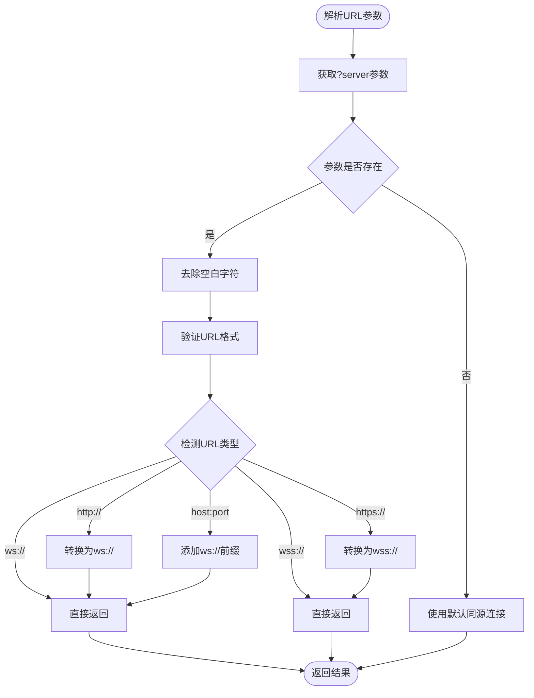

**图表来源**
- [web-home.page.ts:81-113](file://src/app/pages/web-home/web-home.page.ts#L81-L113)

### 支持的URL格式

Web首页模块支持以下多种URL格式：

| 输入格式 | 输出格式 | 说明 |
|----------|----------|------|
| `ws://localhost:8191` | `ws://localhost:8191` | 直接使用 |
| `wss://192.168.1.100:8192` | `wss://192.168.1.100:8192` | 直接使用 |
| `https://macro-deck.local` | `wss://macro-deck.local` | http转wss |
| `http://10.0.0.5:8191` | `ws://10.0.0.5:8191` | http转ws |
| `macro-deck.local:8191` | `ws://macro-deck.local:8191` | 裸主机名 |

### 使用示例

```bash
# 连接到本地开发服务器
https://your-domain.com/?server=localhost:8191

# 连接到远程安全服务器
https://app.your-domain.com/?server=wss://remote-server.com:8192

# 连接到局域网设备
https://dashboard.your-app.com/?server=192.168.1.100:8191
```

### 部署优势

1. **零代码修改**：通过URL参数即可切换服务器
2. **多环境支持**：开发、测试、生产环境可独立配置
3. **灵活部署**：支持CDN、反向代理等复杂部署场景
4. **快速切换**：无需重新构建即可切换目标服务器

**章节来源**
- [web-home.page.ts:68-113](file://src/app/pages/web-home/web-home.page.ts#L68-L113)

## 依赖关系分析

Web首页模块与其他组件的依赖关系：

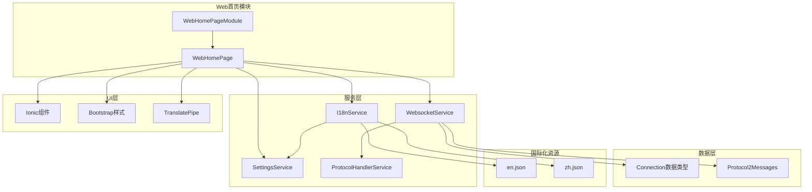

**图表来源**
- [web-home.module.ts:10-21](file://src/app/pages/web-home/web-home.module.ts#L10-L21)
- [web-home.page.ts:32-36](file://src/app/pages/web-home/web-home.page.ts#L32-L36)
- [i18n.service.ts:16-17](file://src/app/services/i18n/i18n.service.ts#L16-L17)

**章节来源**
- [home.module.ts:21-37](file://src/app/pages/home/home.module.ts#L21-L37)
- [home.page.ts:154-192](file://src/app/pages/home/home.page.ts#L154-L192)

## 性能考虑

Web首页模块在性能优化方面采用了多项策略：

### 连接管理优化

1. **智能重连机制**：10秒倒计时避免频繁重连
2. **内存管理**：及时清理定时器和订阅
3. **UI响应性**：异步操作不影响主线程
4. ****URL参数缓存**：解析后的URL可重复使用**（新增）

### 国际化性能优化

1. **翻译文件分离**：多语言文件独立加载，减少初始包大小
2. **按需加载**：只加载当前语言的翻译文件
3. **缓存机制**：翻译内容在内存中缓存，避免重复解析
4. **懒加载策略**：国际化服务在应用启动时初始化

### 缓存策略

1. **预缓存关键资源**：HTML、CSS、JS文件
2. **懒加载静态资源**：图片和其他媒体文件
3. **Service Worker管理**：智能更新策略

### 浏览器兼容性

1. **现代浏览器支持**：基于ES6+和现代API
2. **渐进式增强**：核心功能在旧版浏览器可用
3. **错误降级**：网络异常时提供清晰反馈

## 故障排除指南

### 常见问题及解决方案

#### 连接问题

| 问题症状 | 可能原因 | 解决方案 |
|----------|----------|----------|
| 无法连接服务器 | CORS限制 | 确保服务器支持跨域请求 |
| 连接频繁断开 | 网络不稳定 | 检查网络连接质量 |
| 自动重连无效 | 定时器未清理 | 检查组件生命周期管理 |
| **URL参数不生效** | 参数格式错误 | 检查?server=参数格式**（新增）**

#### 国际化问题

| 问题症状 | 可能原因 | 解决方案 |
|----------|----------|----------|
| 界面文字不显示 | 翻译文件加载失败 | 检查翻译文件路径和格式 |
| 语言切换无效 | 语言设置未保存 | 检查SettingsService存储功能 |
| 系统语言探测错误 | 浏览器语言设置问题 | 检查浏览器语言配置 |
| 翻译键值缺失 | 新功能缺少翻译 | 添加相应的翻译键值 |

#### PWA相关问题

| 问题症状 | 可能原因 | 解决方案 |
|----------|----------|----------|
| 离线功能失效 | Service Worker注册失败 | 清除浏览器缓存重新加载 |
| 更新不生效 | 缓存版本过期 | 强制刷新页面或等待更新 |

#### **URL参数服务器连接问题**

| 问题症状 | 可能原因 | 解决方案 |
|----------|----------|----------|
| 参数被忽略 | URL编码问题 | 检查特殊字符编码 |
| 格式不支持 | 不支持的URL格式 | 使用受支持的格式 |
| 连接超时 | 服务器不可达 | 检查服务器状态 |

**章节来源**
- [web-home.page.ts:53-62](file://src/app/pages/web-home/web-home.page.ts#L53-L62)
- [websocket.service.ts:197-219](file://src/app/services/websocket/websocket.service.ts#L197-L219)

## 结论

Web首页模块为Macro-Deck-Client-App提供了专门的浏览器端解决方案，通过以下方式实现了与原生平台的有效互补：

1. **功能差异化**：专注于浏览器同源连接，简化了复杂的连接管理
2. **用户体验优化**：提供了更简洁的界面和自动重连机制
3. **技术栈适配**：充分利用了现代浏览器的PWA和Service Worker特性
4. **维护成本降低**：共享核心业务逻辑，减少代码重复
5. ****国际化支持增强**：通过I18nService实现了完整的多语言界面支持**（新增）
6. ****部署灵活性增强**：通过URL参数支持实现了零代码修改的服务器切换**（新增）

**更新** 最新的国际化服务集成显著提升了Web版本的用户体验，支持用户根据自己的语言偏好选择界面语言；最新的URL参数服务器连接功能显著提升了Web版本的部署灵活性，使得用户可以在不修改任何代码的情况下轻松切换到不同的服务器实例，这对于多环境部署、CDN配置和动态服务器发现等场景尤为重要。

Web首页模块的成功实施证明了多平台架构的优势，为用户在不同设备上提供了统一的应用体验。

## 附录

### 安装和部署指南

#### Web版本部署要求

1. **服务器配置**：需要支持WebSocket和CORS的HTTP服务器
2. **SSL证书**：生产环境建议使用HTTPS
3. **域名设置**：确保域名解析正确

#### 国际化配置要点

1. **翻译文件**：确保en.json和zh.json文件完整且格式正确
2. **语言检测**：浏览器语言检测基于navigator.language
3. **语言切换**：通过SettingsService持久化用户语言偏好
4. **翻译管道**：在模板中正确使用translate管道

#### PWA配置要点

1. **Service Worker**：确保Angular Service Worker正确配置
2. **清单文件**：验证manifest.webmanifest的完整性
3. **缓存策略**：根据实际需求调整ngsw-config.json

#### **URL参数部署最佳实践**

1. **参数格式**：确保URL参数正确编码，特殊字符使用百分比编码
2. **安全性**：生产环境中建议使用wss://协议确保连接安全
3. **兼容性**：支持多种URL格式以适应不同部署场景
4. **监控**：在部署前验证URL参数解析功能正常工作

**章节来源**
- [package.json:25](file://src/package.json#L25)
- [manifest.webmanifest:1-48](file://src/manifest.webmanifest#L1-L48)
- [ngsw-config.json:1-31](file://src/ngsw-config.json#L1-L31)
- [web-home.page.ts:81-113](file://src/app/pages/web-home/web-home.page.ts#L81-L113)
- [i18n.service.ts:23-28](file://src/app/services/i18n/i18n.service.ts#L23-L28)