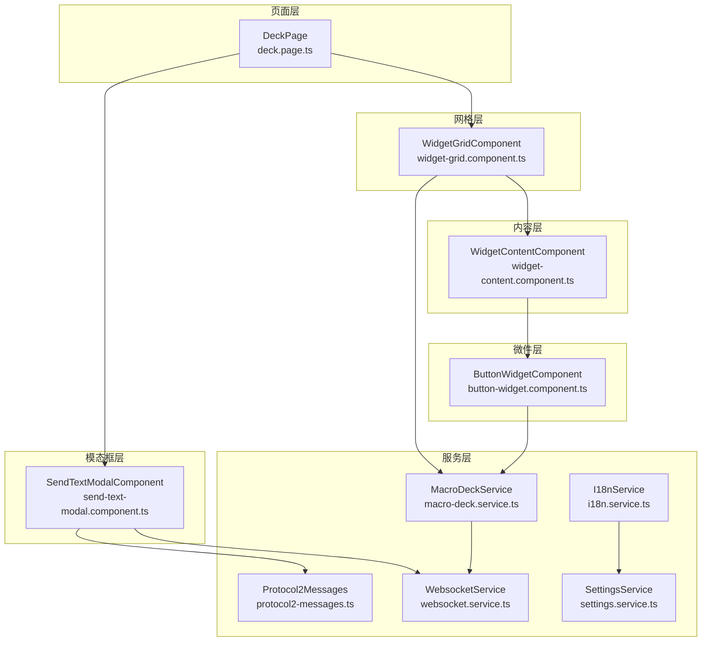
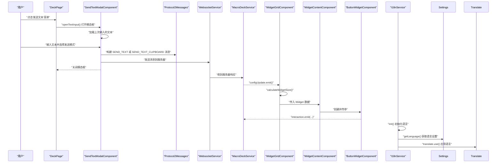
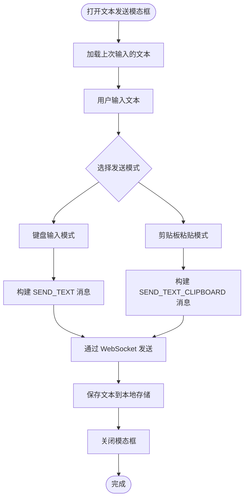
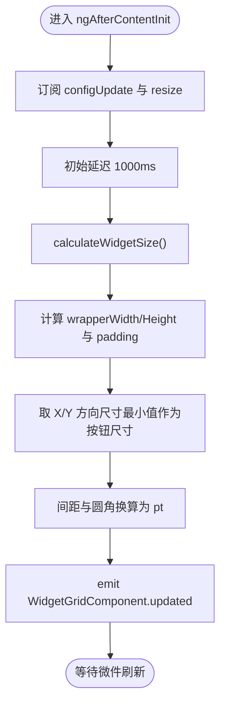
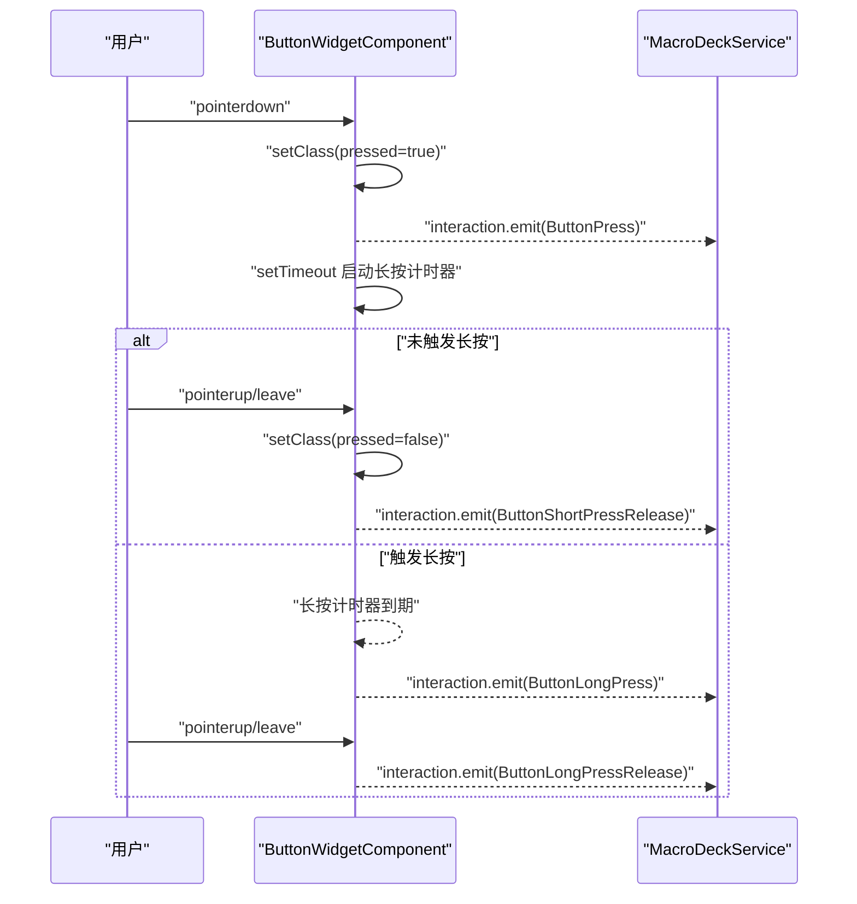
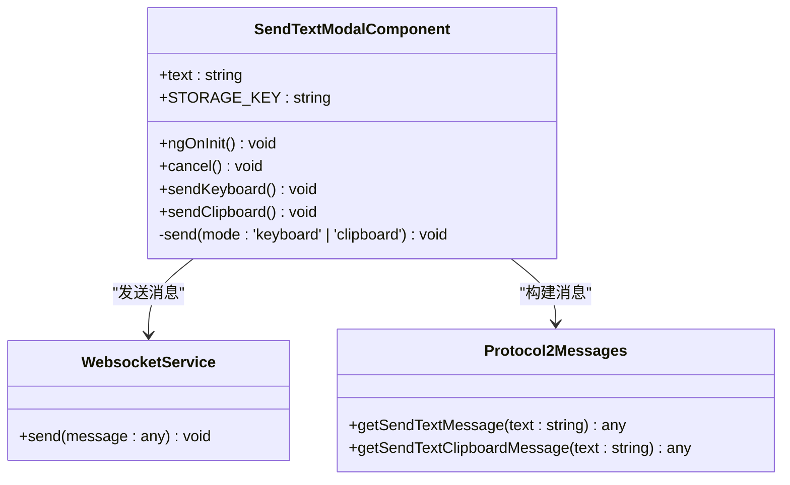
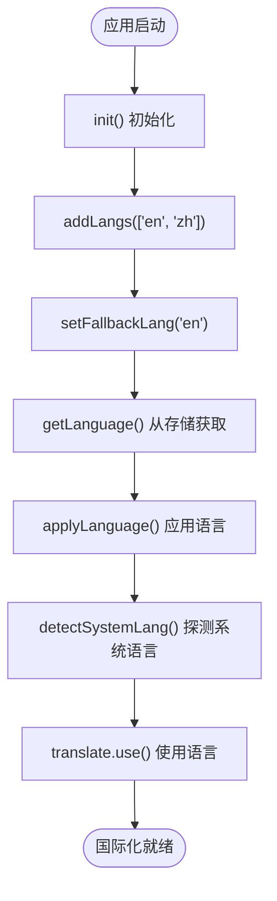
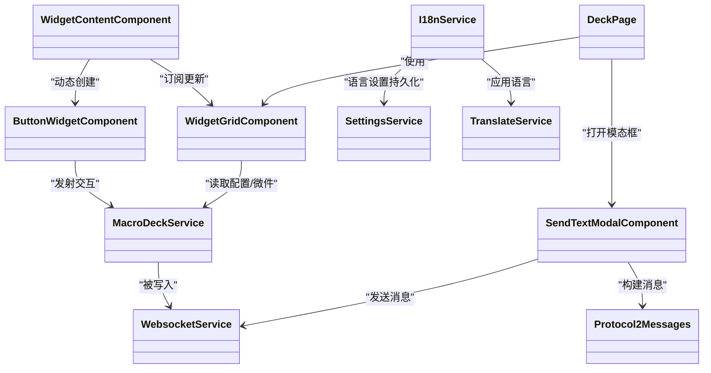

# 控制面板模块

<cite>
**本文档引用的文件**
- [deck.module.ts](file://src/app/pages/deck/deck.module.ts)
- [deck.page.ts](file://src/app/pages/deck/deck.page.ts)
- [deck.page.html](file://src/app/pages/deck/deck.page.html)
- [send-text-modal.component.ts](file://src/app/pages/deck/modals/send-text-modal/send-text-modal.component.ts)
- [send-text-modal.component.html](file://src/app/pages/deck/modals/send-text-modal/send-text-modal.component.html)
- [send-text-modal.component.scss](file://src/app/pages/deck/modals/send-text-modal/send-text-modal.component.scss)
- [widget-grid.component.ts](file://src/app/pages/deck/widget-grid/widget-grid.component.ts)
- [widget-grid.component.html](file://src/app/pages/deck/widget-grid/widget-grid.component.html)
- [widget-content.component.ts](file://src/app/pages/deck/widget-grid/widget-content/widget-content.component.ts)
- [widget-content.component.html](file://src/app/pages/deck/widget-grid/widget-content/widget-content.component.html)
- [button-widget.component.ts](file://src/app/widget-content-components/button-widget/button-widget.component.ts)
- [button-widget.component.html](file://src/app/widget-content-components/button-widget/button-widget.component.html)
- [macro-deck.service.ts](file://src/app/services/macro-deck/macro-deck.service.ts)
- [websocket.service.ts](file://src/app/services/websocket/websocket.service.ts)
- [i18n.service.ts](file://src/app/services/i18n/i18n.service.ts)
- [settings.service.ts](file://src/app/services/settings/settings.service.ts)
- [protocol2-messages.ts](file://src/app/datatypes/protocol2/protocol2-messages.ts)
- [language-type.ts](file://src/app/enums/language-type.ts)
- [settings-modal.component.ts](file://src/app/pages/shared/Modals/settings-modal/settings-modal.component.ts)
- [settings-modal.component.html](file://src/app/pages/shared/Modals/settings-modal/settings-modal.component.html)
- [en.json](file://src/assets/i18n/en.json)
- [zh.json](file://src/assets/i18n/zh.json)
- [app.component.ts](file://src/app/app.component.ts)
- [angular.json](file://angular.json)
- [widget.ts](file://src/app/datatypes/widgets/widget.ts)
- [button-widget.ts](file://src/app/datatypes/widgets/button-widget.ts)
- [widget-content-type.ts](file://src/app/enums/widget-content-type.ts)
- [widget-interaction-type.ts](file://src/app/enums/widget-interaction-type.ts)
</cite>

## 更新摘要
**所做更改**
- 新增文本发送功能章节，详细说明 SendTextModalComponent 的架构设计与实现原理
- 更新 DeckPage 组件，包含 openTextInput() 方法和'发送文本'菜单项集成
- 新增协议2消息处理机制，支持键盘输入和剪贴板粘贴两种文本发送模式
- 完善国际化资源文件，添加文本发送相关的翻译键值
- 扩展控制面板菜单系统，集成新的文本发送入口

## 目录
1. [简介](#简介)
2. [项目结构](#项目结构)
3. [核心组件](#核心组件)
4. [架构总览](#架构总览)
5. [组件详解](#组件详解)
6. [文本发送功能](#文本发送功能)
7. [国际化服务集成](#国际化服务集成)
8. [依赖关系分析](#依赖关系分析)
9. [性能考量](#性能考量)
10. [故障排查指南](#故障排查指南)
11. [结论](#结论)
12. [附录：自定义开发与样式定制](#附录自定义开发与样式定制)

## 简介
本文件系统化梳理 Macro-Deck-Client-App 的控制面板模块，重点围绕 DeckPageModule 的架构设计与组件组织，深入解析主控制面板页面 DeckPage 的功能实现与布局管理；全面阐述 widget-grid 组件系统的实现原理，包括按钮网格的渲染机制、微件的动态加载与交互处理；说明控制面板与 WebSocket 服务的数据绑定关系与实时更新机制；并提供按钮微件的自定义开发指南与样式定制方法，以及响应式设计与触摸交互优化策略。

**更新** 新增文本发送功能，支持通过键盘输入或剪贴板粘贴方式向服务器发送文本内容，集成了完整的模态框界面和用户交互流程。

## 项目结构
控制面板模块位于 src/app/pages/deck 下，采用"页面 + 子组件"的分层组织方式：
- 页面层：DeckPage 负责菜单、全屏、设置弹窗、连接状态检查与全局展示逻辑
- 网格层：WidgetGridComponent 负责网格布局计算、尺寸适配、微件定位与事件广播
- 内容层：WidgetContentComponent 负责根据微件类型动态创建并渲染具体微件组件
- 微件层：ButtonWidgetComponent 等负责具体微件的视觉呈现与交互事件发射
- 模态框层：SendTextModalComponent 负责文本输入和发送功能
- 服务层：MacroDeckService 提供配置与微件数据状态管理；WebsocketService 提供实时通信与消息路由；I18nService 提供国际化语言管理与切换

**图表来源**
- [deck.page.ts:16-41](file://src/app/pages/deck/deck.page.ts#L16-L41)
- [send-text-modal.component.ts:15-23](file://src/app/pages/deck/modals/send-text-modal/send-text-modal.component.ts#L15-L23)
- [widget-grid.component.ts:19-191](file://src/app/pages/deck/widget-grid/widget-grid.component.ts#L19-L191)
- [widget-content.component.ts:10-85](file://src/app/pages/deck/widget-grid/widget-content/widget-content.component.ts#L10-L85)
- [button-widget.component.ts:14-227](file://src/app/widget-content-components/button-widget/button-widget.component.ts#L14-L227)
- [macro-deck.service.ts:6-66](file://src/app/services/macro-deck/macro-deck.service.ts#L6-L66)
- [websocket.service.ts:16-230](file://src/app/services/websocket/websocket.service.ts#L16-L230)
- [i18n.service.ts:14-78](file://src/app/services/i18n/i18n.service.ts#L14-L78)
- [settings.service.ts:28-266](file://src/app/services/settings/settings.service.ts#L28-L266)
- [protocol2-messages.ts:2-48](file://src/app/datatypes/protocol2/protocol2-messages.ts#L2-L48)

**章节来源**
- [deck.module.ts:11-22](file://src/app/pages/deck/deck.module.ts#L11-L22)
- [deck.page.html:1-53](file://src/app/pages/deck/deck.page.html#L1-L53)

## 核心组件
- DeckPage：控制面板主页面，负责菜单、全屏、设置弹窗、连接状态检查与展示；通过注入 WebsocketService、ModalController、SettingsService、DiagnosticService、NavigationService 实现页面行为
- WidgetGridComponent：网格布局核心，监听配置更新与窗口尺寸变化，计算按钮尺寸、间距、圆角，生成每个微件的绝对定位样式，并提供空白占位微件
- WidgetContentComponent：动态内容组件，依据 WidgetContentType 在运行时创建并复用具体微件组件（如 EmptyWidget、ButtonWidget）
- ButtonWidgetComponent：按钮微件的具体实现，负责图标/前景图解码、背景色与边框样式、长按/短按交互事件发射
- SendTextModalComponent：文本发送模态框组件，提供文本输入界面和发送功能，支持键盘输入和剪贴板粘贴两种模式
- MacroDeckService：核心状态服务，维护面板配置（行/列、间距、圆角、背景开关）、微件列表与交互事件发射
- WebsocketService：WebSocket 通信服务，负责连接生命周期、消息订阅与协议处理转发
- I18nService：国际化服务，管理应用语言的初始化、切换与持久化，支持系统语言、英语和中文三种语言模式

**更新** 新增 SendTextModalComponent 作为文本发送功能的核心组件，提供用户友好的文本输入界面和多种发送模式。

**章节来源**
- [deck.page.ts:16-41](file://src/app/pages/deck/deck.page.ts#L16-L41)
- [send-text-modal.component.ts:15-23](file://src/app/pages/deck/modals/send-text-modal/send-text-modal.component.ts#L15-L23)
- [widget-grid.component.ts:19-191](file://src/app/pages/deck/widget-grid/widget-grid.component.ts#L19-L191)
- [widget-content.component.ts:10-85](file://src/app/pages/deck/widget-grid/widget-content/widget-content.component.ts#L10-L85)
- [button-widget.component.ts:14-227](file://src/app/widget-content-components/button-widget/button-widget.component.ts#L14-L227)
- [macro-deck.service.ts:6-66](file://src/app/services/macro-deck/macro-deck.service.ts#L6-L66)
- [websocket.service.ts:16-230](file://src/app/services/websocket/websocket.service.ts#L16-L230)
- [i18n.service.ts:14-78](file://src/app/services/i18n/i18n.service.ts#L14-L78)

## 架构总览
控制面板模块遵循"页面-网格-内容-微件-服务"的分层架构，数据与事件流如下：
- WebSocket 接收来自服务器的配置与微件数据，经协议处理后写入 MacroDeckService
- MacroDeckService 通过 configUpdate 通知 WidgetGridComponent 重新计算布局
- WidgetGridComponent 计算每个微件的绝对定位与尺寸，生成 WidgetContent 的输入数据
- WidgetContentComponent 根据 WidgetContentType 动态创建具体微件组件并传入数据
- ButtonWidgetComponent 等微件组件渲染 UI 并通过 MacroDeckService.interaction 发射交互事件
- DeckPage 展示页面并提供菜单、全屏、设置弹窗等交互入口
- SendTextModalComponent 提供文本发送功能，通过 Protocol2Messages 构建消息并经由 WebsocketService 发送
- I18nService 管理国际化语言切换，SettingsService 持久化语言设置

**图表来源**
- [deck.page.ts:62-68](file://src/app/pages/deck/deck.page.ts#L62-L68)
- [send-text-modal.component.ts:42-50](file://src/app/pages/deck/modals/send-text-modal/send-text-modal.component.ts#L42-L50)
- [protocol2-messages.ts:35-47](file://src/app/datatypes/protocol2/protocol2-messages.ts#L35-L47)
- [websocket.service.ts:101-134](file://src/app/services/websocket/websocket.service.ts#L101-L134)
- [macro-deck.service.ts:36-65](file://src/app/services/macro-deck/macro-deck.service.ts#L36-L65)
- [widget-grid.component.ts:68-86](file://src/app/pages/deck/widget-grid/widget-grid.component.ts#L68-L86)
- [widget-content.component.ts:45-79](file://src/app/pages/deck/widget-grid/widget-content/widget-content.component.ts#L45-L79)
- [button-widget.component.ts:383-391](file://src/app/widget-content-components/button-widget/button-widget.component.ts#L383-L391)
- [i18n.service.ts:23-28](file://src/app/services/i18n/i18n.service.ts#L23-L28)

## 组件详解

### DeckPage：主控制面板页面
- 职责
  - 连接状态检查：若未连接则导航至首页
  - 展示信息：读取客户端 ID 与应用版本
  - 设置弹窗：打开设置并重新加载设置
  - 全屏模式：请求全屏
  - 文本发送：打开文本输入模态框
  - 菜单按钮：根据设置决定是否显示悬浮菜单按钮
- 与服务交互
  - WebsocketService：检查连接状态、关闭连接
  - ModalController：打开设置弹窗和文本发送弹窗
  - SettingsService：读取客户端 ID、版本、菜单按钮显示设置
  - DiagnosticService：获取版本号
  - NavigationService：导航到首页或连接丢失页

**更新** 新增 openTextInput() 方法，用于打开文本发送模态框，集成到菜单系统中。

**章节来源**
- [deck.page.ts:16-41](file://src/app/pages/deck/deck.page.ts#L16-L41)
- [deck.page.ts:62-68](file://src/app/pages/deck/deck.page.ts#L62-L68)
- [deck.page.html:20-23](file://src/app/pages/deck/deck.page.html#L20-L23)

### SendTextModalComponent：文本发送模态框
- 职责
  - 文本输入：提供多行文本输入区域，支持自动聚焦
  - 发送模式：支持键盘输入和剪贴板粘贴两种发送模式
  - 本地存储：保存上次输入的文本内容，便于快速编辑
  - 消息构建：使用 Protocol2Messages 构建相应的发送消息
  - 国际化支持：所有界面文本均支持多语言切换
- 核心功能
  - ngOnInit()：从 localStorage 加载上次输入的文本
  - sendKeyboard()：以键盘输入模式发送文本
  - sendClipboard()：以剪贴板粘贴模式发送文本
  - send()：统一的发送逻辑，根据模式构建不同消息
- 数据存储
  - STORAGE_KEY：'send_text_last_input'，用于持久化用户输入的文本
- 消息协议
  - SEND_TEXT：直接键盘输入模式
  - SEND_TEXT_CLIPBOARD：剪贴板粘贴模式

**图表来源**
- [send-text-modal.component.ts:25-28](file://src/app/pages/deck/modals/send-text-modal/send-text-modal.component.ts#L25-L28)
- [send-text-modal.component.ts:34-50](file://src/app/pages/deck/modals/send-text-modal/send-text-modal.component.ts#L34-L50)
- [protocol2-messages.ts:35-47](file://src/app/datatypes/protocol2/protocol2-messages.ts#L35-L47)

**章节来源**
- [send-text-modal.component.ts:15-51](file://src/app/pages/deck/modals/send-text-modal/send-text-modal.component.ts#L15-L51)
- [send-text-modal.component.html:1-30](file://src/app/pages/deck/modals/send-text-modal/send-text-modal.component.html#L1-L30)
- [send-text-modal.component.scss:1-10](file://src/app/pages/deck/modals/send-text-modal/send-text-modal.component.scss#L1-L10)

### WidgetGridComponent：网格布局与渲染
- 职责
  - 监听 MacroDeckService.configUpdate 与窗口 resize，重新计算按钮尺寸、间距与圆角
  - 计算每个微件的绝对定位样式（width、height、top、left），支持跨行跨列
  - 生成空白占位微件以填充空位
  - 广播 WidgetGridComponent.updated 事件，驱动微件组件刷新
- 关键算法
  - 尺寸计算：取容器宽高分别除以列数与行数的商的最小值，保证正方形按钮
  - 间距与圆角：从百分比换算为 pt（px→pt 比例 72/96）
  - 定位：计算网格偏移量，再叠加列/行索引乘以按钮尺寸
- 性能要点
  - 使用 setTimeout 延迟计算，避免视图未渲染完成导致尺寸异常
  - 在布局更新后调用 ApplicationRef.tick() 触发变更检测

**图表来源**
- [widget-grid.component.ts:68-86](file://src/app/pages/deck/widget-grid/widget-grid.component.ts#L68-L86)
- [widget-grid.component.ts:92-116](file://src/app/pages/deck/widget-grid/widget-grid.component.ts#L92-L116)

**章节来源**
- [widget-grid.component.ts:19-191](file://src/app/pages/deck/widget-grid/widget-grid.component.ts#L19-L191)
- [widget-grid.component.html:1-13](file://src/app/pages/deck/widget-grid/widget-grid.component.html#L1-L13)

### WidgetContentComponent：动态内容装载
- 职责
  - 根据 Widget.widgetContentType 动态创建并复用具体微件组件
  - 当内容类型变化时清理旧组件并重建
  - 将 Widget 数据传入具体微件组件实例
- 生命周期
  - 输入属性 data 变化时触发 updateContent
  - 组件销毁时取消订阅

**章节来源**
- [widget-content.component.ts:10-85](file://src/app/pages/deck/widget-grid/widget-content/widget-content.component.ts#L10-L85)
- [widget-content.component.html:1-2](file://src/app/pages/deck/widget-grid/widget-content/widget-content.component.html#L1-L2)

### ButtonWidgetComponent：按钮微件
- 职责
  - 渲染按钮背景色、图标与前景图（Base64 解码为安全 URL）
  - 根据背景色调整边框颜色，支持无边框或彩色边框样式
  - 处理按下/抬起/长按/长按抬起事件，发射交互事件
- 交互流程
  - pointerdown：添加按下样式，发射 ButtonPress，启动长按计时器
  - pointerup/leave：根据是否触发长按发射短按/长按释放事件，清除计时器
- 与服务交互
  - 订阅 WidgetGridComponent.updated 与设置变更事件，自动刷新
  - 通过 MacroDeckService.interaction 发射交互事件

**图表来源**
- [button-widget.component.ts:131-184](file://src/app/widget-content-components/button-widget/button-widget.component.ts#L131-L184)
- [button-widget.component.ts:325-365](file://src/app/widget-content-components/button-widget/button-widget.component.ts#L325-L365)
- [macro-deck.service.ts:13-14](file://src/app/services/macro-deck/macro-deck.service.ts#L13-L14)

**章节来源**
- [button-widget.component.ts:14-227](file://src/app/widget-content-components/button-widget/button-widget.component.ts#L14-L227)
- [button-widget.component.html:1-14](file://src/app/widget-content-components/button-widget/button-widget.component.html#L1-L14)

### 数据模型与枚举
- Widget：描述微件位置、跨行跨列、背景色、内容类型与具体内容
- ButtonWidget：按钮微件内容，包含图标与标签的 Base64 数据
- WidgetContentType：内容类型枚举（empty、button）
- WidgetInteractionType：交互类型枚举（按下、短按释放、长按、长按释放）
- LanguageType：语言类型枚举（System、English、Chinese）

**更新** 新增 LanguageType 枚举，支持系统语言、英语和中文三种语言模式。

**章节来源**
- [widget.ts:4-20](file://src/app/datatypes/widgets/widget.ts#L4-L20)
- [button-widget.ts:3-9](file://src/app/datatypes/widgets/button-widget.ts#L3-L9)
- [widget-content-type.ts:1-12](file://src/app/enums/widget-content-type.ts#L1-L12)
- [widget-interaction-type.ts:1-18](file://src/app/enums/widget-interaction-type.ts#L1-L18)
- [language-type.ts:1-10](file://src/app/enums/language-type.ts#L1-L10)

## 文本发送功能

### SendTextModalComponent：文本发送模态框组件
- 职责
  - 提供用户友好的文本输入界面，支持多行文本编辑
  - 实现两种文本发送模式：键盘输入和剪贴板粘贴
  - 管理文本内容的本地存储，保持用户输入的历史记录
  - 构建符合协议2规范的发送消息对象
- 核心特性
  - 自动聚焦：模态框打开时自动聚焦到文本输入区域
  - 本地持久化：使用 localStorage 保存上次输入的文本内容
  - 双模式发送：支持直接键盘输入和剪贴板粘贴两种方式
  - 国际化支持：完整的英文和中文界面翻译
- 用户交互流程
  - 打开模态框 → 加载历史文本 → 用户编辑 → 选择发送模式 → 发送消息 → 保存历史 → 关闭模态框

**图表来源**
- [send-text-modal.component.ts:15-51](file://src/app/pages/deck/modals/send-text-modal/send-text-modal.component.ts#L15-L51)
- [protocol2-messages.ts:35-47](file://src/app/datatypes/protocol2/protocol2-messages.ts#L35-L47)

**章节来源**
- [send-text-modal.component.ts:15-51](file://src/app/pages/deck/modals/send-text-modal/send-text-modal.component.ts#L15-L51)
- [send-text-modal.component.html:1-30](file://src/app/pages/deck/modals/send-text-modal/send-text-modal.component.html#L1-L30)
- [send-text-modal.component.scss:1-10](file://src/app/pages/deck/modals/send-text-modal/send-text-modal.component.scss#L1-L10)

### 协议2消息处理
- 消息类型
  - SEND_TEXT：直接键盘输入模式，模拟物理键盘按键输入
  - SEND_TEXT_CLIPBOARD：剪贴板粘贴模式，将文本复制到系统剪贴板
- 消息结构
  - Method：消息类型标识符
  - Message：要发送的文本内容
- 消息构建
  - getSendTextMessage()：构建键盘输入消息
  - getSendTextClipboardMessage()：构建剪贴板粘贴消息

**章节来源**
- [protocol2-messages.ts:35-47](file://src/app/datatypes/protocol2/protocol2-messages.ts#L35-L47)

### 菜单系统集成
- 菜单项配置
  - 图标：create-outline（编辑图标）
  - 文本：menu.sendText（国际化键值）
  - 事件：openTextInput() 方法绑定
- 显示条件
  - 始终显示，不受环境限制
  - 与其他菜单项保持一致的样式和行为

**章节来源**
- [deck.page.html:20-23](file://src/app/pages/deck/deck.page.html#L20-L23)
- [deck.page.ts:62-68](file://src/app/pages/deck/deck.page.ts#L62-L68)

### 国际化支持
- 翻译键值
  - menu.sendText：菜单项文本
  - sendText.title：模态框标题
  - sendText.placeholder：输入框占位符
  - sendText.sendKeyboard：键盘输入按钮文本
  - sendText.sendClipboard：剪贴板粘贴按钮文本
- 语言支持
  - 英文：完整的英文界面翻译
  - 中文：完整的中文界面翻译

**章节来源**
- [en.json:51-59](file://src/assets/i18n/en.json#L51-L59)
- [zh.json:51-59](file://src/assets/i18n/zh.json#L51-L59)

## 国际化服务集成

### I18nService：国际化核心服务
- 职责
  - 初始化语言设置：配置可用语言与回退语言，应用用户已保存的语言设置
  - 语言切换：支持系统语言、英语、中文三种模式的动态切换
  - 语言持久化：将用户选择的语言设置保存到本地存储
  - 系统语言探测：根据浏览器语言自动选择对应语言
- 核心功能
  - init()：应用启动时初始化国际化配置
  - setLanguage()：切换语言并持久化设置
  - getLanguage()：获取当前保存的语言设置
  - applyLanguage()：根据语言类型应用实际语言代码
  - detectSystemLang()：探测系统/浏览器语言

**图表来源**
- [i18n.service.ts:23-28](file://src/app/services/i18n/i18n.service.ts#L23-L28)
- [i18n.service.ts:52-67](file://src/app/services/i18n/i18n.service.ts#L52-L67)
- [i18n.service.ts:73-76](file://src/app/services/i18n/i18n.service.ts#L73-L76)

**章节来源**
- [i18n.service.ts:14-78](file://src/app/services/i18n/i18n.service.ts#L14-L78)

### SettingsService：语言设置持久化
- 职责
  - 语言设置存储：将用户选择的语言类型保存到本地存储
  - 语言设置读取：从本地存储获取用户的语言偏好设置
  - 默认值处理：未设置时默认返回 System（跟随系统）
- 存储键名：language
- 默认值：LanguageType.System

**章节来源**
- [settings.service.ts:38-48](file://src/app/services/settings/settings.service.ts#L38-L48)

### 应用启动流程集成
- AppComponent：应用根组件，在 ngOnInit 中执行初始化序列
- 初始化顺序
  1. storage.create()：初始化本地存储
  2. i18nService.init()：初始化国际化服务
  3. screenOrientationService.updateScreenOrientation()：更新屏幕方向
  4. wakeLockService.updateWakeLock()：更新屏幕常亮设置
  5. themeService.updateTheme()：更新主题设置

**章节来源**
- [app.component.ts:48-70](file://src/app/app.component.ts#L48-L70)

### 设置弹窗中的语言切换
- SettingsModalComponent：设置弹窗组件，提供语言选择界面
- 语言选择选项
  - 0：System（跟随系统）
  - 1：English（英语）
  - 2：Chinese（中文）
- 实时切换机制
  - 选择语言后立即调用 i18nService.setLanguage()
  - 语言设置同时持久化到本地存储
  - 界面立即切换到所选语言

**章节来源**
- [settings-modal.component.ts:104-105](file://src/app/pages/shared/Modals/settings-modal/settings-modal.component.ts#L104-L105)
- [settings-modal.component.html:72-77](file://src/app/pages/shared/Modals/settings-modal/settings-modal.component.html#L72-L77)

### 国际化资源文件
- 文件结构：src/assets/i18n/
- 支持语言：en.json（英语）、zh.json（中文）
- 翻译键值：按功能模块组织（common、settings、menu、home、sendText 等）
- 插值支持：支持参数插值，如 connectionLostPage.retryIn 中的 seconds 参数

**章节来源**
- [en.json:1-156](file://src/assets/i18n/en.json#L1-L156)
- [zh.json:1-156](file://src/assets/i18n/zh.json#L1-L156)

### 模板中的国际化使用
- 管道语法：{{ 'key' | translate }}
- 插值语法：{{ 'key' | translate:{ param: value } }}
- 示例
  - 菜单项：'menu.openFullScreen' | translate
  - 设置标题：'settings.title' | translate
  - 连接重试：'connectionLostPage.retryIn' | translate:{ seconds: retryCountdown }
  - 文本发送：'sendText.title' | translate

**章节来源**
- [deck.page.html:13](file://src/app/pages/deck/deck.page.html#L13)
- [send-text-modal.component.html:6](file://src/app/pages/deck/modals/send-text-modal/send-text-modal.component.html#L6)
- [settings-modal.component.html:6](file://src/app/pages/shared/Modals/settings-modal/settings-modal.component.html#L6)
- [home.page.html:5](file://src/app/pages/home/home.page.html#L5)

## 依赖关系分析
- 组件耦合
  - WidgetGridComponent 依赖 MacroDeckService 的配置与微件列表，同时向外广播布局更新事件
  - WidgetContentComponent 依赖 WidgetContentType 枚举，动态创建子组件
  - ButtonWidgetComponent 依赖 SettingsService 与 MacroDeckService，订阅布局更新事件
  - SendTextModalComponent 依赖 WebsocketService 与 Protocol2Messages，独立于其他组件
  - I18nService 依赖 SettingsService 进行语言设置持久化
- 服务耦合
  - MacroDeckService 作为状态中心，被多个组件读取与写入
  - WebsocketService 负责消息接收与协议处理，最终写入 MacroDeckService
  - I18nService 作为国际化中心，协调语言设置与界面显示
  - Protocol2Messages 作为消息构建工具，被 SendTextModalComponent 使用
- 外部依赖
  - RxJS 用于事件流与订阅管理
  - Ionic 提供页面、菜单、模态框与全屏能力
  - @ngx-translate/core 提供翻译管道与服务

**图表来源**
- [deck.page.ts:16-41](file://src/app/pages/deck/deck.page.ts#L16-L41)
- [send-text-modal.component.ts:15-23](file://src/app/pages/deck/modals/send-text-modal/send-text-modal.component.ts#L15-L23)
- [widget-grid.component.ts:19-191](file://src/app/pages/deck/widget-grid/widget-grid.component.ts#L19-L191)
- [widget-content.component.ts:10-85](file://src/app/pages/deck/widget-grid/widget-content/widget-content.component.ts#L10-L85)
- [button-widget.component.ts:14-227](file://src/app/widget-content-components/button-widget/button-widget.component.ts#L14-L227)
- [macro-deck.service.ts:6-66](file://src/app/services/macro-deck/macro-deck.service.ts#L6-L66)
- [websocket.service.ts:16-230](file://src/app/services/websocket/websocket.service.ts#L16-L230)
- [i18n.service.ts:16-17](file://src/app/services/i18n/i18n.service.ts#L16-L17)
- [protocol2-messages.ts:2-48](file://src/app/datatypes/protocol2/protocol2-messages.ts#L2-L48)

## 性能考量
- 布局计算优化
  - 使用 setTimeout 延迟首次计算，确保视图渲染完成后再测量容器尺寸
  - 在窗口 resize 时延迟重算，减少频繁重排
- 变更检测
  - 布局更新后显式调用 ApplicationRef.tick()，避免脏检查风暴
- 动态组件
  - WidgetContentComponent 在内容类型不变时复用组件实例，减少创建/销毁成本
- 事件订阅
  - 组件销毁时统一取消订阅，防止内存泄漏
- 国际化性能
  - 语言切换采用异步操作，避免阻塞主线程
  - 语言设置持久化使用本地存储，减少网络请求
- 文本发送性能
  - 模态框组件采用独立设计，不影响主页面性能
  - 本地存储操作使用异步 API，避免阻塞用户界面
  - 消息构建采用静态方法，提高性能

**更新** 新增文本发送功能的性能考量，包括模态框独立设计和本地存储优化。

**章节来源**
- [widget-grid.component.ts:68-86](file://src/app/pages/deck/widget-grid/widget-grid.component.ts#L68-L86)
- [widget-content.component.ts:81-85](file://src/app/pages/deck/widget-grid/widget-content/widget-content.component.ts#L81-L85)
- [send-text-modal.component.ts:25-28](file://src/app/pages/deck/modals/send-text-modal/send-text-modal.component.ts#L25-L28)
- [i18n.service.ts:23-28](file://src/app/services/i18n/i18n.service.ts#L23-L28)

## 故障排查指南
- 连接问题
  - WebsocketService 在连接打开时发送连接确认消息；连接关闭时区分正常关闭码与异常关闭码，异常时触发相应事件或导航到连接丢失页
  - 若出现安全错误（如 SSL 不受信），会弹出不安全连接提示
- 页面跳转
  - DeckPage 在页面进入时检查连接状态，未连接则导航至首页
- 交互异常
  - ButtonWidgetComponent 在 pointerup/leave 时统一处理释放逻辑，避免重复发射事件
  - 长按计时器在释放时及时清除，防止后续误判
- 文本发送问题
  - 模态框无法打开：检查 ModalController 是否正确注入
  - 文本无法发送：确认 WebSocket 连接状态和消息格式
  - 本地存储失败：检查浏览器存储权限和存储空间
  - 消息构建错误：验证 Protocol2Messages 方法调用
- 国际化问题
  - 语言初始化失败：检查 I18nService.init() 是否在应用启动早期调用
  - 语言切换无效：确认 SettingsService 正确保存语言设置，TranslateService 正确应用语言
  - 翻译缺失：检查对应的 JSON 文件中是否存在相应的翻译键值

**更新** 新增文本发送功能相关的故障排查指南。

**章节来源**
- [websocket.service.ts:136-230](file://src/app/services/websocket/websocket.service.ts#L136-L230)
- [deck.page.ts:44-52](file://src/app/pages/deck/deck.page.ts#L44-L52)
- [send-text-modal.component.ts:42-50](file://src/app/pages/deck/modals/send-text-modal/send-text-modal.component.ts#L42-L50)
- [button-widget.component.ts:131-184](file://src/app/widget-content-components/button-widget/button-widget.component.ts#L131-L184)
- [i18n.service.ts:23-28](file://src/app/services/i18n/i18n.service.ts#L23-L28)

## 结论
控制面板模块通过清晰的分层架构与事件驱动机制，实现了从 WebSocket 数据到网格布局再到微件渲染与交互的完整链路。WidgetGridComponent 的布局计算与 WidgetContentComponent 的动态装载机制，使得面板具备良好的扩展性与可维护性。结合服务层的状态管理与事件发射，系统能够稳定地实现实时更新与交互反馈。

**更新** 新增的文本发送功能为用户提供了便捷的文本输入和发送能力，支持键盘输入和剪贴板粘贴两种模式，完善了控制面板的交互体验。同时，新增的国际化服务集成为应用提供了完整的多语言支持，包括语言初始化、动态切换与持久化存储，使控制面板能够在不同语言环境下为用户提供一致的用户体验。

## 附录：自定义开发与样式定制

### 自定义按钮微件开发步骤
- 新增微件内容数据结构
  - 在 datatypes/widgets 下新增微件内容接口，继承 WidgetContent 并添加所需字段
- 新增微件组件
  - 在 widget-content-components 下创建新微件组件，实现渲染与交互逻辑
  - 在 widget-content-components.module.ts 中声明并导出新组件
- 注册内容类型
  - 在 enums/widget-content-type.ts 中新增内容类型枚举值
- 在 WidgetContentComponent 中接入
  - 在 updateContent 的 switch 分支中新增 case，创建并传参给新组件
- 在按钮微件样式中集成
  - 如需边框/背景等样式，参考 ButtonWidgetComponent 的样式设置方式

**章节来源**
- [widget-content-type.ts:1-12](file://src/app/enums/widget-content-type.ts#L1-L12)
- [widget-content.component.ts:58-79](file://src/app/pages/deck/widget-grid/widget-content/widget-content.component.ts#L58-L79)
- [button-widget.component.ts:109-124](file://src/app/widget-content-components/button-widget/button-widget.component.ts#L109-L124)

### 样式定制方法
- 按钮边框样式
  - 通过 SettingsService 获取边框样式配置，ButtonWidgetComponent 根据枚举设置 border-radius、边框颜色与内边距
- 背景色与前景图
  - 背景色直接应用到背景层；前景图与图标通过 Base64 解码为安全 URL 后渲染
- 网格间距与圆角
  - WidgetGridComponent 将百分比间距与圆角换算为 pt，应用到微件内容的 margin 与边框半径
- 模态框样式
  - SendTextModalComponent 使用独立的 SCSS 文件，支持自定义文本输入区域和按钮样式

**章节来源**
- [button-widget.component.ts:88-103](file://src/app/widget-content-components/button-widget/button-widget.component.ts#L88-L103)
- [button-widget.component.ts:308-323](file://src/app/widget-content-components/button-widget/button-widget.component.ts#L308-L323)
- [widget-grid.component.ts:278-280](file://src/app/pages/deck/widget-grid/widget-grid.component.ts#L278-L280)
- [send-text-modal.component.scss:1-10](file://src/app/pages/deck/modals/send-text-modal/send-text-modal.component.scss#L1-L10)

### 响应式设计与触摸交互优化
- 响应式布局
  - WidgetGridComponent 监听窗口 resize，延迟重算网格尺寸，确保在不同屏幕尺寸下保持最佳显示效果
- 触摸交互
  - 使用 pointerdown/pointerup/pointerleave 事件替代 mouse 事件，提升触摸设备兼容性
  - 长按交互通过计时器实现，释放时统一处理，避免重复触发
- 模态框交互
  - SendTextModalComponent 使用 Ionic 的模态框组件，自动适配不同设备的交互方式
  - 文本输入区域支持自动聚焦和键盘弹出，优化移动端输入体验

**章节来源**
- [widget-grid.component.ts:74-80](file://src/app/pages/deck/widget-grid/widget-grid.component.ts#L74-L80)
- [button-widget.component.ts:2-4](file://src/app/widget-content-components/button-widget/button-widget.component.ts#L2-L4)
- [button-widget.component.ts:168-184](file://src/app/widget-content-components/button-widget/button-widget.component.ts#L168-L184)
- [send-text-modal.component.html:15](file://src/app/pages/deck/modals/send-text-modal/send-text-modal.component.html#L15)

### 国际化开发指南
- 添加新的翻译键值
  - 在 en.json 和 zh.json 中添加相同的键值结构
  - 确保翻译内容符合目标语言习惯
- 创建新的翻译文件
  - 在 src/assets/i18n/ 下创建新的语言文件（如 fr.json）
  - 在 I18nService 中添加新语言到 SUPPORTED_LANGS 数组
  - 在 LanguageType 中添加新的语言枚举值
- 使用翻译管道
  - 在模板中使用 {{ 'key' | translate }} 语法
  - 支持参数插值：{{ 'key' | translate:{ param: value } }}
- 处理复数形式
  - 使用 ngx-translate 的复数转换功能
  - 在翻译文件中定义适当的复数规则

**更新** 新增国际化开发指南，包括翻译键值添加、新语言文件创建和翻译管道使用。

**章节来源**
- [i18n.service.ts:6-8](file://src/app/services/i18n/i18n.service.ts#L6-L8)
- [language-type.ts:1-10](file://src/app/enums/language-type.ts#L1-L10)
- [en.json:1-156](file://src/assets/i18n/en.json#L1-L156)
- [zh.json:1-156](file://src/assets/i18n/zh.json#L1-L156)

### 文本发送功能扩展指南
- 新增发送模式
  - 在 SendTextModalComponent 中添加新的发送方法
  - 在 Protocol2Messages 中实现新的消息构建方法
  - 更新模态框界面，添加新的发送按钮
- 自定义消息格式
  - 修改 Protocol2Messages 类，支持不同的消息结构
  - 确保消息格式与服务器端协议保持一致
- 扩展本地存储
  - 在 SendTextModalComponent 中添加更多的本地存储键值
  - 实现更复杂的用户输入历史记录管理
- 集成第三方服务
  - 在文本发送流程中集成额外的验证或处理逻辑
  - 支持文本预处理和后处理功能

**更新** 新增文本发送功能的扩展开发指南，帮助开发者自定义和增强文本发送功能。

**章节来源**
- [send-text-modal.component.ts:34-50](file://src/app/pages/deck/modals/send-text-modal/send-text-modal.component.ts#L34-L50)
- [protocol2-messages.ts:35-47](file://src/app/datatypes/protocol2/protocol2-messages.ts#L35-L47)
- [send-text-modal.component.html:19-28](file://src/app/pages/deck/modals/send-text-modal/send-text-modal.component.html#L19-L28)