# 国际化系统

<cite>
**本文档引用的文件**
- [i18n.service.ts](file://src/app/services/i18n/i18n.service.ts)
- [settings.service.ts](file://src/app/services/settings/settings.service.ts)
- [language-type.ts](file://src/app/enums/language-type.ts)
- [en.json](file://src/assets/i18n/en.json)
- [zh.json](file://src/assets/i18n/zh.json)
- [settings-modal.component.ts](file://src/app/pages/shared/modals/settings-modal/settings-modal.component.ts)
- [settings-modal.component.html](file://src/app/pages/shared/modals/settings-modal/settings-modal.component.html)
- [home.page.html](file://src/app/pages/home/home.page.html)
- [web-home.page.html](file://src/app/pages/web-home/web-home.page.html)
- [app.component.ts](file://src/app/app.component.ts)
- [app.module.ts](file://src/app/app.module.ts)
- [update-modal.component.ts](file://src/app/pages/shared/modals/update-modal/update-modal.component.ts)
- [update-modal.component.html](file://src/app/pages/shared/modals/update-modal/update-modal.component.html)
- [update.service.ts](file://src/app/services/update/update.service.ts)
- [package.json](file://package.json)
- [android-signing.env.example](file://scripts/local/android-signing.env.example)
- [android-signing.ps1.example](file://scripts/local/android-signing.ps1.example)
- [build_android_bywin.ps1](file://scripts/windows/build_android_bywin.ps1)
- [build-android.sh](file://scripts/unix/build-android.sh)
- [install_1_base_tools_bywin.ps1](file://scripts/windows/install_1_base_tools_bywin.ps1)
- [install_2_ruby_bywin.ps1](file://scripts/windows/install_2_ruby_bywin.ps1)
- [install_3_fastlane_bywin.ps1](file://scripts/windows/install_3_fastlane_bywin.ps1)
</cite>

## 更新摘要
**所做更改**
- 新增应用程序更新功能的完整本地化支持，包含14个新的翻译键值
- 更新翻译资源文件，涵盖检查更新提示、版本信息显示、下载进度指示和错误消息
- 增强更新模态组件的国际化实现，支持动态版本信息显示
- 完善更新服务的错误处理和用户反馈本地化

## 目录
1. [简介](#简介)
2. [项目结构](#项目结构)
3. [核心组件](#核心组件)
4. [架构概览](#架构概览)
5. [详细组件分析](#详细组件分析)
6. [更新功能国际化](#更新功能国际化)
7. [开发者工具本地化](#开发者工具本地化)
8. [依赖关系分析](#依赖关系分析)
9. [性能考虑](#性能考虑)
10. [故障排除指南](#故障排除指南)
11. [结论](#结论)

## 简介

Macro Deck 客户端应用采用 Angular 19 和 @ngx-translate 实现的国际化系统，支持英语和中文两种语言。该系统通过服务层管理语言设置的持久化和应用，结合 Angular 的依赖注入机制，在应用启动时自动初始化并支持运行时动态切换语言。

**更新** 项目现已全面支持应用程序更新功能的本地化，包括14个新的翻译键值，涵盖检查更新提示、版本信息显示、下载进度指示和错误消息，显著提升了用户体验的一致性和专业性。

## 项目结构

国际化系统主要由以下文件组成：

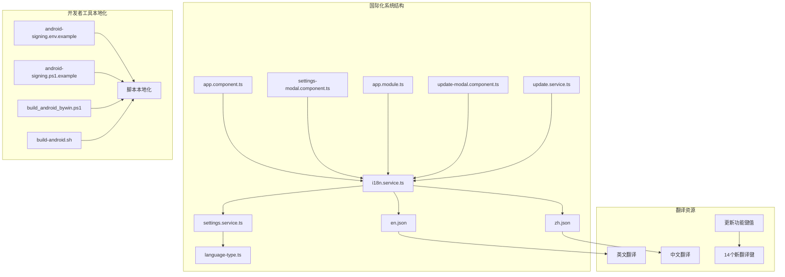

**图表来源**
- [i18n.service.ts:1-78](file://src/app/services/i18n/i18n.service.ts#L1-L78)
- [settings.service.ts:1-283](file://src/app/services/settings/settings.service.ts#L1-L283)
- [language-type.ts:1-10](file://src/app/enums/language-type.ts#L1-L10)
- [update-modal.component.ts:1-62](file://src/app/pages/shared/modals/update-modal/update-modal.component.ts#L1-L62)
- [update.service.ts:1-149](file://src/app/services/update/update.service.ts#L1-L149)

**章节来源**
- [i18n.service.ts:1-78](file://src/app/services/i18n/i18n.service.ts#L1-L78)
- [settings.service.ts:1-283](file://src/app/services/settings/settings.service.ts#L1-L283)
- [language-type.ts:1-10](file://src/app/enums/language-type.ts#L1-L10)

## 核心组件

国际化系统包含以下核心组件：

### 语言类型枚举
定义了三种语言模式：
- System：跟随系统语言
- English：强制使用英语
- Chinese：强制使用中文

### 设置服务
负责语言设置的持久化存储，使用 Ionic Storage 在本地存储语言偏好设置。

### 国际化服务
核心服务，管理语言初始化、切换和应用逻辑。

**章节来源**
- [language-type.ts:1-10](file://src/app/enums/language-type.ts#L1-L10)
- [settings.service.ts:38-48](file://src/app/services/settings/settings.service.ts#L38-L48)
- [i18n.service.ts:14-77](file://src/app/services/i18n/i18n.service.ts#L14-L77)

## 架构概览

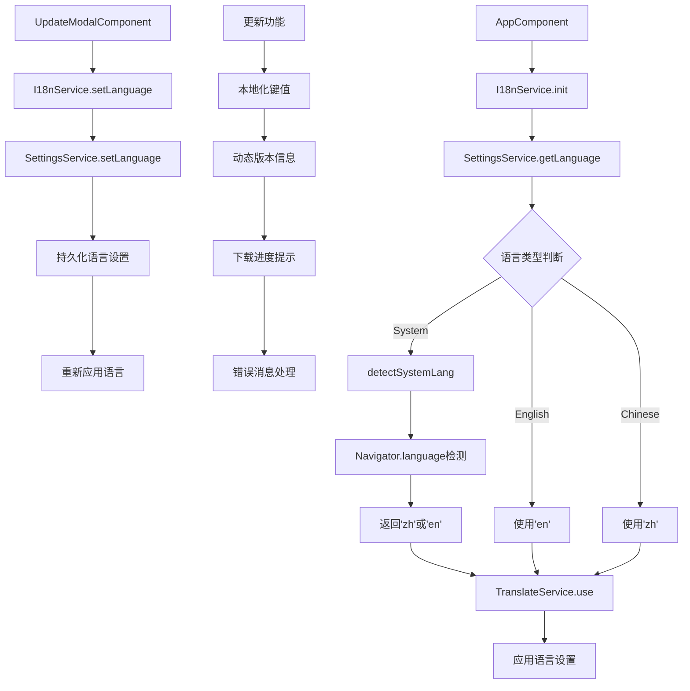

**图表来源**
- [app.component.ts:48-50](file://src/app/app.component.ts#L48-L50)
- [i18n.service.ts:23-28](file://src/app/services/i18n/i18n.service.ts#L23-L28)
- [i18n.service.ts:52-67](file://src/app/services/i18n/i18n.service.ts#L52-L67)
- [settings-modal.component.ts:104-105](file://src/app/pages/shared/modals/settings-modal/settings-modal.component.ts#L104-L105)

## 详细组件分析

### I18nService 详细分析

I18nService 是国际化系统的核心服务，负责语言的初始化、切换和应用。

#### 类结构图

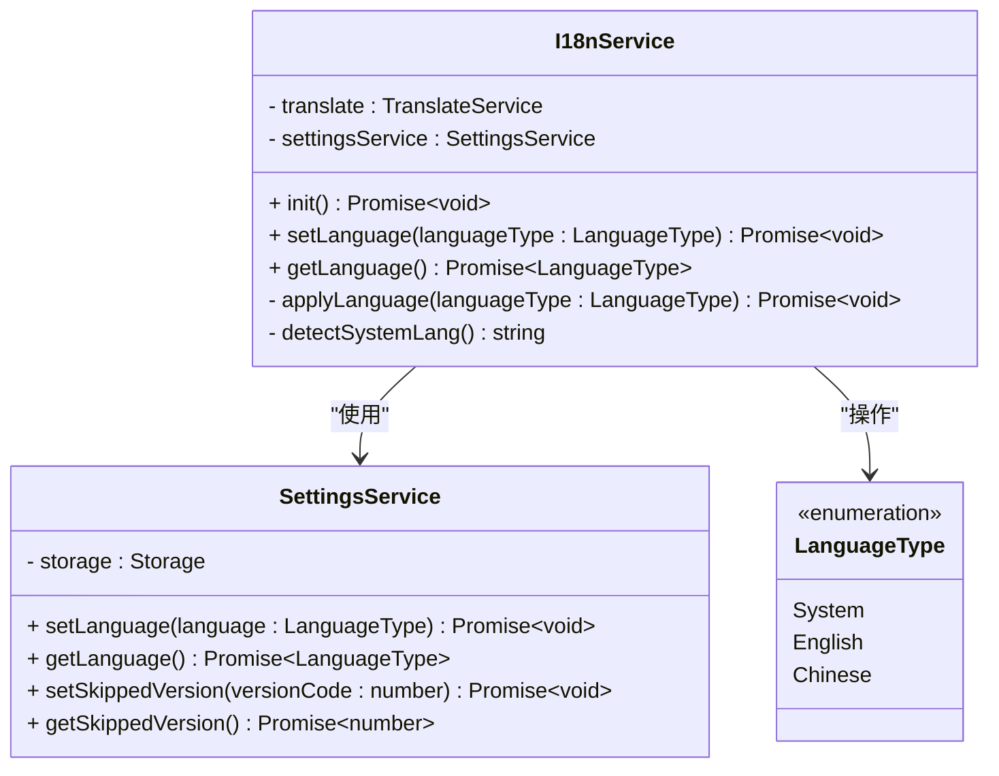

**图表来源**
- [i18n.service.ts:14-77](file://src/app/services/i18n/i18n.service.ts#L14-L77)
- [settings.service.ts:28-48](file://src/app/services/settings/settings.service.ts#L28-L48)
- [language-type.ts:2-9](file://src/app/enums/language-type.ts#L2-L9)

#### 初始化流程

应用启动时的初始化流程如下：

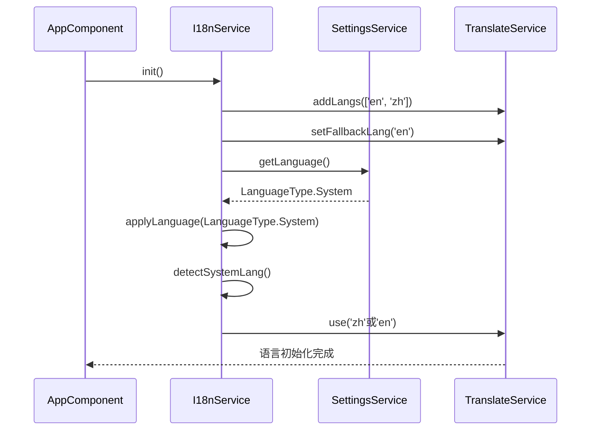

**图表来源**
- [app.component.ts:48-50](file://src/app/app.component.ts#L48-L50)
- [i18n.service.ts:23-28](file://src/app/services/i18n/i18n.service.ts#L23-L28)
- [i18n.service.ts:52-67](file://src/app/services/i18n/i18n.service.ts#L52-L67)

**章节来源**
- [i18n.service.ts:19-28](file://src/app/services/i18n/i18n.service.ts#L19-L28)
- [i18n.service.ts:52-67](file://src/app/services/i18n/i18n.service.ts#L52-L67)

### SettingsService 详细分析

SettingsService 提供了完整的设置管理功能，其中语言设置部分专门处理国际化相关的配置。

#### 语言设置方法

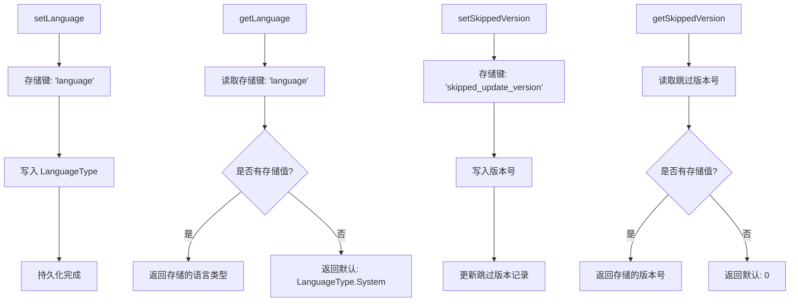

**图表来源**
- [settings.service.ts:38-48](file://src/app/services/settings/settings.service.ts#L38-L48)
- [settings.service.ts:35-49](file://src/app/services/settings/settings.service.ts#L35-L49)

**章节来源**
- [settings.service.ts:38-48](file://src/app/services/settings/settings.service.ts#L38-L48)
- [settings.service.ts:35-49](file://src/app/services/settings/settings.service.ts#L35-L49)

### SettingsModalComponent 详细分析

设置弹窗组件提供了用户界面来修改语言设置，并实时应用更改。

#### 语言设置界面流程

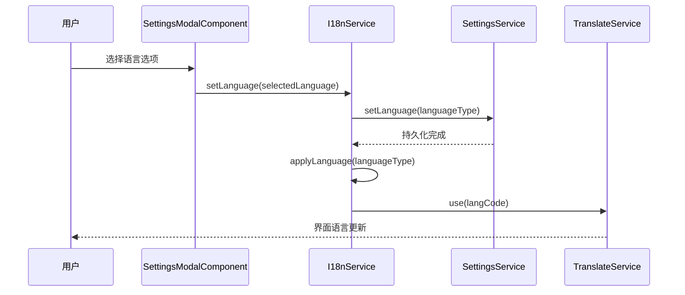

**图表来源**
- [settings-modal.component.ts:104-105](file://src/app/pages/shared/modals/settings-modal/settings-modal.component.ts#L104-L105)
- [i18n.service.ts:34-37](file://src/app/services/i18n/i18n.service.ts#L34-L37)

**章节来源**
- [settings-modal.component.ts:104-105](file://src/app/pages/shared/modals/settings-modal/settings-modal.component.ts#L104-L105)
- [settings-modal.component.html:72-77](file://src/app/pages/shared/modals/settings-modal/settings-modal.component.html#L72-L77)

### 翻译资源文件分析

系统包含两个主要的翻译文件，现已新增更新功能相关的翻译键值：

#### 英文翻译文件 (en.json)
包含 147 行翻译条目，覆盖以下主题：
- common：通用词汇（cancel、save、close等）
- settings：设置相关界面文本
- menu：菜单项
- home：主页内容
- addConnection：连接设置
- update：**新增** 应用程序更新功能的14个翻译键值
- 其他功能模块的界面文本

**新增** update 分组包含以下14个翻译键值：
- checkForUpdate：检查更新
- newVersionFound：发现新版本
- newVersionTitle：版本 {{version}} 可用
- currentVersion：当前版本
- releaseNotes：更新内容
- updateNow：立即更新
- later：稍后
- skipThisVersion：跳过此版本
- downloading：正在下载更新...
- alreadyLatest：已经是最新版本
- downloadFailedTitle：更新失败
- downloadFailedMessage：无法下载更新，请检查网络后重试

#### 中文翻译文件 (zh.json)
包含 147 行翻译条目，对应英文文件的完整中文翻译。

**新增** update 分组包含以下14个翻译键值：
- checkForUpdate：检查更新
- newVersionFound：发现新版本
- newVersionTitle：有新版本 {{version}} 可用
- currentVersion：当前
- releaseNotes：更新内容
- updateNow：立即更新
- later：稍后
- skipThisVersion：跳过此版本
- downloading：正在下载更新...
- alreadyLatest：已经是最新版本
- downloadFailedTitle：更新失败
- downloadFailedMessage：无法下载更新，请检查网络后重试

**章节来源**
- [en.json:132-145](file://src/assets/i18n/en.json#L132-L145)
- [zh.json:132-145](file://src/assets/i18n/zh.json#L132-L145)

## 更新功能国际化

**新增** 项目现已实现完整的应用程序更新功能本地化支持，涵盖14个新的翻译键值。

### 更新模态组件国际化

更新模态组件负责显示新版本信息并提供更新操作选项：

#### 更新模态组件结构

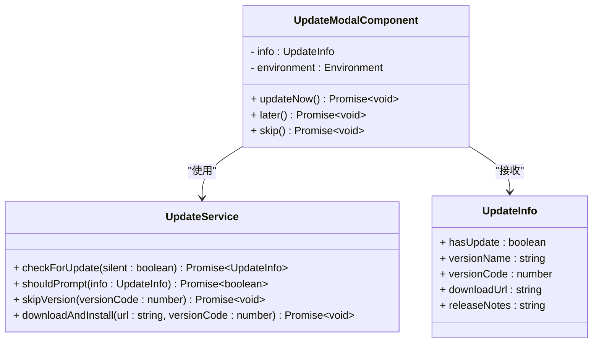

**图表来源**
- [update-modal.component.ts:18-61](file://src/app/pages/shared/modals/update-modal/update-modal.component.ts#L18-L61)
- [update.service.ts:15-27](file://src/app/services/update/update.service.ts#L15-L27)

#### 动态版本信息显示

更新模态组件支持动态版本信息显示，包括当前版本和可用版本的对比：

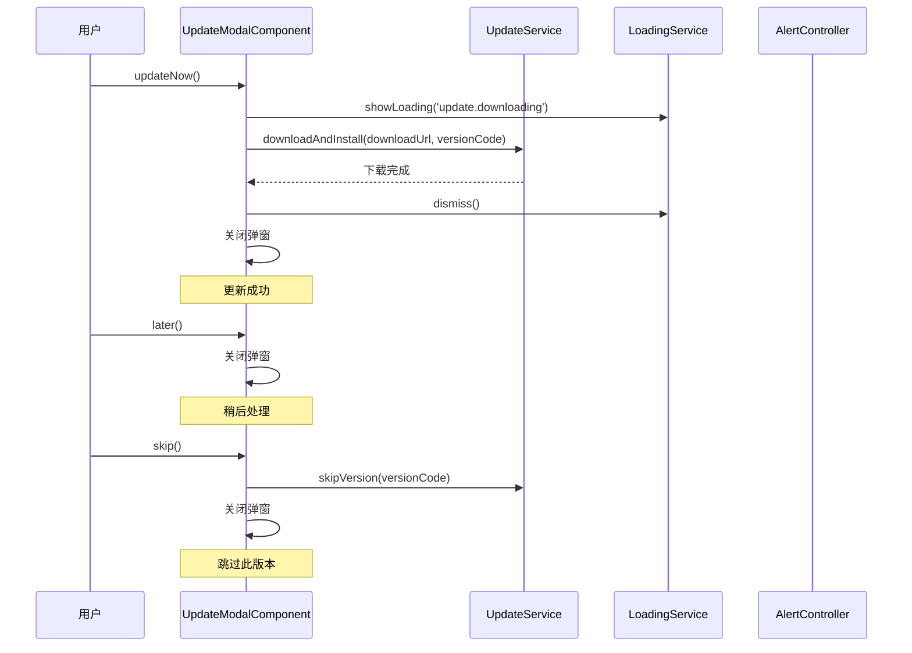

**图表来源**
- [update-modal.component.ts:32-49](file://src/app/pages/shared/modals/update-modal/update-modal.component.ts#L32-L49)
- [update-modal.component.html:26-30](file://src/app/pages/shared/modals/update-modal/update-modal.component.html#L26-L30)

### 更新服务本地化支持

更新服务提供完整的更新检查和处理功能，支持本地化错误消息：

#### 更新检查流程

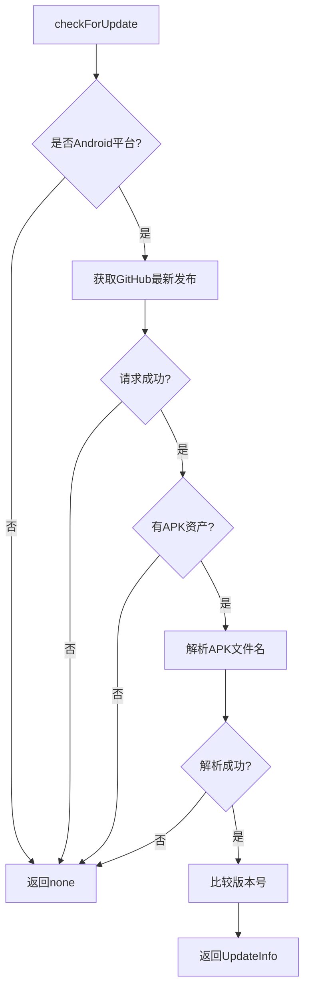

**图表来源**
- [update.service.ts:48-87](file://src/app/services/update/update.service.ts#L48-L87)

#### 错误处理和本地化

更新服务在下载和安装过程中提供本地化的错误处理：

- **下载失败**：显示 "update.downloadFailedTitle" 和 "update.downloadFailedMessage"
- **安装失败**：通过 AlertController 显示本地化错误消息
- **网络超时**：静默处理，不影响应用正常使用

**章节来源**
- [update-modal.component.ts:32-49](file://src/app/pages/shared/modals/update-modal/update-modal.component.ts#L32-L49)
- [update-modal.component.html:1-34](file://src/app/pages/shared/modals/update-modal/update-modal.component.html#L1-34)
- [update.service.ts:48-87](file://src/app/services/update/update.service.ts#L48-L87)

## 开发者工具本地化

**新增** 项目现已实现全面的开发者工具本地化，显著提升中文开发者的使用体验。

### 脚本文件本地化改进

#### Android 签名脚本本地化
- `android-signing.env.example`：提供中文注释和说明
- `android-signing.ps1.example`：包含中文环境变量设置提示
- `build_android_bywin.ps1`：完整的中文构建流程说明

#### Unix/Linux 构建脚本
- `build-android.sh`：包含中文帮助信息和错误提示
- `run-android.sh`、`run-web.sh`、`run-ios.sh`：提供中文开发调试支持

#### Windows 开发工具本地化
- `install_1_base_tools_bywin.ps1`：基础工具安装脚本的中文支持
- `install_2_ruby_bywin.ps1`：Ruby安装脚本的中文提示
- `install_3_fastlane_bywin.ps1`：Fastlane安装脚本的中文说明

### 本地化工具链架构

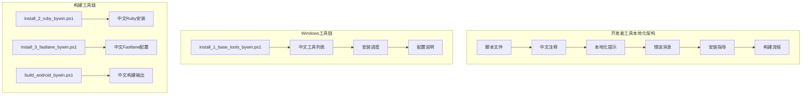

**图表来源**
- [install_1_base_tools_bywin.ps1:1-930](file://scripts/windows/install_1_base_tools_bywin.ps1#L1-L930)
- [install_2_ruby_bywin.ps1:1-173](file://scripts/windows/install_2_ruby_bywin.ps1#L1-L173)
- [install_3_fastlane_bywin.ps1:1-182](file://scripts/windows/install_3_fastlane_bywin.ps1#L1-L182)

### 开发者体验提升

#### 中文提示信息
所有脚本文件现在包含完整的中文注释和提示信息，包括：
- 环境变量设置说明
- 错误诊断信息
- 安装步骤指导
- 构建流程说明

#### 多平台支持
- Windows PowerShell 脚本完全本地化
- Unix/Linux Shell 脚本提供中文支持
- 跨平台兼容的本地化方案

#### 开发工具集成
- Ruby 安装脚本包含中文配置
- Fastlane 配置提供中文说明
- Android 构建流程的中文指导

**章节来源**
- [android-signing.env.example:1-10](file://scripts/local/android-signing.env.example#L1-L10)
- [android-signing.ps1.example:1-16](file://scripts/local/android-signing.ps1.example#L1-L16)
- [build_android_bywin.ps1:1-141](file://scripts/windows/build_android_bywin.ps1#L1-L141)
- [build-android.sh:1-151](file://scripts/unix/build-android.sh#L1-L151)

## 依赖关系分析

### 外部依赖

国际化系统依赖以下外部库：

```mermaid
graph LR
A[Angular 19] --> B[@ngx-translate/core]
A --> C[@ngx-translate/http-loader]
D[Ionic Storage] --> E[本地存储]
F[Capacitor] --> G[原生平台集成]
B --> H[翻译服务]
C --> I[HTTP加载器]
E --> J[设置持久化]
K[开发者工具] --> L[本地化脚本]
L --> M[中文支持]
N[更新功能] --> O[TranslateService]
O --> P[动态键值解析]
```

**图表来源**
- [package.json:46-47](file://package.json#L46-L47)
- [package.json:44](file://package.json#L44)

### 内部依赖关系

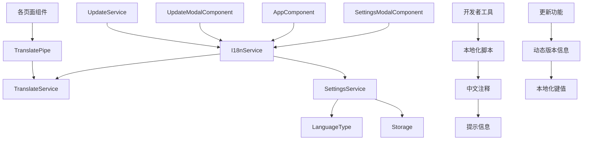

**图表来源**
- [app.module.ts:43-49](file://src/app/app.module.ts#L43-L49)
- [settings-modal.component.ts:64](file://src/app/pages/shared/modals/settings-modal/settings-modal.component.ts#L64)
- [update-modal.component.ts:26-30](file://src/app/pages/shared/modals/update-modal/update-modal.component.ts#L26-L30)

**章节来源**
- [app.module.ts:41-50](file://src/app/app.module.ts#L41-L50)
- [package.json:17-60](file://package.json#L17-L60)

## 性能考虑

### 翻译资源加载优化

1. **按需加载**：使用 @ngx-translate/http-loader 支持按需加载翻译文件
2. **缓存策略**：浏览器自动缓存翻译文件，减少重复请求
3. **回退机制**：设置默认回退语言，确保语言切换的稳定性

### 存储性能

1. **异步操作**：所有存储操作都是异步的，避免阻塞主线程
2. **最小化存储**：只存储必要的语言设置信息
3. **持久化优化**：使用 Ionic Storage 提供的高效存储机制

### 更新功能性能

1. **静默检查**：启动时的更新检查采用静默模式，不影响应用启动速度
2. **条件提示**：只有在有新版本且未被跳过时才显示更新弹窗
3. **缓存机制**：跳过的版本信息存储在本地，避免重复提示

### 开发者工具性能

1. **脚本执行优化**：本地化脚本保持原有执行效率
2. **错误处理优化**：中文错误信息提升调试效率
3. **工具链集成**：本地化工具链减少学习成本

## 故障排除指南

### 常见问题及解决方案

#### 语言切换无效
**症状**：更改语言后界面没有变化
**原因**：TranslateService 未正确应用新语言
**解决方案**：
1. 检查 I18nService.setLanguage 方法是否被调用
2. 确认 SettingsService.setLanguage 已成功持久化
3. 验证 TranslateService.use 是否执行

#### 系统语言检测失败
**症状**：选择 System 语言时显示错误语言
**原因**：navigator.language 返回值不符合预期
**解决方案**：
1. 检查浏览器语言设置
2. 验证 detectSystemLang 方法的逻辑
3. 确认语言代码格式正确（'zh' 或 'en'）

#### 翻译文件加载失败
**症状**：界面显示翻译键而非实际文本
**原因**：翻译文件未正确加载或路径错误
**解决方案**：
1. 检查 assets/i18n/ 目录结构
2. 验证翻译文件的 JSON 格式
3. 确认 app.module.ts 中的翻译加载配置

#### 更新功能本地化问题
**症状**：更新弹窗显示英文而非本地化文本
**原因**：翻译键值缺失或翻译文件未正确加载
**解决方案**：
1. 检查 en.json 和 zh.json 中的 update 分组
2. 确认所有14个更新相关的翻译键值存在
3. 验证 TranslateService 是否正确加载翻译文件
4. 检查 UpdateModalComponent 中的翻译键值使用

#### 跳过版本功能失效
**症状**：用户跳过后仍频繁收到更新提示
**原因**：跳过版本信息未正确存储或读取
**解决方案**：
1. 检查 SettingsService.setSkippedVersion 方法
2. 验证 skipped_update_version 键值的存储
3. 确认 UpdateService.shouldPrompt 的版本比较逻辑
4. 验证本地存储的可用性

#### 下载进度提示问题
**症状**：下载过程中显示英文进度信息
**原因**：下载进度提示未使用翻译服务
**解决方案**：
1. 检查 LoadingService.showLoading 方法
2. 确认使用 TranslateService.instant 获取本地化文本
3. 验证 update.downloading 翻译键值的存在
4. 确认翻译文件的正确加载

#### 开发者工具本地化问题
**症状**：脚本执行时出现英文错误信息
**原因**：本地化脚本未正确加载或环境变量未设置
**解决方案**：
1. 确认脚本文件已正确复制为本地版本
2. 检查环境变量设置是否正确
3. 验证本地化脚本的执行权限
4. 查看脚本中的中文注释是否正常显示

**章节来源**
- [i18n.service.ts:73-76](file://src/app/services/i18n/i18n.service.ts#L73-L76)
- [app.module.ts:43-49](file://src/app/app.module.ts#L43-L49)
- [update-modal.component.ts:32-49](file://src/app/pages/shared/modals/update-modal/update-modal.component.ts#L32-L49)
- [settings.service.ts:35-49](file://src/app/services/settings/settings.service.ts#L35-L49)

## 结论

Macro Deck 客户端应用的国际化系统设计合理，实现了以下关键特性：

1. **完整的多语言支持**：支持英语和中文两种语言
2. **灵活的语言选择**：支持跟随系统、强制英语、强制中文三种模式
3. **持久化的设置管理**：使用 Ionic Storage 保存用户语言偏好
4. **高效的运行时切换**：支持应用运行时动态切换语言
5. **清晰的架构分离**：服务层、设置层和界面层职责明确
6. **全面的更新功能本地化**：新增14个翻译键值，支持完整的更新流程本地化
7. **智能的更新提示机制**：支持跳过版本功能，避免重复提示
8. **完善的错误处理**：本地化的错误消息和用户反馈
9. **全面的开发者工具本地化**：脚本文件实现中文支持，显著提升中文开发者体验
10. **跨平台工具链集成**：Windows、Unix/Linux 平台的本地化工具链
11. **动态版本信息支持**：更新模态组件支持动态版本号和更新说明显示

**更新** 最新的更新功能本地化改进显著增强了用户体验，包括：
- 完整的14个翻译键值覆盖更新流程的所有环节
- 动态版本信息显示，支持当前版本与可用版本的对比
- 智能的更新提示控制，避免重复打扰用户
- 本地化的下载进度和错误消息处理
- 跳过版本功能的完整本地化支持

该系统为用户和开发者都提供了良好的国际化体验，同时保持了代码的可维护性和扩展性。通过持续的本地化改进和质量保证机制，项目正逐步完善对全球开发者的支持。