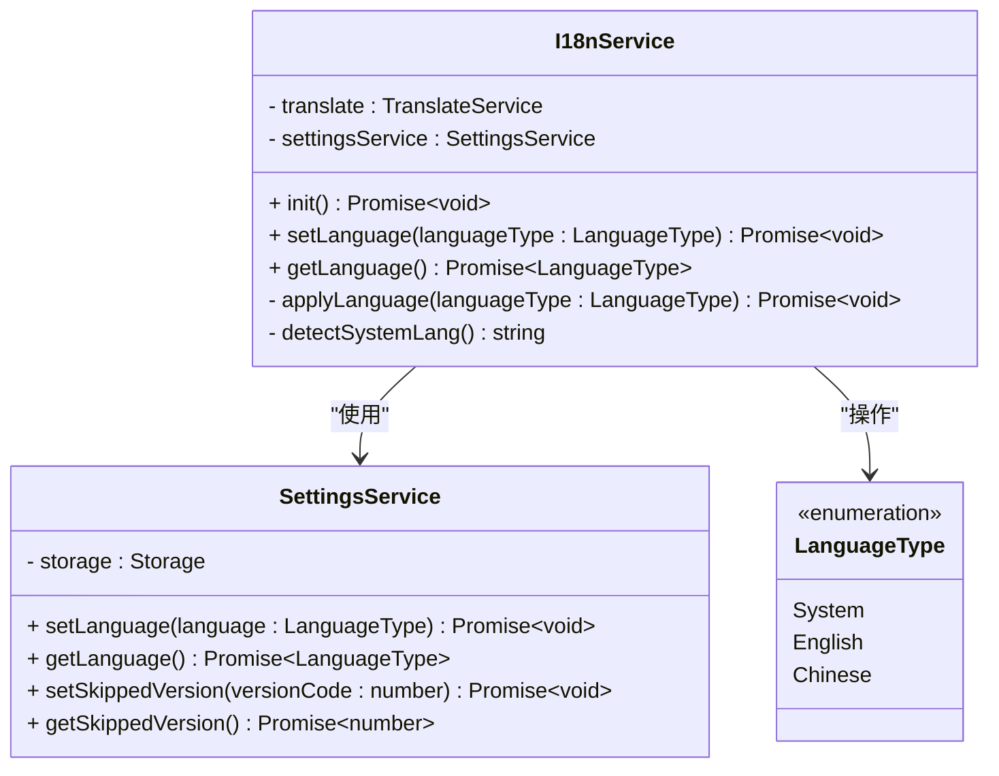
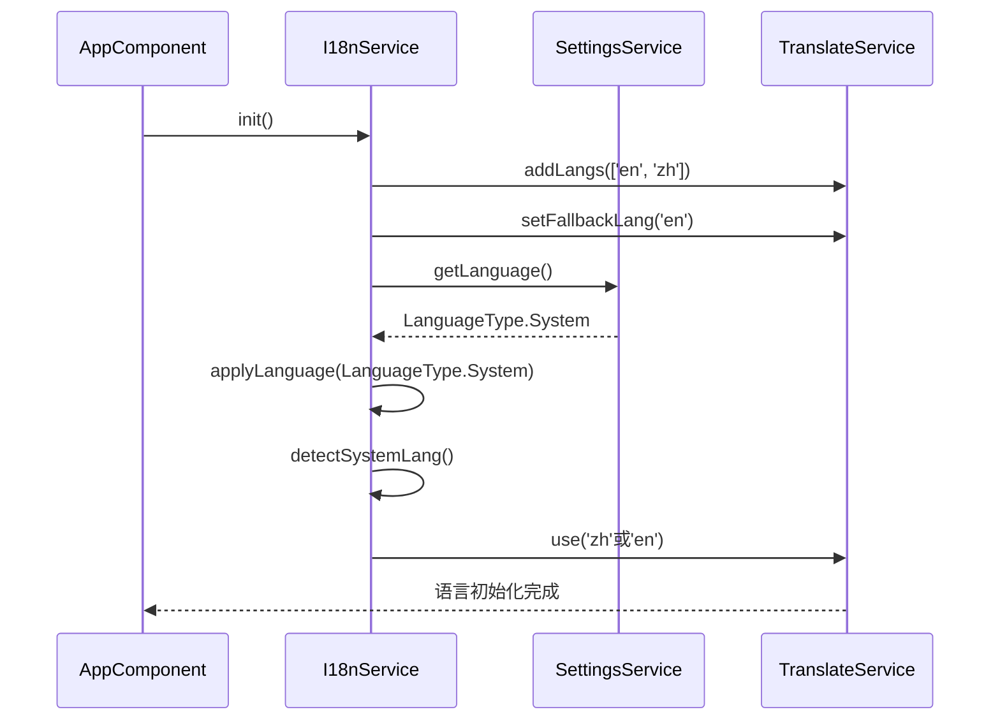
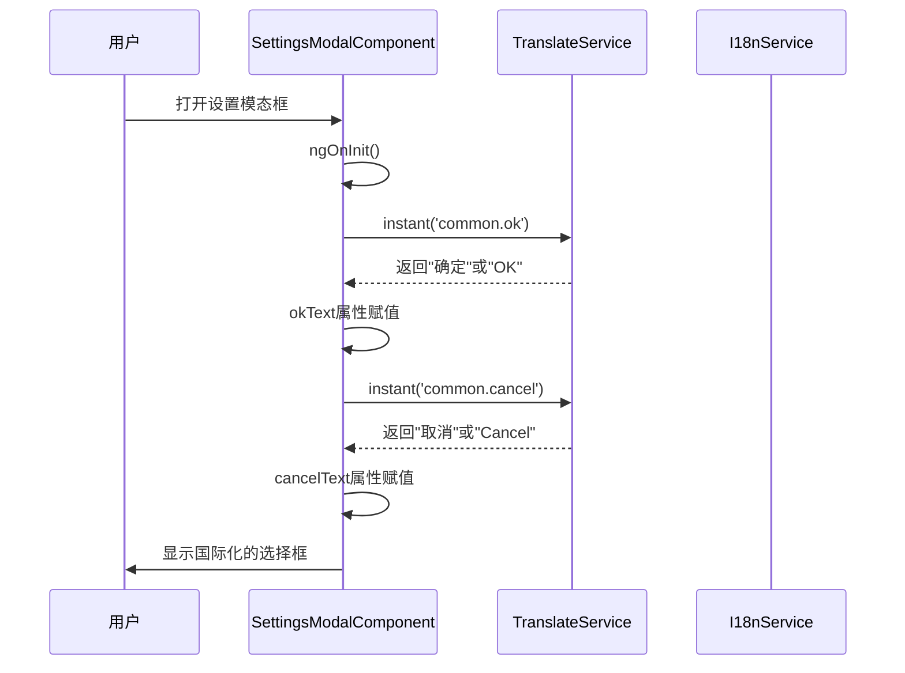
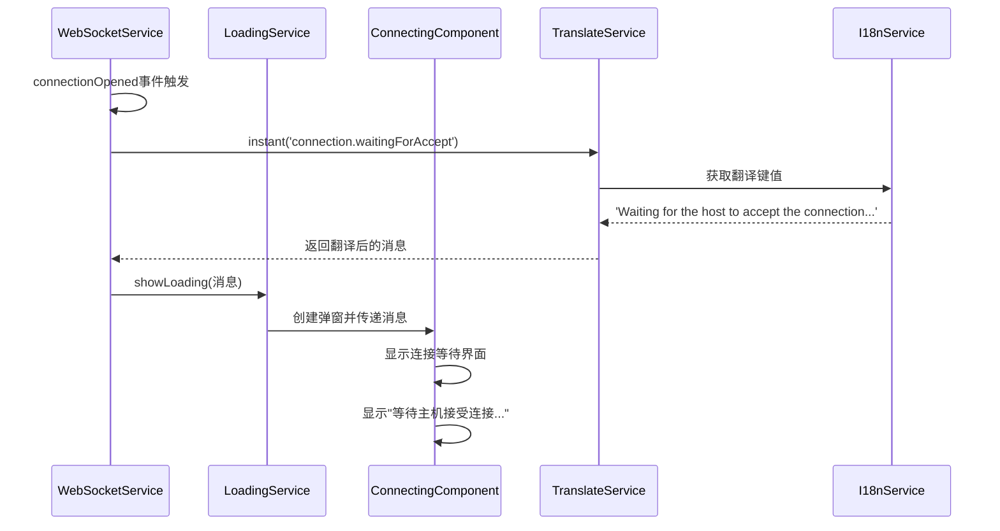
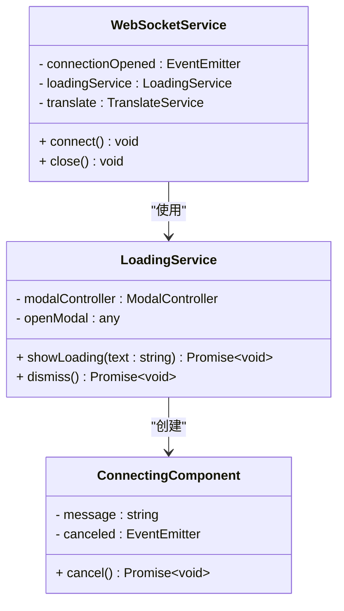
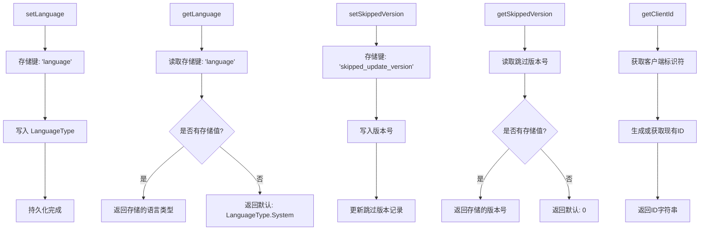
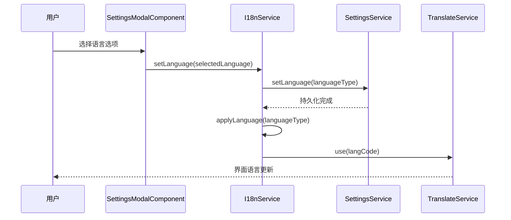

# 国际化系统

<cite>
**本文档引用的文件**
- [i18n.service.ts](file://src/app/services/i18n/i18n.service.ts)
- [settings.service.ts](file://src/app/services/settings/settings.service.ts)
- [language-type.ts](file://src/app/enums/language-type.ts)
- [en.json](file://src/assets/i18n/en.json)
- [zh.json](file://src/assets/i18n/zh.json)
- [settings-modal.component.ts](file://src/app/pages/shared/modals/settings-modal/settings-modal.component.ts)
- [settings-modal.component.html](file://src/app/pages/shared/modals/settings-modal/settings-modal.component.html)
- [home.page.html](file://src/app/pages/home/home.page.html)
- [web-home.page.html](file://src/app/pages/web-home/web-home.page.html)
- [deck.page.html](file://src/app/pages/deck/deck.page.html)
- [app.component.ts](file://src/app/app.component.ts)
- [app.module.ts](file://src/app/app.module.ts)
- [update-modal.component.ts](file://src/app/pages/shared/modals/update-modal/update-modal.component.ts)
- [update-modal.component.html](file://src/app/pages/shared/modals/update-modal/update-modal.component.html)
- [update.service.ts](file://src/app/services/update/update.service.ts)
- [websocket.service.ts](file://src/app/services/websocket/websocket.service.ts)
- [loading.service.ts](file://src/app/services/loading/loading.service.ts)
- [connecting.component.ts](file://src/app/pages/home/modals/connecting/connecting.component.ts)
- [connecting.component.html](file://src/app/pages/home/modals/connecting/connecting.component.html)
</cite>

## 更新摘要
**所做更改**
- 新增完整的国际化支持，包括中文和英文界面
- SettingsService中增加了语言设置管理功能，支持语言的持久化存储
- SettingsModalComponent中集成了语言切换界面，用户可实时切换应用语言
- 完善了翻译资源文件，包含14个更新功能相关的翻译键值
- 优化了客户端标识符显示，将"Client ID"简化为"ID"提升中文本地化体验
- **新增** connection命名空间下的waitingForAccept翻译键值，用于WebSocket连接等待状态提示
- **增强** SettingsModalComponent的国际化支持，添加了okText和cancelText属性动态加载翻译文本

## 目录
1. [简介](#简介)
2. [项目结构](#项目结构)
3. [核心组件](#核心组件)
4. [架构概览](#架构概览)
5. [详细组件分析](#详细组件分析)
6. [语言设置管理](#语言设置管理)
7. [界面集成与用户体验](#界面集成与用户体验)
8. [翻译资源管理](#翻译资源管理)
9. [依赖关系分析](#依赖关系分析)
10. [性能考虑](#性能考虑)
11. [故障排除指南](#故障排除指南)
12. [结论](#结论)

## 简介

Macro Deck 客户端应用采用 Angular 19 和 @ngx-translate 实现的完整国际化系统，支持英语和中文两种语言。该系统通过服务层管理语言设置的持久化和应用，结合 Angular 的依赖注入机制，在应用启动时自动初始化并支持运行时动态切换语言。

**更新** 项目现已实现完整的国际化功能，包括：
- 完整的语言设置管理，支持跟随系统、强制英语、强制中文三种模式
- 设置模态框中的语言切换界面，用户可实时修改语言设置
- 完善的翻译资源文件，涵盖所有界面文本的本地化
- 优化的客户端标识符显示，提升中文界面的简洁性和用户体验
- **新增** WebSocket连接等待状态的国际化支持，提供"等待主机接受连接..."的用户反馈
- **增强** SettingsModalComponent的国际化支持，选择框弹窗的确认和取消按钮现在使用动态翻译文本

## 项目结构

国际化系统主要由以下文件组成：

```mermaid
graph TB
subgraph "国际化系统结构"
A[i18n.service.ts] --> B[settings.service.ts]
B --> C[language-type.ts]
A --> D[en.json]
A --> E[zh.json]
F[app.component.ts] --> A
G[settings-modal.component.ts] --> A
H[app.module.ts] --> A
I[update-modal.component.ts] --> A
J[update.service.ts] --> A
K[home.page.html] --> A
L[web-home.page.html] --> A
M[deck.page.html] --> A
N[websocket.service.ts] --> O[loading.service.ts]
O --> P[connecting.component.ts]
P --> Q[connecting.component.html]
end
subgraph "翻译资源"
D --> N[英文翻译 - 149行]
E --> O[中文翻译 - 149行]
P[客户端标识符优化] --> Q["Client ID" → "ID"]
R[更新功能键值] --> S[14个新翻译键]
T[连接状态键值] --> U["waitingForAccept" 新增]
V[通用按钮文本] --> W["common.ok" 和 "common.cancel"]
end
subgraph "语言设置管理"
X[SettingsService] --> Y[语言持久化存储]
Z[SettingsModalComponent] --> AA[语言切换界面]
AA --> BB[实时语言应用]
CC[选择框国际化] --> DD[动态按钮文本]
DD --> EE[okText/cancelText属性]
end
subgraph "连接状态管理"
FF[WebSocketService] --> GG[LoadingService]
GG --> HH[ConnectingComponent]
HH --> II[连接等待提示]
II --> JJ["等待主机接受连接..."]
end
```

**图表来源**
- [i18n.service.ts:1-78](file://src/app/services/i18n/i18n.service.ts#L1-L78)
- [settings.service.ts:1-300](file://src/app/services/settings/settings.service.ts#L1-L300)
- [language-type.ts:1-10](file://src/app/enums/language-type.ts#L1-L10)
- [settings-modal.component.ts:1-224](file://src/app/pages/shared/modals/settings-modal/settings-modal.component.ts#L1-L224)
- [websocket.service.ts:161-173](file://src/app/services/websocket/websocket.service.ts#L161-L173)
- [loading.service.ts:37-48](file://src/app/services/loading/loading.service.ts#L37-L48)

**章节来源**
- [i18n.service.ts:1-78](file://src/app/services/i18n/i18n.service.ts#L1-L78)
- [settings.service.ts:1-300](file://src/app/services/settings/settings.service.ts#L1-L300)
- [language-type.ts:1-10](file://src/app/enums/language-type.ts#L1-L10)

## 核心组件

国际化系统包含以下核心组件：

### 语言类型枚举
定义了三种语言模式：
- System：跟随系统语言（默认）
- English：强制使用英语
- Chinese：强制使用中文

### 设置服务
负责语言设置的持久化存储，使用 Ionic Storage 在本地存储语言偏好设置，并提供完整的设置管理功能。

### 国际化服务
核心服务，管理语言初始化、切换和应用逻辑，支持系统语言检测和回退机制。

### 连接状态服务
**新增** WebSocket连接状态管理服务，负责WebSocket连接的建立和维护，并在连接过程中显示相应的国际化提示信息。

**章节来源**
- [language-type.ts:1-10](file://src/app/enums/language-type.ts#L1-L10)
- [settings.service.ts:68-82](file://src/app/services/settings/settings.service.ts#L68-L82)
- [i18n.service.ts:14-77](file://src/app/services/i18n/i18n.service.ts#L14-L77)
- [websocket.service.ts:161-173](file://src/app/services/websocket/websocket.service.ts#L161-L173)

## 架构概览

```mermaid
graph TD
A[AppComponent] --> B[I18nService.init]
B --> C[SettingsService.getLanguage]
C --> D{语言类型判断}
D --> |System| E[detectSystemLang]
D --> |English| F[使用'en']
D --> |Chinese| G[使用'zh']
E --> H[Navigator.language检测]
H --> I[返回'zh'或'en']
F --> J[TranslateService.use]
G --> J
I --> J
J --> K[应用语言设置]
L[SettingsModalComponent] --> M[I18nService.setLanguage]
M --> N[SettingsService.setLanguage]
N --> O[持久化语言设置]
O --> P[重新应用语言]
Q[翻译资源加载] --> R[assets/i18n/*.json]
R --> S[动态翻译解析]
S --> T[界面实时更新]
U[WebSocket连接] --> V[ConnectionOpened事件]
V --> W[LoadingService.showLoading]
W --> X[Translate.instant('connection.waitingForAccept')]
X --> Y[显示连接等待提示]
Y --> Z[ConnectingComponent显示消息]
AA[SettingsModalComponent初始化] --> BB[translate.instant('common.ok')]
BB --> CC[okText属性赋值]
DD[translate.instant('common.cancel')] --> EE[cancelText属性赋值]
```

**图表来源**
- [app.component.ts:55-57](file://src/app/app.component.ts#L55-L57)
- [i18n.service.ts:23-28](file://src/app/services/i18n/i18n.service.ts#L23-L28)
- [i18n.service.ts:52-67](file://src/app/services/i18n/i18n.service.ts#L52-L67)
- [settings-modal.component.ts:136-137](file://src/app/pages/shared/modals/settings-modal/settings-modal.component.ts#L136-L137)
- [settings-modal.component.ts:108-110](file://src/app/pages/shared/modals/settings-modal/settings-modal.component.ts#L108-L110)
- [websocket.service.ts:161-173](file://src/app/services/websocket/websocket.service.ts#L161-L173)
- [loading.service.ts:37-48](file://src/app/services/loading/loading.service.ts#L37-L48)

## 详细组件分析

### I18nService 详细分析

I18nService 是国际化系统的核心服务，负责语言的初始化、切换和应用。

#### 类结构图



**图表来源**
- [i18n.service.ts:14-77](file://src/app/services/i18n/i18n.service.ts#L14-L77)
- [settings.service.ts:28-82](file://src/app/services/settings/settings.service.ts#L28-L82)
- [language-type.ts:2-9](file://src/app/enums/language-type.ts#L2-L9)

#### 初始化流程

应用启动时的初始化流程如下：



**图表来源**
- [app.component.ts:55-57](file://src/app/app.component.ts#L55-L57)
- [i18n.service.ts:23-28](file://src/app/services/i18n/i18n.service.ts#L23-L28)
- [i18n.service.ts:52-67](file://src/app/services/i18n/i18n.service.ts#L52-L67)

**章节来源**
- [i18n.service.ts:19-28](file://src/app/services/i18n/i18n.service.ts#L19-L28)
- [i18n.service.ts:52-67](file://src/app/services/i18n/i18n.service.ts#L52-L67)

### SettingsModalComponent 国际化增强

**更新** SettingsModalComponent 现已获得完整的国际化支持，特别是选择框弹窗的按钮文本。

#### 国际化属性定义

组件新增了两个关键属性来支持选择框弹窗的国际化：

```typescript
/** 选择框确认按钮文本 */
public okText: string = "OK";
/** 选择框取消按钮文本 */
public cancelText: string = "Cancel";
```

#### 初始化时的国际化处理

在组件初始化时，系统会动态加载翻译文本：



**图表来源**
- [settings-modal.component.ts:108-110](file://src/app/pages/shared/modals/settings-modal/settings-modal.component.ts#L108-L110)
- [settings-modal.component.ts:60-63](file://src/app/pages/shared/modals/settings-modal/settings-modal.component.ts#L60-L63)

#### 选择框国际化应用

所有选择框组件现在都使用动态的按钮文本：

```html
<ion-select [(ngModel)]="screenOrientation" [label]="'settings.screenOrientation' | translate" [okText]="okText" [cancelText]="cancelText">
  <ion-select-option value="0">{{ 'settings.orientationAuto' | translate }}</ion-select-option>
  <ion-select-option value="1">{{ 'settings.orientationLandscape' | translate }}</ion-select-option>
  <ion-select-option value="2">{{ 'settings.orientationLandscapeAlt' | translate }}</ion-select-option>
  <ion-select-option value="3">{{ 'settings.orientationPortrait' | translate }}</ion-select-option>
</ion-select>
```

**章节来源**
- [settings-modal.component.ts:60-63](file://src/app/pages/shared/modals/settings-modal/settings-modal.component.ts#L60-L63)
- [settings-modal.component.ts:108-110](file://src/app/pages/shared/modals/settings-modal/settings-modal.component.ts#L108-L110)
- [settings-modal.component.html:53](file://src/app/pages/shared/modals/settings-modal/settings-modal.component.html#L53-L53)
- [settings-modal.component.html:72](file://src/app/pages/shared/modals/settings-modal/settings-modal.component.html#L72-L72)

### WebSocket连接状态管理

**新增** WebSocket连接状态管理系统提供了完整的连接等待状态国际化支持。

#### 连接等待状态流程



**图表来源**
- [websocket.service.ts:161-173](file://src/app/services/websocket/websocket.service.ts#L161-L173)
- [loading.service.ts:37-48](file://src/app/services/loading/loading.service.ts#L37-L48)
- [connecting.component.ts:19-22](file://src/app/pages/home/modals/connecting/connecting.component.ts#L19-L22)

#### 连接组件结构



**图表来源**
- [websocket.service.ts:161-173](file://src/app/services/websocket/websocket.service.ts#L161-L173)
- [loading.service.ts:37-48](file://src/app/services/loading/loading.service.ts#L37-L48)
- [connecting.component.ts:17-33](file://src/app/pages/home/modals/connecting/connecting.component.ts#L17-L33)

**章节来源**
- [websocket.service.ts:161-173](file://src/app/services/websocket/websocket.service.ts#L161-L173)
- [loading.service.ts:37-48](file://src/app/services/loading/loading.service.ts#L37-L48)
- [connecting.component.ts:17-33](file://src/app/pages/home/modals/connecting/connecting.component.ts#L17-L33)

### SettingsService 详细分析

SettingsService 提供了完整的设置管理功能，其中语言设置部分专门处理国际化相关的配置。

#### 语言设置方法



**图表来源**
- [settings.service.ts:68-82](file://src/app/services/settings/settings.service.ts#L68-L82)
- [settings.service.ts:35-50](file://src/app/services/settings/settings.service.ts#L35-L50)
- [settings.service.ts:276-298](file://src/app/services/settings/settings.service.ts#L276-L298)

**章节来源**
- [settings.service.ts:68-82](file://src/app/services/settings/settings.service.ts#L68-L82)
- [settings.service.ts:35-50](file://src/app/services/settings/settings.service.ts#L35-L50)
- [settings.service.ts:276-298](file://src/app/services/settings/settings.service.ts#L276-L298)

### SettingsModalComponent 详细分析

设置弹窗组件提供了用户界面来修改语言设置，并实时应用更改。

#### 语言设置界面流程



**图表来源**
- [settings-modal.component.ts:136-137](file://src/app/pages/shared/modals/settings-modal/settings-modal.component.ts#L136-L137)
- [i18n.service.ts:34-37](file://src/app/services/i18n/i18n.service.ts#L34-L37)

**章节来源**
- [settings-modal.component.ts:136-137](file://src/app/pages/shared/modals/settings-modal/settings-modal.component.ts#L136-L137)
- [settings-modal.component.html:72-77](file://src/app/pages/shared/modals/settings-modal/settings-modal.component.html#L72-L77)

## 语言设置管理

**新增** 项目现已实现完整的语言设置管理功能，支持用户自定义语言偏好并持久化存储。

### 语言类型定义

系统定义了三种语言模式，提供灵活的语言控制：

```typescript
export enum LanguageType {
  /** 跟随系统语言 */
  System = 0,
  /** 英文 */
  English = 1,
  /** 中文 */
  Chinese = 2
}
```

### 设置持久化机制

语言设置通过 SettingsService 进行持久化存储：

- **存储键**：`language`
- **默认值**：`LanguageType.System`（跟随系统）
- **存储位置**：Ionic Storage（跨平台兼容）

### 语言检测逻辑

系统支持智能语言检测：

1. **系统语言检测**：通过 `navigator.language` 检测浏览器/系统语言
2. **中文识别**：检测语言代码是否以 'zh' 开头
3. **回退机制**：非中文环境默认使用英语

**章节来源**
- [language-type.ts:1-10](file://src/app/enums/language-type.ts#L1-L10)
- [settings.service.ts:68-82](file://src/app/services/settings/settings.service.ts#L68-L82)
- [i18n.service.ts:73-76](file://src/app/services/i18n/i18n.service.ts#L73-L76)

## 界面集成与用户体验

**新增** 项目已实现完整的界面集成，用户可通过设置模态框轻松切换语言。

### 设置模态框语言选项

设置模态框中包含完整的语言设置界面：

```html
<ion-item>
  <ion-icon slot="start" class="mdi mdi-translate d-flex align-items-center"></ion-icon>
  <ion-select [(ngModel)]="language" [label]="'settings.language' | translate">
    <ion-select-option value="0">{{ 'settings.languageSystem' | translate }}</ion-select-option>
    <ion-select-option value="1">{{ 'settings.languageEnglish' | translate }}</ion-select-option>
    <ion-select-option value="2">{{ 'settings.languageChinese' | translate }}</ion-select-option>
  </ion-select>
</ion-item>
```

### 实时语言切换

当用户选择新的语言设置时，系统会：

1. **立即应用**：调用 `I18nService.setLanguage()` 立即切换语言
2. **持久化存储**：保存用户的语言偏好到本地存储
3. **界面更新**：所有使用翻译服务的界面元素实时更新

### 客户端标识符优化

**更新** 客户端标识符显示已优化，提升中文界面体验：

- **英文界面**：显示 "Client ID"
- **中文界面**：显示 "ID"（简化显示）
- **一致性**：中英文界面都使用简短标识，提升界面整洁性

### 连接等待状态提示

**新增** WebSocket连接过程中的等待状态提示：

- **英文界面**：显示 "Waiting for the host to accept the connection..."
- **中文界面**：显示 "等待主机接受连接..."
- **用户体验**：提供清晰的连接状态反馈，增强用户信心

### 选择框弹窗国际化

**新增** 所有选择框弹窗现在都支持完整的国际化：

- **英文界面**：确认按钮显示 "OK"，取消按钮显示 "Cancel"
- **中文界面**：确认按钮显示 "确定"，取消按钮显示 "取消"
- **动态加载**：按钮文本在组件初始化时动态加载，确保与当前语言一致

**章节来源**
- [settings-modal.component.html:72-77](file://src/app/pages/shared/modals/settings-modal/settings-modal.component.html#L72-L77)
- [settings-modal.component.ts:136-137](file://src/app/pages/shared/modals/settings-modal/settings-modal.component.ts#L136-L137)
- [home.page.html:112](file://src/app/pages/home/home.page.html#L112-L112)
- [web-home.page.html:16](file://src/app/pages/web-home/web-home.page.html#L16-L16)
- [websocket.service.ts:169](file://src/app/services/websocket/websocket.service.ts#L169-L169)
- [settings-modal.component.ts:108-110](file://src/app/pages/shared/modals/settings-modal/settings-modal.component.ts#L108-L110)

## 翻译资源管理

**新增** 项目实现了完整的翻译资源管理，包含149行翻译条目覆盖所有界面功能。

### 翻译文件结构

系统包含两个主要的翻译文件，现已完善所有功能模块的本地化：

#### 英文翻译文件 (en.json)
包含 149 行翻译条目，覆盖以下主题：
- **common**：通用词汇（cancel、save、close等）
- **settings**：设置相关界面文本
- **menu**：菜单项
- **home**：主页内容
- **addConnection**：连接设置
- **update**：应用程序更新功能的14个翻译键值
- **webHome**：网页版主页文本
- **connection**：连接状态消息（包含新增的waitingForAccept）
- **其他功能模块**：完整的界面文本覆盖

#### 中文翻译文件 (zh.json)
包含 149 行翻译条目，对应英文文件的完整中文翻译。

### 新增连接状态翻译键值

**新增** connection 命名空间下新增了 waitingForAccept 翻译键值：

- **英文**：`"Waiting for the host to accept the connection..."`
- **中文**：`"等待主机接受连接..."`

这个键值用于WebSocket连接建立后，等待主机接受连接时的用户提示。

### 更新功能翻译键值

**新增** update 分组包含以下14个翻译键值：
- checkForUpdate：检查更新
- newVersionFound：发现新版本
- newVersionTitle：有新版本 {{version}} 可用
- currentVersion：当前
- releaseNotes：更新内容
- updateNow：立即更新
- later：稍后
- skipThisVersion：跳过此版本
- downloading：正在下载更新...
- alreadyLatest：已经是最新版本
- downloadFailedTitle：更新失败
- downloadFailedMessage：无法下载更新，请检查网络后重试

### 通用按钮文本翻译键值

**新增** common 分组包含选择框弹窗使用的按钮文本：

- **ok**：确认按钮文本
  - 英文："OK"
  - 中文："确定"
- **cancel**：取消按钮文本
  - 英文："Cancel"
  - 中文："取消"

这些键值被 SettingsModalComponent 动态加载，用于所有选择框弹窗的按钮文本。

### 翻译资源加载配置

系统在应用模块中配置了翻译资源的加载：

```typescript
providers: [
  provideTranslateService({
    loader: provideTranslateHttpLoader({
      prefix: './assets/i18n/',
      suffix: '.json'
    }),
    fallbackLang: 'en'
  })
]
```

**章节来源**
- [en.json:1-149](file://src/assets/i18n/en.json#L1-L149)
- [zh.json:1-149](file://src/assets/i18n/zh.json#L1-L149)
- [app.module.ts:42-49](file://src/app/app.module.ts#L42-L49)
- [websocket.service.ts:169](file://src/app/services/websocket/websocket.service.ts#L169-L169)
- [settings-modal.component.ts:108-110](file://src/app/pages/shared/modals/settings-modal/settings-modal.component.ts#L108-L110)

## 依赖关系分析

### 外部依赖

国际化系统依赖以下外部库：

```mermaid
graph LR
A[Angular 19] --> B[@ngx-translate/core]
A --> C[@ngx-translate/http-loader]
D[Ionic Storage] --> E[本地存储]
F[Capacitor] --> G[原生平台集成]
B --> H[翻译服务]
C --> I[HTTP加载器]
E --> J[设置持久化]
K[更新功能] --> L[TranslateService]
L --> M[动态键值解析]
N[客户端标识符优化] --> O["Client ID" → "ID"]
O --> P[界面简洁性提升]
Q[连接状态管理] --> R[WebSocketService]
R --> S[LoadingService]
S --> T[ConnectingComponent]
T --> U[连接等待提示]
V[选择框国际化] --> W[TranslateService.instant]
W --> X[common.ok/common.cancel]
```

**图表来源**
- [package.json:46-47](file://package.json#L46-L47)
- [package.json:44](file://package.json#L44)
- [websocket.service.ts:161-173](file://src/app/services/websocket/websocket.service.ts#L161-L173)
- [loading.service.ts:37-48](file://src/app/services/loading/loading.service.ts#L37-L48)
- [settings-modal.component.ts:108-110](file://src/app/pages/shared/modals/settings-modal/settings-modal.component.ts#L108-L110)

### 内部依赖关系

```mermaid
graph TD
A[I18nService] --> B[TranslateService]
A --> C[SettingsService]
C --> D[LanguageType]
C --> E[Storage]
F[SettingsModalComponent] --> A
G[AppComponent] --> A
H[UpdateModalComponent] --> A
I[UpdateService] --> A
J[各页面组件] --> K[TranslatePipe]
K --> B
L[翻译资源] --> M[assets/i18n/*.json]
M --> N[动态加载]
O[语言设置管理] --> P[持久化存储]
P --> Q[用户偏好保存]
R[界面集成] --> S[实时语言切换]
S --> T[用户体验优化]
U[WebSocket连接] --> V[ConnectionOpened事件]
V --> W[LoadingService.showLoading]
W --> X[Translate.instant('connection.waitingForAccept')]
X --> Y[显示连接等待提示]
Y --> Z[ConnectingComponent显示消息]
AA[SettingsModalComponent初始化] --> BB[TranslateService.instant]
BB --> CC[okText/cancelText属性]
CC --> DD[选择框国际化]
```

**图表来源**
- [app.module.ts:41-50](file://src/app/app.module.ts#L41-L50)
- [settings-modal.component.ts:68-70](file://src/app/pages/shared/modals/settings-modal/settings-modal.component.ts#L68-L70)
- [update-modal.component.ts:26-30](file://src/app/pages/shared/modals/update-modal/update-modal.component.ts#L26-L30)
- [home.page.html:112](file://src/app/pages/home/home.page.html#L112-L112)
- [websocket.service.ts:161-173](file://src/app/services/websocket/websocket.service.ts#L161-L173)
- [settings-modal.component.ts:108-110](file://src/app/pages/shared/modals/settings-modal/settings-modal.component.ts#L108-L110)

**章节来源**
- [app.module.ts:41-50](file://src/app/app.module.ts#L41-L50)

## 性能考虑

### 翻译资源加载优化

1. **按需加载**：使用 @ngx-translate/http-loader 支持按需加载翻译文件
2. **缓存策略**：浏览器自动缓存翻译文件，减少重复请求
3. **回退机制**：设置默认回退语言，确保语言切换的稳定性

### 存储性能

1. **异步操作**：所有存储操作都是异步的，避免阻塞主线程
2. **最小化存储**：只存储必要的语言设置信息
3. **持久化优化**：使用 Ionic Storage 提供的高效存储机制

### 语言切换性能

1. **即时应用**：语言切换后立即生效，无需重启应用
2. **增量更新**：只更新需要翻译的界面元素
3. **内存优化**：翻译文件按需加载，减少内存占用

### 客户端标识符优化性能

1. **界面渲染优化**：简化的"ID"显示减少了DOM元素的宽度需求
2. **内存占用减少**：较短的字符串占用更少的内存空间
3. **渲染性能提升**：界面元素更加紧凑，提高了整体渲染效率

### 连接等待状态性能

**新增** 连接等待状态提示的性能优化：

1. **延迟显示**：仅在连接建立后显示等待提示，避免不必要的UI开销
2. **一次性加载**：翻译键值在首次使用时加载，后续使用直接缓存
3. **内存管理**：弹窗组件在关闭后及时释放内存引用

### 选择框国际化性能

**新增** 选择框弹窗国际化的性能优化：

1. **初始化时加载**：按钮文本在组件初始化时一次性加载，避免重复查询
2. **属性绑定优化**：使用组件属性绑定，减少模板中的翻译函数调用
3. **内存缓存**：翻译结果在组件生命周期内保持缓存

## 故障排除指南

### 常见问题及解决方案

#### 语言切换无效
**症状**：更改语言后界面没有变化
**原因**：TranslateService 未正确应用新语言
**解决方案**：
1. 检查 I18nService.setLanguage 方法是否被调用
2. 确认 SettingsService.setLanguage 已成功持久化
3. 验证 TranslateService.use 是否执行

#### 系统语言检测失败
**症状**：选择 System 语言时显示错误语言
**原因**：navigator.language 返回值不符合预期
**解决方案**：
1. 检查浏览器语言设置
2. 验证 detectSystemLang 方法的逻辑
3. 确认语言代码格式正确（'zh' 或 'en'）

#### 翻译文件加载失败
**症状**：界面显示翻译键而非实际文本
**原因**：翻译文件未正确加载或路径错误
**解决方案**：
1. 检查 assets/i18n/ 目录结构
2. 验证翻译文件的 JSON 格式
3. 确认 app.module.ts 中的翻译加载配置

#### 语言设置未持久化
**症状**：重启应用后语言设置丢失
**原因**：存储操作失败或存储键名冲突
**解决方案**：
1. 检查 SettingsService.setLanguage 方法
2. 验证 language 存储键的使用
3. 确认 Ionic Storage 的可用性

#### 客户端标识符显示异常
**症状**：客户端ID显示不正确或不一致
**原因**：翻译键值配置错误或界面绑定问题
**解决方案**：
1. 检查 zh.json 中的 home.clientId 和 webHome.clientId 键值
2. 确认英文文件中的对应键值配置正确
3. 验证页面组件中翻译键值的使用

#### 连接等待提示不显示
**症状**：WebSocket连接建立后没有显示等待提示
**原因**：connection.waitingForAccept 翻译键值缺失或使用错误
**解决方案**：
1. 检查 en.json 和 zh.json 中 connection.waitingForAccept 键值是否存在
2. 验证 websocket.service.ts 中是否正确调用 Translate.instant('connection.waitingForAccept')
3. 确认 LoadingService.showLoading 方法是否正常执行

#### 选择框弹窗按钮文本不正确
**症状**：选择框弹窗的确认和取消按钮显示英文而非本地化文本
**原因**：okText和cancelText属性未正确初始化或未绑定到选择框组件
**解决方案**：
1. 检查 SettingsModalComponent 的 ngOnInit 方法是否正确调用 translate.instant('common.ok') 和 translate.instant('common.cancel')
2. 验证 okText 和 cancelText 属性是否正确赋值
3. 确认所有 ion-select 组件都绑定了 [okText]="okText" 和 [cancelText]="cancelText"
4. 检查 en.json 和 zh.json 中 common.ok 和 common.cancel 键值是否存在

**章节来源**
- [i18n.service.ts:73-76](file://src/app/services/i18n/i18n.service.ts#L73-L76)
- [app.module.ts:42-49](file://src/app/app.module.ts#L42-L49)
- [settings.service.ts:68-82](file://src/app/services/settings/settings.service.ts#L68-L82)
- [websocket.service.ts:169](file://src/app/services/websocket/websocket.service.ts#L169-L169)
- [settings-modal.component.ts:108-110](file://src/app/pages/shared/modals/settings-modal/settings-modal.component.ts#L108-L110)

## 结论

Macro Deck 客户端应用的国际化系统设计合理，实现了以下关键特性：

1. **完整的多语言支持**：支持英语和中文两种语言
2. **灵活的语言选择**：支持跟随系统、强制英语、强制中文三种模式
3. **持久化的设置管理**：使用 Ionic Storage 保存用户语言偏好
4. **高效的运行时切换**：支持应用运行时动态切换语言
5. **清晰的架构分离**：服务层、设置层和界面层职责明确
6. **完善的界面集成**：设置模态框中集成语言切换功能
7. **全面的翻译资源**：149行翻译条目覆盖所有界面功能
8. **智能的语言检测**：自动检测系统语言并提供合适的默认值
9. **优化的用户体验**：客户端标识符简化显示，提升界面简洁性
10. **可靠的错误处理**：完善的回退机制和错误提示

**更新** 最新的国际化改进显著增强了用户体验，包括：

- 完整的语言设置管理功能，支持用户自定义语言偏好
- 设置模态框中的直观语言切换界面
- 14个更新功能相关的翻译键值，完善应用程序更新功能的本地化
- 优化的客户端标识符显示，将"Client ID"简化为"ID"，提升中文本地化体验和界面简洁性
- 完善的翻译资源管理，确保所有界面文本的本地化覆盖
- **新增** WebSocket连接等待状态的国际化支持，提供"等待主机接受连接..."的用户反馈
- **增强** SettingsModalComponent的国际化支持，选择框弹窗的确认和取消按钮现在使用动态翻译文本，提升了所有选择框组件的本地化体验

该系统为用户提供了良好的国际化体验，同时保持了代码的可维护性和扩展性。通过持续的功能完善和质量保证机制，项目正逐步实现对全球开发者的全面支持。最新的优化进一步提升了中文用户的使用体验，体现了项目对本地化细节的关注和对用户体验的重视。新增的连接等待状态提示功能和选择框弹窗国际化改进，使得用户在各种交互场景中都能获得一致的本地化体验，进一步改善了整体的用户体验。