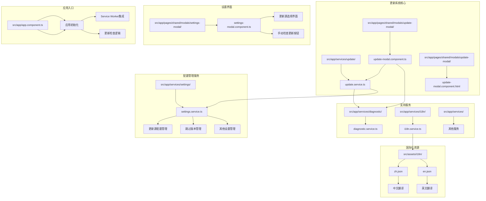
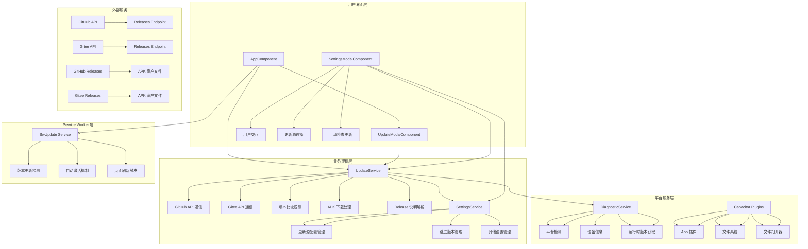
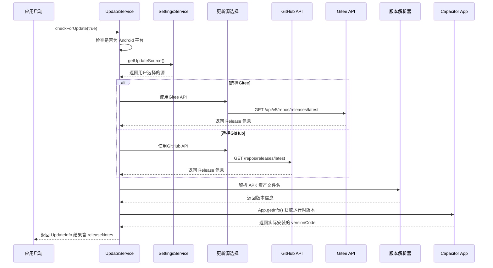
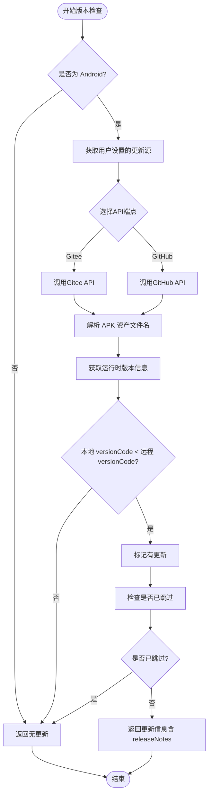
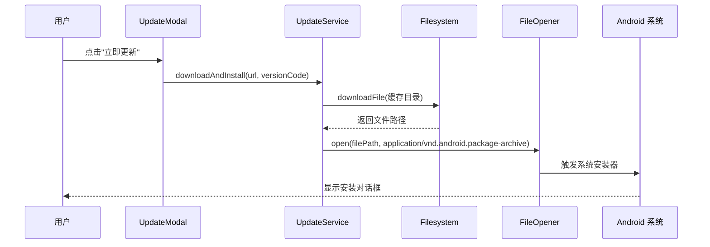
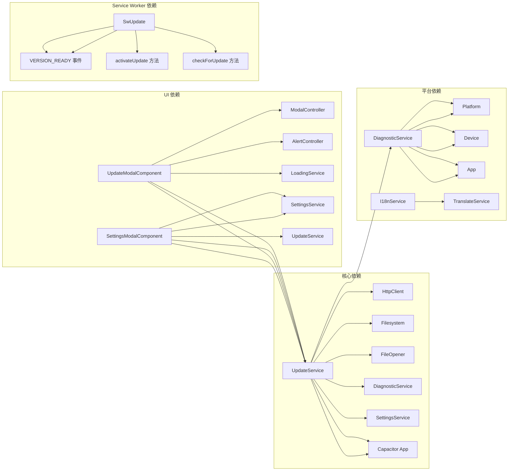

# 应用程序更新系统

<cite>
**本文档引用的文件**
- [update.service.ts](file://src/app/services/update/update.service.ts)
- [settings.service.ts](file://src/app/services/settings/settings.service.ts)
- [update-modal.component.ts](file://src/app/pages/shared/modals/update-modal/update-modal.component.ts)
- [update-modal.component.html](file://src/app/pages/shared/modals/update-modal/update-modal.component.html)
- [settings-modal.component.ts](file://src/app/pages/shared/modals/settings-modal/settings-modal.component.ts)
- [settings-modal.component.html](file://src/app/pages/shared/modals/settings-modal/settings-modal.component.html)
- [diagnostic.service.ts](file://src/app/services/diagnostic/diagnostic.service.ts)
- [environment.ts](file://src/environments/environment.ts)
- [environment.prod.ts](file://src/environments/environment.prod.ts)
- [package.json](file://package.json)
- [capacitor.config.ts](file://capacitor.config.ts)
- [zh.json](file://src/assets/i18n/zh.json)
- [en.json](file://src/assets/i18n/en.json)
</cite>

## 更新摘要
**所做更改**
- **新增**：实现了完整的GitHub和Gitee双源更新检查系统
- **增强**：SettingsService中增加了更新源配置管理功能
- **优化**：支持用户自定义选择GitHub或Gitee作为更新源
- **改进**：设置界面中添加了更新源选择和手动检查更新功能

## 目录
1. [简介](#简介)
2. [项目结构](#项目结构)
3. [核心组件](#核心组件)
4. [架构概览](#架构概览)
5. [详细组件分析](#详细组件分析)
6. [双源更新检查机制](#双源更新检查机制)
7. [更新源配置管理](#更新源配置管理)
8. [版本检测机制增强](#版本检测机制增强)
9. [更新模态框UI优化](#更新模态框ui优化)
10. [依赖关系分析](#依赖关系分析)
11. [性能考虑](#性能考虑)
12. [故障排除指南](#故障排除指南)
13. [结论](#结论)

## 简介

Macro Deck 客户端应用程序更新系统是一个基于 GitHub Releases 和 Gitee Releases 的应用内更新解决方案，专为 Android 原生平台设计。该系统实现了自动检查更新、版本比较、APK下载和系统安装器触发等功能，为用户提供无缝的应用程序更新体验。

**最新改进**：
- **新增**：完整的GitHub和Gitee双源更新检查支持
- **增强**：SettingsService中集成了更新源配置管理
- **优化**：用户可在设置中选择优先使用的更新源（默认Gitee）
- **改进**：支持手动检查更新和智能源切换

系统的核心特点包括：
- 基于 GitHub API 和 Gitee API 的双源版本检查
- 用户可配置的更新源选择（GitHub/Gitee）
- 自动解析 APK 资产文件名格式
- 原生 Android 平台的直接安装支持
- 用户友好的更新提示界面
- 版本跳过功能，防止重复提醒
- 增强的运行时版本检测机制
- 优化的版本信息显示格式

## 项目结构

应用程序更新系统主要分布在以下目录结构中：



**图表来源**
- [update.service.ts:1-163](file://src/app/services/update/update.service.ts#L1-L163)
- [settings.service.ts:1-300](file://src/app/services/settings/settings.service.ts#L1-L300)
- [settings-modal.component.ts:1-214](file://src/app/pages/shared/modals/settings-modal/settings-modal.component.ts#L1-L214)
- [update-modal.component.ts:1-62](file://src/app/pages/shared/modals/update-modal/update-modal.component.ts#L1-L62)

## 核心组件

### UpdateService - 更新服务

UpdateService 是整个更新系统的核心，负责与 GitHub/Gitee API 交互、解析版本信息、处理 APK 下载和安装。

**主要功能**：
- GitHub/Gitee Releases API 调用和版本检查
- 根据用户设置动态选择更新源
- APK 资产文件名解析（MacroDeckClient-{versionName}-{versionCode}.apk）
- **增强**：使用Capacitor App插件获取运行时版本信息进行准确比较
- 版本比较逻辑（基于 versionCode）
- 应用内 APK 下载和系统安装器触发
- 更新跳过功能管理
- Release 说明内容集成

**关键接口**：
- `checkForUpdate(silent: boolean)`: 检查是否有新版本
- `shouldPrompt(info: UpdateInfo)`: 判断是否应该显示更新提示
- `skipVersion(versionCode: number)`: 跳过特定版本
- `downloadAndInstall(url: string, versionCode: number)`: 下载并安装 APK

### SettingsService - 设置服务

**增强**：新增了更新源配置管理功能，支持用户自定义选择GitHub或Gitee作为更新源。

**新增功能**：
- `setUpdateSource(source: 'github' | 'gitee')`: 设置更新检查源
- `getUpdateSource(): Promise<'github' | 'gitee'>`: 获取当前更新源（默认gitee）
- 持久化存储更新源配置
- 与其他设置项的统一管理

### UpdateModalComponent - 更新提示组件

这是一个基于 Ionic Modal 的用户界面组件，提供更新提示和用户交互功能。

**主要功能**：
- 显示新版本信息（版本号、更新说明）
- **优化**：改进的版本显示格式 v{{ environment.version }}.{{ environment.versionCode }}
- 提供立即更新、稍后、跳过此版本三个选项
- 集成加载状态管理和错误处理
- Release 说明内容显示

### SettingsModalComponent - 设置模态框组件

**增强**：集成了更新源配置界面和手动检查更新功能。

**新增功能**：
- 更新源选择下拉菜单（GitHub/Gitee）
- 手动检查更新按钮
- Android平台特定的更新设置界面
- 实时更新源配置保存

**章节来源**
- [update.service.ts:43-163](file://src/app/services/update/update.service.ts#L43-L163)
- [settings.service.ts:52-66](file://src/app/services/settings/settings.service.ts#L52-L66)
- [update-modal.component.ts:18-62](file://src/app/pages/shared/modals/update-modal/update-modal.component.ts#L18-L62)
- [settings-modal.component.ts:29-214](file://src/app/pages/shared/modals/settings-modal/settings-modal.component.ts#L29-L214)

## 架构概览

应用程序更新系统采用分层架构设计，确保各组件职责清晰分离：



**图表来源**
- [app.component.ts:78-92](file://src/app/app.component.ts#L78-L92)
- [update.service.ts:62-101](file://src/app/services/update/update.service.ts#L62-L101)
- [settings-modal.component.ts:76-92](file://src/app/pages/shared/modals/settings-modal/settings-modal.component.ts#L76-L92)

系统的工作流程遵循以下模式：
1. 应用启动时静默检查更新
2. 根据用户设置选择GitHub或Gitee作为更新源
3. 检查结果决定是否显示更新提示
4. 用户可选择在设置中修改更新源
5. 用户可选择手动检查更新
6. 用户选择更新选项
7. 系统处理 APK 下载和安装

## 详细组件分析

### UpdateService 详细分析

UpdateService 实现了完整的应用内更新流程，具有以下关键特性：

#### 双源更新检查流程



**图表来源**
- [update.service.ts:62-101](file://src/app/services/update/update.service.ts#L62-L101)
- [update.service.ts:79-82](file://src/app/services/update/update.service.ts#L79-L82)

#### 增强的版本比较算法

系统现在使用运行时版本信息进行更准确的版本比较：



**图表来源**
- [update.service.ts:62-101](file://src/app/services/update/update.service.ts#L62-L101)
- [update.service.ts:79-82](file://src/app/services/update/update.service.ts#L79-L82)

#### APK 下载和安装流程



**图表来源**
- [update-modal.component.ts:32-49](file://src/app/pages/shared/modals/update-modal/update-modal.component.ts#L32-L49)
- [update.service.ts:129-148](file://src/app/services/update/update.service.ts#L129-L148)

### SettingsService 详细分析

**增强**：SettingsService 现在包含了完整的更新源配置管理功能。

#### 更新源配置管理

| 方法 | 功能 | 参数 | 返回值 |
|------|------|------|--------|
| `setUpdateSource` | 设置更新检查源 | source: 'github' \| 'gitee' | void |
| `getUpdateSource` | 获取更新检查源 | 无 | Promise<'github' \| 'gitee'> |
| `setSkippedVersion` | 设置跳过的版本 | versionCode: number | void |
| `getSkippedVersion` | 获取跳过的版本 | 无 | Promise<number> |

#### 配置存储键值

| 键名 | 类型 | 默认值 | 用途 |
|------|------|--------|------|
| `update_source` | 'github' \| 'gitee' | 'gitee' | 更新源配置 |
| `skipped_update_version` | number | 0 | 跳过的版本号 |

**章节来源**
- [update.service.ts:1-163](file://src/app/services/update/update.service.ts#L1-L163)
- [settings.service.ts:52-66](file://src/app/services/settings/settings.service.ts#L52-L66)
- [update-modal.component.ts:1-62](file://src/app/pages/shared/modals/update-modal/update-modal.component.ts#L1-L62)
- [diagnostic.service.ts:15-29](file://src/app/services/diagnostic/diagnostic.service.ts#L15-L29)

## 双源更新检查机制

### GitHub和Gitee双源支持

系统现在支持从两个不同的代码托管平台检查更新，提供更好的访问速度和可靠性。

#### 更新源配置常量

| 平台 | 仓库所有者 | 仓库名称 | API端点 |
|------|------------|----------|---------|
| GitHub | tea4go | Macro-Deck-Client-App | https://api.github.com/repos/tea4go/Macro-Deck-Client-App/releases/latest |
| Gitee | tea4go | Macro-Deck-Client-App | https://gitee.com/api/v5/repos/tea4go/Macro-Deck-Client-App/releases/latest |

#### 智能源选择逻辑

系统根据用户设置在GitHub和Gitee之间智能选择更新源：

1. **默认选择**：Gitee（国内访问更快）
2. **用户自定义**：可在设置中切换为GitHub
3. **自动降级**：如果首选源不可用，可考虑备用源策略

#### 双源API兼容性

两个平台都遵循标准的Releases API格式，确保统一的响应处理：
- 相同的JSON响应结构
- 一致的APK资产命名规范
- 统一的版本信息格式

**章节来源**
- [update.service.ts:10-18](file://src/app/services/update/update.service.ts#L10-L18)
- [update.service.ts:62-64](file://src/app/services/update/update.service.ts#L62-L64)

## 更新源配置管理

### SettingsService中的更新源管理

**新增**：SettingsService现在提供了完整的更新源配置管理功能。

#### 配置接口设计

```typescript
// 更新源配置接口
interface UpdateSourceConfig {
  setUpdateSource(source: 'github' | 'gitee'): Promise<void>;
  getUpdateSource(): Promise<'github' | 'gitee'>;
}

// 存储键定义
const updateSourceKey: string = "update_source";
```

#### 配置持久化

更新源配置通过Ionic Storage进行持久化存储：
- **存储键**：`update_source`
- **数据类型**：字符串枚举 ('github' | 'gitee')
- **默认值**：'gitee'（国内访问更快）
- **生命周期**：应用卸载前有效

#### 配置验证和容错

系统实现了完善的配置验证机制：
- **类型安全**：使用TypeScript严格类型检查
- **默认回退**：配置缺失时自动使用默认值
- **数据完整性**：确保存储数据的正确性

**章节来源**
- [settings.service.ts:52-66](file://src/app/services/settings/settings.service.ts#L52-L66)
- [settings.service.ts:23-24](file://src/app/services/settings/settings.service.ts#L23-L24)

## 版本检测机制增强

### 运行时版本信息获取

系统现在使用Capacitor App插件获取准确的运行时版本信息，而不是编译时常量。

#### 版本检测流程改进

```mermaid
flowchart TD
A[检查更新] --> B[获取GitHub/Gitee Release信息]
B --> C[解析APK文件名获取远端版本]
C --> D[调用App.getInfo()获取运行时版本]
D --> E[提取实际安装的versionCode]
E --> F[比较本地和远端versionCode]
F --> G{是否需要更新?}
G --> |是| H[返回更新信息]
G --> |否| I[返回无更新]
```

**图表来源**
- [update.service.ts:79-82](file://src/app/services/update/update.service.ts#L79-L82)

#### 版本信息准确性保障

通过运行时版本检测，系统能够：
1. **准确识别**：正确识别当前实际安装的版本
2. **避免误判**：防止因编译时常量与实际运行版本不一致导致的误判
3. **提升可靠性**：确保版本比较逻辑的准确性

**章节来源**
- [update.service.ts:79-82](file://src/app/services/update/update.service.ts#L79-L82)

## 更新模态框UI优化

### 版本显示格式改进

更新模态框的版本信息显示格式得到显著改进。

#### 新的显示格式

版本信息显示现在采用统一的格式：`v{{ environment.version }}.{{ environment.versionCode }}`

#### UI组件结构

| 元素 | 功能 | 实现方式 |
|------|------|----------|
| 版本标题 | 显示新发现版本 | `info.versionName` |
| 当前版本 | 显示当前安装的版本 | `environment.version.versionCode` |
| 目标版本 | 显示可更新的版本 | `info.versionName.info.versionCode` |
| 更新说明 | 显示GitHub/Gitee Release说明 | `info.releaseNotes` |

#### 用户体验改进

1. **清晰对比**：用户可以清楚看到当前版本和目标版本的差异
2. **统一格式**：所有版本信息都采用相同的显示格式
3. **信息完整**：同时显示版本号和构建号，提供更详细的版本信息

**章节来源**
- [update-modal.component.html:10-13](file://src/app/pages/shared/modals/update-modal/update-modal.component.html#L10-L13)
- [update-modal.component.ts:24](file://src/app/pages/shared/modals/update-modal/update-modal.component.ts#L24)

## 依赖关系分析

### 外部依赖

应用程序更新系统依赖以下关键外部组件：

| 依赖项 | 版本 | 用途 | 重要性 |
|--------|------|------|--------|
| @angular/common/http | 19.2.6 | HTTP 请求 | 高 |
| @capacitor-community/file-opener | 7.0.1 | APK 打开器 | 高 |
| @capacitor-community/file-system | 7.1.8 | 文件下载 | 高 |
| @capacitor/app | 7.0.1 | 运行时版本获取 | 高 |
| @capacitor/device | 7.0.1 | 设备信息获取 | 中 |
| @ionic/storage | 4.0.0 | 本地存储 | 高 |
| @angular/service-worker | 19.2.6 | Service Worker | 中 |

### 内部依赖关系



**图表来源**
- [update.service.ts:1-8](file://src/app/services/update/update.service.ts#L1-L8)
- [update-modal.component.ts:1-6](file://src/app/pages/shared/modals/update-modal/update-modal.component.ts#L1-L6)
- [settings-modal.component.ts:1-16](file://src/app/pages/shared/modals/settings-modal/settings-modal.component.ts#L1-L16)
- [diagnostic.service.ts:1-5](file://src/app/services/diagnostic/diagnostic.service.ts#L1-L5)

**章节来源**
- [package.json:17-62](file://package.json#L17-L62)
- [capacitor.config.ts:1-16](file://capacitor.config.ts#L1-L16)

## 性能考虑

### 网络请求优化

系统采用了多项网络请求优化策略：

1. **超时控制**：GitHub/Gitee API 请求设置 10 秒超时
2. **错误处理**：静默失败，不影响应用启动
3. **平台检测**：仅在需要的平台执行相关操作
4. **Release 说明内容的智能缓存**

### 内存管理

- 使用 `firstValueFrom` 将 Observable 转换为 Promise，简化异步处理
- 及时释放网络请求和文件句柄
- 避免在更新过程中阻塞主线程
- **新增**：平台特定的资源管理

### 存储优化

- 使用 Ionic Storage 进行轻量级数据持久化
- 版本跳过状态只存储必要的 versionCode
- 更新源配置使用简单的字符串存储
- 避免频繁的存储操作

### 平台特定优化

**新增**：针对不同平台的性能优化：

1. **原生平台**：跳过不必要的 Service Worker 初始化
2. **Web平台**：启用完整的 Service Worker 功能
3. **跨平台兼容**：统一的API调用接口

**章节来源**
- [update.service.ts:66-72](file://src/app/services/update/update.service.ts#L66-L72)
- [update-modal.component.ts:39-48](file://src/app/pages/shared/modals/update-modal/update-modal.component.ts#L39-L48)
- [app.component.ts:78-92](file://src/app/app.component.ts#L78-L92)

## 故障排除指南

### 常见问题及解决方案

#### GitHub/Gitee API 访问问题

**症状**：更新检查失败，无更新提示
**原因**：网络连接问题或API限制
**解决方案**：
1. 检查网络连接状态
2. 验证GitHub/Gitee API可访问性
3. 确认防火墙设置
4. 尝试切换更新源

#### APK 下载失败

**症状**：点击"立即更新"后无响应或报错
**原因**：文件系统权限或存储空间不足
**解决方案**：
1. 检查应用存储权限
2. 确认设备有足够的存储空间
3. 清理缓存目录

#### 安装器无法启动

**症状**：APK 下载完成但不触发安装
**原因**：Android 系统设置或安全策略
**解决方案**：
1. 检查"允许未知来源"设置
2. 确认 REQUEST_INSTALL_PACKAGES 权限
3. 重新尝试安装过程

#### 版本跳过功能失效

**症状**：用户跳过后仍收到更新提示
**原因**：存储数据损坏或版本号比较错误
**解决方案**：
1. 清除应用缓存和数据
2. 重新设置版本跳过状态
3. 检查版本号格式正确性

#### 更新源配置问题

**症状**：无法从指定源检查更新
**原因**：配置错误或网络问题
**解决方案**：
1. 检查更新源配置是否正确
2. 验证所选源的API可访问性
3. 尝试切换到另一个更新源
4. 检查网络连接和DNS设置

#### 版本检测不准确

**症状**：版本比较结果不正确
**原因**：使用编译时常量而非运行时版本信息
**解决方案**：
1. 确认Capacitor App插件正确集成
2. 检查 `App.getInfo()` 调用是否成功
3. 验证运行时版本信息的获取和解析

#### 版本显示格式异常

**症状**：更新模态框中版本信息显示不正确
**原因**：环境变量配置错误或模板绑定问题
**解决方案**：
1. 检查 environment.ts 和 environment.prod.ts 配置
2. 验证模板中的版本绑定语法
3. 确认版本号和构建号字段存在

### 调试建议

1. **启用详细日志**：在开发环境中查看网络请求和文件操作日志
2. **检查平台兼容性**：验证 Android 版本支持情况
3. **测试边界条件**：验证版本号比较逻辑的正确性
4. **验证平台检测逻辑**：在不同环境下的表现
5. **检查运行时版本信息**：获取和解析过程
6. **监控Service Worker状态**：在不同平台的启用状态
7. **测试双源切换**：验证GitHub和Gitee之间的切换功能

**章节来源**
- [update.service.ts:66-72](file://src/app/services/update/update.service.ts#L66-L72)
- [update-modal.component.ts:39-48](file://src/app/pages/shared/modals/update-modal/update-modal.component.ts#L39-L48)
- [app.component.ts:78-92](file://src/app/app.component.ts#L78-L92)

## 结论

Macro Deck 客户端应用程序更新系统是一个设计精良的原生 Android 更新解决方案。系统的主要优势包括：

### 技术优势

1. **平台适配性**：专门针对 Android 原生平台优化，充分利用系统能力
2. **双源支持**：同时支持GitHub和Gitee，提供更好的访问速度和可靠性
3. **用户体验**：提供直观的更新提示界面和流畅的安装流程
4. **配置管理**：完善的设置服务和用户自定义选项
5. **可靠性**：完善的错误处理和降级策略
6. **扩展性**：模块化设计便于功能扩展和维护
7. **增强的运行时版本检测机制**
8. **优化的版本信息显示格式**

### 架构特点

- **分层清晰**：UI、业务逻辑、数据持久化职责明确
- **依赖管理**：合理的外部依赖控制和版本管理
- **错误处理**：全面的异常捕获和用户反馈机制
- **性能优化**：网络请求超时、静默失败等优化措施
- **平台特定的性能优化和资源管理**

### 改进建议

1. **增强安全性**：添加 APK 文件完整性验证
2. **提升用户体验**：增加更新进度显示和断点续传
3. **国际化支持**：完善多语言更新说明支持
4. **监控改进**：添加更新成功率统计和错误报告
5. **进一步优化双源兼容性**：实现智能源切换和故障转移
6. **增强版本检测的容错性和错误恢复机制**
7. **改进版本显示格式的国际化支持**

该更新系统为 Macro Deck 客户端提供了可靠的版本管理能力，确保用户能够及时获得最新的功能和修复。最新的改进包括完整的GitHub和Gitee双源支持、增强的SettingsService配置管理以及优化的版本信息显示格式，进一步增强了系统的稳定性和用户体验。这些改进确保了应用在各种平台环境下都能稳定运行，并提供一致的用户体验。