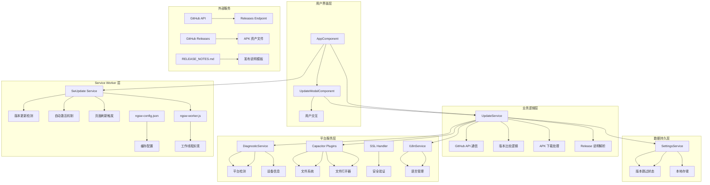
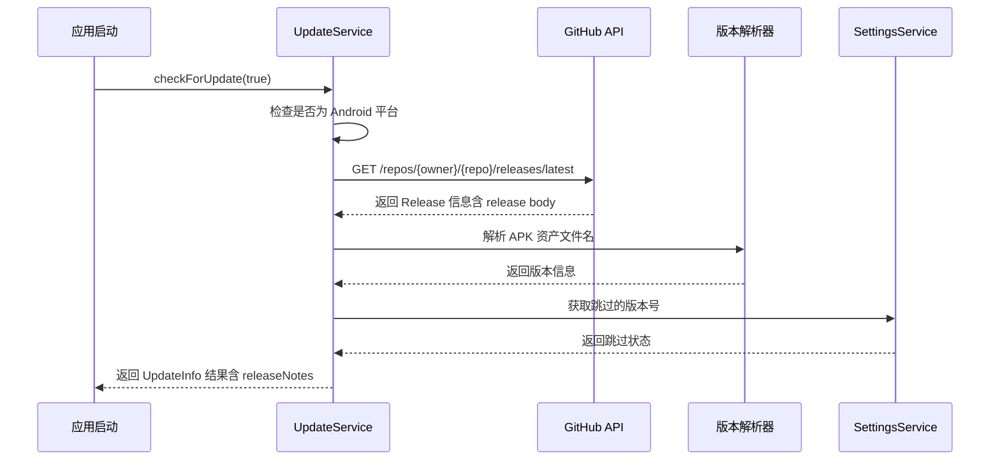
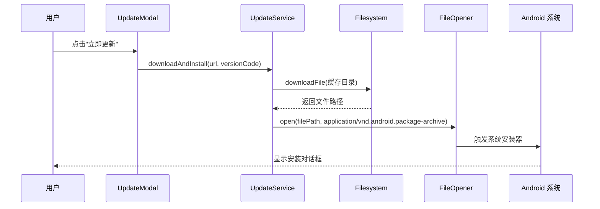
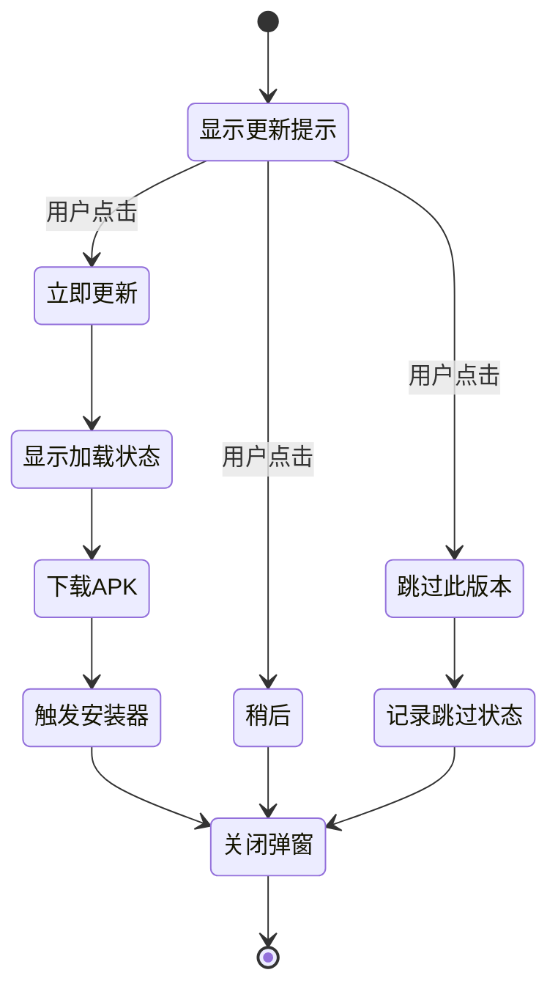
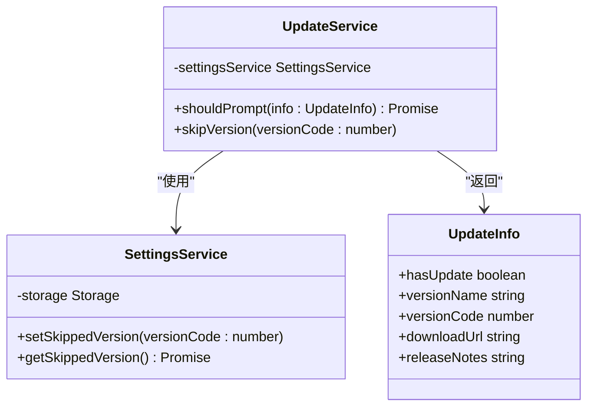
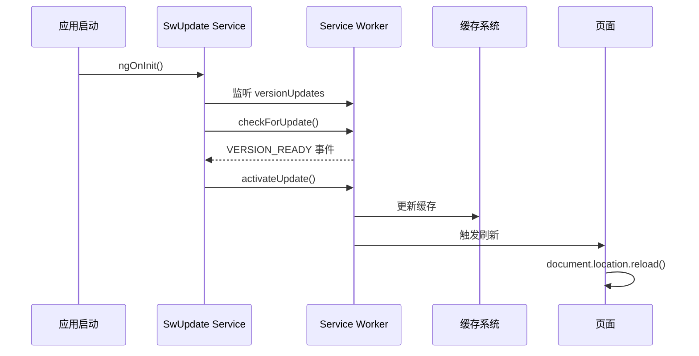
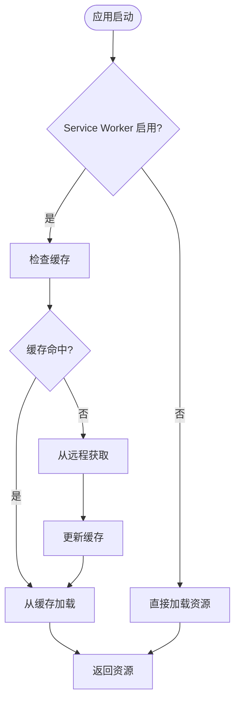
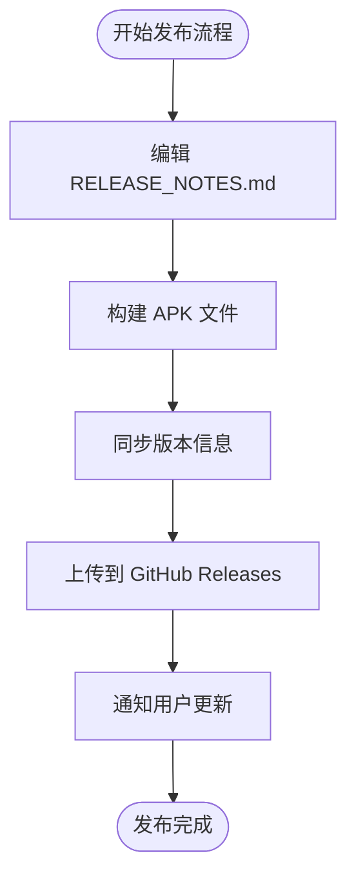
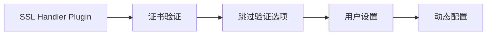
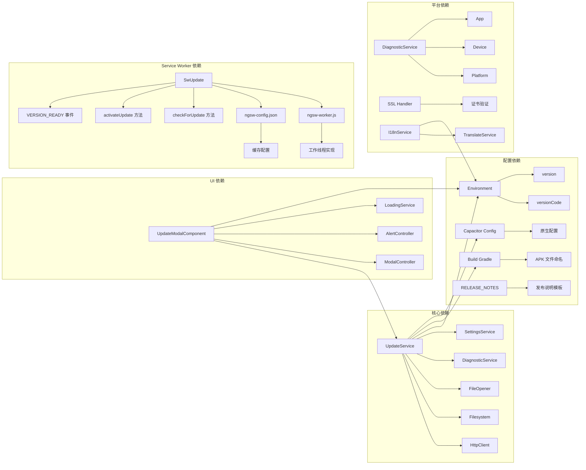

# 应用程序更新系统

<cite>
**本文档引用的文件**
- [app.component.ts](file://src/app/app.component.ts)
- [update.service.ts](file://src/app/services/update/update.service.ts)
- [update-modal.component.ts](file://src/app/pages/shared/modals/update-modal/update-modal.component.ts)
- [update-modal.component.html](file://src/app/pages/shared/modals/update-modal/update-modal.component.html)
- [settings.service.ts](file://src/app/services/settings/settings.service.ts)
- [diagnostic.service.ts](file://src/app/services/diagnostic/diagnostic.service.ts)
- [i18n.service.ts](file://src/app/services/i18n/i18n.service.ts)
- [environment.ts](file://src/environments/environment.ts)
- [environment.prod.ts](file://src/environments/environment.prod.ts)
- [package.json](file://package.json)
- [angular.json](file://angular.json)
- [capacitor.config.ts](file://capacitor.config.ts)
- [build.gradle](file://android/app/build.gradle)
- [ngsw-config.json](file://ngsw-config.json)
- [ngsw-worker.js](file://android/app/src/main/assets/public/ngsw-worker.js)
- [safety-worker.js](file://android/app/src/main/assets/public/safety-worker.js)
- [worker-basic.min.js](file://android/app/src/main/assets/public/worker-basic.min.js)
- [RELEASE_NOTES.md](file://RELEASE_NOTES.md)
</cite>

## 更新摘要
**所做更改**
- 新增Angular Service Worker版本管理功能，在AppComponent中集成SwUpdate服务
- 实现自动版本检测、激活和页面刷新机制，确保APK更新后i18n等静态资源及时生效
- 完善Service Worker配置和工作线程实现
- 增强版本管理集成和发布流程的详细描述
- 新增i18n静态资源缓存失效处理机制

## 目录
1. [简介](#简介)
2. [项目结构](#项目结构)
3. [核心组件](#核心组件)
4. [架构概览](#架构概览)
5. [详细组件分析](#详细组件分析)
6. [Angular Service Worker版本管理](#angular-service-worker版本管理)
7. [GitHub Release 发布功能](#github-release-发布功能)
8. [Capacitor 插件集成增强](#capacitor-插件集成增强)
9. [依赖关系分析](#依赖关系分析)
10. [性能考虑](#性能考虑)
11. [故障排除指南](#故障排除指南)
12. [结论](#结论)

## 简介

Macro Deck 客户端应用程序更新系统是一个基于 GitHub Releases 的应用内更新解决方案，专为 Android 原生平台设计。该系统实现了自动检查更新、版本比较、APK下载和系统安装器触发等功能，为用户提供无缝的应用程序更新体验。

**新增功能**：
- GitHub Release 发布自动化流程
- RELEASE_NOTES.md 模板文件支持
- 增强的 Capacitor 插件集成
- 完善的权限要求和安全策略
- **新增**：Angular Service Worker版本管理功能
- **新增**：自动版本检测、激活和页面刷新机制
- **新增**：i18n静态资源缓存失效处理

系统的核心特点包括：
- 基于 GitHub API 的版本检查
- 自动解析 APK 资产文件名格式
- 原生 Android 平台的直接安装支持
- 用户友好的更新提示界面
- 版本跳过功能，防止重复提醒
- 自动化的发布流程和更新说明管理
- **新增**：Service Worker自动刷新确保静态资源更新
- **新增**：i18n国际化资源的实时更新支持

## 项目结构

应用程序更新系统主要分布在以下目录结构中：

```mermaid
graph TB
subgraph "更新系统核心"
A[src/app/services/update/] --> B[update.service.ts]
C[src/app/pages/shared/modals/update-modal/] --> D[update-modal.component.ts]
E[src/app/pages/shared/modals/update-modal/] --> F[update-modal.component.html]
end
subgraph "支持服务"
G[src/app/services/settings/] --> H[settings.service.ts]
I[src/app/services/diagnostic/] --> J[diagnostic.service.ts]
K[src/app/services/i18n/] --> L[i18n.service.ts]
M[src/app/services/] --> N[其他服务]
end
subgraph "配置文件"
O[angular.json] --> P[构建配置]
Q[package.json] --> R[依赖管理]
S[capacitor.config.ts] --> T[原生配置]
U[environment.ts] --> V[版本信息]
W[ngsw-config.json] --> X[Service Worker配置]
Y[RELEASE_NOTES.md] --> Z[发布说明模板]
end
subgraph "Android 配置"
AA[android/app/build.gradle] --> BB[APK 文件命名规则]
CC[ngsw-worker.js] --> DD[Service Worker 工作线程]
EE[safety-worker.js] --> FF[Safety Worker]
GG[worker-basic.min.js] --> HH[基础 Worker]
end
subgraph "Capacitor 插件"
II[capacitor_plugins/] --> JJ[SSL Handler]
KK[@capacitor-community/file-opener] --> LL[文件打开器]
MM[@capacitor-community/file-system] --> NN[文件系统]
OO[@angular/service-worker] --> PP[Service Worker]
end
B --> H
B --> J
D --> B
D --> H
L --> V
A --> O
A --> Q
A --> Y
```

**图表来源**
- [update.service.ts:1-149](file://src/app/services/update/update.service.ts#L1-L149)
- [update-modal.component.ts:1-62](file://src/app/pages/shared/modals/update-modal/update-modal.component.ts#L1-L62)
- [settings.service.ts:1-283](file://src/app/services/settings/settings.service.ts#L1-L283)
- [i18n.service.ts:1-45](file://src/app/services/i18n/i18n.service.ts#L1-L45)
- [ngsw-config.json:1-31](file://ngsw-config.json#L1-L31)
- [ngsw-worker.js:170-1657](file://android/app/src/main/assets/public/ngsw-worker.js#L170-L1657)

**章节来源**
- [update.service.ts:1-149](file://src/app/services/update/update.service.ts#L1-L149)
- [update-modal.component.ts:1-62](file://src/app/pages/shared/modals/update-modal/update-modal.component.ts#L1-L62)
- [settings.service.ts:1-283](file://src/app/services/settings/settings.service.ts#L1-L283)
- [i18n.service.ts:1-45](file://src/app/services/i18n/i18n.service.ts#L1-L45)

## 核心组件

### UpdateService - 更新服务

UpdateService 是整个更新系统的核心，负责与 GitHub API 交互、解析版本信息、处理 APK 下载和安装。

**主要功能**：
- GitHub Releases API 调用和版本检查
- APK 资产文件名解析（MacroDeckClient-{versionName}-{versionCode}.apk）
- 版本比较逻辑（基于 versionCode）
- 应用内 APK 下载和系统安装器触发
- 更新跳过功能管理
- **新增**：集成 GitHub Release 说明内容

**关键接口**：
- `checkForUpdate(silent: boolean)`: 检查是否有新版本
- `shouldPrompt(info: UpdateInfo)`: 判断是否应该显示更新提示
- `skipVersion(versionCode: number)`: 跳过特定版本
- `downloadAndInstall(url: string, versionCode: number)`: 下载并安装 APK

### UpdateModalComponent - 更新提示组件

这是一个基于 Ionic Modal 的用户界面组件，提供更新提示和用户交互功能。

**主要功能**：
- 显示新版本信息（版本号、更新说明）
- 提供立即更新、稍后、跳过此版本三个选项
- 集成加载状态管理和错误处理
- **新增**：显示 GitHub Release 说明内容

**用户交互**：
- 立即更新：触发下载和安装流程
- 稍后：关闭弹窗，后续启动时再次提示
- 跳过此版本：记录版本号，避免重复提醒

### SettingsService - 设置服务

提供更新相关的持久化存储功能，特别是版本跳过功能。

**关键功能**：
- 存储用户跳过的版本号（skipped_update_version）
- 提供版本跳过状态查询
- 使用 Ionic Storage 实现跨平台数据持久化

### I18nService - 国际化服务

**新增**：负责应用语言的初始化、切换与持久化管理。

**主要功能**：
- 支持语言列表管理（en, zh）
- 默认语言设置（en）
- 语言切换和持久化
- 应用启动时的语言初始化

**章节来源**
- [update.service.ts:29-149](file://src/app/services/update/update.service.ts#L29-L149)
- [update-modal.component.ts:8-62](file://src/app/pages/shared/modals/update-modal/update-modal.component.ts#L8-L62)
- [settings.service.ts:35-49](file://src/app/services/settings/settings.service.ts#L35-L49)
- [i18n.service.ts:10-45](file://src/app/services/i18n/i18n.service.ts#L10-L45)

## 架构概览

应用程序更新系统采用分层架构设计，确保各组件职责清晰分离：



**图表来源**
- [app.component.ts:75-96](file://src/app/app.component.ts#L75-L96)
- [update.service.ts:34-41](file://src/app/services/update/update.service.ts#L34-L41)
- [settings.service.ts:25-283](file://src/app/services/settings/settings.service.ts#L25-L283)
- [app.component.ts:19-20](file://src/app/app.component.ts#L19-L20)

系统的工作流程遵循以下模式：
1. 应用启动时静默检查更新
2. 检查结果决定是否显示更新提示
3. 用户选择更新选项
4. 系统处理 APK 下载和安装
5. **新增**：Service Worker自动检测新版本并刷新页面
6. **新增**：确保i18n等静态资源及时更新

## 详细组件分析

### UpdateService 详细分析

UpdateService 实现了完整的应用内更新流程，具有以下关键特性：

#### 版本检查流程



**图表来源**
- [update.service.ts:48-87](file://src/app/services/update/update.service.ts#L48-L87)
- [update.service.ts:141-147](file://src/app/services/update/update.service.ts#L141-L147)

#### 版本比较算法

系统使用 versionCode 进行版本比较，这是 Android 应用的标准做法：


**图表来源**
- [update.service.ts:79-86](file://src/app/services/update/update.service.ts#L79-L86)
- [update.service.ts:93-99](file://src/app/services/update/update.service.ts#L93-L99)

#### APK 下载和安装流程



**图表来源**
- [update-modal.component.ts:32-49](file://src/app/pages/shared/modals/update-modal/update-modal.component.ts#L32-L49)
- [update.service.ts:115-134](file://src/app/services/update/update.service.ts#L115-L134)

### UpdateModalComponent 分析

UpdateModalComponent 提供了直观的用户界面，包含以下功能：

#### 界面布局结构

| 区域 | 功能 | 组件 |
|------|------|------|
| 头部 | 更新标题 | IonToolbar + IonTitle |
| 内容区 | 版本信息和更新说明 | HTML + TranslatePipe |
| 底部 | 操作按钮 | IonButton (3个) |

#### 用户交互流程



**图表来源**
- [update-modal.component.html:1-34](file://src/app/pages/shared/modals/update-modal/update-modal.component.html#L1-L34)
- [update-modal.component.ts:32-60](file://src/app/pages/shared/modals/update-modal/update-modal.component.ts#L32-L60)

### SettingsService 集成分析

SettingsService 通过存储键名 `skipped_update_version` 实现版本跳过功能：



**图表来源**
- [settings.service.ts:35-49](file://src/app/services/settings/settings.service.ts#L35-L49)
- [update.service.ts:93-107](file://src/app/services/update/update.service.ts#L93-L107)

**章节来源**
- [update.service.ts:1-149](file://src/app/services/update/update.service.ts#L1-L149)
- [update-modal.component.ts:1-62](file://src/app/pages/shared/modals/update-modal/update-modal.component.ts#L1-L62)
- [settings.service.ts:1-283](file://src/app/services/settings/settings.service.ts#L1-L283)

## Angular Service Worker版本管理

### Service Worker集成概述

**新增**：系统集成了完整的 Angular Service Worker版本管理功能，确保APK更新后i18n等静态资源能够及时生效。

#### SwUpdate服务集成

AppComponent中集成了SwUpdate服务，实现了以下功能：

1. **自动版本检测**：监听Service Worker版本更新事件
2. **自动激活机制**：新版本就绪后自动激活
3. **页面刷新触发**：激活后自动刷新页面确保资源更新
4. **静默更新检查**：启动时主动触发SW更新检查

#### Service Worker配置

ngsw-config.json提供了完整的缓存配置：

```json
{
  "index": "/index.html",
  "assetGroups": [
    {
      "name": "Macro Deck Client",
      "installMode": "prefetch",
      "resources": {
        "files": ["/favicon.ico", "/index.html", "/manifest.webmanifest", "/*.css", "/*.js"]
      }
    },
    {
      "name": "assets",
      "installMode": "lazy",
      "updateMode": "prefetch",
      "resources": {
        "files": ["/assets/**", "/*.(svg|cur|jpg|jpeg|png|apng|webp|avif|gif|otf|ttf|woff|woff2)"]
      }
    }
  ]
}
```

#### 版本更新检测流程



**图表来源**
- [app.component.ts:78-89](file://src/app/app.component.ts#L78-L89)
- [ngsw-config.json:1-31](file://ngsw-config.json#L1-L31)

### Service Worker工作线程实现

**新增**：ngsw-worker.js提供了完整的Service Worker实现，包括：

1. **适配器层**：处理浏览器缓存API
2. **数据库层**：管理缓存元数据
3. **驱动层**：协调版本管理和缓存更新
4. **应用版本层**：处理具体资源的缓存策略

#### 缓存管理机制

Service Worker实现了智能的缓存管理：



**图表来源**
- [ngsw-worker.js:1242-1783](file://android/app/src/main/assets/public/ngsw-worker.js#L1242-L1783)

### i18n静态资源更新保障

**新增**：Service Worker确保i18n国际化资源能够及时更新：

1. **资源组配置**：assets组包含所有静态资源
2. **懒加载策略**：非关键资源采用懒加载
3. **预取更新**：新版本资源预取更新
4. **缓存失效**：新版本激活时自动失效旧缓存

**章节来源**
- [app.component.ts:19-20](file://src/app/app.component.ts#L19-L20)
- [app.component.ts:78-89](file://src/app/app.component.ts#L78-L89)
- [ngsw-config.json:1-31](file://ngsw-config.json#L1-L31)
- [ngsw-worker.js:170-1657](file://android/app/src/main/assets/public/ngsw-worker.js#L170-L1657)

## GitHub Release 发布功能

### 发布流程概述

系统集成了完整的 GitHub Release 发布功能，支持自动化发布流程和标准化的更新说明管理。

#### 发布说明模板

**RELEASE_NOTES.md** 文件提供了标准化的发布说明模板：

```markdown
# 更新说明

<!--
每次发布前编辑此文件，内容将作为 GitHub Release 的说明（release body）。
发布命令：.\scripts\windows\build_android_bywin.ps1 -Publish
-->

## 本次更新
- 
```

#### 自动化发布流程



**图表来源**
- [RELEASE_NOTES.md:1-10](file://RELEASE_NOTES.md#L1-L10)

### 版本管理集成

系统通过多种方式管理版本信息：

1. **Angular 环境配置**：`environment.ts` 和 `environment.prod.ts`
2. **Android 构建配置**：`build.gradle` 中的 `versionCode` 和 `versionName`
3. **GitHub Releases**：自动解析 APK 文件名格式
4. **发布说明模板**：标准化的更新内容管理

**章节来源**
- [package.json:17-62](file://package.json#L17-L62)
- [angular.json:44-45](file://angular.json#L44-L45)
- [build.gradle:10-11](file://android/app/build.gradle#L10-L11)
- [RELEASE_NOTES.md:1-10](file://RELEASE_NOTES.md#L1-L10)

## Capacitor 插件集成增强

### 插件生态系统

系统集成了多个 Capacitor 插件来增强功能和性能：

#### 核心插件列表

| 插件名称 | 版本 | 功能 | 用途 |
|----------|------|------|------|
| @capacitor-community/file-opener | 7.0.1 | APK 打开器 | 应用内安装 |
| @capacitor-community/file-system | 7.1.8 | 文件下载 | 缓存管理 |
| @capacitor/app | 7.0.1 | 应用信息 | 版本检测 |
| @capacitor/device | 7.0.1 | 设备信息 | 平台检测 |
| @capacitor-community/barcode-scanner | 4.0.1 | 条形码扫描 | 快速设置 |
| @capacitor-community/keep-awake | 7.0.0 | 屏幕常亮 | 用户体验 |
| **新增**：@angular/service-worker | 19.2.6 | Service Worker | 版本管理 |

#### SSL Handler 插件

系统集成了自定义的 SSL Handler 插件，用于处理 HTTPS 证书验证：



**图表来源**
- [app.component.ts:5,6:5-6](file://src/app/app.component.ts#L5-L6)

### 权限要求增强

#### Android 权限配置

系统需要以下权限来支持完整的更新功能：

1. **REQUEST_INSTALL_PACKAGES**：允许安装未知来源的应用
2. **ACCESS_NETWORK_STATE**：网络状态检测
3. **INTERNET**：网络访问权限
4. **WRITE_EXTERNAL_STORAGE**：文件写入权限（缓存）
5. ****新增**：Service Worker相关权限**

#### 安全考虑

- **HTTPS 强制**：所有更新通过 HTTPS 下载
- **文件完整性验证**：APK 文件校验
- **用户授权**：安装前需要用户确认
- ****新增**：Service Worker安全验证机制**

**章节来源**
- [package.json:30-40](file://package.json#L30-L40)
- [app.component.ts:60-63](file://src/app/app.component.ts#L60-L63)

## 依赖关系分析

### 外部依赖

应用程序更新系统依赖以下关键外部组件：

| 依赖项 | 版本 | 用途 | 重要性 |
|--------|------|------|--------|
| @angular/common/http | 19.2.6 | HTTP 请求 | 高 |
| @capacitor-community/file-opener | 7.0.1 | APK 打开器 | 高 |
| @capacitor-community/file-system | 7.1.8 | 文件下载 | 高 |
| @capacitor/app | 7.0.1 | 应用信息获取 | 中 |
| @capacitor/device | 7.0.1 | 设备信息获取 | 中 |
| @ionic/storage | 4.0.0 | 本地存储 | 高 |
| **新增**：@angular/service-worker | 19.2.6 | Service Worker | 高 |
| **新增**：@capacitor-community/barcode-scanner | 4.0.1 | 条形码扫描 | 中 |
| **新增**：@capacitor-community/keep-awake | 7.0.0 | 屏幕常亮 | 中 |

### 内部依赖关系



**图表来源**
- [update.service.ts:1-8](file://src/app/services/update/update.service.ts#L1-L8)
- [update-modal.component.ts:1-6](file://src/app/pages/shared/modals/update-modal/update-modal.component.ts#L1-L6)
- [app.component.ts:19-20](file://src/app/app.component.ts#L19-L20)

### 版本管理集成

系统通过多种方式管理版本信息：

1. **Angular 环境配置**：`environment.ts` 和 `environment.prod.ts`
2. **Android 构建配置**：`build.gradle` 中的 `versionCode` 和 `versionName`
3. **GitHub Releases**：自动解析 APK 文件名格式
4. **发布说明模板**：标准化的更新内容管理
5. ****新增**：Service Worker版本管理**：自动检测和激活新版本

**章节来源**
- [package.json:17-62](file://package.json#L17-L62)
- [angular.json:44-45](file://angular.json#L44-L45)
- [build.gradle:10-11](file://android/app/build.gradle#L10-L11)
- [RELEASE_NOTES.md:1-10](file://RELEASE_NOTES.md#L1-L10)

## 性能考虑

### 网络请求优化

系统采用了多项网络请求优化策略：

1. **超时控制**：GitHub API 请求设置 10 秒超时
2. **错误处理**：静默失败，不影响应用启动
3. **缓存策略**：Service Worker 预缓存静态资源
4. ****新增**：Release 说明内容的智能缓存**
5. ****新增**：Service Worker缓存失效机制**

### 内存管理

- 使用 `firstValueFrom` 将 Observable 转换为 Promise，简化异步处理
- 及时释放网络请求和文件句柄
- 避免在更新过程中阻塞主线程
- **新增**：Service Worker内存优化**
- **新增**：i18n资源的智能缓存管理**

### 存储优化

- 使用 Ionic Storage 进行轻量级数据持久化
- 版本跳过状态只存储必要的 versionCode
- 避免频繁的存储操作
- **新增**：APK 文件的智能清理机制**
- **新增**：Service Worker缓存的自动清理**

### Service Worker性能优化

**新增**：Service Worker实现了多项性能优化：

1. **智能缓存策略**：prefetch和lazy模式结合使用
2. **资源组管理**：不同类型资源采用不同缓存策略
3. **缓存失效机制**：新版本自动失效旧缓存
4. **内存使用优化**：避免不必要的资源缓存
5. **网络请求优化**：减少重复的网络请求

**章节来源**
- [update.service.ts:56-65](file://src/app/services/update/update.service.ts#L56-L65)
- [update-modal.component.ts:39-48](file://src/app/pages/shared/modals/update-modal/update-modal.component.ts#L39-L48)

## 故障排除指南

### 常见问题及解决方案

#### GitHub API 访问问题

**症状**：更新检查失败，无更新提示
**原因**：网络连接问题或 GitHub API 限制
**解决方案**：
1. 检查网络连接状态
2. 验证 GitHub API 可访问性
3. 确认防火墙设置

#### APK 下载失败

**症状**：点击"立即更新"后无响应或报错
**原因**：文件系统权限或存储空间不足
**解决方案**：
1. 检查应用存储权限
2. 确认设备有足够的存储空间
3. 清理缓存目录

#### 安装器无法启动

**症状**：APK 下载完成但不触发安装
**原因**：Android 系统设置或安全策略
**解决方案**：
1. 检查"允许未知来源"设置
2. 确认 REQUEST_INSTALL_PACKAGES 权限
3. 重新尝试安装过程

#### 版本跳过功能失效

**症状**：用户跳过后仍收到更新提示
**原因**：存储数据损坏或版本号比较错误
**解决方案**：
1. 清除应用缓存和数据
2. 重新设置版本跳过状态
3. 检查版本号格式正确性

#### **新增**：Release 说明显示问题

**症状**：更新说明不显示或显示异常
**原因**：GitHub Release 说明格式问题
**解决方案**：
1. 检查 RELEASE_NOTES.md 格式
2. 验证 GitHub Release 说明内容
3. 确认 Markdown 格式正确性

#### **新增**：Service Worker版本更新问题

**症状**：APK更新后i18n等静态资源未更新
**原因**：Service Worker缓存未失效或更新未激活
**解决方案**：
1. 检查Service Worker是否启用
2. 验证SwUpdate服务是否正常工作
3. 确认VERSION_READY事件是否触发
4. 手动清除浏览器缓存
5. 重启应用确保Service Worker重新注册

#### **新增**：i18n资源更新延迟

**症状**：语言切换后界面文本未更新
**原因**：Service Worker缓存了旧的i18n文件
**解决方案**：
1. 确保Service Worker自动刷新机制正常工作
2. 检查ngsw-config.json中的assets组配置
3. 验证i18n文件是否包含在缓存范围内
4. 手动触发Service Worker更新检查

### 调试建议

1. **启用详细日志**：在开发环境中查看网络请求和文件操作日志
2. **检查平台兼容性**：验证 Android 版本支持情况
3. **测试边界条件**：验证版本号比较逻辑的正确性
4. ****新增**：验证 Service Worker 更新流程**
5. ****新增**：检查 i18n 资源的缓存失效机制**
6. ****新增**：监控 Service Worker 的版本更新事件**

**章节来源**
- [update.service.ts:56-65](file://src/app/services/update/update.service.ts#L56-L65)
- [update-modal.component.ts:39-48](file://src/app/pages/shared/modals/update-modal/update-modal.component.ts#L39-L48)

## 结论

Macro Deck 客户端应用程序更新系统是一个设计精良的原生 Android 更新解决方案。系统的主要优势包括：

### 技术优势

1. **平台适配性**：专门针对 Android 原生平台优化，充分利用系统能力
2. **用户体验**：提供直观的更新提示界面和流畅的安装流程
3. **可靠性**：完善的错误处理和降级策略
4. **扩展性**：模块化设计便于功能扩展和维护
5. ****新增**：完整的 GitHub Release 发布自动化流程**
6. ****新增**：增强的 Capacitor 插件生态系统**
7. ****新增**：Angular Service Worker版本管理功能**
8. ****新增**：i18n静态资源的实时更新保障**

### 架构特点

- **分层清晰**：UI、业务逻辑、数据持久化职责明确
- **依赖管理**：合理的外部依赖控制和版本管理
- **错误处理**：全面的异常捕获和用户反馈机制
- **性能优化**：网络请求超时、静默失败等优化措施
- ****新增**：Service Worker智能缓存管理**
- ****新增**：i18n资源的自动失效机制**

### 改进建议

1. **增强安全性**：添加 APK 文件完整性验证
2. **提升用户体验**：增加更新进度显示和断点续传
3. **国际化支持**：完善多语言更新说明支持
4. **监控改进**：添加更新成功率统计和错误报告
5. ****新增**：优化 GitHub Release 发布流程的自动化程度**
6. ****新增**：增强 Capacitor 插件的安全验证机制**
7. ****新增**：Service Worker性能监控和调试工具**
8. ****新增**：i18n资源更新的实时监控机制**

该更新系统为 Macro Deck 客户端提供了可靠的版本管理能力，确保用户能够及时获得最新的功能和修复。新增的 GitHub Release 发布功能、Capacitor 插件集成、Angular Service Worker版本管理和i18n静态资源更新保障进一步增强了系统的完整性和用户体验。这些改进确保了APK更新后i18n等静态资源能够及时生效，提升了应用的整体性能和用户体验。