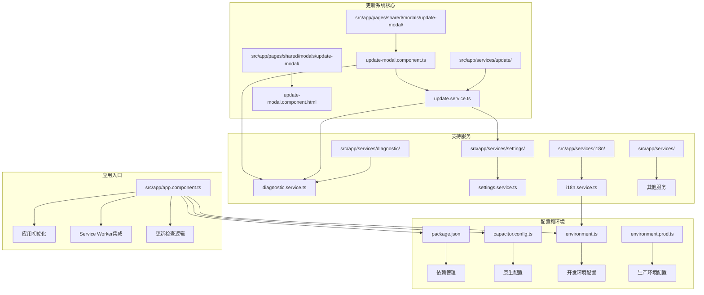
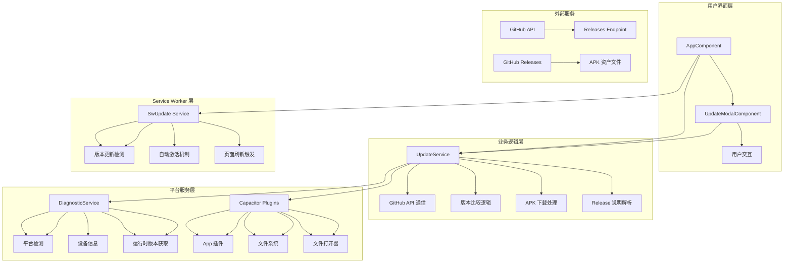
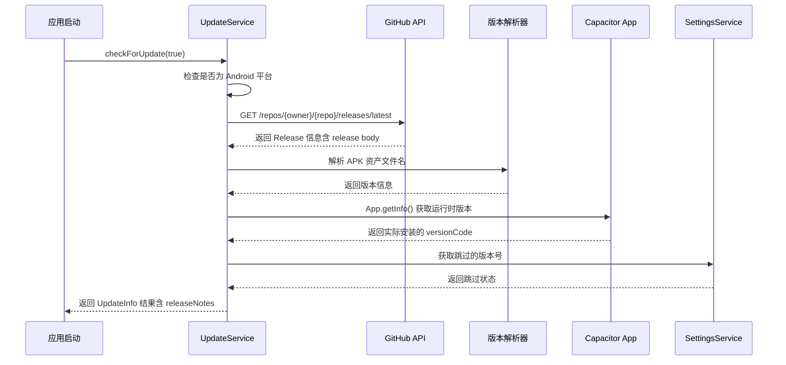
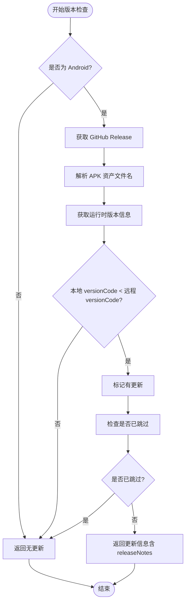
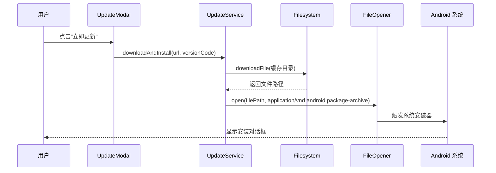
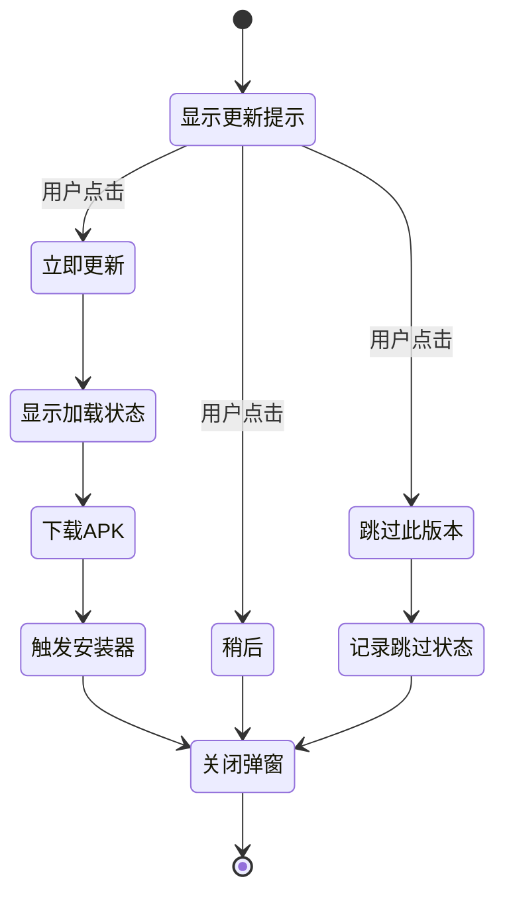
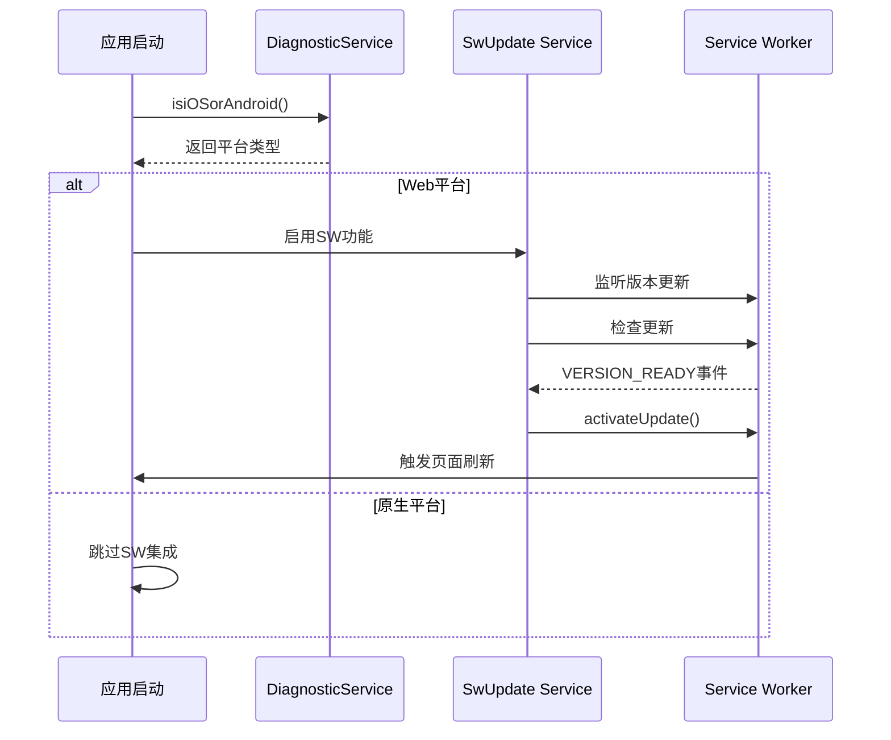
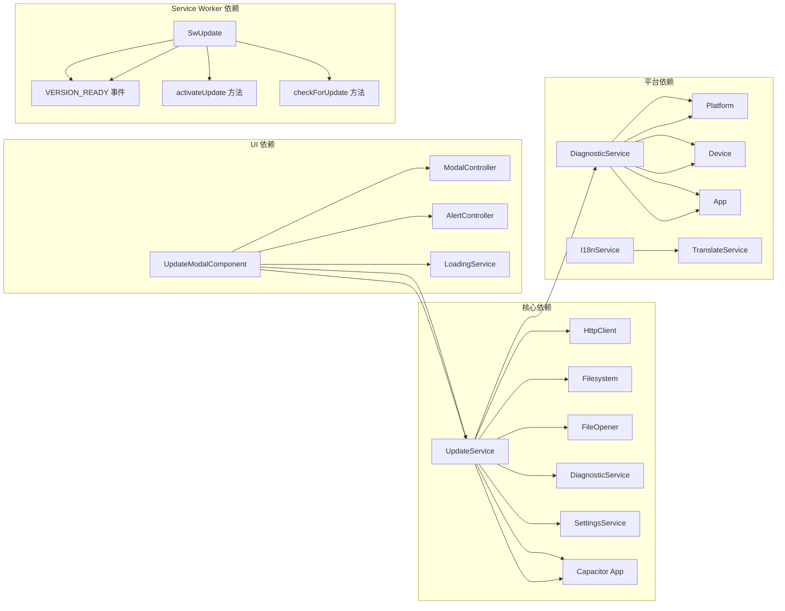

# 应用程序更新系统

<cite>
**本文档引用的文件**
- [app.component.ts](file://src/app/app.component.ts)
- [update.service.ts](file://src/app/services/update/update.service.ts)
- [update-modal.component.ts](file://src/app/pages/shared/modals/update-modal/update-modal.component.ts)
- [update-modal.component.html](file://src/app/pages/shared/modals/update-modal/update-modal.component.html)
- [diagnostic.service.ts](file://src/app/services/diagnostic/diagnostic.service.ts)
- [environment.ts](file://src/environments/environment.ts)
- [environment.prod.ts](file://src/environments/environment.prod.ts)
- [package.json](file://package.json)
- [capacitor.config.ts](file://capacitor.config.ts)
</cite>

## 更新摘要
**所做更改**
- **新增**：Service Worker平台特定行为改进，防止在原生平台上出现无限刷新循环
- **增强**：版本检测机制使用Capacitor App插件获取运行时版本信息
- **优化**：更新模态框UI显示格式为v{{ environment.version }}.{{ environment.versionCode }}
- **改进**：增强的平台检测和错误处理机制

## 目录
1. [简介](#简介)
2. [项目结构](#项目结构)
3. [核心组件](#核心组件)
4. [架构概览](#架构概览)
5. [详细组件分析](#详细组件分析)
6. [Angular Service Worker平台特定优化](#angular-service-worker平台特定优化)
7. [版本检测机制增强](#版本检测机制增强)
8. [更新模态框UI优化](#更新模态框ui优化)
9. [依赖关系分析](#依赖关系分析)
10. [性能考虑](#性能考虑)
11. [故障排除指南](#故障排除指南)
12. [结论](#结论)

## 简介

Macro Deck 客户端应用程序更新系统是一个基于 GitHub Releases 的应用内更新解决方案，专为 Android 原生平台设计。该系统实现了自动检查更新、版本比较、APK下载和系统安装器触发等功能，为用户提供无缝的应用程序更新体验。

**最新改进**：
- **新增**：Service Worker平台特定行为优化，防止原生平台无限刷新循环
- **增强**：版本检测机制使用Capacitor App插件获取准确的运行时版本信息
- **优化**：更新模态框UI显示格式改进，提供更清晰的版本信息展示
- **改进**：增强的平台检测和错误处理机制

系统的核心特点包括：
- 基于 GitHub API 的版本检查
- 自动解析 APK 资产文件名格式
- 原生 Android 平台的直接安装支持
- 用户友好的更新提示界面
- 版本跳过功能，防止重复提醒
- **新增**：Service Worker平台特定优化避免原生平台问题
- **新增**：增强的运行时版本检测机制
- **新增**：优化的版本信息显示格式

## 项目结构

应用程序更新系统主要分布在以下目录结构中：



**图表来源**
- [update.service.ts:1-153](file://src/app/services/update/update.service.ts#L1-L153)
- [update-modal.component.ts:1-62](file://src/app/pages/shared/modals/update-modal/update-modal.component.ts#L1-L62)
- [diagnostic.service.ts:1-93](file://src/app/services/diagnostic/diagnostic.service.ts#L1-L93)
- [app.component.ts:1-117](file://src/app/app.component.ts#L1-L117)

## 核心组件

### UpdateService - 更新服务

UpdateService 是整个更新系统的核心，负责与 GitHub API 交互、解析版本信息、处理 APK 下载和安装。

**主要功能**：
- GitHub Releases API 调用和版本检查
- APK 资产文件名解析（MacroDeckClient-{versionName}-{versionCode}.apk）
- **增强**：使用Capacitor App插件获取运行时版本信息进行准确比较
- 版本比较逻辑（基于 versionCode）
- 应用内 APK 下载和系统安装器触发
- 更新跳过功能管理
- Release 说明内容集成

**关键接口**：
- `checkForUpdate(silent: boolean)`: 检查是否有新版本
- `shouldPrompt(info: UpdateInfo)`: 判断是否应该显示更新提示
- `skipVersion(versionCode: number)`: 跳过特定版本
- `downloadAndInstall(url: string, versionCode: number)`: 下载并安装 APK

### UpdateModalComponent - 更新提示组件

这是一个基于 Ionic Modal 的用户界面组件，提供更新提示和用户交互功能。

**主要功能**：
- 显示新版本信息（版本号、更新说明）
- **优化**：改进的版本显示格式 v{{ environment.version }}.{{ environment.versionCode }}
- 提供立即更新、稍后、跳过此版本三个选项
- 集成加载状态管理和错误处理
- Release 说明内容显示

**用户交互**：
- 立即更新：触发下载和安装流程
- 稍后：关闭弹窗，后续启动时再次提示
- 跳过此版本：记录版本号，避免重复提醒

### DiagnosticService - 诊断服务

**增强**：提供平台检测和版本信息获取功能。

**关键功能**：
- 平台检测（Android、iOS、Web）
- **增强**：运行时版本信息获取
- 设备信息获取
- 版本格式化显示

**章节来源**
- [update.service.ts:29-153](file://src/app/services/update/update.service.ts#L29-L153)
- [update-modal.component.ts:8-62](file://src/app/pages/shared/modals/update-modal/update-modal.component.ts#L8-L62)
- [diagnostic.service.ts:15-29](file://src/app/services/diagnostic/diagnostic.service.ts#L15-L29)

## 架构概览

应用程序更新系统采用分层架构设计，确保各组件职责清晰分离：



**图表来源**
- [app.component.ts:78-92](file://src/app/app.component.ts#L78-L92)
- [update.service.ts:48-91](file://src/app/services/update/update.service.ts#L48-L91)
- [diagnostic.service.ts:20-29](file://src/app/services/diagnostic/diagnostic.service.ts#L20-L29)

系统的工作流程遵循以下模式：
1. 应用启动时静默检查更新
2. **新增**：Service Worker仅在Web平台启用，避免原生平台问题
3. 检查结果决定是否显示更新提示
4. 用户选择更新选项
5. 系统处理 APK 下载和安装
6. **增强**：使用运行时版本信息进行准确比较

## 详细组件分析

### UpdateService 详细分析

UpdateService 实现了完整的应用内更新流程，具有以下关键特性：

#### 版本检查流程



**图表来源**
- [update.service.ts:48-91](file://src/app/services/update/update.service.ts#L48-L91)
- [update.service.ts:79-82](file://src/app/services/update/update.service.ts#L79-L82)

#### 增强的版本比较算法

系统现在使用运行时版本信息进行更准确的版本比较：



**图表来源**
- [update.service.ts:79-82](file://src/app/services/update/update.service.ts#L79-L82)
- [update.service.ts:84](file://src/app/services/update/update.service.ts#L84)

#### APK 下载和安装流程



**图表来源**
- [update-modal.component.ts:32-49](file://src/app/pages/shared/modals/update-modal/update-modal.component.ts#L32-L49)
- [update.service.ts:119-138](file://src/app/services/update/update.service.ts#L119-L138)

### UpdateModalComponent 分析

UpdateModalComponent 提供了直观的用户界面，包含以下功能：

#### 界面布局结构

| 区域 | 功能 | 组件 |
|------|------|------|
| 头部 | 更新标题 | IonToolbar + IonTitle |
| 内容区 | 版本信息和更新说明 | HTML + TranslatePipe |
| 底部 | 操作按钮 | IonButton (3个) |

#### 增强的版本显示格式

**优化**：版本信息显示格式改进为 `v{{ environment.version }}.{{ environment.versionCode }}`

#### 用户交互流程



**图表来源**
- [update-modal.component.html:1-34](file://src/app/pages/shared/modals/update-modal/update-modal.component.html#L1-L34)
- [update-modal.component.ts:32-60](file://src/app/pages/shared/modals/update-modal/update-modal.component.ts#L32-L60)

**章节来源**
- [update.service.ts:1-153](file://src/app/services/update/update.service.ts#L1-L153)
- [update-modal.component.ts:1-62](file://src/app/pages/shared/modals/update-modal/update-modal.component.ts#L1-L62)
- [diagnostic.service.ts:1-93](file://src/app/services/diagnostic/diagnostic.service.ts#L1-L93)

## Angular Service Worker平台特定优化

### Service Worker平台检测优化

**新增**：系统实现了智能的平台检测逻辑，防止在原生平台上出现无限刷新循环问题。

#### 平台特定行为控制

AppComponent中集成了平台检测逻辑：

1. **平台检测**：使用 `diagnosticService.isiOSorAndroid()` 检测原生平台
2. **条件启用**：仅在非原生平台（Web/PWA）启用 Service Worker
3. **问题预防**：避免在 Capacitor 的 http://localhost 环境下因缓存不匹配导致的无限 reload 循环

#### Service Worker集成逻辑



**图表来源**
- [app.component.ts:78-92](file://src/app/app.component.ts#L78-L92)

### 平台检测机制

**增强**：DiagnosticService 提供了完整的平台检测功能：

1. **原生平台检测**：`isiOSorAndroid()` 方法
2. **单独平台检测**：`isAndroid()` 和 `isiOS()` 方法
3. **版本信息获取**：`getVersion()` 方法支持多平台版本格式化

**章节来源**
- [app.component.ts:78-92](file://src/app/app.component.ts#L78-L92)
- [diagnostic.service.ts:85-91](file://src/app/services/diagnostic/diagnostic.service.ts#L85-L91)

## 版本检测机制增强

### 运行时版本信息获取

**增强**：系统现在使用Capacitor App插件获取准确的运行时版本信息，而不是编译时常量。

#### 版本检测流程改进

```mermaid
flowchart TD
A[检查更新] --> B[获取GitHub Release信息]
B --> C[解析APK文件名获取远端版本]
C --> D[调用App.getInfo()获取运行时版本]
D --> E[提取实际安装的versionCode]
E --> F[比较本地和远端versionCode]
F --> G{是否需要更新?}
G --> |是| H[返回更新信息]
G --> |否| I[返回无更新]
```

**图表来源**
- [update.service.ts:79-82](file://src/app/services/update/update.service.ts#L79-L82)

#### 版本信息准确性保障

通过运行时版本检测，系统能够：
1. **准确识别**：正确识别当前实际安装的版本
2. **避免误判**：防止因编译时常量与实际运行版本不一致导致的误判
3. **提升可靠性**：确保版本比较逻辑的准确性

**章节来源**
- [update.service.ts:79-82](file://src/app/services/update/update.service.ts#L79-L82)

## 更新模态框UI优化

### 版本显示格式改进

**优化**：更新模态框的版本信息显示格式得到显著改进。

#### 新的显示格式

版本信息显示现在采用统一的格式：`v{{ environment.version }}.{{ environment.versionCode }}`

#### UI组件结构

| 元素 | 功能 | 实现方式 |
|------|------|----------|
| 版本标题 | 显示新发现版本 | `info.versionName` |
| 当前版本 | 显示当前安装的版本 | `environment.version.versionCode` |
| 目标版本 | 显示可更新的版本 | `info.versionName.info.versionCode` |
| 更新说明 | 显示GitHub Release说明 | `info.releaseNotes` |

#### 用户体验改进

1. **清晰对比**：用户可以清楚看到当前版本和目标版本的差异
2. **统一格式**：所有版本信息都采用相同的显示格式
3. **信息完整**：同时显示版本号和构建号，提供更详细的版本信息

**章节来源**
- [update-modal.component.html:10-13](file://src/app/pages/shared/modals/update-modal/update-modal.component.html#L10-L13)
- [update-modal.component.ts:24](file://src/app/pages/shared/modals/update-modal/update-modal.component.ts#L24)

## 依赖关系分析

### 外部依赖

应用程序更新系统依赖以下关键外部组件：

| 依赖项 | 版本 | 用途 | 重要性 |
|--------|------|------|--------|
| @angular/common/http | 19.2.6 | HTTP 请求 | 高 |
| @capacitor-community/file-opener | 7.0.1 | APK 打开器 | 高 |
| @capacitor-community/file-system | 7.1.8 | 文件下载 | 高 |
| **新增**：@capacitor/app | 7.0.1 | 运行时版本获取 | 高 |
| @capacitor/device | 7.0.1 | 设备信息获取 | 中 |
| @ionic/storage | 4.0.0 | 本地存储 | 高 |
| @angular/service-worker | 19.2.6 | Service Worker | 中 |

### 内部依赖关系



**图表来源**
- [update.service.ts:1-8](file://src/app/services/update/update.service.ts#L1-L8)
- [update-modal.component.ts:1-6](file://src/app/pages/shared/modals/update-modal/update-modal.component.ts#L1-L6)
- [diagnostic.service.ts:1-5](file://src/app/services/diagnostic/diagnostic.service.ts#L1-L5)

**章节来源**
- [package.json:17-62](file://package.json#L17-L62)
- [capacitor.config.ts:1-16](file://capacitor.config.ts#L1-L16)

## 性能考虑

### 网络请求优化

系统采用了多项网络请求优化策略：

1. **超时控制**：GitHub API 请求设置 10 秒超时
2. **错误处理**：静默失败，不影响应用启动
3. **平台检测**：仅在需要的平台执行相关操作
4. **Release 说明内容的智能缓存**

### 内存管理

- 使用 `firstValueFrom` 将 Observable 转换为 Promise，简化异步处理
- 及时释放网络请求和文件句柄
- 避免在更新过程中阻塞主线程
- **新增**：平台特定的资源管理

### 存储优化

- 使用 Ionic Storage 进行轻量级数据持久化
- 版本跳过状态只存储必要的 versionCode
- 避免频繁的存储操作

### 平台特定优化

**新增**：针对不同平台的性能优化：

1. **原生平台**：跳过不必要的 Service Worker 初始化
2. **Web平台**：启用完整的 Service Worker 功能
3. **跨平台兼容**：统一的API调用接口

**章节来源**
- [update.service.ts:56-65](file://src/app/services/update/update.service.ts#L56-L65)
- [update-modal.component.ts:39-48](file://src/app/pages/shared/modals/update-modal/update-modal.component.ts#L39-L48)
- [app.component.ts:78-92](file://src/app/app.component.ts#L78-L92)

## 故障排除指南

### 常见问题及解决方案

#### GitHub API 访问问题

**症状**：更新检查失败，无更新提示
**原因**：网络连接问题或 GitHub API 限制
**解决方案**：
1. 检查网络连接状态
2. 验证 GitHub API 可访问性
3. 确认防火墙设置

#### APK 下载失败

**症状**：点击"立即更新"后无响应或报错
**原因**：文件系统权限或存储空间不足
**解决方案**：
1. 检查应用存储权限
2. 确认设备有足够的存储空间
3. 清理缓存目录

#### 安装器无法启动

**症状**：APK 下载完成但不触发安装
**原因**：Android 系统设置或安全策略
**解决方案**：
1. 检查"允许未知来源"设置
2. 确认 REQUEST_INSTALL_PACKAGES 权限
3. 重新尝试安装过程

#### 版本跳过功能失效

**症状**：用户跳过后仍收到更新提示
**原因**：存储数据损坏或版本号比较错误
**解决方案**：
1. 清除应用缓存和数据
2. 重新设置版本跳过状态
3. 检查版本号格式正确性

#### **新增**：Service Worker平台问题

**症状**：原生平台出现无限刷新循环或闪退
**原因**：Service Worker在Capacitor环境中缓存不匹配
**解决方案**：
1. 确认平台检测逻辑正常工作
2. 检查是否正确跳过原生平台的Service Worker集成
3. 验证 `diagnosticService.isiOSorAndroid()` 返回值

#### **新增**：版本检测不准确

**症状**：版本比较结果不正确
**原因**：使用编译时常量而非运行时版本信息
**解决方案**：
1. 确认Capacitor App插件正确集成
2. 检查 `App.getInfo()` 调用是否成功
3. 验证运行时版本信息的获取和解析

#### **新增**：版本显示格式异常

**症状**：更新模态框中版本信息显示不正确
**原因**：环境变量配置错误或模板绑定问题
**解决方案**：
1. 检查 environment.ts 和 environment.prod.ts 配置
2. 验证模板中的版本绑定语法
3. 确认版本号和构建号字段存在

### 调试建议

1. **启用详细日志**：在开发环境中查看网络请求和文件操作日志
2. **检查平台兼容性**：验证 Android 版本支持情况
3. **测试边界条件**：验证版本号比较逻辑的正确性
4. **新增**：验证平台检测逻辑在不同环境下的表现
5. **新增**：检查运行时版本信息的获取和解析过程
6. **新增**：监控Service Worker在不同平台的启用状态

**章节来源**
- [update.service.ts:56-65](file://src/app/services/update/update.service.ts#L56-L65)
- [update-modal.component.ts:39-48](file://src/app/pages/shared/modals/update-modal/update-modal.component.ts#L39-L48)
- [app.component.ts:78-92](file://src/app/app.component.ts#L78-L92)

## 结论

Macro Deck 客户端应用程序更新系统是一个设计精良的原生 Android 更新解决方案。系统的主要优势包括：

### 技术优势

1. **平台适配性**：专门针对 Android 原生平台优化，充分利用系统能力
2. **用户体验**：提供直观的更新提示界面和流畅的安装流程
3. **可靠性**：完善的错误处理和降级策略
4. **扩展性**：模块化设计便于功能扩展和维护
5. **新增**：Service Worker平台特定优化避免原生平台问题
6. **新增**：增强的运行时版本检测机制
7. **新增**：优化的版本信息显示格式

### 架构特点

- **分层清晰**：UI、业务逻辑、数据持久化职责明确
- **依赖管理**：合理的外部依赖控制和版本管理
- **错误处理**：全面的异常捕获和用户反馈机制
- **性能优化**：网络请求超时、静默失败等优化措施
- **新增**：平台特定的性能优化和资源管理

### 改进建议

1. **增强安全性**：添加 APK 文件完整性验证
2. **提升用户体验**：增加更新进度显示和断点续传
3. **国际化支持**：完善多语言更新说明支持
4. **监控改进**：添加更新成功率统计和错误报告
5. **新增**：进一步优化Service Worker在不同平台的兼容性
6. **新增**：增强版本检测的容错性和错误恢复机制
7. **新增**：改进版本显示格式的国际化支持

该更新系统为 Macro Deck 客户端提供了可靠的版本管理能力，确保用户能够及时获得最新的功能和修复。最新的改进包括Service Worker平台特定优化、增强的运行时版本检测机制以及优化的版本信息显示格式，进一步增强了系统的稳定性和用户体验。这些改进确保了应用在各种平台环境下都能稳定运行，并提供一致的用户体验。