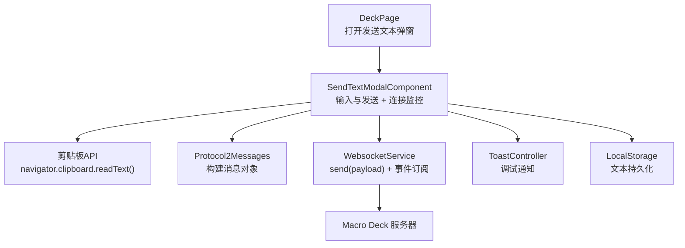
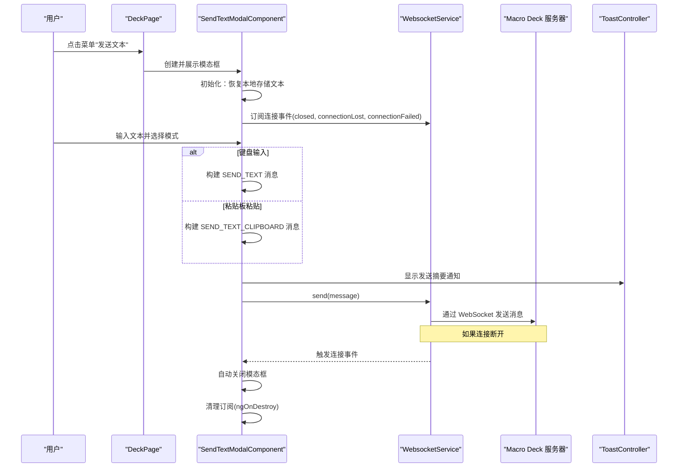
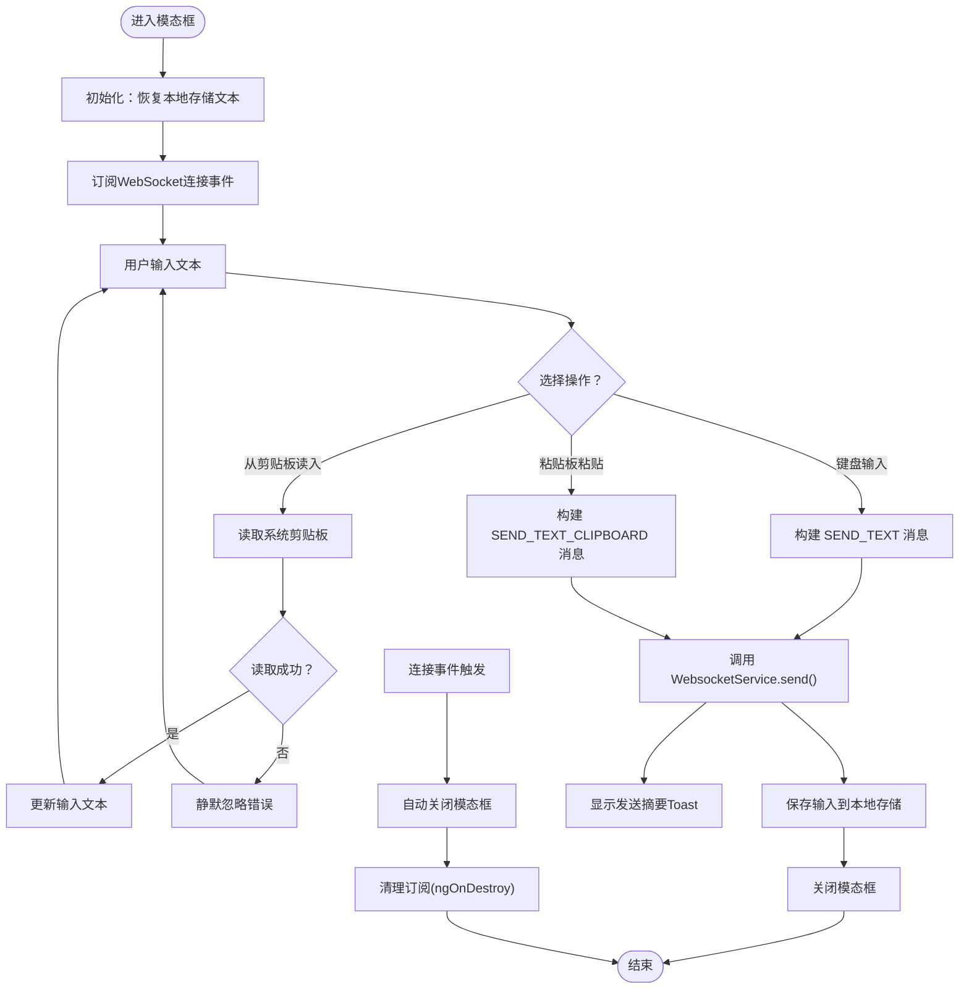
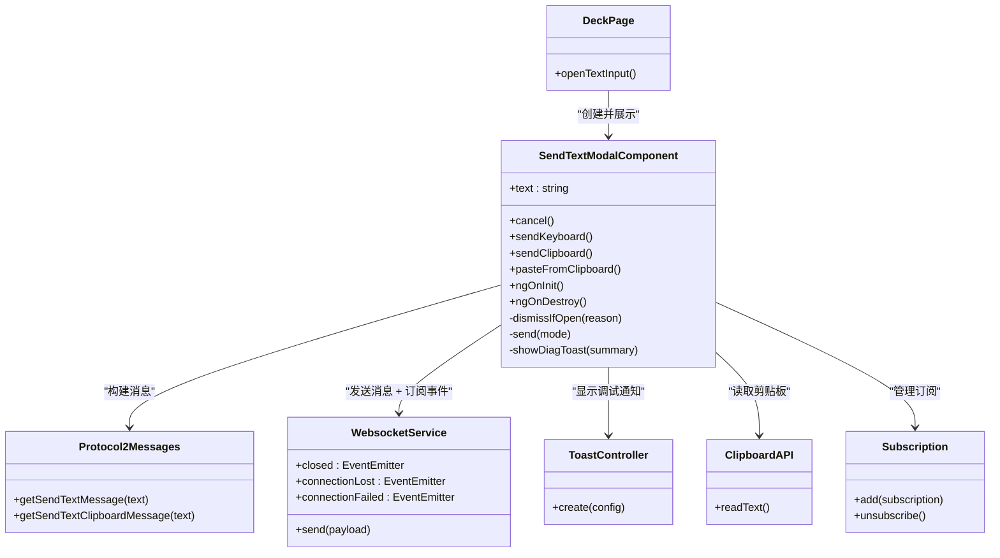

# 文本发送功能

<cite>
**本文引用的文件**   
- [send-text-modal.component.ts](file://src/app/pages/deck/modals/send-text-modal/send-text-modal.component.ts)
- [send-text-modal.component.html](file://src/app/pages/deck/modals/send-text-modal/send-text-modal.component.html)
- [send-text-modal.component.scss](file://src/app/pages/deck/modals/send-text-modal/send-text-modal.component.scss)
- [deck.page.ts](file://src/app/pages/deck/deck.page.ts)
- [websocket.service.ts](file://src/app/services/websocket/websocket.service.ts)
- [protocol2-messages.ts](file://src/app/datatypes/protocol2/protocol2-messages.ts)
- [zh.json](file://src/assets/i18n/zh.json)
- [en.json](file://src/assets/i18n/en.json)
</cite>

## 更新摘要
**所做更改**   
- **WebSocket连接丢失自动关闭**：实现订阅closed、connectionLost、connectionFailed事件并自动关闭模态框
- **内存泄漏防护**：在组件销毁时正确取消订阅所有可观察对象，防止内存泄漏
- **本地存储恢复**：初始化时从本地存储恢复之前输入的文本内容，提升用户体验
- **HTML结构重组**：将发送按钮移至头部工具栏，使用data-layout="header-buttons-v2"布局标识符
- **增强调试功能**：实现Toast通知显示文本发送摘要和改进的日志记录系统
- **重大UI重构**：采用原生HTML textarea替代Ionic组件，优化布局和交互体验

## 目录
1. [简介](#简介)
2. [项目结构](#项目结构)
3. [核心组件](#核心组件)
4. [架构总览](#架构总览)
5. [详细组件分析](#详细组件分析)
6. [依赖关系分析](#依赖关系分析)
7. [性能与体验考量](#性能与体验考量)
8. [故障排查指南](#故障排查指南)
9. [结论](#结论)

## 简介
本章节聚焦于"文本发送"功能的端到端实现：用户在面板页面打开"发送文本"弹窗，输入文本后选择"键盘输入"或"粘贴板粘贴"，客户端将构建协议消息并通过 WebSocket 发送给 Macro Deck 主机。该功能涉及 UI 交互、本地存储记忆、协议消息构造以及网络传输等关键环节。**最新更新**：实现了WebSocket连接丢失时的自动关闭功能，增强了内存泄漏防护机制，优化了HTML结构和调试功能，大幅提升了系统的稳定性和用户体验。

## 项目结构
文本发送功能位于控制面板页面的模态框中，通过服务层进行消息发送。关键文件组织如下：
- 页面入口：在 deck 页面提供"打开发送文本弹窗"的触发方法
- 模态框组件：负责用户输入、本地缓存、调用发送逻辑，**经过重大重构，新增连接监控和内存管理**
- 协议消息：定义 SEND_TEXT 与 SEND_TEXT_CLIPBOARD 两种消息格式
- WebSocket 服务：封装连接状态与 send 方法，统一向外发送消息

**图表来源**
- [deck.page.ts:62-68](file://src/app/pages/deck/deck.page.ts#L62-L68)
- [send-text-modal.component.ts:28-54](file://src/app/pages/deck/modals/send-text-modal/send-text-modal.component.ts#L28-L54)
- [protocol2-messages.ts:35-47](file://src/app/datatypes/protocol2/protocol2-messages.ts#L35-L47)
- [websocket.service.ts:191-193](file://src/app/services/websocket/websocket.service.ts#L191-L193)

**章节来源**
- [deck.page.ts:62-68](file://src/app/pages/deck/deck.page.ts#L62-L68)
- [send-text-modal.component.ts:1-60](file://src/app/pages/deck/modals/send-text-modal/send-text-modal.component.ts#L1-L60)
- [protocol2-messages.ts:1-49](file://src/app/datatypes/protocol2/protocol2-messages.ts#L1-L49)
- [websocket.service.ts:188-193](file://src/app/services/websocket/websocket.service.ts#L188-L193)

## 核心组件
- **发送文本模态框组件**：管理输入、本地缓存、发送模式（键盘/剪贴板），**新增WebSocket连接监控、内存泄漏防护和调试功能**
- **协议消息类**：提供 SEND_TEXT 与 SEND_TEXT_CLIPBOARD 的消息构造方法
- **WebSocket 服务**：对外暴露 send 方法，内部基于 RxJS WebSocketSubject 发送载荷，**提供连接状态事件流**

**章节来源**
- [send-text-modal.component.ts:15-60](file://src/app/pages/deck/modals/send-text-modal/send-text-modal.component.ts#L15-L60)
- [protocol2-messages.ts:35-47](file://src/app/datatypes/protocol2/protocol2-messages.ts#L35-L47)
- [websocket.service.ts:191-193](file://src/app/services/websocket/websocket.service.ts#L191-L193)

## 架构总览
下图展示了从用户操作到消息到达服务器的完整时序，**包含新增的连接监控和自动关闭流程**。

**图表来源**
- [deck.page.ts:62-68](file://src/app/pages/deck/deck.page.ts#L62-L68)
- [send-text-modal.component.ts:28-54](file://src/app/pages/deck/modals/send-text-modal/send-text-modal.component.ts#L28-L54)
- [send-text-modal.component.ts:95-119](file://src/app/pages/deck/modals/send-text-modal/send-text-modal.component.ts#L95-L119)
- [websocket.service.ts:191-193](file://src/app/services/websocket/websocket.service.ts#L191-L193)

## 详细组件分析

### 发送文本模态框组件
职责与流程
- 初始化时尝试从本地存储恢复上次输入的文本，提升用户体验
- 提供取消、键盘输入、粘贴板粘贴三种操作，支持从剪贴板读入功能
- 发送前校验文本非空；成功后保存输入并关闭模态框
- 根据模式选择不同协议消息构造方法
- **新增WebSocket连接监控**：订阅closed、connectionLost、connectionFailed事件并自动关闭
- **内存泄漏防护**：在组件销毁时正确取消订阅所有可观察对象
- **增强调试功能**：实现Toast通知显示发送摘要和改进的日志记录

**重大更新 - 连接监控与内存管理**
- **连接事件订阅**：在ngOnInit中订阅WebSocket服务的三个连接事件
- **自动关闭机制**：当检测到连接问题时，调用dismissIfOpen方法安全关闭模态框
- **内存泄漏防护**：使用Subscription对象统一管理订阅，在ngOnDestroy中正确清理
- **健壮的错误处理**：dismissIfOpen方法包含try-catch保护，防止关闭失败导致异常

**重大UI重构更新**
- **模板结构简化**：使用原生HTML `<textarea>` 替代复杂的Ionic `ion-textarea` 组件
- **布局优化**：textarea通过绝对定位(`position: absolute`)填充整个`ion-content`区域
- **头部工具栏增强**：在右侧添加了剪贴板粘贴按钮，使用data-layout="header-buttons-v2"标识符
- **底部操作区重组**：发送按钮移至第二个toolbar中，采用水平flex布局，两个按钮等宽分布
- **图标语义化**：键盘输入按钮保持键盘图标，文本发送按钮改用纸飞机图标
- **样式现代化**：完全重写SCSS样式，使用CSS自定义属性支持主题化

数据流与关键点
- 本地存储键名用于持久化最近一次输入
- 发送逻辑分支决定 Method 字段为 SEND_TEXT 或 SEND_TEXT_CLIPBOARD
- 使用 WebSocket 服务的 send 方法完成网络传输
- **新增异步剪贴板读取，支持浏览器和原生环境**
- **增强的换行符处理**：根据不同模式标准化换行符格式

**图表来源**
- [send-text-modal.component.ts:28-54](file://src/app/pages/deck/modals/send-text-modal/send-text-modal.component.ts#L28-L54)
- [send-text-modal.component.ts:56-59](file://src/app/pages/deck/modals/send-text-modal/send-text-modal.component.ts#L56-L59)
- [send-text-modal.component.ts:95-119](file://src/app/pages/deck/modals/send-text-modal/send-text-modal.component.ts#L95-L119)
- [protocol2-messages.ts:35-47](file://src/app/datatypes/protocol2/protocol2-messages.ts#L35-L47)
- [websocket.service.ts:191-193](file://src/app/services/websocket/websocket.service.ts#L191-L193)

**章节来源**
- [send-text-modal.component.ts:15-60](file://src/app/pages/deck/modals/send-text-modal/send-text-modal.component.ts#L15-L60)
- [send-text-modal.component.html:1-34](file://src/app/pages/deck/modals/send-text-modal/send-text-modal.component.html#L1-L34)
- [send-text-modal.component.scss:1-38](file://src/app/pages/deck/modals/send-text-modal/send-text-modal.component.scss#L1-L38)

### 协议消息构造
- 键盘输入：Method 为 SEND_TEXT，携带 Message 字段
- 粘贴板粘贴：Method 为 SEND_TEXT_CLIPBOARD，携带 Message 字段
- **增强的换行符处理**：根据模式标准化换行符格式，确保跨平台兼容性

**章节来源**
- [protocol2-messages.ts:35-47](file://src/app/datatypes/protocol2/protocol2-messages.ts#L35-L47)

### WebSocket 发送
- 对外暴露 send(payload) 方法，内部通过 WebSocketSubject.next 发送
- 连接建立后会注入协议处理器，但文本发送直接走 send 路径
- **提供连接状态事件流**：closed、connectionLost、connectionFailed事件供组件订阅

**章节来源**
- [websocket.service.ts:191-193](file://src/app/services/websocket/websocket.service.ts#L191-L193)

### 页面入口与国际化
- 面板页提供 openTextInput 方法，用于创建并展示发送文本模态框
- 国际化文案包含标题、占位符、按钮文本等，支持中英文切换，**新增剪贴板相关文案**

**章节来源**
- [deck.page.ts:62-68](file://src/app/pages/deck/deck.page.ts#L62-L68)
- [zh.json:54-59](file://src/assets/i18n/zh.json#L54-L59)
- [en.json:54-59](file://src/assets/i18n/en.json#L54-L59)

## 依赖关系分析
- 组件依赖
  - 模态框组件依赖 WebSocket 服务与协议消息类，**新增对浏览器剪贴板 API 的依赖**
  - 模态框组件依赖 ToastController 用于调试通知
  - 面板页依赖模态框组件以触发弹窗
- 服务依赖
  - WebSocket 服务作为统一的网络出口，被多处复用
  - **WebSocket 服务提供连接状态事件流供组件订阅**
- 外部资源
  - 国际化资源文件提供多语言文案，**新增剪贴板功能相关文案**
  - LocalStorage 用于文本内容的持久化存储

**图表来源**
- [deck.page.ts:62-68](file://src/app/pages/deck/deck.page.ts#L62-L68)
- [send-text-modal.component.ts:15-60](file://src/app/pages/deck/modals/send-text-modal/send-text-modal.component.ts#L15-L60)
- [send-text-modal.component.ts:95-119](file://src/app/pages/deck/modals/send-text-modal/send-text-modal.component.ts#L95-L119)
- [protocol2-messages.ts:35-47](file://src/app/datatypes/protocol2/protocol2-messages.ts#L35-L47)
- [websocket.service.ts:191-193](file://src/app/services/websocket/websocket.service.ts#L191-L193)

**章节来源**
- [deck.page.ts:62-68](file://src/app/pages/deck/deck.page.ts#L62-L68)
- [send-text-modal.component.ts:15-60](file://src/app/pages/deck/modals/send-text-modal/send-text-modal.component.ts#L15-L60)
- [protocol2-messages.ts:35-47](file://src/app/datatypes/protocol2/protocol2-messages.ts#L35-L47)
- [websocket.service.ts:191-193](file://src/app/services/websocket/websocket.service.ts#L191-L193)

## 性能与体验考量
- 本地缓存：保存最近一次输入，减少重复输入成本
- 即时反馈：发送后立即关闭模态框，避免阻塞用户操作
- 轻量消息：仅传递必要字段（Method、Message），降低网络开销
- 可访问性：自动聚焦输入框，提升移动端输入效率
- 剪贴板读取：支持一键从系统剪贴板获取文本，大幅提升操作效率
- 错误处理优化：剪贴板读取失败时静默处理，不影响用户体验
- **连接监控**：实时监听WebSocket连接状态，自动关闭失效的模态框
- **内存管理**：使用Subscription对象统一管理订阅，防止内存泄漏
- **调试增强**：Toast通知显示发送摘要，改进的日志记录系统
- **UI性能提升**：使用原生HTML textarea替代Ionic组件，减少了框架开销和渲染复杂度
- **布局优化**：绝对定位的textarea消除了复杂的高度计算逻辑，提升了滚动性能
- **响应式设计**：CSS自定义属性支持更好的主题化和跨平台兼容性

## 故障排查指南
常见问题与定位思路
- 未显示输入内容
  - 检查本地存储是否可用，确认初始化读取逻辑是否执行
  - 参考：[send-text-modal.component.ts:28-30](file://src/app/pages/deck/modals/send-text-modal/send-text-modal.component.ts#L28-L30)
- 点击发送无响应
  - 确认文本是否为空（发送前校验）
  - 检查 WebSocket 是否已连接且 send 方法是否被调用
  - 参考：[send-text-modal.component.ts:95-119](file://src/app/pages/deck/modals/send-text-modal/send-text-modal.component.ts#L95-L119)、[websocket.service.ts:191-193](file://src/app/services/websocket/websocket.service.ts#L191-L193)
- 消息类型不正确
  - 核对所选模式对应的 Method 字段是否正确
  - 参考：[protocol2-messages.ts:35-47](file://src/app/datatypes/protocol2/protocol2-messages.ts#L35-L47)
- 界面文案异常
  - 检查国际化 key 是否存在且加载正常
  - 参考：[zh.json:54-59](file://src/assets/i18n/zh.json#L54-L59)、[en.json:54-59](file://src/assets/i18n/en.json#L54-L59)
- 从剪贴板读入失败
  - 检查浏览器是否支持剪贴板 API
  - 确认页面是否在安全上下文（HTTPS）中运行
  - 查看控制台是否有权限相关错误
  - 参考：[send-text-modal.component.ts:86-93](file://src/app/pages/deck/modals/send-text-modal/send-text-modal.component.ts#L86-L93)
- UI布局问题
  - 检查CSS样式是否正确应用，特别是绝对定位和flex布局
  - 确认主题变量是否正确设置
  - 参考：[send-text-modal.component.scss:1-38](file://src/app/pages/deck/modals/send-text-modal/send-text-modal.component.scss#L1-L38)
- **新增：连接丢失时模态框未自动关闭**
  - 检查WebSocket连接事件是否正常触发
  - 确认组件是否正确订阅了连接事件
  - 查看控制台日志中的连接事件信息
  - 参考：[send-text-modal.component.ts:36-53](file://src/app/pages/deck/modals/send-text-modal/send-text-modal.component.ts#L36-L53)
- **新增：内存泄漏警告**
  - 检查组件销毁时是否正确清理订阅
  - 确认Subscription对象是否正确管理
  - 参考：[send-text-modal.component.ts:56-59](file://src/app/pages/deck/modals/send-text-modal/send-text-modal.component.ts#L56-L59)
- **新增：调试通知不显示**
  - 检查ToastController是否正确注入
  - 确认showDiagToast方法是否被调用
  - 参考：[send-text-modal.component.ts:121-129](file://src/app/pages/deck/modals/send-text-modal/send-text-modal.component.ts#L121-L129)

**章节来源**
- [send-text-modal.component.ts:28-129](file://src/app/pages/deck/modals/send-text-modal/send-text-modal.component.ts#L28-L129)
- [websocket.service.ts:191-193](file://src/app/services/websocket/websocket.service.ts#L191-L193)
- [protocol2-messages.ts:35-47](file://src/app/datatypes/protocol2/protocol2-messages.ts#L35-L47)
- [zh.json:54-59](file://src/assets/i18n/zh.json#L54-L59)
- [en.json:54-59](file://src/assets/i18n/en.json#L54-L59)
- [send-text-modal.component.scss:1-38](file://src/app/pages/deck/modals/send-text-modal/send-text-modal.component.scss#L1-L38)

## 结论
文本发送功能以清晰的组件分层与协议抽象实现了从用户输入到远程执行的闭环。通过本地缓存、简洁的消息结构与统一的网络发送接口，既保证了易用性也具备良好的扩展性。**最新重大更新**：实现了全面的系统增强，包括WebSocket连接丢失时的自动关闭功能、完善的内存泄漏防护机制、优化的HTML结构和增强的调试功能。这些改进不仅提升了性能和用户体验，还大幅增强了系统的稳定性和可靠性。后续可在输入校验、错误提示与重试机制方面进一步增强健壮性与用户体验。