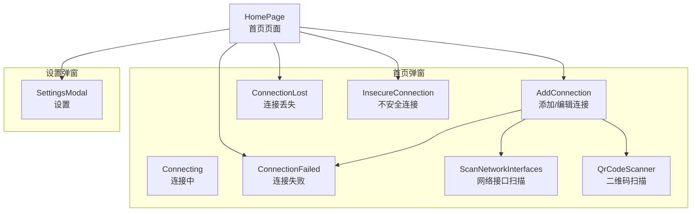
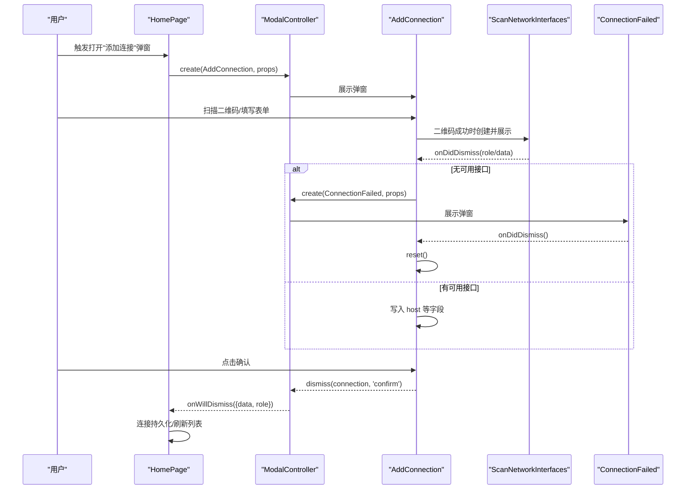
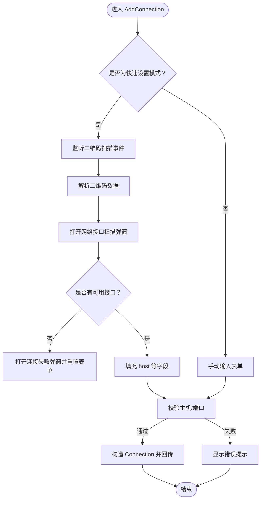
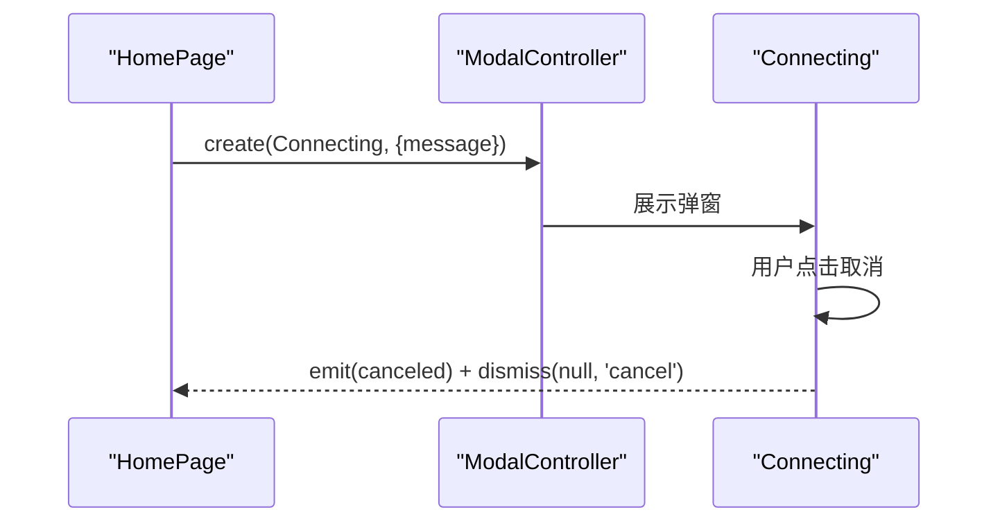
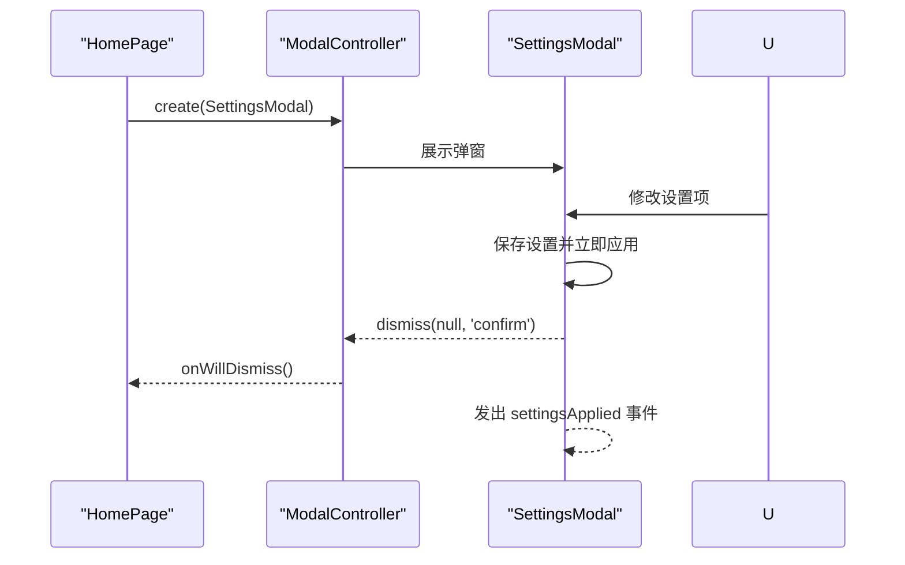
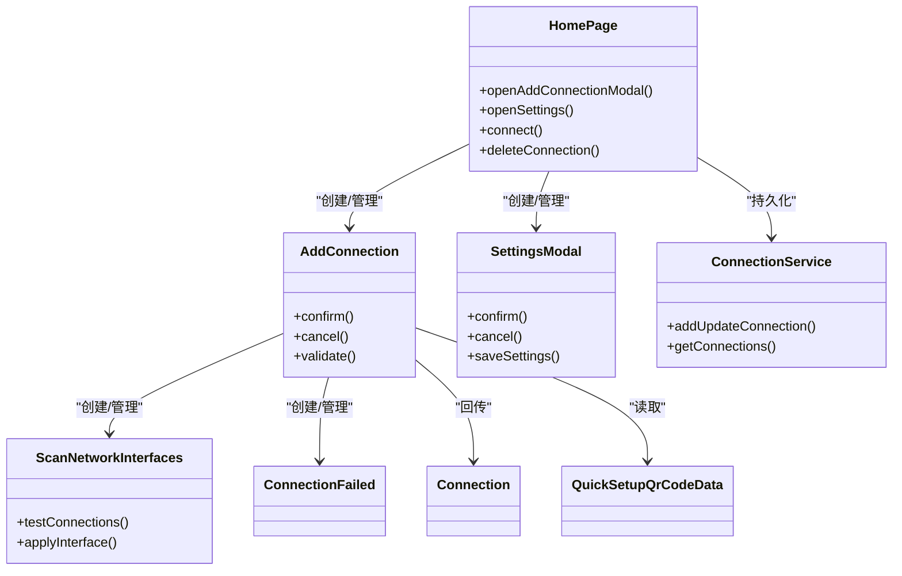

# 弹窗对话框

<cite>
**本文档引用的文件**
- [add-connection.component.ts](file://src/app/pages/home/modals/add-connection/add-connection.component.ts)
- [connecting.component.ts](file://src/app/pages/home/modals/connecting/connecting.component.ts)
- [connection-failed.component.ts](file://src/app/pages/home/modals/connection-failed/connection-failed.component.ts)
- [connection-lost.component.ts](file://src/app/pages/home/modals/connection-lost/connection-lost.component.ts)
- [insecure-connection.component.ts](file://src/app/pages/home/modals/insecure-connection/insecure-connection.component.ts)
- [settings-modal.component.ts](file://src/app/pages/shared/modals/settings-modal/settings-modal.component.ts)
- [scan-network-interfaces.component.ts](file://src/app/pages/home/modals/scan-network-interfaces/scan-network-interfaces.component.ts)
- [qr-code-scanner.component.ts](file://src/app/pages/home/modals/add-connection/qr-code-scanner/qr-code-scanner.component.ts)
- [home.page.ts](file://src/app/pages/home/home.page.ts)
- [connection.service.ts](file://src/app/services/connection/connection.service.ts)
- [connection.ts](file://src/app/datatypes/connection.ts)
- [quick-setup-qr-code-data.ts](file://src/app/datatypes/quick-setup-qr-code-data.ts)
- [add-connection.component.html](file://src/app/pages/home/modals/add-connection/add-connection.component.html)
- [connecting.component.html](file://src/app/pages/home/modals/connecting/connecting.component.html)
- [settings-modal.component.html](file://src/app/pages/shared/modals/settings-modal/settings-modal.component.html)
- [zh.json](file://src/assets/i18n/zh.json)
- [en.json](file://src/assets/i18n/en.json)
</cite>

## 更新摘要
**所做更改**
- 更新了 SettingsModal 组件的国际化支持说明，详细描述了四个 ion-select 组件的本地化按钮文本增强
- 新增了屏幕方向、语言选择、更新源配置、外观主题和按钮边框样式等设置项的统一本地化支持
- 完善了多语言环境下的用户体验描述

## 目录
1. [简介](#简介)
2. [项目结构](#项目结构)
3. [核心组件](#核心组件)
4. [架构总览](#架构总览)
5. [详细组件分析](#详细组件分析)
6. [依赖关系分析](#依赖关系分析)
7. [性能考量](#性能考量)
8. [故障排查指南](#故障排查指南)
9. [结论](#结论)
10. [附录](#附录)

## 简介
本文件系统性梳理 Macro-Deck-Client-App 中的弹窗对话框组件，覆盖以下弹窗的职责、生命周期、模态控制、数据传递与用户交互：
- AddConnection：添加/编辑连接弹窗，支持手动输入与二维码快速设置
- Connecting：连接中弹窗，显示连接进度并支持取消
- ConnectionFailed：连接失败弹窗，展示错误详情
- ConnectionLost：连接丢失弹窗（首页模态）
- InsecureConnection：不安全连接提示弹窗（SSL 证书问题）
- SettingsModal：设置弹窗，集中管理应用配置

同时说明弹窗与主页面的通信模式、事件流、数据回传与回调处理，以及在不同场景下的正确使用方法。

## 项目结构
弹窗组件主要位于以下路径：
- 首页弹窗：src/app/pages/home/modals/*
- 设置弹窗：src/app/pages/shared/modals/settings-modal/*

图表来源
- [home.page.ts:154-192](file://src/app/pages/home/home.page.ts#L154-L192)
- [add-connection.component.ts:82-134](file://src/app/pages/home/modals/add-connection/add-connection.component.ts#L82-L134)
- [scan-network-interfaces.component.ts:55-103](file://src/app/pages/home/modals/scan-network-interfaces/scan-network-interfaces.component.ts#L55-L103)
- [qr-code-scanner.component.ts:56-75](file://src/app/pages/home/modals/add-connection/qr-code-scanner/qr-code-scanner.component.ts#L56-L75)
- [connection-failed.component.ts:22-25](file://src/app/pages/home/modals/connection-failed/connection-failed.component.ts#L22-L25)
- [settings-modal.component.ts:68-78](file://src/app/pages/shared/modals/settings-modal/settings-modal.component.ts#L68-L78)

章节来源
- [home.page.ts:154-192](file://src/app/pages/home/home.page.ts#L154-L192)
- [add-connection.component.ts:82-134](file://src/app/pages/home/modals/add-connection/add-connection.component.ts#L82-L134)
- [settings-modal.component.ts:68-78](file://src/app/pages/shared/modals/settings-modal/settings-modal.component.ts#L68-L78)

## 核心组件
- AddConnection：负责连接的新增/编辑，支持二维码快速设置与网络接口扫描；校验表单并回传连接对象
- Connecting：显示连接过程中的消息与取消按钮；通过事件发射器通知上层取消
- ConnectionFailed：展示连接失败详情，供用户查看错误信息
- ConnectionLost：提示连接丢失，便于用户重新建立连接
- InsecureConnection：提示 SSL 证书验证失败，引导用户处理不安全连接
- SettingsModal：集中管理应用设置，保存后立即应用部分配置并发出全局事件

章节来源
- [add-connection.component.ts:25-211](file://src/app/pages/home/modals/add-connection/add-connection.component.ts#L25-L211)
- [connecting.component.ts:15-31](file://src/app/pages/home/modals/connecting/connecting.component.ts#L15-L31)
- [connection-failed.component.ts:13-25](file://src/app/pages/home/modals/connection-failed/connection-failed.component.ts#L13-L25)
- [connection-lost.component.ts:13-21](file://src/app/pages/home/modals/connection-lost/connection-lost.component.ts#L13-L21)
- [insecure-connection.component.ts:13-21](file://src/app/pages/home/modals/insecure-connection/insecure-connection.component.ts#L13-L21)
- [settings-modal.component.ts:23-117](file://src/app/pages/shared/modals/settings-modal/settings-modal.component.ts#L23-L117)

## 架构总览
弹窗与主页面通过 Ionic ModalController 进行模态展示与数据回传；部分弹窗之间存在嵌套调用关系，形成"弹窗链"。整体交互遵循"打开弹窗 -> 用户操作 -> onWillDismiss 回调 -> 数据持久化/状态更新"的流程。

图表来源
- [home.page.ts:154-192](file://src/app/pages/home/home.page.ts#L154-L192)
- [add-connection.component.ts:82-134](file://src/app/pages/home/modals/add-connection/add-connection.component.ts#L82-L134)
- [scan-network-interfaces.component.ts:96-103](file://src/app/pages/home/modals/scan-network-interfaces/scan-network-interfaces.component.ts#L96-L103)
- [connection-failed.component.ts:22-25](file://src/app/pages/home/modals/connection-failed/connection-failed.component.ts#L22-L25)

## 详细组件分析

### AddConnection（添加/编辑连接弹窗）
- 功能要点
  - 支持"快速设置"和"手动设置"两种入口
  - 原生平台下自动监听二维码扫描事件，解析二维码数据并触发网络接口扫描
  - 表单校验：主机/端口必填；确认后构造 Connection 对象并回传
  - 编辑模式：接收已有连接属性，允许修改并回传更新后的连接
- 生命周期与数据流
  - 初始化：订阅二维码扫描事件；若为原生平台且非编辑模式，自动尝试处理二维码
  - 快速设置流程：解析二维码 -> 打开网络接口扫描弹窗 -> 根据结果决定是否展示连接失败弹窗 -> 重置表单
  - 手动设置流程：直接填写表单 -> 校验 -> 构造 Connection -> 回传
- 与主页面通信
  - 主页面通过 ModalController.create 打开弹窗，传入 props（编辑模式或二维码数据）
  - onWillDismiss 监听确认事件，调用连接服务持久化数据

**更新** 端口输入字段的标签定位已从 floating 改为 fixed，提供更一致的标签定位体验

图表来源
- [add-connection.component.ts:64-134](file://src/app/pages/home/modals/add-connection/add-connection.component.ts#L64-L134)
- [scan-network-interfaces.component.ts:55-103](file://src/app/pages/home/modals/scan-network-interfaces/scan-network-interfaces.component.ts#L55-L103)
- [home.page.ts:154-192](file://src/app/pages/home/home.page.ts#L154-L192)

章节来源
- [add-connection.component.ts:25-211](file://src/app/pages/home/modals/add-connection/add-connection.component.ts#L25-L211)
- [add-connection.component.html:19-89](file://src/app/pages/home/modals/add-connection/add-connection.component.html#L19-L89)
- [home.page.ts:154-192](file://src/app/pages/home/home.page.ts#L154-L192)

### Connecting（连接中弹窗）
- 功能要点
  - 显示连接提示消息，提供取消按钮
  - 通过 canceled 事件发射器通知上层取消意图
  - 非 Web 版本显示取消按钮
- 使用场景
  - 在发起连接前展示进度与取消能力
  - 与 WebSocket 连接流程配合，支持中途取消

图表来源
- [connecting.component.ts:24-28](file://src/app/pages/home/modals/connecting/connecting.component.ts#L24-L28)
- [connecting.component.html:1-13](file://src/app/pages/home/modals/connecting/connecting.component.html#L1-L13)

章节来源
- [connecting.component.ts:15-31](file://src/app/pages/home/modals/connecting/connecting.component.ts#L15-L31)
- [connecting.component.html:1-13](file://src/app/pages/home/modals/connecting/connecting.component.html#L1-L13)

### ConnectionFailed（连接失败弹窗）
- 功能要点
  - 展示连接失败详情（名称与错误信息）
  - 提供关闭能力，无额外副作用
- 使用场景
  - 网络接口扫描无可用接口时的兜底提示
  - WebSocket 连接失败时由主页面触发展示

章节来源
- [connection-failed.component.ts:13-25](file://src/app/pages/home/modals/connection-failed/connection-failed.component.ts#L13-25)
- [home.page.ts:292-301](file://src/app/pages/home/home.page.ts#L292-L301)

### ConnectionLost（连接丢失弹窗）
- 功能要点
  - 首页模态版本的连接丢失提示
  - 提供关闭能力，便于用户重新连接
- 使用场景
  - 连接断开后引导用户检查网络或重新连接

章节来源
- [connection-lost.component.ts:13-21](file://src/app/pages/home/modals/connection-lost/connection-lost.component.ts#L13-L21)

### InsecureConnection（不安全连接弹窗）
- 功能要点
  - SSL 证书验证失败时的提示弹窗
  - 提供关闭能力，引导用户处理证书问题
- 使用场景
  - 证书校验异常或跳过验证时的警示

章节来源
- [insecure-connection.component.ts:13-21](file://src/app/pages/home/modals/insecure-connection/insecure-connection.component.ts#L13-L21)

### SettingsModal（设置弹窗）
- 功能要点
  - 集中管理应用设置项：屏幕常亮、菜单按钮、SSL 跳过、按钮长按延迟、外观主题、屏幕方向、USB 设置等
  - 保存时立即应用部分设置（如唤醒锁、屏幕方向、主题），并通过静态事件通知外部监听者
  - 提供开关变更的辅助提示（如屏幕常亮风险提示、菜单按钮隐藏提示）
  - **国际化增强**：四个 ion-select 组件（屏幕方向、语言选择、更新源配置、外观主题、按钮边框样式）均添加了统一的本地化按钮文本支持，包括 okText 和 cancelText 属性的国际化绑定
- 生命周期与数据流
  - 初始化：加载当前设置到界面
  - 保存：写入持久化存储并立即应用部分设置
  - 关闭：dismiss 并触发全局事件

**更新** SettingsModal 组件的四个 ion-select 组件增强了国际化支持，为屏幕方向、语言选择、更新源配置、外观主题和按钮边框样式等设置项添加了统一的本地化按钮文本支持，提升了多语言环境下的用户体验

图表来源
- [settings-modal.component.ts:68-78](file://src/app/pages/shared/modals/settings-modal/settings-modal.component.ts#L68-L78)
- [settings-modal.component.ts:219-223](file://src/app/pages/shared/modals/settings-modal/settings-modal.component.ts#L219-L223)
- [settings-modal.component.html:13-122](file://src/app/pages/shared/modals/settings-modal/settings-modal.component.html#L13-L122)

章节来源
- [settings-modal.component.ts:23-117](file://src/app/pages/shared/modals/settings-modal/settings-modal.component.ts#L23-L117)
- [settings-modal.component.html:13-122](file://src/app/pages/shared/modals/settings-modal/settings-modal.component.html#L13-L122)

### ScanNetworkInterfaces（网络接口扫描）
- 功能要点
  - 并行对二维码提供的多个网络接口进行可达性检测
  - 自动分类可用/不可用接口；无可用接口时返回特定角色；单可用时自动选择
- 与 AddConnection 的协作
  - AddConnection 在二维码成功后创建并展示该弹窗，依据返回结果决定后续流程

章节来源
- [scan-network-interfaces.component.ts:18-112](file://src/app/pages/home/modals/scan-network-interfaces/scan-network-interfaces.component.ts#L18-L112)

### QrCodeScanner（二维码扫描）
- 功能要点
  - 请求摄像头权限，准备并启动二维码扫描
  - 仅接受 Macro Deck 快速设置链接，触发静态事件传递扫描结果
  - 提供返回按钮事件监听，以便在 AddConnection 中停止扫描
- 与 AddConnection 的协作
  - AddConnection 在原生平台下订阅其静态事件，自动处理二维码数据

章节来源
- [qr-code-scanner.component.ts:16-97](file://src/app/pages/home/modals/add-connection/qr-code-scanner/qr-code-scanner.component.ts#L16-L97)

## 依赖关系分析
- 组件耦合
  - AddConnection 依赖：ModalController、AlertController、诊断服务、网络接口扫描弹窗、连接失败弹窗、二维码扫描组件
  - SettingsModal 依赖：设置服务、唤醒锁服务、屏幕方向服务、主题服务、诊断服务、SSL 处理插件
  - HomePage 作为弹窗的统一入口，协调连接服务与弹窗生命周期
- 数据类型
  - Connection：连接配置的数据模型
  - QuickSetupQrCodeData：二维码携带的连接信息模型

图表来源
- [home.page.ts:154-192](file://src/app/pages/home/home.page.ts#L154-L192)
- [add-connection.component.ts:331-345](file://src/app/pages/home/modals/add-connection/add-connection.component.ts#L331-L345)
- [settings-modal.component.ts:84-103](file://src/app/pages/shared/modals/settings-modal/settings-modal.component.ts#L84-L103)
- [connection.service.ts:65-85](file://src/app/services/connection/connection.service.ts#L65-L85)
- [connection.ts:2-21](file://src/app/datatypes/connection.ts#L2-L21)
- [quick-setup-qr-code-data.ts:2-13](file://src/app/datatypes/quick-setup-qr-code-data.ts#L2-L13)

章节来源
- [home.page.ts:154-192](file://src/app/pages/home/home.page.ts#L154-L192)
- [connection.service.ts:65-85](file://src/app/services/connection/connection.service.ts#L65-L85)
- [connection.ts:2-21](file://src/app/datatypes/connection.ts#L2-L21)
- [quick-setup-qr-code-data.ts:2-13](file://src/app/datatypes/quick-setup-qr-code-data.ts#L2-L13)

## 性能考量
- 并行网络检测：网络接口扫描采用 Promise.all 并行检测，缩短等待时间
- 超时与取消：HTTP 请求设置超时与销毁引用，避免内存泄漏与长时间阻塞
- 模态生命周期：及时取消订阅与停止扫描，防止后台资源占用
- 设置应用即时性：部分设置（唤醒锁、屏幕方向、主题）在保存时立即应用，减少切换成本

## 故障排查指南
- 二维码扫描无响应
  - 检查摄像头权限是否授予
  - 确认扫描链接格式是否为 Macro Deck 快速设置链接
- 无可用网络接口
  - 确认服务器端口与 SSL 配置一致
  - 检查网络连通性与防火墙设置
- 连接失败弹窗频繁出现
  - 查看错误详情，核对主机、端口、SSL 与令牌
  - 尝试更换网络接口或调整服务器配置
- 设置保存后未生效
  - 检查平台差异（如 Android Oreo 对屏幕方向限制）
  - 确认相关服务已正确更新（唤醒锁、屏幕方向、主题）
- 国际化按钮文本显示异常
  - 检查 TranslatePipe 是否正确导入和使用
  - 确认 i18n 文件中是否存在对应的翻译键值
  - 验证 okText 和 cancelText 属性的绑定语法

章节来源
- [qr-code-scanner.component.ts:81-97](file://src/app/pages/home/modals/add-connection/qr-code-scanner/qr-code-scanner.component.ts#L81-L97)
- [scan-network-interfaces.component.ts:64-103](file://src/app/pages/home/modals/scan-network-interfaces/scan-network-interfaces.component.ts#L64-L103)
- [home.page.ts:292-301](file://src/app/pages/home/home.page.ts#L292-L301)
- [settings-modal.component.ts:124-136](file://src/app/pages/shared/modals/settings-modal/settings-modal.component.ts#L124-L136)

## 结论
弹窗体系围绕"模态展示 + 数据回传 + 事件联动"的设计展开，既保证了用户体验的一致性，又通过清晰的生命周期与数据流实现了高内聚低耦合。AddConnection 与 SettingsModal 分别承担"连接配置"和"应用配置"的核心职责，其余弹窗作为支撑组件完善了错误提示与流程引导。SettingsModal 组件的国际化增强进一步提升了多语言环境下的用户体验，确保所有用户界面元素都能正确显示本地化文本。建议在扩展新弹窗时复用现有模式：明确 props 与回传数据、规范 onWillDismiss 处理、及时清理订阅与资源。

## 附录
- 使用示例（步骤说明）
  - 打开添加连接弹窗（新增/编辑/快速设置）
    - 新增：HomePage 调用创建方法，传入空 props，展示 AddConnection
    - 编辑：传入已有连接属性，进入编辑模式
    - 快速设置：传入二维码数据，自动解析并扫描网络接口
  - 参数传递与结果回调
    - props：根据场景传入 id/name/host/port/useSsl/autoConnect/index/editConnection 或 quickSetupQrCodeData
    - 回调：onWillDismiss 监听 role 与 data，确认时调用连接服务持久化
  - 与主页面通信
    - 通过 ModalController.create/ present/onWillDismiss 协作
    - SettingsModal 保存后发出全局事件，主页面监听并重启相关服务

章节来源
- [home.page.ts:154-192](file://src/app/pages/home/home.page.ts#L154-L192)
- [settings-modal.component.ts:68-78](file://src/app/pages/shared/modals/settings-modal/settings-modal.component.ts#L68-L78)
- [connection.service.ts:65-85](file://src/app/services/connection/connection.service.ts#L65-L85)