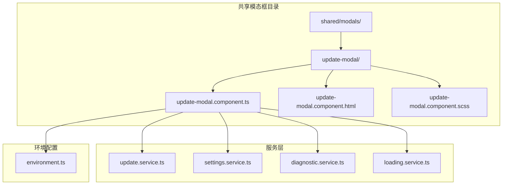
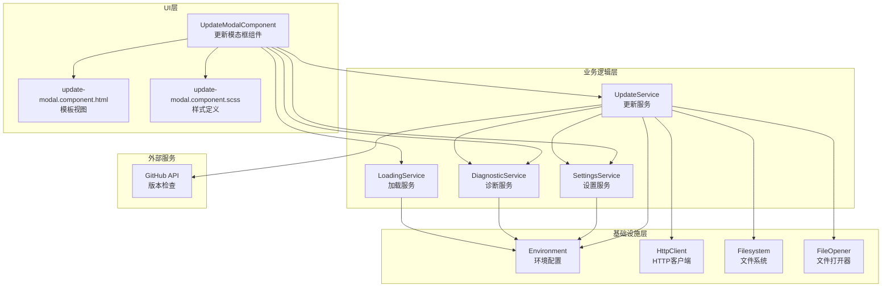
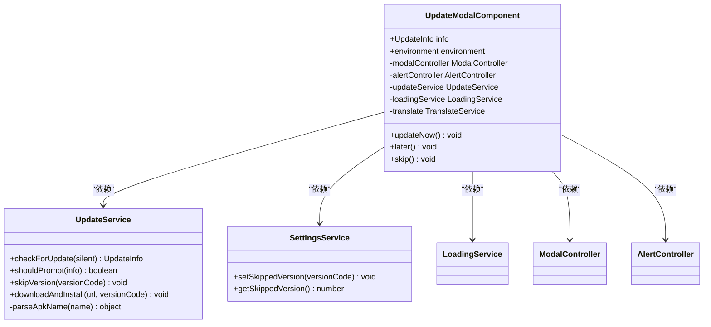
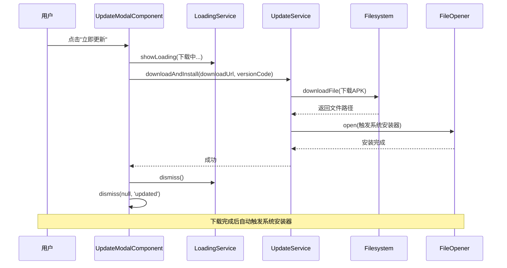
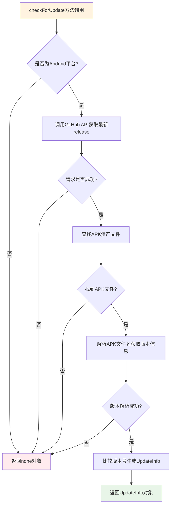
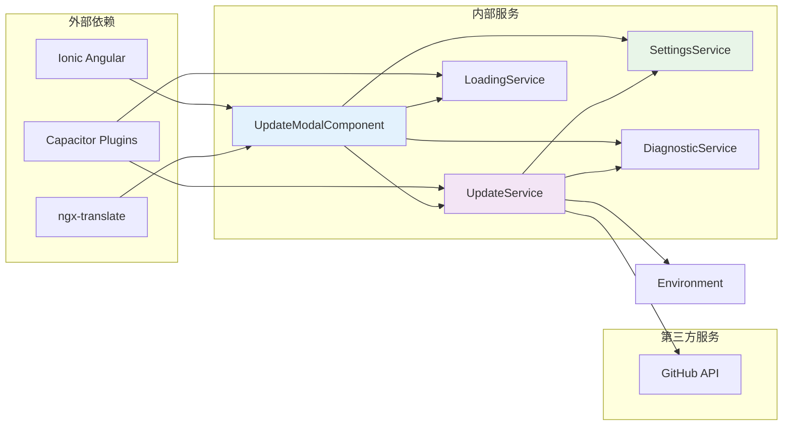

# 更新模态框组件

<cite>
**本文档引用的文件**
- [update-modal.component.ts](file://src/app/pages/shared/modals/update-modal/update-modal.component.ts)
- [update-modal.component.html](file://src/app/pages/shared/modals/update-modal/update-modal.component.html)
- [update-modal.component.scss](file://src/app/pages/shared/modals/update-modal/update-modal.component.scss)
- [update.service.ts](file://src/app/services/update/update.service.ts)
- [settings.service.ts](file://src/app/services/settings/settings.service.ts)
- [diagnostic.service.ts](file://src/app/services/diagnostic/diagnostic.service.ts)
- [loading.service.ts](file://src/app/services/loading/loading.service.ts)
- [environment.ts](file://src/environments/environment.ts)
- [app.component.ts](file://src/app/app.component.ts)
- [settings-modal.component.ts](file://src/app/pages/shared/modals/settings-modal/settings-modal.component.ts)
</cite>

## 目录
1. [简介](#简介)
2. [项目结构](#项目结构)
3. [核心组件](#核心组件)
4. [架构概览](#架构概览)
5. [详细组件分析](#详细组件分析)
6. [依赖关系分析](#依赖关系分析)
7. [性能考虑](#性能考虑)
8. [故障排除指南](#故障排除指南)
9. [结论](#结论)

## 简介

更新模态框组件是Macro Deck客户端应用中的一个重要功能模块，负责在发现新版本时向用户展示更新信息并提供相应的操作选项。该组件实现了完整的应用内更新流程，包括版本检查、用户交互、APK下载和安装等功能。

该组件主要面向Android平台，通过GitHub API检查最新的发布版本，并提供三种用户选择：立即更新、稍后提醒和跳过此版本。组件设计遵循了现代移动端应用的最佳实践，提供了良好的用户体验和错误处理机制。

## 项目结构

更新模态框组件位于应用的共享模态框目录结构中，采用标准的Angular组件组织方式：



**图表来源**
- [update-modal.component.ts:1-62](file://src/app/pages/shared/modals/update-modal/update-modal.component.ts#L1-L62)
- [update.service.ts:1-149](file://src/app/services/update/update.service.ts#L1-L149)

**章节来源**
- [update-modal.component.ts:1-62](file://src/app/pages/shared/modals/update-modal/update-modal.component.ts#L1-L62)
- [update-modal.component.html:1-34](file://src/app/pages/shared/modals/update-modal/update-modal.component.html#L1-L34)
- [update-modal.component.scss:1-11](file://src/app/pages/shared/modals/update-modal/update-modal.component.scss#L1-L11)

## 核心组件

更新模态框组件是一个独立的Angular组件，具有以下核心特性：

### 组件架构
- **组件类型**: 共享模态框组件
- **目标平台**: Android原生应用
- **功能范围**: 应用内版本更新提示和处理
- **用户交互**: 提供三个操作选项

### 主要功能
1. **版本信息展示**: 显示当前版本和新版本的详细信息
2. **更新说明显示**: 展示GitHub release notes
3. **用户操作处理**: 支持立即更新、稍后提醒、跳过版本
4. **错误处理**: 完善的异常处理和用户反馈机制

**章节来源**
- [update-modal.component.ts:8-30](file://src/app/pages/shared/modals/update-modal/update-modal.component.ts#L8-L30)
- [update-modal.component.html:7-21](file://src/app/pages/shared/modals/update-modal/update-modal.component.html#L7-L21)

## 架构概览

更新模态框组件采用分层架构设计，各组件职责明确，耦合度低：



**图表来源**
- [update-modal.component.ts:26-30](file://src/app/pages/shared/modals/update-modal/update-modal.component.ts#L26-L30)
- [update.service.ts:39-41](file://src/app/services/update/update.service.ts#L39-L41)
- [settings.service.ts:32-33](file://src/app/services/settings/settings.service.ts#L32-L33)
- [diagnostic.service.ts:13](file://src/app/services/diagnostic/diagnostic.service.ts#L13)

## 详细组件分析

### UpdateModalComponent 分析

UpdateModalComponent是更新模态框的核心组件，实现了完整的更新流程控制：

#### 类结构设计


**图表来源**
- [update-modal.component.ts:18-30](file://src/app/pages/shared/modals/update-modal/update-modal.component.ts#L18-L30)
- [update.service.ts:37-41](file://src/app/services/update/update.service.ts#L37-L41)
- [settings.service.ts:29-33](file://src/app/services/settings/settings.service.ts#L29-L33)

#### 核心方法实现

##### 立即更新功能


**图表来源**
- [update-modal.component.ts:33-49](file://src/app/pages/shared/modals/update-modal/update-modal.component.ts#L33-L49)
- [update.service.ts:115-134](file://src/app/services/update/update.service.ts#L115-L134)

##### 跳过版本功能
```mermaid
flowchart TD
A[用户点击"跳过此版本"] --> B[调用skipVersion方法]
B --> C[获取当前版本号]
C --> D[调用SettingsService.setSkippedVersion]
D --> E[存储到本地存储]
E --> F[关闭模态框]
F --> G[返回'skipped'结果]
style A fill:#e1f5fe
style G fill:#c8e6c9
```

**图表来源**
- [update-modal.component.ts:56-60](file://src/app/pages/shared/modals/update-modal/update-modal.component.ts#L56-L60)
- [settings.service.ts:39-41](file://src/app/services/settings/settings.service.ts#L39-L41)

**章节来源**
- [update-modal.component.ts:32-60](file://src/app/pages/shared/modals/update-modal/update-modal.component.ts#L32-L60)

### UpdateService 详细分析

UpdateService是更新功能的核心服务，负责与GitHub API交互和本地文件管理：

#### 版本检查流程


**图表来源**
- [update.service.ts:48-87](file://src/app/services/update/update.service.ts#L48-L87)

#### 文件下载和安装机制
UpdateService使用Capacitor的Filesystem和FileOpener插件实现APK文件的下载和安装：

**章节来源**
- [update.service.ts:48-147](file://src/app/services/update/update.service.ts#L48-L147)

### SettingsService 集成

SettingsService负责管理用户的更新偏好设置，特别是"跳过版本"功能：

#### 存储机制
- **存储键名**: `skipped_update_version`
- **数据类型**: `number` (versionCode)
- **默认值**: `0` (表示未跳过任何版本)

**章节来源**
- [settings.service.ts:23](file://src/app/services/settings/settings.service.ts#L23)
- [settings.service.ts:39-49](file://src/app/services/settings/settings.service.ts#L39-L49)

## 依赖关系分析

更新模态框组件的依赖关系清晰明确，遵循了依赖注入的设计原则：



**图表来源**
- [update-modal.component.ts:1-6](file://src/app/pages/shared/modals/update-modal/update-modal.component.ts#L1-L6)
- [update.service.ts:1-8](file://src/app/services/update/update.service.ts#L1-L8)

### 组件间交互

更新模态框组件与其他组件的交互主要发生在应用启动和手动检查更新的场景：

**章节来源**
- [app.component.ts:83-96](file://src/app/app.component.ts#L83-L96)
- [settings-modal.component.ts:74-90](file://src/app/pages/shared/modals/settings-modal/settings-modal.component.ts#L74-L90)

## 性能考虑

更新模态框组件在设计时充分考虑了性能优化：

### 网络请求优化
- **超时控制**: GitHub API请求设置10秒超时
- **错误处理**: 请求失败时静默处理，不影响用户体验
- **缓存策略**: 使用HTTP缓存机制减少重复请求

### 内存管理
- **异步处理**: 所有耗时操作都使用async/await模式
- **资源清理**: 正确处理模态框的生命周期
- **文件管理**: 使用临时文件夹存储下载的APK文件

### 用户体验优化
- **加载指示**: 下载过程中显示进度指示器
- **错误恢复**: 下载失败时保持模态框开放，允许用户重试
- **权限提示**: 清晰的权限需求说明

## 故障排除指南

### 常见问题及解决方案

#### 1. 更新检查失败
**症状**: 应用启动时无更新提示，但实际有新版本
**原因**: GitHub API请求超时或网络连接问题
**解决方案**: 
- 检查网络连接状态
- 稍后重试手动检查更新
- 确认GitHub API可达性

#### 2. APK下载失败
**症状**: 点击"立即更新"后出现下载错误
**原因**: 网络中断、存储空间不足、文件损坏
**解决方案**:
- 检查设备存储空间
- 确认网络连接稳定
- 重新尝试下载

#### 3. 安装器无法启动
**症状**: 下载完成后无法自动打开安装器
**原因**: 设备需要"允许未知来源"权限
**解决方案**:
- 在设备设置中启用"允许来自此来源的应用"
- 检查应用权限设置
- 手动打开下载的APK文件

#### 4. 跳过版本无效
**症状**: 选择"跳过此版本"后仍继续提示
**原因**: 本地存储数据异常
**解决方案**:
- 清除应用缓存
- 重新安装应用
- 检查本地存储权限

**章节来源**
- [update-modal.component.ts:39-48](file://src/app/pages/shared/modals/update-modal/update-modal.component.ts#L39-L48)
- [update.service.ts:57-62](file://src/app/services/update/update.service.ts#L57-L62)

## 结论

更新模态框组件是Macro Deck客户端应用中一个设计精良的功能模块，具有以下特点：

### 技术优势
- **模块化设计**: 组件职责单一，易于维护和测试
- **平台适配**: 专门针对Android平台优化
- **错误处理**: 完善的异常处理和用户反馈机制
- **性能优化**: 合理的网络请求和内存管理策略

### 用户体验
- **直观界面**: 清晰的版本信息展示
- **灵活操作**: 三种更新选项满足不同用户需求
- **及时反馈**: 下载过程中的实时状态更新
- **容错设计**: 失败时的优雅降级处理

### 扩展性
- **接口设计**: 清晰的服务接口便于扩展
- **配置灵活**: 支持通过环境变量进行配置
- **国际化**: 内置多语言支持框架
- **平台兼容**: 为未来iOS平台扩展预留空间

该组件为用户提供了便捷的应用内更新体验，同时保证了系统的稳定性和可靠性。通过合理的架构设计和完善的错误处理机制，确保了在各种使用场景下的良好表现。