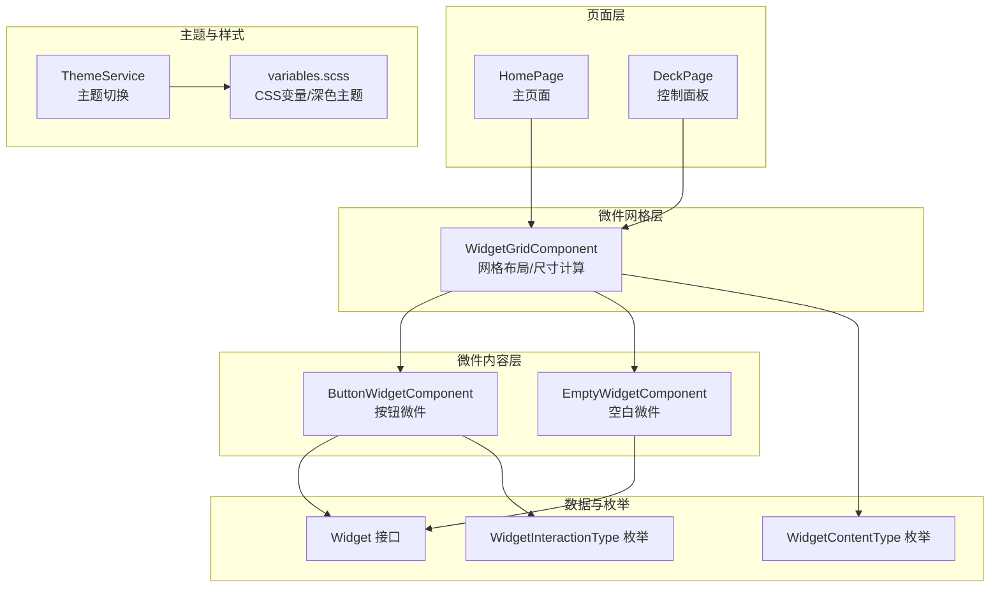
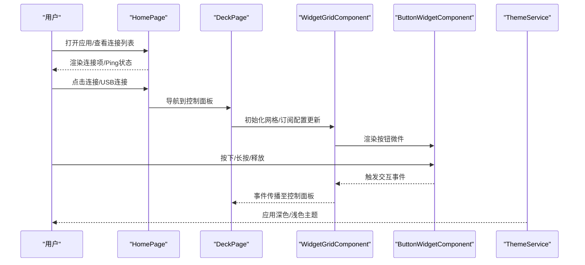
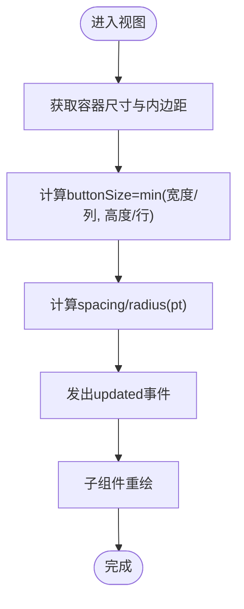
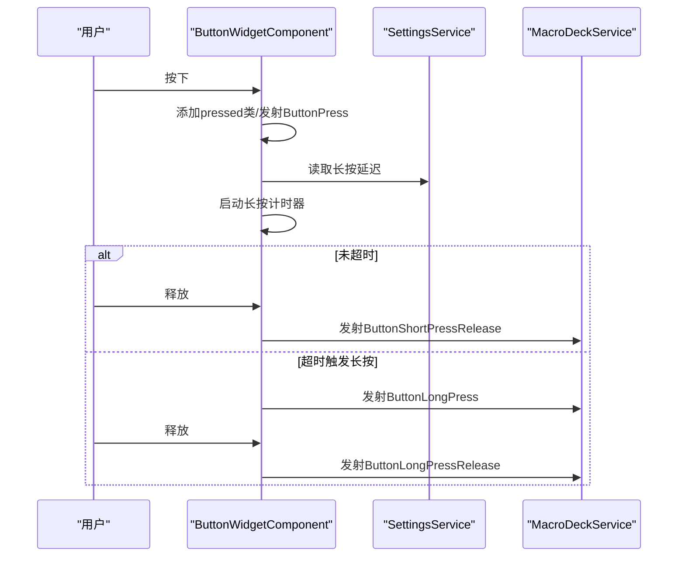
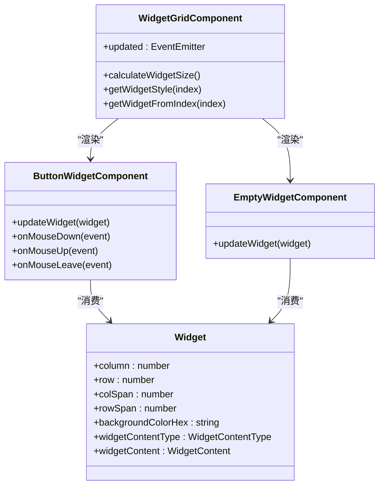

# 用户界面组件

<cite>
**本文档引用的文件**
- [src/app/pages/deck/deck.page.ts](file://src/app/pages/deck/deck.page.ts)
- [src/app/pages/home/home.page.ts](file://src/app/pages/home/home.page.ts)
- [src/app/pages/home/home.page.html](file://src/app/pages/home/home.page.html)
- [src/app/pages/deck/widget-grid/widget-grid.component.ts](file://src/app/pages/deck/widget-grid/widget-grid.component.ts)
- [src/app/pages/deck/widget-grid/widget-grid.component.scss](file://src/app/pages/deck/widget-grid/widget-grid.component.scss)
- [src/app/widget-content-components/button-widget/button-widget.component.ts](file://src/app/widget-content-components/button-widget/button-widget.component.ts)
- [src/app/widget-content-components/button-widget/button-widget.component.scss](file://src/app/widget-content-components/button-widget/button-widget.component.scss)
- [src/app/widget-content-components/empty-widget/empty-widget.component.ts](file://src/app/widget-content-components/empty-widget/empty-widget.component.ts)
- [src/app/widget-content-components/empty-widget/empty-widget.component.scss](file://src/app/widget-content-components/empty-widget/empty-widget.component.scss)
- [src/app/widget-content-components/widget-content-components.module.ts](file://src/app/widget-content-components/widget-content-components.module.ts)
- [src/app/datatypes/widgets/widget.ts](file://src/app/datatypes/widgets/widget.ts)
- [src/app/enums/widget-interaction-type.ts](file://src/app/enums/widget-interaction-type.ts)
- [src/app/enums/widget-content-type.ts](file://src/app/enums/widget-content-type.ts)
- [src/app/services/theme/theme.service.ts](file://src/app/services/theme/theme.service.ts)
- [src/app/enums/appearance-type.ts](file://src/app/enums/appearance-type.ts)
- [src/theme/variables.scss](file://src/theme/variables.scss)
- [src/assets/i18n/en.json](file://src/assets/i18n/en.json)
- [src/assets/i18n/zh.json](file://src/assets/i18n/zh.json)
</cite>

## 更新摘要
**变更内容**
- 更新了HomePage组件中捐赠按钮功能的状态说明，明确指出捐赠按钮功能已被临时禁用
- 补充了捐赠按钮功能的实现细节，包括showDonateButton()方法的当前状态和未来激活预留逻辑
- 更新了相关章节以反映这一重要的UI变更

## 目录
1. [简介](#简介)
2. [项目结构](#项目结构)
3. [核心组件](#核心组件)
4. [架构总览](#架构总览)
5. [组件详解](#组件详解)
6. [依赖关系分析](#依赖关系分析)
7. [性能考量](#性能考量)
8. [故障排查指南](#故障排查指南)
9. [结论](#结论)
10. [附录](#附录)

## 简介
本文件面向Macro-Deck-Client-App的用户界面组件系统，系统化梳理页面组件、微件组件与弹窗组件的分类与职责，深入解析DeckPage控制面板、HomePage主页面、ButtonWidget按钮微件、EmptyWidget空白微件等核心组件的功能边界、属性配置、事件处理与样式定制。同时覆盖响应式布局、主题系统、动画效果与组件间组合复用策略，帮助开发者高效理解与扩展UI体系。

## 项目结构
UI相关代码主要分布在以下层次：
- 页面层：DeckPage（控制面板）、HomePage（主页面）
- 微件网格层：WidgetGridComponent（网格布局与尺寸计算）
- 微件内容层：ButtonWidgetComponent、EmptyWidgetComponent（具体微件渲染）
- 数据与枚举：Widget接口、WidgetContentType、WidgetInteractionType
- 主题与样式：ThemeService、variables.scss
- 模块：WidgetContentComponentsModule（微件内容模块）

**图表来源**
- [src/app/pages/home/home.page.ts:1-322](file://src/app/pages/home/home.page.ts#L1-L322)
- [src/app/pages/deck/deck.page.ts:1-158](file://src/app/pages/deck/deck.page.ts#L1-L158)
- [src/app/pages/deck/widget-grid/widget-grid.component.ts:1-335](file://src/app/pages/deck/widget-grid/widget-grid.component.ts#L1-L335)
- [src/app/widget-content-components/button-widget/button-widget.component.ts:1-393](file://src/app/widget-content-components/button-widget/button-widget.component.ts#L1-L393)
- [src/app/widget-content-components/empty-widget/empty-widget.component.ts:1-57](file://src/app/widget-content-components/empty-widget/empty-widget.component.ts#L1-L57)
- [src/app/services/theme/theme.service.ts:1-104](file://src/app/services/theme/theme.service.ts#L1-L104)
- [src/theme/variables.scss:1-242](file://src/theme/variables.scss#L1-L242)

**章节来源**
- [src/app/pages/home/home.page.ts:1-322](file://src/app/pages/home/home.page.ts#L1-L322)
- [src/app/pages/deck/deck.page.ts:1-158](file://src/app/pages/deck/deck.page.ts#L1-L158)
- [src/app/pages/deck/widget-grid/widget-grid.component.ts:1-335](file://src/app/pages/deck/widget-grid/widget-grid.component.ts#L1-L335)
- [src/app/widget-content-components/button-widget/button-widget.component.ts:1-393](file://src/app/widget-content-components/button-widget/button-widget.component.ts#L1-L393)
- [src/app/widget-content-components/empty-widget/empty-widget.component.ts:1-57](file://src/app/widget-content-components/empty-widget/empty-widget.component.ts#L1-L57)
- [src/app/services/theme/theme.service.ts:1-104](file://src/app/services/theme/theme.service.ts#L1-L104)
- [src/theme/variables.scss:1-242](file://src/theme/variables.scss#L1-L242)

## 核心组件
- 页面组件
  - HomePage：负责服务器连接列表管理、Ping可用性检测、连接操作、设置弹窗、捐赠入口等。
  - DeckPage：控制面板页面，负责WebSocket连接检查、设置弹窗、全屏模式、菜单按钮可见性等。
- 微件网格组件
  - WidgetGridComponent：根据容器尺寸与行列配置动态计算按钮尺寸、间距、圆角，并生成微件定位样式；提供空白占位逻辑。
- 微件内容组件
  - ButtonWidgetComponent：渲染按钮前景/图标/背景，处理按下/短按释放/长按/长按释放交互，支持边框样式与颜色调整。
  - EmptyWidgetComponent：渲染空白占位微件背景色。
- 数据与枚举
  - Widget接口：描述微件位置、尺寸、背景色、内容类型与具体数据。
  - WidgetContentType：empty/button。
  - WidgetInteractionType：press/short-release/long-press/long-release。

**章节来源**
- [src/app/pages/home/home.page.ts:1-322](file://src/app/pages/home/home.page.ts#L1-L322)
- [src/app/pages/deck/deck.page.ts:1-158](file://src/app/pages/deck/deck.page.ts#L1-L158)
- [src/app/pages/deck/widget-grid/widget-grid.component.ts:1-335](file://src/app/pages/deck/widget-grid/widget-grid.component.ts#L1-L335)
- [src/app/widget-content-components/button-widget/button-widget.component.ts:1-393](file://src/app/widget-content-components/button-widget/button-widget.component.ts#L1-L393)
- [src/app/widget-content-components/empty-widget/empty-widget.component.ts:1-57](file://src/app/widget-content-components/empty-widget/empty-widget.component.ts#L1-L57)
- [src/app/datatypes/widgets/widget.ts:1-33](file://src/app/datatypes/widgets/widget.ts#L1-L33)
- [src/app/enums/widget-content-type.ts:1-12](file://src/app/enums/widget-content-type.ts#L1-L12)
- [src/app/enums/widget-interaction-type.ts:1-18](file://src/app/enums/widget-interaction-type.ts#L1-L18)

## 架构总览
UI组件采用"页面层-网格层-内容层"的分层设计，页面组件负责业务流程与弹窗调度，网格组件负责布局与尺寸计算，内容组件负责具体渲染与交互。主题系统通过ThemeService与CSS变量实现深色/浅色/跟随系统三种模式。

**图表来源**
- [src/app/pages/home/home.page.ts:1-322](file://src/app/pages/home/home.page.ts#L1-L322)
- [src/app/pages/deck/deck.page.ts:1-158](file://src/app/pages/deck/deck.page.ts#L1-L158)
- [src/app/pages/deck/widget-grid/widget-grid.component.ts:1-335](file://src/app/pages/deck/widget-grid/widget-grid.component.ts#L1-L335)
- [src/app/widget-content-components/button-widget/button-widget.component.ts:1-393](file://src/app/widget-content-components/button-widget/button-widget.component.ts#L1-L393)
- [src/app/services/theme/theme.service.ts:1-104](file://src/app/services/theme/theme.service.ts#L1-L104)

## 组件详解

### 页面组件：HomePage（主页面）
- 职责
  - 管理已保存连接列表与可用连接列表，支持拖拽重排、编辑、删除。
  - 启动/停止Ping检测，自动连接USB或已保存连接。
  - 通过模态弹窗管理连接（新增/编辑/失败提示/扫描QR）。
  - 打开设置弹窗并重启Ping以应用新配置。
  - 提供捐赠入口（**已临时禁用**，当前始终不显示）。
- 关键交互
  - 连接可用/不可用事件订阅与处理。
  - WebSocket连接关闭后重启Ping。
  - 快速设置深度链接扫描触发新增连接弹窗。
- 属性与事件
  - 输入：无（内部通过服务注入）
  - 输出：无（通过服务与路由进行导航与弹窗）
- 最佳实践
  - 在页面离开时停止Ping与取消订阅，避免内存泄漏。
  - 弹窗关闭后统一通过onWillDismiss读取结果并持久化。

**更新** 捐赠按钮功能当前已被临时禁用。虽然showDonateButton()方法保留了原有的iOS平台兼容性注释（//return !this.diagnosticsService.isiOS();），但实际实现已改为永久返回false。该方法为未来重新激活捐赠功能预留了底层逻辑，开发者可以随时移除return false语句来恢复捐赠按钮的显示。

**章节来源**
- [src/app/pages/home/home.page.ts:1-322](file://src/app/pages/home/home.page.ts#L1-L322)
- [src/app/pages/home/home.page.html:110-122](file://src/app/pages/home/home.page.html#L110-L122)

### 页面组件：DeckPage（控制面板）
- 职责
  - 检查WebSocket连接状态，未连接则返回首页。
  - 展示客户端ID与版本号。
  - 打开设置弹窗并重新加载设置（菜单按钮可见性）。
  - 进入全屏模式。
- 关键交互
  - 连接状态检查与导航。
  - 设置弹窗生命周期管理。
  - 全屏请求。
- 属性与事件
  - showMenuButton：菜单按钮可见性。
  - clientId/version：展示信息。
- 最佳实践
  - 在页面进入时加载设置，避免UI闪烁。
  - 全屏模式需考虑平台差异与权限。

**章节来源**
- [src/app/pages/deck/deck.page.ts:1-158](file://src/app/pages/deck/deck.page.ts#L1-L158)

### 微件网格组件：WidgetGridComponent
- 职责
  - 动态计算按钮尺寸、间距与圆角，保证正方形按钮与居中布局。
  - 生成微件定位样式（绝对定位+跨行列span）。
  - 提供空白占位微件（当网格位置无数据时）。
  - 暴露updated事件用于通知子组件重绘。
- 关键算法
  - 根据容器宽高与行列数计算buttonSize，取X/Y方向最小值。
  - pt与px换算（72/96）应用于spacing与radius。
  - getWidgetStyle根据行列与colSpan/rowSpan计算绝对定位。
- 性能要点
  - resize事件加防抖延迟（100ms）再计算。
  - 初始延迟1秒确保视图渲染完成后再计算。
- 最佳实践
  - 子组件订阅updated事件以响应布局变化。
  - 使用ApplicationRef.tick手动触发变更检测。

**图表来源**
- [src/app/pages/deck/widget-grid/widget-grid.component.ts:88-116](file://src/app/pages/deck/widget-grid/widget-grid.component.ts#L88-L116)

**章节来源**
- [src/app/pages/deck/widget-grid/widget-grid.component.ts:1-335](file://src/app/pages/deck/widget-grid/widget-grid.component.ts#L1-L335)
- [src/app/pages/deck/widget-grid/widget-grid.component.scss:1-34](file://src/app/pages/deck/widget-grid/widget-grid.component.scss#L1-L34)

### 微件内容组件：ButtonWidgetComponent（按钮微件）
- 职责
  - 渲染前景图（标签）、图标与背景色。
  - 处理按下/短按释放/长按/长按释放交互，发射对应事件。
  - 根据设置应用边框样式（无/彩色）与圆角。
  - 基于背景色动态计算边框颜色。
- 交互流程
  - 按下：添加pressed类，发射ButtonPress，启动长按计时器。
  - 释放：根据是否触发长按分别发射短按/长按释放，清理计时器。
  - 长按：超过阈值后发射ButtonLongPress。
- 样式与动画
  - 按下缩放0.9，释放过渡0.4s线性。
  - 背景色过渡0.3s。
- 最佳实践
  - 使用Renderer2安全地增删CSS类。
  - 通过SettingsService读取长按延迟与边框样式。
  - 订阅WidgetGridComponent.updated与SettingsModalComponent.settingsApplied以响应全局设置变化。

**图表来源**
- [src/app/widget-content-components/button-widget/button-widget.component.ts:125-184](file://src/app/widget-content-components/button-widget/button-widget.component.ts#L125-L184)
- [src/app/enums/widget-interaction-type.ts:1-18](file://src/app/enums/widget-interaction-type.ts#L1-L18)

**章节来源**
- [src/app/widget-content-components/button-widget/button-widget.component.ts:1-393](file://src/app/widget-content-components/button-widget/button-widget.component.ts#L1-L393)
- [src/app/widget-content-components/button-widget/button-widget.component.scss:1-52](file://src/app/widget-content-components/button-widget/button-widget.component.scss#L1-L52)

### 微件内容组件：EmptyWidgetComponent（空白微件）
- 职责
  - 渲染空白占位微件背景色。
  - 作为网格中无数据时的默认占位。
- 最佳实践
  - 保持最小实现，仅设置背景色，避免多余DOM节点。

**章节来源**
- [src/app/widget-content-components/empty-widget/empty-widget.component.ts:1-57](file://src/app/widget-content-components/empty-widget/empty-widget.component.ts#L1-L57)
- [src/app/widget-content-components/empty-widget/empty-widget.component.scss:1-24](file://src/app/widget-content-components/empty-widget/empty-widget.component.scss#L1-L24)

### 数据模型与枚举
- Widget接口
  - 描述微件在网格中的行列位置、跨行列跨度、背景色、内容类型与具体内容数据。
- WidgetContentType
  - empty/button。
- WidgetInteractionType
  - press/short-release/long-press/long-release。

**章节来源**
- [src/app/datatypes/widgets/widget.ts:1-33](file://src/app/datatypes/widgets/widget.ts#L1-L33)
- [src/app/enums/widget-content-type.ts:1-12](file://src/app/enums/widget-content-type.ts#L1-L12)
- [src/app/enums/widget-interaction-type.ts:1-18](file://src/app/enums/widget-interaction-type.ts#L1-L18)

### 主题系统与样式
- ThemeService
  - 支持跟随系统、强制深色、强制浅色三种模式。
  - 注册/注销系统深色模式媒体查询监听。
- CSS变量与深色主题
  - 通过variables.scss定义Ionic颜色变量与深色主题覆盖。
  - iOS与Material Design两套深色主题变量。
- 响应式与动画
  - 网格组件使用pt单位进行间距与圆角换算，适配不同DPR。
  - 按钮微件使用transform与transition实现流畅动画。

**章节来源**
- [src/app/services/theme/theme.service.ts:1-104](file://src/app/services/theme/theme.service.ts#L1-L104)
- [src/app/enums/appearance-type.ts:1-15](file://src/app/enums/appearance-type.ts#L1-L15)
- [src/theme/variables.scss:1-242](file://src/theme/variables.scss#L1-L242)

## 依赖关系分析
- 组件耦合
  - ButtonWidgetComponent依赖WidgetGridComponent的静态属性（borderRadiusPoints）与updated事件。
  - WidgetGridComponent依赖MacroDeckService提供的rows/columns/widgets等配置。
  - HomePage/DeckPage通过服务与弹窗控制器管理业务流程。
- 模块组织
  - WidgetContentComponentsModule统一导出按钮与空白微件，并引入触摸事件模块。

**图表来源**
- [src/app/pages/deck/widget-grid/widget-grid.component.ts:1-335](file://src/app/pages/deck/widget-grid/widget-grid.component.ts#L1-L335)
- [src/app/widget-content-components/button-widget/button-widget.component.ts:1-393](file://src/app/widget-content-components/button-widget/button-widget.component.ts#L1-L393)
- [src/app/widget-content-components/empty-widget/empty-widget.component.ts:1-57](file://src/app/widget-content-components/empty-widget/empty-widget.component.ts#L1-L57)
- [src/app/datatypes/widgets/widget.ts:1-33](file://src/app/datatypes/widgets/widget.ts#L1-L33)

**章节来源**
- [src/app/widget-content-components/widget-content-components.module.ts:1-42](file://src/app/widget-content-components/widget-content-components.module.ts#L1-L42)

## 性能考量
- 布局计算
  - resize事件延迟100ms再计算，减少频繁重排。
  - 初始延迟1秒确保视图渲染完成。
- 渲染优化
  - 使用transform与translateZ(0)提升合成层性能。
  - 按钮微件使用极短过渡时间（0.01s）与scale变换，保证触控反馈即时。
- 内存管理
  - 页面离开时停止Ping与取消订阅。
  - 组件销毁时取消所有订阅，避免内存泄漏。

## 故障排查指南
- 连接失败弹窗
  - HomePage在WebSocket连接失败时弹出错误弹窗，包含连接名称与错误信息。
- 全屏模式无效
  - 检查浏览器/平台对requestFullscreen的支持与权限。
- 按钮无响应
  - 确认WidgetGridComponent已发出updated事件且子组件已订阅。
  - 检查SettingsService的长按延迟与边框样式设置。
- 深色主题不生效
  - 确认ThemeService.updateTheme被调用且AppearanceType设置正确。
  - 检查CSS变量覆盖是否被其他样式覆盖。
- **捐赠按钮不显示**
  - **已知问题**：捐赠按钮功能当前已被临时禁用，showDonateButton()方法永久返回false。
  - 如需重新启用，可移除showDonateButton()方法中的return false语句。

**章节来源**
- [src/app/pages/home/home.page.ts:295-321](file://src/app/pages/home/home.page.ts#L295-L321)
- [src/app/services/theme/theme.service.ts:20-39](file://src/app/services/theme/theme.service.ts#L20-L39)

## 结论
本UI组件系统通过清晰的分层与职责划分，实现了从页面到网格再到微件内容的完整渲染链路。配合主题系统与响应式布局，既保证了良好的用户体验，也为后续扩展（新增微件类型、交互行为、动画效果）提供了稳定的基础。

**重要说明**：捐赠按钮功能目前处于临时禁用状态，这是为了未来重新激活预留的底层逻辑。开发者可以根据需要随时恢复该功能。

## 附录
- 使用示例与最佳实践
  - 新增微件类型：在WidgetContentComponentsModule中注册新组件，并在WidgetGridComponent中根据WidgetContentType选择渲染。
  - 自定义交互：在ButtonWidgetComponent中扩展emitInteraction分支，向MacroDeckService传递新的交互类型。
  - 主题扩展：在variables.scss中新增颜色变量，并在ThemeService中根据AppearanceType应用。
  - 动画优化：保持按钮微件的transform与transition简短，避免影响触控反馈。
  - **捐赠按钮恢复**：如需重新启用捐赠按钮，只需移除HomePage中showDonateButton()方法的return false语句，即可恢复其显示功能。
- 响应式设计
  - 使用pt单位进行间距与圆角换算，适配不同DPR。
  - 网格组件在resize时延迟计算，避免频繁重排。
- 组合与复用
  - 通过模块化导入与事件总线（updated、settingsApplied）实现组件解耦与复用。
  - Widget接口抽象统一了微件的数据结构，便于扩展与维护。
- **国际化支持**
  - 捐赠按钮文本已在国际化文件中提供英文"Donate"和中文"捐赠"翻译。
  - 当捐赠按钮功能重新启用时，将自动使用相应的本地化文本。

**章节来源**
- [src/assets/i18n/en.json:61](file://src/assets/i18n/en.json#L61)
- [src/assets/i18n/zh.json:61](file://src/assets/i18n/zh.json#L61)